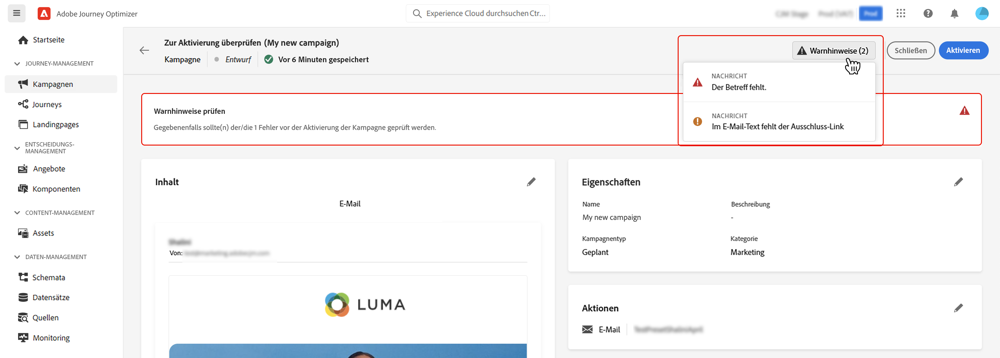
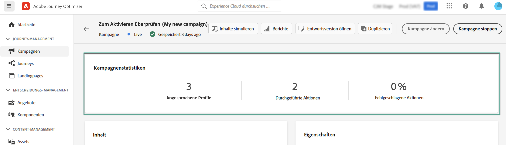

# Überprüfen und Aktivieren einer Kampagne {#review-activate}

Nachdem die Kampagne konfiguriert wurde, müssen Sie ihre Parameter und Inhalte überprüfen, bevor Sie sie aktivieren. Gehen Sie dazu wie folgt vor:

1. Klicken Sie im Konfigurationsbildschirm der Kampagne auf **[!UICONTROL Zum Aktivieren überprüfen]**, um eine Zusammenfassung der Kampagne anzuzeigen.

   In der Zusammenfassung können Sie die Kampagne bei Bedarf ändern und überprüfen, ob ein Parameter falsch ist oder fehlt.

   >[!IMPORTANT]
   >
   >Bei Fehlern können Sie die Kampagne nicht aktivieren. Beheben Sie die Fehler, bevor Sie fortfahren.

   

1. Vergewissern Sie sich, dass Ihre Kampagne korrekt konfiguriert ist, und klicken Sie dann auf **[!UICONTROL Aktivieren]**.

1. Die Kampagne ist jetzt aktiviert. Ihr Status ist **[!UICONTROL Live]** oder, wenn Sie ein Startdatum eingegeben haben, **[!UICONTROL Geplant]**. [Weitere Informationen zum Kampagnenstatus](get-started-with-campaigns.md#statuses).

   Die in der Kampagne konfigurierte Nachricht wird sofort oder zum angegebenen Datum versendet.

   >[!NOTE]
   >
   >Der Status **[!UICONTROL Abgeschlossen]** wird einer Kampagne automatisch 3 Tage nach ihrer Aktivierung zugewiesen oder am Enddatum der Kampagne, wenn es sich um eine wiederkehrende Ausführung handelt.
   >
   >Wenn kein Enddatum angegeben wurde, behält die Kampagne den Status **[!UICONTROL Live]**. Um ihn zu ändern, müssen Sie die Kampagne manuell anhalten. [Informationen zum Stoppen einer Kampagne](modify-stop-campaign.md)

1. Nach der Aktivierung einer Kampagne können Sie jederzeit ihre Informationen überprüfen, indem Sie sie öffnen. In der Zusammenfassung finden Sie Statistiken über die Anzahl der Zielgruppenprofile sowie der bereitgestellten und fehlgeschlagenen Aktionen.

   Sie können auch zusätzliche Statistiken in speziellen Berichten einsehen, indem Sie auf die Schaltfläche **[!UICONTROL Berichte]** klicken. [Weitere Informationen](../reports/campaign-global-report.md)

   
