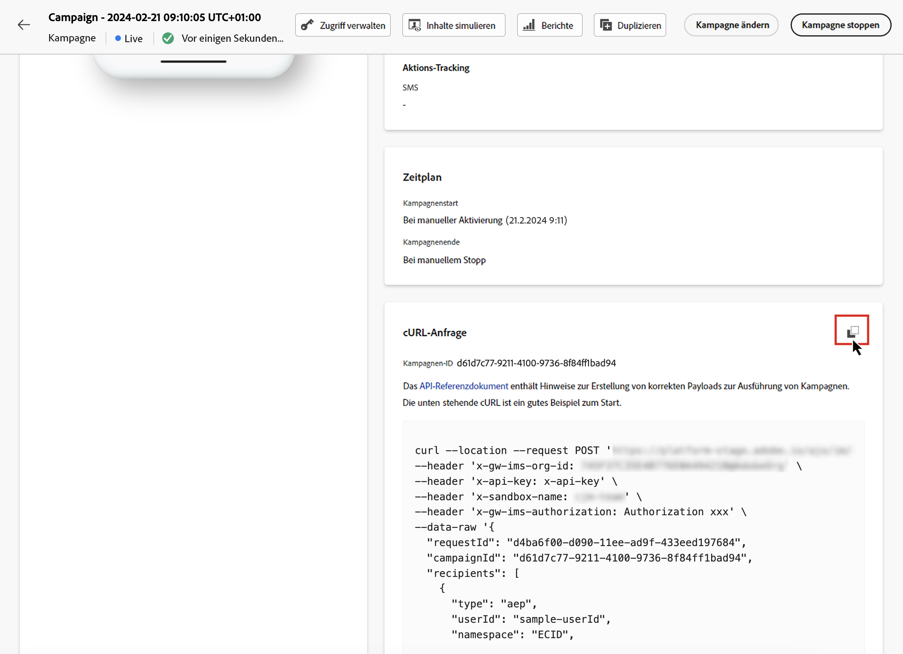

# Ausführen einer Kampagne, die durch API ausgelöst wird {#execute}

Nachdem Ihre Kampagne aktiviert wurde, müssen Sie die generierte Beispiel-cURL-Anfrage abrufen und im API verwenden, um Ihre Payload zu erstellen und die Kampagne auszulösen.

## Wichtige Informationen {#must-read}

* **Start- und Enddatum einer Kampagne** – Wenn Sie bei der Erstellung der Kampagne ein bestimmtes Start- und/oder Enddatum konfiguriert haben, wird die Kampagne außerhalb dieses Zeitraums nicht ausgeführt und API-Aufrufe schlagen fehl.

* **Aufrufzeitüberschreitung** – Der Aufruf der REST-API zur Ausführung interaktiver Nachrichten hat einen Zeitüberschreitungswert von 60 Sekunden. Im Falle unerwarteter Zeitüberschreitungen gibt es jedoch interne erneute Zustellversuche, um den Versand zu gewährleisten.

## Auslösen der Kampagne {#trigger}

1. Öffnen Sie die Kampagne, kopieren Sie dann die Payload-Anfrage aus dem Abschnitt **[!UICONTROL cURL-Anfrage]** und fügen Sie diese ein. Diese Payload enthält nun alle Personalisierungsvariablen (Profil und Kontext), die in der Nachricht verwendet werden. Sie ist verfügbar, sobald die Kampagne aktiv ist.

   

   >[!IMPORTANT]
   >
   >Die Endpunkte im cURL-Abschnitt unterscheiden sich zwischen standardmäßigen Kampagnen und [Kampagnen mit hohem Durchsatz](../campaigns/api-triggered-high-throughput.md).

1. Verwenden Sie diese cURL-Anfrage in den APIs, um Ihre Payload zu erstellen und die Kampagne auszulösen. Weitere Informationen finden Sie in der [Dokumentation zur Interactive Message Execution-API](https://developer.adobe.com/journey-optimizer-apis/references/messaging/#tag/execution), wo alle Endpunkte für standardmäßige Kampagnen und Kampagnen mit hohem Durchsatz aufgelistet sind.

   Beispiele für API-Aufrufe finden Sie auch auf [dieser Seite](https://developer.adobe.com/journey-optimizer-apis/references/messaging-samples/).

## Fehlerbehebung {#troubleshooting}

### Verzögerungen beim E-Mail-Versand {#delivery-delays}

Wenn die E-Mail-Versandzeiten die Erwartungen übertreffen, untersuchen Sie potenzielle Ausfälle oder Leistungsprobleme mit externen Services, wie Cloud-Infrastrukturanbietern oder E-Mail-Dienstanbietern. Journey Optimizer protokolliert Abfahrtszeitstempel von Nachrichten, mit denen festgestellt werden kann, ob in nachgelagerten Bereichen der Versand-Pipeline Verzögerungen aufgetreten sind.

### Azure Cosmos DB-Authentifizierungsfehler (500 Internal Server Error) {#cosmosdb-auth-errors}

Wenn beim Auslösen von durch API ausgelösten Kampagnen Fehler des Typs **500 Internal Server Error** auftreten und die Systemprotokolle einen **403 Forbidden**-Fehler von Azure Cosmos DB mit einer Meldung wie der folgenden zeigen:

_„Access to your account is currently revoked because the Azure Cosmos DB service is unable to obtain the AAD authentication token for the account&#39;s default identity“_

Dieser Fehler tritt normalerweise auf, wenn der für die Cosmos DB-Authentifizierung erforderliche Azure-Service-Prinzipal deaktiviert, gelöscht oder falsch konfiguriert wurde.

+++Problembehebung

1. **Prüfen Sie den Azure-Service-Prinzipal**: Stellen Sie sicher, dass Ihr Azure-Service-Prinzipal oder Ihre verwaltete Identität aktiviert ist und in Ihrem Azure Active Directory nicht deaktiviert oder gelöscht wurde.

1. **Prüfen Sie Berechtigungen**: Vergewissern Sie sich, dass der Service-Prinzipal über die erforderlichen Berechtigungen zum Zugriff auf die Ressourcen für den Azure Key Vault und Cosmos DB verfügt. Der Service-Prinzipal muss über geeignete Rollenzuweisungen verfügen, damit die Authentifizierung bei Azure Cosmos DB möglich ist.

1. **Prüfen Sie die Konfiguration von Azure Cosmos DB CMK**: Wenn Sie kundenseitig verwaltete Schlüssel (CMK) verwenden, finden Sie im [Leitfaden zur Fehlerbehebung bei Azure Cosmos DB CMK](https://learn.microsoft.com/de-de/azure/cosmos-db/cmk-troubleshooting-guide#azure-active-directory-token-acquisition-error){target="_blank"} detaillierte Schritte zur Wiederherstellung der AAD-Token-Akquise.

1. **Aktivieren Sie erneut und testen Sie**: Nach der Korrektur der Konfiguration müssen Sie den Service-Prinzipal erneut aktivieren, falls er deaktiviert war, und Ihre transaktionalen Kampagnen-API-Aufrufe erneut testen, um zu prüfen, ob die Authentifizierung erfolgreich ist und Nachrichten gesendet werden.

>[!NOTE]
>
>Dieses Problem tritt normalerweise aufgrund einer Fehlkonfiguration oder einer versehentlichen Deaktivierung des Azure-Service-Prinzipals auf, der für die Cosmos DB-Authentifizierung erforderlich ist. Wenn Sie dafür sorgen, dass der Service-Prinzipal aktiviert und ordnungsgemäß konfiguriert bleibt, tritt dieser Fehler künftig nicht mehr auf.

+++
