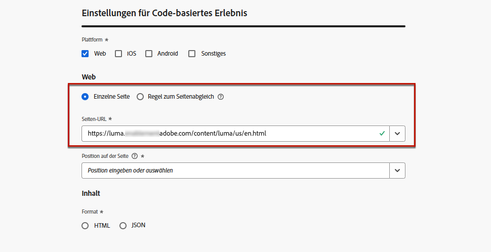
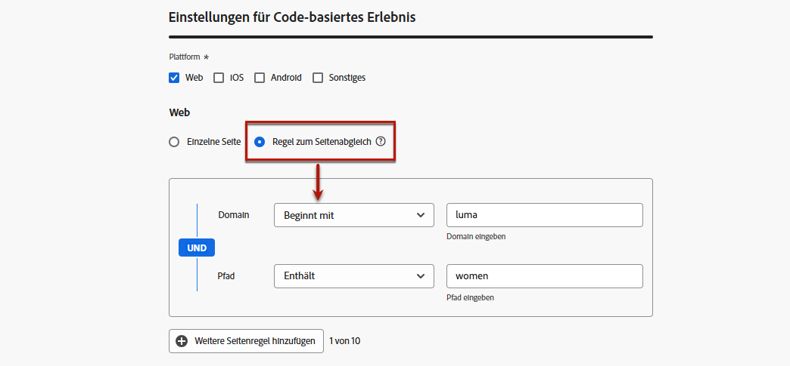
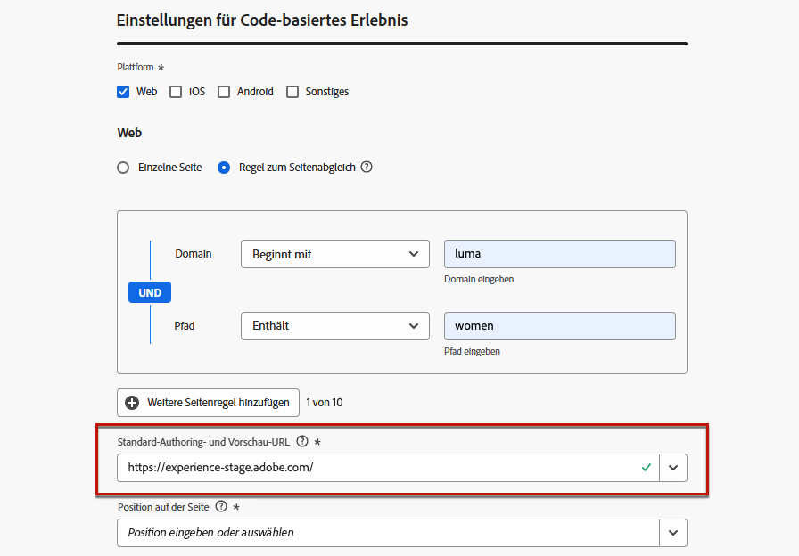
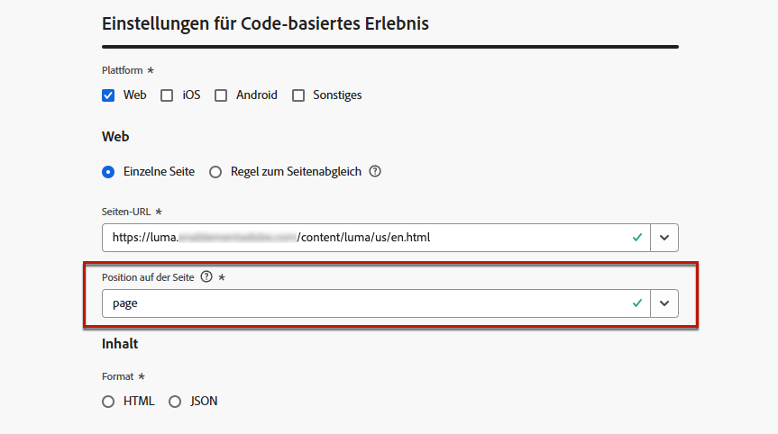
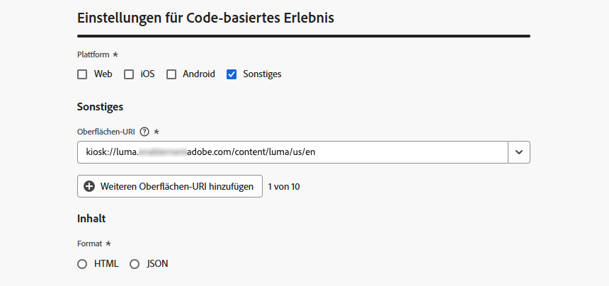

# Konfigurieren des Code-basierten Erlebnisses {#code-based-configuration}

>[!CONTEXTUALHELP]
>id="ajo_code_based_surface"
>title="Definieren einer Konfiguration von Code-basierten Erlebnissen"
>abstract="Eine Code-basierte Konfiguration definiert den Pfad und Speicherort in Ihrer Anwendung, der durch einen URI in der Anwendungsimplementierung eindeutig identifiziert wird und an dem der Inhalt bereitgestellt und verwendet wird."

Bevor Sie [Ihr Erlebnis erstellen](create-code-based.md), müssen Sie eine code-basierte Erlebniskonfiguration erstellen, in der Sie definieren, wo die Inhalte in Ihrer Anwendung bereitgestellt und genutzt werden.

Eine code-basierte Erlebniskonfiguration muss auf die Oberfläche verweisen, die im Wesentlichen der Ort ist, an dem Sie Ihre Änderungen rendern möchten. Je nach ausgewählter Plattform müssen Sie einen Standort/Pfad oder den vollständigen URI für die Oberfläche eingeben. [Weitere Informationen](#surface-definition)

## Definieren einer Konfiguration von Code-basierten Erlebnissen {#create-code-based-configuration}

>[!CONTEXTUALHELP]
>id="ajo_admin_location"
>title="Bestimmten Ort innerhalb Ihrer Seite oder App angeben"
>abstract="Dieses Feld gibt das genaue Ziel innerhalb einer Seite oder innerhalb der App an, auf das Benutzer zugreifen sollen. Es kann sich um einen bestimmten Abschnitt innerhalb einer Webseite oder eine Seite innerhalb der Navigationsstruktur der App handeln."

>[!CONTEXTUALHELP]
>id="ajo_admin_default_mobile_url"
>title="Definieren einer URL für die Inhaltserstellung und -vorschau"
>abstract="Dieses Feld stellt sicher, dass die von der Regel generierten oder abgeglichenen Seiten über eine bestimmte URL verfügen, die sowohl für die effektive Erstellung als auch Vorschau von Inhalten erforderlich ist."

Gehen Sie wie folgt vor, um eine code-basierte Erlebniskanalkonfiguration zu erstellen:

1. Rufen Sie das Menü **[!UICONTROL Kanäle]** > **[!UICONTROL Allgemeine Einstellungen]** > **[!UICONTROL Kanalkonfigurationen]** auf, und klicken Sie dann auf **[!UICONTROL Kanalkonfiguration erstellen]**.

   

1. Geben Sie einen Namen und eine Beschreibung (optional) für die Konfiguration an.

   >[!NOTE]
   >
   > Namen müssen mit einem Buchstaben (A–Z) beginnen. Ein Name darf nur alphanumerische Zeichen enthalten. Sie können auch die Zeichen Unterstrich `_`, Punkt `.` und Bindestrich `-` verwenden.

1. Um der Konfiguration benutzerdefinierte oder grundlegende Datennutzungskennzeichnungen zuzuweisen, können Sie **[!UICONTROL Zugriff verwalten]** auswählen. [Weitere Informationen zur Zugriffssteuerung auf Objektebene (OLAC)](../administration/object-based-access.md)

1. Wählen Sie eine **[!UICONTROL Marketing-Aktion]** aus, um Einverständnisrichtlinien mit den Nachrichten zu verknüpfen, die diese Konfiguration verwenden. Es werden alle mit dieser Marketing-Aktion verknüpften Einverständnisrichtlinien genutzt, um die Voreinstellungen Ihrer Kundinnen und Kunden zu respektieren. [Weitere Informationen](../action/consent.md#surface-marketing-actions)

1. Wählen Sie den Kanal **Code-basiertes Erlebnis** aus.

   

1. Wählen Sie die Plattform aus, auf die das code-basierte Erlebnis angewendet werden soll:

   * [Web](#web)
   * [iOS und/oder Android](#mobile)
   * [Sonstiges](#other)

   >[!NOTE]
   >
   >Sie können mehrere Plattformen auswählen. Bei der Auswahl mehrerer Plattformen wird der Inhalt für alle ausgewählten Seiten oder Apps bereitgestellt.

1. Wählen Sie das Format aus, das von der Anwendung für diesen bestimmten Speicherort erwartet wird. Dies wird beim Authoring des Code-basierten Erlebnisses in Kampagnen und Journeys verwendet.

   

1. Klicken Sie auf **[!UICONTROL Senden]** , um Ihre Änderungen zu speichern.

Sie können diese Konfiguration jetzt beim [ Erstellen eines code-basierten Erlebnisses](create-code-based.md) in Ihren Kampagnen und Journey auswählen.

>[!NOTE]
>
>Ihr App-Implementierungsteam ist dafür verantwortlich, explizite API- oder SDK-Aufrufe durchzuführen, um Inhalte für die Oberflächen abzurufen, die in der ausgewählten code-basierten Erlebniskonfiguration definiert sind. Weitere Informationen zu den verschiedenen Kundenimplementierungen finden Sie in [diesem Abschnitt](code-based-implementation-samples.md).

### Web-Plattformen {#web}

>[!CONTEXTUALHELP]
>id="ajo_admin_default_web_url"
>title="Definieren einer URL für die Inhaltserstellung und -vorschau"
>abstract="Dieses Feld stellt sicher, dass die von der Regel generierten oder abgeglichenen Seiten über eine bestimmte URL verfügen, die sowohl für die effektive Erstellung als auch Vorschau von Inhalten erforderlich ist."

Gehen Sie wie folgt vor, um die code-basierten Erlebniskonfigurationseinstellungen für Webplattformen zu definieren.

1. Wählen Sie eine der folgenden Optionen aus:

   * **[!UICONTROL Einzelseite]** - Wenn Sie die Änderungen ausschließlich auf eine Seite anwenden möchten, geben Sie eine **[!UICONTROL Seiten-URL]** ein.

     

   * **[!UICONTROL Seiten, die mit der Regel übereinstimmen]** - Um mehrere URLs als Ziel festzulegen, die derselben Regel entsprechen, erstellen Sie eine oder mehrere Regeln. [Weitere Informationen](../web/web-configuration.md#web-page-matching-rule)

     <!--This could be used to apply changes universally across a website, such as updating a hero banner across all pages or adding a top image to display on every product page.-->

     Wenn Sie beispielsweise Elemente bearbeiten möchten, die auf allen Damenproduktseiten Ihrer Luma-Website angezeigt werden, wählen Sie **[!UICONTROL Domain]** > **[!UICONTROL Beginnt mit]** > `luma` und **[!UICONTROL Seite]** > **[!UICONTROL Enthält]** > `women`.

     

1. Folgendes gilt für die Vorschau-URL:

   * Wenn eine einseitige URL eingegeben wird, wird diese URL für die Vorschau verwendet - es ist nicht erforderlich, eine andere URL einzugeben.
   * Wenn eine [Seite ausgewählt ist, die mit der Regel](../web/web-configuration.md#web-page-matching-rule) übereinstimmt, müssen Sie eine **[!UICONTROL Standard-Authoring- und Vorschau-URL]** eingeben, die für die Vorschau des Erlebnisses im Browser verwendet wird. [Weitere Informationen](../code-based/create-code-based.md#preview-on-device)

     

1. Das Feld **[!UICONTROL Position auf Seite]** gibt das genaue Ziel innerhalb der Seite an, auf die Benutzer zugreifen sollen. Es kann sich um einen bestimmten Abschnitt auf einer Seite innerhalb der Navigationsstruktur der Site handeln, z. B. &quot;Hero-Banner&quot;oder &quot;Produktleiste&quot;.

   

### Mobilplattformen (iOS und Android) {#mobile}

>[!CONTEXTUALHELP]
>id="ajo_admin_app_id"
>title="Angeben der App-ID"
>abstract="Geben Sie die App-ID für eine genaue Identifizierung und Konfiguration in der Betriebsumgebung der App an, um nahtlose Integration und Funktionalität sicherzustellen."

>[!CONTEXTUALHELP]
>id="ajo_admin_mobile_url_preview"
>title="Eingeben der URL, um Inhalte in der Vorschau anzuzeigen"
>abstract="Dieses Feld ist für die Aktivierung der Simulation und Vorschau Ihres Inhalts in Ihrer Anwendung direkt auf Ihrem Gerät erforderlich."

Gehen Sie wie folgt vor, um die code-basierten Erlebniskonfigurationseinstellungen für mobile Plattformen zu definieren.

1. Geben Sie Ihre **[!UICONTROL App-ID]** ein. Dies ermöglicht eine genaue Identifizierung und Konfiguration innerhalb der Betriebsumgebung der App und stellt eine nahtlose Integration und Funktionalität sicher.

1. Geben Sie den **[!UICONTROL Standort oder Pfad innerhalb der App]** an. Dieses Feld gibt das genaue Ziel innerhalb der App an, auf das Benutzer zugreifen sollen. Es kann sich um einen bestimmten Abschnitt oder eine bestimmte Seite innerhalb der Navigationsstruktur der App handeln, z. B. &quot;Hero-Banner&quot;oder &quot;Produktleiste&quot;.

   

1. Füllen Sie das Feld **[!UICONTROL Vorschau-URL]** aus, um die Vorschau auf dem Gerät zu aktivieren. Diese URL informiert den Vorschaudienst über die spezifische URL, die beim Auslösen der Vorschau auf dem Gerät verwendet werden soll. [Weitere Informationen](../code-based/create-code-based.md#preview-on-device)

   Die Vorschau-URL ist ein vom App-Entwickler in Ihrer App konfigurierter Deep-Link. Dadurch wird sichergestellt, dass alle URLs, die mit dem Deep-Link-Schema übereinstimmen, in der App und nicht in einem mobilen Webbrowser geöffnet werden. Wenden Sie sich an Ihren App-Entwickler, um das für Ihre App konfigurierte Deep-Link-Schema zu erhalten.

+++  Die folgenden Ressourcen können Ihnen beim Konfigurieren von Deep-Links für Ihre App-Implementierung helfen

   * Für Android:

      * [Erstellen von Deep-Links zum App-Kontext](https://developer.android.com/training/app-links/deep-linking)

   * Für iOS:

      * [Definieren eines benutzerdefinierten URL-Schemas für Ihre App](https://developer.apple.com/documentation/xcode/defining-a-custom-url-scheme-for-your-app)

      * [Unterstützung universeller Links in Ihrer App](https://developer.apple.com/documentation/xcode/supporting-universal-links-in-your-app)

+++

   >[!NOTE]
   >
   >Sollten bei der Vorschau des Erlebnisses Probleme auftreten, lesen Sie [diese Dokumentation](https://experienceleague.adobe.com/de/docs/experience-platform/assurance/troubleshooting#app-does-not-open-link).

### Andere Plattformen {#other}

Gehen Sie wie folgt vor, um die code-basierten Erlebniskonfigurationseinstellungen für andere Plattformen zu definieren (z. B. Videokonsolen, TV-verbundene Geräte, Smart TVs, Kiosks, ATMs, Sprachassistenten, IoT-Geräte usw.).

1. Wählen Sie &quot;**[!UICONTROL Sonstige]**&quot;als Plattform aus, wenn Ihre Implementierung nicht für Web, iOS oder Android geeignet ist oder wenn Sie bestimmte URIs abrufen müssen.

1. Geben Sie den **[!UICONTROL Oberflächen-URI]** ein. Ein Oberflächen-URI ist eine eindeutige Kennung, die der Entität entspricht, in der Sie Ihr Erlebnis bereitstellen möchten. [Weitere Informationen](#surface-definition)

   

   >[!CAUTION]
   >
   >Vergewissern Sie sich, dass Sie einen Oberflächen-URI eingeben, der mit dem in Ihrer eigenen Implementierung verwendeten übereinstimmt. Andernfalls können die Änderungen nicht bereitgestellt werden.

1. **[!UICONTROL Fügen Sie bei Bedarf einen weiteren Oberflächen-URI]** hinzu. Sie können bis zu 10 URIs hinzufügen.

   >[!NOTE]
   >
   >Beim Hinzufügen mehrerer URIs wird der Inhalt für alle aufgelisteten Komponenten bereitgestellt.

## Was ist eine Oberfläche? {#surface-definition}

>[!CONTEXTUALHELP]
>id="ajo_admin_surface_uri"
>title="Hinzufügen des Oberflächen-URI für Ihre Komponente"
>abstract="Wenn Ihre Implementierung nicht für Web, iOS oder Android geeignet ist oder Sie bestimmte URIs als Ziel auswählen müssen, geben Sie einen Oberflächen-URI ein, bei dem es sich um eine eindeutige Kennung handelt, die an die Entität weitergeleitet wird, bei der Sie Ihr Erlebnis bereitstellen möchten. Stellen Sie sicher, dass Sie einen Oberflächen-URI eingeben, der mit dem in Ihrer eigenen Implementierung verwendeten URI übereinstimmt."
>additional-url="https://experienceleague.adobe.com/en/docs/journey-optimizer/using/communication-channels/code-based-experience/code-based-configuration#other" text="Erstellen einer Konfiguration für ein Code-basiertes Erlebnis für andere Plattformen"

Ein code-basiertes Erlebnis **Oberfläche** ist eine Entität, die für Benutzer- oder Systeminteraktionen entwickelt wurde und durch einen **URI** eindeutig identifiziert wird. Die Oberfläche wird in der Implementierung der Anwendung angegeben und muss mit der in Ihrer Code-basierten Konfiguration des Erlebniskanals referenzierten Oberfläche übereinstimmen.

Eine Oberfläche kann auf jeder Hierarchieebene als Container mit einer vorhandenen Entität (Touchpoint) betrachtet werden.

* Dabei kann es sich um eine Webseite, eine Mobile App, eine Desktop-App, einen bestimmten Inhaltsspeicherort innerhalb einer größeren Entität (z. B. eine `div`) oder ein nicht standardmäßiges Anzeigemuster (z. B. ein Kiosk oder ein Desktop-Programm-Banner) handeln.<!--In retail, a kiosk is a digital display or small structure that businesses often place in high-traffic areas to engage customers.-->

* Für Nicht-Anzeigen oder abstrakte Anzeigen (z. B. für Dienste bereitgestellte JSON-Blobs) kann sie auch auf bestimmte Teile von Inhalts-Containern erweitert werden.

* Es kann sich auch um eine Platzhalteroberfläche handeln, die einer Vielzahl von Client-Oberflächendefinitionen entspricht (z. B. kann die Position eines Hero-Bilds auf jeder Seite Ihrer Website in einen Oberflächen-URI wie web://mydomain.com/*#hero_image übersetzt werden).

Beim Erstellen einer code-basierten Konfiguration eines Erlebniskanals haben Sie zwei Möglichkeiten, die Oberfläche entsprechend der ausgewählten Plattform anzugeben:

* Bei den Plattformen **[!UICONTROL Web]**, **[!UICONTROL iOS]** und **[!UICONTROL Android]** müssen Sie einen **Speicherort oder Pfad** eingeben, um die Oberfläche zusammenzustellen.

* Wenn die Plattform **[!UICONTROL Sonstige]** ist, müssen Sie den vollständigen **Oberflächen-URI** eingeben, wie in den Beispielen unten dargestellt.

Ein Oberflächen-URI dient als präziser Bezeichner, der innerhalb einer Anwendung zu unterschiedlichen Benutzeroberflächen-Elementen oder -Komponenten führt. Grundsätzlich besteht ein Oberflächen-URI aus mehreren Abschnitten:

1. **Typ**: Web, Mobile App, ATM, Kiosk, tvcd, Dienst
1. **Eigenschaft**: Seiten-URL oder App-Paket
1. **Container**: Speicherort auf der Seite/App-Aktivität

In der folgenden Tabelle sind einige beispielhafte Definitionen eines Oberflächen-URI für verschiedene Geräte aufgeführt.

**Web und Mobil**

| Typ | URI | Beschreibung |
| --------- | ----------- | ------- | 
| Web | `web://domain.com/path/page.html#element` | Stellt ein einzelnes Element innerhalb einer bestimmten Seite einer bestimmten Domain dar, bei dem ein Element wie in den folgenden Beispielen eine Bezeichnung sein kann: hero_banner, top_nav, menu, footer. |
| iOS-App | `mobileapp://com.vendor.bundle/activity#element` | Stellt ein bestimmtes Element innerhalb der Aktivität einer nativen App dar, z. B. eine Schaltfläche oder ein anderes Ansichtselement. |
| Android-App | `mobileapp://com.vendor.bundle/#element` | Stellt ein bestimmtes Element in einer nativen App dar. |

**Andere Gerätetypen**

| Typ | URI | Beschreibung |
| --------- | ----------- | ------- | 
| Desktop | `desktop://com.vendor.bundle/#element` | Stellt ein bestimmtes Element in einer Anwendung dar, z. B. eine Schaltfläche, ein Menü, ein Hero-Banner usw. |
| TV-App | `tvcd://com.vendor.bundle/#element` | Stellt ein bestimmtes Element in einer mit einem Smart TV- oder TV-Gerät verbundenen Geräteanwendung dar – Bundle-ID. |
| Service | `service://servicename/#element` | Stellt einen Server-seitigen Prozess oder eine andere manuelle Entität dar. |
| Kiosk | `kiosk://location/screen#element` | Beispiel potenzieller zusätzlicher Oberflächentypen, die leicht hinzugefügt werden können. |
| ATM | `atm://location/screen#element` | Beispiel potenzieller zusätzlicher Oberflächentypen, die leicht hinzugefügt werden können. |

**Platzhalteroberfläche**

| Typ | URI | Beschreibung |
| --------- | ----------- | ------- | 
| Platzhalter-Web | `wildcard:web://domain.com/*#element` | Platzhalteroberfläche – stellt ein einzelnes Element auf jeder Seite unter einer bestimmten Domain dar. |
| Platzhalter-Web | `wildcard:web://*domain.com/*#element` | Platzhalteroberfläche – stellt ein einzelnes Element auf jeder Seite unter allen Domains dar, die auf „domain.com“ enden. |
