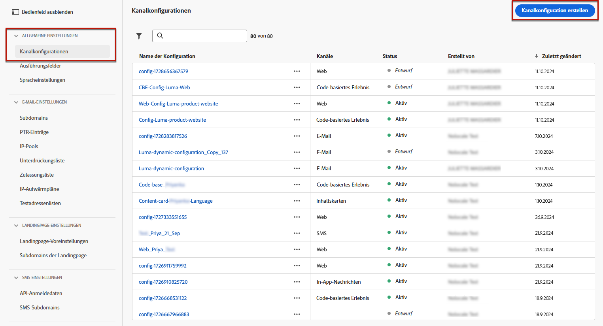
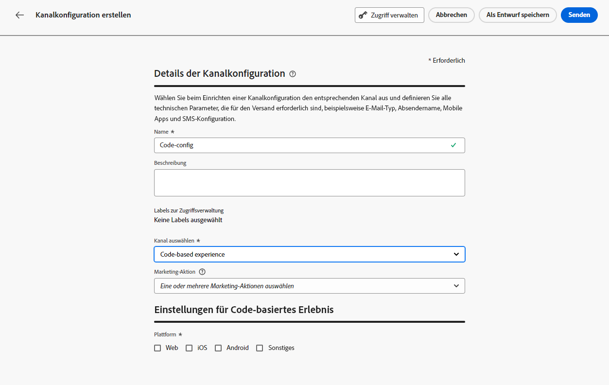
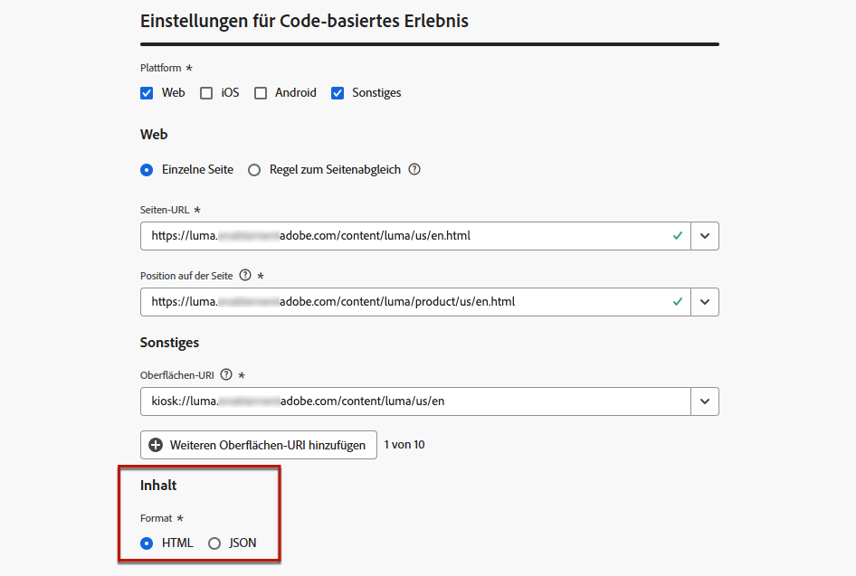
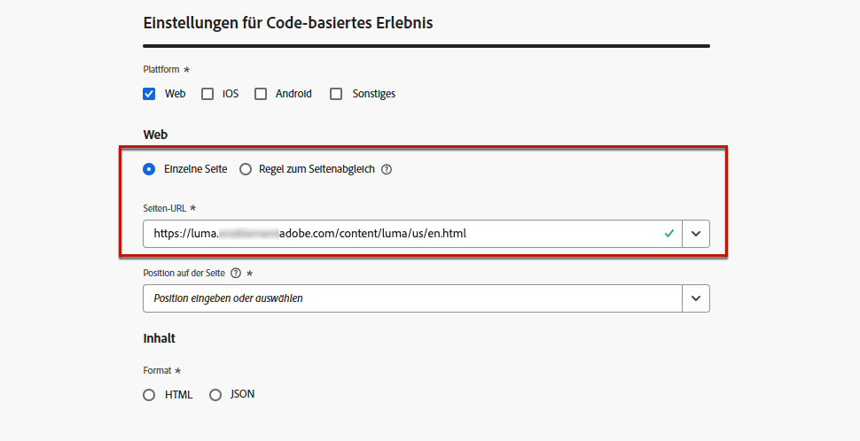
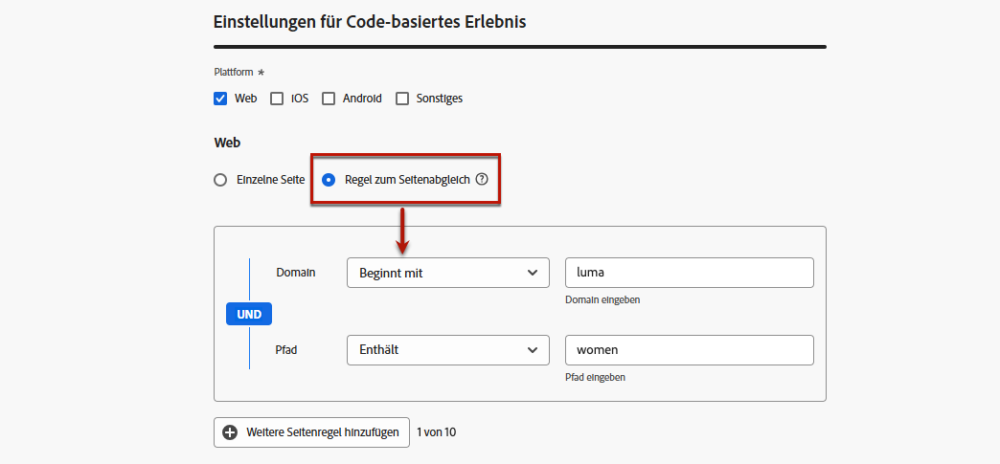
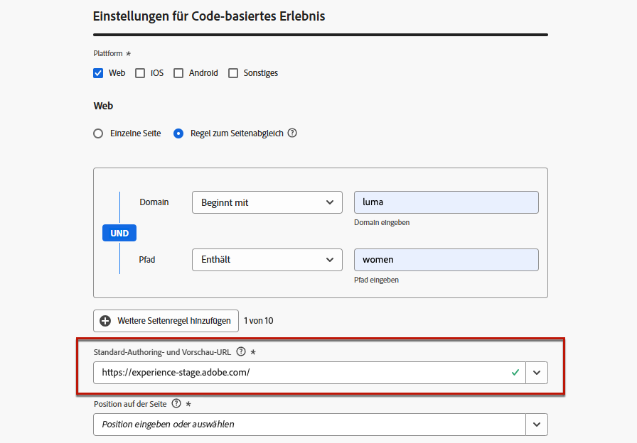
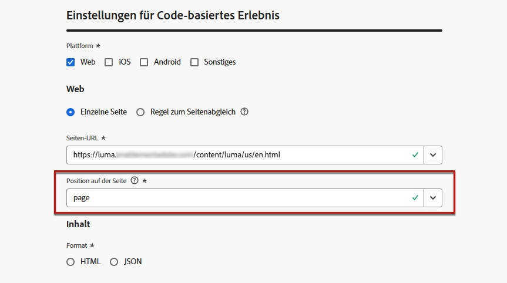
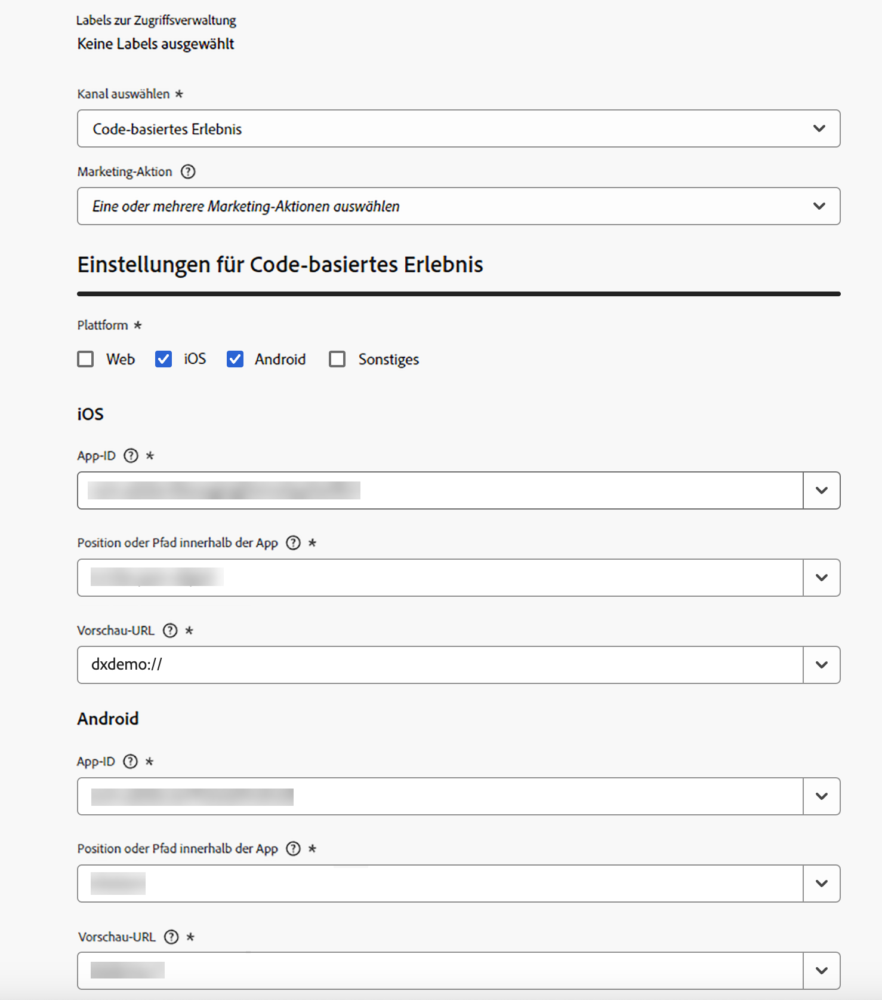
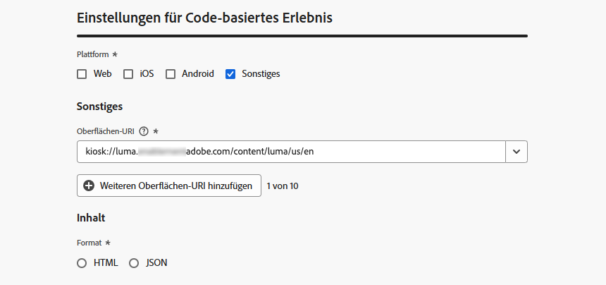

# Konfigurieren des Code-basierten Erlebnisses {#code-based-configuration}

>[!CONTEXTUALHELP]
>id="ajo_code_based_surface"
>title="Definieren einer Code-basierten Erlebniskonfiguration"
>abstract="Eine Code-basierte Konfiguration definiert den Pfad und den Speicherort innerhalb Ihrer Anwendung, der eindeutig durch einen URI in der Anwendungsimplementierung identifiziert wird, wo die Inhalte bereitgestellt und genutzt werden."

Bevor [Erlebnis erstellen](create-code-based.md) müssen Sie eine Code-basierte Erlebniskonfiguration erstellen, in der Sie definieren, wo die Inhalte in Ihrer Anwendung bereitgestellt und genutzt werden sollen.

Eine Code-basierte Erlebniskonfiguration muss auf die Oberfläche verweisen, die im Grunde der Ort ist, an dem Sie Ihre Änderungen rendern möchten. Je nach ausgewählter Plattform müssen Sie einen Speicherort/Pfad oder den vollständigen Oberflächen-URI eingeben. [Weitere Informationen](code-based-surface.md)

>[!NOTE]
>
>Wenn Sie mehrere Code-basierte Erlebnisaktionen mit derselben Kanalkonfiguration haben (und daher auf derselben Oberfläche ausgeführt werden), bestimmt die Kampagne oder der Journey **[!UICONTROL Prioritätswert]** was an den Endbenutzer gesendet wird, wenn er für mehr als eine Aktion qualifiziert ist. [Erfahren Sie mehr über Prioritätswerte](../conflict-prioritization/priority-scores.md)

## Erstellen einer Code-basierten Erlebniskonfiguration {#create-code-based-configuration}

>[!CONTEXTUALHELP]
>id="ajo_admin_location"
>title="Geben Sie die spezifische Position innerhalb Ihrer Seite oder App an"
>abstract="Dieses Feld gibt das genaue Ziel innerhalb einer Seite oder innerhalb der App an, auf das Benutzerinnen und Benutzer zugreifen sollen. Dabei kann es sich um einen bestimmten Abschnitt innerhalb einer Web-Seite oder um eine Seite tief in der Navigationsstruktur der App handeln."

>[!CONTEXTUALHELP]
>id="ajo_admin_default_mobile_url"
>title="Definieren einer URL für die Inhaltserstellung und -vorschau"
>abstract="Dieses Feld stellt sicher, dass die Seiten, die von der Regel generiert oder abgeglichen werden, über eine bestimmte URL verfügen, die für die effektive Erstellung und Vorschau von Inhalten unerlässlich ist."

Gehen Sie wie folgt vor, um eine Code-basierte Erlebniskanal-Konfiguration zu erstellen:

1. Rufen Sie das Menü **[!UICONTROL Kanäle]** > **[!UICONTROL Allgemeine Einstellungen]** > **[!UICONTROL Kanalkonfigurationen]** auf und klicken Sie dann auf **[!UICONTROL Kanalkonfiguration erstellen]**.

   

1. Geben Sie einen Namen und eine Beschreibung (optional) für die Konfiguration ein.

   >[!NOTE]
   >
   > Namen müssen mit einem Buchstaben (A-Z) beginnen. Sie darf nur alphanumerische Zeichen enthalten. Sie können auch die `-` Unterstriche `_`, Punkte `.` Bindestriche verwenden.

1. Um der Konfiguration benutzerdefinierte oder Core-Datennutzungsbezeichnungen zuzuweisen, können Sie „Zugriff **[!UICONTROL &quot;]**. [Weitere Informationen zur Zugriffssteuerung auf Objektebene (OLAC)](../administration/object-based-access.md)

1. Wählen Sie **[!UICONTROL Marketing]** Aktion(en) aus, um den Nachrichten mithilfe dieser Konfiguration Einverständnisrichtlinien zuzuordnen. Alle mit der Marketing-Aktion verknüpften Einverständnisrichtlinien werden genutzt, um die Voreinstellungen Ihrer Kundinnen und Kunden zu respektieren. [Weitere Informationen](../action/consent.md#surface-marketing-actions)

1. Wählen Sie den **Code-basiertes Erlebnis**-Kanal aus.

   

1. Wählen Sie die Plattform aus, auf die das Code-basierte Erlebnis angewendet werden soll:

   * [Web](#web)
   * [iOS und/oder Android](#mobile)
   * [Sonstige](#other)

   >[!NOTE]
   >
   >Sie können mehrere Plattformen auswählen. Bei der Auswahl mehrerer Plattformen werden die Inhalte für alle ausgewählten Seiten oder Apps bereitgestellt.

1. Wählen Sie das Format aus, das von der Anwendung für diesen bestimmten Speicherort erwartet wird. Dies wird beim Verfassen des Code-basierten Erlebnisses in -Kampagnen und -Journey verwendet.

   

1. Klicken Sie **[!UICONTROL Senden]**, um Ihre Änderungen zu speichern.

Sie können diese Konfiguration jetzt beim [Erstellen eines Code-basierten Erlebnisses](create-code-based.md) in Ihren Kampagnen und Journey auswählen.

>[!NOTE]
>
>Ihr App-Implementierungs-Team ist für explizite API- oder SDK-Aufrufe verantwortlich, um Inhalte für die Oberflächen abzurufen, die in der ausgewählten Code-basierten Erlebniskonfiguration definiert sind. Weitere Informationen zu den verschiedenen Kundenimplementierungen finden Sie in [diesem Abschnitt](code-based-implementation-samples.md).

### Web-Plattformen {#web}

>[!CONTEXTUALHELP]
>id="ajo_admin_default_web_url"
>title="Definieren einer URL für die Inhaltserstellung und -vorschau"
>abstract="Dieses Feld stellt sicher, dass die Seiten, die von der Regel generiert oder abgeglichen werden, über eine bestimmte URL verfügen, die für die effektive Erstellung und Vorschau von Inhalten unerlässlich ist."

Gehen Sie wie folgt vor, um die Code-basierten Erlebniskonfigurationseinstellungen für Web-Plattformen zu definieren.

1. Wählen Sie eine der folgenden Optionen aus:

   * **[!UICONTROL Einzelne Seite]** - Wenn Sie die Änderungen nur auf eine einzelne Seite anwenden möchten, geben Sie eine **[!UICONTROL Seiten-URL]** ein.

     

   * **[!UICONTROL Matching-Regel für Seiten]** - Um mehrere URLs als Ziel auszuwählen, die derselben Regel entsprechen, erstellen Sie eine oder mehrere Regeln. [Weitere Informationen](../web/web-configuration.md#web-page-matching-rule)

     <!--This could be used to apply changes universally across a website, such as updating a hero banner across all pages or adding a top image to display on every product page.-->

     Wenn Sie beispielsweise Elemente bearbeiten möchten, die auf allen Damenproduktseiten Ihrer Luma-Website angezeigt werden, wählen Sie **[!UICONTROL Domain]** > **[!UICONTROL Beginnt mit]** > `luma` und **[!UICONTROL Seite]** > **[!UICONTROL Enthält]** > `women`.

     

1. Für die Vorschau-URL gilt Folgendes:

   * Wenn eine Einzelseiten-URL eingegeben wird, wird diese URL für die Vorschau verwendet - Sie müssen keine weitere URL eingeben.
   * Wenn eine [Matching-Regel für Seiten](../web/web-configuration.md#web-page-matching-rule) ausgewählt ist, müssen Sie eine **[!UICONTROL Standard-Authoring- und Vorschau-URL]** eingeben, die für die Vorschau des Erlebnisses in einem Browser verwendet wird. [Weitere Informationen](test-code-based.md#preview-on-device)

     

1. Das Feld **[!UICONTROL Standort auf Seite]** gibt das genaue Ziel innerhalb der Seite an, auf das Benutzerinnen und Benutzer zugreifen sollen. Es kann sich um einen bestimmten Abschnitt auf einer Seite innerhalb der Navigationsstruktur der Website handeln, z. B. „Hero-Banner“ oder „Produkt-Leiste“.

   >[!CAUTION]
   >
   >Die in diesem Feld eingegebene Zeichenfolge oder der Pfad muss mit der in Ihrer App- oder Seitenimplementierung deklarierten Zeichenfolge übereinstimmen. Dadurch wird sichergestellt, dass der Inhalt an dem gewünschten Speicherort innerhalb der angegebenen App oder Seite bereitgestellt wird. [Weitere Informationen](code-based-surface.md#uri-composition)

   

### Mobile Plattformen (iOS und Android) {#mobile}

>[!CONTEXTUALHELP]
>id="ajo_admin_app_id"
>title="App-ID angeben"
>abstract="Geben Sie die Anwendungs-ID ein, um eine genaue Identifizierung und Konfiguration in der Betriebsumgebung des Programms zu ermöglichen und so eine nahtlose Integration und Funktionalität sicherzustellen."

>[!CONTEXTUALHELP]
>id="ajo_admin_mobile_url_preview"
>title="URL für die Vorschau des Inhalts eingeben"
>abstract="Dieses Feld ist wichtig, um die Simulation und Vorschau Ihrer Inhalte direkt auf Ihrem Gerät in Ihrer Anwendung zu ermöglichen."

Gehen Sie wie folgt vor, um die Code-basierten Erlebniskonfigurationseinstellungen für mobile Plattformen zu definieren.

1. Geben Sie Ihre **[!UICONTROL App-ID]** ein. Dies ermöglicht eine genaue Identifizierung und Konfiguration innerhalb der Betriebsumgebung der App und stellt eine nahtlose Integration und Funktionalität sicher.

1. Geben Sie den **[!UICONTROL Speicherort oder Pfad in der App“]**. Dieses Feld gibt das genaue Ziel innerhalb der App an, auf das Benutzerinnen und Benutzer zugreifen sollen. Es kann sich um einen bestimmten Abschnitt oder eine bestimmte Seite tief in der Navigationsstruktur der App handeln, z. B. „Hero-Banner“ oder „Produkt-Leiste“.

   

1. Füllen Sie das Feld **[!UICONTROL Vorschau-URL]** aus, um die Vorschau auf dem Gerät zu aktivieren. Diese URL informiert den Vorschau-Service über die spezifische URL, die beim Auslösen der Vorschau auf dem Gerät verwendet werden soll. [Weitere Informationen](test-code-based.md#preview-on-device)

   Die Vorschau-URL ist ein Deep-Link, der vom App-Entwickler in Ihrer App konfiguriert wird. Dadurch wird sichergestellt, dass alle URLs, die dem Deep-Link-Schema entsprechen, in der App und nicht in einem mobilen Webbrowser geöffnet werden. Wenden Sie sich an Ihren App-Entwickler, um das für Ihre App konfigurierte Deep-Link-Schema zu erhalten.

   +++  Die folgenden Ressourcen können Ihnen bei der Konfiguration von Deep-Links für Ihre App-Implementierung helfen

   * Für Android:

      * [Erstellen von Deep-Links zum App-Kontext](https://developer.android.com/training/app-links/deep-linking)

   * Für iOS:

      * [Definieren eines benutzerdefinierten URL-Schemas für Ihre App](https://developer.apple.com/documentation/xcode/defining-a-custom-url-scheme-for-your-app)

      * [Unterstützen universeller Links in Ihrer App](https://developer.apple.com/documentation/xcode/supporting-universal-links-in-your-app)

   +++

   >[!NOTE]
   >
   >Wenn bei der Vorschau des Erlebnisses Probleme auftreten, lesen Sie bitte [diese Dokumentation](https://experienceleague.adobe.com/en/docs/experience-platform/assurance/troubleshooting#app-does-not-open-link).

### Andere Plattformen {#other}

Gehen Sie wie folgt vor, um die Einstellungen für die Konfiguration des code-basierten Erlebnisses für andere Plattformen zu definieren (z. B. Videokonsolen, an das Fernsehgerät angeschlossene Geräte, Smart TVs, Kiosks, Geldautomaten, Sprachassistenten, IoT-Geräte usw.).

1. Wählen Sie **[!UICONTROL Andere]** als Plattform aus, wenn Ihre Implementierung nicht für Web, iOS oder Android vorgesehen ist oder wenn Sie bestimmte URIs ansprechen müssen.

1. Geben Sie den **[!UICONTROL Oberflächen-URI]** ein. Ein Oberflächen-URI ist eine eindeutige Kennung, die der Entität entspricht, in der Sie Ihr Erlebnis bereitstellen möchten. [Weitere Informationen](code-based-surface.md#surface-uri)

   

   >[!CAUTION]
   >
   >Stellen Sie sicher, dass Sie einen Oberflächen-URI eingeben, der mit dem in Ihrer eigenen Implementierung verwendeten übereinstimmt. Andernfalls können die Änderungen nicht bereitgestellt werden. [Weitere Informationen](code-based-surface.md#uri-composition)

1. **[!UICONTROL Fügen Sie bei]** einen weiteren Oberflächen-URI hinzu. Sie können bis zu 10 URIs hinzufügen.

   >[!NOTE]
   >
   >Beim Hinzufügen mehrerer URIs wird der Inhalt für alle aufgelisteten Komponenten bereitgestellt.
