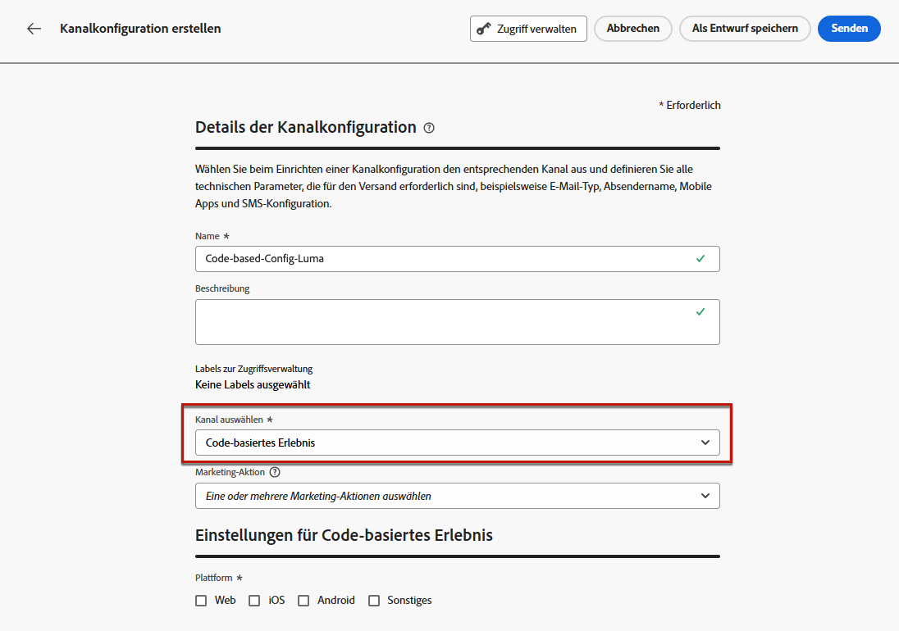
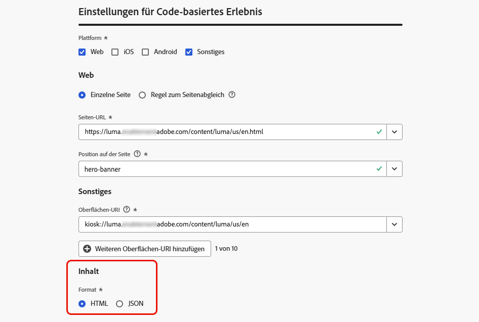
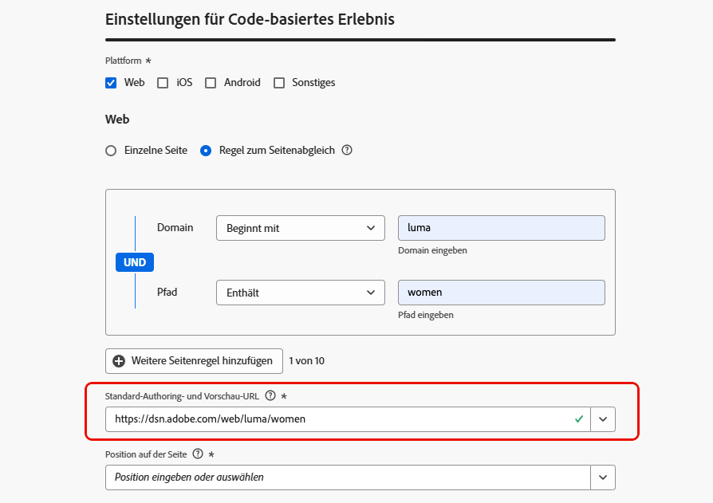
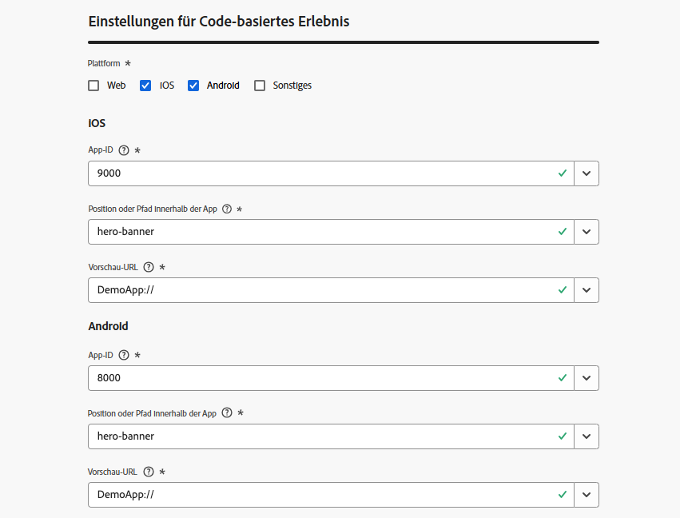

# Konfigurieren des Code-basierten Erlebnisses {#code-based-configuration}

>[!CONTEXTUALHELP]
>id="ajo_code_based_surface"
>title="Definieren einer Konfiguration von Code-basierten Erlebnissen"
>abstract="Eine Code-basierte Konfiguration definiert den Pfad und Speicherort in Ihrer Anwendung, der durch einen URI in der Anwendungsimplementierung eindeutig identifiziert wird und an dem der Inhalt bereitgestellt und verwendet wird."

Bevor Sie [Ihr Erlebnis erstellen](create-code-based.md), müssen Sie eine Code-basierte Erlebniskonfiguration erstellen, in der Sie festlegen, wo die Inhalte in Ihrer Anwendung bereitgestellt und genutzt werden.

Eine Code-basierte Erlebniskonfiguration muss auf die Oberfläche verweisen, die im Wesentlichen der Ort ist, an dem Sie Ihre Änderungen rendern möchten. Je nach ausgewählter Plattform müssen Sie einen Speicherort/Pfad oder den vollständigen URI für die Oberfläche eingeben. [Weitere Informationen](#surface-definition)

## Definieren einer Konfiguration von Code-basierten Erlebnissen {#create-code-based-configuration}

>[!CONTEXTUALHELP]
>id="ajo_admin_location"
>title="Angeben des spezifischen Speicherorts auf Ihrer Seite oder in Ihrer App"
>abstract="Dieses Feld gibt das genaue Ziel auf einer Seite oder in der App an, auf das Benutzende zugreifen sollen. Es kann sich um einen bestimmten Abschnitt innerhalb einer Web-Seite oder eine Seite tief innerhalb der Navigationsstruktur der App handeln."

>[!CONTEXTUALHELP]
>id="ajo_admin_default_mobile_url"
>title="Definieren einer URL für die Inhaltserstellung und -vorschau"
>abstract="Dieses Feld stellt sicher, dass die von der Regel generierten oder abgeglichenen Seiten über eine bestimmte URL verfügen, die sowohl für die effektive Erstellung als auch die Vorschau von Inhalten erforderlich ist."

Gehen Sie wie folgt vor, um eine Code-basierte Erlebniskanalkonfiguration zu erstellen:

1. Rufen Sie das Menü **[!UICONTROL Kanäle]** > **[!UICONTROL Allgemeine Einstellungen]** > **[!UICONTROL Kanalkonfigurationen]** auf, und klicken Sie dann auf **[!UICONTROL Kanalkonfiguration erstellen]**.

   

1. Geben Sie einen Namen und eine Beschreibung (optional) für die Konfiguration an.

   >[!NOTE]
   >
   > Namen müssen mit einem Buchstaben (A–Z) beginnen. Ein Name darf nur alphanumerische Zeichen enthalten. Sie können auch die Zeichen Unterstrich `_`, Punkt `.` und Bindestrich `-` verwenden.

1. Um der Konfiguration benutzerdefinierte oder grundlegende Datennutzungskennzeichnungen zuzuweisen, können Sie **[!UICONTROL Zugriff verwalten]** auswählen. [Weitere Informationen zur Zugriffssteuerung auf Objektebene (OLAC)](../administration/object-based-access.md)

1. Wählen Sie eine **[!UICONTROL Marketing-Aktion]** aus, um Einverständnisrichtlinien mit den Nachrichten zu verknüpfen, die diese Konfiguration verwenden. Es werden alle mit dieser Marketing-Aktion verknüpften Einverständnisrichtlinien genutzt, um die Voreinstellungen Ihrer Kundinnen und Kunden zu respektieren. [Weitere Informationen](../action/consent.md#surface-marketing-actions)

1. Wählen Sie den Kanal **Code-basiertes Erlebnis** aus.

   

1. Wählen Sie die Plattform aus, auf die das Code-basierte Erlebnis angewendet werden soll:

   * [Web](#web)
   * [iOS und/oder Android](#mobile)
   * [Sonstiges](#other)

   >[!NOTE]
   >
   >Sie können mehrere Plattformen auswählen. Wenn Sie mehrere Plattformen auswählen, wird der Inhalt für alle ausgewählten Seiten oder Apps bereitgestellt.

1. Wählen Sie das Format aus, das von der Anwendung für diesen bestimmten Speicherort erwartet wird. Dies wird beim Verfassen des Code-basierten Erlebnisses in -Kampagnen und -Journey verwendet.

   

1. Klicken Sie auf **[!UICONTROL Senden]**, um die Änderungen zu speichern.

Sie können diese Konfiguration jetzt beim [Erstellen eines Code-basierten Erlebnisses](create-code-based.md) in Ihren Kampagnen und Journeys auswählen.

>[!NOTE]
>
>Ihr App-Implementierungs-Team ist dafür verantwortlich, explizite API- oder SDK-Aufrufe durchzuführen, um Inhalte für die in der ausgewählten Code-basierten Erlebniskonfiguration definierten Oberflächen abzurufen. Weitere Informationen zu verschiedenen Kundenimplementierungen finden Sie in [diesem Abschnitt](code-based-implementation-samples.md).

### Web-Plattformen {#web}

>[!CONTEXTUALHELP]
>id="ajo_admin_default_web_url"
>title="Definieren einer URL für die Inhaltserstellung und -vorschau"
>abstract="Dieses Feld stellt sicher, dass die von der Regel generierten oder abgeglichenen Seiten über eine bestimmte URL verfügen, die sowohl für die effektive Erstellung als auch die Vorschau von Inhalten erforderlich ist."

Gehen Sie wie folgt vor, um die Einstellungen der Code-basierten Erlebniskonfiguration für Web-Plattformen festzulegen.

1. Wählen Sie eine der folgenden Optionen aus:

   * **[!UICONTROL Einzelne Seite]**: Wenn Sie die Änderungen ausschließlich auf eine einzelne Seite anwenden möchten, geben Sie eine **[!UICONTROL Seiten-URL]** ein.

     

   * **[!UICONTROL Regel zum Seitenabgleich]**: Um mehrere URLs als Ziel festzulegen, die derselben Regel entsprechen, erstellen Sie eine oder mehrere Regeln. [Weitere Informationen](../web/web-configuration.md#web-page-matching-rule)

     <!--This could be used to apply changes universally across a website, such as updating a hero banner across all pages or adding a top image to display on every product page.-->

     Wenn Sie beispielsweise Elemente bearbeiten möchten, die auf allen Seiten der Luma-Website mit Produkten für Damen angezeigt werden, wählen Sie **[!UICONTROL Domain]** > **[!UICONTROL Beginnt mit]** > `luma` und **[!UICONTROL Seite]** > **[!UICONTROL Enthält]** > `women`.

     

1. Folgendes gilt für die Vorschau-URL:

   * Wenn die URL einer einzelnen Seite eingegeben wird, wird diese URL für die Vorschau verwendet. Es muss keine weitere URL eingegeben werden.
   * Wenn eine [Regel zum Seitenabgleich](../web/web-configuration.md#web-page-matching-rule) ausgewählt ist, müssen Sie eine **[!UICONTROL Standard-Authoring- und Vorschau-URL]** eingeben, die zur Vorschau des Erlebnisses in einem Browser verwendet wird. [Weitere Informationen](test-code-based.md#preview-on-device)

     

1. Das Feld **[!UICONTROL Position auf der Seite]** gibt das genaue Ziel innerhalb der Seite an, auf das Benutzende zugreifen sollen. Es kann sich um einen bestimmten Abschnitt auf einer Seite innerhalb der Navigationsstruktur der Site handeln, z. B. „Hero-Banner“ oder „Produktleiste“.

   >[!CAUTION]
   >
   >Die in dieses Feld eingegebene Zeichenfolge oder der in dieses Feld eingegebene Pfad muss mit der oder dem in Ihrer App- oder Seitenimplementierung deklarierten übereinstimmen. Dadurch wird gewährleistet, dass der Inhalt an der gewünschten Stelle innerhalb der angegebenen App oder Seite bereitgestellt wird. [Weitere Informationen](code-based-surface.md#uri-composition)

   

### Mobilplattformen (iOS und Android) {#mobile}

>[!CONTEXTUALHELP]
>id="ajo_admin_app_id"
>title="Angeben der App-ID"
>abstract="Geben Sie die App-ID für eine genaue Identifizierung und Konfiguration in der Betriebsumgebung der App an, um nahtlose Integration und Funktionalität sicherzustellen."

>[!CONTEXTUALHELP]
>id="ajo_admin_mobile_url_preview"
>title="Eingeben der URL, um Inhalte in der Vorschau anzuzeigen"
>abstract="Dieses Feld ist für die Aktivierung der Simulation und Vorschau Ihres Inhalts in Ihrer Anwendung direkt auf Ihrem Gerät erforderlich."

Gehen Sie wie folgt vor, um die Einstellungen der Code-basierten Erlebniskonfiguration für mobile Plattformen festzulegen.

1. Geben Sie Ihre **[!UICONTROL App-ID]** ein.  Dies ermöglicht eine genaue Identifizierung und Konfiguration in der Betriebsumgebung der App und stellt eine nahtlose Integration und Funktionalität sicher.

1. Geben Sie den **[!UICONTROL Speicherort oder Pfad innerhalb der App]** an. Dieses Feld gibt das genaue Ziel innerhalb der App an, auf das Benutzende zugreifen sollen. Es kann sich um einen bestimmten Abschnitt oder eine Seite tief innerhalb der Navigationsstruktur der App handeln, z. B. „Hero-Banner“ oder „Produktleiste“.

   

1. Füllen Sie das Feld **[!UICONTROL Vorschau-URL]** aus, um die Vorschau auf dem Gerät zu aktivieren. Diese URL informiert den Vorschaudienst über die spezifische URL, die beim Auslösen der Vorschau auf dem Gerät verwendet werden soll.  [Weitere Informationen](test-code-based.md#preview-on-device)

   Die Vorschau-URL ist ein Deeplink, der von den App-Entwicklerinnen und -Entwicklern in Ihrer App konfiguriert wurde. Dadurch wird sichergestellt, dass alle URLs, die mit dem Deeplink-Schema übereinstimmen, in der App und nicht in einem mobilen Webbrowser geöffnet werden. Wenden Sie sich an Ihre App-Entwicklerin oder an Ihren App-Entwickler, um das für Ihre App konfigurierte Deeplink-Schema zu erhalten.

+++  Die folgenden Ressourcen können Ihnen beim Konfigurieren von Deep-Links für Ihre App-Implementierung helfen

   * Für Android:

      * [Erstellen von Deep-Links zum App-Kontext](https://developer.android.com/training/app-links/deep-linking)

   * Für iOS:

      * [Definieren eines benutzerdefinierten URL-Schemas für Ihre App](https://developer.apple.com/documentation/xcode/defining-a-custom-url-scheme-for-your-app)

      * [Unterstützung universeller Links in Ihrer App](https://developer.apple.com/documentation/xcode/supporting-universal-links-in-your-app)

+++

   >[!NOTE]
   >
   >Sollten bei der Vorschau des Erlebnisses Probleme auftreten, lesen Sie [diese Dokumentation](https://experienceleague.adobe.com/de/docs/experience-platform/assurance/troubleshooting#app-does-not-open-link).

### Sonstige Plattformen {#other}

Gehen Sie wie folgt vor, um die Einstellungen der Code-basierten Erlebniskonfiguration für andere Plattformen festzulegen (z. B. Video-Konsolen, mit dem TV vernetzte Geräte, Smart-TVs, Terminals, Geldautomaten, Sprachassistenten und Geräte im Internet der Dinge).

1. Wählen Sie **[!UICONTROL Sonstige]** als Plattform aus, wenn Ihre Implementierung nicht für Web, iOS oder Android geeignet ist oder wenn Sie bestimmte URIs als Ziel auswählen müssen.

1. Geben Sie den **[!UICONTROL Oberflächen-URI]** ein.  Ein Oberflächen-URI ist eine eindeutige Kennung, die der Entität entspricht, in der Sie Ihr Erlebnis bereitstellen möchten. [Weitere Informationen](code-based-surface.md#surface-uri)

   

   >[!CAUTION]
   >
   >Stellen Sie sicher, dass Sie einen Oberflächen-URI eingeben, der mit dem in Ihrer eigenen Implementierung verwendeten URI übereinstimmt.  Andernfalls können die Änderungen nicht bereitgestellt werden. [Weitere Informationen](code-based-surface.md#uri-composition)

1. **[!UICONTROL Fügen Sie bei Bedarf einen weiteren Oberflächen-URI hinzu]**. Sie können bis zu 10 URIs hinzufügen.

   >[!NOTE]
   >
   >Beim Hinzufügen mehrerer URIs wird der Inhalt für alle aufgelisteten Komponenten bereitgestellt.
