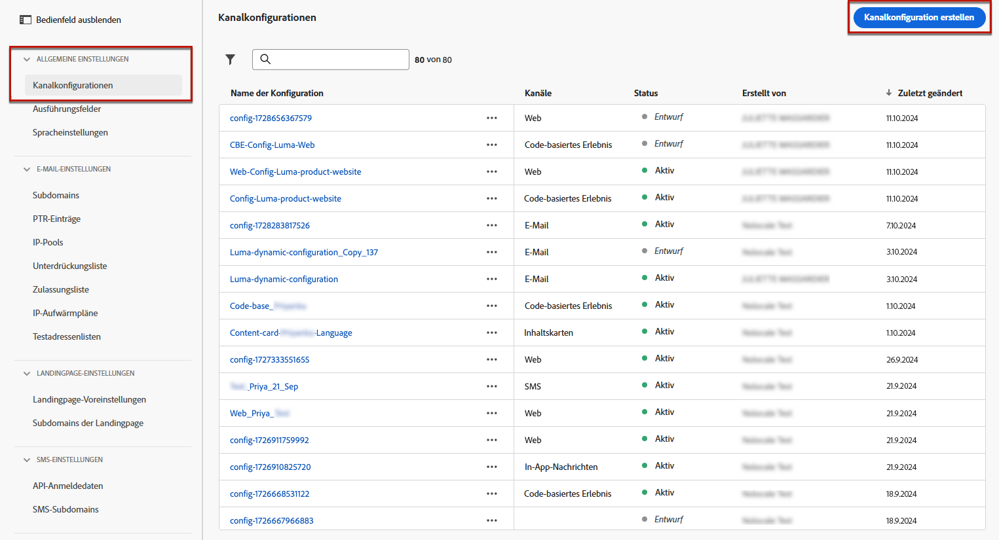

# Konfigurieren des Code-basierten Erlebnisses {#code-based-configuration}

>[!CONTEXTUALHELP]
>id="ajo_admin_app_id"
>title="App-ID"
>abstract="Geben Sie die App-ID für eine genaue Identifizierung und Konfiguration in der Betriebsumgebung der App an, um eine nahtlose Integration und Funktionalität sicherzustellen."

>[!CONTEXTUALHELP]
>id="ajo_admin_location"
>title="Speicherort auf der Seite"
>abstract="Der Speicherort oder Pfad im Feld „App“ gibt das genaue Ziel innerhalb der App an, auf das Benutzende zugreifen sollen. Dies kann ein bestimmter Abschnitt oder eine bestimmte Seite innerhalb der Navigationsstruktur der App sein."

>[!CONTEXTUALHELP]
>id="ajo_admin_surface_uri"
>title="Oberflächen-URI"
>abstract="Ein Oberflächen-URI dient als präzise Kennung, die innerhalb einer Anwendung zu unterschiedlichen Benutzeroberflächen-Elementen oder -Komponenten führt."

>[!CONTEXTUALHELP]
>id="ajo_admin_default_mobile_url"
>title="Standard-Authoring- und Vorschau-URL"
>abstract="Dieses Feld stellt sicher, dass die von der Regel generierten oder abgeglichenen Seiten über eine bestimmte URL verfügen, die sowohl für die effektive Erstellung als auch Vorschau von Inhalten erforderlich ist."

>[!CONTEXTUALHELP]
>id="ajo_admin_default_web_url"
>title="Standard-Authoring- und Vorschau-URL"
>abstract="Dieses Feld stellt sicher, dass die von der Regel generierten oder abgeglichenen Seiten über eine bestimmte URL verfügen, die sowohl für die effektive Erstellung als auch Vorschau von Inhalten erforderlich ist."

>[!CONTEXTUALHELP]
>id="ajo_admin_mobile_url_preview"
>title="Vorschau-URL"
>abstract="Dieses Feld ist für die Aktivierung der Simulation und Vorschau Ihres Inhalts in Ihrer Anwendung direkt auf Ihrem Gerät erforderlich."

## Erstellen einer Kanalkonfiguration {#reatte-code-based-configuration}

Gehen Sie wie folgt vor, um eine Kanalkonfiguration zu erstellen:

1. Rufen Sie das Menü **[!UICONTROL Kanäle]** > **[!UICONTROL Allgemeine Einstellungen]** > **[!UICONTROL Kanalkonfigurationen]** auf, und klicken Sie dann auf **[!UICONTROL Kanalkonfiguration erstellen]**.

   

1. Geben Sie einen Namen und eine Beschreibung (optional) für die Konfiguration an.

   >[!NOTE]
   >
   > Namen müssen mit einem Buchstaben (A–Z) beginnen. Ein Name darf nur alphanumerische Zeichen enthalten. Sie können auch die Zeichen Unterstrich `_`, Punkt `.` und Bindestrich `-` verwenden.

1. Um der Konfiguration benutzerdefinierte oder grundlegende Datennutzungskennzeichnungen zuzuweisen, können Sie **[!UICONTROL Zugriff verwalten]** auswählen. [Weitere Informationen zur Zugriffssteuerung auf Objektebene (OLAC)](../administration/object-based-access.md).

1. Wählen Sie eine **[!UICONTROL Marketing-Aktion]** aus, um Einverständnisrichtlinien mit den Nachrichten zu verknüpfen, die diese Konfiguration verwenden. Es werden alle mit dieser Marketing-Aktion verknüpften Einverständnisrichtlinien genutzt, um die Voreinstellungen Ihrer Kundinnen und Kunden zu respektieren. [Weitere Informationen](../action/consent.md#surface-marketing-actions)

1. Wählen Sie den Kanal **Code-basiertes Erlebnis** aus.

   

1. Wählen Sie die Plattform aus, auf das Code-basierte Erlebnis angewendet werden soll.

1. Beim Web:

   * Geben Sie eine **[!UICONTROL Seiten-URL]** an, um Änderungen ausschließlich auf eine einzelne Seite anzuwenden.

   * Oder erstellen Sie eine **[!UICONTROL Regel für den Seitenabgleich]**, um mehrere URLs als Ziel festzulegen, die mit der angegebenen Regel übereinstimmen. Dies könnte beispielsweise verwendet werden, um Änderungen universell auf eine Website anzuwenden, z. B. ein Hero-Banner über alle Seiten hinweg zu aktualisieren oder ein Top-Bild hinzufügen, das auf jeder Produktseite angezeigt werden soll. [Weitere Informationen](../web/web-configuration.md)

1. Für iOS und Android:

   * Geben Sie Ihre **[!UICONTROL App-ID]** und den **[!UICONTROL Speicherort oder Pfad innerhalb der App]** ein.

     {width="500"}

1. Wählen Sie „Sonstige“ als Plattform aus, wenn Ihre Implementierung nicht für Web, iOS oder Android geeignet ist oder wenn Sie bestimmte URIs als Ziel auswählen müssen. Wenn Sie mehrere Plattformen auswählen oder mehrere URIs hinzufügen, wird der Inhalt für alle ausgewählten Seiten oder Apps bereitgestellt.

   * Geben Sie den **[!UICONTROL Oberflächen-URI]** ein.

   >[!CAUTION]
   >
   >Stellen Sie sicher, dass der in Ihrer Code-basierten Kampagne verwendete Oberflächen-URI mit dem in Ihrer eigenen Implementierung verwendeten übereinstimmt. Andernfalls werden die Änderungen nicht bereitgestellt.

1. Füllen Sie das Feld **[!UICONTROL Vorschau-URL]** aus, um die Vorschau auf dem Gerät zu aktivieren. Diese URL informiert den Vorschaudienst über die spezifische URL, die beim Auslösen einer Vorschau verwendet werden soll.

   * Beim Web:

      * Wenn die URL einer einzelnen Seite eingegeben wird, wird diese URL für die Vorschau verwendet.
      * Wenn eine Regel zum Seitenabgleich ausgewählt ist, müssen Sie eine Standard-Vorschau-URL eingeben, die zur Vorschau des Erlebnisses im Browser verwendet wird.

   * Für mobile Plattformen (iOS/Android):

      * Die Vorschau-URL ist ein Deeplink, der von der App-Entwicklerinnen und -Entwicklern in Ihrer App konfiguriert wurde. Dadurch wird sichergestellt, dass alle URLs, die mit dem Deeplink-Schema übereinstimmen, in der App und nicht in einem mobilen Webbrowser geöffnet werden. Wenden Sie sich an Ihre App-Entwicklerin oder an Ihren App-Entwickler, um das für Ihre App konfigurierte Deeplink-Schema zu erhalten.

+++  Die folgenden Ressourcen können Ihnen beim Konfigurieren von Deep-Links für Ihre App-Implementierung helfen

      * Für Android:

         * [Erstellen von Deep-Links zum App-Kontext](https://developer.android.com/training/app-links/deep-linking)

      * Für iOS:

         * [Definieren eines benutzerdefinierten URL-Schemas für Ihre App](https://developer.apple.com/documentation/xcode/defining-a-custom-url-scheme-for-your-app)

         * [Unterstützung universeller Links in Ihrer App](https://developer.apple.com/documentation/xcode/supporting-universal-links-in-your-app)

+++

   >[!NOTE]
   >
   >Sollten bei der Vorschau des Erlebnisses Probleme auftreten, lesen Sie [diese Dokumentation](https://experienceleague.adobe.com/de/docs/experience-platform/assurance/troubleshooting#app-does-not-open-link).

1. Wählen Sie das Format aus, das von der Anwendung an diesem bestimmten Speicherort erwartet wird. Dies wird beim Authoring des Code-basierten Erlebnisses in Kampagnen und Journeys verwendet.

1. Senden Sie Ihre Änderungen ab.

Sie können Ihre Konfiguration jetzt beim Erstellen Ihres Code-basierten Erlebnisses auswählen.

## Was ist eine Oberfläche? {#surface-definition}

>[!CONTEXTUALHELP]
>id="ajo_code_based_surface"
>title="Definieren einer Konfiguration von Code-basierten Erlebnissen"
>abstract="Eine Code-basierte Konfiguration definiert den Pfad und Speicherort in Ihrer Anwendung, der durch einen URI in der Anwendungsimplementierung eindeutig identifiziert wird und an dem der Inhalt bereitgestellt und verwendet wird."

Eine **Code-basierte Erlebnisoberfläche** ist jede Entität, die für Benutzer- oder Systeminteraktionen entwickelt wurde. Sie ist durch einen URI eindeutig gekennzeichnet. Die Oberfläche wird in der Implementierung der Anwendung angegeben und sollte mit der in der Code-basierten Erlebniskanalkonfiguration zusammengesetzten Oberfläche übereinstimmen.

Beim Erstellen einer Code-basierten Erlebniskanalkonfiguration – für Web-, iOS- und Android-Plattformen müssen Sie einen Pfad und einen Speicherort eingeben, um die Oberfläche zu erstellen. Wenn die Plattform „Sonstige“ lautet, müssen Sie den vollständigen URI eingeben, wie in den Beispielen unten dargestellt.

Mit anderen Worten, eine Oberfläche kann als Container auf jeder Hierarchieebene mit einer vorhandenen Entität (Touchpoint) betrachtet werden.<!--good idea to illustrate how it can be seen, but to clarify-->

* Dabei kann es sich um eine Webseite, eine Mobile App, eine Desktop-App, einen bestimmten Inhaltsspeicherort innerhalb einer größeren Entität (z. B. eine `div`) oder ein nicht standardmäßiges Anzeigemuster (z. B. ein Kiosk oder ein Desktop-Programm-Banner) handeln.<!--In retail, a kiosk is a digital display or small structure that businesses often place in high-traffic areas to engage customers.-->

* Für Nicht-Anzeigen oder abstrakte Anzeigen (z. B. für Dienste bereitgestellte JSON-Blobs) kann sie auch auf bestimmte Teile von Inhalts-Containern erweitert werden.

* Es kann sich auch um eine Platzhalteroberfläche handeln, die einer Vielzahl von Client-Oberflächendefinitionen entspricht (z. B. kann die Position eines Hero-Bilds auf jeder Seite Ihrer Website in einen Oberflächen-URI wie web://mydomain.com/*#hero_image übersetzt werden).

Grundsätzlich besteht ein Oberflächen-URI aus mehreren Abschnitten:
1. **Typ**: Web, Mobile App, ATM, Kiosk, tvcd, Dienst
1. **Eigenschaft**: Seiten-URL oder App-Paket
1. **Container**: Speicherort auf der Seite/App-Aktivität

In der folgenden Tabelle sind einige beispielhafte Definitionen eines Oberflächen-URI für verschiedene Geräte aufgeführt.

**Web und Mobil**

| Typ | URI | Beschreibung |
| --------- | ----------- | ------- | 
| Web | `web://domain.com/path/page.html#element` | Stellt ein einzelnes Element innerhalb einer bestimmten Seite einer bestimmten Domain dar, bei dem ein Element wie in den folgenden Beispielen eine Bezeichnung sein kann: hero_banner, top_nav, menu, footer. |
| iOS-App | `mobileapp://com.vendor.bundle/activity#element` | Stellt ein bestimmtes Element innerhalb der Aktivität einer nativen App dar, z. B. eine Schaltfläche oder ein anderes Ansichtselement. |
| Android-App | `mobileapp://com.vendor.bundle/#element` | Stellt ein bestimmtes Element in einer nativen App dar. |

**Andere Gerätetypen**

| Typ | URI | Beschreibung |
| --------- | ----------- | ------- | 
| Desktop | `desktop://com.vendor.bundle/#element` | Stellt ein bestimmtes Element in einer Anwendung dar, z. B. eine Schaltfläche, ein Menü, ein Hero-Banner usw. |
| TV-App | `tvcd://com.vendor.bundle/#element` | Stellt ein bestimmtes Element in einer mit einem Smart TV- oder TV-Gerät verbundenen Geräteanwendung dar – Bundle-ID. |
| Service | `service://servicename/#element` | Stellt einen Server-seitigen Prozess oder eine andere manuelle Entität dar. |
| Kiosk | `kiosk://location/screen#element` | Beispiel potenzieller zusätzlicher Oberflächentypen, die leicht hinzugefügt werden können. |
| ATM | `atm://location/screen#element` | Beispiel potenzieller zusätzlicher Oberflächentypen, die leicht hinzugefügt werden können. |

**Platzhalteroberfläche**

| Typ | URI | Beschreibung |
| --------- | ----------- | ------- | 
| Platzhalter-Web | `wildcard:web://domain.com/*#element` | Platzhalteroberfläche – stellt ein einzelnes Element auf jeder Seite unter einer bestimmten Domain dar. |
| Platzhalter-Web | `wildcard:web://*domain.com/*#element` | Platzhalteroberfläche – stellt ein einzelnes Element auf jeder Seite unter allen Domains dar, die auf „domain.com“ enden. |
