# Verwenden bearbeitbarer Formularfelder in Code-basierten Erlebnissen {#code-based-form-fields}

Um sowohl die Flexibilität zu erhöhen als auch die Kontrolle über die Code-basierten Erlebnisse zu verbessern, ermöglicht [!DNL Journey Optimizer] Ihrem Entwicklungs-Team die Erstellung von JSON- oder HTML-Inhaltsvorlagen mit bestimmten vordefinierten bearbeitbaren Feldern.

Beim Erstellen eines Code-basierten Erlebnisses können Marketing-Experten ohne technisches Fachwissen diese Felder direkt in der Benutzeroberfläche bearbeiten, ohne den Personalisierungseditor öffnen oder andere Code-Elemente in ihrer Journey oder Kampagne bearbeiten zu müssen.

Diese Funktion bietet Marketing-Fachleuten ein vereinfachtes Erlebnis und ermöglicht Entwickelnden gleichzeitig eine bessere Kontrolle über den Code-Inhalt, was die Fehlerquellen reduziert.

## Verstehen der Syntax von Formularfeldern {#form-field-syntax}

Damit Teile einer HTML- oder JSON-Code-Payload bearbeitbar sind, müssen Sie im Ausdruckseditor eine bestimmte Syntax verwenden. Dazu gehört die Deklarierung einer **Variablen** mit einem Standardwert, den Benutzende überschreiben können, nachdem sie die Inhaltsvorlage auf ihr Code-basiertes Erlebnis angewendet haben.

Angenommen, Sie möchten eine Inhaltsvorlage erstellen, die auf Ihre Code-basierten Erlebnisse angewendet werden soll, und es Benutzenden ermöglichen, eine bestimmte Farbe anzupassen, die an verschiedenen Stellen verwendet wird, z. B. die Hintergrundfarbe von Rahmen oder Schaltflächen.

Beim Erstellen der Inhaltsvorlage müssen Sie eine Variable mit einer **eindeutigen ID**, beispielsweise *Farbe*, deklarieren, und diese an den Stellen im Inhalt aufrufen, an denen diese Farbe angewendet werden soll.

Beim Anwenden der Inhaltsvorlage auf den Inhalt können Benutzende die Farbe anpassen, die dann überall dort verwendet wird, wo auf die Variable verwiesen wird.

## Hinzufügen bearbeitbarer Felder zu HTML- oder JSON-Inhaltsvorlagen {#add-editable-fields}

>[!CONTEXTUALHELP]
>id="ajo_cbe_preview_form_fields"
>title="Überprüfen des Renderings der Formularfelder"
>abstract="In JSON- oder HTML-Inhaltsvorlagen können Sie bestimmte bearbeitbare Felder definieren, die es technisch nicht versierten Benutzenden ermöglichen, Inhalte in Code-basierten Erlebnissen einfach und ohne Code-Änderungen zu bearbeiten. Erstellen Sie diese Felder mit der dedizierten Syntax und zeigen Sie sie mithilfe dieser Schaltfläche in der Vorschau an."

Damit ein Teil Ihres JSON- oder HTML-Codes bearbeitbar ist, erstellen Sie zunächst eine [Inhaltsvorlage](../content-management/content-templates.md) für ein Code-basiertes Erlebnis, in der Sie bestimmte Formularfelder definieren können.

>[!NOTE]
>
>Dieser Schritt wird in der Regel von einer Persona im Entwicklungsbereich ausgeführt.

➡️ [In diesem Video erfahren Sie, wie Sie bearbeitbare Felder zu Vorlagen Code-basierter Erlebnisse hinzufügen](#video)

1. Erstellen Sie eine Inhaltsvorlage und wählen Sie den Kanal **[!UICONTROL Code-basiertes Erlebnis]** aus. [Erfahren Sie, wie Sie Vorlagen erstellen.](../content-management/create-content-templates.md)

1. Wählen Sie den Authoring-Modus aus: HTML oder JSON.

   >[!CAUTION]
   >
   >Das Ändern des Authoring-Modus führt zum Verlust des gesamten aktuellen Codes. Die auf dieser Vorlage basierenden Code-basierten Erlebnisse müssen denselben Authoring-Modus verwenden.

1. Öffnen Sie den [Personalisierungseditor](../personalization/personalization-build-expressions.md), um Ihren Code-Inhalt zu bearbeiten.

1. Um ein bearbeitbares Formularfeld zu definieren<!--To declare the variable you want users to edit-->, navigieren Sie zum Menü **[!UICONTROL Hilfsfunktionen]** im linken Navigationsbereich und fügen Sie das Attribut **inline** hinzu. Die Syntax zum Deklarieren und Aufrufen der Variablen wird Ihrem Inhalt automatisch hinzugefügt.

   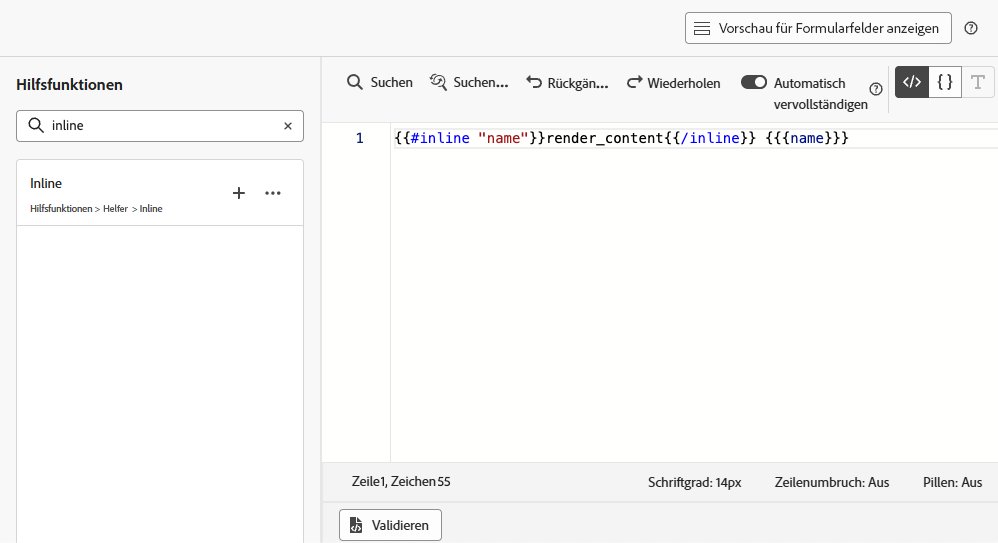{width="85%"}

1. Ersetzen Sie `"name"` durch eine eindeutige ID, um das bearbeitbare Feld zu identifizieren. Geben Sie beispielsweise „imgURL“ ein.

   >[!NOTE]
   >
   >Die Feld-ID muss eindeutig sein und darf keine Leerzeichen enthalten. Diese ID sollte überall dort in Ihrem Inhalt verwendet werden, wo der Wert der Variablen angezeigt werden soll.

1. Passen Sie die Syntax an Ihre Anforderungen an, indem Sie die in der folgenden Tabelle aufgeführten Parameter hinzufügen:

   | Aktion | Parameter | Beispiel |
   | ------- | ------- | ------- |
   | Deklarieren eines bearbeitbaren Felds mit einem **Standardwert**. Wenn Sie die Vorlage zu Ihrem Inhalt hinzufügen, wird dieser Standardwert verwendet, sofern Sie keine Anpassung vornehmen. | Hinzufügen des Standardwerts zwischen den Inline-Tags. | `{{#inline "editableFieldID"}}default_value{{/inline}}` |
   | Definieren eines **Labels** für das bearbeitbare Feld. Dieses Label wird beim Bearbeiten von Vorlagenfeldern im Code-Editor angezeigt. | `name="title"` | `{{#inline "editableFieldID" name="title"}}default_value{{/inline}}` |

   <!--
    | Action | Parameter| Example |
    | ------- | ------- | ------- |
    |Declare an editable field containing an **image source** that needs to be published.|`assetType="image"`|`{{#inline "editableFieldID" assetType="image"}}default_value{{/inline}}`|
    |Declare an editable field containing an **URL** that needs to be tracked.br/>Note that out-of-the-box "Mirror page URL" and "Unsubscribe link" predefined blocks cannot become editable fields.>|`assetType="url"`|`{{#inline "editableFieldID" assetType="url"}}default_value{{/inline}}`|
    -->

1. Klicken Sie auf **[!UICONTROL Vorschau der Formularfelder anzeigen]**, um zu überprüfen, wie die bearbeitbaren Formularfelder in den Code-basierten Erlebnissen angezeigt werden, die diese Vorlage anwenden.

   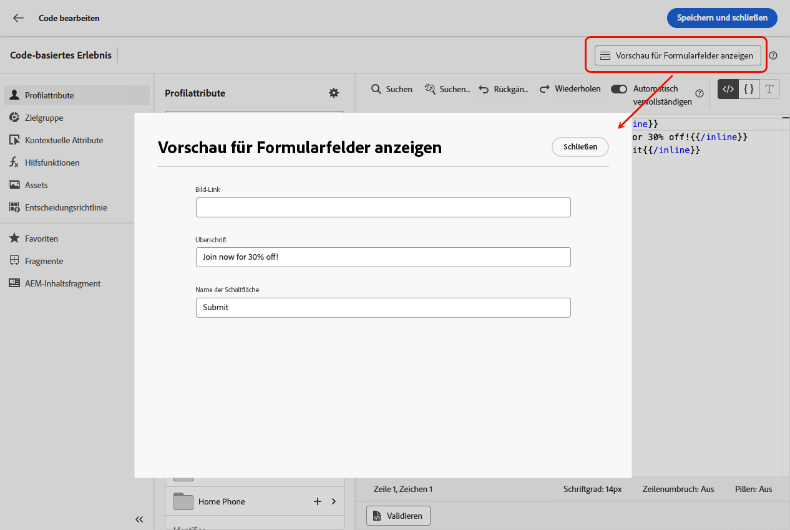{width="85%"}

1. Verwenden Sie die Syntax `{{{name}}}` in Ihrem Code überall dort, wo der Wert des bearbeitbaren Felds angezeigt werden soll. Ersetzen Sie `name` durch die eindeutige ID des zuvor definierten Felds.

   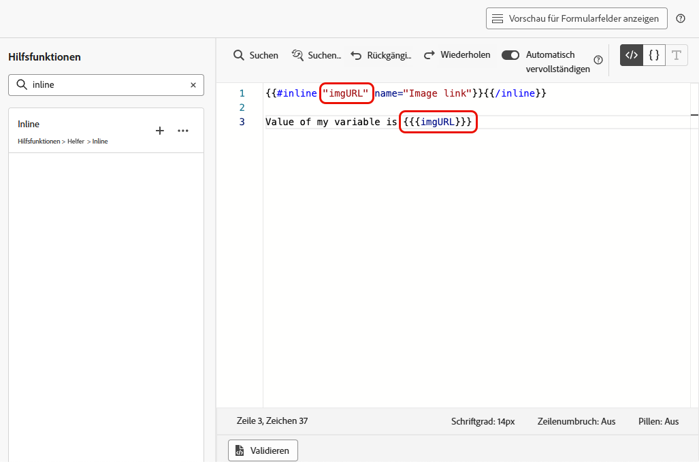{width="85%"}

1. Gehen Sie ähnlich vor, um weitere bearbeitbare Felder hinzuzufügen, und umschließen Sie sie jeweils mit den Tags `{{#inline}}` und `{{/inline}}`.

1. Bearbeiten Sie den Rest Ihres Codes nach Bedarf, einschließlich der IDs, die den von Ihnen definierten bearbeitbaren Feldern entsprechen. [Weitere Informationen](create-code-based.md#edit-code)

   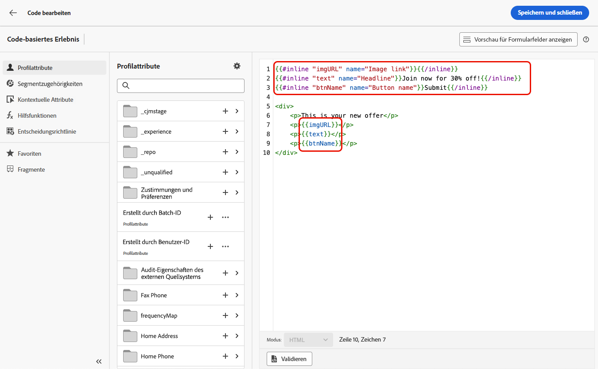

1. Speichern Sie Ihre Vorlage.

### Verwenden von Entscheidungsrichtlinien in bearbeitbaren Feldformularen {#decision-policy-in-form-fields}

Beim Erstellen einer Inhaltsvorlage für Code-basierte Erlebnisse können Sie eine Entscheidungsrichtlinie verwenden, um Angebote in Ihren bearbeitbaren Formularfeldern zu nutzen.

1. Erstellen Sie eine Vorlage für Code-basierte Erlebnisse wie [oben](#add-editable-fields) beschrieben.

1. Klicken Sie auf **[!UICONTROL Entscheidungsrichtlinie hinzufügen]** entweder über das Symbol **[!UICONTROL Entscheidungsfindung anzeigen]** in der rechten Leiste des Bearbeitungsbildschirms oder im Abschnitt **[!UICONTROL Entscheidungsrichtlinie]** im linken Menü im Ausdruckseditor.

   In [diesem Abschnitt](../experience-decisioning/create-decision.md#create-decision) erfahren Sie, wie Sie eine Entscheidungsrichtlinie erstellen.

1. Klicken Sie auf die Schaltfläche **[!UICONTROL Richtlinie einfügen]**. Der Code, der der Entscheidungsrichtlinie entspricht, wird hinzugefügt.

   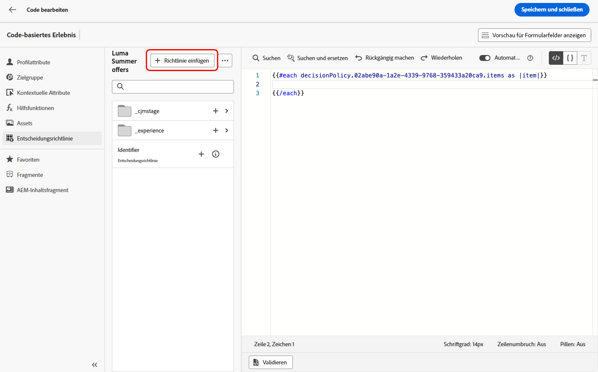

1. Fügen Sie nach dem `{{#each}}`-Tag den Code ein, der den bearbeitbaren Formularfeldern entspricht, die Sie hinzufügen möchten, und verwenden Sie dabei die [oben](#add-editable-fields) beschriebene **Inline**-Syntax. Ersetzen Sie `"name"` durch eine eindeutige ID, um das bearbeitbare Feld zu identifizieren. Verwenden Sie in diesem Beispiel „title“.

   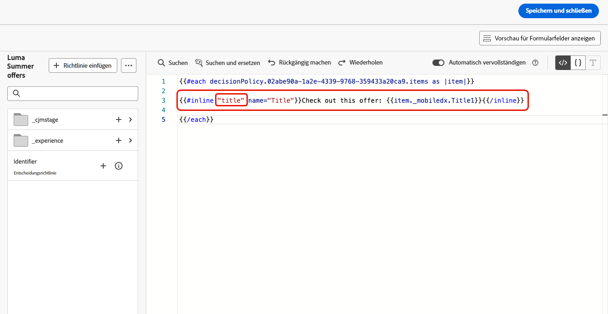{width="90%"}

1. Klicken Sie auf **[!UICONTROL Vorschau der Formularfelder anzeigen]**, um zu überprüfen, wie die bearbeitbaren Formularfelder in den Code-basierten Erlebnissen angezeigt werden, die diese Vorlage anwenden.

   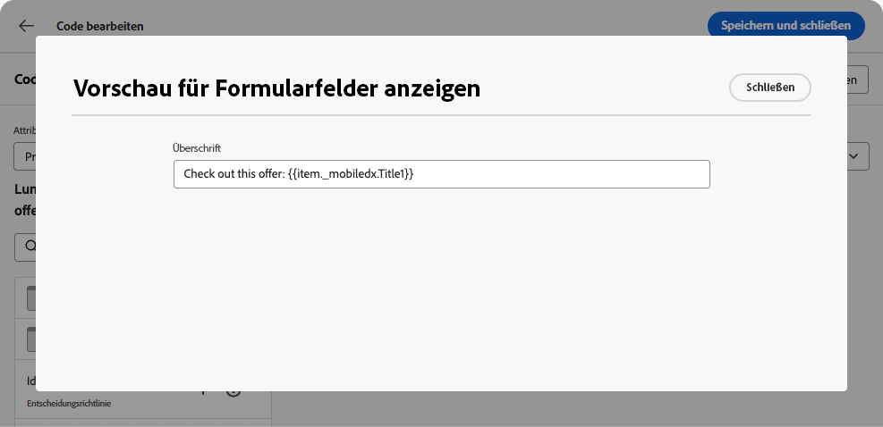{width="70%"}

1. Fügen Sie den Rest Ihres Codes über dem `{{/each}}`-Tag ein. Verwenden Sie die `{{{name}}}`-Syntax in Ihrem Code überall dort, wo der Wert des bearbeitbaren Felds angezeigt werden soll. Ersetzen Sie in diesem Beispiel `name` durch „title“.

   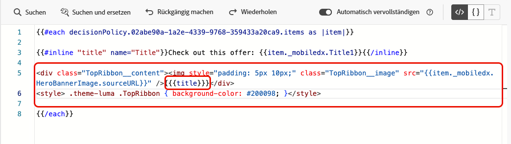{width="85%"}

1. Speichern Sie Ihre Vorlage.

### Code-Beispiele {#code-examples}

Im Folgenden finden Sie einige Beispiele für JSON- und HTML-Vorlagen, darunter einige Entscheidungsrichtlinien.

**JSON-Vorlage:**

```
{{#inline "title" name="Title"}}Best gear for winter is here for you!{{/inline}} 
{{#inline "description" name="Description"}}Add description{{/inline}} 
{{#inline "imgURL" name="Image Link"}}Add link{{/inline}} 
{{#inline "number_of_items" name="Number of items"}}23{{/inline}}

{
  "title": "{{{title}}}",
  "description": "{{{description}}}",
  "imageUrl": "{{{imgURL}}}",
  "number_of_items": {{{number_of_items}}}, 
  "code": "DEFAULT"
}
```

>[!NOTE]
>
>Achten Sie beim Referenzieren der Inline-Felder in der JSON-Payload auf Folgendes:
>
>* Felder vom Typ „String“ müssen in doppelte Anführungszeichen gesetzt werden.
>* Ganzzahlen oder boolesche Werte dürfen NICHT in doppelte Anführungszeichen gesetzt werden. (Siehe das Feld `number_of_items` im obigen Beispiel.)

**JSON-Vorlage mit Entscheidungsfindung:**

```
{ 
"offer": [ 
{{#each decisionPolicy.fff709b7-7fef-4e4e-83d7-594fbcf196c1.items as |item|}} 
{{#inline "title" name="Title"}}{{item._mobiledx.Title1}}{{/inline}} {{#inline "description" name="Description"}}{{item._mobiledx.Title2}}{{/inline}} {{#inline "imgURL" name="Image Link"}}https://luma.enablementadobe.com/content/luma/us/en/experience/warming-up/_jcr_content/root/hero_image.coreimg.jpeg{{/inline}} 

{ 
"title": "{{{title}}}", 
"description": "{{{description}}}", 
"imageUrl": "{{{imgURL}}}", 
"link": "https://lumaenablement.adobe.com/web/luma/home", "code": "DEFAULT" 
}, 
{{/each}}
] 
}
```

>[!NOTE]
>
>Inline-Felder, für die Sie Entscheidungselemente verwenden möchten, müssen innerhalb des Entscheidungsrichtlinienblocks zwischen den `{{#each}}`- und `{{/each}}`-Tags platziert werden.

**HTML-Vorlage:**

```
{{#inline "title" name="Title"}}Please enter title here{{/inline}} 
{{#inline "imgSrc" name="Image link"}}{{/inline}} 

<div class="TopRibbon__content">{{{title}}}</div> 
<style> .theme-luma .TopRibbon { background-color: #200098; }</style>
```

**HTML-Vorlage mit Entscheidungsfindung:**

```
{{#each decisionPolicy.f112884a-5654-43ad-9d6d-dbd32ae23ee6.items as |item|}} 
{{#inline "title" name="Title"}}Title is: {{item._mobiledx.Title1}}{{/inline}} 

<div class="TopRibbon__content">{{{title}}}</div> 
<style> .theme-luma .TopRibbon { background-color: #200098; }</style> 

{{/each}}
```

## Bearbeiten von Formularfeldern in einem Code-basierten Erlebnis {#edit-form-fields}

>[!CONTEXTUALHELP]
>id="ajo_code_based_form_fields"
>title="Was sind Formularfelder?"
>abstract="Dieses Code-basierte Erlebnis enthält Formularfelder, die Sie einfach bearbeiten können, ohne Code im Personalisierungseditor bearbeiten zu müssen."

Nachdem die Inhaltsvorlage mit vordefinierten bearbeitbaren Formularfeldern erstellt wurde, können Sie mit dieser Inhaltsvorlage ein Code-basiertes Erlebnis erstellen.

Sie können die Formularfelder einfach von einer Code-basierten Erlebnis-Journey oder -Kampagne bearbeiten, ohne den Personalisierungseditor öffnen zu müssen.

>[!NOTE]
>
>Dieser Schritt wird von einer Persona im Marketing ausgeführt.

1. Wählen Sie am Bildschirm der Journey-Aktivität oder zur Kampagnenbearbeitung die Inhaltsvorlage mit bearbeitbaren Formularfeldern aus. [Informationen zur Verwendung von Inhaltsvorlagen](../content-management/use-content-templates.md)

   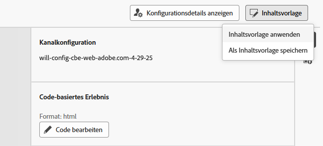{width="60%"}

   >[!CAUTION]
   >
   >Die zur Auswahl stehenden Vorlagen sind je nach zuvor ausgewählter Kanalkonfiguration auf HTML oder JSON beschränkt. Es werden nur kompatible Vorlagen angezeigt.

1. Die Felder, die in der ausgewählten Inhaltsvorlage vordefiniert waren, sind im rechten Bereich verfügbar. <!--The code preview is displayed with the rest of the code.-->

   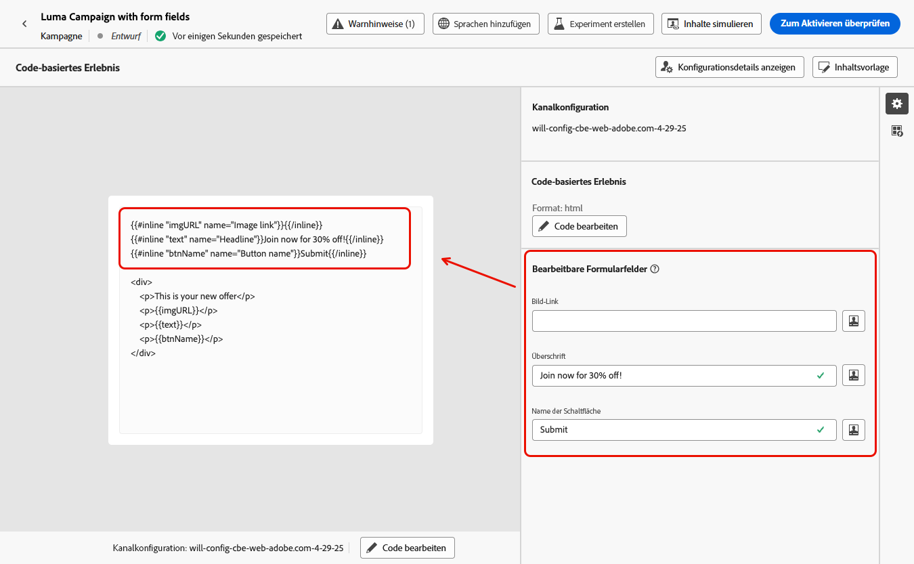

1. Im Abschnitt **[!UICONTROL Bearbeitbare Formularfelder]** haben Sie folgende Möglichkeiten:

   * Bearbeiten Sie jeden Wert direkt in den bearbeitbaren Feldern, ohne den Code-Editor zu öffnen.

   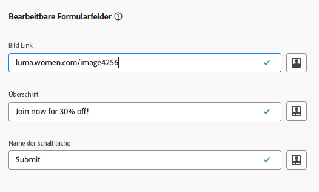{width="60%"}

   * Klicken Sie auf das Personalisierungssymbol, um jedes Feld mit dem [Code-Editor](../personalization/personalization-build-expressions.md) zu bearbeiten.

   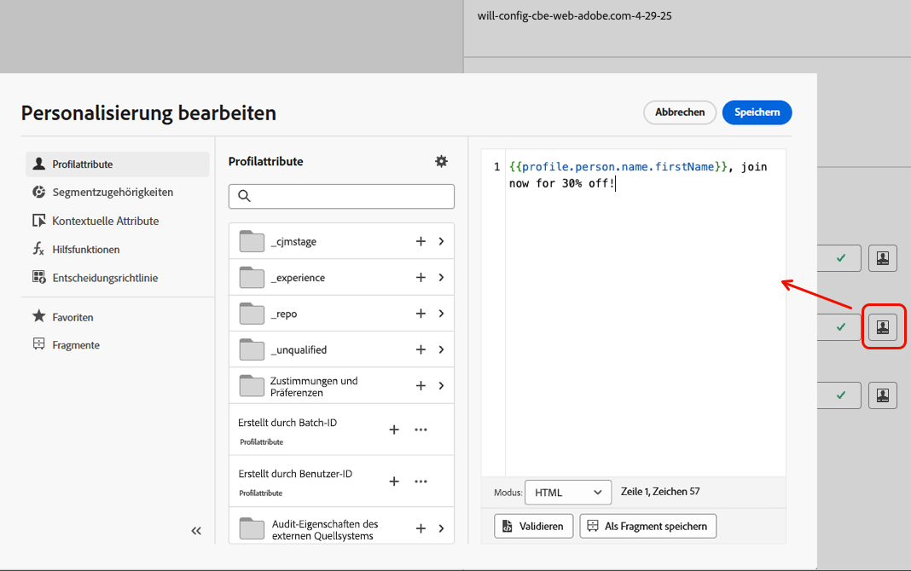{width="70%"}

   >[!NOTE]
   >
   >In beiden Fällen können Sie jeweils nur ein Feld und nicht den Rest des Code-basierten Erlebnisinhalts bearbeiten.

1. Wenn einer Inhaltsvorlage eine [Entscheidungsrichtlinie](#decision-policy-in-form-fields) hinzugefügt wurde, enthält sie alle im [Angebotskatalogschema](../experience-decisioning/catalogs.md) verfügbaren Attribute. Sie können das Entscheidungselement inline oder mit dem Ausdruckseditor bearbeiten.

1. Um den Rest des Codes zu bearbeiten, klicken Sie auf die Schaltfläche **[!UICONTROL Code bearbeiten]** und aktualisieren Sie Ihren gesamten Code-basierten Erlebnisinhalt, einschließlich der bearbeitbaren Formularfelder. [Weitere Informationen](create-code-based.md#edit-code)

## Anleitungsvideo {#video}

Erfahren Sie, wie Sie bearbeitbare Felder zu Inhaltsvorlagen für Code-basierte Erlebniskanäle hinzufügen.

>[!VIDEO](https://video.tv.adobe.com/v/3464000/?captions=ger&learn=on&#x26;enablevpops)
