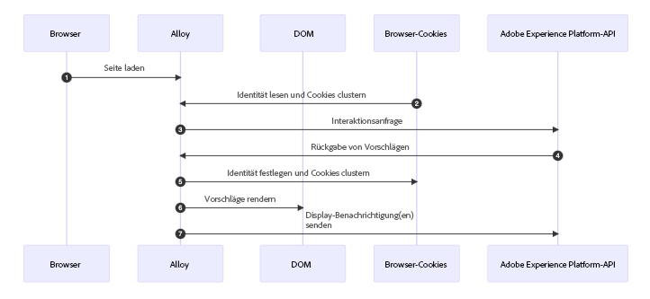
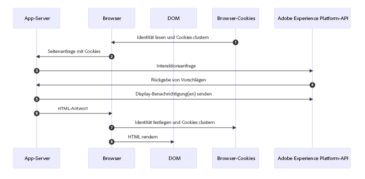

# Beispiele für Code-basierte Implementierungsmethoden {#implementation-samples}

>[!BEGINSHADEBOX]

Inhalt dieses Dokumentationshandbuchs:

* [Erste Schritte mit dem code-basierten Kanal](get-started-code-based.md)
* [Codebasierte Voraussetzungen](code-based-prerequisites.md)
* **[Codebasierte Implementierungsbeispiele](code-based-implementation-samples.md)**
* [Codebasierte Erlebnisse erstellen](create-code-based.md)

>[!ENDSHADEBOX]

Codebasiertes Erlebnis unterstützt jede Art von Kundenimplementierung. Auf dieser Seite finden Sie Beispiele für die einzelnen Implementierungsmethoden:

* [Client-seitig](#client-side-implementation)
* [Serverseitig](#server-side-implementation)
* [Hybrid](#hybrid-implementation)

Sie können auch [dieser Link](https://github.com/adobe/alloy-samples/tree/main/ajo){target="_blank"} um Beispielimplementierungen für verschiedene Anwendungsfälle für Personalisierung und Experimente zu finden. Checken Sie sie aus und führen Sie sie aus, um besser zu verstehen, welche Implementierungsschritte erforderlich sind und wie der durchgängige Personalisierungsfluss funktioniert.

## Clientseitige Implementierung {#client-side-implementation}

Wenn Sie eine Client-seitige Implementierung haben, können Sie eines der AEP-Client-SDKs verwenden: AEP Web SDK oder AEP Mobile SDK. Die folgenden Schritte beschreiben den Prozess des Abrufs der Inhalte, die von den code-basierten Erlebniskampagnen in einer Web SDK-Beispielimplementierung veröffentlicht wurden, und der Anzeige der personalisierten Inhalte.

### Funktionsweise

1. [Web SDK](https://experienceleague.adobe.com/docs/experience-platform/edge/home.html?lang=de){target="_blank"} ist auf der Seite enthalten.

1. Sie müssen die `sendEvent` und geben Sie den Oberflächen-URI an, um den Personalisierungsinhalt abzurufen.

   ```javascript
   alloy("sendEvent", {
   renderDecisions: true,
   personalization: {
       surfaces: ["#sample-json-content"],
   },
   }).then(applyPersonalization("#sample-json-content"));
   ```

1. Codebasierte Erlebniselemente sollten vom Implementierungscode manuell angewendet werden (unter Verwendung der [`applyPersonalization`](https://github.com/adobe/alloy-samples/blob/ac83b6927d007dc456caad2c6ce0b324c99c26c9/ajo/personalization-client-side/public/script.js){target="_blank"} -Methode), um das DOM basierend auf der Entscheidung zu aktualisieren.

1. Bei code-basierten Erlebniskampagnen müssen Anzeigeereignisse manuell gesendet werden, um anzugeben, wann der Inhalt angezeigt wurde. Dies geschieht über den Befehl `sendEvent`.

```javascript
function sendDisplayEvent(decision) {
  const { id, scope, scopeDetails = {} } = decision;

  alloy("sendEvent", {

    xdm: {
      eventType: "decisioning.propositionDisplay",
      _experience: {
        decisioning: {
          propositions: [
            {
              id: id,
              scope: scope,
              scopeDetails: scopeDetails,
            },
          ],
        },
      },
    },
  });
}
```

### Wichtige Hinweise

**Cookies**

Cookies werden verwendet, um die Benutzeridentität und Cluster-Informationen beizubehalten. Bei Verwendung einer clientseitigen Implementierung übernimmt das Web SDK während des Lebenszyklus der Anfrage automatisch das Speichern und Senden dieser Cookies.

| Cookie | Zweck | Gespeichert von | Gesendet von |
| ------------------------ | -------------------------------------------------------------------------- | --------- | ------- |
| kndctr_AdobeOrg_identity | Enthält Details zur Benutzeridentität | Web SDK | Web SDK |
| kndctr_AdobeOrg_cluster | Gibt an, welcher Experience Edge-Cluster zur Erfüllung von Anforderungen verwendet werden soll | Web SDK | Web SDK |

**Platzierung anfordern**

Anfragen an die Adobe Experience Platform-API sind erforderlich, um Vorschläge abzurufen und eine Benachrichtigung zur Anzeige zu senden. Bei Verwendung einer clientseitigen Implementierung sendet das Web SDK diese Anfragen, wenn die Variable `sendEvent` verwendet wird.

| Anfrage | Gemacht von |
| ---------------------------------------------- | ----------------------------------- |
| Interaktionsanforderung zum Abrufen von Vorschlägen | Web SDK mit dem Befehl sendEvent |
| Interaktionsanforderung zum Senden von Anzeigebenachrichtigungen | Web SDK mit dem Befehl sendEvent |

**Flussdiagramm**



## Serverseitige Implementierung {#server-side-implementation}

Wenn Sie über eine serverseitige Implementierung verfügen, können Sie eine der AEP Edge Network API verwenden. Die folgenden Schritte beschreiben den Prozess des Abrufs der Inhalte, die von den code-basierten Erlebniskampagnen in einer Beispiel-Edge Network API-Implementierung für eine Webseite veröffentlicht wurden, und der Anzeige der personalisierten Inhalte.

### Funktionsweise

1. Die Webseite wird angefordert und alle Cookies, die zuvor vom Browser mit dem Präfix `kndctr_` sind enthalten.
1. Wenn die Seite vom Anwendungs-Server angefordert wird, wird ein Ereignis an den [Endpunkt der interaktiven Datenerfassung](https://experienceleague.adobe.com/docs/experience-platform/edge-network-server-api/data-collection/interactive-data-collection.html?lang=en) gesendet, um Personalisierungsinhalte abzurufen. Diese Beispielanwendung verwendet einige Hilfsmethoden, um das Erstellen und Senden von Anfragen an die API zu vereinfachen (siehe [aepEdgeClient.js](https://github.com/adobe/alloy-samples/blob/ac83b6927d007dc456caad2c6ce0b324c99c26c9/common/aepEdgeClient.js){target="_blank"}). Aber die Anfrage ist einfach eine `POST` mit einer Payload, die ein Ereignis und eine Abfrage enthält. Die Cookies (sofern verfügbar) aus dem vorherigen Schritt werden in die Anfrage in der `meta>state>entries` Array.

   ```javascript
   fetch(
     "https://edge.adobedc.net/ee/v2/interact?dataStreamId=abc&requestId=123",
     {
       headers: {
         accept: "*/*",
         "accept-language": "en-US,en;q=0.9",
         "cache-control": "no-cache",
         "content-type": "text/plain; charset=UTF-8",
         pragma: "no-cache",
         "sec-fetch-dest": "empty",
         "sec-fetch-mode": "cors",
         "sec-fetch-site": "cross-site",
         "sec-gpc": "1",
         "Referrer-Policy": "strict-origin-when-cross-origin",
         Referer: "https://localhost/",
       },
       body: JSON.stringify({
         event: {
           xdm: {
             eventType: "decisioning.propositionFetch",
             web: {
               webPageDetails: {
                 URL: "https://localhost/",
               },
               webReferrer: {
                 URL: "",
               },
             },
             identityMap: {
               FPID: [
                 {
                   id: "xyz",
                   authenticatedState: "ambiguous",
                   primary: true,
                 },
               ],
             },
             timestamp: "2022-06-23T22:21:00.878Z",
           },
           data: {},
         },
         query: {
           identity: {
             fetch: ["ECID"],
           },
           personalization: {
             schemas: [
               "https://ns.adobe.com/personalization/default-content-item",
               "https://ns.adobe.com/personalization/html-content-item",
               "https://ns.adobe.com/personalization/json-content-item",
               "https://ns.adobe.com/personalization/redirect-item",
               "https://ns.adobe.com/personalization/dom-action",
             ],
             surfaces: ["web://localhost/","web://localhost/#sample-json-content"],
           },
         },
         meta: {
           state: {
             domain: "localhost",
             cookiesEnabled: true,
             entries: [
               {
                 key: "kndctr_XXX_AdobeOrg_identity",
                 value: "abc123",
               },
               {
                 key: "kndctr_XXX_AdobeOrg_cluster",
                 value: "or2",
               },
             ],
           },
         },
       }),
       method: "POST",
     }
   ).then((res) => res.json());
   ```

1. Das JSON-Erlebnis aus der code-basierten Erlebniskampagne wird aus der Antwort gelesen und bei der Erstellung der HTML-Antwort verwendet.
1. Bei code-basierten Erlebniskampagnen müssen Anzeigeereignisse in der Implementierung manuell gesendet werden, um anzugeben, wann der Kampagneninhalt angezeigt wurde. In diesem Beispiel wird die Benachrichtigung während des Anfragelebenszyklus serverseitig gesendet.

   ```javascript
   function sendDisplayEvent(aepEdgeClient, req, propositions, cookieEntries) {
     const address = getAddress(req);
   
     aepEdgeClient.interact(
       {
         event: {
           xdm: {
             web: {
               webPageDetails: { URL: address },
               webReferrer: { URL: "" },
             },
             timestamp: new Date().toISOString(),
             eventType: "decisioning.propositionDisplay",
             _experience: {
               decisioning: {
                 propositions: propositions.map((proposition) => {
                   const { id, scope, scopeDetails } = proposition;
   
                   return {
                     id,
                     scope,
                     scopeDetails,
                   };
                 }),
               },
             },
           },
         },
         query: { identity: { fetch: ["ECID"] } },
         meta: {
           state: {
             domain: "",
             cookiesEnabled: true,
             entries: [...cookieEntries],
           },
         },
       },
       {
         Referer: address,
       }
     );
   }
   ```

1. Wenn die HTML-Antwort zurückgegeben wird, werden die Identitäts- und Cluster-Cookies in der Antwort vom Anwendungs-Server gesetzt.

### Wichtige Hinweise

**Cookies**

Cookies werden verwendet, um die Benutzeridentität und Cluster-Informationen beizubehalten. Bei der Verwendung einer serverseitigen Implementierung muss der Anwendungsserver die Speicherung und das Senden dieser Cookies während des Lebenszyklus der Anfrage verarbeiten.

| Cookie | Zweck | Gespeichert von | Gesendet von |
| ------------------------ | -------------------------------------------------------------------------- | ------------------ | ------------------ |
| kndctr_AdobeOrg_identity | Enthält Details zur Benutzeridentität | Anwendungsserver | Anwendungsserver |
| kndctr_AdobeOrg_cluster | Gibt an, welcher Experience Edge-Cluster zur Erfüllung von Anforderungen verwendet werden soll | Anwendungsserver | Anwendungsserver |

**Platzierung anfordern**

Anfragen an die Adobe Experience Platform-API sind erforderlich, um Vorschläge abzurufen und eine Benachrichtigung zur Anzeige zu senden. Bei Verwendung einer clientseitigen Implementierung sendet das Web SDK diese Anfragen, wenn die Variable `sendEvent` verwendet wird.

| Anfrage | Gemacht von |
| ---------------------------------------------- | ------------------------------------------------------------ |
| Interaktionsanforderung zum Abrufen von Vorschlägen | Anwendungsserver, der die Adobe Experience Platform-API aufruft |
| Interaktionsanforderung zum Senden von Anzeigebenachrichtigungen | Anwendungsserver, der die Adobe Experience Platform-API aufruft |

**Flussdiagramm**



## Hybridimplementierung {#hybrid-implementation}

Wenn Sie über eine hybride Implementierung verfügen, überprüfen Sie die folgenden Links.

* Adobe Tech Blog: [Hybride Personalisierung im Adobe Experience Platform Web SDK](https://blog.developer.adobe.com/de/hybrid-personalization-in-the-adobe-experience-platform-web-sdk-6a1bb674bf41){target="_blank"}
* SDK-Dokumentation: [Hybride Personalisierung mit Web SDK und Edge Network Server API](https://experienceleague.adobe.com/docs/experience-platform/edge/personalization/hybrid-personalization.html){target="_blank"}

