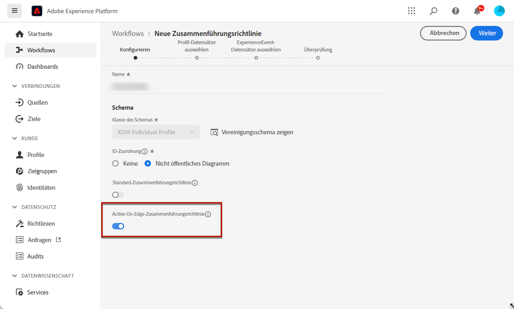

# Voraussetzungen und Leitlinien {#web-prerequisites}

>[!BEGINSHADEBOX]

Inhalt dieses Dokumentationshandbuchs:

* [Erste Schritte mit dem Code-basierten Kanal](get-started-code-based.md)
* **[Code-basierte Voraussetzungen](code-based-prerequisites.md)**
* [Code-basierte Implementierungsbeispiele](code-based-implementation-samples.md)
* [Erstellen von Code-basierten Erlebnissen](create-code-based.md)

>[!ENDSHADEBOX]

Um Code-basierte Erlebnisaktionen in [!DNL Journey Optimizer] verwenden und die Payload des Code-Inhalts bereitstellen zu können, die von Ihren Anwendungen verwendet werden kann, müssen Sie die folgenden Voraussetzungen erfüllen:

* Um Änderungen an Ihren Anwendungen hinzuzufügen, benötigen Sie eine bestimmte Implementierung. [Weitere Informationen](#implementation-prerequisites)

* Damit das Code-basierte Erlebnis ordnungsgemäß bereitgestellt werden kann, müssen Sie die Adobe Experience Platform-Einstellungen definieren, die [hier](#delivery-prerequisites) im Detail beschrieben werden.

## Warnhinweise {#caution-notes-web}

* Dieser Code-basierte Kanal ist derzeit nur als Beta-Version für ausgewählte Benutzerinnen und Benutzer verfügbar. Wenden Sie sich an die Kundenunterstützung von Adobe, um am Beta-Programm teilzunehmen.

* Derzeit können Sie Code-basierte Erlebnisse in [!DNL Journey Optimizer] nur in **Kampagnen** erstellen. [Weitere Informationen](../campaigns/create-campaign.md#configure)

## Voraussetzungen für die Implementierung {#implementation-prerequisites}

Das Code-basierte Erlebnis unterstützt alle Arten der Kundenimplementierung, wie in den folgenden Optionen dargestellt. Sie können für Ihre Eigenschaften entweder eine Client-seitige, eine Server-seitige oder eine hybride Implementierungsmethode verwenden:

* Nur Client-seitig – Um Änderungen an Ihren Web-Seiten oder Apps hinzuzufügen, müssen Sie in jedem Fall die [Adobe Experience Platform Web SDK](https://experienceleague.adobe.com/docs/platform-learn/implement-web-sdk/overview.html?lang=de){target="_blank"} on your website or [Adobe Experience Platform Mobile SDK](https://developer.adobe.com/client-sdks/documentation/){target="_blank"} in Ihren Mobile Apps implementieren.

* Hybridmodus – Sie können die [AEP Edge Network Server-API](https://experienceleague.adobe.com/docs/experience-platform/edge-network-server-api/data-collection/interactive-data-collection.html?lang=de){target="_blank"} to request for personalization server-side; the response is provided to the Adobe Experience Platform Web SDK to render the modifications client-side. Learn more in the Adobe Experience Platform [Edge Network Server API documentation](https://experienceleague.adobe.com/docs/experience-platform/edge-network-server-api/overview.html?lang=de){target="_blank"}. You can find out more about the hybrid mode and check some implementation samples in [this blog post](https://blog.developer.adobe.com/de/hybrid-personalization-in-the-adobe-experience-platform-web-sdk-6a1bb674bf41){target="_blank"} verwenden.

* Server-seitig – Sie können die [AEP Edge Network Server-API](https://experienceleague.adobe.com/docs/experience-platform/edge-network-server-api/data-collection/interactive-data-collection.html?lang=de){target="_blank"} verwenden, um eine Server-seitige Personalisierung anzufordern. Ihr Entwicklungs-Team muss die Antwort verarbeiten und die Änderungen Client-seitig in Ihrer App-Implementierung rendern.

Beispiele für die oben genannten Implementierungsmethoden finden Sie in [diesem Abschnitt](code-based-implementation-samples.md).

## Versandvoraussetzungen {#delivery-prerequisites}

Damit das Code-basierte Erlebnis ordnungsgemäß bereitgestellt werden kann, müssen die folgenden Einstellungen definiert werden:

* Zur [Datenerfassung in Adobe Experience Platform](https://experienceleague.adobe.com/docs/experience-platform/edge/datastreams/overview.html?lang=de){target="_blank"} muss ein Datenstrom definiert sein. Sie können beispielsweise für den **[!UICONTROL Adobe Experience Platform]**-Service die Option **[!UICONTROL Adobe Journey Optimizer]** aktivieren.

  Dadurch wird sichergestellt, dass die von Journey Optimizer eingehenden Ereignisse korrekt von Adobe Experience Platform Edge verarbeitet werden. [Weitere Informationen](https://experienceleague.adobe.com/docs/experience-platform/edge/datastreams/configure.html?lang=de){target="_blank"}

  

* In [Adobe Experience Platform](https://experienceleague.adobe.com/docs/experience-platform/profile/home.html?lang=de){target="_blank"}, make sure you have one merge policy with the **[!UICONTROL Active-On-Edge Merge Policy]** option enabled. To do this, select a policy under the **[!UICONTROL Customer]** > **[!UICONTROL Profiles]** > **[!UICONTROL Merge Policies]** Experience Platform menu. [Learn more](https://experienceleague.adobe.com/docs/experience-platform/profile/merge-policies/ui-guide.html?lang=de#configure){target="_blank"}

  Diese Zusammenführungsrichtlinie wird von eingehenden Kanälen in [!DNL Journey Optimizer] verwendet, um eingehende Kampagnen auf der Edge korrekt zu aktivieren und zu veröffentlichen. [Weitere Informationen](https://experienceleague.adobe.com/docs/experience-platform/profile/merge-policies/ui-guide.html?lang=de){target="_blank"}

  

## Voraussetzungen für Inhaltsexperimente {#experiment-prerequisites}

Um Inhaltsexperimente für den Code-basierten Kanal zu aktivieren, müssen Sie sicherstellen, dass der [Datensatz](../data/get-started-datasets.md), der im [Datenstrom](https://experienceleague.adobe.com/docs/experience-platform/datastreams/overview.html?lang=de){target="_blank"} Ihrer Web-Implementierung verwendet wird, auch in Ihrer Reporting-Konfiguration enthalten ist.

Anders ausgedrückt: Wenn Sie beim Konfigurieren des Reportings für Experimente einen Datensatz hinzufügen, der nicht in Ihrem App-Datenstrom vorhanden ist, werden keine App-Daten in den Inhaltsexperimentberichten angezeigt.

In [diesem Abschnitt](../campaigns/reporting-configuration.md#add-datasets) erfahren Sie, wie Sie Datensätze für das Reporting zu Inhaltsexperimenten hinzufügen.

>[!NOTE]
>
>Der Datensatz wird schreibgeschützt vom Reporting-System von [!DNL Journey Optimizer] verwendet und hat keine Auswirkungen auf die Erfassung oder Aufnahme von Daten.
