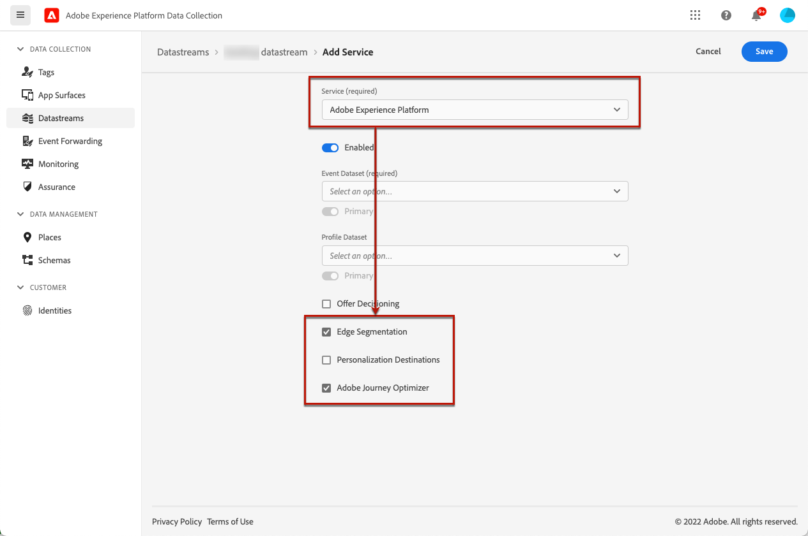
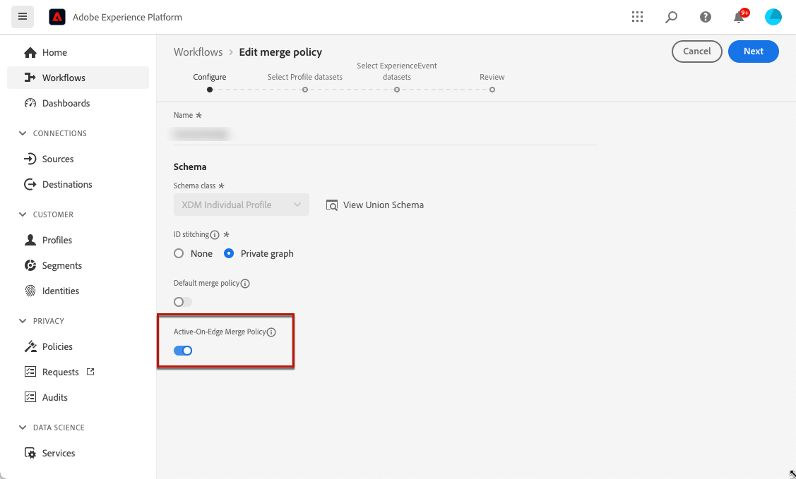

# Voraussetzungen für Code-basierte Erlebnisse {#code-based-prerequisites}

Um Code-basierte Erlebnisaktionen in [!DNL Journey Optimizer] verwenden und Code-Inhalts-Payload bereitstellen zu können, die von Ihren Programmen verwendet werden kann, müssen Sie die folgenden Voraussetzungen erfüllen:

* Um Änderungen an Ihren Anwendungen hinzuzufügen, müssen Sie über eine bestimmte Implementierung verfügen. [Weitere Informationen](#implementation-prerequisites)

* Damit die Code-basierten Erlebnisse ordnungsgemäß bereitgestellt werden können, müssen Sie die Adobe Experience Platform-Einstellungen [hier) &#x200B;](#delivery-prerequisites).

* Damit Daten in Ihren Code-basierten Erlebnisberichten angezeigt werden können, müssen Sie die folgenden [Reporting-Voraussetzungen](#reporting-prerequisites) befolgen.

* Wenn Sie eine [Code-basierte Erlebniskanal-Konfiguration](code-based-configuration.md) erstellen, geben Sie eine Zeichenfolge/einen Pfad oder einen Oberflächen-URI ein, der mit dem in Ihrer eigenen Implementierung deklarierten URI übereinstimmt. Dadurch wird sichergestellt, dass der Inhalt an dem gewünschten Speicherort innerhalb der angegebenen App oder Seite bereitgestellt wird. Andernfalls können die Änderungen nicht bereitgestellt werden. [Mehr dazu](code-based-surface.md)

>[!CAUTION]
>
>Wenn Sie pseudonyme Profile (nicht authentifizierte Besucher) mit Ihren Code-basierten Erlebnissen anvisieren, sollten Sie eine Time-to-Live (TTL) für das automatische Löschen von Profilen festlegen, um die Anzahl der ansprechbaren Profile und die damit verbundenen Kosten zu verwalten. [Weitere Informationen](../start/guardrails.md#profile-management-inbound)

## Voraussetzungen für die Implementierung {#implementation-prerequisites}

Code-basiertes Erlebnis unterstützt alle Arten von Kundenimplementierungen, wie in den folgenden Optionen gezeigt. Sie können für Ihre Eigenschaften entweder eine Client-, Server-seitige oder eine Hybridimplementierungsmethode verwenden:

* Nur Client-seitig - Um Änderungen an Ihren Web-Seiten oder mobilen Apps vorzunehmen, müssen Sie entweder [Adobe Experience Platform Web SDK](https://experienceleague.adobe.com/docs/platform-learn/implement-web-sdk/overview.html?lang=de){target="_blank"} auf Ihrer Website oder [Adobe Experience Platform Mobile SDK](https://developer.adobe.com/client-sdks/edge/adobe-journey-optimizer/code-based/tutorial){target="_blank"} in Ihren mobilen Apps implementieren.

* Hybridmodus - Sie können die [AEP Edge Network-Server-API](https://experienceleague.adobe.com/docs/experience-platform/edge-network-server-api/data-collection/interactive-data-collection.html?lang=de){target="_blank"} verwenden, um eine Server-seitige Personalisierung anzufordern. Die Antwort wird an die Adobe Experience Platform Web SDK gesendet, um die Änderungen Client-seitig zu rendern. Weitere Informationen finden Sie in der Dokumentation zur Adobe Experience Platform [Edge Network Server-API](https://experienceleague.adobe.com/docs/experience-platform/edge-network-server-api/overview.html?lang=de){target="_blank"}. Weitere Informationen zum Hybridmodus und einige Implementierungsbeispiele finden Sie in [diesem Blogpost](https://blog.developer.adobe.com/hybrid-personalization-in-the-adobe-experience-platform-web-sdk-6a1bb674bf41){target="_blank"}.

* Serverseitig - Sie können die [AEP Edge Network Server-API](https://experienceleague.adobe.com/docs/experience-platform/edge-network-server-api/data-collection/interactive-data-collection.html?lang=de){target="_blank"} verwenden, um eine Server-seitige Personalisierung anzufordern. Ihr Entwicklungs-Team muss die Antwort verarbeiten und die Änderungen Client-seitig in Ihrer App-Implementierung rendern.

Beispiele für die einzelnen Implementierungsmethoden finden Sie oben in [diesem Abschnitt](code-based-implementation-samples.md).

## Versandvoraussetzungen {#delivery-prerequisites}

Damit Code-basierte Erlebnisse ordnungsgemäß bereitgestellt werden können, müssen die folgenden Einstellungen definiert werden:

* Zur Datenerfassung in [Adobe Experience Platform](https://experienceleague.adobe.com/docs/experience-platform/edge/datastreams/overview.html?lang=de){target="_blank"} muss ein Datenstrom definiert sein. Sie können beispielsweise für den **[!UICONTROL Adobe Experience Platform]**-Service die Option **[!UICONTROL Adobe Journey Optimizer]** aktivieren.

  Dadurch wird sichergestellt, dass die eingehenden Journey Optimizer-Ereignisse von Adobe Experience Platform Edge korrekt verarbeitet werden. [Weitere Informationen](https://experienceleague.adobe.com/docs/experience-platform/edge/datastreams/configure.html?lang=de){target="_blank"}

  

* Achten Sie darauf, dass in [&#128279;](https://experienceleague.adobe.com/docs/experience-platform/profile/home.html?lang=de){target="_blank"} Adobe Experience Platform bei einer der Zusammenführungsrichtlinien die Option **[!UICONTROL Active-On-Edge]** aktiviert ist. Wählen Sie dazu unter dem Menü **[!UICONTROL Kunde]** > **[!UICONTROL Profile]** > **[!UICONTROL Zusammenführungsrichtlinien]** Experience Platform eine Richtlinie aus. [Weitere Informationen](https://experienceleague.adobe.com/docs/experience-platform/profile/merge-policies/ui-guide.html?lang=de#configure){target="_blank"}

  Diese Zusammenführungsrichtlinie wird von [!DNL Journey Optimizer] eingehenden Kanälen verwendet, um eingehende Kampagnen auf der Edge korrekt zu aktivieren und zu veröffentlichen. [Weitere Informationen](https://experienceleague.adobe.com/docs/experience-platform/profile/merge-policies/ui-guide.html?lang=de){target="_blank"}

  

* Zur Fehlerbehebung bei der Bereitstellung von Journey Optimizer-Web-Erlebnissen können Sie die Ansicht **Edge Delivery** in **Adobe Experience Platform Assurance**. Mit diesem Plug-in können Sie Anfrageaufrufe im Detail untersuchen, überprüfen, ob die erwarteten Edge-Aufrufe wie erwartet auftreten, und Profildaten untersuchen, einschließlich Identitätszuordnungen, Segmentzugehörigkeiten und Einverständniseinstellungen. Darüber hinaus können Sie die Aktivitäten überprüfen, für die die Anfrage qualifiziert war, und die Aktivitäten identifizieren, die sie nicht qualifiziert hat.

  Die Verwendung des Plug-ins **Edge Delivery** hilft Ihnen, die erforderlichen Einblicke zu erhalten, um Ihre eingehenden Implementierungen zu verstehen und Fehler effektiv zu beheben.

  [Weitere Informationen zur Ansicht von Edge Delivery](https://experienceleague.adobe.com/de/docs/experience-platform/assurance/view/edge-delivery){target="_blank"}

## Voraussetzungen für das Reporting {#reporting-prerequisites}

Um das Reporting für den Code-basierten Kanal zu aktivieren, müssen Sie sicherstellen, [&#x200B; der in &#x200B;](../data/get-started-datasets.md) App-Implementierung verwendete [Datenstrom](https://experienceleague.adobe.com/docs/experience-platform/datastreams/overview.html?lang=de){target="_blank"} auch in Ihrer Berichtskonfiguration enthalten ist.

Anders ausgedrückt: Wenn Sie beim Konfigurieren von Berichten einen Datensatz hinzufügen, der nicht in Ihrem App-Datenstrom vorhanden ist, werden App-Daten nicht in Ihren Berichten angezeigt.

Erfahren Sie in ([&#x200B; Abschnitt), wie Sie Datensätze für Berichte &#x200B;](../reports/reporting-configuration.md#add-datasets).

>[!NOTE]
>
>Der Datensatz wird vom [!DNL Journey Optimizer]-Berichtssystem schreibgeschützt verwendet und hat keine Auswirkungen auf die Datenerfassung oder Datenaufnahme.

