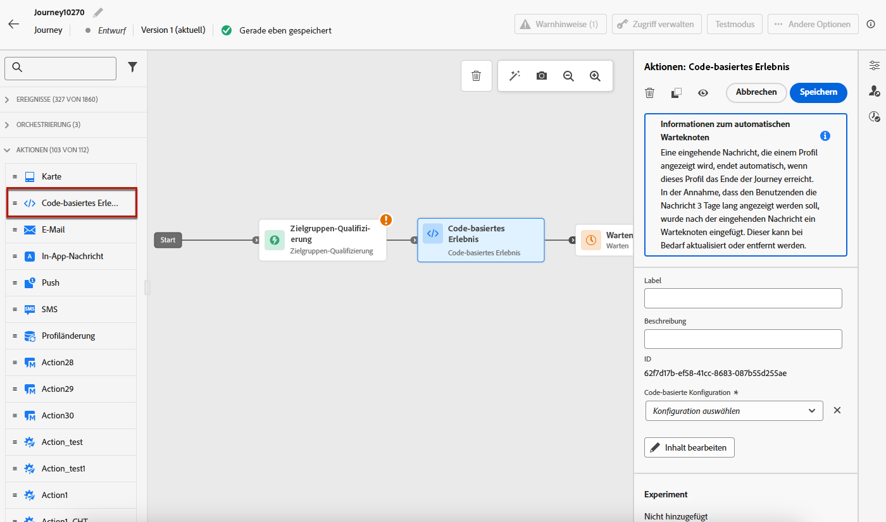
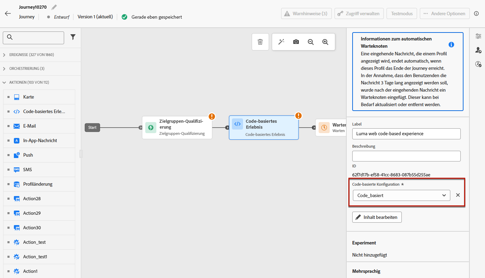
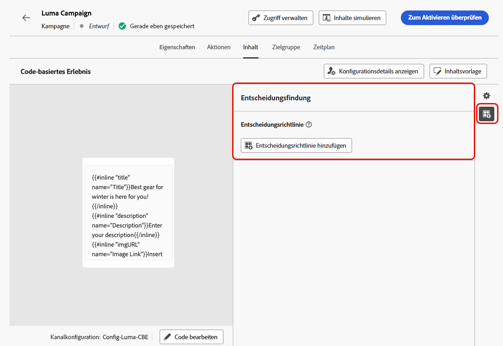

# Erstellen von Code-basierten Erlebnissen {#create-code-based}

In [!DNL Journey Optimizer] können Sie Code-basierte Erlebnisse in einer Journey oder Kampagne erstellen.

## Hinzufügen von Code-basierten Erlebnissen über eine Journey oder Kampagne {#create-code-based-experience}

Führen Sie die folgenden Schritte aus, um Ihr Code-basiertes Erlebnis durch eine Journey oder Kampagne zu erstellen.

>[!BEGINTABS]

>[!TAB  Hinzufügen eines Code-basierten Erlebnisses zu einer Journey]

Gehen Sie wie folgt vor, um die Aktivität **Code-basiertes Erlebnis** zu einer Journey hinzuzufügen:

1. [Erstellen einer Journey](../building-journeys/journey-gs.md)

1. Beginnen Sie Ihre Journey mit einem [Ereignis](../building-journeys/general-events.md) oder einer Aktivität vom Typ [Zielgruppe lesen](../building-journeys/read-audience.md).

1. Ziehen Sie aus dem Bereich **[!UICONTROL Aktionen]** der Palette die Aktivität **[!UICONTROL Code-basiertes Erlebnis]**.

   

   >[!NOTE]
   >
   >Da es sich bei einem **Code-basiertes Erlebnis** um eine Aktivität für eingehende Nachrichten handelt, ist sie mit einer 3-tägigen **Warteaktivität** verbunden. [Weitere Informationen](../building-journeys/wait-activity.md#auto-wait-node)

1. Geben Sie ein **[!UICONTROL Label]** und eine **[!UICONTROL Beschreibung]** für Ihre Nachricht ein.

1. Wählen Sie die zu verwendende Code-basierte Erlebniskonfiguration aus oder erstellen Sie sie. [Weitere Informationen](code-based-configuration.md)

   

   >[!NOTE]
   >
   >Wenn mehrere Code-basierte Erlebnisaktionen mit derselben Kanalkonfiguration vorhandenn sind, bestimmt der **[!UICONTROL Prioritätswert]** der Journey, was an Endbenutzende gesendet wird, wenn diese für mehr als eine Aktion qualifiziert sind. [Weitere Informationen zu Prioritätswerten](../conflict-prioritization/priority-scores.md)

1. Wählen Sie die Schaltfläche **[!UICONTROL Inhalt bearbeiten]** aus und bearbeiten Sie Ihren Inhalt wie gewünscht mit dem Personalisierungseditor. [Weitere Informationen](#edit-code)

   Sie können auch eine vorhandene Inhaltsvorlage als Grundlage für Ihren Code-Inhalt verwenden. Beachten Sie, dass die zur Auswahl stehenden Vorlagen je nach zuvor ausgewählter Kanalkonfiguration auf HTML oder JSON beschränkt sind. [Informationen zur Verwendung von Inhaltsvorlagen](../content-management/use-content-templates.md)

1. Schließen Sie bei Bedarf Ihren Journey-Fluss ab, indem Sie zusätzliche Aktionen oder Ereignisse per Drag-and-Drop verschieben. [Weitere Informationen](../building-journeys/about-journey-activities.md)

1. Sobald Ihr Code-basiertes Erlebnis fertig ist, schließen Sie die Konfiguration ab und veröffentlichen Sie Ihre Journey, um sie zu aktivieren. [Weitere Informationen](../building-journeys/publish-journey.md)

Weitere Informationen zur Konfiguration einer Journey finden Sie auf [dieser Seite](../building-journeys/journey-gs.md).

>[!TAB Erstellen einer Code-basierten Erlebniskampagne]

Gehen Sie wie folgt vor, um Ihr **Code-basiertes Erlebnis** durch eine Kampagne zu erstellen.

1. Erstellen einer Kampagne. [Weitere Informationen](../campaigns/create-campaign.md)

1. Wählen Sie den Kampagnentyp **Geplant – Marketing** aus.

1. Führen Sie die Schritte zum Erstellen einer Kampagne aus, z. B. die Kampagneneigenschaften, [Zielgruppe](../audience/about-audiences.md) und [Zeitplan](../campaigns/create-campaign.md#schedule). Weitere Informationen zur Konfiguration Ihrer Kampagne finden Sie auf [dieser Seite](../campaigns/get-started-with-campaigns.md).

1. Wählen Sie die Aktion **[!UICONTROL Code-basiertes Erlebnis]** aus.

1. Wählen Sie die zu verwendende Code-basierte Erlebniskonfiguration aus oder erstellen Sie sie. [Weitere Informationen](code-based-configuration.md)

   

   >[!NOTE]
   >
   >Wenn mehrere Code-basierte Erlebnisaktionen dieselbe Kanalkonfiguration verwenden, bestimmt der **[!UICONTROL Prioritätswert]** der Kampagne, was an Endbenutzende gesendet wird, wenn diese für mehr als eine Aktion qualifiziert sind. [Weitere Informationen zu Prioritätswerten](../conflict-prioritization/priority-scores.md)

1. Bearbeiten Sie den Inhalt wie gewünscht mit dem Personalisierungseditor. [Weitere Informationen](#edit-code)

   Sie können auch eine vorhandene Inhaltsvorlage als Grundlage für Ihren Code-Inhalt verwenden. Beachten Sie, dass die zur Auswahl stehenden Vorlagen je nach zuvor ausgewählter Kanalkonfiguration auf HTML oder JSON beschränkt sind. [Informationen zur Verwendung von Inhaltsvorlagen](../content-management/use-content-templates.md)

   <!---->

Weitere Informationen zur Konfiguration einer Kampagne finden Sie auf [dieser Seite](../campaigns/get-started-with-campaigns.md).

➡️ [Erfahren Sie in diesem Video, wie Sie eine Code-basierte Erlebniskampagne erstellen.](#video)

>[!ENDTABS]

## Bearbeiten des Code-Inhalts {#edit-code}

>[!CONTEXTUALHELP]
>id="ajo_code_based_experience"
>title="Verwenden des Personalisierungseditors"
>abstract="Fügen Sie den Code ein, den Sie als Teil dieser Code-basierten Erlebnisaktion bereitstellen möchten, und bearbeiten Sie ihn."
>additional-url="https://experienceleague.adobe.com/de/docs/journey-optimizer/using/content-management/personalization/personalization-build-expressions" text="Arbeiten mit dem Personalisierungseditor"

Gehen Sie wie folgt vor, um den Inhalt Ihres Code-basierten Erlebnisses zu bearbeiten.

1. Wählen Sie in der Aktivität „Journey“ oder im Bildschirm „Kampagnenbearbeitung“ die Option **[!UICONTROL Code bearbeiten]** aus.

   

   >[!NOTE]
   >
   >Wenn Sie eine Inhaltsvorlage für Code-basierte Erlebnisse mit vordefinierten bearbeitbaren Formularfeldern verwenden, können Sie den Inhalt dieser Felder verwalten, ohne den Personalisierungseditor zu öffnen. [Weitere Informationen](code-based-form-fields.md)

1. Der [Personalisierungseditor](../personalization/personalization-build-expressions.md) wird geöffnet. Es handelt sich dabei um eine nicht visuelle Benutzeroberfläche zur Erstellung von Erlebnissen, mit der Code erstellt werden kann.

1. Der Authoring-Modus kann von HTML auf JSON umgestellt werden und umgekehrt.

   

   >[!CAUTION]
   >
   >Das Ändern des Authoring-Modus führt zum Verlust des gesamten aktuellen Codes. Stellen Sie daher sicher, dass Sie den Modus wechseln, bevor Sie mit dem Authoring beginnen.

1. Geben Sie Ihren Code nach Bedarf ein. Der Personalisierungseditor von [!DNL Journey Optimizer] kann mit allen Personalisierungs- und Bearbeitungsfunktionen genutzt werden. [Weitere Informationen](../personalization/personalization-build-expressions.md)

1. Sie können bei Bedarf HTML- oder JSON-Ausdrucksfragmente hinzufügen. [Weitere Informationen](../personalization/use-expression-fragments.md)

   Sie können auch einen Teil Ihres Code-Inhalts als Fragment speichern. [Weitere Informationen](../content-management/fragments.md#visual-expression)

1. Sie können die Entscheidungsfunktion in Code-basierten Erlebnissen verwenden.  Wählen Sie in der linken Leiste das Symbol **[!UICONTROL Entscheidungsrichtlinie]** aus und klicken Sie auf **[!UICONTROL Entscheidungsrichtlinie hinzufügen]**. [Weitere Informationen](../experience-decisioning/create-decision.md#create-decision)

   

   <!---->

   Auf dem Bearbeitungsbildschirm der Journey oder Kampagne können Sie jetzt direkt eine Entscheidungsrichtlinie hinzufügen, ohne den Personalisierungseditor zu öffnen. Verwenden Sie das entsprechende Symbol in der rechten Leiste, um den Abschnitt **[!UICONTROL Entscheidungsfindung]** anzuzeigen.

   <!---->

   Die detaillierten Schritte zum Erstellen einer Entscheidungsrichtlinie werden in [diesem Abschnitt](../experience-decisioning/create-decision.md#create-decision) beschrieben.

1. Klicken Sie auf **[!UICONTROL Speichern und Schließen]**, um Ihre Änderungen zu bestätigen.

Sobald Ihre Entwicklungspersonen nun einen API- oder SDK-Aufruf zum Abrufen von Inhalten für die in Ihrer Kanalkonfiguration definierte Oberfläche starten, werden die Änderungen auf die Web-Seite oder App angewendet.

## Anleitungsvideo{#video}

Im folgenden Video erfahren Sie, wie Sie eine Code-basierte Erlebniskampagne erstellen, ihre Eigenschaften konfigurieren, sie testen und veröffentlichen.

>[!VIDEO](https://video.tv.adobe.com/v/3428868/?quality=12&learn=on)
