# Codebasierte Erlebnisse erstellen {#create-code-based}

>[!BEGINSHADEBOX]

Inhalt dieses Dokumentationshandbuchs:

* [Erste Schritte mit dem code-basierten Kanal](get-started-code-based.md)
* [Codebasierte Voraussetzungen](code-based-prerequisites.md)
* [Codebasierte Implementierungsbeispiele](code-based-implementation-samples.md)
* **[Codebasierte Erlebnisse erstellen](create-code-based.md)**

>[!ENDSHADEBOX]

>[!AVAILABILITY]
>
>Der code-basierte Erlebniskanal ist derzeit als Beta-Version verfügbar, um nur Benutzer auszuwählen. Wenden Sie sich an die Kundenunterstützung von Adobe, um am Beta-Programm teilzunehmen.

## Codebasierte Kampagne erstellen {#create-code-based-campaign}

Gehen Sie wie folgt vor, um mit der Erstellung eines code-basierten Erlebnisses durch eine Kampagne zu beginnen.

>[!CAUTION]
>
>Zurzeit in [!DNL Journey Optimizer] Sie können nur code-basierte Erlebnisse mit **Kampagnen**.

1. Erstellen einer Kampagne. [Weitere Informationen](../campaigns/create-campaign.md)

1. Wählen Sie die **[!UICONTROL Codebasiertes Erlebnis (Beta)]** Aktion.

1. Geben Sie die code-basierte Erlebnisoberfläche ein. [Weitere Informationen](#surface-definition)

   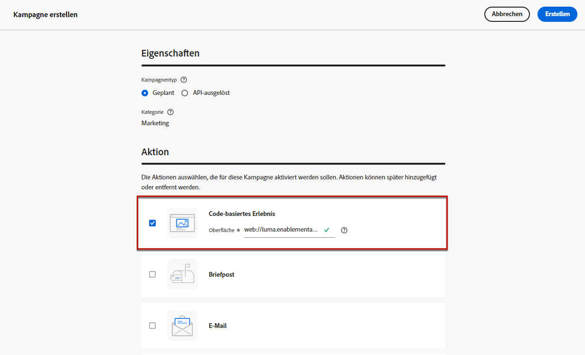

   >[!CAUTION]
   >
   >Stellen Sie sicher, dass der in Ihrer code-basierten Kampagne verwendete Oberflächen-URI mit dem in Ihrer Implementierung verwendeten übereinstimmt. Andernfalls werden die Änderungen nicht bereitgestellt.

1. Wählen Sie **[!UICONTROL Erstellen]** aus.

1. Führen Sie die Schritte zur Erstellung einer Kampagne aus, z. B. die Kampagneneigenschaften, [audience](../audience/about-audiences.md), und [Zeitplan](../campaigns/create-campaign.md#schedule).

   >[!NOTE]
   >
   >Weitere Informationen zur Konfiguration Ihrer Kampagne finden Sie auf [dieser Seite](../campaigns/get-started-with-campaigns.md).

1. Bearbeiten Sie den Inhalt nach Bedarf mithilfe der [code-basierter Editor](#edit-code).

   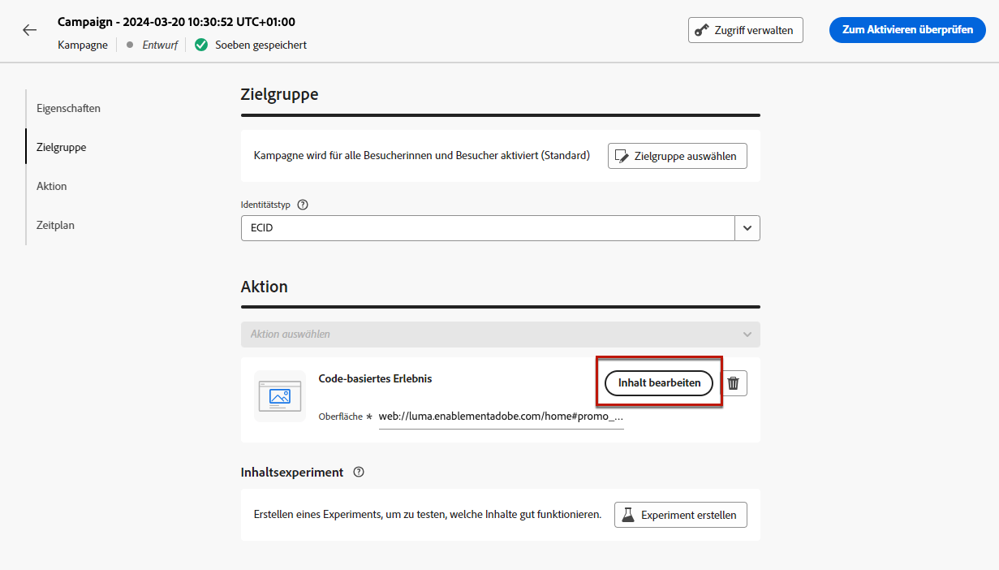

## Codeinhalt bearbeiten {#edit-code}

>[!CONTEXTUALHELP]
>id="ajo_code_based_experience"
>title="Verwenden des Code-Editors"
>abstract="Fügen Sie den Code ein und bearbeiten Sie ihn im Rahmen dieser code-basierten Erlebnisaktion."
>additional-url="https://experienceleague.adobe.com/docs/journey-optimizer/using/content-management/personalization/expression-editor/personalization-build-expressions.html" text="Erste Schritte mit dem Ausdruckseditor"

1. Wählen Sie im Bildschirm zur Kampagnenbearbeitung die Option **[!UICONTROL Code bearbeiten]**.

   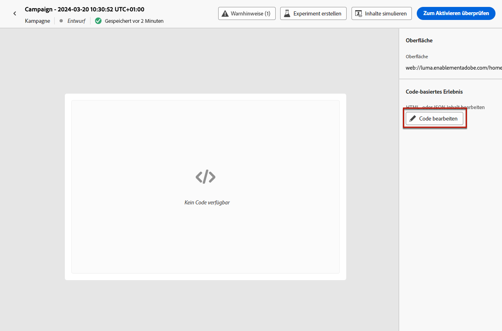

1. Der Code-Editor wird geöffnet. Es handelt sich um eine nicht visuelle Erlebniserstellungsoberfläche.

1. Sie können den Authoring-Modus von HTML auf JSON umstellen und umgekehrt.

   >[!CAUTION]
   >
   >Das Ändern des Authoring-Modus führt zum Verlust des gesamten aktuellen Codes. Stellen Sie daher sicher, dass Sie die Modi wechseln, bevor Sie mit dem Authoring beginnen.

1. Geben Sie Ihren Code nach Bedarf ein. Der Code-Editor nutzt die [!DNL Journey Optimizer] Ausdruckseditor mit allen Personalisierungs- und Bearbeitungsfunktionen. [Weitere Informationen](../personalization/personalization-build-expressions.md)

   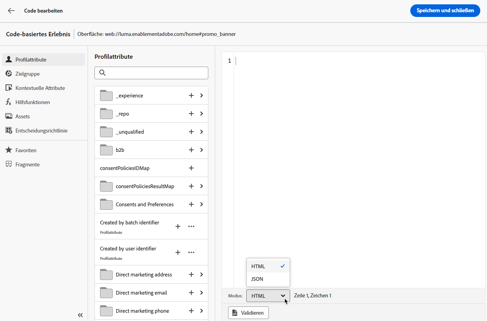

1. In code-basierten Kampagnen können Sie die Entscheidungsfunktion für Erlebnisse verwenden. Wählen Sie die **[!UICONTROL Entscheidungen]** in der linken Leiste auf und klicken Sie auf **[!UICONTROL Entscheidung erstellen]**. [Weitere Informationen](../experience-decisioning/create-decision.md)

   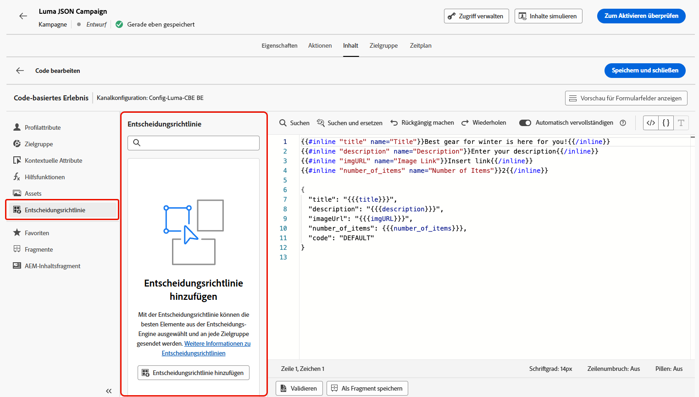

   >[!NOTE]
   >
   >Die Entscheidungsfunktion für Erlebnisse ist derzeit als Beta-Version verfügbar, um nur Benutzer auszuwählen.

1. Klicks **[!UICONTROL Speichern und schließen]** , um Ihre Änderungen zu bestätigen.

Sobald Ihr Entwickler nun einen API- oder SDK-Aufruf zum Abrufen von Inhalten für die ausgewählte Oberfläche startet, werden die Änderungen auf Ihre Web-Seite oder App angewendet.

## Testen der code-basierten Kampagne {#test-code-based-campaign}

>[!CONTEXTUALHELP]
>id="ajo_code_based_preview"
>title="Codebasierte Erlebnisse in der Vorschau anzeigen"
>abstract="Hier erhalten Sie eine Simulation Ihres code-basierten Erlebnisses."

Gehen Sie wie folgt vor, um eine Vorschau Ihres geänderten code-basierten Erlebnisses anzuzeigen.

>[!CAUTION]
>
>Sie müssen über Testprofile verfügen, um simulieren zu können, welche Angebote an sie gesendet werden. Hier erfahren Sie, wie Sie [Testprofile erstellen](../audience/creating-test-profiles.md).

1. Wählen Sie entweder im Code-Editor oder im Bildschirm &quot;Inhalt bearbeiten&quot;die Option **[!UICONTROL Inhalt simulieren]**.

   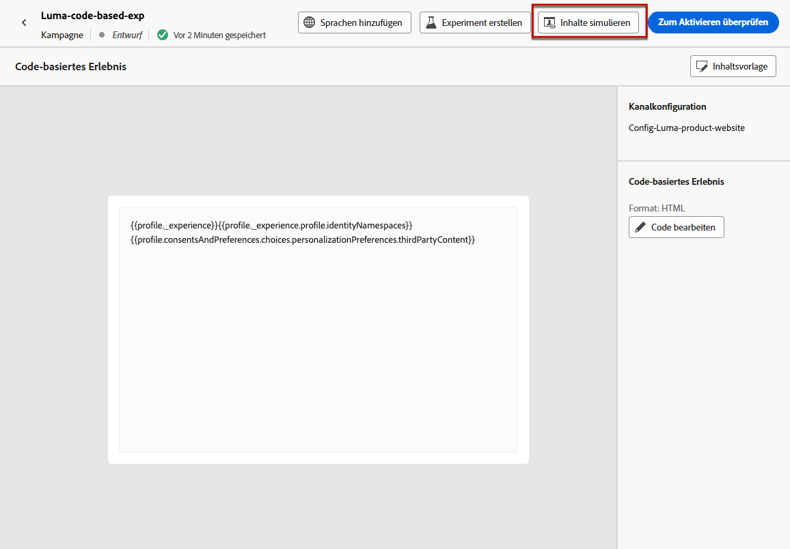

1. Klicken Sie auf **[!UICONTROL Testprofile verwalten]**, um ein oder mehrere Testprofile auszuwählen.

1. Es wird eine Vorschau des geänderten code-basierten Erlebnisses angezeigt.

<!--
    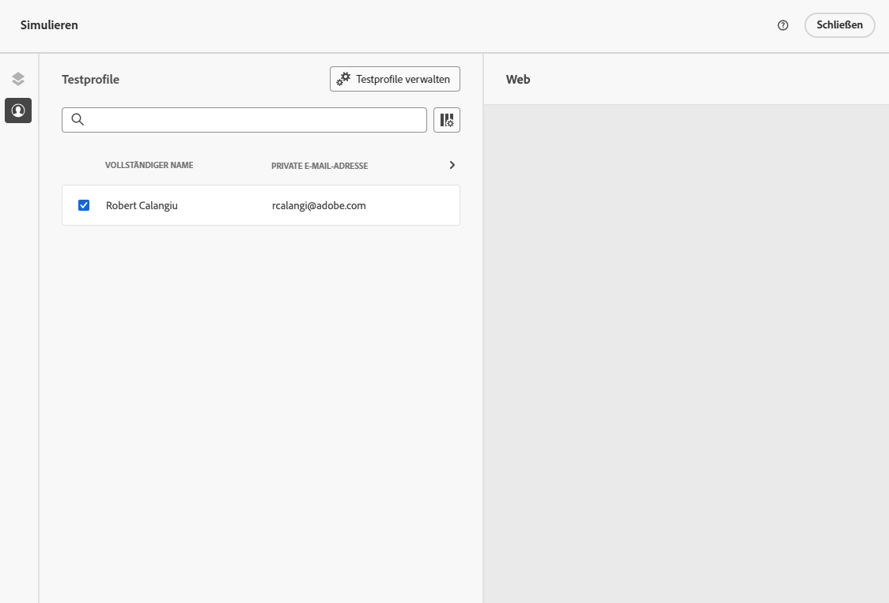

    You can also open it in the default browser, or copy the test URI to paste it in any browser. This allows you to share the link with your team and stakeholders who will be able to preview the new web experience in any browser before the campaign goes live.

    When copying the test URI, the content displayed is the one personalized for the test profile used when the content simulation was generated in [!DNL Journey Optimizer].-->

## Codebasierte Kampagne aktivieren {#activate-code-based-campaign}

Nachdem Sie Ihre code-basierte Kampagne definiert und Ihren Inhalt mit der [code-basierter Editor](#edit-code), können Sie sie überprüfen und aktivieren. Führen Sie dazu folgende Schritte durch.

>[!NOTE]
>
>Sie können auch eine Vorschau des Kampagneninhalts anzeigen, bevor Sie ihn aktivieren. [Weitere Informationen](#test-code-based-campaign)

1. Wählen Sie in Ihrer code-basierten Kampagne **[!UICONTROL Aktivieren]**.

   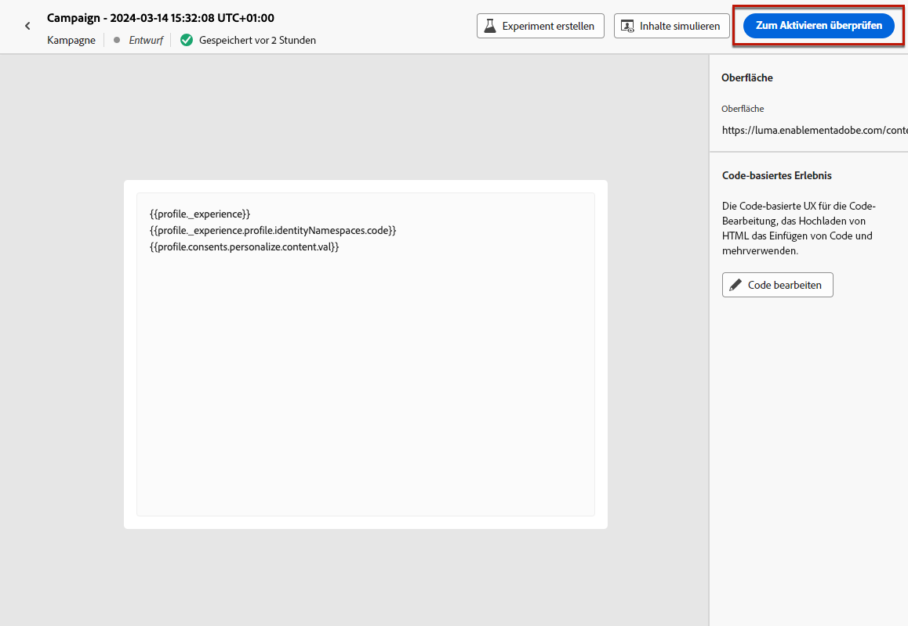

1. Überprüfen und bearbeiten Sie bei Bedarf Inhalt, Eigenschaften, Oberfläche, Audience und Zeitplan.

1. Wählen Sie **[!UICONTROL Aktivieren]** aus.

   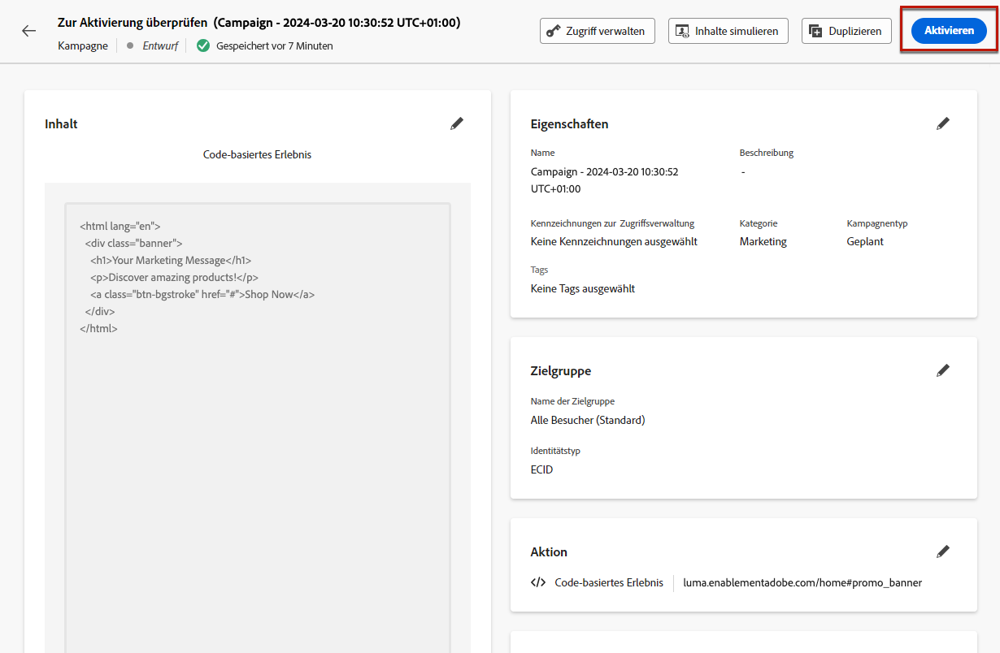

   >[!NOTE]
   >
   >Nachdem Sie auf **[!UICONTROL Aktivieren]** kann es bis zu 1 Minute dauern, bis code-basierte Kampagnenänderungen live an Ihrem Standort verfügbar sind.

Ihre code-basierte Kampagne verwendet die **[!UICONTROL Live]** -Status und ist nun für die ausgewählte Zielgruppe sichtbar. Jeder Empfänger Ihrer Kampagne kann Ihre Änderungen sehen.

>[!NOTE]
>
>Wenn Sie einen Zeitplan für Ihre code-basierte Kampagne definiert haben, wird die Variable **[!UICONTROL Geplant]** Status bis zum Erreichen des Anfangsdatums und der Startzeit.
>
>Wenn Sie eine code-basierte Kampagne aktivieren, die sich auf dieselben Orte wie eine andere bereits aktive Kampagne auswirkt, werden alle Änderungen auf Ihre Orte angewendet.

Weitere Informationen zur Aktivierung von Kampagnen finden Sie in [diesem Abschnitt](../campaigns/review-activate-campaign.md).

## Eine code-basierte Kampagne stoppen {#stop-code-based-campaign}

Wenn eine code-basierte Kampagne aktiv ist, können Sie sie stoppen, um zu verhindern, dass Ihre Zielgruppe Ihre Änderungen sieht. Führen Sie dazu folgende Schritte durch.

1. Wählen Sie eine Live-Kampagne aus der Liste aus.

1. Wählen Sie im oberen Menü **[!UICONTROL Kampagne stoppen]** aus.

   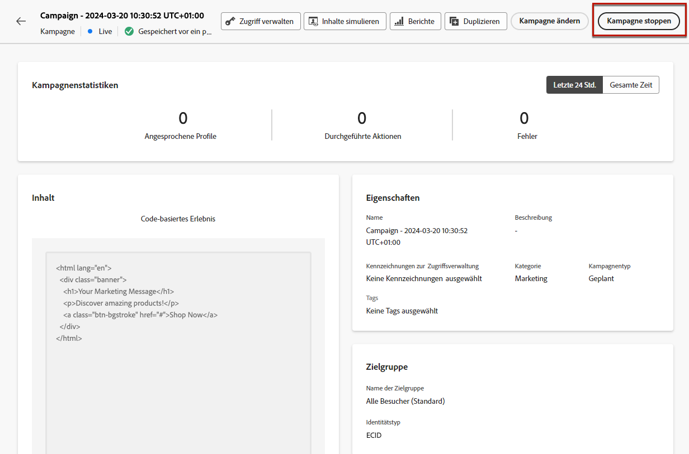

1. Die hinzugefügten Änderungen sind dann für die von Ihnen definierte Audience nicht mehr sichtbar.

>[!NOTE]
>
>Nachdem eine code-basierte Kampagne beendet wurde, können Sie sie nicht mehr bearbeiten oder erneut aktivieren. Sie können sie nur duplizieren und dann die duplizierte Kampagne aktivieren.

## Codebasierte Kampagnenberichte

Sie können auf code-basierte Kampagnenberichte über den Bildschirm Kampagnenzusammenfassung zugreifen.

Globale Berichte zeigen Ereignisse an, die mindestens vor zwei Stunden aufgetreten sind, und decken Ereignisse über einen ausgewählten Zeitraum ab. Im Vergleich dazu konzentrieren sich Live-Berichte auf Ereignisse, die innerhalb der letzten 24 Stunden stattgefunden haben. Der Zeitraum ab dem Auftreten des Ereignisses beträgt mindestens zwei Minuten.

### Codebasierter Live-Bericht {#live-report-code-based}

Aus der Kampagne **[!UICONTROL Live-Bericht]**, die **[!UICONTROL Codebasiertes Erlebnis]** im Tab werden die wichtigsten Informationen zu Ihren Apps oder Webseiten aufgeführt. [Weitere Informationen zu Live-Berichten](../reports/campaign-live-report.md)

+++ Erfahren Sie mehr über die verschiedenen Metriken und Widgets, die für den Code-basierten Erlebnisbericht verfügbar sind.

Die **[!UICONTROL Codebasierte Erlebnisleistung]** KPIs beschreiben die wichtigsten Informationen im Zusammenhang mit der Interaktion Ihrer Besucher mit Ihren code-basierten Erlebnissen, z. B.:

* **[!UICONTROL Impressionen]**: Gesamtzahl der für alle Benutzer bereitgestellten Erlebnisse.

* **[!UICONTROL Interaktionen]**: Gesamtzahl der Interaktionen mit Ihrer App/Seite. Dazu gehören alle von den Benutzenden durchgeführten Aktionen, wie z. B. Klicks oder andere Interaktionen.

Die **[!UICONTROL Codebasierte Erlebniszusammenfassung]** -Diagramm zeigt die Entwicklung Ihrer Erlebnisse (Impressionen, einzigartige Impressionen und Interaktionen) in den letzten 24 Stunden an.

<!--The **[!UICONTROL Interactions by element]** table details the main information relative to your visitors' engagement with the various elements on your app/pages.-->
+++

### Codebasierter globaler Bericht {#global-report-code-based}

Der globale Bericht einer codebasierten Kampagne kann direkt über Ihre Kampagne mit der Variablen **[!UICONTROL Bericht anzeigen]** Schaltfläche. [Weitere Informationen zum globalen Bericht](../reports/campaign-global-report.md)

In Ihrer Kampagne **[!UICONTROL Globaler Bericht]**, die **[!UICONTROL Codebasiertes Erlebnis]** im Tab werden die wichtigsten Informationen zu Ihren Apps oder Webseiten aufgeführt.

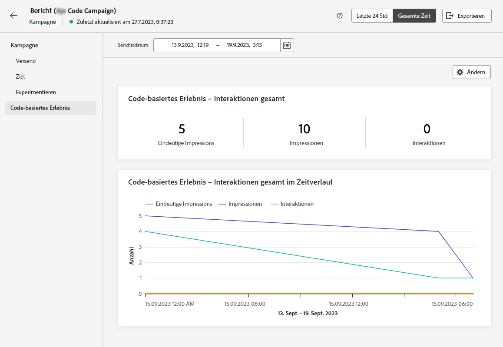

<!--image-->

+++ Erfahren Sie mehr über die verschiedenen Metriken und Widgets, die für den Code-basierten Erlebnisbericht verfügbar sind.

Die **[!UICONTROL Codebasierte Erlebnisleistung]** In KPIs werden die wichtigsten Informationen im Zusammenhang mit der Interaktion Ihrer Besucher mit Ihren Erlebnissen beschrieben, z. B.:

* **[!UICONTROL Einzelimpressionen]**: Anzahl der Unique Users, denen das Erlebnis bereitgestellt wurde.

* **[!UICONTROL Impressionen]**: Gesamtzahl der für alle Benutzer bereitgestellten Erlebnisse.

* **[!UICONTROL Interaktionen]**: Prozentsatz der Interaktionen mit Ihrer App/Seite. Dazu gehören alle von den Benutzenden durchgeführten Aktionen, wie z. B. Klicks oder andere Interaktionen.

Die **[!UICONTROL Codebasierte Erlebniszusammenfassung]** -Diagramm zeigt die Entwicklung Ihrer Erlebnisse (Unique Impressions, Impressionen und Interaktionen) für den betroffenen Zeitraum an.

<!--The **[!UICONTROL Interactions by element]** table details the main information relative to your visitors' engagement with the various elements on your apps/pages.-->
+++

<!--
## How-to video{#video}

The video below shows how to create a code-based campaign, configure its properties, review, and publish it.

>[!VIDEO]()

-->