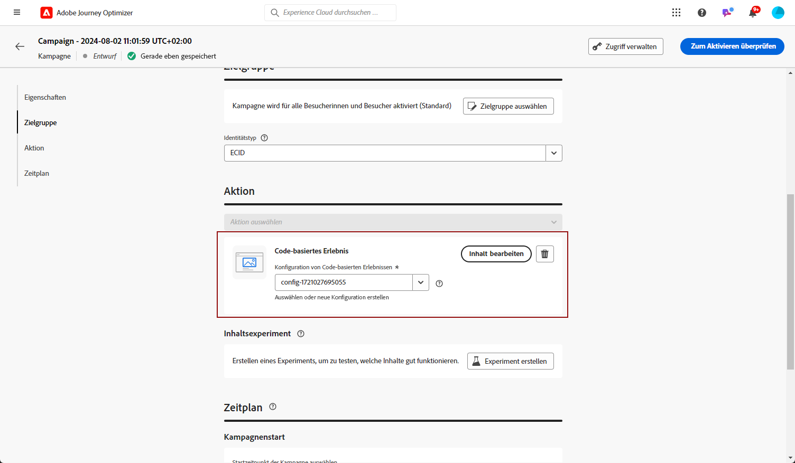
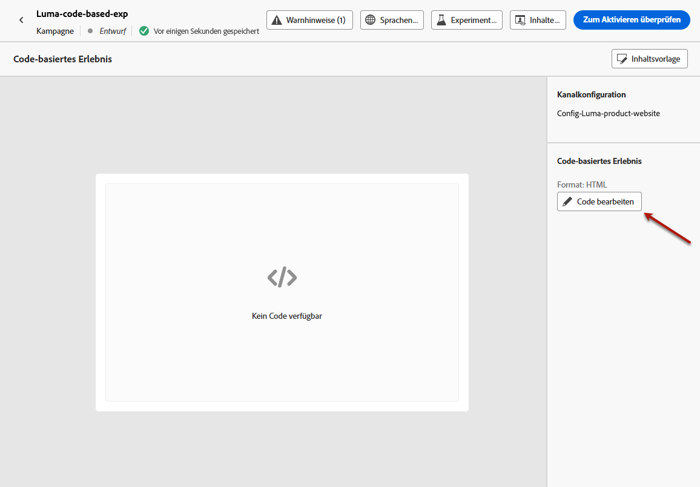
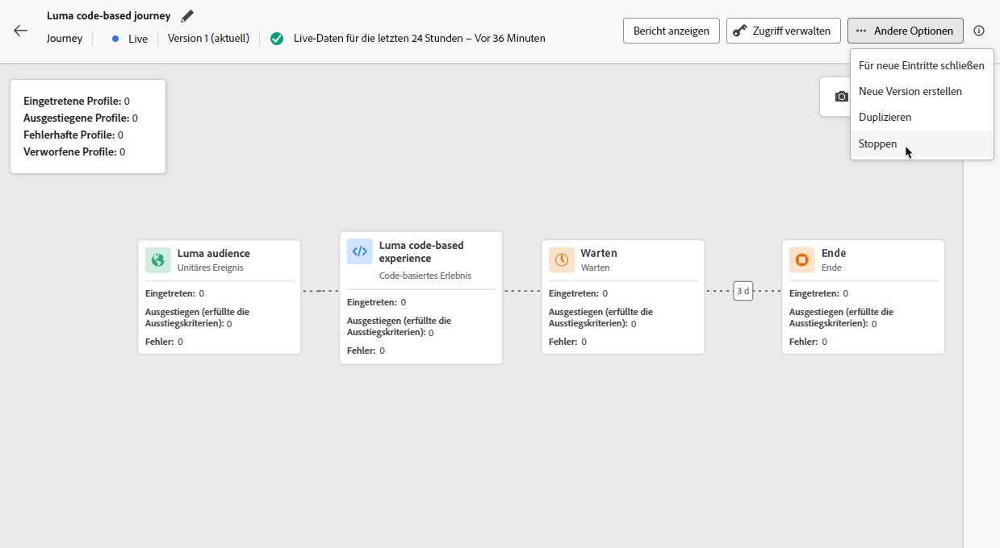

# Erstellen von Code-basierten Erlebnissen {#create-code-based}

In [!DNL Journey Optimizer] können Sie code-basierte Erlebnisse in einer Journey oder Kampagne erstellen.

Auf [dieser Seite](code-based-prerequisites.md) werden spezifische Schutzmechanismen und Empfehlungen für Code-basierte Erlebnisse ausführlich beschrieben.

## Codebasiertes Erlebnis über eine Journey oder Kampagne hinzufügen {#create-code-based-experience}

Gehen Sie wie folgt vor, um mit der Erstellung eines code-basierten Erlebnisses über eine Journey oder eine Kampagne zu beginnen.

>[!BEGINTABS]

>[!TAB Hinzufügen eines code-basierten Erlebnisses zu einer Journey]

Gehen Sie wie folgt vor, um eine **code-basierte Erlebnis** -Aktivität zu einer Journey hinzuzufügen:

1. [Erstellen Sie eine Journey](../building-journeys/journey-gs.md).

1. Beginnen Sie Ihre Journey mit einem [Ereignis](../building-journeys/general-events.md) oder einer Aktivität vom Typ [Zielgruppe lesen](../building-journeys/read-audience.md).

1. Ziehen Sie die Aktivität **[!UICONTROL Code-basiertes Erlebnis]** aus dem Bereich **[!UICONTROL Aktionen]** der Palette.

   

   >[!NOTE]
   >
   >Da **code-basiertes Erlebnis** eine eingehende Nachrichtenaktivität ist, ist sie mit einer 3-Tage-Aktivität vom Typ **Warten** ausgestattet. [Weitere Informationen](../building-journeys/wait-activity.md#auto-wait-node)

1. Geben Sie einen **[!UICONTROL Titel]** und eine **[!UICONTROL Beschreibung]** für Ihre Nachricht ein.

1. Wählen oder erstellen Sie die zu verwendende [Code-basierte Erlebniskonfiguration](code-based-configuration.md).

   

1. Wählen Sie die Schaltfläche **[!UICONTROL Inhalt bearbeiten]** aus und bearbeiten Sie den Inhalt mit dem Personalisierungs-Editor nach Bedarf. [Weitere Informationen](#edit-code)

1. Schließen Sie bei Bedarf Ihren Journey-Fluss ab, indem Sie zusätzliche Aktionen oder Ereignisse per Drag-and-Drop verschieben. [Weitere Informationen](../building-journeys/about-journey-activities.md)

1. Sobald Ihr code-basiertes Erlebnis fertig ist, schließen Sie die Konfiguration ab und veröffentlichen Sie Ihre Journey, um sie zu aktivieren. [Weitere Informationen](../building-journeys/publishing-the-journey.md)

Weitere Informationen zur Konfiguration einer Journey finden Sie auf [dieser Seite](../building-journeys/journey-gs.md).

>[!TAB Erstellen einer Code-basierten Erlebniskampagne]

Gehen Sie wie folgt vor, um mit der Erstellung Ihres **code-basierten Erlebnisses** durch eine Kampagne zu beginnen.

1. Erstellen einer Kampagne. [Weitere Informationen](../campaigns/create-campaign.md)

1. Wählen Sie den Typ der Kampagne aus, die Sie ausführen möchten.

   * **[!UICONTROL Geplant – Marketing]**: die Kampagne wird sofort oder an einem bestimmten Datum ausgeführt. Geplante Kampagnen dienen dem Versand von Nachrichten des Typs **Marketing**. Sie werden über die Benutzeroberfläche konfiguriert und ausgeführt.

   * **[!UICONTROL API-ausgelöst – Marketing/Transaktion]**: die Kampagne wird mithilfe eines API-Aufrufs ausgeführt.  API-ausgelöste Kampagnen zielen auf den Versand von Nachrichten des Typs **Marketing** oder **Transaktion** ab. Beim Typ „Transaktion“ handelt es sich um Nachrichten, die nach einer von einem Kontakt durchgeführten Aktion verschickt werden: Zurücksetzen des Passworts, Verlassen des Warenkorbs usw. [Erfahren Sie, wie Sie eine Kampagne mithilfe von APIs auslösen](../campaigns/api-triggered-campaigns.md)

1. Führen Sie die Schritte zum Erstellen einer Kampagne aus, z. B. die Kampagneneigenschaften, [Zielgruppe](../audience/about-audiences.md) und [Zeitplan](../campaigns/create-campaign.md#schedule). Weitere Informationen zur Konfiguration Ihrer Kampagne finden Sie auf [dieser Seite](../campaigns/get-started-with-campaigns.md).

1. Wählen Sie die Aktion **[!UICONTROL Code-basiertes Erlebnis]** aus.

1. Wählen Sie die Code-basierte Erlebniskonfiguration aus oder erstellen Sie sie. [Weitere Informationen](code-based-configuration.md)

   

1. Bearbeiten Sie den Inhalt wie gewünscht mit dem Personalisierungseditor. [Weitere Informationen](#edit-code)

   <!---->

Weitere Informationen zur Konfiguration Ihrer Kampagne finden Sie auf [dieser Seite](../campaigns/get-started-with-campaigns.md).

>[!ENDTABS]

## Bearbeiten des Code-Inhalts {#edit-code}

>[!CONTEXTUALHELP]
>id="ajo_code_based_experience"
>title="Verwenden des Personalisierungseditors"
>abstract="Fügen Sie den Code ein, den Sie als Teil dieser Code-basierten Erlebnisaktion bereitstellen möchten, und bearbeiten Sie ihn."
>additional-url="https://experienceleague.adobe.com/docs/journey-optimizer/using/content-management/personalization/expression-editor/personalization-build-expressions.html?lang=de" text="Erste Schritte mit dem Personalisierungseditor"

1. Wählen Sie im Bildschirm Journey-Aktivität oder Kampagnenbearbeitung die Option **[!UICONTROL Code bearbeiten]** aus.

   

1. Der [Personalisierungseditor](../personalization/personalization-build-expressions.md) wird geöffnet. Es handelt sich dabei um eine nicht visuelle Benutzeroberfläche zur Erstellung von Erlebnissen, mit der Code erstellt werden kann.

1. Der Authoring-Modus kann von HTML auf JSON umgestellt werden und umgekehrt.

   

   >[!CAUTION]
   >
   >Das Ändern des Authoring-Modus führt zum Verlust des gesamten aktuellen Codes. Stellen Sie daher sicher, dass Sie den Modus wechseln, bevor Sie mit dem Authoring beginnen.

1. Geben Sie Ihren Code nach Bedarf ein. Der Personalisierungseditor von [!DNL Journey Optimizer] kann mit allen Personalisierungs- und Bearbeitungsfunktionen genutzt werden. [Weitere Informationen](../personalization/personalization-build-expressions.md)

1. Sie können bei Bedarf HTML- oder JSON-Ausdrucksfragmente hinzufügen. [Weitere Informationen](../personalization/use-expression-fragments.md)

   Sie können auch einen Teil Ihres Code-Inhalts als Fragment speichern. [Weitere Informationen](../content-management/fragments.md#save-as-expression-fragment)

1. Bei code-basierten Erlebnissen können Sie die Entscheidungsfunktion für Erlebnisse verwenden. Wählen Sie in der linken Leiste das Symbol **[!UICONTROL Entscheidungsrichtlinie]** aus und klicken Sie auf **[!UICONTROL Entscheidungsrichtlinie hinzufügen]**. [Weitere Informationen](../experience-decisioning/create-decision.md) <!--UI labels TBC + TBC for journeys (visible in UI so probably confirmed) -->

   

   >[!NOTE]
   >
   >Erlebnis-Entscheidung ist derzeit nur für eine Gruppe von Organisationen verfügbar (begrenzte Verfügbarkeit). Um Zugang zu erhalten, wenden Sie sich an den Adobe-Support.

1. Klicken Sie auf **[!UICONTROL Speichern und Schließen]**, um Ihre Änderungen zu bestätigen.

Sobald Ihre Entwicklungspersonen nun einen API- oder SDK-Aufruf zum Abrufen von Inhalten für die in Ihrer Kanalkonfiguration definierte Oberfläche starten, werden die Änderungen auf die Web-Seite oder App angewendet.

## Testen des code-basierten Erlebnisses {#test-code-based-experience}

>[!CONTEXTUALHELP]
>id="ajo_code_based_preview"
>title="Vorschau des Code-basierten Erlebnisses"
>abstract="Eine Simulation, die zeigt, wie das Code-basierte Erlebnis aussehen wird."

Führen Sie die folgenden Schritte aus, um eine Vorschau des geänderten Code-basierten Erlebnisses anzuzeigen. Detaillierte Informationen zur Auswahl von Testprofilen und zur Vorschau Ihres Inhalts finden Sie auf der Seite [Vorschau und Test Ihrer Inhalte](../content-management/preview-test.md).

>[!CAUTION]
>
>Sie müssen über Testprofile verfügen, um simulieren zu können, welche Angebote an sie gesendet werden. Hier erfahren Sie, wie Sie [Testprofile erstellen](../audience/creating-test-profiles.md).

1. Wählen Sie auf der Journey oder Kampagne entweder im Personalisierungs-Editor oder im Bildschirm zum Bearbeiten von Inhalten die Option **[!UICONTROL Inhalt simulieren]** aus.

   

1. Klicken Sie auf **[!UICONTROL Testprofile verwalten]**, um ein oder mehrere Testprofile auszuwählen.

1. Es wird eine Vorschau des geänderten Code-basierten Erlebnisses angezeigt.

<!--
    

    You can also open it in the default browser, or copy the test URI to paste it in any browser. This allows you to share the link with your team and stakeholders who will be able to preview the new web experience in any browser before the campaign goes live.

    When copying the test URI, the content displayed is the one personalized for the test profile used when the content simulation was generated in [!DNL Journey Optimizer].-->

## Gestalten Sie Ihr code-basiertes Erlebnis live {#code-based-experience-live}

>[!IMPORTANT]
>
>Ab der Septemberversion können Sie mit einer neuen Kampagnen- und Journey-Aktivierungserfahrung den gesamten Validierungsprozess verwalten. So können Sie sicherstellen, dass Kampagnen und Journey von den entsprechenden Stakeholdern gründlich geprüft und genehmigt werden, bevor sie live geschaltet werden. Diese Funktion ist in begrenzter Verfügbarkeit verfügbar. [Weitere Informationen](../test-approve/gs-approval.md)

Nachdem Sie Ihr code-basiertes Erlebnis definiert und Ihren Inhalt mit dem [code-basierten Editor](#edit-code) nach Bedarf bearbeitet haben, können Sie Ihre Journey oder Kampagne aktivieren, um Ihre Änderungen für Ihre Zielgruppe sichtbar zu machen.

Sie können auch eine Vorschau Ihres code-basierten Erlebnisinhalts anzeigen, bevor Sie es aktivieren. [Weitere Informationen](#test-code-based-experience)

>[!NOTE]
>
>Wenn Sie eine code-basierte Journey/Kampagne aktivieren, die sich auf dieselben Seiten auswirkt wie eine andere Journey oder Kampagne, die bereits live ist, werden alle Änderungen auf Ihren Inhalt angewendet.
>
>Wenn mehrere codebasierte Journey oder Kampagnen dieselben Elemente Ihres Inhalts aktualisieren, hat die Journey/Kampagne mit der höchsten Priorität Vorrang.

### Publish - Codebasierte Journey {#publish-code-based-journey}

Gehen Sie wie folgt vor, um das code-basierte Erlebnis von einer Journey live zu machen.

1. Stellen Sie sicher, dass Ihre Journey gültig ist und kein Fehler vorliegt. [Weitere Informationen](../building-journeys/troubleshooting.md#checking-for-errors-before-testing)

1. Wählen Sie auf der Journey die Option **[!UICONTROL Publish]** aus, die sich oben rechts in der Dropdown-Liste befindet.

   

   >[!NOTE]
   >
   >Weitere Informationen zum Veröffentlichen von Journey finden Sie in [diesem Abschnitt](../building-journeys/publishing-the-journey.md).

Ihre code-basierte Journey erhält den Status **[!UICONTROL Live]** und ist nun für die ausgewählte Zielgruppe sichtbar. Jeder Empfänger Ihrer Journey kann Ihre Änderungen sehen.

>[!NOTE]
>
>Nachdem Sie auf **[!UICONTROL Publish]** geklickt haben, kann es bis zu 15 Minuten dauern, bis die Änderungen verfügbar sind.

### Codebasierte Kampagne aktivieren {#activate-code-based-campaign}

1. Wählen Sie in Ihrer Code-basierten Kampagne die Option **[!UICONTROL Zur Aktivierung überprüfen]**.

   

1. Überprüfen und bearbeiten Sie bei Bedarf Inhalt, Eigenschaften, Konfiguration, Zielgruppe und Zeitplan.

1. Wählen Sie **[!UICONTROL Aktivieren]** aus.

   

   >[!NOTE]
   >
   >Weitere Informationen zur Aktivierung von Kampagnen finden Sie in [diesem Abschnitt](../campaigns/review-activate-campaign.md).

Die Code-basierte Kampagne geht in den **[!UICONTROL Live]**-Status über und ist nun für die ausgewählte Zielgruppe sichtbar. Jeder Empfänger Ihrer Kampagne kann die Änderungen sehen, die Sie zu Ihrem Inhalt hinzugefügt haben.

>[!NOTE]
>
>Nachdem Sie auf **[!UICONTROL Aktivieren]** geklickt haben, kann es bis zu 15 Minuten dauern, bis Ihre Änderungen verfügbar sind.
>
>Wenn ein Zeitplan für die Code-basierte Kampagne definiert wurde, hat sie den Status **[!UICONTROL Geplant]**, bis das Startdatum und die Startzeit erreicht werden.

## Codebasierte Journey oder Kampagne stoppen {#stop-code-based-experience}

Wenn ein code-basiertes Erlebnis live ist, können Sie es stoppen, um zu verhindern, dass Ihre Zielgruppe Ihre Änderungen sieht. Führen Sie dazu folgende Schritte durch.

1. Wählen Sie eine Live-Journey oder Kampagne aus der entsprechenden Liste aus.

1. Führen Sie die entsprechende Aktion entsprechend Ihrem Fall aus:

   * Wählen Sie im oberen Kampagnenmenü die Option **[!UICONTROL Kampagne stoppen]**.

     

   * Klicken Sie im oberen Menü auf die Schaltfläche **[!UICONTROL Mehr]** und wählen Sie **[!UICONTROL Stoppen]** aus.

     

1. Die hinzugefügten Änderungen sind dann für die von Ihnen definierte Zielgruppe nicht mehr sichtbar.

>[!NOTE]
>
>Nachdem eine code-basierte Journey oder Kampagne beendet wurde, können Sie sie nicht mehr bearbeiten oder erneut aktivieren. Sie können sie nur duplizieren und die duplizierte Journey/Kampagne aktivieren.

<!--Reporting TBC

## Check the code-based experience reports {#check-code-based-reports}

Once your code-based experience is live, you can check the **[!UICONTROL Code-based]** tab of the  [Journey report](../reports/journey-global-report-cja.md#web-cja) and [Campaign report](../reports/campaign-global-report-cja.md#web) to compare elements such as the number of experiences delivered to your audience, and the number of engagements with your content.-->

<!--## Code-based reports

You can access code-based journey or campaign reports from the summary screen.

Global reports display events that occurred at least two hours ago and cover events over a selected time period. In comparison, Live reports focus on events that took place within the past 24 hours, with a minimum time interval of two minutes from the event occurrence.

### Code-based live report {#live-report-code-based}

From your campaign **[!UICONTROL Live report]**, the **[!UICONTROL Code-based experience]** tab details the main information relative to your apps or web pages. [Learn more on live report](../reports/campaign-live-report.md)

+++Learn more on the different metrics and widgets available for the Code-based experience report.

The **[!UICONTROL Code-based experience performance]** KPIs detail the main information relative to your visitors' engagement with your code-based experiences, such as:

* **[!UICONTROL Impressions]**: total number of experiences delivered to all users.

* **[!UICONTROL Interactions]**:  total number of engagements with your app/page. This includes any actions taken by the users, such as clicks or any other interactions.

The **[!UICONTROL Code-based experience summary]** graph shows the evolution of your experiences (impressions, unique impressions and interactions) for the last 24 hours.

TBC: The **[!UICONTROL Interactions by element]** table details the main information relative to your visitors' engagement with the various elements on your app/pages.
+++

### Code-based global report {#global-report-code-based}

Code-based campaign global report can be accessed directly from your journey or campaign with the **[!UICONTROL View report]** button. [Learn more on global report](../reports/campaign-global-report.md)

From your Campaign **[!UICONTROL Global report]**, the **[!UICONTROL Code-based experience]** tab details the main information relative to your apps or web pages.

Add image TBC

+++Learn more on the different metrics and widgets available for the Code-based experience report.

The **[!UICONTROL Code-based experience performance]** KPIs detail the main information relative to your visitors' engagement with your experiences, such as:

* **[!UICONTROL Unique impressions]**: number of unique users to whom the experience was delivered.

* **[!UICONTROL Impressions]**: total number of experiences delivered to all users.

* **[!UICONTROL Interactions]**: percentage of engagements with your app/page. This includes any actions taken by the users, such as clicks or any other interactions.

The **[!UICONTROL Code-based experience summary]** graph shows the evolution of your experiences (unique impressions, impressions and interactions) for the concerned period.

TBC: The **[!UICONTROL Interactions by element]** table details the main information relative to your visitors' engagement with the various elements on your apps/pages.
+++

TBC video if existing

## How-to video{#video}

The video below shows how to create a code-based campaign, configure its properties, review, and publish it.

>[!VIDEO]()

-->
