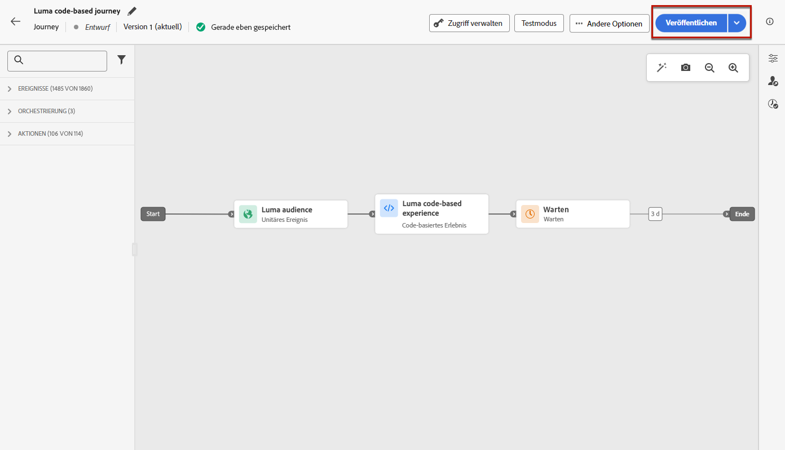

# Erstellen von Code-basierten Erlebnissen {#create-code-based}

In [!DNL Journey Optimizer] können Sie Code-basierte Erlebnisse in einer Journey oder Kampagne erstellen.

Auf [dieser Seite](code-based-prerequisites.md) werden spezifische Schutzmechanismen und Empfehlungen für Code-basierte Erlebnisse ausführlich beschrieben.

## Hinzufügen von Code-basierten Erlebnissen über eine Journey oder Kampagne {#create-code-based-experience}

Führen Sie die folgenden Schritte aus, um Ihr Code-basiertes Erlebnis durch eine Journey oder Kampagne zu erstellen.

>[!BEGINTABS]

>[!TAB  Hinzufügen eines Code-basierten Erlebnisses zu einer Journey]

Gehen Sie wie folgt vor, um die Aktivität **Code-basiertes Erlebnis** zu einer Journey hinzuzufügen:

1. [Erstellen einer Journey](../building-journeys/journey-gs.md)

1. Beginnen Sie Ihre Journey mit einem [Ereignis](../building-journeys/general-events.md) oder einer Aktivität vom Typ [Zielgruppe lesen](../building-journeys/read-audience.md).

1. Ziehen Sie aus dem Bereich **[!UICONTROL Aktionen]** der Palette die Aktivität **[!UICONTROL Code-basiertes Erlebnis]**.

   

   >[!NOTE]
   >
   >Da es sich bei **Code-basiertes Erlebnis** um eine Aktivität für eingehende Nachrichten handelt, ist sie mit einer 3-tägigen Aktivität **Wartezeit** verbunden. [Weitere Informationen](../building-journeys/wait-activity.md#auto-wait-node)

1. Geben Sie einen **[!UICONTROL Titel]** und eine **[!UICONTROL Beschreibung]** für Ihre Nachricht ein.

1. Wählen oder erstellen Sie die zu verwendende [Code-basierte Erlebniskonfiguration](code-based-configuration.md).

   

1. Wählen Sie die Schaltfläche **[!UICONTROL Inhalt bearbeiten]** aus und bearbeiten Sie Ihren Inhalt wie gewünscht mit dem Personalisierungseditor. [Weitere Informationen](#edit-code)

   Sie können auch eine vorhandene Inhaltsvorlage als Grundlage für Ihren Code-Inhalt verwenden. Beachten Sie, dass die zur Auswahl stehenden Vorlagen je nach zuvor ausgewählter Kanalkonfiguration auf HTML oder JSON übertragen werden. [Erfahren Sie, wie Sie Inhaltsvorlagen verwenden](../content-management/use-content-templates.md)

1. Schließen Sie bei Bedarf Ihren Journey-Fluss ab, indem Sie zusätzliche Aktionen oder Ereignisse per Drag-and-Drop verschieben. [Weitere Informationen](../building-journeys/about-journey-activities.md)

1. Sobald Ihr Code-Basis-Erlebnis fertig ist, schließen Sie die Konfiguration ab und veröffentlichen Ihre Journey, um sie zu aktivieren. [Weitere Informationen](../building-journeys/publishing-the-journey.md)

Weitere Informationen zur Konfiguration einer Journey finden Sie auf [dieser Seite](../building-journeys/journey-gs.md).

>[!TAB Erstellen einer Code-basierten Erlebniskampagne]

Gehen Sie wie folgt vor, um Ihr **Code-basiertes Erlebnis** durch eine Kampagne zu erstellen.

1. Erstellen einer Kampagne. [Weitere Informationen](../campaigns/create-campaign.md)

1. Wählen Sie den Typ der Kampagne aus, die Sie ausführen möchten.

   * **[!UICONTROL Geplant – Marketing]**: die Kampagne wird sofort oder an einem bestimmten Datum ausgeführt. Geplante Kampagnen dienen dem Versand von Nachrichten des Typs **Marketing**. Sie werden über die Benutzeroberfläche konfiguriert und ausgeführt.

   * **[!UICONTROL API-ausgelöst – Marketing/Transaktion]**: die Kampagne wird mithilfe eines API-Aufrufs ausgeführt.  API-ausgelöste Kampagnen zielen auf den Versand von Nachrichten des Typs **Marketing** oder **Transaktion** ab. Beim Typ „Transaktion“ handelt es sich um Nachrichten, die nach einer von einem Kontakt durchgeführten Aktion verschickt werden: Zurücksetzen des Passworts, Verlassen des Warenkorbs usw. [Erfahren Sie, wie Sie eine Kampagne mithilfe von APIs auslösen](../campaigns/api-triggered-campaigns.md)

1. Führen Sie die Schritte zum Erstellen einer Kampagne aus, z. B. die Kampagneneigenschaften, [Zielgruppe](../audience/about-audiences.md) und [Zeitplan](../campaigns/create-campaign.md#schedule). Weitere Informationen zur Konfiguration Ihrer Kampagne finden Sie auf [dieser Seite](../campaigns/get-started-with-campaigns.md).

1. Wählen Sie die Aktion **[!UICONTROL Code-basiertes Erlebnis]** aus.

1. Wählen Sie die Code-basierte Erlebniskonfiguration aus oder erstellen Sie sie. [Weitere Informationen](code-based-configuration.md)

   

1. Bearbeiten Sie den Inhalt wie gewünscht mit dem Personalisierungseditor. [Weitere Informationen](#edit-code)

   Sie können auch eine vorhandene Inhaltsvorlage als Grundlage für Ihren Code-Inhalt verwenden. Beachten Sie, dass die zur Auswahl stehenden Vorlagen je nach zuvor ausgewählter Kanalkonfiguration auf HTML oder JSON übertragen werden. [Erfahren Sie, wie Sie Inhaltsvorlagen verwenden](../content-management/use-content-templates.md)

   <!---->

Weitere Informationen zur Konfiguration Ihrer Kampagne finden Sie auf [dieser Seite](../campaigns/get-started-with-campaigns.md).

>[!ENDTABS]

## Bearbeiten des Code-Inhalts {#edit-code}

>[!CONTEXTUALHELP]
>id="ajo_code_based_experience"
>title="Verwenden des Personalisierungseditors"
>abstract="Fügen Sie den Code ein, den Sie als Teil dieser Code-basierten Erlebnisaktion bereitstellen möchten, und bearbeiten Sie ihn."
>additional-url="https://experienceleague.adobe.com/docs/journey-optimizer/using/content-management/personalization/expression-editor/personalization-build-expressions.html?lang=de" text="Erste Schritte mit dem Personalisierungseditor"

1. Wählen Sie in der Aktivität „Journey“ oder im Bildschirm „Kampagnenbearbeitung“ die Option **[!UICONTROL Code bearbeiten]** aus.

   

1. Der [Personalisierungseditor](../personalization/personalization-build-expressions.md) wird geöffnet. Es handelt sich dabei um eine nicht visuelle Benutzeroberfläche zur Erstellung von Erlebnissen, mit der Code erstellt werden kann.

1. Der Authoring-Modus kann von HTML auf JSON umgestellt werden und umgekehrt.

   

   >[!CAUTION]
   >
   >Das Ändern des Authoring-Modus führt zum Verlust des gesamten aktuellen Codes. Stellen Sie daher sicher, dass Sie den Modus wechseln, bevor Sie mit dem Authoring beginnen.

1. Geben Sie Ihren Code nach Bedarf ein. Der Personalisierungseditor von [!DNL Journey Optimizer] kann mit allen Personalisierungs- und Bearbeitungsfunktionen genutzt werden. [Weitere Informationen](../personalization/personalization-build-expressions.md)

1. Sie können bei Bedarf HTML- oder JSON-Ausdrucksfragmente hinzufügen. [Weitere Informationen](../personalization/use-expression-fragments.md)

   Sie können auch einen Teil Ihres Code-Inhalts als Fragment speichern. [Weitere Informationen](../content-management/fragments.md#save-as-expression-fragment)

1. Bei code-basierten Erlebnissen können Sie die Entscheidungsfunktion verwenden. Wählen Sie in der linken Leiste das Symbol **[!UICONTROL Entscheidungsrichtlinie]** aus und klicken Sie auf **[!UICONTROL Entscheidungsrichtlinie hinzufügen]**. [Weitere Informationen](../experience-decisioning/create-decision.md)

   

1. Klicken Sie auf **[!UICONTROL Speichern und Schließen]**, um Ihre Änderungen zu bestätigen.

Sobald Ihre Entwicklungspersonen nun einen API- oder SDK-Aufruf zum Abrufen von Inhalten für die in Ihrer Kanalkonfiguration definierte Oberfläche starten, werden die Änderungen auf die Web-Seite oder App angewendet.

## Testen des Code-basierten Erlebnisses {#test-code-based-experience}

>[!CONTEXTUALHELP]
>id="ajo_code_based_preview"
>title="Vorschau des Code-basierten Erlebnisses"
>abstract="Eine Simulation, die zeigt, wie das Code-basierte Erlebnis aussehen wird."

Führen Sie die folgenden Schritte aus, um eine Vorschau des geänderten Code-basierten Erlebnisses anzuzeigen.

>[!CAUTION]
>
>Sie müssen über Testprofile verfügen, um simulieren zu können, welche Angebote an sie gesendet werden. Hier erfahren Sie, wie Sie [Testprofile erstellen](../audience/creating-test-profiles.md).

1. Wählen Sie in der Journey oder Kampagne entweder im Personalisierungseditor oder im Bildschirm „Inhalt bearbeiten“ die Option **[!UICONTROL Inhalt simulieren]**.

   

1. Klicken Sie auf **[!UICONTROL Testprofile verwalten]**, um ein oder mehrere Testprofile auszuwählen.

1. Es wird eine Vorschau des geänderten Code-basierten Erlebnisses angezeigt.

Detaillierte Informationen zur Auswahl von Testprofilen und zur Vorschau Ihres Inhalts finden Sie in [diesem Abschnitt](../content-management/preview.md).

### Vorschau auf Gerät {#preview-on-device}

>[!CONTEXTUALHELP]
>id="ajo_code_based_preview_device"
>title="Anzeigen der Vorschau Ihres Code-basierten Erlebnisses auf einem echten Gerät"
>abstract="Erhalten Sie eine Vorschau Ihrer personalisierten Erlebnisse direkt in Ihrem Browser oder auf Ihren Mobilgeräten, um zu sehen, wie sie auf echten Geräten aussehen."

>[!CONTEXTUALHELP]
>id="ajo_code_based_preview_device_web"
>title="Anzeigen der Vorschau Ihrer Code-basierten Web-Erlebnisse auf dem Gerät"
>abstract="Überprüfen Sie den QR-Code oder kopieren Sie den Link zur Vorschau auf dem Gerät."

>[!CONTEXTUALHELP]
>id="ajo_code_based_preview_device_mobile"
>title="Anzeigen der Vorschau Ihres Code-basierten mobilen Erlebnisses auf dem Gerät"
>abstract="Überprüfen Sie den QR-Code oder kopieren Sie den Link zur Vorschau auf dem Gerät. Wenn eine Verbindung besteht, geben Sie die PIN auf dem Gerät ein. Möglicherweise müssen Sie Ihre App neu starten, damit die Änderungen bei jedem Aktualisieren der Vorschau-Links angezeigt werden."

>[!CONTEXTUALHELP]
>id="ajo_code_based_preview_device_refresh"
>title="Aktualisieren des Vorschau-Links, um die aktuelle Ansicht widerzuspiegeln."
>abstract="In der Vorschau auf dem Gerät wird der Inhalt ab dem Zeitpunkt angezeigt, zu dem Sie den Vorschau-Link erstellt oder aktualisiert haben. Wenn Sie den Inhalt geändert oder ein anderes Testprofil oder eine andere Behandlung ausgewählt haben, aktualisieren Sie die Vorschau, damit sie die aktuelle Ansicht widerspiegelt."

Beim Erstellen Code-basierter Erlebnisse für Web-Seiten oder mobile Apps können Sie eine Vorschau Ihrer personalisierten Erlebnisse direkt in Ihrem Browser oder auf Ihren Mobilgeräten anzeigen, um zu sehen, wie diese Erlebnisse auf echten Geräten aussehen.

>[!WARNING]
>
>Die Vorschau auf dem Gerät ist nicht verfügbar, wenn die kontextuellen Attribute [Entscheidungsrichtlinien](../experience-decisioning/create-decision.md) oder [Personalisierung](../personalization/personalization-build-expressions.md) verwendet werden.

1. Klicken Sie auf dem Bildschirm **[!UICONTROL Simulieren]** auf die Schaltfläche **[!UICONTROL Vorschau-Optionen öffnen]**. Die Vorschauoptionen hängen von der Plattform ab, die in Ihrer [Code-basierten Konfiguration](code-based-configuration.md#create-code-based-configuration) ausgewählt wurde.

1. Wenn Sie eine [Web-Plattform](code-based-configuration.md#web) in Ihrer Code-basierten Konfiguration verwenden, wird das schreibgeschützte Feld **[!UICONTROL URL für die Gerätevorschau]** mit der für die aktuelle Kanalkonfiguration eingegebenen URL vorausgefüllt.

   

   Sie haben folgende Möglichkeiten:

   * Wählen Sie die Schaltfläche **[!UICONTROL Link kopieren]** aus und fügen Sie den Link in einen Browser-Tab ein. Sie können den Link auch für Ihr Team und Ihre Stakeholder freigeben, die sich eine Vorschau des neuen Erlebnisses in einem beliebigen Browser ansehen können, bevor die Änderungen live gehen.

   * Klicken Sie auf **[!UICONTROL Auf neuer Registerkarte öffnen]**, um den Link in Ihrem aktuellen Browser zu öffnen.

   * Scannen Sie den QR-Code mit Ihrem Mobilgerät, um den Vorschau-Link in einem mobilen Browser zu öffnen.

1. Wenn Sie [mobile Plattformen](code-based-configuration.md#mobile) (iOS/Android) in Ihrer Code-basierten Konfiguration verwenden, wird das schreibgeschützte Feld **[!UICONTROL Deeplink]** mit dem Wert für **[!UICONTROL Vorschau-URL]** ausgefüllt, der in der Kanalkonfiguration für die ausgewählte Plattform eingegeben wurde.

   Schalten Sie zwischen den Registerkarten **[!UICONTROL iOS]** und **[!DNL Android]** hin und her, um eine Vorschau Ihres Erlebnisses für die Plattform Ihrer Wahl anzuzeigen.

   

   Sie haben folgende Möglichkeiten:

   * Wählen Sie die Schaltfläche **[!UICONTROL Link kopieren]** aus und geben Sie den Link für Ihr Team und Ihre Stakeholder frei, die sich eine Vorschau des neuen Erlebnisses in einem beliebigen Browser ansehen können, bevor die Änderungen live gehen.

   * Scannen Sie den QR-Code mit Ihrem Mobilgerät, um den Vorschau-Link direkt in der App zu öffnen.  Sie müssen die PIN auf Ihrem Gerät eingeben, um die [Assurance](https://experienceleague.adobe.com/de/docs/experience-platform/assurance/tutorials/implement-assurance){target="_blank"}-Sitzung einzurichten.

     >[!NOTE]
     >
     >**Adobe Experience Platform Assurance** ist ein Produkt aus Adobe Experience Cloud, mit dem Sie die Datenerfassung und Bereitstellung von Erlebnissen in Ihrer App überprüfen, testen, simulieren und validieren können. [Weitere Informationen](https://experienceleague.adobe.com/de/docs/experience-platform/assurance/home){target="_blank"}

1. Vorschau-Links werden für das ausgewählte Testprofil und, wenn Sie [Inhaltsexperiment](../content-management/content-experiment.md) in Ihrer Journey oder Kampagne verwenden, für die ausgewählte Abwandlung generiert.

   <!--If you have modified the content or selected a different treatment or test profile, scroll down to the bottom of the **[!UICONTROL Preview on device]** pop-up and click **[!UICONTROL Refresh preview link]** to reflect the current state.

   -->

   <!--When creating a content experiment, you need to select a given treatment and click the **[!UICONTROL Simulate content]** button to obtain the link corresponding to that treatment, then select another treatment, click the **[!UICONTROL Simulate content]** button to obtain a new preview link, and so on.-->

   Beim Aktualisieren des Inhalts oder Auswählen eines anderen Testprofils oder einer anderen Abwandlung wird der Vorschau-Link automatisch aktualisiert. Sie können den Link in verschiedene Browser-Tabs kopieren und die Erlebnisse vergleichen.

## Live-Schalten Ihres Code-basierten Erlebnisses {#code-based-experience-live}

>[!IMPORTANT]
>
> Wenn Ihre Kampagne einer Genehmigungsrichtlinie unterliegt, müssen Sie eine Genehmigung anfordern, um Ihre Code-basierten Erlebnisse aktivieren zu können.  [Weitere Informationen](../test-approve/gs-approval.md)

Nachdem Sie Ihr Code-basiertes Erlebnis definiert und Ihren Inhalt mit dem [Code-basierten Editor](#edit-code) nach Bedarf bearbeitet haben, können Sie Ihre Journey oder Kampagne aktivieren, um Ihre Änderungen für Ihre Zielgruppe sichtbar zu machen.

Sie können auch eine Vorschau Ihrer Code-basierten Erlebnisinhalte anzeigen, bevor Sie sie live schalten. [Weitere Informationen](#test-code-based-experience)

>[!NOTE]
>
>Wenn Sie eine Code-basierte Journey/Kampagne aktivieren, die sich auf dieselben Seiten wie eine andere Journey oder Kampagne auswirkt, die bereits live ist, werden alle Änderungen auf Ihre Inhalte angewendet.
>
>Wenn mehrere Code-basierte Journeys oder Kampagnen dieselben Elemente Ihres Inhalts aktualisieren, hat die Journey/Kampagne mit der höchsten Priorität Vorrang.

Sobald Ihre Code-basierte Journey oder Kampagne live ist, ist Ihr App-Implementierungs-Team dafür verantwortlich, explizite API- oder SDK-Aufrufe durchzuführen, um Inhalte für die in der ausgewählten [Code-basierten Erlebniskonfiguration](code-based-configuration.md) definierten Oberflächen abzurufen. Weitere Informationen zu verschiedenen Kundenimplementierungen finden Sie in [diesem Abschnitt](code-based-implementation-samples.md).

### Veröffentlichen einer Code-basierten Journey {#publish-code-based-journey}

Gehen Sie wie folgt vor, um das Code-basierte Erlebnis von einer Journey live zu schalten.

1. Stellen Sie sicher, dass Ihre Journey gültig ist und kein Fehler vorliegt. [Weitere Informationen](../building-journeys/troubleshooting.md#checking-for-errors-before-testing)

1. Wählen Sie in der Journey im Dropdown-Menü oben rechts die Option **[!UICONTROL Veröffentlichen]** aus.

   

   >[!NOTE]
   >
   >Erfahren Sie mehr über die Veröffentlichung von Journeys in [diesem Abschnitt](../building-journeys/publishing-the-journey.md).

Ihre Code-basierte Journey erhält den Status **[!UICONTROL Live]** und ist nun für die ausgewählte Zielgruppe sichtbar. Jede Empfängerin und jeder Empfänger der Journey kann die Änderungen sehen.

>[!NOTE]
>
>Nachdem Sie auf **[!UICONTROL Veröffentlichen]** geklickt haben, kann es bis zu 15 Minuten dauern, bis die Änderungen live verfügbar sind.

### Aktivieren einer Code-basierten Kampagne {#activate-code-based-campaign}

1. Wählen Sie in Ihrer Code-basierten Kampagne die Option **[!UICONTROL Zur Aktivierung überprüfen]**.

   

1. Überprüfen und bearbeiten Sie bei Bedarf Inhalt, Eigenschaften, Konfiguration, Zielgruppe und Zeitplan.

1. Wählen Sie **[!UICONTROL Aktivieren]** aus.

   

   >[!NOTE]
   >
   >Weitere Informationen zur Aktivierung von Kampagnen finden Sie in [diesem Abschnitt](../campaigns/review-activate-campaign.md).

Die Code-basierte Kampagne geht in den **[!UICONTROL Live]**-Status über und ist nun für die ausgewählte Zielgruppe sichtbar. Alle Empfängerinnen und Empfänger Ihrer Kampagne können die Änderungen sehen, die Sie an Ihrem Inhalt vorgenommen haben.

>[!NOTE]
>
>Nachdem Sie auf **[!UICONTROL Aktivieren]** geklickt haben, kann es bis zu 15 Minuten dauern, bis Ihre Änderungen live verfügbar sind.
>
>Wenn ein Zeitplan für die Code-basierte Kampagne definiert wurde, hat sie den Status **[!UICONTROL Geplant]**, bis das Startdatum und die Startzeit erreicht werden.

## Stoppen einer Code-basierten Journey oder Kampagne {#stop-code-based-experience}

Wenn ein Code-basiertes Erlebnis live ist, können Sie es stoppen, um zu verhindern, dass Ihre Zielgruppe Ihre Änderungen sieht. Führen Sie dazu folgende Schritte durch.

1. Wählen Sie eine Live-Journey oder -Kampagne aus der entsprechenden Liste aus.

1. Führen Sie je nach Fall die entsprechende Aktion aus:

   * Wählen Sie im oberen Menü der Kampagne **[!UICONTROL Kampagne stoppen]**.

     

   * Klicken Sie im oberen Menü der Journey auf die Schaltfläche **[!UICONTROL Mehr]** und wählen Sie **[!UICONTROL Stoppen]**.

     

1. Die hinzugefügten Änderungen sind dann für die von Ihnen definierte Zielgruppe nicht mehr sichtbar.

>[!NOTE]
>
>Sobald eine Code-basierte Journey oder Kampagne gestoppt wurde, können Sie sie nicht mehr bearbeiten oder aktivieren. Sie können sie nur duplizieren und die duplizierte Journey/Kampagne aktivieren.

<!--Reporting TBC

## Check the code-based experience reports {#check-code-based-reports}

Once your code-based experience is live, you can check the **[!UICONTROL Code-based]** tab of the  [Journey report](../reports/journey-global-report-cja.md#web-cja) and [Campaign report](../reports/campaign-global-report-cja.md#web) to compare elements such as the number of experiences delivered to your audience, and the number of engagements with your content.-->

<!--## Code-based reports

You can access code-based journey or campaign reports from the summary screen.

Global reports display events that occurred at least two hours ago and cover events over a selected time period. In comparison, Live reports focus on events that took place within the past 24 hours, with a minimum time interval of two minutes from the event occurrence.

### Code-based live report {#live-report-code-based}

From your campaign **[!UICONTROL Live report]**, the **[!UICONTROL Code-based experience]** tab details the main information relative to your apps or web pages. [Learn more on live report](../reports/campaign-live-report.md)

+++Learn more on the different metrics and widgets available for the Code-based experience report.

The **[!UICONTROL Code-based experience performance]** KPIs detail the main information relative to your visitors' engagement with your code-based experiences, such as:

* **[!UICONTROL Impressions]**: total number of experiences delivered to all users.

* **[!UICONTROL Interactions]**:  total number of engagements with your app/page. This includes any actions taken by the users, such as clicks or any other interactions.

The **[!UICONTROL Code-based experience summary]** graph shows the evolution of your experiences (impressions, unique impressions and interactions) for the last 24 hours.

TBC: The **[!UICONTROL Interactions by element]** table details the main information relative to your visitors' engagement with the various elements on your app/pages.
+++

### Code-based global report {#global-report-code-based}

Code-based campaign global report can be accessed directly from your journey or campaign with the **[!UICONTROL View report]** button. [Learn more on global report](../reports/campaign-global-report-cja.md)

From your Campaign **[!UICONTROL Global report]**, the **[!UICONTROL Code-based experience]** tab details the main information relative to your apps or web pages.

Add image TBC

+++Learn more on the different metrics and widgets available for the Code-based experience report.

The **[!UICONTROL Code-based experience performance]** KPIs detail the main information relative to your visitors' engagement with your experiences, such as:

* **[!UICONTROL Unique impressions]**: number of unique users to whom the experience was delivered.

* **[!UICONTROL Impressions]**: total number of experiences delivered to all users.

* **[!UICONTROL Interactions]**: percentage of engagements with your app/page. This includes any actions taken by the users, such as clicks or any other interactions.

The **[!UICONTROL Code-based experience summary]** graph shows the evolution of your experiences (unique impressions, impressions and interactions) for the concerned period.

TBC: The **[!UICONTROL Interactions by element]** table details the main information relative to your visitors' engagement with the various elements on your apps/pages.
+++

TBC video if existing

## How-to video{#video}

The video below shows how to create a code-based campaign, configure its properties, review, and publish it.

>[!VIDEO]()

-->
