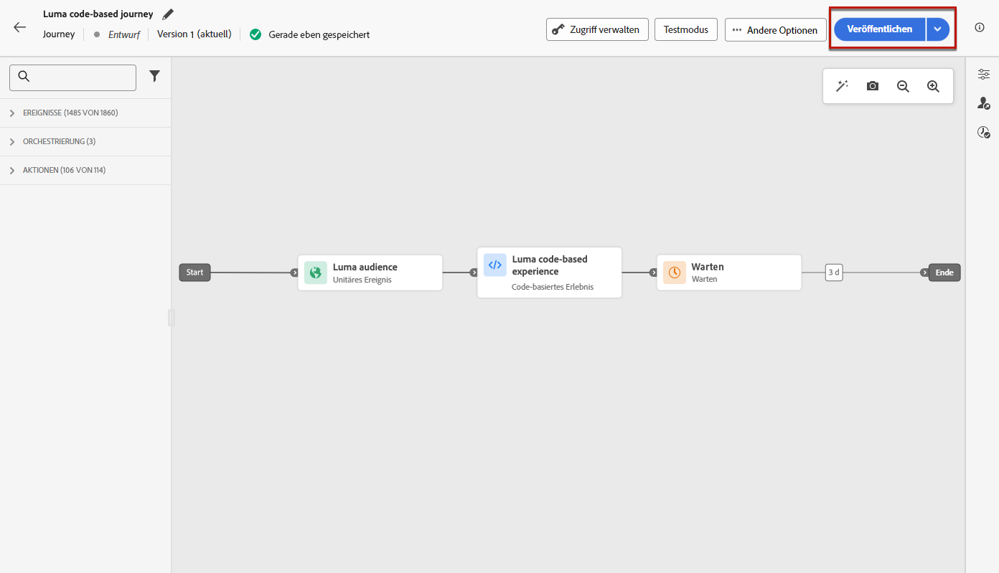
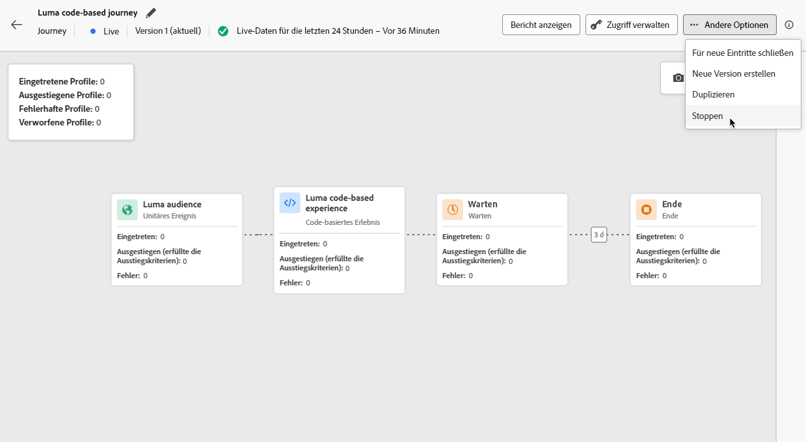

# Verwalten von Code-basierten Erlebnissen {#publish-code-based}

## Live-Schalten Ihres Code-basierten Erlebnisses {#code-based-experience-live}

>[!IMPORTANT]
>
> Wenn Ihre Kampagne einer Genehmigungsrichtlinie unterliegt, müssen Sie eine Genehmigung anfordern, um Ihre Code-basierten Erlebnisse aktivieren zu können.  [Weitere Informationen](../test-approve/gs-approval.md)

Nachdem Sie Ihr Code-basiertes Erlebnis definiert und Ihren Inhalt mit dem [Code-basierten Editor](create-code-based.md#edit-code) nach Bedarf bearbeitet haben, können Sie Ihre Journey oder Kampagne aktivieren, um Ihre Änderungen für Ihre Zielgruppe sichtbar zu machen.

Sie können auch eine Vorschau Ihrer Code-basierten Erlebnisinhalte anzeigen, bevor Sie sie live schalten. [Weitere Informationen](test-code-based.md)

>[!NOTE]
>
>Wenn Sie eine Code-basierte Journey/Kampagne aktivieren, die sich auf dieselben Seiten wie eine andere Journey oder Kampagne auswirkt, die bereits live ist, werden alle Änderungen auf Ihre Inhalte angewendet.
>
>Wenn mehrere Code-basierte Journeys oder Kampagnen dieselben Elemente Ihres Inhalts aktualisieren, hat die Journey/Kampagne mit der höchsten Priorität Vorrang. [Weitere Informationen zu Prioritätswerten](../conflict-prioritization/priority-scores.md)

Sobald Ihre Code-basierte Journey oder Kampagne live ist, ist Ihr App-Implementierungs-Team dafür verantwortlich, explizite API- oder SDK-Aufrufe durchzuführen, um Inhalte für die in der ausgewählten [Code-basierten Erlebniskonfiguration](code-based-configuration.md) definierten Oberflächen abzurufen. Weitere Informationen zu verschiedenen Kundenimplementierungen finden Sie in [diesem Abschnitt](code-based-implementation-samples.md).

### Veröffentlichen einer Code-basierten Journey {#publish-code-based-journey}

Gehen Sie wie folgt vor, um das Code-basierte Erlebnis von einer Journey live zu schalten.

1. Stellen Sie sicher, dass Ihre Journey gültig ist und kein Fehler vorliegt. [Weitere Informationen](../building-journeys/troubleshooting.md#activity-errors)

1. Wählen Sie in der Journey im Dropdown-Menü oben rechts die Option **[!UICONTROL Veröffentlichen]** aus.

   

   >[!NOTE]
   >
   >Weitere Informationen zur Veröffentlichung von Journeys finden Sie in [diesem Abschnitt](../building-journeys/publish-journey.md).

Ihre Code-basierte Journey erhält den Status **[!UICONTROL Live]** und ist nun für die ausgewählte Zielgruppe sichtbar. Jede Empfängerin und jeder Empfänger der Journey kann die Änderungen sehen.

>[!NOTE]
>
>Nachdem Sie auf **[!UICONTROL Veröffentlichen]** geklickt haben, kann es bis zu 15 Minuten dauern, bis die Änderungen live verfügbar sind.

### Aktivieren einer Code-basierten Kampagne {#activate-code-based-campaign}

1. Wählen Sie in Ihrer Code-basierten Kampagne die Option **[!UICONTROL Zur Aktivierung überprüfen]**.

   

1. Überprüfen und bearbeiten Sie bei Bedarf Inhalt, Eigenschaften, Konfiguration, Zielgruppe und Zeitplan.

1. Wählen Sie **[!UICONTROL Aktivieren]** aus.

   

   >[!NOTE]
   >
   >Weitere Informationen zur Aktivierung von Kampagnen finden Sie in [diesem Abschnitt](../campaigns/review-activate-campaign.md).

Ihre Code-basierte Kampagne verwendet **[!UICONTROL Live]** [Status](../campaigns/manage-campaigns.md#statuses) und ist jetzt für die ausgewählte Zielgruppe sichtbar. Alle Empfängerinnen und Empfänger Ihrer Kampagne können die Änderungen sehen, die Sie an Ihrem Inhalt vorgenommen haben.

>[!NOTE]
>
>Nachdem Sie auf **[!UICONTROL Aktivieren]** geklickt haben, kann es bis zu 15 Minuten dauern, bis Ihre Änderungen live verfügbar sind.
>
>Wenn Sie einen Zeitplan für Ihre Code-basierte Kampagne definiert haben, hat sie den **[!UICONTROL Geplant]** [Status](../campaigns/manage-campaigns.md#statuses) bis das Startdatum und die Startzeit erreicht sind.

## Stoppen einer Code-basierten Journey oder Kampagne {#stop-code-based-experience}

Wenn ein Code-basiertes Erlebnis live ist, können Sie es stoppen, um zu verhindern, dass Ihre Zielgruppe Ihre Änderungen sieht. Führen Sie dazu folgende Schritte durch.

1. Wählen Sie eine Live-Journey oder -Kampagne aus der entsprechenden Liste aus.

1. Führen Sie je nach Fall die entsprechende Aktion aus:

   * Wählen Sie im oberen Menü der Kampagne **[!UICONTROL Kampagne stoppen]**.

     

   * Klicken Sie im oberen Menü der Journey auf die Schaltfläche **[!UICONTROL Mehr]** und wählen Sie **[!UICONTROL Stoppen]**.

     

1. Die hinzugefügten Änderungen sind dann für die von Ihnen definierte Zielgruppe nicht mehr sichtbar.

>[!NOTE]
>
>Sobald eine Code-basierte Journey oder Kampagne gestoppt wurde, können Sie sie nicht mehr bearbeiten oder aktivieren. Sie können sie nur duplizieren und die duplizierte Journey/Kampagne aktivieren.

<!--Reporting TBC

## Check the code-based experience reports {#check-code-based-reports}

Once your code-based experience is live, you can check the **[!UICONTROL Code-based]** tab of the  [Journey report](../reports/journey-global-report-cja.md#web-cja) and [Campaign report](../reports/campaign-global-report-cja.md#web) to compare elements such as the number of experiences delivered to your audience, and the number of engagements with your content.-->

<!--## Code-based reports

You can access code-based journey or campaign reports from the summary screen.

Global reports display events that occurred at least two hours ago and cover events over a selected time period. In comparison, Live reports focus on events that took place within the past 24 hours, with a minimum time interval of two minutes from the event occurrence.

### Code-based live report {#live-report-code-based}

From your campaign **[!UICONTROL Live report]**, the **[!UICONTROL Code-based experience]** tab details the main information relative to your apps or web pages. [Learn more about live report](../reports/campaign-live-report.md)

+++Learn more about the different metrics and widgets available for the Code-based experience report.

The **[!UICONTROL Code-based experience performance]** KPIs detail the main information relative to your visitors' engagement with your code-based experiences, such as:

* **[!UICONTROL Impressions]**: total number of experiences delivered to all users.

* **[!UICONTROL Interactions]**:  total number of engagements with your app/page. This includes any actions taken by the users, such as clicks or any other interactions.

The **[!UICONTROL Code-based experience summary]** graph shows the evolution of your experiences (impressions, unique impressions and interactions) for the last 24 hours.

TBC: The **[!UICONTROL Interactions by element]** table details the main information relative to your visitors' engagement with the various elements on your app/pages.
+++

### Code-based global report {#global-report-code-based}

Code-based campaign global report can be accessed directly from your journey or campaign with the **[!UICONTROL View report]** button. [Learn more about global report](../reports/campaign-global-report-cja.md)

From your Campaign **[!UICONTROL Global report]**, the **[!UICONTROL Code-based experience]** tab details the main information relative to your apps or web pages.

Add image TBC

+++Learn more about the different metrics and widgets available for the Code-based experience report.

The **[!UICONTROL Code-based experience performance]** KPIs detail the main information relative to your visitors' engagement with your experiences, such as:

* **[!UICONTROL Unique impressions]**: number of unique users to whom the experience was delivered.

* **[!UICONTROL Impressions]**: total number of experiences delivered to all users.

* **[!UICONTROL Interactions]**: percentage of engagements with your app/page. This includes any actions taken by the users, such as clicks or any other interactions.

The **[!UICONTROL Code-based experience summary]** graph shows the evolution of your experiences (unique impressions, impressions and interactions) for the concerned period.

TBC: The **[!UICONTROL Interactions by element]** table details the main information relative to your visitors' engagement with the various elements on your apps/pages.
+++

-->
