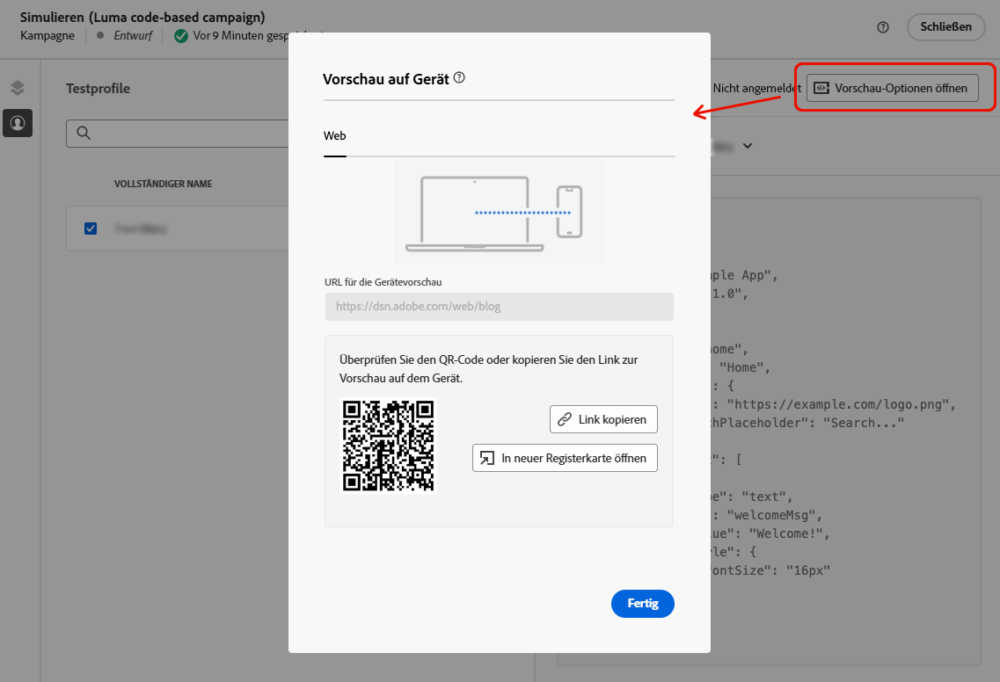
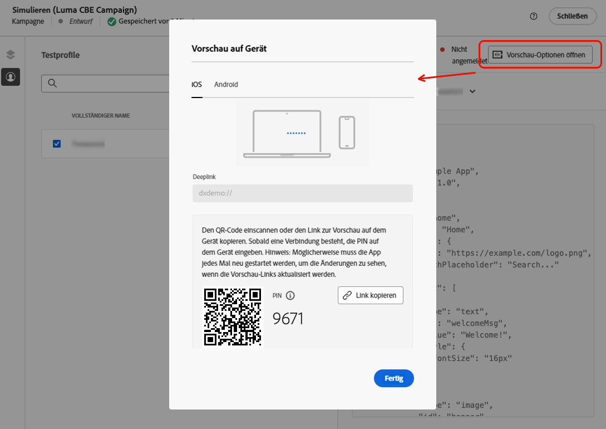

# Testen von Code-basierten Erlebnissen {#test-code-based}

## Anzeigen des Code-basierten Erlebnisses in der Vorschau {#preview-code-based}

>[!CONTEXTUALHELP]
>id="ajo_code_based_preview"
>title="Anzeigen des Code-basierten Erlebnisses in der Vorschau"
>abstract="Eine Simulation, die zeigt, wie das Code-basierte Erlebnis aussehen wird."

Führen Sie die folgenden Schritte aus, um eine Vorschau des geänderten Code-basierten Erlebnisses anzuzeigen.

>[!CAUTION]
>
>Sie müssen über Testprofile verfügen, um simulieren zu können, welche Angebote an sie gesendet werden. Hier erfahren Sie, wie Sie [Testprofile erstellen](../audience/creating-test-profiles.md).

1. Wählen Sie in der Journey oder Kampagne entweder im Personalisierungseditor oder im Bildschirm „Inhalt bearbeiten“ die Option **[!UICONTROL Inhalt simulieren]**.

   

1. Klicken Sie auf **[!UICONTROL Testprofile verwalten]**, um ein oder mehrere Testprofile auszuwählen.

1. Es wird eine Vorschau des geänderten Code-basierten Erlebnisses angezeigt.

Detaillierte Informationen zur Auswahl von Testprofilen und zur Vorschau Ihres Inhalts finden Sie in [diesem Abschnitt](../content-management/preview.md).

## Vorschau auf Gerät {#preview-on-device}

>[!CONTEXTUALHELP]
>id="ajo_code_based_preview_device"
>title="Anzeigen der Vorschau Ihres Code-basierten Erlebnisses auf einem echten Gerät"
>abstract="Erhalten Sie eine Vorschau Ihrer personalisierten Erlebnisse direkt in Ihrem Browser oder auf Ihren Mobilgeräten, um zu sehen, wie sie auf echten Geräten aussehen."

>[!CONTEXTUALHELP]
>id="ajo_code_based_preview_device_web"
>title="Anzeigen der Vorschau Ihrer Code-basierten Web-Erlebnisse auf dem Gerät"
>abstract="Überprüfen Sie den QR-Code oder kopieren Sie den Link zur Vorschau auf dem Gerät."

>[!CONTEXTUALHELP]
>id="ajo_code_based_preview_device_mobile"
>title="Anzeigen der Vorschau Ihres Code-basierten mobilen Erlebnisses auf dem Gerät"
>abstract="Überprüfen Sie den QR-Code oder kopieren Sie den Link zur Vorschau auf dem Gerät. Wenn eine Verbindung besteht, geben Sie die PIN auf dem Gerät ein. Möglicherweise müssen Sie Ihre App neu starten, damit die Änderungen bei jedem Aktualisieren der Vorschau-Links angezeigt werden."

>[!CONTEXTUALHELP]
>id="ajo_code_based_preview_device_refresh"
>title="Aktualisieren des Vorschau-Links, um die aktuelle Ansicht widerzuspiegeln."
>abstract="In der Vorschau auf dem Gerät wird der Inhalt ab dem Zeitpunkt angezeigt, zu dem Sie den Vorschau-Link erstellt oder aktualisiert haben. Wenn Sie den Inhalt geändert oder ein anderes Testprofil oder eine andere Behandlung ausgewählt haben, aktualisieren Sie die Vorschau, damit sie die aktuelle Ansicht widerspiegelt."

Beim Erstellen Code-basierter Erlebnisse für Web-Seiten oder mobile Apps können Sie eine Vorschau Ihrer personalisierten Erlebnisse direkt in Ihrem Browser oder auf Ihren Mobilgeräten anzeigen, um zu sehen, wie diese Erlebnisse auf echten Geräten aussehen.

>[!WARNING]
>
>Die Vorschau auf dem Gerät ist nicht verfügbar, wenn die kontextuellen Attribute [Entscheidungsrichtlinien](../experience-decisioning/create-decision.md) oder [Personalisierung](../personalization/personalization-build-expressions.md) verwendet werden.

1. Klicken Sie auf dem Bildschirm **[!UICONTROL Simulieren]** auf die Schaltfläche **[!UICONTROL Vorschau-Optionen öffnen]**. Die Vorschauoptionen hängen von der Plattform ab, die in Ihrer [Code-basierten Konfiguration](code-based-configuration.md#create-code-based-configuration) ausgewählt wurde.

1. Wenn Sie eine [Web-Plattform](code-based-configuration.md#web) in Ihrer Code-basierten Konfiguration verwenden, wird das schreibgeschützte Feld **[!UICONTROL URL für die Gerätevorschau]** mit der für die aktuelle Kanalkonfiguration eingegebenen URL vorausgefüllt.

   

   Sie haben folgende Möglichkeiten:

   * Wählen Sie die Schaltfläche **[!UICONTROL Link kopieren]** aus und fügen Sie den Link in einen Browser-Tab ein. Sie können den Link auch für Ihr Team und Ihre Stakeholder freigeben, die sich eine Vorschau des neuen Erlebnisses in einem beliebigen Browser ansehen können, bevor die Änderungen live gehen.

   * Klicken Sie auf **[!UICONTROL Auf neuer Registerkarte öffnen]**, um den Link in Ihrem aktuellen Browser zu öffnen.

   * Scannen Sie den QR-Code mit Ihrem Mobilgerät, um den Vorschau-Link in einem mobilen Browser zu öffnen.

1. Wenn Sie [mobile Plattformen](code-based-configuration.md#mobile) (iOS/Android) in Ihrer Code-basierten Konfiguration verwenden, wird das schreibgeschützte Feld **[!UICONTROL Deeplink]** mit dem Wert für **[!UICONTROL Vorschau-URL]** ausgefüllt, der in der Kanalkonfiguration für die ausgewählte Plattform eingegeben wurde.

   Schalten Sie zwischen den Registerkarten **[!UICONTROL iOS]** und **[!DNL Android]** hin und her, um eine Vorschau Ihres Erlebnisses für die Plattform Ihrer Wahl anzuzeigen.

   

   Sie haben folgende Möglichkeiten:

   * Wählen Sie die Schaltfläche **[!UICONTROL Link kopieren]** aus und geben Sie den Link für Ihr Team und Ihre Stakeholder frei, die sich eine Vorschau des neuen Erlebnisses in einem beliebigen Browser ansehen können, bevor die Änderungen live gehen.

   * Scannen Sie den QR-Code mit Ihrem Mobilgerät, um den Vorschau-Link direkt in der App zu öffnen.  Sie müssen die PIN auf Ihrem Gerät eingeben, um die [Assurance](https://experienceleague.adobe.com/de/docs/experience-platform/assurance/tutorials/implement-assurance){target="_blank"}-Sitzung einzurichten.

     >[!NOTE]
     >
     >**Adobe Experience Platform Assurance** ist ein Produkt aus Adobe Experience Cloud, mit dem Sie die Datenerfassung und Bereitstellung von Erlebnissen in Ihrer App überprüfen, testen, simulieren und validieren können. [Weitere Informationen](https://experienceleague.adobe.com/de/docs/experience-platform/assurance/home){target="_blank"}

1. Wenn Sie in Ihrer Code-basierten Konfiguration eine [andere Plattform](code-based-configuration.md#other) verwenden, wählen Sie in der Dropdown-Liste den [Oberflächen-URI](code-based-surface.md#surface-uri), der in einer Vorschau angezeigt werden soll.

   

   * Klicken Sie auf die Schaltfläche **[!UICONTROL Link kopieren]**, um den Link in einen Browser-Tab einzufügen oder ihn mit Ihrem Team und Ihren Stakeholdern zu teilen.

   * Wenn Sie Ihrer Konfiguration mehrere URIs hinzugefügt haben (bis zu 10), können Sie einen davon für die Vorschau auswählen.

1. Vorschau-Links werden für das ausgewählte Testprofil und, wenn Sie [Inhaltsexperiment](../content-management/content-experiment.md) in Ihrer Journey oder Kampagne verwenden, für die ausgewählte Abwandlung generiert.

   <!--If you have modified the content or selected a different treatment or test profile, scroll down to the bottom of the **[!UICONTROL Preview on device]** pop-up and click **[!UICONTROL Refresh preview link]** to reflect the current state.

   -->

   <!--When creating a content experiment, you need to select a given treatment and click the **[!UICONTROL Simulate content]** button to obtain the link corresponding to that treatment, then select another treatment, click the **[!UICONTROL Simulate content]** button to obtain a new preview link, and so on.-->

   Beim Aktualisieren des Inhalts oder Auswählen eines anderen Testprofils oder einer anderen Abwandlung wird der Vorschau-Link automatisch aktualisiert. Sie können den Link in verschiedene Browser-Tabs kopieren und die Erlebnisse vergleichen.
