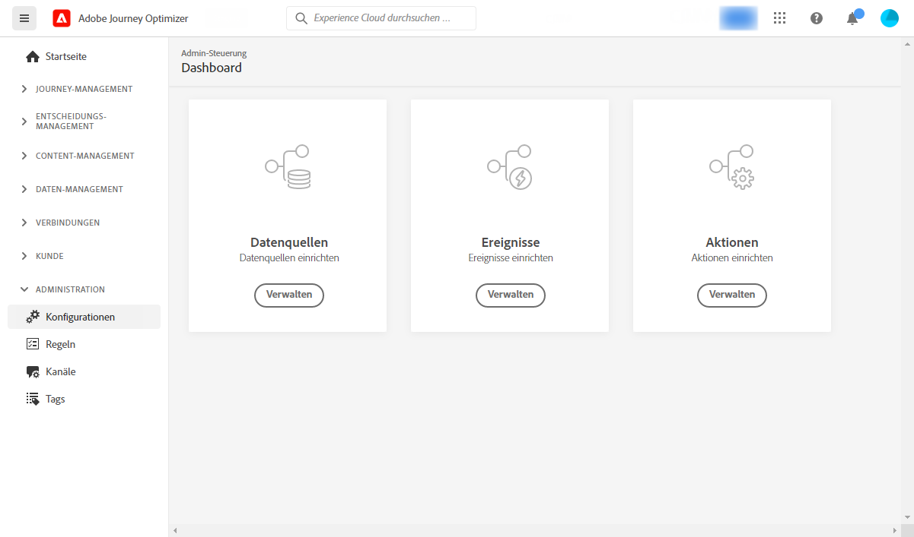
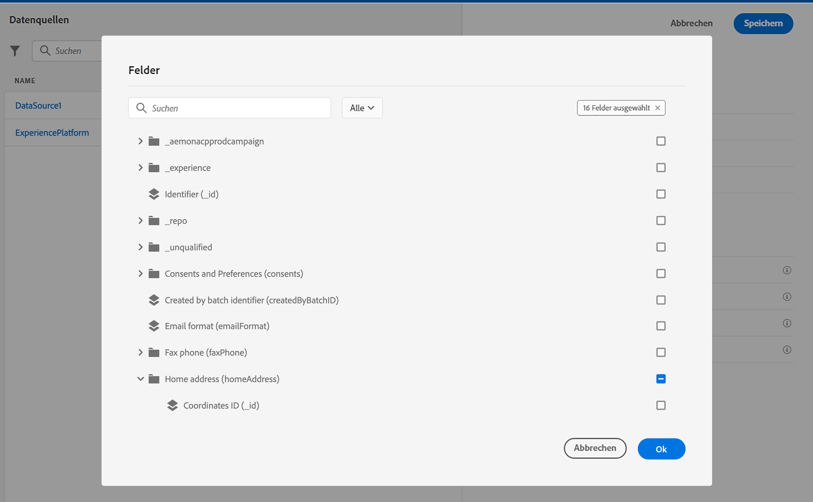

# Konfigurieren von Journeys {#configure-journeys}

>[!CONTEXTUALHELP]
>id="ajo_journey_configuration_dashboard"
>title="Über die Journey-Konfiguration"
>abstract="Um Nachrichten mit Journeys zu senden, müssen Sie Datenquellen, Ereignisse und Aktionen konfigurieren. Mit Datenquellen können Sie eine Verbindung zu einem System definieren, um zusätzliche Informationen abzurufen, die bei Ihren Journeys verwendet werden (z. B. in Ihren Bedingungen). Mit Ereignissen können Sie Ihre Journeys beim Empfang eines Ereignisses auslösen. Mit benutzerdefinierten Aktionen können Sie eine Verbindung zu einem Drittanbietersystem herstellen, um Ihre Nachrichten zu senden. Wenn Sie integrierte Nachrichtenfunktionen von Journey Optimizer verwenden, müssen Sie keine Aktion konfigurieren."

Um Nachrichten mit Journeys zu senden, müssen Sie **[!UICONTROL Datenquellen]**, **[!UICONTROL Ereignisse]** und **[!UICONTROL Aktionen]** konfigurieren.

## Datenquellen {#data-sources}

Mit der Konfiguration von Datenquellen können Sie eine Verbindung zu einem System definieren, um zusätzliche Informationen zur Verwendung in Ihren Journeys abzurufen. [Weitere Informationen](../../using/datasource/about-data-sources.md)

## Ereignisse {#events}

Mit Hilfe von Ereignissen können Sie Ihre Journeys einheitlich auslösen, um Nachrichten in Echtzeit an die Kontakte zu senden, die in die Journey eintreten.

In der Konfiguration von Ereignissen konfigurieren Sie die in den Journeys erwarteten Ereignisse. Die eingehenden Ereignisdaten werden mit dem Experience-Datenmodell (XDM) von Adobe normalisiert. Die Ereignisse stammen von Streaming-Aufnahme-APIs für authentifizierte und nicht authentifizierte Ereignisse (z. B. Adobe Mobile SDK-Ereignisse). [Weitere Informationen](../../using/event/about-events.md)

## Aktionen {#actions}

Journey Optimizer-Nachrichtenfunktionen sind integriert: Sie müssen nur eine Kanalaktionsaktivität zu Ihrer Journey hinzufügen. Wenn Sie zum Senden Ihrer Nachrichten ein Drittanbietersystem verwenden, können Sie eine benutzerdefinierte Aktion erstellen. [Weitere Informationen](../../using/action/action.md)

## Durchsuchen von Adobe Experience Platform-Feldern {#friendly-names-display}

Bei der Definition von [Ereignis-Payload](../event/about-creating.md#define-the-payload-fields), [Feldgruppen-Payload](../datasource/configure-data-sources.md#define-field-groups) und der Auswahl von Feldern im [Ausdruckseditor](../building-journeys/expression/expressionadvanced.md) wird der Anzeigename zusätzlich zum Feldnamen angezeigt. Diese Informationen werden aus der Schemadefinition im Experience-Datenmodell abgerufen.

Wenn beim Einrichten von Schemata Deskriptoren wie „xdm:alternateDisplayInfo“ angegeben werden, werden die Anzeigenamen durch benutzerfreundliche Namen ersetzt. Dies ist besonders beim Arbeiten mit „eVars“und generischen Feldern nützlich. Sie können die Deskriptoren für benutzerfreundliche Namen über einen API-Aufruf konfigurieren. Weitere Informationen finden Sie im [Entwicklerhandbuch zur Schemaregistrierung](https://experienceleague.adobe.com/docs/experience-platform/xdm/api/getting-started.html?lang=de){target="_blank"}.

Wenn ein benutzerfreundlicher Name verfügbar ist, wird das Feld als `<friendly-name>(<name>)` angezeigt. Ist kein benutzerfreundlicher Name verfügbar, wird der Anzeigename angezeigt, z. B. `<display-name>(<name>)`. Wenn keiner der Namen definiert ist, wird nur der technische Name des Felds `<name>` angezeigt.

>[!NOTE]
>
>Benutzerfreundliche Namen werden nicht abgerufen, wenn Sie Felder aus einer Vereinigungsmenge von Schemas auswählen.
