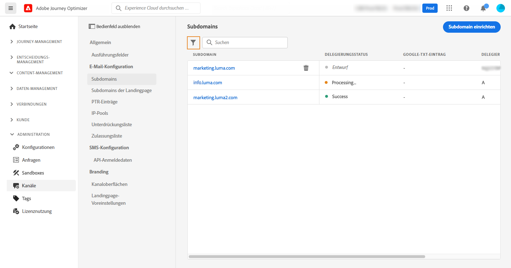
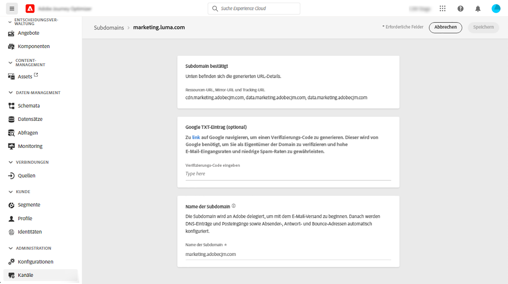

# Subdomain-Zuweisung in [!DNL Journey Optimizer] {#subdomain-delegation}

Durch die Erstellung einer Subdomain für E-Mail-Kampagnen können Marken verschiedene Traffic-Typen (z. B. Marketing oder Unternehmen) in bestimmte IP-Pools und mit bestimmten Domänen isolieren, was den IP-Warming-Prozess beschleunigt und die Zustellbarkeit insgesamt verbessert. Wenn Sie eine Domäne freigeben und sie blockiert oder der Abweisungsliste hinzugefügt wird, kann dies sich auf Ihren E-Mail-Versand im Unternehmen auswirken. Reputationsprobleme oder Bausteine in einer Domäne, die für Ihre E-Mail-Marketing-Kommunikation spezifisch ist, wirken sich jedoch nur auf diesen E-Mail-Fluss aus. Die Verwendung Ihrer Hauptdomäne als Absender oder der &#39;Von&#39;-Adresse für mehrere E-Mail-Streams kann auch die E-Mail-Authentifizierung beeinträchtigen, wodurch Ihre Nachrichten blockiert oder in den Spam-Ordner eingefügt werden.

>[!NOTE]
>
>Dieselbe Versanddomäne kann nicht zum Senden von Nachrichten von verwendet werden [!DNL Adobe Journey Optimizer] und von einem anderen Produkt, z. B. [!DNL Adobe Campaign] oder [!DNL Adobe Marketo Engage].

## Warum sollten Sie Subdomains einrichten? {#why-setting-up-subdomains}

Eine Subdomain ist eine Division Ihrer Domäne, die zur Isolierung Ihrer Marken oder verschiedener Traffic-Typen verwendet werden kann, z. B. Transaktionsnachrichten und Marketingnachrichten.

Nehmen wir als Beispiel die Domain &quot;mybrand.com&quot;, die sowohl Transaktions- als auch Marketingnachrichten sendet. In diesem Fall können Sie zwei Subdomains einrichten:

* Subdomain &quot;info.mybrand.com&quot; für Ihre Transaktionsnachrichten (Kaufbestätigung, Passwortzurücksetzung usw.),
* Subdomain &quot;marketing.mybrand.com&quot; für Ihre Werbe-E-Mails.

Auf diese Weise können Sie die Reputation Ihrer Domain und anderer Subdomains schützen. Wenn beispielsweise die Subdomains &quot;marketing.mybrand.com&quot; aufgrund schlechter Zustellbarkeit von Internetdienstanbietern auf die Blockierungsliste gesetzt wurden, würde dies verhindern, dass die gesamte Domain &quot;mybrand.com&quot; und die Subdomain &quot;info.mybrand.com&quot; zur Blockierungsliste hinzugefügt werden.

Bei der Implementierung einer Lösung gibt es Anforderungen an nach außen gerichtete Komponenten: Dazu gehören das Einrichten von Links und Webseiten, die verfolgt werden sollen, das Anzeigen von Mirrorseiten usw.

Während diese Anforderungen über Komponenten verwaltet werden, die sowohl von Adobe als auch vom Kunden gehostet werden, enthalten sie URLs, die von den Empfängern der E-Mails gesehen werden können. Um zu vermeiden, dass URLs vorhanden sind, die die zugrunde liegende technische Lösung oder den Hosting-Anbieter angeben, können Subdomains eingerichtet werden, um dies für die Empfänger der E-Mails transparent zu machen.

**Weitere Infos**

* Erfahren Sie, wie Sie [Zuweisen Ihrer Subdomains](delegate-subdomain.md) direkt über die Benutzeroberfläche
* Erfahren Sie, wie Sie [Hinzufügen von Google TXT-Einträgen](google-txt.md) an Ihre Subdomains, um den erfolgreichen Versand von E-Mails an Gmail-Adressen sicherzustellen
* Erfahren Sie, wie Sie [Zugriff auf PTR-Datensätze](ptr-records.md) für Ihre Subdomains generiert wurden, sodass sie von E-Mail-Servern überprüft werden können.

## Methoden der Subdomain-Konfiguration {#subdomain-delegation-methods}

Die Konfiguration von Subdomains ermöglicht die Konfiguration eines Unterabschnitts Ihrer Domain (technisch eine &quot;DNS-Zone&quot;) zur Verwendung mit Adobe Campaign. Verfügbare Einrichtungsmethoden sind:

* **Vollständige Subdomain-Zuweisung an Adobe** (empfohlen): Die Subdomain wird Adobe vollständig zugewiesen. Adobe kann alle DNS-Aspekte steuern und verwalten, die für die Zustellung, das Rendering und das Tracking von Nachrichten erforderlich sind. [Erfahren Sie mehr über die vollständige Subdomain-Zuweisung](delegate-subdomain.md#full-subdomain-delegation)

* **Verwendung von CNAME**: Erstellen Sie eine Subdomain und verwenden Sie CNAME, um auf Adobe-spezifische Datensätze zu verweisen. Mit diesem Setup sind Sie und Adobe gemeinsam für die Pflege des DNS verantwortlich. [Weitere Informationen zur Zuweisung von CNAME-Subdomains](delegate-subdomain.md#cname-subdomain-delegation)

>[!CAUTION]
>
>* Die vollständige Subdomain-Zuweisung ist die bevorzugte Methode.
>
>* Die CNAME-Methode wird empfohlen, wenn die Richtlinien Ihres Unternehmens die Methode der vollständigen Subdomain-Zuweisung einschränken. Dieser Ansatz erfordert, dass Sie DNS-Einträge selbst verwalten und verwalten. Adobe kann das DNS für eine Subdomain, die über die CNAME-Methode konfiguriert wurde, nicht ändern, verwalten oder verwalten.

Die nachstehende Tabelle bietet eine Zusammenfassung der Funktionsweise dieser Methoden sowie den damit verbundenen Aufwand:

| Konfigurationsmethode | Funktionsweise | Aufwand |
|---|---|---|
| **Vollständige Zuweisung** | Erstellen Sie die Subdomain und den Namespace-Eintrag. Adobe konfiguriert dann alle für Adobe Campaign erforderlichen DNS-Einträge.  Bei dieser Konfiguration ist Adobe vollständig für die Verwaltung der Subdomain und aller DNS-Einträge verantwortlich. | Niedrig |
| **CNAME, benutzerspezifische Methode** | Erstellen Sie die Subdomain und den Namespace-Eintrag. Adobe stellt dann die Datensätze bereit, die auf Ihren DNS-Servern abgelegt werden sollen, und konfiguriert die entsprechenden Werte in den Adobe Campaign-DNS-Servern.  Bei dieser Konfiguration sind Sie und Adobe gemeinsam für die Pflege des DNS verantwortlich. | Hoch |

Weitere Informationen zur Domain-Konfiguration finden Sie unter [diese Dokumentation](https://experienceleague.adobe.com/docs/deliverability-learn/deliverability-best-practice-guide/additional-resources/product-specific-resources/campaign/ac-domain-name-setup.html).

Wenden Sie sich bei Fragen zu den Methoden der Subdomain-Konfiguration an Adobe oder an die Kundenunterstützung, um eine Beratung zur Zustellbarkeit anzufordern.

## Auf zugewiesene Subdomains zugreifen {#access-delegated-subdomains}

Alle zugewiesenen Subdomains werden im **[!UICONTROL Administration]** > **[!UICONTROL Channels]** > **[!UICONTROL Subdomains]** Menü. Es stehen Filter zur Verfügung, mit denen Sie die Liste verfeinern können (Delegationsdatum, Benutzer oder Status).

Die **[!UICONTROL Status]** enthält Informationen zum Prozess der Zuweisung von Subdomains:

* **[!UICONTROL Draft]**: Die Subdomain-Zuweisung wurde als Entwurf gespeichert. Klicken Sie auf den Namen der Subdomain, um den Delegierungsprozess fortzusetzen.
* **[!UICONTROL Processing]**: Die Subdomain wird mehreren Konfigurationsprüfungen unterzogen, bevor sie verwendet werden kann.
* **[!UICONTROL Success]**: Die Subdomain hat die Prüfungen erfolgreich durchgeführt und kann zum Versand von Nachrichten verwendet werden.
* **[!UICONTROL Failed]**: Eine oder mehrere Prüfungen sind fehlgeschlagen, nachdem die Subdomain-Zuweisung übermittelt wurde.

So greifen Sie auf detaillierte Informationen zu einer Subdomain zu: **[!UICONTROL Success]** -Status, öffnen Sie sie in der Liste.

Sie können:

* Rufen Sie den während des Delegierungsprozesses konfigurierten Subdomain-Namen (schreibgeschützt) sowie die generierten URLs (Ressourcen, Mirrorseiten, Tracking-URLs) ab,

* Fügen Sie Ihrer Subdomain einen TXT-Eintrag für die Websiteüberprüfung von Google hinzu, um sicherzustellen, dass er verifiziert ist (siehe [Hinzufügen eines Google TXT-Eintrags zu einer Subdomain](google-txt.md)).

>[!CAUTION]
>
>Die Konfiguration von Subdomains ist in allen Umgebungen üblich. Daher wirkt sich jede Änderung an einer Subdomain auch auf die Produktions-Sandboxes aus.
