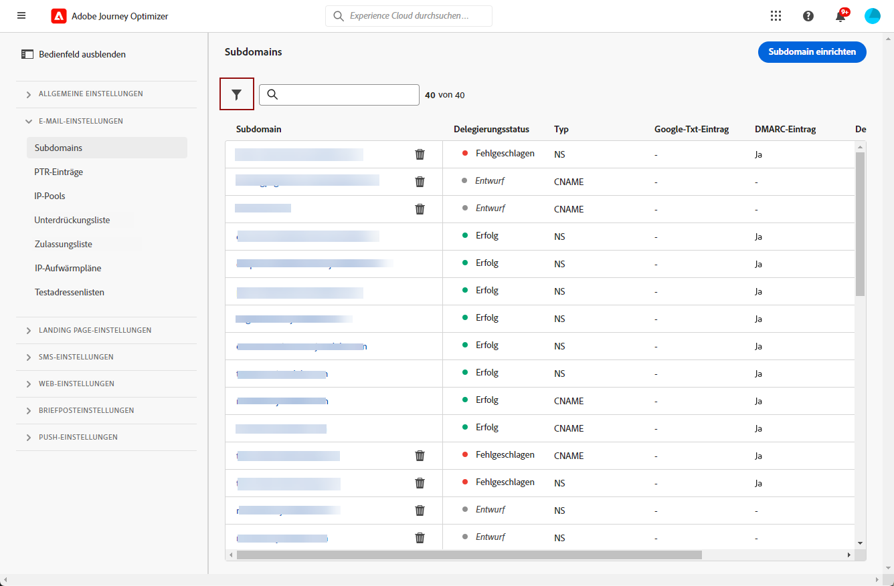

# Subdomain-Erstellung in [!DNL Journey Optimizer] {#subdomain-delegation}

Das Einrichten einer Subdomain für E-Mail-Kampagnen ermöglicht es Marken, unterschiedliche Arten von Traffic (z. B. Marketing-bezogenen vs. betrieblichen) in eigene IP-Pools mit eigenen Domains zu unterteilen, wodurch der IP-Warming-Prozess beschleunigt und die Zustellbarkeit insgesamt verbessert werden kann. Wenn Sie eine einzige Domain für alle Aufgaben verwenden und diese gesperrt oder zur Blockierungsliste hinzugefügt wird, könnte dies Auswirkungen auf die Zustellung Ihrer betrieblichen E-Mails haben. Probleme mit der Reputation oder die Blockierung einer Domain, die nur für Ihre E-Mail-Marketing-Kommunikation verwendet sind, beeinträchtigen hingegen ausschließlich diesen E-Mail-Verkehr. Die Verwendung Ihrer Hauptdomäne als Absender oder der &#39;Von&#39;-Adresse für mehrere E-Mail-Streams kann auch die E-Mail-Authentifizierung beeinträchtigen, wodurch Ihre Nachrichten blockiert oder in den Spam-Ordner eingefügt werden.

>[!NOTE]
>
>Dieselbe Versand-Domain kann nicht zum Senden von Nachrichten von [!DNL Adobe Journey Optimizer] und von einem anderen Produkt, z. B. [!DNL Adobe Campaign] oder [!DNL Adobe Marketo Engage], verwendet werden.

## Warum sollten Subdomains eingerichtet werden? {#why-setting-up-subdomains}

Sie können Ihre Domain in Subdomains unterteilen, um Ihre Marken oder unterschiedlichen Textsorten wie etwa Transaktionsnachrichten und Marketing-Informationen voreinander zu trennen.

Nehmen wir zum Beispiel die Domain &quot;mybrand.com&quot;, die sowohl Transaktions- als auch Marketing-Nachrichten sendet. In diesem Fall können Sie zwei Subdomains einrichten:

* die Subdomain &quot;info.mybrand.com&quot; für Ihre Transaktionsnachrichten (Kaufbestätigung, Passwortzurücksetzung usw.),
* die Subdomain &quot;marketing.mybrand.com&quot; für Ihre Werbe-E-Mails.

Dies hilft Ihnen, die Reputation Ihrer Domain und anderer Subdomains zu schützen. Wenn z. B. die Subdomain &quot;marketing.mybrand.com&quot; aufgrund schlechter Zustellbarkeit von Internetdienstanbietern auf die Blockierungsliste gesetzt wird, würde dies verhindern, dass die gesamte Domain &quot;mybrand.com&quot; und die Subdomain &quot;info.mybrand.com&quot; ebenfalls auf die Blockierungsliste gesetzt werden.

Bei der Implementierung einer Lösung gibt es Anforderungen an nach außen gerichtete Komponenten: Dazu gehören das Einrichten von Links und Web-Seiten, die verfolgt werden sollen, das Anzeigen von Mirror-Seiten usw.

Diese Anforderungen werden über Komponenten verwaltet, die sowohl von Adobe als auch vom Kunden gehostet werden, und enthalten URLs, die für die Empfänger der E-Mails sichtbar sind. Um URLs zu vermeiden, die auf die zugrunde liegende technische Lösung oder den Hosting-Anbieter hinweisen, können Subdomains eingerichtet werden, die diese Informationen vor den Empfängern der E-Mails verbergen.

**Weitere Informationen**

* Erfahren Sie, wie Sie [Ihre Subdomains](delegate-subdomain.md) direkt über die Benutzeroberfläche delegieren.
* Erfahren Sie, wie Sie [Ihren Subdomains TXT-Einträge von Google](google-txt.md) hinzufügen, um den erfolgreichen Versand von E-Mails an Gmail-Adressen sicherzustellen.
* Erfahren Sie, wie Sie [auf die für Ihre Subdomains generierten PTR-Einträge zugreifen](ptr-records.md), damit sie von E-Mail-Servern überprüft werden können.

## Methoden der Subdomain-Konfiguration {#subdomain-delegation-methods}

Mithilfe der Subdomain-Konfiguration können Sie einen Teil Ihrer Domain (technisch gesehen eine „DNS-Zone“) für die Verwendung mit Adobe Campaign konfigurieren. Verfügbare Einrichtungsmethoden sind:

* **Vollständige Subdomain-Delegierung an Adobe** (empfohlen): Die Subdomain wird Adobe vollständig zugewiesen. Adobe kann alle DNS-Aspekte steuern und verwalten, die für die Zustellung, das Rendering und das Tracking von Nachrichten erforderlich sind. [Weitere Informationen zur vollständigen Subdomain-Delegierung](delegate-subdomain.md#full-subdomain-delegation)

* **Verwenden von CNAMEs**: Erstellen einer Subdomain und Verwenden von CNAMEs, um auf Adobe-spezifische Einträge zu verweisen. Bei dieser Konfiguration sind sowohl Sie als auch Adobe gemeinsam für die Pflege des DNS verantwortlich. [Weitere Informationen zur Delegierung von CNAME-Subdomains](delegate-subdomain.md#cname-subdomain-delegation)

>[!CAUTION]
>
>* Die vollständige Subdomain-Delegierung ist die bevorzugte Methode.
>
>* Die Methode CNAME wird empfohlen, wenn die Richtlinien Ihrer Organisation die vollständige Subdomain-Delegierung nicht erlauben. Diese Methode erfordert, dass Sie DNS-Einträge selbst pflegen und verwalten. Adobe kann keine Unterstützung beim Ändern, Pflegen oder Verwalten des DNS für eine Subdomain anbieten, die über die CNAME-Methode konfiguriert wurde.

Die nachstehende Tabelle bietet eine Zusammenfassung über die Funktionsweise dieser Methoden sowie den damit verbundenen Aufwand:

| Konfigurationsmethode | Funktionsweise | Aufwand |
|---|---|---|
| **Vollständige Zuweisung** | Sie erstellen die Subdomain und den Namespace-Eintrag. Adobe konfiguriert dann alle für Adobe Campaign erforderlichen DNS-Einträge.  Bei dieser Konfiguration hat Adobe die volle Verantwortung für die Pflege der Subdomain und aller DNS-Einträge. | Niedrig |
| **CNAME, benutzerspezifische Methode** | Sie erstellen die Subdomain und den Namespace-Eintrag. Adobe stellt dann die Einträge bereit, die auf Ihren DNS-Servern abgelegt werden sollen, und konfiguriert die entsprechenden Werte in den Adobe Campaign-DNS-Servern.  Bei dieser Konfiguration sind Sie und Adobe gemeinsam für die Pflege des DNS verantwortlich. | Hoch |

Weitere Informationen zur Domain-Konfiguration finden Sie in [dieser Dokumentation](https://experienceleague.adobe.com/docs/deliverability-learn/deliverability-best-practice-guide/additional-resources/product-specific-resources/campaign/ac-domain-name-setup.html?lang=de).

Bei Fragen zu den Methoden der Subdomain-Konfiguration wenden Sie sich an Adobe oder die Kundenunterstützung, um eine Beratung zur Zustellbarkeit anzufordern.

## Zugreifen auf delegierte Subdomains {#access-delegated-subdomains}

Alle delegierten Subdomains werden im Menü **[!UICONTROL Administration]** > **[!UICONTROL Kanäle]** > **[!UICONTROL Subdomains]** angezeigt. Es stehen Filter zur Verfügung, mit denen Sie die Liste eingrenzen können (Datum der Zuweisung, Benutzer oder Status).

Die Spalte **[!UICONTROL Status]** enthält Informationen zum Prozess der Zuweisung von Subdomains:

* **[!UICONTROL Entwurf]**: Die Subdomain-Zuweisung wurde als Entwurf gespeichert. Klicken Sie auf den Namen der Subdomain, um den Zuweisungsprozess fortzusetzen.
* **[!UICONTROL In Verarbeitung]**: Die Subdomain wird mehreren Konfigurationsprüfungen unterzogen, bevor sie verwendet werden kann.
* **[!UICONTROL Erfolgreich]**: Die Subdomain hat die Prüfungen erfolgreich durchlaufen und bestanden und kann zum Versand von Nachrichten verwendet werden.
* **[!UICONTROL Fehlgeschlagen]**: Eine oder mehrere Prüfungen sind fehlgeschlagen, nachdem die Subdomain-Zuweisung übermittelt wurde.

Um auf detaillierte Informationen zu einer Subdomain mit dem Status **[!UICONTROL Erfolgreich]** zuzugreifen, öffnen Sie sie in der Liste.

Sie haben folgende Möglichkeiten:

* Rufen Sie den während des Zuweisungsprozesses konfigurierten Subdomain-Namen (schreibgeschützt) sowie die generierten URLs (Ressourcen, Mirror-Seite, Tracking-URLs) ab oder

* Fügen Sie Ihrer Subdomain einen TXT-Eintrag für die Website-Überprüfung von Google hinzu, um sicherzustellen, dass er verifiziert ist (siehe [Hinzufügen eines Google TXT-Eintrags zu einer Subdomain](google-txt.md)).

>[!CAUTION]
>
>Die Konfiguration von Subdomains ist in allen Umgebungen gleich. Daher wirkt sich jede Änderung an einer Subdomain auch auf die Produktions-Sandboxes aus.
