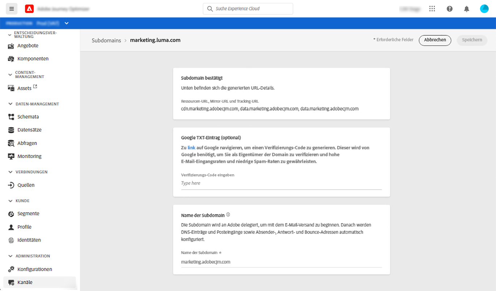

# Auf zugewiesene Subdomains zugreifen

Alle zugewiesenen Subdomains werden im Menü **[!UICONTROL Kanäle]** / **[!UICONTROL Subdomains]** angezeigt. Es stehen Filter zur Verfügung, mit denen Sie die Liste verfeinern können (Delegationsdatum, Benutzer oder Status).

Die Spalte **[!UICONTROL Status]** enthält Informationen zum Prozess der Zuweisung von Subdomains:

* **[!UICONTROL Entwurf]**: Die Subdomain-Zuweisung wurde als Entwurf gespeichert. Klicken Sie auf den Namen der Subdomain, um den Delegierungsprozess fortzusetzen.
* **[!UICONTROL Verarbeitung]**: Die Subdomain wird mehreren Konfigurationsprüfungen unterzogen, bevor sie verwendet werden kann.
* **[!UICONTROL Erfolg]**: Die Subdomain hat die Prüfungen erfolgreich durchgeführt und kann zum Versand von Nachrichten verwendet werden.
* **[!UICONTROL Fehlgeschlagen]**: Eine oder mehrere Prüfungen sind fehlgeschlagen, nachdem die Subdomain-Zuweisung übermittelt wurde.

Um auf detaillierte Informationen zu einer Subdomain zuzugreifen, öffnen Sie sie in der Liste. Sie haben folgende Möglichkeiten:

* Rufen Sie den während des Delegierungsprozesses konfigurierten Subdomain-Namen (schreibgeschützt) sowie die generierten URLs (Ressourcen, Mirrorseite, Tracking-URLs) ab,

* Fügen Sie Ihrer Subdomain einen TXT-Eintrag für die Websiteüberprüfung von Google hinzu, um sicherzustellen, dass er verifiziert ist (siehe [Hinzufügen eines Google TXT-Eintrags zu einer Subdomain](google-txt.md)).

