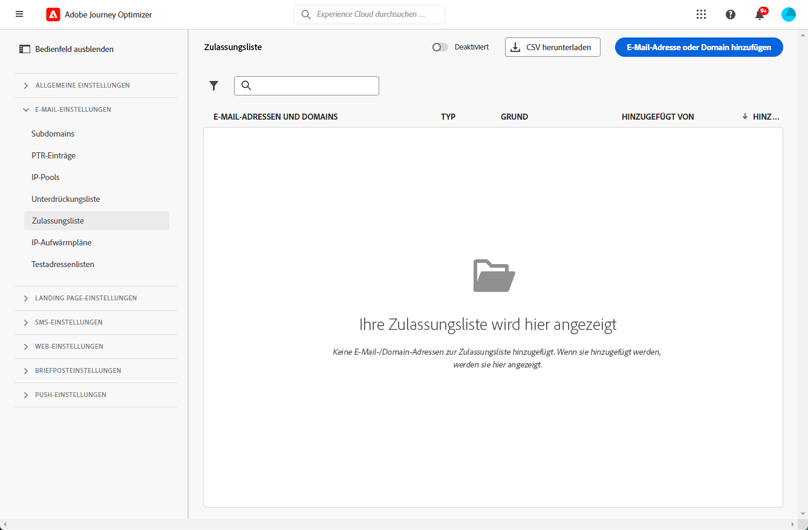
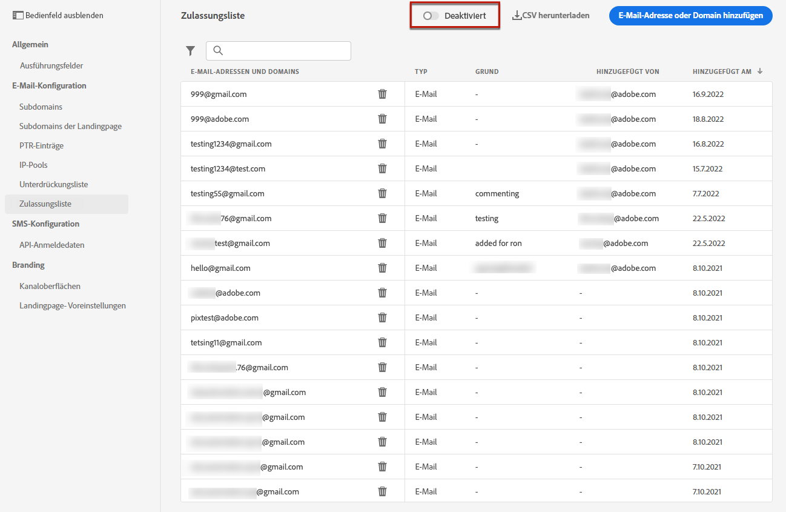
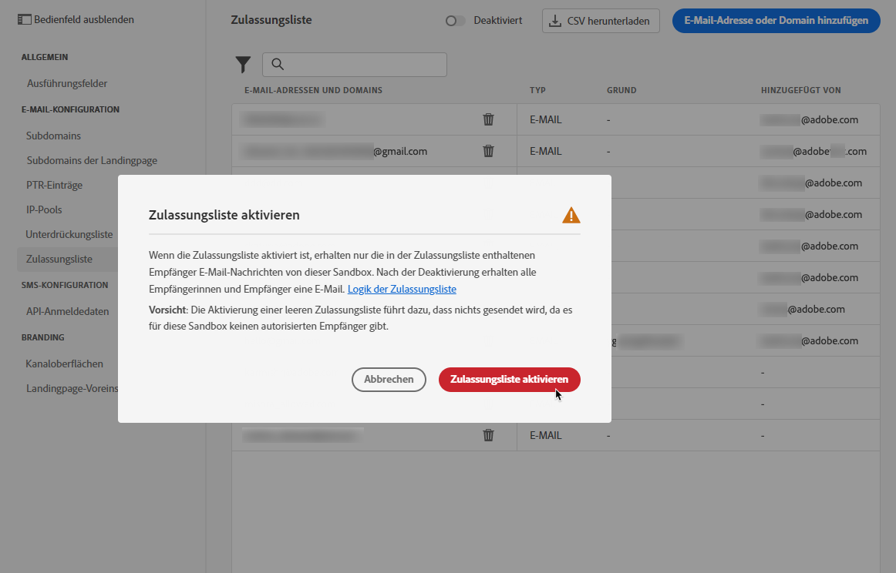

# Zulässige Liste {#allow-list}

Es ist möglich, eine spezifische Liste für die Sicherheit des Versands im [Sandbox](../administration/sandboxes.md) Ebene.

Mit dieser Zulassungsliste können Sie einzelne E-Mail-Adressen oder Domänen angeben, die die einzigen Empfänger oder Domänen sind, die berechtigt sind, die von einer bestimmten Sandbox gesendeten E-Mails zu empfangen.

>[!NOTE]
>
>Diese Funktion ist für Produktions- und Nicht-Produktions-Sandboxes verfügbar.

Auf einer Nicht-Produktionsinstanz, bei der Fehler auftreten können, stellt die Zulassungsliste beispielsweise sicher, dass Sie kein Risiko haben, unerwünschte Nachrichten an reale Kundenadressen zu senden, und bietet daher eine sichere Umgebung für Testzwecke.

Wenn die Zulassungsliste aktiv, aber leer ist, wird keine E-Mail gesendet. Wenn Sie also auf ein großes Problem stoßen, können Sie diese Funktion verwenden, um alle ausgehenden Nachrichten von zu stoppen. [!DNL Journey Optimizer] bis Sie das Problem beheben. Weitere Informationen finden Sie unter [Zulassungslistenlogik](#logic).

>[!CAUTION]
>
>Diese Funktion gilt nur für den E-Mail-Kanal.

## Auf die Zulassungsliste zugreifen {#access-allowed-list}

Um auf die detaillierte Liste der zulässigen E-Mail-Adressen und Domänen zuzugreifen, navigieren Sie zu **[!UICONTROL Administration]** > **[!UICONTROL Channels]** > **[!UICONTROL Email configuration]** und wählen Sie **[!UICONTROL Allowed list]**.



>[!CAUTION]
>
>Die Berechtigungen zum Anzeigen, Exportieren und Verwalten der Zulassungsliste sind auf [Journey-Administratoren](../administration/ootb-product-profiles.md#journey-administrator). Weitere Informationen zur Verwaltung [!DNL Journey Optimizer] Benutzerzugriffsrechte in [diesem Abschnitt](../administration/permissions-overview.md).

Um die Zulassungsliste als CSV-Datei zu exportieren, wählen Sie die **[!UICONTROL Download CSV]** Schaltfläche.

Verwenden Sie die **[!UICONTROL Delete]** -Schaltfläche, um einen Eintrag dauerhaft zu entfernen.

Sie können nach den E-Mail-Adressen oder Domänen suchen und nach der **[!UICONTROL Address type]**. Nach der Auswahl können Sie den Filter löschen, der oben in der Liste angezeigt wird.


## Zulässige Liste aktivieren {#enable-allow-list}

Gehen Sie wie folgt vor, um die Zulassungsliste zu aktivieren.

1. Zugriff auf  **[!UICONTROL Channels]** > **[!UICONTROL Email configuration]** > **[!UICONTROL Allow list]** Menü.

1. Wählen Sie die Umschalter-Schaltfläche aus.

   

1. Auswählen **[!UICONTROL Activate allowed list]**. Die Zulassungsliste ist jetzt aktiv.

   

   >[!NOTE]
   >
   >Nachdem Sie die Zulassungsliste aktiviert haben, ist eine 5-minütige Latenz vorhanden, damit sie in Ihren Journeys und Kampagnen wirksam wird.

Die Logik der zulässigen Liste gilt, wenn die Funktion aktiv ist. Weitere Informationen finden Sie unter [diesem Abschnitt](#logic).

>[!NOTE]
>
>Wenn diese Option aktiviert ist, wird die Funktion für die Zulassungsliste beim Ausführen von Journeys, aber auch beim Testen von Nachrichten mit berücksichtigt. [proofs](../email/preview.md#send-proofs) und Testen von Journeys mit der [Testmodus](../building-journeys/testing-the-journey.md).

## Deaktivieren der Zulassungsliste {#deactivate-allow-list}

Gehen Sie wie folgt vor, um die Zulassungsliste zu deaktivieren.

1. Zugriff auf  **[!UICONTROL Channels]** > **[!UICONTROL Email configuration]** > **[!UICONTROL Allow list]** Menü.

1. Wählen Sie die Umschalter-Schaltfläche aus.

   

1. Auswählen **[!UICONTROL Deactivate allowed list]**. Die Zulassungsliste ist nicht mehr aktiv.

   

   >[!NOTE]
   >
   >Nachdem Sie die Zulassungsliste deaktiviert haben, ist die Latenz von 5 Minuten gegeben, damit sie in Ihren Journeys und Kampagnen wirksam wird.

Die Logik der zulässigen Liste gilt nicht, wenn die Funktion deaktiviert wird. Weitere Informationen finden Sie unter [diesem Abschnitt](#logic).

## Entitäten zur Zulassungsliste hinzufügen {#add-entities}

Um der Zulassungsliste für eine bestimmte Sandbox neue E-Mail-Adressen oder Domänen hinzuzufügen, können Sie entweder [manuelles Ausfüllen der Liste](#manually-populate-list)oder verwenden Sie eine [API-Aufruf](#api-call-allowed-list).

>[!NOTE]
>
>Die Zulassungsliste kann bis zu 1.000 Einträge enthalten.

### Manuelles Ausfüllen der Zulassungsliste {#manually-populate-list}

>[!CONTEXTUALHELP]
>id="ajo_admin_allowed_list_add_header"
>title="Adressen oder Domänen zur Zulassungsliste hinzufügen"
>abstract="Sie können der Zulassungsliste manuell neue E-Mail-Adressen oder Domänen hinzufügen, indem Sie sie einzeln auswählen."

>[!CONTEXTUALHELP]
>id="ajo_admin_allowed_list_add"
>title="Adressen oder Domänen zur Zulassungsliste hinzufügen"
>abstract="Sie können der Zulassungsliste manuell neue E-Mail-Adressen oder Domänen hinzufügen, indem Sie sie einzeln auswählen."

Sie können die [!DNL Journey Optimizer] Zulassungsliste durch Hinzufügen einer E-Mail-Adresse oder einer Domain über die Benutzeroberfläche.

>[!NOTE]
>
>Sie können jeweils nur eine E-Mail-Adresse oder Domain hinzufügen.

Gehen Sie dazu wie folgt vor.

1. Wählen Sie die **[!UICONTROL Add email or domain]** Schaltfläche.

   

1. Wählen Sie den Adresstyp aus: **[!UICONTROL Email address]** oder **[!UICONTROL Domain address]**.

1. Geben Sie die E-Mail-Adresse oder Domain ein, an die Sie E-Mails senden möchten.

   >[!NOTE]
   >
   >Vergewissern Sie sich, dass Sie eine gültige E-Mail-Adresse (z. B. abc@company.com) oder Domain (z. B. abc.company.com) eingeben.

1. Geben Sie bei Bedarf einen Grund an.

   

   >[!NOTE]
   >
   >Alle ASCII-Zeichen zwischen 32 und 126 sind in der Variablen **[!UICONTROL Reason]** -Feld. Die vollständige Liste finden Sie unter [diese Seite](https://en.wikipedia.org/wiki/Wikipedia:ASCII#ASCII_printable_characters){target=&quot;_blank&quot;} zum Beispiel.

1. Klicken **[!UICONTROL Submit]**.

### Entitäten mithilfe eines API-Aufrufs hinzufügen {#api-call-allowed-list}

Um die Zulassungsliste zu füllen, können Sie auch die Unterdrückungs-API mit der `ALLOWED` Wert für `listType` -Attribut. Beispiel:


Sie können die **Hinzufügen**, **Löschen** und **Get** Vorgänge.

Erfahren Sie mehr über API-Aufrufe im [Adobe Experience Platform-APIs](https://experienceleague.adobe.com/docs/experience-platform/landing/platform-apis/api-guide.html)Referenzdokumentation für {target=&quot;_blank&quot;}.

## Zulässige Listenlogik {#logic}

>[!CONTEXTUALHELP]
>id="ajo_admin_allowed_list_logic"
>title="Zulassungsliste verwalten"
>abstract="Wenn die Zulassungsliste aktiviert wird, erhalten nur die in der Zulassungsliste enthaltenen Empfänger E-Mail-Nachrichten von dieser Sandbox. Nach der Deaktivierung erhalten alle Empfänger E-Mails."

Wenn die Zulassungsliste [active](#enable-allow-list), gilt die folgende Logik:

* Wenn die zulässige Liste **leer** gesetzt, wird keine E-Mail gesendet.

* Wenn eine Entität **auf der Zulassungsliste** und nicht in der Unterdrückungsliste, wird die E-Mail an den/die entsprechenden Empfänger gesendet. Wenn sich das Unternehmen jedoch auch auf der [Unterdrückungsliste](../reports/suppression-list.md), werden die entsprechenden Empfänger die E-Mail nicht erhalten, weshalb **[!UICONTROL Suppressed]**.

* Wenn eine Entität **nicht in der Zulassungsliste** (und nicht auf der Unterdrückungsliste), werden die entsprechenden Empfänger die E-Mail nicht erhalten, weshalb **[!UICONTROL Not allowed]**.

>[!NOTE]
>
>Die Profile mit **[!UICONTROL Not allowed]** -Status während des Nachrichtenversands ausgeschlossen werden. Daher muss während der **Journey-Berichte** zeigt an, dass sich diese Profile durch die Journey bewegt haben ([Segment lesen](../building-journeys/read-segment.md) und [Nachrichtenaktivitäten](../building-journeys/journeys-message.md)), die **E-Mail-Berichte** werden sie nicht in die **[!UICONTROL Sent]** Metriken, da sie vor dem E-Mail-Versand herausgefiltert werden.
>
>Weitere Informationen finden Sie unter [Live-Bericht](../reports/live-report.md) und [Globaler Bericht](../reports/global-report.md).

Wenn die Zulassungsliste [deaktiviert](#deactivate-allow-list), werden alle E-Mails, die Sie aus der aktuellen Sandbox senden, an alle Empfänger gesendet (sofern sie nicht auf der Unterdrückungsliste stehen), einschließlich der tatsächlichen Kundenadressen.

## Ausschlussberichte {#reporting}

Wenn die Zulassungsliste aktiv ist, können Sie E-Mail-Adressen oder Domänen abrufen, die vom Versand ausgeschlossen wurden, weil sie nicht auf der Zulassungsliste standen. Zu diesem Zweck können Sie die [Adobe Experience Platform Query Service](https://experienceleague.adobe.com/docs/experience-platform/query/api/getting-started.html){target=&quot;_blank&quot;}, um die unten stehenden API-Aufrufe durchzuführen.

So rufen Sie die **Anzahl der E-Mails** die nicht gesendet wurden, da die Empfänger nicht auf der Zulassungsliste stehen, verwenden Sie die folgende Abfrage:

```sql
SELECT count(distinct _id) from cjm_message_feedback_event_dataset WHERE
_experience.customerJourneyManagement.messageExecution.messageExecutionID = '<MESSAGE_EXECUTION_ID>' AND
_experience.customerJourneyManagement.messageDeliveryfeedback.feedbackStatus = 'exclude' AND
_experience.customerJourneyManagement.messageDeliveryfeedback.messageExclusion.reason = 'EmailNotAllowed'
```

So rufen Sie die **Liste der E-Mail-Adressen** die nicht gesendet wurden, da die Empfänger nicht auf der Zulassungsliste stehen, verwenden Sie die folgende Abfrage:

```sql
SELECT distinct(_experience.customerJourneyManagement.emailChannelContext.address) from cjm_message_feedback_event_dataset WHERE
_experience.customerJourneyManagement.messageExecution.messageExecutionID IS NOT NULL AND
_experience.customerJourneyManagement.messageDeliveryfeedback.feedbackStatus = 'exclude' AND
_experience.customerJourneyManagement.messageDeliveryfeedback.messageExclusion.reason = 'EmailNotAllowed'
```
