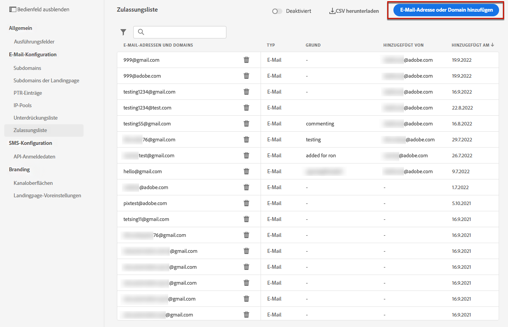

# Zulassungsliste {#allow-list}

Es ist möglich, eine spezifische Liste für die Sicherheit des Versands im [Sandbox](../administration/sandboxes.md) Ebene.

Mit dieser Zulassungsliste können Sie einzelne E-Mail-Adressen oder Domänen angeben, die die einzigen Empfänger oder Domänen sind, die berechtigt sind, die von einer bestimmten Sandbox gesendeten E-Mails zu empfangen.

>[!NOTE]
>
>Diese Funktion ist jetzt sowohl in Produktions-Sandboxes als auch Nicht-Produktions-Sandboxes verfügbar.

Auf einer Nicht-Produktionsinstanz, bei der Fehler auftreten können, stellt die Zulassungsliste beispielsweise sicher, dass Sie kein Risiko haben, unerwünschte Nachrichten an reale Kundenadressen zu senden, und bietet daher eine sichere Umgebung für Testzwecke.

Wenn die Zulassungsliste aktiv, aber leer ist, wird keine E-Mail gesendet. Wenn Sie also auf ein großes Problem stoßen, können Sie diese Funktion verwenden, um alle ausgehenden Nachrichten von zu stoppen. [!DNL Journey Optimizer] bis Sie das Problem beheben. Weitere Informationen finden Sie unter [Zulassungsliste](#logic).

>[!CAUTION]
>
>Diese Funktion ist nur für den E-Mail-Kanal verfügbar.

## Zugriff auf die Zulassungsliste {#access-allowed-list}

Um auf die detaillierte Liste der zugelassenen E-Mail-Adressen und Domains zuzugreifen, gehen Sie zu **[!UICONTROL Administration]** > **[!UICONTROL Kanäle]** > **[!UICONTROL E-Mail-Konfiguration]** und klicken Sie auf **[!UICONTROL Zulassungsliste]**.


>[!CAUTION]
>
>Die Berechtigungen zum Anzeigen, Exportieren und Verwalten der Zulassungsliste sind auf [Journey-Administratoren](../administration/ootb-product-profiles.md#journey-administrator) beschränkt. Weitere Informationen zur Verwaltung der Zugriffsberechtigungen für [!DNL Journey Optimizer]-Benutzende finden Sie in [diesem Abschnitt](../administration/permissions-overview.md).

Um die Zulassungsliste als CSV-Datei zu exportieren, klicken Sie auf den Button **[!UICONTROL CSV herunterladen]**.

Verwenden Sie den Button **[!UICONTROL Löschen]**, um einen Eintrag dauerhaft zu entfernen.

Sie können nach E-Mail-Adressen oder Domains suchen und nach dem **[!UICONTROL Adresstyp]** filtern. Nach der Auswahl können Sie den oben in der Liste angezeigten Filter löschen.


## Zulassungsliste aktivieren {#enable-allow-list}

Gehen Sie wie folgt vor, um die Zulassungsliste zu aktivieren.

1. Öffnen Sie das Menü **[!UICONTROL Kanäle]** > **[!UICONTROL E-Mail-Konfiguration]** > **[!UICONTROL Zulassungsliste]**.

1. Klicken **[!UICONTROL Deaktiviert]**.

   

1. Auswählen **[!UICONTROL Zulassungsliste aktivieren]**. Die Zulassungsliste ist jetzt aktiv.

   

   >[!NOTE]
   >
   >Nachdem Sie die Zulassungsliste aktiviert haben, ist sie in Ihren Journey und Kampagnen mit einer Latenz von 5 Minuten aktiv.

Die Logik der Zulassungsliste gilt, wenn die Funktion aktiv ist. Weiterführende Informationen finden Sie in [diesem Abschnitt](#logic).

>[!NOTE]
>
>Wenn diese Funktion aktiviert ist, wird die Funktion Zulassungsliste beim Ausführen von Journey, aber auch beim Testen von Nachrichten mit [proofs](../design/preview.md#send-proofs) und Testen von Journey mithilfe der [Testmodus](../building-journeys/testing-the-journey.md).

## Zulassungsliste deaktivieren {#deactivate-allow-list}

Gehen Sie wie folgt vor, um die Zulassungsliste zu deaktivieren.

1. Öffnen Sie das Menü **[!UICONTROL Kanäle]** > **[!UICONTROL E-Mail-Konfiguration]** > **[!UICONTROL Zulassungsliste]**.

1. Klicken **[!UICONTROL Aktiv]**.

   

1. Auswählen **[!UICONTROL Zulassungsliste deaktivieren]**. Die Zulassungsliste ist nicht mehr aktiv.

   

   >[!NOTE]
   >
   >Nachdem Sie die Zulassungsliste deaktiviert haben, ist sie in Ihren Journey und Kampagnen auf 5 Minuten Latenz gesetzt.

Die Logik der Zulassungsliste gilt nicht, wenn die Funktion deaktiviert wird. Weiterführende Informationen finden Sie in [diesem Abschnitt](#logic).

## Entitäten zur Zulassungsliste hinzufügen {#add-entities}

Um der Zulassungsliste für eine bestimmte Sandbox neue E-Mail-Adressen oder Domains hinzuzufügen, können Sie entweder [die Liste manuell vervollständigen](#manually-populate-list) oder einen [API-Aufruf](#api-call-allowed-list) verwenden.

>[!NOTE]
>
>Die Zulassungsliste kann bis zu 1.000 Einträge enthalten.

### Manuelles Vervollständigen der Zulassungsliste {#manually-populate-list}

>[!CONTEXTUALHELP]
>id="ajo_admin_allowed_list_add_header"
>title="Hinzufügen von E-Mail-Adressen/Domains zur Zulassungsliste"
>abstract="Sie können der Zulassungsliste manuell neue E-Mail-Adressen oder Domains hinzufügen, indem Sie sie einzeln auswählen."

>[!CONTEXTUALHELP]
>id="ajo_admin_allowed_list_add"
>title="Hinzufügen von E-Mail-Adressen/Domains zur Zulassungsliste"
>abstract="Sie können der Zulassungsliste manuell neue E-Mail-Adressen oder Domains hinzufügen, indem Sie sie einzeln auswählen."

Sie können die [!DNL Journey Optimizer]-Zulassungsliste durch Hinzufügen einer E-Mail-Adresse oder einer Domain über die Benutzeroberfläche vervollständigen.

>[!NOTE]
>
>Sie können jeweils nur eine einzelne E-Mail-Adresse oder Domain hinzufügen.

Gehen Sie dazu wie folgt vor.

1. Klicken Sie auf die Schaltfläche **[!UICONTROL E-Mail-Adresse oder Domain hinzufügen]**.

   

1. Wählen Sie den Adresstyp aus: **[!UICONTROL E-Mail-Adresse]** oder **[!UICONTROL Domain-Adresse]**.

1. Geben Sie die E-Mail-Adresse oder Domain ein, an die Sie E-Mails senden möchten.

   >[!NOTE]
   >
   >Vergewissern Sie sich, dass Sie eine gültige E-Mail-Adresse (z. B. abc@firma.com) oder Domain (z. B. abc.firma.com) eingeben.

1. Geben Sie bei Bedarf einen Grund an.

   

   >[!NOTE]
   >
   >Alle ASCII-Zeichen zwischen 32 und 126 sind im Feld **[!UICONTROL Grund]** zulässig. Die vollständige Liste finden Sie  zum Beispiel auf [dieser Seite](https://en.wikipedia.org/wiki/Wikipedia:ASCII#ASCII_printable_characters){target=&quot;blank&quot;}.

1. Klicken Sie auf **[!UICONTROL Senden]**.

### Hinzufügen von Entitäten mithilfe eines API-Aufrufs {#api-call-allowed-list}

Um die Zulassungsliste zu vervollständigen, können Sie auch die Unterdrückungs-API mit dem Wert `ALLOWED` für das `listType`-Attribut aufrufen. Beispiel:


Sie können die Vorgänge **Hinzufügen**, **Löschen** und **GET** ausführen.

Erfahren Sie mehr über API-Aufrufe in der Referenzdokumentation zu [Adobe Experience Platform-APIs](https://experienceleague.adobe.com/docs/experience-platform/landing/platform-apis/api-guide.html?lang=de){target=&quot;_blank&quot;}.

## Logik der Zulassungsliste {#logic}

>[!CONTEXTUALHELP]
>id="ajo_admin_allowed_list_logic"
>title="Zulassungsliste verwalten"
>abstract="Wenn die Zulassungsliste aktiviert wird, erhalten nur die in der Zulassungsliste enthaltenen Empfänger E-Mail-Nachrichten von dieser Sandbox."

Wann die Zulassungsliste [active](#enable-allow-list), gilt die folgende Logik:

* Wenn die Zulassungsliste **leer** ist, wird keine E-Mail gesendet.

* Wenn eine Entität **zur Zulassungsliste** und nicht in der Unterdrückungsliste, wird die E-Mail an den/die entsprechenden Empfänger gesendet. Wenn sich die Entität jedoch auch auf der [Unterdrückungsliste](../reports/suppression-list.md) befindet, erhält der entsprechende Empfänger die E-Mail nicht. Der Grund lautet **[!UICONTROL Unterdrückt]**.

* Wenn eine Entität **nicht auf der Zulassungsliste** und auch nicht auf der Unterdrückungsliste steht, erhält der entsprechende Empfänger die E-Mail nicht. Der Grund lautet **[!UICONTROL Nicht zugelassen]**.

>[!NOTE]
>
>Die Profile mit dem Status **[!UICONTROL Nicht zugelassen]** werden beim Nachrichtenversand ausgeschlossen. Daher zeigen die **Journey-Berichte** zwar an, dass sich diese Profile durch die Journey bewegt haben (Aktivitäten [Segment lesen](../building-journeys/read-segment.md) und [Nachrichtenaktivitäten](../building-journeys/journeys-message.md)), sie sind aber nicht in der Metrik **[!UICONTROL Gesendet]** der **E-Mail-Berichte** enthalten, da sie vor dem E-Mail-Versand herausgefiltert werden.
>
>Erfahren Sie mehr über den [Live-Bericht](../reports/live-report.md) und den [globalen Bericht](../reports/global-report.md).

Wann die Zulassungsliste [deaktiviert](#deactivate-allow-list), werden alle E-Mails, die Sie aus der aktuellen Sandbox senden, an alle Empfänger gesendet (sofern sie nicht auf der Unterdrückungsliste stehen), einschließlich der tatsächlichen Kundenadressen.

## Ausschlussberichte {#reporting}

Wenn die Zulassungsliste aktiv ist, können Sie E-Mail-Adressen oder Domänen abrufen, die vom Versand ausgeschlossen wurden, weil sie sich nicht auf der Zulassungsliste befanden. Dazu können Sie den [Abfrage-Service von Adobe Experience Platform](https://experienceleague.adobe.com/docs/experience-platform/query/api/getting-started.html?lang=de){target=&quot;_blank&quot;} verwenden, um die unten stehenden API-Aufrufe durchzuführen.

Verwenden Sie die folgende Abfrage, um die **Anzahl der E-Mails** abzurufen, die nicht gesendet wurden, weil die Empfänger nicht auf der Zulassungsliste waren:

```sql
SELECT count(distinct _id) from cjm_message_feedback_event_dataset WHERE
_experience.customerJourneyManagement.messageExecution.messageExecutionID = '<MESSAGE_EXECUTION_ID>' AND
_experience.customerJourneyManagement.messageDeliveryfeedback.feedbackStatus = 'exclude' AND
_experience.customerJourneyManagement.messageDeliveryfeedback.messageExclusion.reason = 'EmailNotAllowed'
```

Verwenden Sie die folgende Abfrage, um die **Liste der E-Mail-Adressen** abzurufen, die nicht gesendet wurden, weil die Empfänger nicht auf der Zulassungsliste waren:

```sql
SELECT distinct(_experience.customerJourneyManagement.emailChannelContext.address) from cjm_message_feedback_event_dataset WHERE
_experience.customerJourneyManagement.messageExecution.messageExecutionID IS NOT NULL AND
_experience.customerJourneyManagement.messageDeliveryfeedback.feedbackStatus = 'exclude' AND
_experience.customerJourneyManagement.messageDeliveryfeedback.messageExclusion.reason = 'EmailNotAllowed'
```
