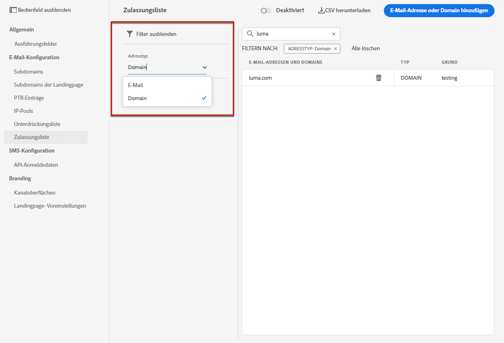

# Zulassungsliste {#allow-list}

Es ist möglich, eine spezifische Liste für die Sicherheit des Versands im [Sandbox](../administration/sandboxes.md) Ebene, um eine sichere Umgebung für Testzwecke zu erhalten.

Beispielsweise wird auf einer Nicht-Produktionsinstanz, bei der Fehler auftreten können, durch die Zulassungsliste sichergestellt, dass Sie keine unerwünschten Nachrichten an Ihre Kunden senden.

>[!NOTE]
>
>Diese Funktion ist für Produktions- und Nicht-Produktions-Sandboxes verfügbar.

Mit der Zulassungsliste können Sie einzelne E-Mail-Adressen oder Domains angeben, die die einzigen Empfänger oder Domains sind, die zum Empfang der von einer bestimmten Sandbox gesendeten E-Mails berechtigt sind. Dadurch können Sie verhindern, dass Sie in einer Testumgebung versehentlich E-Mails an echte Kundenadressen senden.

>[!CAUTION]
>
>Diese Funktion ist nur für den E-Mail-Kanal verfügbar.

## Zugriff auf die Zulassungsliste {#access-allowed-list}

Um auf die detaillierte Liste der zulässigen E-Mail-Adressen und Domänen zuzugreifen, navigieren Sie zu **[!UICONTROL Administration]** > **[!UICONTROL Kanäle]** > **[!UICONTROL E-Mail-Konfiguration]** und wählen Sie **[!UICONTROL Zulassungsliste]**.


>[!CAUTION]
>
>Die Berechtigungen zum Anzeigen, Exportieren und Verwalten der Zulassungsliste sind auf [Journey-Administratoren](../administration/ootb-product-profiles.md#journey-administrator). Weitere Informationen zur Verwaltung der Zugriffsberechtigungen für [!DNL Journey Optimizer]-Benutzer finden Sie in [diesem Abschnitt](../administration/permissions-overview.md).

Um die Zulassungsliste als CSV-Datei zu exportieren, wählen Sie die **[!UICONTROL CSV herunterladen]** Schaltfläche.

Verwenden Sie die **[!UICONTROL Löschen]** -Schaltfläche, um einen Eintrag dauerhaft zu entfernen.

Sie können nach den E-Mail-Adressen oder Domänen suchen und nach der **[!UICONTROL Adresstyp]**. Nach der Auswahl können Sie den Filter löschen, der oben in der Liste angezeigt wird.



## Aktivieren der Zulassungsliste {#enable-allow-list}

Gehen Sie wie folgt vor, um die Zulassungsliste zu aktivieren.

1. Öffnen Sie das Menü **[!UICONTROL Kanäle]** > **[!UICONTROL E-Mail-Konfiguration]** > **[!UICONTROL Zulassungsliste]**.

1. Klicken **[!UICONTROL Zulassungsliste aktivieren/deaktivieren]**.

   

1. Wählen Sie **[!UICONTROL Zulassungsliste aktivieren]** aus.

   

1. Klicken Sie auf **[!UICONTROL Speichern]**. Die Zulassungsliste ist aktiviert.

Die Logik der Zulassungsliste wird angewendet, wenn die Funktion aktiviert ist. Weiterführende Informationen finden Sie in diesem [Abschnitt](#logic).

>[!NOTE]
>
>Wenn sie aktiviert ist, wird die Funktion „Zulassungsliste“ beim Ausführen von Journey-Tests, aber auch beim Testen von Nachrichten mit [Testsendungen](../design/preview.md#send-proofs) und beim Testen von Journeys unter Verwendung des [Testmodus](../building-journeys/testing-the-journey.md) berücksichtigt.

## Entitäten zur Zulassungsliste hinzufügen {#add-entities}

Um der Zulassungsliste für eine bestimmte Sandbox neue E-Mail-Adressen oder Domänen hinzuzufügen, können Sie entweder [manuelles Ausfüllen der Liste](#manually-populate-list)oder verwenden Sie eine [API-Aufruf](#api-call-allowed-list).

>[!NOTE]
>
>Die Zulassungsliste kann bis zu 1.000 Einträge enthalten.

### Zulassungsliste manuell ausfüllen {#manually-populate-list}

>[!CONTEXTUALHELP]
>id="ajo_admin_allowed_list_add"
>title="Hinzufügen von Adressen oder Domänen zur Zulassungsliste"
>abstract="Sie können der Zulassungsliste manuell neue E-Mail-Adressen oder Domänen hinzufügen, indem Sie sie einzeln auswählen."

Sie können die [!DNL Journey Optimizer] Zulassungsliste durch Hinzufügen einer E-Mail-Adresse oder einer Domain über die Benutzeroberfläche.

>[!NOTE]
>
>Sie können jeweils nur eine E-Mail-Adresse oder Domain hinzufügen.

Gehen Sie dazu wie folgt vor.

1. Wählen Sie die **[!UICONTROL E-Mail oder Domain hinzufügen]** Schaltfläche.

   

1. Wählen Sie den Adresstyp aus: **[!UICONTROL E-Mail-Adresse]** oder **[!UICONTROL Domain-Adresse]**.

1. Geben Sie die E-Mail-Adresse oder Domain ein, an die Sie E-Mails senden möchten.

   >[!NOTE]
   >
   >Vergewissern Sie sich, dass Sie eine gültige E-Mail-Adresse (z. B. abc@company.com) oder Domain (z. B. abc.company.com) eingeben.

1. Geben Sie bei Bedarf einen Grund an.

   

   >[!NOTE]
   >
   >Alle ASCII-Zeichen zwischen 32 und 126 sind im Feld **[!UICONTROL Grund]** zulässig. Die vollständige Liste finden Sie  zum Beispiel auf [dieser Seite](https://en.wikipedia.org/wiki/Wikipedia:ASCII#ASCII_printable_characters){target=&quot;blank&quot;}.

1. Klicken Sie auf **[!UICONTROL Senden]**.

### Entitäten mithilfe eines API-Aufrufs hinzufügen {#api-call-allowed-list}

Um die Zulassungsliste zu füllen, können Sie auch die Unterdrückungs-API mit der `ALLOWED` Wert für `listType` -Attribut. Beispiel:


Sie können die Vorgänge **Hinzufügen**, **Löschen** und **GET** ausführen.

Erfahren Sie mehr über API-Aufrufe in der Referenzdokumentation zu [Adobe Experience Platform-APIs](https://experienceleague.adobe.com/docs/experience-platform/landing/platform-apis/api-guide.html?lang=de){target=&quot;_blank&quot;}.

## Logik der Zulassungsliste {#logic}

Wann die Zulassungsliste [enabled](#enable-allow-list), gilt die folgende Logik:

* Wenn die Zulassungsliste **leer** gesetzt, wird keine E-Mail gesendet.

* Wenn eine Entität **zur Zulassungsliste** und nicht in der Unterdrückungsliste, kann die E-Mail an den/die entsprechenden Empfänger gesendet werden. Wenn sich das Unternehmen jedoch auch auf der [Unterdrückungsliste](../reports/suppression-list.md), werden die entsprechenden Empfänger die E-Mail nicht erhalten, weshalb **[!UICONTROL Unterdrückt]**.

* Wenn eine Entität **nicht auf der Zulassungsliste** (und nicht auf der Unterdrückungsliste), werden die entsprechenden Empfänger die E-Mail nicht erhalten, weshalb **[!UICONTROL Nicht erlaubt]**.

>[!NOTE]
>
>Die Profile mit dem Status **[!UICONTROL Nicht erlaubt]** werden beim Nachrichtenversand ausgeschlossen. Daher muss während der **Journey-Berichte** zeigt diese Profile an, als ob sie sich durch die Journey bewegt haben ([Segment lesen](../building-journeys/read-segment.md) und [Nachrichtenaktivitäten](../building-journeys/journeys-message.md)), die **E-Mail-Berichte** werden sie nicht in die **[!UICONTROL Gesendet]** Metriken, da sie vor dem E-Mail-Versand herausgefiltert werden.
>
>Erfahren Sie mehr über den [Live-Bericht](../reports/live-report.md) und den [globalen Bericht](../reports/global-report.md).

## Ausschlussberichte {#reporting}

Wenn diese Funktion in einer Nicht-Produktions-Sandbox aktiviert ist, können Sie vom Versand ausgeschlossene E-Mail-Adressen oder Domains abrufen, die sich nicht auf der Zulassungsliste befanden. Dazu können Sie den [Abfrage-Service von Adobe Experience Platform](https://experienceleague.adobe.com/docs/experience-platform/query/api/getting-started.html?lang=de){target=&quot;_blank&quot;} verwenden, um die unten stehenden API-Aufrufe durchzuführen.

Verwenden Sie die folgende Abfrage, um die **Anzahl der E-Mails** abzurufen, die nicht gesendet wurden, weil die Empfänger nicht auf der Zulassungsliste waren:

```sql
SELECT count(distinct _id) from cjm_message_feedback_event_dataset WHERE
_experience.customerJourneyManagement.messageExecution.messageExecutionID = '<MESSAGE_EXECUTION_ID>' AND
_experience.customerJourneyManagement.messageDeliveryfeedback.feedbackStatus = 'exclude' AND
_experience.customerJourneyManagement.messageDeliveryfeedback.messageExclusion.reason = 'EmailNotAllowed'
```

Verwenden Sie die folgende Abfrage, um die **Liste der E-Mail-Adressen** abzurufen, die nicht gesendet wurden, weil die Empfänger nicht auf der Zulassungsliste waren:

```sql
SELECT distinct(_experience.customerJourneyManagement.emailChannelContext.address) from cjm_message_feedback_event_dataset WHERE
_experience.customerJourneyManagement.messageExecution.messageExecutionID IS NOT NULL AND
_experience.customerJourneyManagement.messageDeliveryfeedback.feedbackStatus = 'exclude' AND
_experience.customerJourneyManagement.messageDeliveryfeedback.messageExclusion.reason = 'EmailNotAllowed'
```
