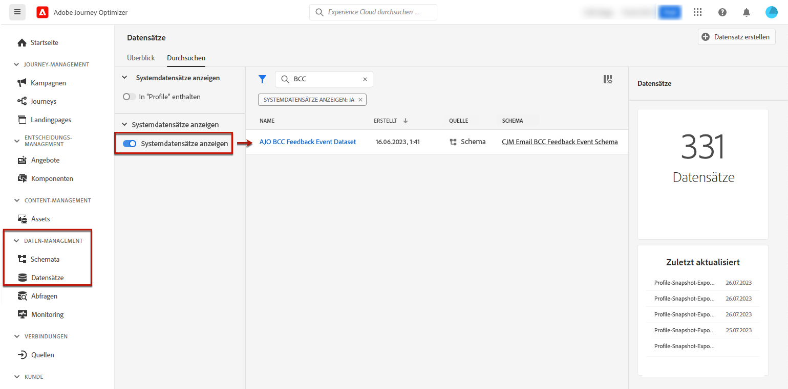

# Unterstützung für Archivierung {#archiving-support}

## So archivieren Sie Nachrichten {#about-archiving}

Vorschriften wie HIPAA erfordern, dass [!DNL Journey Optimizer] eine Möglichkeit bietet, um an Einzelpersonen gesendete Nachrichten zu archivieren. Wenn Ihre Kundinnen und Kunden einen Anspruch einreichen, sollten sie die Möglichkeit haben, eine Kopie der gesendeten Nachricht zu Verifizierungszwecken zu erhalten.

* Für den E-Mail-Kanal bietet [!DNL Journey Optimizer] eine integrierte BCC-Funktion. [Weitere Informationen](#bcc-email)

* Darüber hinaus können Sie für alle Kanäle das Feld „Vorlage“ im **Entitätsdatensatz** verwenden, in dem die Details der nicht personalisierten Nachrichtenvorlagen enthalten sind. Exportieren Sie den Datensatz mit diesem Feld, um Metadaten zu speichern, wie etwa die Personen, die die Nachricht gesendet und empfangen haben sowie den Zeitpunkt. Beachten Sie, dass personalisierte Daten nicht exportiert werden – es wird nur die Vorlage (Format und Struktur der Nachricht) berücksichtigt. [Weitere Informationen](../data/datasets-query-examples.md#entity-dataset)

>[!NOTE]
>
>[!DNL Journey Optimizer] bietet keine Unterstützung für die Anforderung zur SMS-Archivierung. Arbeiten Sie für eine dedizierte Archivierungsunterstützung mit Ihrem SMS-Anbieter (Synch oder Twilio) zusammen.

## So verwenden Sie BCC in E-Mails {#bcc-email}

>[!CONTEXTUALHELP]
>id="ajo_admin_preset_bcc"
>title="Definieren einer BCC-E-Mail-Adresse"
>abstract="Sie können eine Kopie der gesendeten E-Mails aufbewahren, indem Sie sie an einen BCC-Posteingang senden. Geben Sie die E-Mail-Adresse Ihrer Wahl ein, sodass jede gesendete E-Mail blind an diese BCC-Adresse gesendet wird. Beachten Sie, dass sich die Domain der BCC-Adresse von jeder an Adobe delegierten Subdomain unterscheiden muss.  Diese Funktion ist optional."

Sie können eine Blindkopie (BCC) einer von [!DNL Journey Optimizer] gesendeten E-Mail an eine spezielle BCC-Adresse senden.  Mit dieser optionalen Funktion können Sie Kopien der E-Mail-Nachrichten speichern, die Sie Ihren Benutzerinnen und Benutzern zu Zwecken der Einhaltung der Vorschriften und/oder Archivierung senden. Die BCC-Adresse ist für andere Empfängerinnen und Empfänger der Nachricht nicht sichtbar.

### Aktivieren von BCC-E-Mails {#enable-bcc}

Um die Option **[!UICONTROL BCC-E-Mail]** zu aktivieren, geben Sie die E-Mail-Adresse Ihrer Wahl in das dafür vorgesehene Feld der [Kanaloberfläche](channel-surfaces.md) (d. h. der Nachrichtenvoreinstellung) ein. Sie können eine beliebige externe Adresse im korrekten Format angeben, mit Ausnahme einer E-Mail-Adresse, die in der Adobe zugewiesenen Subdomain definiert ist. Wenn Sie zum Beispiel die Subdomain *marketing.luma.com* an Adobe delegiert haben, ist jede Adresse des Typs *abc@marketing.luma.com* verboten.

>[!CAUTION]
>
>Sie können nur eine einzige BCC-E-Mail-Adresse definieren. Stellen Sie sicher, dass die BCC-Adresse über genügend Aufnahmekapazität verfügt, um alle E-Mails zu speichern, die mit der aktuellen Kanaloberfläche gesendet werden.
>
>Weitere Empfehlungen finden Sie in [diesem Abschnitt](#bcc-recommendations-limitations).

>[!NOTE]
>
>Wenn Sie das Add-On-Angebot „Healthcare Shield“ erworben haben, müssen Sie sicherstellen, dass der ISP Ihrer BCC-Adresse das TLS 1.2-Protokoll unterstützt.


Nach der Konfiguration wird für alle auf dieser Oberfläche basierenden E-Mail-Nachrichten eine Blindkopie an die von Ihnen eingegebene BCC-E-Mail-Adresse gesendet. Von dort aus können Nachrichten mithilfe eines externen Systems verarbeitet und archiviert werden.

>[!CAUTION]
>
>Die Nutzung der BCC-Funktion wird auf die Anzahl der Nachrichten angerechnet, für die Sie lizenziert sind. Aktivieren Sie sie in den Oberflächen daher nur für wichtige Nachrichten, die Sie archivieren möchten. Prüfen Sie Ihren Vertrag auf das Lizenzvolumen.

Die Einstellung der BCC-E-Mail-Adresse wird sofort auf der Ebene der Oberfläche gespeichert und verarbeitet. Wenn Sie mit dieser Oberfläche eine neue Nachricht erstellen, wird die BCC-E-Mail-Adresse automatisch angezeigt.


Die BCC-Adresse wird jedoch gemäß der [hier](../email/email-settings.md) beschriebenen Logik für den Versand von Nachrichten übernommen.

### Empfehlungen und Einschränkungen {#bcc-recommendations-limitations}

* Aus Datenschutzgründen müssen BCC-E-Mails von einem Archivierungssystem bearbeitet werden, in dem personenbezogene Daten (PII, Personally Identifiable Information) sicher aufbewahrt werden.

* Da Nachrichten vertrauliche oder private Daten enthalten können, z. B. personenbezogene Daten (PII), müssen Sie dafür sorgen, dass die BCC-Adresse korrekt ist, und den Zugriff auf Nachrichten schützen.

* Ihr Posteingang, der für BCC verwendet wird, sollte in Bezug auf Speicherplatz und Versand ordnungsgemäß verwaltet werden. Wenn der Posteingang Bounces zurückgibt, werden manche E-Mails möglicherweise nicht empfangen und daher nicht archiviert.

* Nachrichten können vor dem Versand an die Zielgruppe an die BCC-E-Mail-Adresse gesendet werden. BCC-Nachrichten können auch dann gesendet werden, wenn es bei den ursprünglichen Nachrichten zu einem [Bounce](../reports/suppression-list.md#delivery-failures) kam.

  <!--OR: Only successfully sent emails are taken in account. [Bounces](../reports/suppression-list.md#delivery-failures) are not. TO CHECK -->

* Öffnen oder klicken Sie nicht durch die an die BCC-Adresse gesendeten E-Mails, da sie bei der Versandanalyse in der Gesamtzahl der Öffnungen und Klicks berücksichtigt werden. Das könnte in [Berichten](../reports/global-report.md) zu falschen Berechnungen führen.

* Markieren Sie im BCC-Posteingang keine Nachrichten als Spam, da sich das auf alle anderen an diese Adresse gesendeten E-Mails auswirken wird.

>[!CAUTION]
>
>Klicken Sie in den an die BCC-Adresse gesendeten E-Mails nicht auf den Abmelde-Link, da dadurch die entsprechenden Empfänger sofort abgemeldet werden.

### DSGVO-Konformität {#gdpr-compliance}

Vorschriften wie die DSGVO besagen, dass die betroffenen Personen ihr Einverständnis jederzeit ändern können. Da die mit Journey Optimizer gesendeten BCC-E-Mails auf sichere Weise personenbezogene Daten enthalten, müssen Sie das **[!UICONTROL CJM E-Mail-BCC-Feedback-Ereignisschema]** bearbeiten, um diese personenbezogenen Daten unter Einhaltung der DSGVO und ähnlicher Vorschriften verwalten zu können.

Gehen Sie dazu wie folgt vor.

1. Gehen Sie zu **[!UICONTROL Daten-Management]** > **[!UICONTROL Schemas]** > **[!UICONTROL Durchsuchen]** und wählen Sie **[!UICONTROL CJM E-Mail-BCC-Feedback-Ereignisschema]** aus.

   

1. Klicken Sie auf **[!UICONTROL _experience]**, **[!UICONTROL customerJourneyManagement]** und dann auf **[!UICONTROL secondaryRecipientDetail]**, um die Struktur zu erweitern.

1. Wählen Sie **[!UICONTROL originalRecipientAddress]** aus.

1. In den **[!UICONTROL Feldeigenschaften]** rechts scrollen Sie nach unten zum Kontrollkästchen **[!UICONTROL Identität]**.

1. Markieren Sie es und wählen Sie auch **[!UICONTROL Primäre Identität]** aus.

1. Wählen Sie einen Namespace aus der Dropdown-Liste aus.

   

1. Klicken Sie auf **[!UICONTROL Übernehmen]**.

>[!NOTE]
>
>Weitere Informationen zur Verwaltung der Datenschutzeinstellungen und den geltenden Vorschriften finden Sie in der [Dokumentation zu Experience Platform](https://experienceleague.adobe.com/docs/experience-platform/privacy/home.html?lang=de){target="_blank"}.

### BCC-Berichtsdaten {#bcc-reporting}

Das Reporting über BCC als solches ist in den Journey- und Nachrichtenberichten nicht verfügbar. Informationen werden jedoch in einem Systemdatensatz mit dem Namen **[!UICONTROL Datensatz mit AJO BCC-Feedback-Ereignissen]** gespeichert. Sie können Abfragen für diesen Datensatz ausführen, um beispielsweise nützliche Informationen zu Debugging-Zwecken zu finden.

Sie können über die Benutzeroberfläche auf diesen Datensatz zugreifen. Wählen Sie **[!UICONTROL Daten-Management]** > **[!UICONTROL Datensätze]** > **[!UICONTROL Durchsuchen]** aus und aktivieren Sie den Umschalter **[!UICONTROL Anzeigen von Systemdatensätzen]** aus dem Filter, um die systemgenerierten Datensätze anzuzeigen. In [diesem Abschnitt](../data/get-started-datasets.md#access-datasets) erfahren Sie mehr über den Zugriff auf Datensätze.



Um Abfragen für diesen Datensatz auszuführen, können Sie den Abfrage-Editor verwenden, der vom [Adobe Experience Platform-Abfrage-Service](https://experienceleague.adobe.com/docs/experience-platform/query/api/getting-started.html?lang=de){target="_blank"} bereitgestellt wird. Um darauf zuzugreifen, wählen Sie **[!UICONTROL Daten-Management]** > **[!UICONTROL Abfragen]** und klicken Sie auf **[!UICONTROL Abfrage erstellen]**. [Weitere Informationen](../data/get-started-queries.md)


Je nach gesuchten Informationen können Sie die folgenden Abfragen ausführen.

1. Für alle anderen Abfragen unten benötigen Sie die Journey-Aktions-ID. Führen Sie diese Abfrage aus, um alle innerhalb der letzten 2 Tage mit einer bestimmten Journey-Versions-ID verknüpften Aktions-IDs abzurufen:

   ```
   SELECT
   DISTINCT
   CAST(TIMESTAMP AS DATE) AS EventTime,
   _experience.journeyOrchestration.stepEvents.journeyVersionID,
   _experience.journeyOrchestration.stepEvents.actionName, 
   _experience.journeyOrchestration.stepEvents.actionID 
   FROM journey_step_events 
   WHERE 
   _experience.journeyOrchestration.stepEvents.journeyVersionID = '<journey version id>' AND 
   _experience.journeyOrchestration.stepEvents.actionID is not NULL AND 
   TIMESTAMP > NOW() - INTERVAL '2' DAY 
   ORDER BY EventTime DESC;
   ```

   >[!NOTE]
   >
   >Um den `<journey version id>`-Parameter abzurufen, wählen Sie die entsprechende [Journey-Version](../building-journeys/journey.md#journey-versions) aus dem Menü **[!UICONTROL Journey-Management]** > **[!UICONTROL Journeys]**. Die Journey-Versions-ID wird am Ende der URL angezeigt, die in Ihrem Webbrowser angezeigt wird.
   >
   >

1. Führen Sie diese Abfrage aus, um alle Nachrichten-Feedback-Ereignisse (insbesondere den Feedback-Status) abzurufen, die in den letzten 2 Tagen für eine bestimmte Nachricht, die an einen bestimmten Benutzer gesendet wurde, generiert wurden:

   ```
   SELECT  
   _experience.customerJourneyManagement.messageExecution.journeyVersionID AS JourneyVersionID, 
   _experience.customerJourneyManagement.messageExecution.journeyActionID AS JourneyActionID, 
   timestamp AS EventTime, 
   _experience.customerJourneyManagement.emailChannelContext.address AS RecipientAddress, 
   _experience.customerjourneymanagement.messagedeliveryfeedback.feedbackStatus AS FeedbackStatus,
   CASE _experience.customerjourneymanagement.messagedeliveryfeedback.feedbackStatus
       WHEN 'sent' THEN 'Sent'
       WHEN 'delay' THEN 'Retry'
       WHEN 'out_of_band' THEN 'Bounce' 
       WHEN 'bounce' THEN 'Bounce'
   END AS FeedbackStatusCategory
   FROM cjm_message_feedback_event_dataset 
   WHERE  
       timestamp > now() - INTERVAL '2' day  AND
       _experience.customerJourneyManagement.messageExecution.journeyVersionID = '<journey version id>' AND 
       _experience.customerJourneyManagement.messageExecution.journeyActionID = '<journey action id>' AND  
       _experience.customerJourneyManagement.emailChannelContext.address = '<recipient email address>'
       ORDER BY EventTime DESC;
   ```

   >[!NOTE]
   >
   >Um den `<journey action id>`-Parameter abzurufen, führen Sie die erste oben beschriebene Abfrage mit der Journey-Versions-ID aus. Der `<recipient email address>`-Parameter ist die E-Mail-Adresse des Zielkontakts oder des tatsächlichen Empfängers.

1. Führen Sie diese Abfrage aus, um alle BCC-Nachrichten-Feedback-Ereignisse abzurufen, die für eine bestimmte Nachricht, die innerhalb der letzten 2 Tage an einen bestimmten Benutzer gesendet wurde, generiert wurden:

   ```
   SELECT   
   _experience.customerJourneyManagement.messageExecution.journeyVersionID AS JourneyVersionID, 
   _experience.customerJourneyManagement.messageExecution.journeyActionID AS JourneyActionID, 
   _experience.customerJourneyManagement.emailChannelContext.address AS BccEmailAddress,
   timestamp AS EventTime, 
   _experience.customerJourneyManagement.secondaryRecipientDetail.originalRecipientAddress AS RecipientAddress, 
   _experience.customerjourneymanagement.messagedeliveryfeedback.feedbackStatus AS FeedbackStatus,
   CASE _experience.customerjourneymanagement.messagedeliveryfeedback.feedbackStatus
               WHEN 'sent' THEN 'Sent'
               WHEN 'delay' THEN 'Retry'
               WHEN 'out_of_band' THEN 'Bounce' 
               WHEN 'bounce' THEN 'Bounce'
           END AS FeedbackStatusCategory 
   FROM ajo_bcc_feedback_event_dataset  
   WHERE  
   timestamp > now() - INTERVAL '2' day  AND
   _experience.customerJourneyManagement.messageExecution.journeyVersionID = '<journey version id>' AND 
   _experience.customerJourneyManagement.messageExecution.journeyActionID = '<journeyaction id>' AND 
   _experience.customerJourneyManagement.secondaryRecipientDetail.originalRecipientAddress = '<recipient email address>'
   ORDER BY EventTime DESC;
   ```

1. Führen Sie diese Abfrage aus, um alle Empfängeradressen abzurufen, die die Nachricht nicht erhalten haben, obwohl ihr BCC-Eintrag innerhalb der letzten 30 Tage existierte:

   ```
    SELECT
        DISTINCT 
    bcc._experience.customerJourneyManagement.secondaryRecipientDetail.originalRecipientAddress AS RecipientAddressesNotRecievedMessage
    FROM ajo_bcc_feedback_event_dataset bcc
    LEFT JOIN cjm_message_feedback_event_dataset mfe
    ON 
   bcc._experience.customerJourneyManagement.messageExecution.journeyVersionID =
            mfe._experience.customerJourneyManagement.messageExecution.journeyVersionID AND    bcc._experience.customerJourneyManagement.messageExecution.journeyActionID = mfe._experience.customerJourneyManagement.messageExecution.journeyActionID AND 
   bcc._experience.customerJourneyManagement.secondaryRecipientDetail.originalRecipientAddress = mfe._experience.customerJourneyManagement.emailChannelContext.address AND
   mfe._experience.customerJourneyManagement.messageExecution.journeyVersionID = '<journey version id>' AND 
   mfe._experience.customerJourneyManagement.messageExecution.journeyActionID = '<journey action id>' AND
   mfe.timestamp > now() - INTERVAL '30' DAY AND
   mfe._experience.customerjourneymanagement.messagedeliveryfeedback.feedbackstatus IN ('bounce', 'out_of_band') 
    WHERE bcc.timestamp > now() - INTERVAL '30' DAY;
   ```
