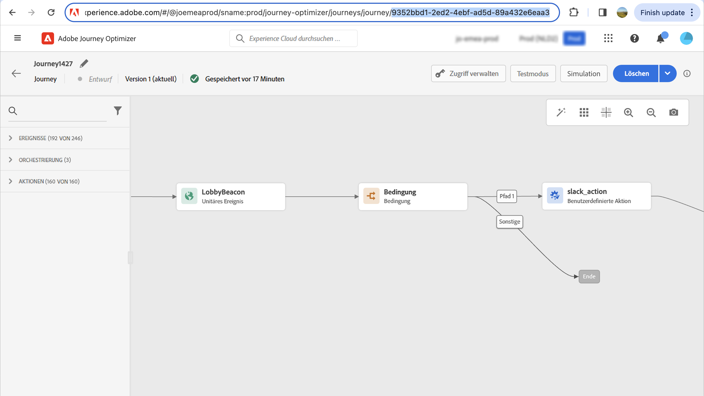

# Unterstützung für Archivierung {#archiving-support}

## Archivieren von Nachrichten {#about-archiving}

Vorschriften wie HIPAA erfordern, dass [!DNL Journey Optimizer] soll eine Möglichkeit bieten, an Einzelpersonen gesendete Nachrichten zu archivieren. Wenn Ihre Kunden eine Forderung erheben, sollten sie die Möglichkeit haben, eine Kopie der gesendeten Nachricht zu Überprüfungszwecken zu erhalten.

* Für den E-Mail-Kanal: [!DNL Journey Optimizer] bietet eine integrierte BCC-E-Mail-Funktion. [Weitere Infos](#bcc-email)

* Darüber hinaus können Sie für alle Kanäle das Feld &quot;Vorlage&quot;im **Entitätsdatensatz**, der die Details der nicht personalisierten Nachrichtenvorlagen enthält. Exportieren Sie den Datensatz mit diesem Feld, um Metadaten zu speichern, z. B.: wer die Nachricht gesendet hat, an wen und wann. Beachten Sie, dass personalisierte Daten nicht exportiert werden - es wird nur die Vorlage (Format und Struktur der Nachricht) berücksichtigt. [Weitere Infos](../data/datasets-query-examples.md#entity-dataset)

>[!NOTE]
>
>[!DNL Journey Optimizer] bietet keine Unterstützung für die SMS-Archivierungsanforderungen. Arbeiten Sie für dedizierte Archivierungsunterstützung mit Ihrem SMS-Anbieter (Synch oder Twilio) zusammen.

## Verwenden von BCC für E-Mails {#bcc-email}

>[!CONTEXTUALHELP]
>id="ajo_admin_preset_bcc"
>title="BCC-E-Mail-Adresse definieren"
>abstract="Sie können eine Kopie der gesendeten E-Mails aufbewahren, indem Sie sie an einen BCC-Posteingang senden. Geben Sie die E-Mail-Adresse Ihrer Wahl ein, damit jede gesendete E-Mail blind in diese BCC-Adresse kopiert wird. Beachten Sie, dass die BCC-Adressdomäne nicht mit der Subdomain übereinstimmen sollte, die Adobe zugewiesen wurde. Diese Funktion ist optional."

Sie können eine identische Kopie (oder blinde Kopie) einer E-Mail senden, die von [!DNL Journey Optimizer] in einen BCC-Posteingang. Mit dieser optionalen Funktion können Sie Kopien der E-Mail-Nachrichten speichern, die Sie Ihren Benutzern zur Einhaltung der Vorschriften und/oder zur Archivierung senden. Dies ist für die Versandempfänger unsichtbar.

### BCC-E-Mail aktivieren {#enable-bcc}

So aktivieren Sie die **[!UICONTROL BCC email]** Geben Sie die gewünschte E-Mail-Adresse in das entsprechende Feld der [Kanaloberfläche](channel-surfaces.md) (d. h. Nachrichtenvorgabe). Sie können jede externe Adresse im richtigen Format angeben, mit Ausnahme der E-Mail-Adresse, die für eine Adobe zugewiesene Subdomain definiert ist. Wenn Sie beispielsweise die Variable *marketing.luma.com* Subdomain zu Adobe, beliebige Adresse wie *abc@marketing.luma.com* ist verboten.

>[!CAUTION]
>
>Sie können nur eine BCC-E-Mail-Adresse definieren. Stellen Sie sicher, dass die BCC-Adresse über ausreichend Aufnahmekapazität verfügt, um alle E-Mails zu speichern, die über die aktuelle Kanaloberfläche gesendet werden.
>
>Weitere Empfehlungen finden Sie unter [diesem Abschnitt](#bcc-recommendations-limitations).

>[!NOTE]
>
>Wenn Sie das Add-On-Angebot &quot;Healthcare Shield&quot;erworben haben, müssen Sie sicherstellen, dass der ISP Ihrer BCC-Adresse das TLS 1.2-Protokoll unterstützt.


Alle E-Mail-Nachrichten, die diese Oberfläche verwenden, werden blind in die von Ihnen eingegebene BCC-E-Mail-Adresse kopiert. Von dort aus können sie mithilfe eines externen Systems verarbeitet und archiviert werden.

>[!CAUTION]
>
>Die Verwendung Ihrer BCC-Funktion wird mit der Anzahl der Nachrichten abgeglichen, für die Sie lizenziert sind. Daher aktivieren Sie sie nur auf den Oberflächen, die für kritische Kommunikation verwendet werden, die Sie archivieren möchten. Prüfen Sie Ihren Vertrag auf lizenzierte Mengen.

Die Einstellung der BCC-E-Mail-Adresse wird sofort gespeichert und auf oberflächlicher Ebene verarbeitet. Wenn Sie eine neue Nachricht auf dieser Oberfläche erstellen, wird die BCC-E-Mail-Adresse automatisch angezeigt.


Die BCC-Adresse wird jedoch nach der beschriebenen Logik für den Versand von Nachrichten erfasst [here](../email/email-settings.md).

### Empfehlungen und Einschränkungen {#bcc-recommendations-limitations}

* Um die Einhaltung der Datenschutzbestimmungen zu gewährleisten, müssen BCC-E-Mails von einem Archivierungssystem verarbeitet werden, in dem personenbezogene Daten (PII) sicher gespeichert werden können.

* Da Nachrichten vertrauliche oder private Daten enthalten können, z. B. personenbezogene Daten (PII), müssen Sie sicherstellen, dass die BCC-Adresse korrekt ist, und den Zugriff auf Nachrichten sicherstellen.

* Ihr Posteingang, der für BCC verwendet wird, sollte für Speicherplatz und Bereitstellung ordnungsgemäß verwaltet werden. Wenn der Posteingang Bounces zurückgibt, werden manche E-Mails möglicherweise nicht empfangen und daher nicht archiviert.

* Nachrichten können vor den Zielempfängern an die BCC-E-Mail-Adresse gesendet werden. BCC-Nachrichten können auch dann gesendet werden, wenn die ursprünglichen Nachrichten [bounced](../reports/suppression-list.md#delivery-failures).

   <!--OR: Only successfully sent emails are taken in account. [Bounces](../reports/suppression-list.md#delivery-failures) are not. TO CHECK -->

* Öffnen oder klicken Sie nicht durch die an die BCC-Adresse gesendeten E-Mails, da sie in der Gesamtzahl der Öffnungen und Klicks aus der Versandanalyse berücksichtigt werden. Dies könnte zu falschen Berechnungen in [Berichte](../reports/global-report.md).

* Markieren Sie keine Nachrichten im BCC-Posteingang als Spam, da sich dies auf alle anderen an diese Adresse gesendeten E-Mails auswirkt.


>[!CAUTION]
>
>Klicken Sie nicht auf den Abmelde-Link in den an die BCC-Adresse gesendeten E-Mails, da Sie die entsprechenden Empfänger sofort abmelden werden.

### DSGVO-Konformität {#gdpr-compliance}

Vorschriften wie die DSGVO besagen, dass die betroffenen Personen ihre Einwilligung jederzeit ändern können. Da die mit Journey Optimizer gesendeten BCC-E-Mails sicher personenbezogene Daten (PII) enthalten, müssen Sie die **[!UICONTROL CJM Email BCC Feedback Event Schema]** um diese personenbezogenen Daten unter Einhaltung der DSGVO und ähnlicher Vorschriften verwalten zu können.

Gehen Sie dazu wie folgt vor.

1. Navigieren Sie zu **[!UICONTROL Data management]** > **[!UICONTROL Schemas]** > **[!UICONTROL Browse]** und wählen Sie **[!UICONTROL CJM Email BCC Feedback Event Schema]**.

   

1. Zum Erweitern klicken **[!UICONTROL _experience]**, **[!UICONTROL customerJourneyManagment]** then **[!UICONTROL secondaryRecipientDetail]**.

1. Auswählen **[!UICONTROL originalRecipientAddress]**.

1. Im **[!UICONTROL Field properties]** rechts scrollen Sie nach unten zum **[!UICONTROL Identity]** aktivieren.

1. Wählen Sie es aus und wählen Sie es auch aus **[!UICONTROL Primary identity]**.

1. Wählen Sie einen Namespace aus der Dropdownliste aus.

   

1. Klicken **[!UICONTROL Apply]**.

>[!NOTE]
>
>Erfahren Sie mehr über die Verwaltung des Datenschutzes und die anwendbaren Vorschriften im Abschnitt [Dokumentation zu Experience Platform](https://experienceleague.adobe.com/docs/experience-platform/privacy/home.html){target=&quot;_blank&quot;}.

### BCC-Berichtsdaten {#bcc-reporting}

Die Berichterstattung als solche über BCC ist nicht in der Journey und den Nachrichtenberichten verfügbar. Informationen werden jedoch in einem Systemdatensatz mit dem Namen **[!UICONTROL AJO BCC Feedback Event Dataset]**. Sie können Abfragen für diesen Datensatz ausführen, um nützliche Informationen zum Debugging-Zweck zu finden.

Sie können über die Benutzeroberfläche auf diesen Datensatz zugreifen. Auswählen **[!UICONTROL Data management]** > **[!UICONTROL Datasets]** > **[!UICONTROL Browse]** und aktivieren Sie die **[!UICONTROL Show system datasets]** Aus dem Filter wechseln, um die systemgenerierten Datensätze anzuzeigen. Erfahren Sie mehr über den Zugriff auf Datensätze in [diesem Abschnitt](../data/get-started-datasets.md#access-datasets).


Um Abfragen für diesen Datensatz auszuführen, können Sie den Abfrage-Editor verwenden, der von der [Adobe Experience Platform Query Service](https://experienceleague.adobe.com/docs/experience-platform/query/api/getting-started.html){target=&quot;_blank&quot;}. Um darauf zuzugreifen, wählen Sie **[!UICONTROL Data management]** > **[!UICONTROL Queries]** und klicken Sie auf **[!UICONTROL Create query]**. [Weitere Infos](../data/get-started-queries.md)


Je nach gesuchten Informationen können Sie die folgenden Abfragen ausführen.

1. Für alle anderen Abfragen unten benötigen Sie die Journey-Aktions-ID. Führen Sie diese Abfrage aus, um innerhalb der letzten 2 Tage alle mit einer bestimmten Journey-Versions-ID verbundenen Aktions-IDs abzurufen:

       &quot;
       SELECT
       DISTINCT
       CAST(TIMESTAMP AS DATE) AS EventTime,
       _experience.journeyOrchestration.stepEvents.journeyVersionID,
       _experience.journeyOrchestration.stepEvents.actionName,
       _experience.journeyOrchestration.stepEvents.actionID
       FROM journey_step_events
       WO
       _experience.journeyOrchestration.stepEvents.journeyVersionID = &#39;&lt;journey version=&quot;&quot; id=&quot;&quot;>&quot; UND
       _experience.journeyOrchestration.stepEvents.actionID is not NULL AND
       ZEITSTEMPEL > NOW() - INTERVALL &quot;2&quot;TAG
       ORDER BY EventTime DESC;
       &quot;
   
   >[!NOTE]
   >
   >So rufen Sie die `<journey version id>`-Parameter, wählen Sie die entsprechende [Journey-Version](../building-journeys/journey.md#journey-versions) von **[!UICONTROL Journey management]** > **[!UICONTROL Journeys]** Menü. Die Versionskennung der Journey wird am Ende der URL angezeigt, die in Ihrem Webbrowser angezeigt wird.
   >
   >

1. Führen Sie diese Abfrage aus, um alle Nachrichten-Feedback-Ereignisse (insbesondere den Feedback-Status) abzurufen, die in den letzten 2 Tagen für eine bestimmte Nachricht generiert wurden, die an einen bestimmten Benutzer gesendet wurde:

       &quot;
       SELECT
       _experience.customerJourneyManagement.messageExecution.journeyVersionID AS JourneyVersionID,
       _experience.customerJourneyManagement.messageExecution.journeyActionID AS JourneyActionID,
       timestamp AS EventTime,
       _experience.customerJourneyManagement.emailChannelContext.address AS RecipientAddress,
       _experience.customerjourneymanagement.messageDeliveryFeedback.feedbackStatus AS FeedbackStatus,
       CASE _experience.customerjourneymanagement.messagedeliveryfeedback.feedbackStatus
       WENN &quot;gesendet&quot;DANN &quot;gesendet&quot;
       WENN &quot;delay&quot;, DANN &quot;Retry&quot;
       WENN &#39;out_of_band&#39; DANN &#39;Bounce&#39;
       WENN &quot;bounce&quot;DANN &quot;Bounce&quot;
       ENDE AS FeedbackStatusCategory
       VON cjm_message_feedback_event_dataset
       WO
       timestamp > now() - INTERVAL &#39;2&#39; day AND
       _experience.customerJourneyManagement.messageExecution.journeyVersionID = &#39;&lt;journey version=&quot;&quot; id=&quot;&quot;>&quot; UND
       _experience.customerJourneyManagement.messageExecution.journeyActionID = &#39;&lt;journey action=&quot;&quot; id=&quot;&quot;>&quot; UND
       _experience.customerJourneyManagement.emailChannelContext.address = &#39;&lt;recipient email=&quot;&quot; address=&quot;&quot;>&#39;
       ORDER BY EventTime DESC;
       &quot;
   
   >[!NOTE]
   >
   >So rufen Sie die `<journey action id>` -Parameter die erste oben beschriebene Abfrage mit der Versionskennung der Journey ausführen. Die `<recipient email address>` -Parameter ist die E-Mail-Adresse des Zielkontakts oder des tatsächlichen Empfängers.

1. Führen Sie diese Abfrage aus, um alle BCC-Nachrichten-Feedback-Ereignisse abzurufen, die für eine bestimmte Nachricht generiert wurden, die innerhalb der letzten 2 Tage an einen bestimmten Benutzer gesendet wurde:

   ```
   SELECT   
   _experience.customerJourneyManagement.messageExecution.journeyVersionID AS JourneyVersionID, 
   _experience.customerJourneyManagement.messageExecution.journeyActionID AS JourneyActionID, 
   _experience.customerJourneyManagement.emailChannelContext.address AS BccEmailAddress,
   timestamp AS EventTime, 
   _experience.customerJourneyManagement.secondaryRecipientDetail.originalRecipientAddress AS RecipientAddress, 
   _experience.customerjourneymanagement.messagedeliveryfeedback.feedbackStatus AS FeedbackStatus,
   CASE _experience.customerjourneymanagement.messagedeliveryfeedback.feedbackStatus
               WHEN 'sent' THEN 'Sent'
               WHEN 'delay' THEN 'Retry'
               WHEN 'out_of_band' THEN 'Bounce' 
               WHEN 'bounce' THEN 'Bounce'
           END AS FeedbackStatusCategory 
   FROM ajo_bcc_feedback_event_dataset  
   WHERE  
   timestamp > now() - INTERVAL '2' day  AND
   _experience.customerJourneyManagement.messageExecution.journeyVersionID = '<journey version id>' AND 
   _experience.customerJourneyManagement.messageExecution.journeyActionID = '<journeyaction id>' AND 
   _experience.customerJourneyManagement.secondaryRecipientDetail.originalRecipientAddress = '<recipient email address>'
   ORDER BY EventTime DESC;
   ```

1. Führen Sie diese Abfrage aus, um alle Empfängeradressen abzurufen, die die Nachricht nicht erhalten haben, während der BCC-Eintrag innerhalb der letzten 30 Tage vorhanden ist:

   ```
    SELECT
        DISTINCT 
    bcc._experience.customerJourneyManagement.secondaryRecipientDetail.originalRecipientAddress AS RecipientAddressesNotRecievedMessage
    FROM ajo_bcc_feedback_event_dataset bcc
    LEFT JOIN cjm_message_feedback_event_dataset mfe
    ON 
   bcc._experience.customerJourneyManagement.messageExecution.journeyVersionID =
            mfe._experience.customerJourneyManagement.messageExecution.journeyVersionID AND    bcc._experience.customerJourneyManagement.messageExecution.journeyActionID = mfe._experience.customerJourneyManagement.messageExecution.journeyActionID AND 
   bcc._experience.customerJourneyManagement.secondaryRecipientDetail.originalRecipientAddress = mfe._experience.customerJourneyManagement.emailChannelContext.address AND
   mfe._experience.customerJourneyManagement.messageExecution.journeyVersionID = '<journey version id>' AND 
   mfe._experience.customerJourneyManagement.messageExecution.journeyActionID = '<journey action id>' AND
   mfe.timestamp > now() - INTERVAL '30' DAY AND
   mfe._experience.customerjourneymanagement.messagedeliveryfeedback.feedbackstatus IN ('bounce', 'out_of_band') 
    WHERE bcc.timestamp > now() - INTERVAL '30' DAY;
   ```
