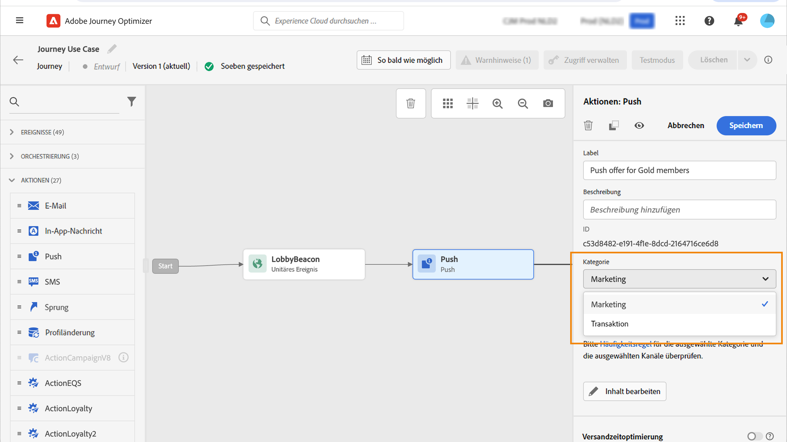

# Geschäftsregeln {#business-rules}

>[!AVAILABILITY]
>
>Geschäftsregeln sind derzeit nur zur Auswahl von Benutzern als Beta-Version verfügbar.

[!DNL Journey Optimizer] Sie können steuern, wie oft Benutzer eine Nachricht erhalten, indem Sie kanalübergreifende Regeln festlegen, mit denen Profile, die zu oft angesprochen wurden, automatisch aus Nachrichten und Aktionen ausgeschlossen werden.

Eine Regel könnte beispielsweise sein, für eine Marke maximal vier Marketing-Nachrichten pro Monat an ihre Kunden zu senden. Hierfür können Sie eine Häufigkeitsregel verwenden, die die Anzahl der gesendeten Nachrichten über einen oder mehrere Kanäle während eines monatlichen Kalenderzeitraums begrenzt.

Durch die Erstellung verschiedener Regelsätze für eine verbesserte Granularität, [!DNL Journey Optimizer] ermöglicht Ihnen, die Frequenzlimitierung auf verschiedene Arten von Marketing-Kommunikationen anzuwenden. Sie können beispielsweise einen Regelsatz erstellen, um die Anzahl der **Werbenachrichten** an Ihre Kunden gesendet werden, und erstellen Sie einen weiteren Regelsatz, um die Anzahl der **Newsletter** an sie gesendet.

>[!NOTE]
>
>Geschäftsregeln unterscheiden sich von der Opt-out-Verwaltung, die es Benutzern ermöglicht, sich vom Erhalt von Nachrichten einer Marke abzumelden. [Weitere Informationen](../privacy/opt-out.md#opt-out-management)

## Auf Regelsätze zugreifen {#access-rule-sets}

Regelsätze sind im Abschnitt **[!UICONTROL Administration]** > **[!UICONTROL Geschäftsregeln (Beta)]** Menü. Alle Regeln werden aufgelistet, sortiert nach Erstellungsdatum.

Klicken Sie auf den Namen eines Regelsatzes, um dessen Inhalt anzuzeigen und zu bearbeiten. Alle in diesem Regelsatz enthaltenen Regeln werden aufgelistet.

Das Kontextmenü oben rechts ermöglicht Ihnen Folgendes:

* Name und Beschreibung des Regelsatzes bearbeiten
* Aktivieren Sie den Regelsatz - [Weitere Informationen](#activate-rule)
* Regelsatz löschen

Für jede Regel im Regelsatz muss die Variable **[!UICONTROL Mehr Aktionen]** -Schaltfläche ermöglicht Ihnen Folgendes:

* Regel bearbeiten
* Regel aktivieren [Weitere Informationen](#activate-rule)
* Regel löschen

<!--### Permissions{#permissions-frequency-rules}

To access, create, edit or delete message frequency rules, you must have the **[!UICONTROL Manage frequency rules]** permission. 

Users with the **[!UICONTROL View frequency rules]** permission are able to view rules, but not to modify or delete them.

Learn more about permissions in [this section](../administration/high-low-permissions.md).-->

## Regelsatz erstellen {#create-rule-set}

Gehen Sie wie folgt vor, um einen Regelsatz zu erstellen.

1. Zugriff auf **[!UICONTROL Regelsätze]** Liste und klicken Sie auf **[!UICONTROL Regelsatz erstellen]**.

   

1. Definieren Sie den Namen des Regelsatzes, fügen Sie bei Bedarf eine Beschreibung hinzu und klicken Sie auf **[!UICONTROL Speichern]**.

   

   >[!NOTE]
   >
   >Der Name des Regelsatzes muss eindeutig sein.

1. Jetzt können Sie [Regeln definieren](#create-new-rule) Sie diesem Regelsatz hinzufügen möchten, und [Aktivieren](#activate-rule) es.

   >[!NOTE]
   >
   >Stellen Sie sicher, dass alle Regeln, die Sie auf Ihre Nachrichten anwenden möchten, auch im Regelsatz aktiviert sind.

## Erstellen einer Regel {#create-new-rule}

>[!CONTEXTUALHELP]
>id="ajo_rule_sets_category"
>title="Wählen Sie die Kategorie der Nachrichtenregel aus"
>abstract="Bei Aktivierung und Anwendung auf eine Nachricht werden alle Häufigkeitsregeln, die der ausgewählten Kategorie entsprechen, automatisch auf diese Nachricht angewendet. Derzeit ist nur die Kategorie Marketing verfügbar."

>[!CONTEXTUALHELP]
>id="ajo_rule_sets_capping"
>title="Festlegen der Begrenzung für Ihre Regel"
>abstract="Geben Sie an, wie viele Nachrichten innerhalb des ausgewählten Zeitrahmens maximal an ein Kundenprofil gesendet werden sollen. Die Frequenzbegrenzung basiert auf dem ausgewählten Kalenderzeitraum und wird am Anfang des entsprechenden Zeitrahmens zurückgesetzt. "

>[!CONTEXTUALHELP]
>id="ajo_rule_sets_channel"
>title="Definieren der Kanäle, für die die Regel gilt"
>abstract="Wählen Sie mindestens einen Kanal aus. Die Begrenzung gilt als Gesamtanzahl für alle Kanäle."

Gehen Sie wie folgt vor, um einem Regelsatz eine Regel hinzuzufügen.

1. Klicken Sie im soeben erstellten Regelsatz auf **[!UICONTROL Regel hinzufügen]**.

   

1. Definieren Sie den Namen der Regel.

   >[!NOTE]
   >
   >Der Name des Regelsatzes muss eindeutig sein.

1. Wählen Sie die Kategorie der Nachrichtenregel aus.

   >[!NOTE]
   >
   >Derzeit ist nur die Kategorie **[!UICONTROL Marketing]** verfügbar.

1. Wählen Sie aus der Dropdown-Liste **[!UICONTROL Dauer]** einen Zeitrahmen aus, auf den die Begrenzung angewendet werden soll. [Weitere Informationen](#frequency-cap)

1. Legen Sie die Begrenzung für Ihre Regel fest, d. h. die maximale Anzahl von Nachrichten, die an ein einzelnes Benutzerprofil jeden Monat, jede Woche oder jeden Tag gesendet werden können - entsprechend Ihrer obigen Auswahl.

1. Wählen Sie den Kanal aus, den Sie für diese Regel verwenden möchten: **[!UICONTROL Email]**, **[!UICONTROL SMS]**, **[!UICONTROL Push-Benachrichtigung]** oder **[!UICONTROL Briefpost]**.

   

   >[!NOTE]
   >
   >Sie müssen mindestens einen Kanal auswählen, um die Regel erstellen zu können.

1. Wählen Sie mehrere Kanäle aus, wenn Sie für alle ausgewählten Kanäle gemeinsam eine Begrenzung festlegen möchten.

   Legen Sie beispielsweise die Begrenzung auf 5 fest und wählen Sie sowohl den E-Mail- als auch den SMS-Kanal aus. Wenn ein Profil im ausgewählten Zeitraum bereits drei Marketing-E-Mails und zwei Marketing-SMS erhalten hat, wird dieses Profil vom nächsten Versand einer Marketing-E-Mail oder von SMS ausgeschlossen.

1. Klicks **[!UICONTROL Speichern]** , um die Regelerstellung zu bestätigen. Ihre Nachricht wird zum Regelsatz hinzugefügt, wobei die Variable **[!UICONTROL Entwurf]** -Status.

   

1. Wiederholen Sie die obigen Schritte, um dem Regelsatz so viele Regeln wie nötig hinzuzufügen.

Jetzt müssen Sie jede Regel aktivieren, bevor sie auf alle Nachrichten angewendet werden kann. [Weitere Informationen](#activate-rule)

>[!NOTE]
>
>Stellen Sie sicher, dass auch der Regelsatz aktiviert ist, damit Sie ihn in Ihren Nachrichten auswählen können.

### Frequenzbegrenzung {#frequency-cap}

>[!CONTEXTUALHELP]
>id="ajo_rule_sets_duration"
>title="Wählen Sie die Kategorie der Nachrichtenregel aus"
>abstract="Bei Aktivierung und Anwendung auf eine Nachricht werden alle Häufigkeitsregeln, die der ausgewählten Kategorie entsprechen, automatisch auf diese Nachricht angewendet. Derzeit ist nur die Kategorie Marketing verfügbar."

Aus dem **[!UICONTROL Dauer]** Dropdownliste auswählen, ob die Begrenzung monatlich, wöchentlich oder täglich angewendet werden soll.

Die Häufigkeitsbegrenzung basiert auf dem ausgewählten Kalenderzeitraum. Sie wird am Anfang des entsprechenden Zeitrahmens zurückgesetzt.

Der Zähler läuft für jeden Zeitraum wie folgt ab:

* **[!UICONTROL Monatlich]**: Die Häufigkeitsbegrenzung ist bis zum letzten Tag des Monats um 23:59:59 UTC gültig. Beispielsweise beträgt die monatliche Gültigkeit für den 31.01. 23:59:59 UTC.

* **[!UICONTROL Wöchentlich]**: Die Häufigkeitsbegrenzung gilt bis Samstag 23:59:59 UTC der betreffenden Woche, da die Kalenderwoche am Sonntag beginnt. Das Ablaufdatum ist unabhängig von der Regelerstellung. Wenn die Regel beispielsweise am Donnerstag erstellt wird, gilt diese Regel bis Samstag um 23 Uhr:59:59.

* **[!UICONTROL Täglich]**: Die tägliche Frequenzlimitierung gilt für den Tag bis 23:59:59 UTC und wird zu Beginn des nächsten Tages auf 0 zurückgesetzt.

### Tägliche Frequenzbegrenzung {#daily-frequency-cap}

>[!CAUTION]
>
>Um die Genauigkeit der Regeln für die tägliche Frequenzbegrenzung sicherzustellen, sollte [Streaming-Segmentierung](https://experienceleague.adobe.com/docs/experience-platform/segmentation/ui/streaming-segmentation.html?lang=de){target="_blank"} ist zwingend erforderlich. Weitere Informationen über Methoden zur Zielgruppenauswertung finden Sie in [diesem Abschnitt](../audience/about-audiences.md#evaluation-method-in-journey-optimizer).

Für jede Segmentgröße bis zu einer Obergrenze von 60 Millionen Nachrichten pro Stunde<!--not clear-->müssen Sie sicherstellen, dass Ihre Kampagnen mindestens zwei Stunden voneinander entfernt sind.

<!-- Journey example:

* If customer sets a Daily rule under the Global Ruleset for email <= 2/day:
   * Journey 123 (scheduled for noon)
   * Journey 456 (scheduled for noon)
   * Journey 789 (scheduled for 1 pm)

   In this example, the Daily Frequency cap will not guarantee <= 2/day. The rule will only be guaranteed when Journeys are at least 2 hours apart:
   * Journey 123 (scheduled for noon)
   * Journey 456 (scheduled for 2 pm)
   * Journey 789 (scheduled for 4 pm)-->

Wenn Sie beispielsweise eine tägliche Regel unter einem Regelsatz für den E-Mail-Kanal festlegen, der kleiner oder gleich 2 Tagen ist, und die folgenden Kampagnen erstellen:
* Kampagne A (für Mittag geplant)
* Kampagne A (für 15 Uhr geplant)
* Kampagne B (für 13 Uhr geplant)

Diese Einrichtung funktioniert aus zwei Gründen nicht:
* Die tägliche Frequenzbegrenzung ist nicht garantiert, da die Kampagnen nicht im Abstand von 2 Stunden liegen.
* Es ist nicht empfehlenswert, dieselbe Kampagne mehrmals am Tag zu planen, um die tägliche Obergrenze zu nutzen.

Das folgende Beispiel sollte durch die tägliche Frequenzlimitierung berücksichtigt werden:
* Kampagne A (für Mittag geplant)
* Kampagne B (für 14 Uhr geplant)

<!--* To use the Daily Cap with a Journey, customers can use either an Event Triggered Journey or an Audience Qualified Journey. If customers wish to use the Daily Cap with a Read Audience Journey, they should use a Campaign instead and associate a Local Ruleset with the campaign, following the example given above.-->

## Aktivieren von Regeln und Regelsätzen {#activate-rule}

Bei der Erstellung verfügt eine Regel über die **[!UICONTROL Entwurf]** -Status und hat noch keine Auswirkungen auf eine Nachricht. Um sie zu aktivieren, klicken Sie auf das **[!UICONTROL Mehr Aktionen]** neben der Regel und wählen Sie **[!UICONTROL Aktivieren]**.

Sie müssen auch den Regelsatz aktivieren, um in Kampagnen/Journey darauf zugreifen und ihn auf Ihre Nachrichten anwenden zu können.

Die Aktivierung eines Regelsatzes wirkt sich auf alle Nachrichten aus, für die er gilt, auf die nächste Ausführung aus. Erfahren Sie, wie [Regelsatz auf eine Nachricht anwenden](#apply-rule-set).

>[!NOTE]
>
>Es kann bis zu 10 Minuten dauern, bis eine Regel oder ein Regelsatz vollständig aktiviert ist. Sie müssen keine Nachrichten ändern oder Journeys erneut veröffentlichen, damit eine Regel wirksam wird.

<!--Currently, once a rule set is activated, no more rules can be added to that rule set.-->

## Deaktivieren von Regeln und Regelsätzen {#deactivate-rule}

Um eine Regel oder einen Regelsatz zu deaktivieren, klicken Sie auf die Schaltfläche **[!UICONTROL Mehr Aktionen]** neben dem gewünschten Element klicken und **[!UICONTROL Deaktivieren]**.

Ihr Status ändert sich in **[!UICONTROL Inaaktiv]** und die Regel gilt nicht für zukünftige Nachrichtenausführungen. Alle aktuell ausgeführten Nachrichten sind davon nicht betroffen.

>[!NOTE]
>
>Die Deaktivierung einer Regel oder eines Regelsatzes wirkt sich nicht auf die Zählung einzelner Profile aus oder setzt sie zurück.

## Anwenden einer Häufigkeitsregel auf eine Nachricht {#apply-frequency-rule}

Gehen Sie wie folgt vor, um eine Häufigkeitsregel auf eine Nachricht anzuwenden.

1. Beim Erstellen einer [Kampagne](../campaigns/create-campaign.md)wählen Sie einen der Kanäle aus, die Sie für Ihren Regelsatz definiert haben, und bearbeiten Sie den Inhalt Ihrer Nachricht.

1. Klicken Sie im Bildschirm &quot;Inhaltsbearbeitung&quot;auf die **[!UICONTROL Geschäftsregel hinzufügen]** Schaltfläche.

1. Wählen Sie die [von Ihnen erstellter Regelsatz](#create-rule-set).

   

   >[!NOTE]
   >
   >Nur [enabled](#activate-rule) Regelsätze in der Liste angezeigt.

   <!--Messages where the category selected is **[!UICONTROL Transactional]** will not be evaluated against business rules.-->

1. Die Anzahl der vom Versand ausgeschlossenen Profile können Sie im [globalen Bericht](../reports/global-report.md) und im [Live-Bericht](../reports/live-report.md) ansehen, wo die Häufigkeitsregeln als möglicher Grund für den Ausschluss von Benutzenden vom Versand angegeben sind.

>[!NOTE]
>
>Für denselben Kanal können mehrere Regeln angewendet werden, aber sobald die untere Begrenzung erreicht ist, wird das Profil von den nächsten Sendungen ausgeschlossen.

<!--
## Example: combine several rules {#frequency-rule-example}

You can combine several message frequency rules, such as described in the example below.

1. [Create a rule](#create-new-rule) called *Overall Marketing Capping*:

   * Select all channels.
   * Set capping to 12 monthly.

   

1. To further restrict the number of marketing-based push notifications that a user is sent, create a second rule called *Push Marketing Cap*:

   * Select Push channel.
   * Set capping to 4 monthly.

   

1. Save and [activate](#activate-rule) the rule.

1. [Create a message](../building-journeys/journeys-message.md) for every channel you want to communicate through and select the **[!UICONTROL Marketing]** category for each message. [Learn how to apply a frequency rule](#apply-frequency-rule)

   

In this scenario, an individual profile:
* can receive up to 12 marketing messages per month;
* but will be excluded from marketing push notifications after they have received 4 push notifications.-->

Beim Testen von Frequenzregeln wird empfohlen, eine neu erstellte [Testprofil](../audience/creating-test-profiles.md), da es nach Erreichen der Frequenzgrenze eines Profils nicht mehr möglich ist, den Zähler auf den nächsten Zeitraum zurückzusetzen. Wenn Sie eine Regel deaktivieren, können Profile, für die die Begrenzung gilt, zwar Nachrichten empfangen, es werden aber keine Zählerschritte entfernt oder gelöscht.

