# Einrichten von Kanaloberflächen {#set-up-channel-surfaces}

>[!CONTEXTUALHELP]
>id="ajo_admin_channel_surfaces"
>title="Oberfläche"
>abstract="Eine Oberfläche ist eine Konfiguration, die durch einen Systemadministrator definiert worden ist. Sie enthält alle technischen Parameter zum Senden der Nachricht, wie z. B. Kopfzeilenparameter, Subdomain, Mobile Apps usw."

Mit [!DNL Journey Optimizer] können Sie Kanaloberflächen (z. B. Nachrichtenvoreinstellungen) einrichten, die alle für Ihre Nachrichten erforderlichen technischen Parameter definieren: E-Mail-Typ, Absender-E-Mail und -Name, Mobile Apps, SMS-Konfiguration und mehr.

>[!CAUTION]
>
> * Um Kanaloberflächen zu erstellen, zu bearbeiten und zu löschen, benötigen Sie die Berechtigung zur [Verwaltung von Kanaloberflächen](../administration/high-low-permissions.md#manage-channel-surface).
>
> * Bevor Sie Kanaloberflächen erstellen können, müssen Sie die Schritte zur Konfiguration von [E-Mails](../email/get-started-email-config.md), [Push-Benachrichtigungen](../push/push-configuration.md) und [SMS](../sms/sms-configuration.md) ausführen.

Sobald die Kanaloberflächen konfiguriert wurden, können Sie sie beim Erstellen von Nachrichten in einer Journey oder einer Kampagne auswählen.

<!--
➡️ [Learn how to create and use email surfaces in this video](#video-presets)
-->

## Erstellen einer Kanaloberfläche {#create-channel-surface}

>[!CONTEXTUALHELP]
>id="ajo_admin_message_presets_header"
>title="Kanaloberflächeneinstellungen"
>abstract="Wählen Sie beim Einrichten einer Kanaloberfläche den entsprechenden Kanal aus und definieren Sie alle technischen Parameter, die für Ihren Versand erforderlich sind, beispielsweise E-Mail-Typ, Absendername, Mobile Apps, SMS-Konfiguration und mehr."

>[!CONTEXTUALHELP]
>id="ajo_admin_message_presets"
>title="Kanaloberflächeneinstellungen"
>abstract="Um Aktionen wie E-Mails aus einer Journey oder einer Kampagne erstellen zu können, müssen Sie zunächst eine Kanaloberfläche erstellen, die alle für Ihre Nachrichten erforderlichen technischen Parameter definiert. Sie müssen über die Berechtigung zum Verwalten der Kanaloberfläche verfügen, um Kanaloberflächen zu erstellen, zu bearbeiten und zu löschen."

Gehen Sie wie folgt vor, um eine Kanaloberfläche zu erstellen:

1. Rufen Sie das Menü **[!UICONTROL Kanäle]** > **[!UICONTROL Branding]** > **[!UICONTROL Kanaloberflächen]** auf, und klicken Sie dann auf **[!UICONTROL Kanaloberfläche erstellen]**.

   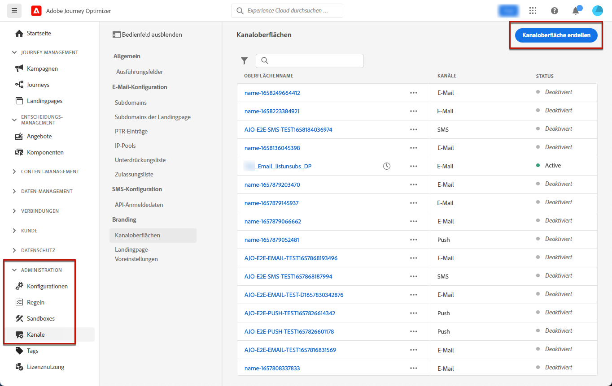

1. Geben Sie einen Namen und eine Beschreibung (optional) für die Oberfläche ein und wählen Sie dann die zu konfigurierenden Kanäle aus.

   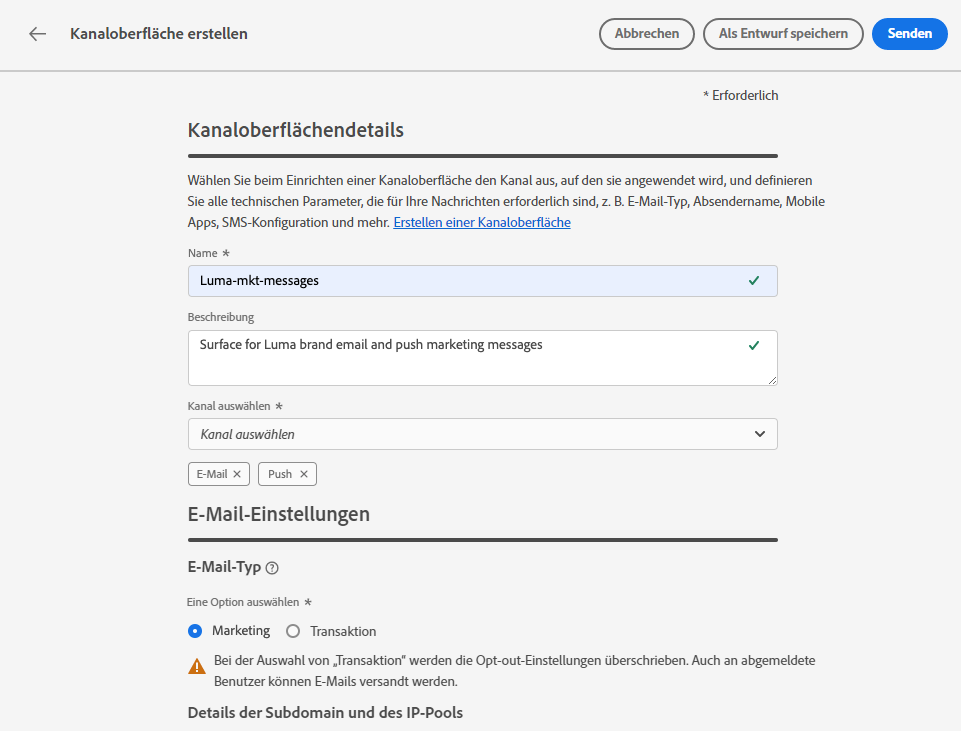

   >[!NOTE]
   >
   > Namen müssen mit einem Buchstaben (A–Z) beginnen. Ein Name darf nur alphanumerische Zeichen enthalten. Sie können auch die Zeichen Unterstrich `_`, Punkt `.` und Bindestrich `-` verwenden.

1. Wenn Sie den **[!UICONTROL E-Mail]**-Kanal ausgewählt haben, konfigurieren Sie Ihre Einstellungen wie in [diesem Abschnitt](../email/email-settings.md) beschrieben.

   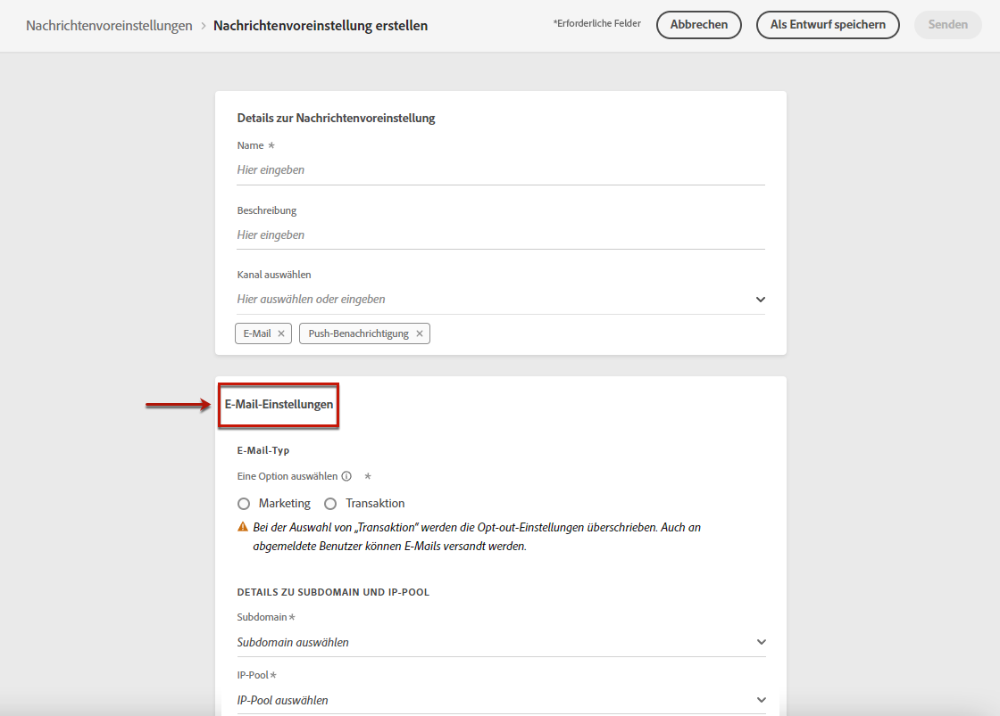

1. Wählen Sie für den Kanal **[!UICONTROL Push-Benachrichtigung]** mindestens eine Plattform – **iOS** und/oder **Android** – und die Mobile Apps aus, die für jede Plattform verwendet werden sollen.

   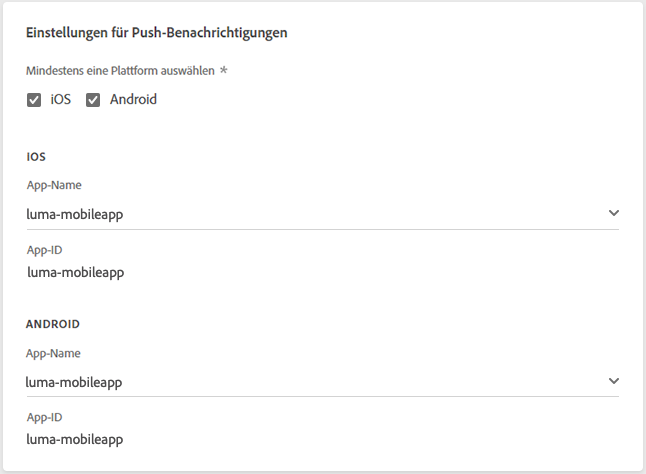

   >[!NOTE]
   >
   >Weiterführende Informationen zur Konfiguration Ihrer Umgebung für den Versand von Push-Benachrichtigungen finden Sie in [diesem Abschnitt](../push/push-gs.md).

1. Definieren Sie Ihre Einstellungen für den **[!UICONTROL SMS]**-Kanal wie in [diesem Abschnitt](../sms/sms-configuration.md#message-preset-sms) beschrieben.

   

   >[!NOTE]
   >
   >Weiterführende Informationen zur Konfiguration Ihrer Umgebung für den Versand von SMS-Nachrichten finden Sie in [diesem Abschnitt](../sms/sms-configuration.md).

1. Nachdem alle Parameter konfiguriert wurden, klicken Sie zur Bestätigung auf **[!UICONTROL Senden]**. Sie können die Kanaloberfläche auch als Entwurf speichern und ihre Konfiguration später fortsetzen.

   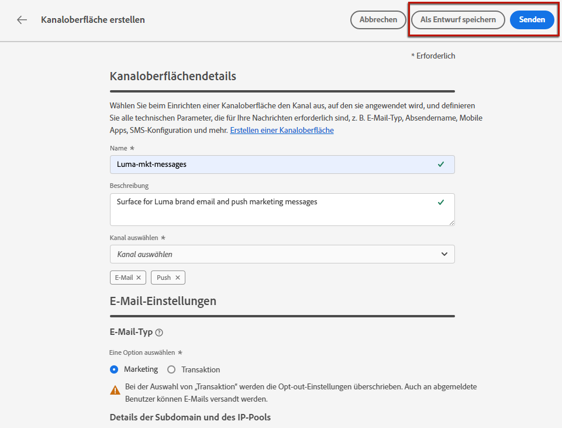

   >[!NOTE]
   >
   >Sie können nicht mit der Erstellung der Oberfläche fortfahren, während sich der ausgewählte IP-Pool [in Bearbeitung](ip-pools.md#edit-ip-pool) befindet (Status **[!UICONTROL Verarbeitung läuft]**) und noch nie mit der ausgewählten Subdomain verknüpft wurde. [Weitere Informationen](#subdomains-and-ip-pools)
   >
   >Speichern Sie die Oberfläche als Entwurf und warten Sie, bis der IP-Pool den Status **[!UICONTROL Erfolgreich abgeschlossen]** erreicht hat, um mit der Erstellung der Oberfläche fortzufahren.

1. Nachdem die Kanaloberfläche erstellt wurde, wird sie in der Liste mit dem Status **[!UICONTROL Verarbeitung läuft]** angezeigt.

   Während dieses Schritts werden mehrere Prüfungen durchgeführt, um zu verifizieren, dass die Konfiguration korrekt ist. <!--The processing time is around **48h-72h**, and can take up to **7-10 business days**.-->

   >[!NOTE]
   >Beim Erstellen der ersten E-Mail-Oberfläche für eine bestimmte Subdomain kann die Verarbeitungszeit **10 Minuten bis 10 Tage** betragen. Wenn die ausgewählte Subdomain bereits auf einer anderen E-Mail-Oberfläche verwendet wird, dauert dies nur höchstens 3 Stunden.

   Zu diesen Prüfungen gehören Konfigurations- und technische Tests, die vom Adobe-Team durchgeführt werden:

   * SPF-Validierung
   * DKIM-Validierung
   * MX-Eintragsvalidierung
   * Überprüfung der Blockierungsliste der IPs
   * Helo-Host-Prüfung
   * IP-Pool-Verifizierung
   * A/PTR-Eintrag, Subdomain-Verifizierung t/m/res
   * FBL-Registrierung (diese Prüfung wird nur bei der ersten Erstellung einer E-Mail-Oberfläche für eine bestimmte Subdomain durchgeführt)

   >[!NOTE]
   >
   >In [diesem Abschnitt](#monitor-channel-surfaces) erfahren Sie mehr über die möglichen Fehlerursachen, wenn die Prüfungen nicht erfolgreich sind.

1. Sobald die Prüfungen erfolgreich abgeschlossen sind, erhält die Kanaloberfläche den Status **[!UICONTROL Aktiv]**. Sie kann nun zum Versand von Nachrichten verwendet werden.

   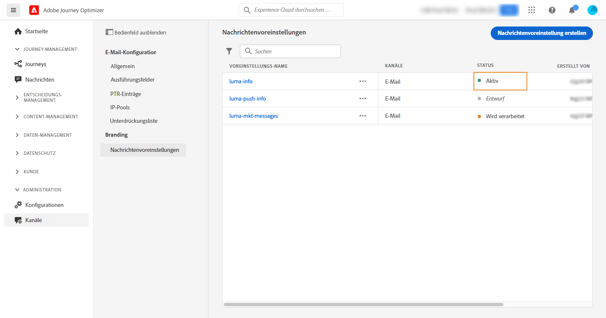

## Überwachen von Kanaloberflächen {#monitor-channel-surfaces}

Alle Kanaloberflächen werden im Menü **[!UICONTROL Kanäle]** > **[!UICONTROL Kanaloberflächen]** angezeigt. Es stehen Filter zur Verfügung, mit denen Sie die Liste durchsuchen können (Kanaltyp, Benutzer, Status).

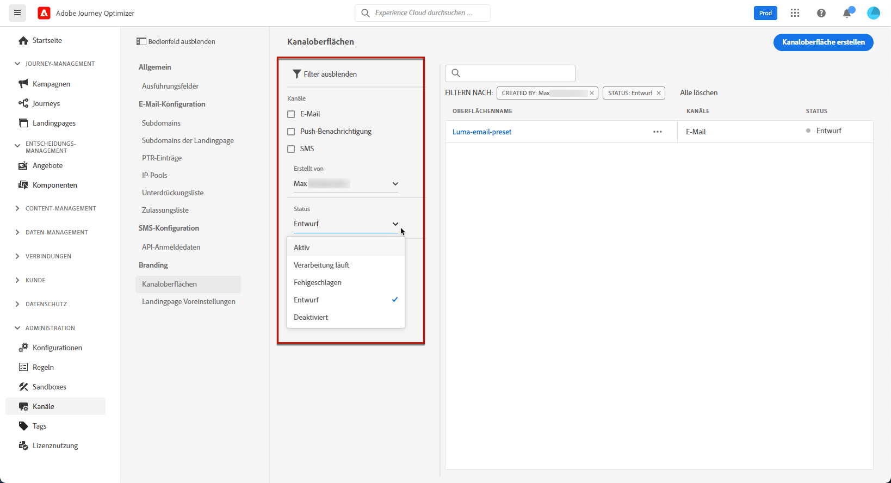

Nach ihrer Erstellung können Kanaloberflächen die folgenden Status aufweisen:

* **[!UICONTROL Entwurf]**: Die Kanaloberfläche wurde als Entwurf gespeichert und noch nicht gesendet. Öffnen Sie sie, um die Konfiguration fortzusetzen.
* **[!UICONTROL Verarbeitung läuft]**: Die Kanaloberfläche wurde übermittelt und durchläuft mehrere Überprüfungsschritte.
* **[!UICONTROL Aktiv]**: Die Kanaloberfläche wurde verifiziert und kann zum Erstellen von Nachrichten ausgewählt werden.
* **[!UICONTROL Fehlgeschlagen]**: Eine oder mehrere Prüfungen sind bei der Verifizierung der Kanaloberfläche fehlgeschlagen.
* **[!UICONTROL Deaktiviert]**: Die Kanaloberfläche ist deaktiviert. Sie kann nicht zum Erstellen neuer Nachrichten verwendet werden.

Im Folgenden finden Sie Details zu möglichen Fehlerursachen, falls die Erstellung einer Kanaloberfläche fehlschlägt.

Wenn einer dieser Fehler auftritt, wenden Sie sich an die [Adobe-Kundenunterstützung](https://helpx.adobe.com/de/enterprise/admin-guide.html/enterprise/using/support-for-experience-cloud.ug.html){target="_blank"}, um Hilfe zu erhalten.

* **SPF-Validierung fehlgeschlagen**: SPF (Sender Policy Framework) ist ein E-Mail-Authentifizierungsprotokoll, mit dem autorisierte IPs angegeben werden können, die E-Mails von einer bestimmten Subdomain senden können. Ein SPF-Validierungsfehler bedeutet, dass die IP-Adressen im SPF-Datensatz nicht mit den IP-Adressen übereinstimmen, die zum Senden von E-Mails an die E-Mail-Anbieter verwendet werden.

* **DKIM-Validierung fehlgeschlagen**: Mit DKIM (DomainKeys Identified Mail) kann der Empfänger-Server überprüfen, ob die empfangene Nachricht vom echten Absender der zugehörigen Domain gesendet wurde, und sicherstellen, dass der Inhalt der ursprünglichen Nachricht nicht auf dem Weg verändert wurde. Ein DKIM-Validierungsfehler bedeutet, dass die Empfangs-Mail-Server die Authentizität des Nachrichteninhalts und dessen Zuordnung zur Versand-Domain nicht überprüfen können.:

* **MX-Eintragsvalidierung fehlgeschlagen**: Ein MX-Eintragsvalidierungsfehler (Mail eXchange) bedeutet, dass die E-Mail-Server, die für die Annahme eingehender E-Mails für eine bestimmte Subdomain verantwortlich sind, nicht korrekt konfiguriert sind.

* **Zustellbarkeitskonfigurationen fehlgeschlagen**: Zustellbarkeitskonfigurationsfehler können aus einem der folgenden Gründe auftreten:
   * Blockierungsauflistung der zugewiesenen IPs
   * Ungültiger `helo`-Name
   * E-Mails, die von anderen IPs als den im IP-Pool der entsprechenden Oberfläche angegebenen gesendet werden
   * E-Mails können nicht an die Postfächer von wichtigen ISPs zugestellt werden

## Bearbeiten einer Kanaloberfläche {#edit-channel-surface}

Gehen Sie wie folgt vor, um eine Kanaloberfläche zu bearbeiten.

>[!NOTE]
>
>Die **[!UICONTROL Einstellungen für Push-Benachrichtigungen]** können Sie nicht bearbeiten. Wenn eine Kanaloberfläche nur für den Kanal „Push-Benachrichtigung“ konfiguriert ist, kann sie nicht bearbeitet werden.

1. Klicken Sie in der Liste auf den Namen einer Kanaloberfläche, um sie zu öffnen.

   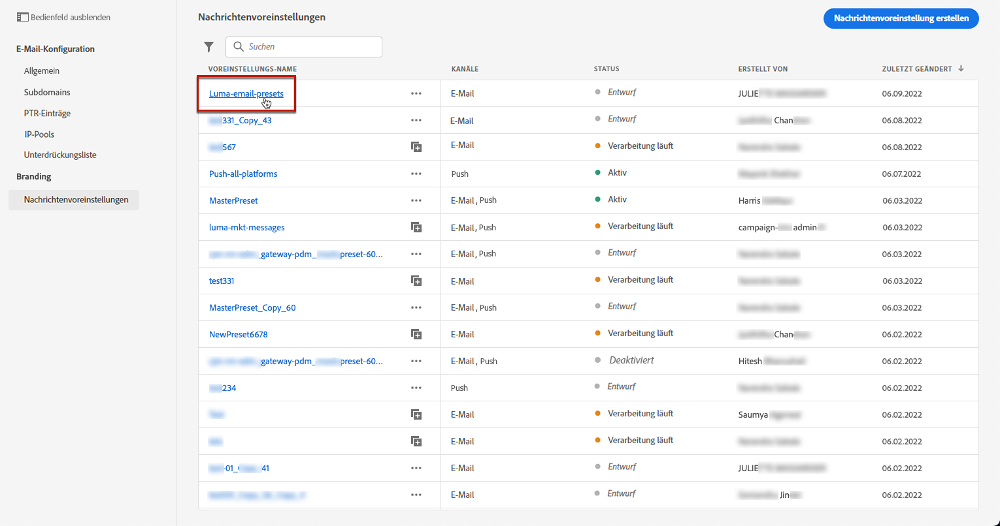

1. Bearbeiten Sie die Eigenschaften nach Bedarf.

   >[!NOTE]
   >
   >Wenn eine Kanaloberfläche den Status **[!UICONTROL Aktiv]** hat, sind die Felder **[!UICONTROL Name]**, **[!UICONTROL Kanal auswählen]** und **[!UICONTROL Subdomain]** grau dargestellt und können nicht bearbeitet werden.

1. Klicken Sie auf **[!UICONTROL Senden]**, um Ihre Änderungen zu bestätigen.

   >[!NOTE]
   >
   >Sie können die Kanaloberfläche auch als Entwurf speichern und die Aktualisierung später fortsetzen.

Sobald die Änderungen übermittelt wurden, durchläuft die Kanaloberfläche einen ähnlichen Validierungszyklus wie beim [Erstellen einer Kanaloberfläche](#create-channel-surface). Die Verarbeitungszeit nach dem Bearbeiten kann bis zu **3 Stunden** dauern.

>[!NOTE]
>
>Wenn Sie nur die Felder **[!UICONTROL Beschreibung]**, **[!UICONTROL E-Mail-Typ]** und/oder **[!UICONTROL E-Mail-Wiederholungsparameter]** bearbeiten, wird die Aktualisierung sofort wirksam.

### Details zur Aktualisierung {#update-details}

Hat eine Kanaloberfläche den Status **[!UICONTROL Aktiv]**, können Sie die Details der Aktualisierung überprüfen. Gehen Sie dazu wie folgt vor:

Klicken Sie auf das Symbol **[!UICONTROL Letzte Aktualisierung]**, das neben dem Namen der aktiven Oberfläche angezeigt wird.

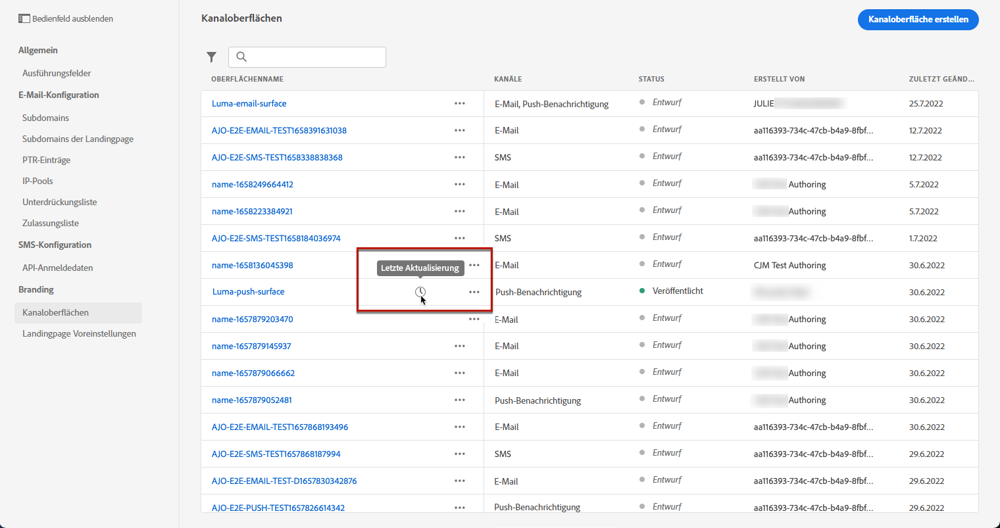

<!--You can also access the update details from an active channel surface while update is in progress.-->

Auf dem Bildschirm **[!UICONTROL Letzte Aktualisierung]** können Sie Informationen wie den Aktualisierungsstatus und die Liste der angeforderten Änderungen sehen.

<!--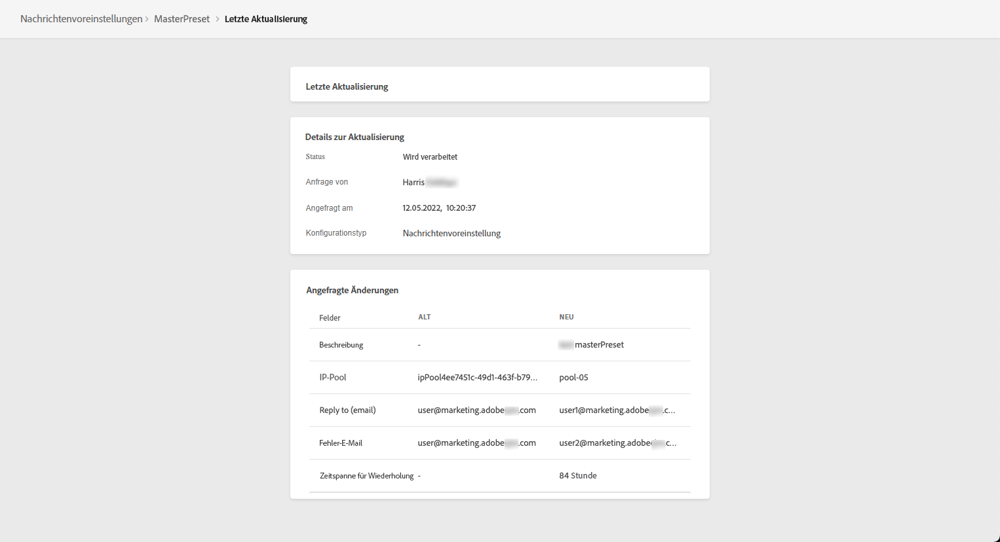-->

### Aktualisieren des Status {#update-statuses}

Eine Aktualisierung einer Kanaloberfläche kann die folgenden Status aufweisen:

* **[!UICONTROL Verarbeitung läuft]**: Die Aktualisierung der Kanaloberfläche wurde übermittelt und durchläuft mehrere Überprüfungsschritte.
* **[!UICONTROL Aktiv]**: Die aktualisierte Kanaloberfläche wurde verifiziert und kann zum Erstellen von Nachrichten ausgewählt werden.
* **[!UICONTROL Fehlgeschlagen]**: Eine oder mehrere Prüfungen sind bei der Verifizierung der Kanaloberflächenaktualisierung fehlgeschlagen.

Jeder Status wird nachfolgend beschrieben.

#### In Bearbeitung {#surface-processing}

Es werden verschiedene Zustellbarkeitsprüfungen durchgeführt, um sicherzustellen, dass die Kanaloberfläche ordnungsgemäß aktualisiert wurde.

>[!NOTE]
>
>Wenn Sie nur die Felder **[!UICONTROL Beschreibung]**, **[!UICONTROL E-Mail-Typ]** und/oder **[!UICONTROL E-Mail-Wiederholungsparameter]** bearbeiten, wird die Aktualisierung sofort wirksam.

Die Verarbeitungszeit kann bis **3 Stunden** dauern. Weitere Informationen zu den während des Validierungszyklus durchgeführten Prüfungen finden Sie in [diesem Abschnitt](#create-channel-surface).

Wenn Sie eine bereits aktive Oberfläche bearbeiten:

* Ihr Status **[!UICONTROL Aktiv]** bleibt erhalten, während der Validierungsprozess ausgeführt wird.

* Das Symbol **[!UICONTROL Letzte Aktualisierung]** wird neben dem Namen der Oberfläche in der Liste der Kanaloberflächen angezeigt.

* Während des Validierungsprozesses verwenden die mit dieser Oberfläche konfigurierten Nachrichten weiterhin die ältere Version der Oberfläche.

>[!NOTE]
>
>Sie können eine Kanaloberfläche während des Aktualisierungsprozesses nicht ändern. Sie können zwar weiterhin auf den Namen klicken, aber alle Felder sind ausgegraut. Die Änderungen werden erst dann übernommen, wenn die Aktualisierung erfolgreich war.

#### Erfolgreich {#success}

Nach erfolgreicher Überprüfung wird die neue Version der Oberfläche automatisch in allen Nachrichten verwendet, die diese Oberfläche verwenden. Sie müssen jedoch möglicherweise warten:
* einige Minuten, bevor sie von den unitären Nachrichten genutzt wird,
* bis zum nächsten Batch, damit die Oberfläche in Batch-Nachrichten wirksam wird.

#### Fehlgeschlagen {#failed}

Wenn der Validierungsprozess fehlschlägt, wird weiterhin die ältere Version der Oberfläche verwendet.

Weitere Informationen zu möglichen Fehlerursachen finden Sie in [diesem Abschnitt](#monitor-channel-surfaces).

Wenn die Aktualisierung fehlschlägt, kann die Oberfläche erneut bearbeitet werden. Sie können auf den Namen klicken und die Einstellungen aktualisieren, die korrigiert werden müssen.

## Deaktivieren einer Kanaloberfläche {#deactivate-a-surface}

Wenn Sie möchten, dass eine **[!UICONTROL aktive]** Kanaloberfläche nicht verfügbar ist, um neue Nachrichten zu erstellen, können Sie sie deaktivieren. Nachrichten von Journeys, die diese Oberfläche verwenden, sind jedoch nicht betroffen und funktionieren weiterhin.

>[!NOTE]
>
>Sie können eine Kanaloberfläche nicht deaktivieren, während eine Aktualisierung im Gange ist. Sie müssen warten, bis die Aktualisierung entweder erfolgreich war oder fehlgeschlagen ist. Weitere Informationen finden Sie unter [Bearbeiten von Kanaloberflächen](#edit-channel-surface) und [Aktualisierungsstatus](#update-statuses).

1. Rufen Sie die Liste der Kanaloberflächen auf.

1. Klicken Sie für die aktive Oberfläche Ihrer Wahl auf die Schaltfläche **[!UICONTROL Weitere Aktionen]**.

1. Wählen Sie **[!UICONTROL Deaktivieren]** aus.

   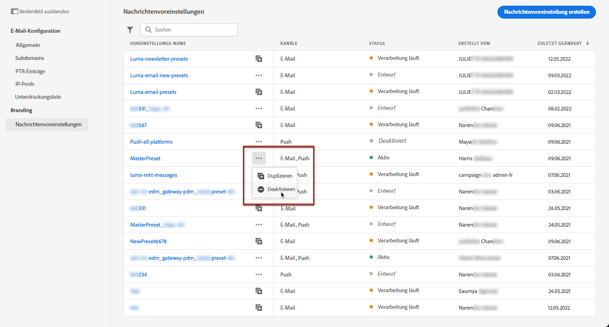

>[!NOTE]
>
>Deaktivierte Kanaloberflächen können nicht gelöscht werden, um Probleme in Journeys zu vermeiden, die diese Oberflächen zum Senden von Nachrichten verwenden.

Eine deaktivierte Kanaloberfläche kann nicht direkt bearbeitet werden. Sie können sie jedoch duplizieren und die Kopie bearbeiten, um eine neue Version zu entwerfen, mit der Sie neue Nachrichten erstellen können. Sie können sie auch erneut aktivieren und warten, bis die Aktualisierung erfolgreich abgeschlossen wird, bevor Sie sie bearbeiten.

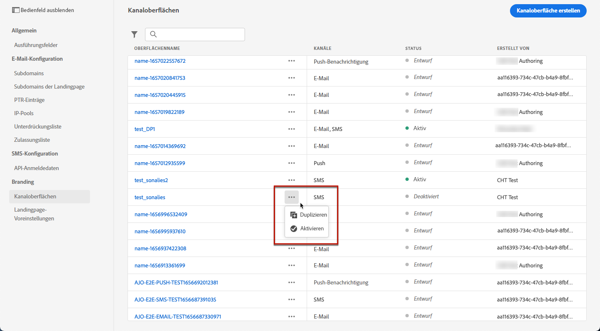

<!--
## How-to video{#video-presets}

Learn how to create channel surfaces, how to use them and how to delegate a subdomain and create an IP pool.

>[!VIDEO](https://video.tv.adobe.com/v/334343?quality=12)
-->
