# Einrichten von Kanalkonfigurationen {#set-up-channel-surfaces}

>[!CONTEXTUALHELP]
>id="ajo_admin_channel_surfaces"
>title="Kanalkonfiguration"
>abstract="Eine Kanalkonfiguration ist eine Konfiguration, die von einem Systemadministrator definiert wurde. Es enthält alle technischen Parameter zum Senden der Nachricht, wie Kopfzeilenparameter, Subdomain, Mobile Apps usw."

>[!CONTEXTUALHELP]
>id="ajo_admin_marketing_action"
>title="Marketing-Aktion"
>abstract="Wählen Sie mithilfe dieser Einrichtung die Marketing-Aktionen aus, um die Einverständnisrichtlinien mit den Nachrichten zu verknüpfen. Alle mit der Marketing-Aktion verbundenen Einverständniserklärungen werden verwendet, um die Voreinstellungen Ihrer Kunden zu berücksichtigen."

Mit [!DNL Journey Optimizer] können Sie Kanalkonfigurationen (z. B. Nachrichtenvoreinstellungen) einrichten, die alle für Ihre Nachrichten erforderlichen technischen Parameter definieren: E-Mail-Typ, Absender-E-Mail und -Name, Antwort- und Fehlerrouting, Mobile Apps, SMS-Konfiguration und mehr.

>[!CAUTION]
>
> * Um Kanalkonfigurationen zu erstellen, zu bearbeiten und zu löschen, benötigen Sie die Berechtigung [Nachrichtenvoreinstellungen verwalten](../administration/high-low-permissions.md#administration-permissions).
>
> * Sie müssen die Schritte [E](../email/get-started-email-config.md)Mail-Konfiguration[ Push-](../push/push-configuration.md), [SMS-](../sms/sms-configuration.md), [In-App-Konfiguration](../in-app/inapp-configuration.md), [Code-basierte Konfiguration](../code-based/code-based-configuration.md), [Web-Konfiguration](../web/web-configuration.md) und [Briefpost-Konfiguration](../direct-mail/direct-mail-configuration.md) ausführen, bevor Sie Kanalkonfigurationen erstellen.

Sobald die Kanalkonfigurationen abgeschlossen sind, können Sie sie beim Erstellen von Nachrichten von einer Journey oder einer Kampagne auswählen.

Sie können die geführte Kanaleinrichtung auch verwenden, um die Kanaleinrichtung in einem einheitlichen Erlebnis zu automatisieren und zu validieren, wodurch der Prozess der ersten Schritte mit Journey Optimizer beschleunigt wird. [Weitere Informationen](set-mobile-config.md)

<!--
➡️ [Learn how to create and use email configurations in this video](#video-presets)
-->

## Erstellen einer Kanalkonfiguration {#create-channel-surface}

>[!CONTEXTUALHELP]
>id="ajo_admin_message_presets_header"
>title="Kanalkonfigurationseinstellungen"
>abstract="Wählen Sie beim Einrichten einer Kanalkonfiguration den entsprechenden Kanal aus und definieren Sie alle technischen Parameter, die für Ihren Versand erforderlich sind, z. B. E-Mail-Typ, Absendername, Mobile Apps, SMS-Konfiguration und mehr."

>[!CONTEXTUALHELP]
>id="ajo_admin_message_presets"
>title="Kanalkonfigurationseinstellungen"
>abstract="Um Aktionen wie E-Mails von einer Journey oder einer Kampagne erstellen zu können, müssen Sie zunächst eine Kanalkonfiguration erstellen, die alle für Ihre Nachrichten erforderlichen technischen Einstellungen definiert. Sie müssen über die Berechtigung Nachrichtenvoreinstellungen verwalten verfügen, um Kanalkonfigurationen zu erstellen, zu bearbeiten und zu löschen."

>[!CONTEXTUALHELP]
>id="ajo_surface_marketing_action"
>title="Marketing-Aktion auswählen"
>abstract="Wählen Sie eine Marketing-Aktion in der Konfiguration aus, um der Nachricht eine Einverständnisrichtlinie zuzuordnen."

Gehen Sie wie folgt vor, um eine Kanalkonfiguration zu erstellen:

1. Rufen Sie das Menü **[!UICONTROL Kanäle]** > **[!UICONTROL Allgemeine Einstellungen]** > **[!UICONTROL Kanalkonfigurationen]** auf und klicken Sie dann auf **[!UICONTROL Kanalkonfiguration erstellen]**.

   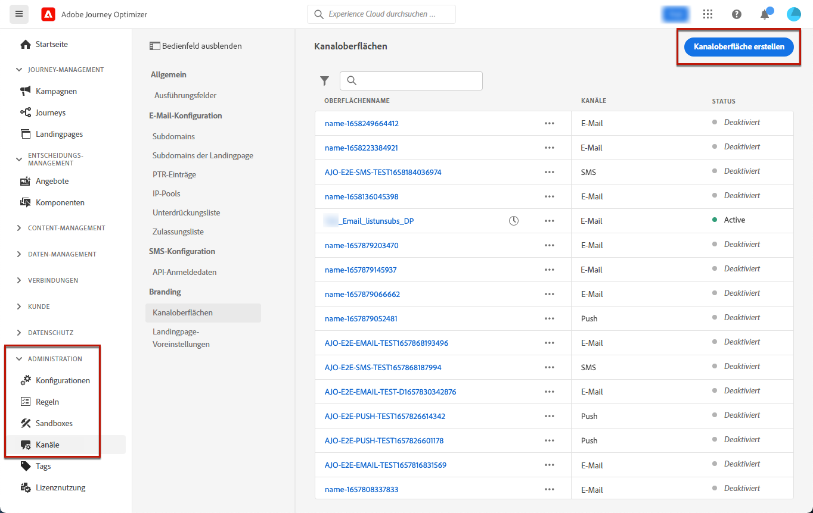

1. Geben Sie einen Namen und eine Beschreibung (optional) für die Konfiguration ein und wählen Sie dann den zu konfigurierenden Kanal aus.

   

   >[!NOTE]
   >
   > Namen müssen mit einem Buchstaben (A-Z) beginnen. Sie darf nur alphanumerische Zeichen enthalten. Sie können auch die `-` Unterstriche `_`, Punkte `.` Bindestriche verwenden.

1. Um der Konfiguration benutzerdefinierte oder Core-Datennutzungsbezeichnungen zuzuweisen, können Sie „Zugriff **[!UICONTROL &quot;]**. [Erfahren Sie mehr über die Zugriffssteuerung auf Objektebene (OLAC)](../administration/object-based-access.md).

1. Kanal auswählen.

1. Wählen Sie **[!UICONTROL Marketing]** Aktion(en) aus, um den Nachrichten mithilfe dieser Konfiguration Einverständnisrichtlinien zuzuordnen. Alle mit der Marketing-Aktion verknüpften Einverständnisrichtlinien werden genutzt, um die Voreinstellungen Ihrer Kundinnen und Kunden zu respektieren. [Weitere Informationen](../action/consent.md#surface-marketing-actions)

   >[!NOTE]
   >
   >Einverständnisrichtlinien sind derzeit nur für Organisationen verfügbar, die die Zusatzangebote **Healthcare Shield** und **Privacy and Security Shield** erworben haben.

   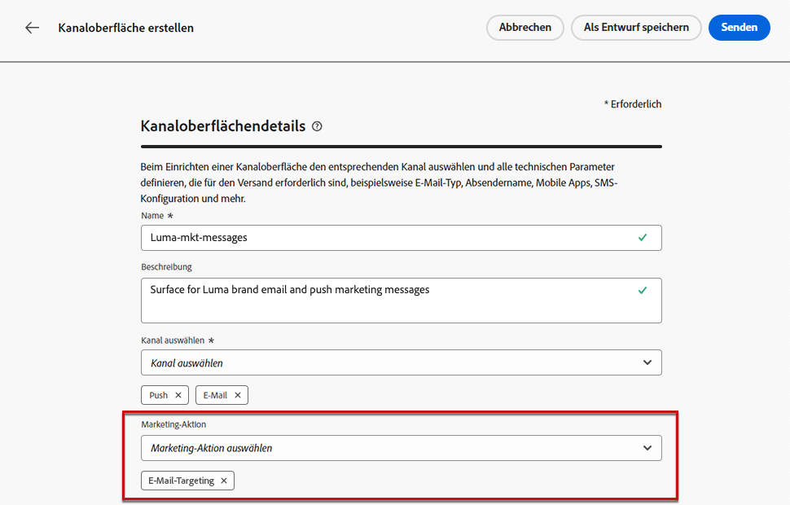

1. Nachdem alle Parameter konfiguriert wurden, klicken Sie zur Bestätigung **[!UICONTROL Senden]**. Sie können die Kanalkonfiguration auch als Entwurf speichern und zu einem späteren Zeitpunkt fortsetzen.

   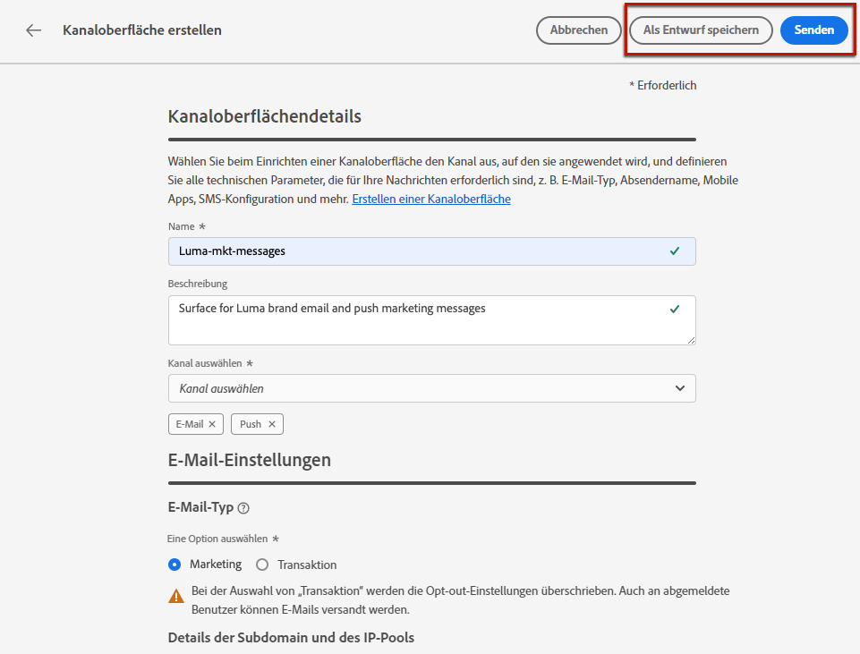

   >[!NOTE]
   >
   >Sie können nicht mit der Erstellung der E-Mail-Konfiguration fortfahren, während sich der ausgewählte IP[Pool in Bearbeitung ](ip-pools.md#edit-ip-pool) (**[!UICONTROL Verarbeitung]** Status) befindet und noch nie mit der ausgewählten Subdomain verknüpft wurde. [Weitere Informationen](#subdomains-and-ip-pools)
   >
   >Speichern Sie die Konfiguration als Entwurf und warten Sie, bis der IP-Pool den Status **[!UICONTROL Erfolg]** aufweist, um mit der Konfigurationserstellung fortzufahren.

1. Nachdem die Kanalkonfiguration erstellt wurde, wird sie in der Liste mit dem Status **[!UICONTROL Verarbeitung“]**.

   Während dieses Schritts werden mehrere Prüfungen durchgeführt, um sicherzustellen, dass er ordnungsgemäß konfiguriert wurde. <!--The processing time is around **48h-72h**, and can take up to **7-10 business days**.-->

   >[!NOTE]
   > Beim Erstellen einer E-Mail-Konfiguration für eine Subdomain variiert die Verarbeitungszeit wie unten beschrieben:
   >
   > * Bei **neuen Subdomains** kann der Prozess zum Erstellen der ersten Kanalkonfiguration (10 **. 10 Tage)**.
   > * Bei **Nicht-Produktions-Sandboxes** oder wenn die ausgewählte Subdomain **bereits** einer anderen genehmigten Kanalkonfiguration verwendet wird, dauert der Vorgang nur bis zu **3 Stunden**.

   Zu diesen Prüfungen gehören Konfigurations- und technische Tests, die vom Adobe-Team durchgeführt werden:

   * SPF-Validierung
   * DKIM-Validierung
   * MX-Eintragsvalidierung
   * IP-Blockierungsauflistung überprüfen
   * Hilfe-Host-Prüfung
   * IP-Pool-Überprüfung
   * A/PTR-Eintrag, Subdomain-Verifizierung t/m/res
   * FBL-Registrierung (diese Prüfung wird nur bei der ersten Erstellung einer E-Mail-Konfiguration für eine bestimmte Subdomain durchgeführt)

   >[!NOTE]
   >
   >Wenn die Prüfungen nicht erfolgreich sind, erfahren Sie in ([) mehr über die möglichen ](#monitor-channel-surfaces).

1. Sobald die Prüfungen erfolgreich abgeschlossen sind, erhält die Kanalkonfiguration den Status **[!UICONTROL Aktiv]**. Sie kann jetzt zum Versand von Nachrichten verwendet werden.

   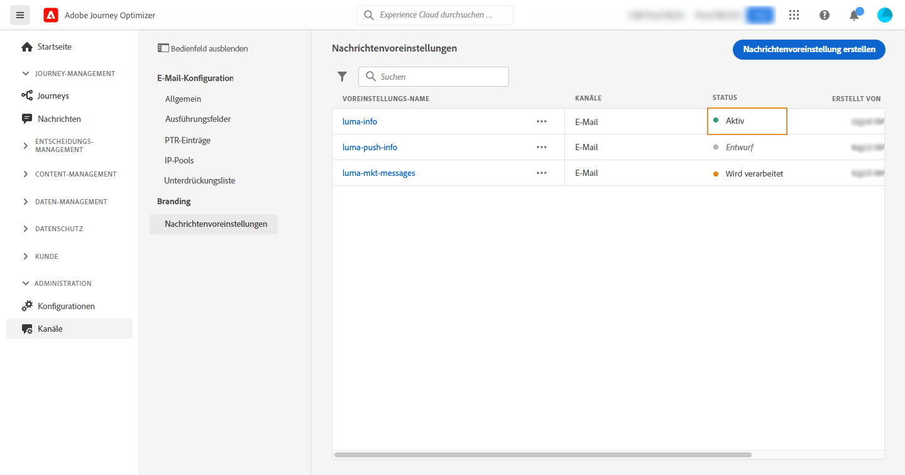

## Kanalkonfigurationen überwachen {#monitor-channel-surfaces}

Alle Ihre Kanalkonfigurationen werden im Menü **[!UICONTROL Kanäle]** > **[!UICONTROL Kanalkonfigurationen]** angezeigt. Es stehen Filter zur Verfügung, mit denen Sie die Liste durchsuchen können (Kanal, Benutzer, Status).

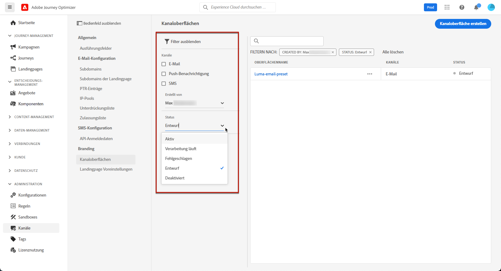

Nach der Erstellung können Kanalkonfigurationen die folgenden Status aufweisen:

* **[!UICONTROL Entwurf]**: Die Kanalkonfiguration wurde als Entwurf gespeichert und noch nicht gesendet. Öffnen Sie sie, um die Konfiguration fortzusetzen.
* **[!UICONTROL Verarbeitung läuft]**: Die Kanalkonfiguration wurde übermittelt und durchläuft mehrere Überprüfungsschritte.
* **[!UICONTROL Aktiv]**: Die Kanalkonfiguration wurde verifiziert und kann zum Erstellen von Nachrichten ausgewählt werden.
* **[!UICONTROL Fehlgeschlagen]**: Eine oder mehrere Prüfungen sind bei der Verifizierung der Kanalkonfiguration fehlgeschlagen.
* **[!UICONTROL Deaktiviert]**: Die Kanalkonfiguration ist deaktiviert. Sie kann nicht zum Erstellen neuer Nachrichten verwendet werden.

### Gründe für Kanalkonfigurationsfehler {#channel-config-failure}

Wenn die Erstellung einer Kanalkonfiguration fehlschlägt, werden im Folgenden die Details zu den einzelnen möglichen Fehlerursachen beschrieben.

Wenn einer dieser Fehler auftritt, wenden Sie sich an die [Adobe-Kundenunterstützung](https://helpx.adobe.com/enterprise/admin-guide.html/enterprise/using/support-for-experience-cloud.ug.html){target="_blank"}, um Hilfe zu erhalten.

* **SPF-Validierung fehlgeschlagen**: SPF (Sender Policy Framework) ist ein E-Mail-Authentifizierungsprotokoll, mit dem autorisierte IPs angegeben werden können, die E-Mails von einer bestimmten Subdomain senden können. Ein SPF-Validierungsfehler bedeutet, dass die IP-Adressen im SPF-Eintrag nicht mit den IP-Adressen übereinstimmen, die zum Senden von E-Mails an die Postfachanbieter verwendet werden.

* **DKIM-Validierung fehlgeschlagen**: Mit DKIM (DomainKeys Identified Mail) kann der Empfängerserver überprüfen, ob die empfangene Nachricht vom echten Absender der zugehörigen Domain gesendet wurde, und sicherstellen, dass der Inhalt der ursprünglichen Nachricht nicht auf dem Weg verändert wurde. Ein DKIM-Validierungsfehler bedeutet, dass die Empfangs-Mail-Server die Authentizität des Nachrichteninhalts und dessen Zuordnung zur Versand-Domain nicht überprüfen können.

* **MX-Eintragsvalidierung fehlgeschlagen**: Ein MX-Eintragsvalidierungsfehler (Mail eXchange) bedeutet, dass die E-Mail-Server, die für die Annahme eingehender E-Mails für eine bestimmte Subdomain verantwortlich sind, nicht korrekt konfiguriert sind.

* **Zustellbarkeitskonfigurationen fehlgeschlagen**: Zustellbarkeitskonfigurationsfehler können aus einem der folgenden Gründe auftreten:
   * Blockierungsauflistung der zugewiesenen IPs
   * Ungültiger `helo`
   * E-Mails, die von anderen IPs als den im IP-Pool der entsprechenden Konfiguration angegebenen gesendet werden
   * E-Mails können nicht an Posteingänge wichtiger ISPs zugestellt werden

## Bearbeiten einer Kanalkonfiguration {#edit-channel-surface}

Gehen Sie wie folgt vor, um eine Kanalkonfiguration zu bearbeiten.

>[!NOTE]
>
>Die Einstellungen für „Push **[!UICONTROL Benachrichtigungen“ können nicht bearbeitet]**. Wenn eine Kanalkonfiguration nur für den Kanal Push-Benachrichtigung konfiguriert ist, kann sie nicht bearbeitet werden.
>
>Beim Bearbeiten einer E-Mail-Konfiguration können Sie keine neuen [Profilattribute](../personalization/personalization-build-expressions.md#sources) zu Kopfzeilenparametern hinzufügen. Sie müssen eine [neue Kanalkonfiguration“ ](#create-channel-surface).

1. Klicken Sie in der Liste auf den Konfigurationsnamen eines Kanals, um ihn zu öffnen.

   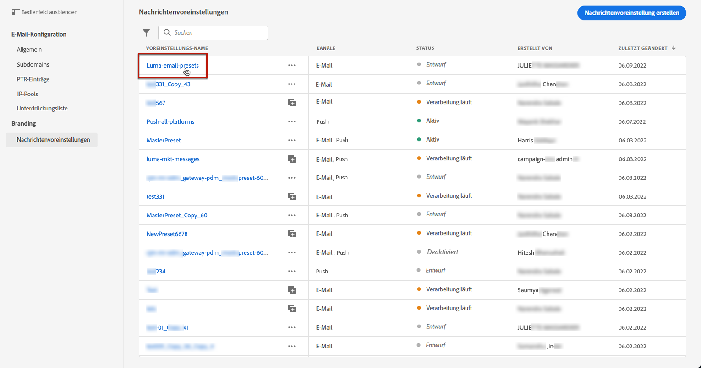

1. Bearbeiten Sie die Eigenschaften nach Bedarf.

   >[!NOTE]
   >
   >* Wenn die Konfiguration den Status **[!UICONTROL Aktiv]** hat, sind **[!UICONTROL Felder Name]**, **[!UICONTROL Kanal]** und **[!UICONTROL Subdomain]** schreibgeschützt und können nicht geändert werden.
   >* Sie können Ihre Änderungen jederzeit als Entwurf speichern und die Aktualisierung später fortsetzen.
   >* Änderungen, die auf die Felder **[!UICONTROL Beschreibung]**, **[!UICONTROL E-Mail-Typ]** und/oder **[!UICONTROL E-Mail-Wiederholungsparameter beschränkt sind]** werden sofort wirksam, ohne dass es zu einer Verarbeitungsverzögerung kommt.

1. Klicken Sie **[!UICONTROL Senden]**, um Ihre Änderungen zu bestätigen.

Sobald die Änderungen übermittelt wurden, durchläuft die Kanalkonfiguration einen ähnlichen Validierungszyklus wie beim Erstellen [ Kanalkonfiguration](#create-channel-surface). Die Verarbeitungszeit nach dem Bearbeiten kann bis zu **3 Stunden**.

### Details aktualisieren {#update-details}

Für Kanalkonfigurationen mit dem Status **[!UICONTROL Aktiv]** können Sie die Details der Aktualisierung überprüfen. Gehen Sie dazu folgendermaßen vor:

Klicken Sie auf **[!UICONTROL Symbol]** Letzte Aktualisierung“, das neben dem Namen der aktiven Konfiguration angezeigt wird.

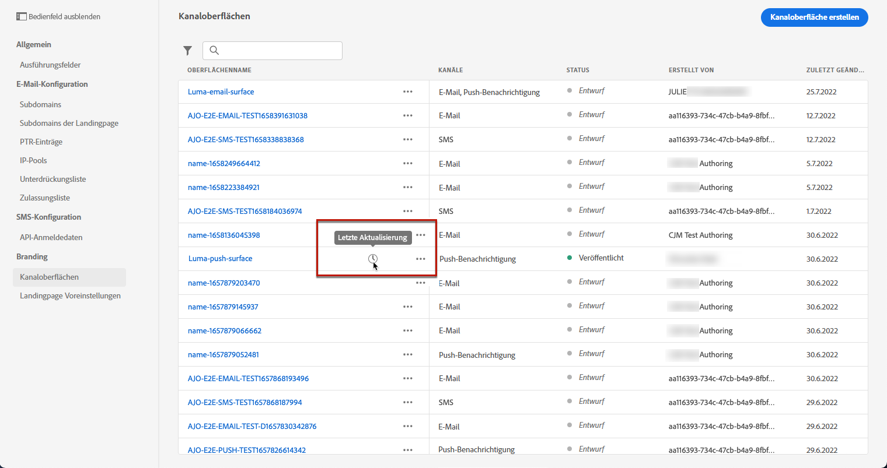

<!--You can also access the update details from an active channel configuration while update is in progress.-->

Auf dem Bildschirm **[!UICONTROL Letzte Aktualisierung]** können Sie Informationen wie den Aktualisierungsstatus und die Liste der angeforderten Änderungen sehen.

<!--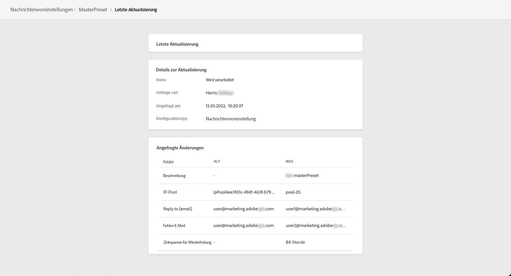-->

### Status aktualisieren {#update-statuses}

Eine Aktualisierung der Kanalkonfiguration kann die folgenden Status aufweisen:

* **[!UICONTROL Verarbeitung läuft]**: Die Aktualisierung der Kanalkonfiguration wurde übermittelt und durchläuft mehrere Überprüfungsschritte.
* **[!UICONTROL Erfolg]**: Die aktualisierte Kanalkonfiguration wurde verifiziert und kann zum Erstellen von Nachrichten ausgewählt werden.
* **[!UICONTROL Fehlgeschlagen]**: Eine oder mehrere Prüfungen sind bei der Verifizierung der Kanalkonfigurationsaktualisierung fehlgeschlagen.

Jeder Status wird im Folgenden beschrieben.

#### Verarbeitung läuft {#surface-processing}

Es werden verschiedene Zustellbarkeitsprüfungen durchgeführt, um zu überprüfen, ob die Konfiguration ordnungsgemäß aktualisiert wurde.

>[!NOTE]
>
>Wenn Sie nur die Felder **[!UICONTROL Beschreibung]**, **[!UICONTROL E-Mail-Typ]** und/oder **[!UICONTROL E-Mail-Wiederholungsparameter]** bearbeiten, erfolgt die Aktualisierung sofort.

Die Verarbeitungszeit kann bis zu **3 Stunden dauern**. Weitere Informationen zu den während des Validierungszyklus durchgeführten Prüfungen finden Sie [ (diesem Abschnitt](#create-channel-surface).

Wenn Sie eine Konfiguration bearbeiten, die bereits aktiv war:

* Ihr Status **[!UICONTROL Aktiv]** während des Validierungsprozesses beibehalten.

* Das Symbol **[!UICONTROL Letzte Aktualisierung]** wird neben dem Namen der Konfiguration in der Liste der Kanalkonfigurationen angezeigt.

* Während des Validierungsprozesses verwenden die mit dieser Konfiguration konfigurierten Nachrichten weiterhin die ältere Version der Konfiguration.

>[!NOTE]
>
>Eine Kanalkonfiguration kann während der Aktualisierung nicht geändert werden. Sie können weiterhin auf den Namen klicken, aber alle Felder sind ausgegraut. Die Änderungen werden erst übernommen, wenn die Aktualisierung erfolgreich war.

#### Erfolg {#success}

Sobald der Validierungsprozess erfolgreich war, wird die neue Version der Konfiguration automatisch in allen Nachrichten verwendet, die diese Konfiguration verwenden. Möglicherweise müssen Sie jedoch warten:

* einige Minuten, bevor sie von den unitären Nachrichten genutzt wird,
* bis zum nächsten Batch, damit die Konfiguration in Batch-Nachrichten wirksam wird.

#### Fehlgeschlagen {#failed}

Wenn der Validierungsprozess fehlschlägt, wird weiterhin die ältere Version der Konfiguration verwendet.

Weitere Informationen zu möglichen Fehlerursachen finden Sie in [diesem Abschnitt](#monitor-channel-surfaces).

Wenn die Aktualisierung fehlschlägt, kann die Konfiguration erneut bearbeitet werden. Sie können auf den Namen klicken und die Einstellungen aktualisieren, die korrigiert werden müssen.

## Deaktivieren einer Kanalkonfiguration {#deactivate-a-surface}

Wenn Sie möchten, dass eine **[!UICONTROL aktive]** Kanalkonfiguration nicht verfügbar ist, um neue Nachrichten zu erstellen, können Sie sie deaktivieren. <!--However, journeys' messages currently using this configuration will not be affected and will continue working.-->

Eine Kanalkonfiguration kann in den folgenden Fällen nicht deaktiviert werden:

* Wenn er von einer Live-Journey referenziert wird. Der Versuch, eine noch von einer Live-Journey verwendete Konfiguration zu deaktivieren, führt zu einem Fehler. Um eine Kanalkonfiguration zu deaktivieren, stellen Sie sicher, dass alle Live-Journey, die diese Konfiguration verwenden, geschlossen oder gestoppt sind. [Erfahren Sie, wie Sie eine Journey beenden](../building-journeys/end-journey.md)

* Während eine Aktualisierung der Kanalkonfiguration ausgeführt wird. Sie müssen warten, bis die Aktualisierung erfolgreich war oder fehlgeschlagen ist. Erfahren Sie mehr über [Bearbeiten von Kanalkonfigurationen](#edit-channel-surface) und über die [Aktualisierungsstatus](#update-statuses).

Gehen Sie wie folgt vor, um eine Kanalkonfiguration zu deaktivieren.

1. Rufen Sie die Liste der Kanalkonfigurationen auf.

1. Klicken Sie für die aktive Konfiguration Ihrer Wahl auf die Schaltfläche **[!UICONTROL Weitere Aktionen]**.

1. Wählen Sie **[!UICONTROL Deaktivieren]** aus.

   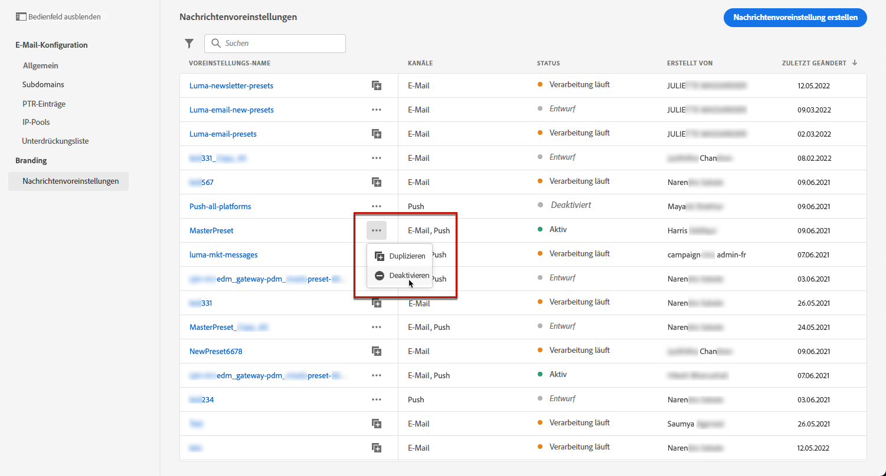

>[!NOTE]
>
>Deaktivierte Kanalkonfigurationen können nicht gelöscht werden, um Probleme in Journey zu vermeiden, die diese Konfigurationen zum Senden von Nachrichten verwenden.

Eine deaktivierte Kanalkonfiguration kann nicht direkt bearbeitet werden. Sie können sie jedoch duplizieren und die Kopie bearbeiten, um eine neue Version zu erstellen, mit der Sie neue Nachrichten erstellen. Sie können sie auch erneut aktivieren und warten, bis die Aktualisierung erfolgreich abgeschlossen wurde, um sie zu bearbeiten.

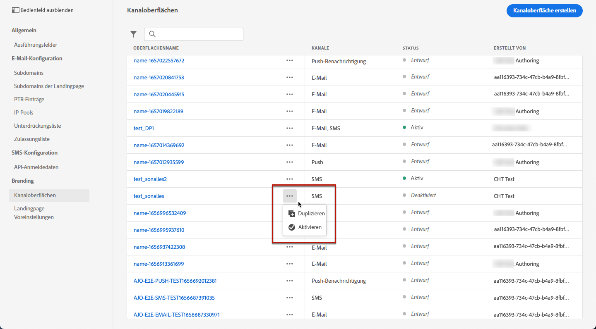

## Hinzufügen von Tags zu einer Kanalkonfiguration {#channel-config-tags}

1. Rufen Sie die Liste der Kanalkonfigurationen auf.

1. Klicken Sie für die aktive Konfiguration Ihrer Wahl auf die Schaltfläche **[!UICONTROL Weitere Aktionen]**.

1. Klicken Sie **[!UICONTROL Tags bearbeiten]**.

1. Wählen Sie Adobe Experience Platform-Tags aus der Liste aus, um Ihre Kanalkonfiguration zu kategorisieren und so die Suche zu verbessern. [Erfahren Sie, wie Sie mit einheitlichen Tags arbeiten](../start/search-filter-categorize.md#tags)

   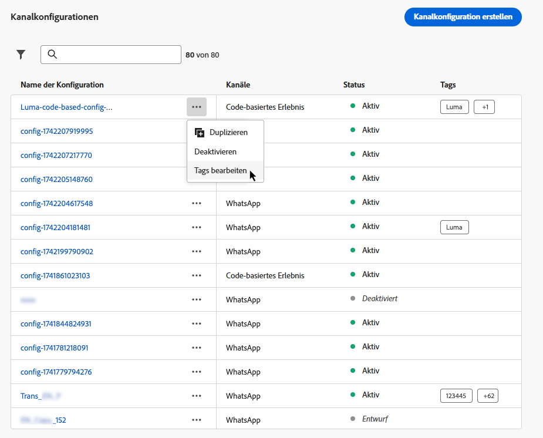

1. Nachdem Sie Ihren Kanalkonfigurationen Tags zugewiesen haben, können [ sie nach ](../start/search-filter-categorize.md#filter-on-tags) filtern.

## Anleitungsvideo{#video-presets}

Erfahren Sie, was Kanalkonfigurationen sind und wie sie in Adobe Journey Optimizer verwendet werden.

>[!VIDEO](https://video.tv.adobe.com/v/3433124/?learn=on)
