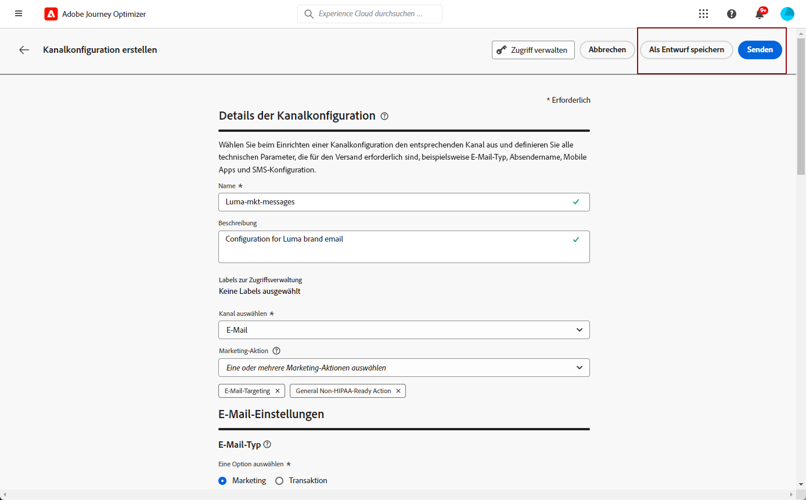

# Einrichten von Kanalkonfigurationen {#set-up-channel-surfaces}

>[!CONTEXTUALHELP]
>id="ajo_admin_channel_surfaces"
>title="Kanalkonfiguration"
>abstract="Eine Kanalkonfiguration ist eine Konfiguration, die von einem Systemadministrator definiert wurde. Sie enthält alle technischen Parameter zum Senden der Nachricht, wie z. B. Kopfzeilenparameter, Subdomain, Mobile Apps usw."

>[!CONTEXTUALHELP]
>id="ajo_admin_marketing_action"
>title="Marketing-Aktion"
>abstract="Wählen Sie die Marketing-Aktionen aus, um die Einwilligungsrichtlinien mit den Nachrichten zu verknüpfen, die diese Einrichtung verwenden. Alle mit der Marketing-Aktion verbundenen Zustimmungsrichtlinien werden verwendet, um die Voreinstellungen Ihrer Kunden zu berücksichtigen."

Mit [!DNL Journey Optimizer] können Sie Kanalkonfigurationen (d. h. Nachrichtenvorgaben) einrichten, die alle technischen Parameter definieren, die für Ihre Nachrichten erforderlich sind: E-Mail-Typ, Absender-E-Mail und Name, Mobile Apps, SMS-Konfiguration und mehr.

>[!CAUTION]
>
> * Um Kanalkonfigurationen zu erstellen, zu bearbeiten und zu löschen, müssen Sie über die Berechtigung [Nachrichtenvorgaben verwalten](../administration/high-low-permissions.md#administration-permissions) verfügen.
>
> * Sie müssen die Schritte [E-Mail-Konfiguration](../email/get-started-email-config.md), [Push-Konfiguration](../push/push-configuration.md), [SMS-Konfiguration](../sms/sms-configuration.md), [In-App-Konfiguration](../in-app/inapp-configuration.md), [Code-basierte Konfiguration](../code-based/code-based-configuration.md), [Web-Konfiguration](../web/web-configuration.md) und [Briefpost-Konfiguration](../direct-mail/direct-mail-configuration.md) ausführen, bevor Sie Kanalkonfigurationen erstellen.

Sobald die Kanalkonfigurationen konfiguriert wurden, können Sie sie beim Erstellen von Nachrichten aus einer Journey oder einer Kampagne auswählen.

<!--
➡️ [Learn how to create and use email configurations in this video](#video-presets)
-->

## Erstellen einer Kanalkonfiguration {#create-channel-surface}

>[!CONTEXTUALHELP]
>id="ajo_admin_message_presets_header"
>title="Kanalkonfigurationseinstellungen"
>abstract="Wählen Sie bei der Einrichtung einer Kanalkonfiguration den Kanal aus, auf den sie angewendet wird, und definieren Sie alle technischen Parameter, die für Ihren Versand erforderlich sind, z. B. E-Mail-Typ, Absendername, Mobile Apps, SMS-Konfiguration und mehr."

>[!CONTEXTUALHELP]
>id="ajo_admin_message_presets"
>title="Kanalkonfigurationseinstellungen"
>abstract="Um Aktionen wie E-Mails von einer Journey oder einer Kampagne erstellen zu können, müssen Sie zunächst eine Kanalkonfiguration erstellen, in der alle für Ihre Nachrichten erforderlichen technischen Parameter definiert sind. Sie müssen über die Berechtigung Nachrichtenvorgaben verwalten verfügen, um Kanalkonfigurationen erstellen, bearbeiten und löschen zu können."

>[!CONTEXTUALHELP]
>id="ajo_surface_marketing_action"
>title="Auswählen einer Marketing-Aktion"
>abstract="Wählen Sie in der Konfiguration eine Marketing-Aktion aus, um eine Zustimmungsrichtlinie mit der Nachricht zu verknüpfen."

Gehen Sie wie folgt vor, um eine Kanalkonfiguration zu erstellen:

1. Rufen Sie das Menü **[!UICONTROL Kanäle]** > **[!UICONTROL Allgemeine Einstellungen]** > **[!UICONTROL Kanalkonfigurationen]** auf und klicken Sie dann auf **[!UICONTROL Kanalkonfiguration erstellen]**.

   

1. Geben Sie einen Namen und eine Beschreibung (optional) für die Konfiguration ein und wählen Sie dann den zu konfigurierenden Kanal aus.

   

   >[!NOTE]
   >
   > Namen müssen mit einem Buchstaben (A–Z) beginnen. Ein Name darf nur alphanumerische Zeichen enthalten. Sie können auch die Zeichen Unterstrich `_`, Punkt `.` und Bindestrich `-` verwenden.

1. Um der Konfiguration benutzerdefinierte oder Core-Datennutzungsbezeichnungen zuzuweisen, können Sie **[!UICONTROL Zugriff verwalten]** auswählen. [Weitere Informationen zur Zugriffssteuerung auf Objektebene (OLAC)](../administration/object-based-access.md).

1. Wählen Sie Ihren Kanal aus.

1. Wählen Sie **[!UICONTROL Marketing-Aktion]**(en) aus, um den Nachrichten mithilfe dieser Konfiguration Einwilligungsrichtlinien zuzuordnen. Alle mit der Marketing-Aktion verknüpften Zustimmungsrichtlinien werden verwendet, um die Voreinstellungen Ihrer Kunden zu berücksichtigen. [Weitere Informationen](../action/consent.md#surface-marketing-actions)

   >[!NOTE]
   >
   >Einverständnisrichtlinien sind derzeit nur für Organisationen verfügbar, die die Zusatzangebote Adobe **Healthcare Shield** und **Privacy and Security Shield** erworben haben.

   

1. Nachdem alle Parameter konfiguriert wurden, klicken Sie zur Bestätigung auf **[!UICONTROL Senden]**. Sie können die Kanalkonfiguration auch als Entwurf speichern und die Konfiguration später fortsetzen.

   

   >[!NOTE]
   >
   >Sie können nicht mit der E-Mail-Konfigurationserstellung fortfahren, während sich der ausgewählte IP-Pool unter dem Status [Bearbeitung](ip-pools.md#edit-ip-pool) (**[!UICONTROL Verarbeitung]** ) befindet und noch nie mit der ausgewählten Subdomain verknüpft wurde. [Weitere Informationen](#subdomains-and-ip-pools)
   >
   >Speichern Sie die Konfiguration als Entwurf und warten Sie, bis der IP-Pool den Status **[!UICONTROL Erfolg]** aufweist, um die Konfigurationserstellung fortzusetzen.

1. Nachdem die Kanalkonfiguration erstellt wurde, wird sie in der Liste mit dem Status **[!UICONTROL Verarbeitung]** angezeigt.

   Während dieses Schrittes werden mehrere Prüfungen durchgeführt, um zu verifizieren, dass die Konfiguration korrekt ist.<!--The processing time is around **48h-72h**, and can take up to **7-10 business days**.-->

   >[!NOTE]
   > Beim Erstellen einer E-Mail-Konfiguration für eine Subdomain variiert die Verarbeitungszeit wie unten beschrieben:
   >
   > * Für **neue Subdomains** kann der Prozess zum Erstellen der ersten Kanalkonfiguration **10 Minuten bis 10 Tage dauern**.
   > * Bei **Nicht-Produktions-Sandboxes** oder wenn die ausgewählte Subdomain **bereits** in einer anderen genehmigten Kanalkonfiguration verwendet hat, dauert der Prozess nur bis zu **3 Stunden**.

   Zu diesen Prüfungen gehören Konfigurations- und technische Tests, die vom Adobe-Team durchgeführt werden:

   * SPF-Validierung
   * DKIM-Validierung
   * MX-Eintragsvalidierung
   * Überprüfung der Blockierungsliste der IPs
   * Helo-Host-Prüfung
   * IP-Pool-Verifizierung
   * A/PTR-Eintrag, Subdomain-Verifizierung t/m/res
   * FBL-Registrierung (diese Prüfung wird nur durchgeführt, wenn eine E-Mail-Konfiguration für eine bestimmte Subdomain zum ersten Mal erstellt wird)

   >[!NOTE]
   >
   >In [diesem Abschnitt](#monitor-channel-surfaces) erfahren Sie mehr über die möglichen Fehlerursachen, wenn die Prüfungen nicht erfolgreich sind.

1. Sobald die Prüfungen erfolgreich sind, erhält die Kanalkonfiguration den Status **[!UICONTROL Aktiv]** . Sie kann nun zum Versand von Nachrichten verwendet werden.

   

## Kanalkonfigurationen überwachen {#monitor-channel-surfaces}

Alle Kanalkonfigurationen werden im Menü **[!UICONTROL Kanäle]** > **[!UICONTROL Kanalkonfigurationen]** angezeigt. Es stehen Filter zur Verfügung, mit denen Sie die Liste durchsuchen können (Kanaltyp, Benutzer, Status).

Nach der Erstellung können Kanalkonfigurationen die folgenden Status aufweisen:

* **[!UICONTROL Entwurf]**: Die Kanalkonfiguration wurde als Entwurf gespeichert und wurde noch nicht übermittelt. Öffnen Sie sie, um die Konfiguration fortzusetzen.
* **[!UICONTROL Verarbeitung]**: Die Kanalkonfiguration wurde gesendet und durchläuft mehrere Überprüfungsschritte.
* **[!UICONTROL Aktiv]**: Die Kanalkonfiguration wurde überprüft und kann zum Erstellen von Nachrichten ausgewählt werden.
* **[!UICONTROL Fehlgeschlagen]**: Eine oder mehrere Prüfungen sind während der Überprüfung der Kanalkonfiguration fehlgeschlagen.
* **[!UICONTROL Deaktiviert]**: Die Kanalkonfiguration ist deaktiviert. Sie kann nicht zum Erstellen neuer Nachrichten verwendet werden.

Wenn die Erstellung eines Kanals fehlschlägt, werden die Details zu den möglichen Fehlerursachen nachfolgend beschrieben.

Wenn einer dieser Fehler auftritt, wenden Sie sich an die [Adobe-Kundenunterstützung](https://helpx.adobe.com/de/enterprise/admin-guide.html/enterprise/using/support-for-experience-cloud.ug.html){target="_blank"}, um Hilfe zu erhalten.

* **SPF-Validierung fehlgeschlagen**: SPF (Sender Policy Framework) ist ein E-Mail-Authentifizierungsprotokoll, mit dem autorisierte IPs angegeben werden können, die E-Mails von einer bestimmten Subdomain senden können. Ein SPF-Validierungsfehler bedeutet, dass die IP-Adressen im SPF-Datensatz nicht mit den IP-Adressen übereinstimmen, die zum Senden von E-Mails an die E-Mail-Anbieter verwendet werden.

* **DKIM-Validierung fehlgeschlagen**: Mit DKIM (DomainKeys Identified Mail) kann der Empfänger-Server überprüfen, ob die empfangene Nachricht vom echten Absender der zugehörigen Domain gesendet wurde, und sicherstellen, dass der Inhalt der ursprünglichen Nachricht nicht auf dem Weg verändert wurde. Ein DKIM-Validierungsfehler bedeutet, dass die Empfangs-Mail-Server die Authentizität des Nachrichteninhalts und dessen Zuordnung zur Versand-Domain nicht überprüfen können.:

* **MX-Eintragsvalidierung fehlgeschlagen**: Ein MX-Eintragsvalidierungsfehler (Mail eXchange) bedeutet, dass die E-Mail-Server, die für die Annahme eingehender E-Mails für eine bestimmte Subdomain verantwortlich sind, nicht korrekt konfiguriert sind.

* **Zustellbarkeitskonfigurationen fehlgeschlagen**: Zustellbarkeitskonfigurationsfehler können aus einem der folgenden Gründe auftreten:
   * Blockierungsauflistung der zugewiesenen IPs
   * Ungültiger `helo`-Name
   * E-Mails, die von anderen als den im IP-Pool der entsprechenden Konfiguration angegebenen IP-Adressen gesendet werden
   * E-Mails können nicht an die Postfächer von wichtigen ISPs zugestellt werden

## Bearbeiten einer Kanalkonfiguration {#edit-channel-surface}

Gehen Sie wie folgt vor, um eine Kanalkonfiguration zu bearbeiten.

>[!NOTE]
>
>Die **[!UICONTROL Einstellungen für Push-Benachrichtigungen]** können Sie nicht bearbeiten. Wenn eine Kanalkonfiguration nur für den Kanal Push-Benachrichtigung konfiguriert ist, kann sie nicht bearbeitet werden.

1. Klicken Sie in der Liste auf einen Kanal-Konfigurationsnamen, um ihn zu öffnen.

   

1. Bearbeiten Sie die Eigenschaften nach Bedarf.

   >[!NOTE]
   >
   >Wenn eine Kanalkonfiguration den Status &quot;**[!UICONTROL Aktiv]**&quot; hat, sind die Felder &quot;**[!UICONTROL Name]**&quot;, &quot;**[!UICONTROL Kanal auswählen]**&quot;und &quot;**[!UICONTROL Subdomäne]**&quot; grau ausgeblendet und können nicht bearbeitet werden.

1. Klicken Sie auf **[!UICONTROL Senden]**, um Ihre Änderungen zu bestätigen.

   >[!NOTE]
   >
   >Sie können die Kanalkonfiguration auch als Entwurf speichern und die Aktualisierung später fortsetzen.

Sobald die Änderungen übermittelt wurden, durchläuft die Kanalkonfiguration einen Validierungszyklus, der dem beim [Erstellen einer Kanalkonfiguration](#create-channel-surface) vorhandenen ähnelt. Die Verarbeitungszeit nach dem Bearbeiten kann bis zu **3 Stunden** dauern.

>[!NOTE]
>
>Wenn Sie nur die Felder **[!UICONTROL Beschreibung]**, **[!UICONTROL E-Mail-Typ]** und/oder **[!UICONTROL E-Mail-Wiederholungsparameter]** bearbeiten, wird die Aktualisierung sofort wirksam.

### Details zur Aktualisierung {#update-details}

Bei Kanalkonfigurationen mit dem Status **[!UICONTROL Aktiv]** können Sie die Details der Aktualisierung überprüfen. Gehen Sie dazu wie folgt vor:

Klicken Sie auf das Symbol **[!UICONTROL Letztes Update]** , das neben dem aktiven Konfigurationsnamen angezeigt wird.

<!--You can also access the update details from an active channel configuration while update is in progress.-->

Auf dem Bildschirm **[!UICONTROL Letzte Aktualisierung]** können Sie Informationen wie den Aktualisierungsstatus und die Liste der angeforderten Änderungen sehen.

<!---->

### Aktualisieren des Status {#update-statuses}

Eine Aktualisierung der Kanalkonfiguration kann die folgenden Status aufweisen:

* **[!UICONTROL Verarbeitung]**: Die Aktualisierung der Kanalkonfiguration wurde eingereicht und durchläuft zurzeit mehrere Überprüfungsschritte.
* **[!UICONTROL Erfolg]**: Die aktualisierte Kanalkonfiguration wurde überprüft und kann zum Erstellen von Nachrichten ausgewählt werden.
* **[!UICONTROL Fehlgeschlagen]**: Eine oder mehrere Prüfungen sind während der Überprüfung der Aktualisierung der Kanalkonfiguration fehlgeschlagen.

Jeder Status wird nachfolgend beschrieben.

#### Verarbeitung läuft {#surface-processing}

Es werden verschiedene Zustellbarkeitsprüfungen durchgeführt, um zu überprüfen, ob die Konfiguration ordnungsgemäß aktualisiert wurde.

>[!NOTE]
>
>Wenn Sie nur die Felder **[!UICONTROL Beschreibung]**, **[!UICONTROL E-Mail-Typ]** und/oder **[!UICONTROL E-Mail-Wiederholungsparameter]** bearbeiten, wird die Aktualisierung sofort wirksam.

Die Verarbeitungszeit kann bis **3 Stunden** dauern. Weitere Informationen zu den während des Validierungszyklus durchgeführten Prüfungen finden Sie in [diesem Abschnitt](#create-channel-surface).

Wenn Sie eine bereits aktive Konfiguration bearbeiten:

* Ihr Status **[!UICONTROL Aktiv]** bleibt erhalten, während der Validierungsprozess ausgeführt wird.

* In der Liste der Kanalkonfigurationen wird neben dem Namen der Konfiguration das Symbol **[!UICONTROL Letzte Aktualisierung]** angezeigt.

* Während des Validierungsprozesses verwenden die mit dieser Konfiguration konfigurierten Nachrichten weiterhin die ältere Version der Konfiguration.

>[!NOTE]
>
>Während der Aktualisierung können Sie die Kanalkonfiguration nicht ändern. Sie können zwar weiterhin auf den Namen klicken, aber alle Felder sind ausgegraut. Die Änderungen werden erst dann übernommen, wenn die Aktualisierung erfolgreich war.

#### Erfolgreich {#success}

Sobald der Validierungsprozess erfolgreich ist, wird die neue Version der Konfiguration automatisch in allen Nachrichten verwendet, die diese Konfiguration verwenden. Sie müssen jedoch möglicherweise warten:
* einige Minuten, bevor sie von den unitären Nachrichten genutzt wird,
* bis zum nächsten Batch, damit die Konfiguration in Batch-Nachrichten wirksam ist.

#### Fehlgeschlagen {#failed}

Wenn der Validierungsprozess fehlschlägt, wird weiterhin die ältere Version der Konfiguration verwendet.

Weitere Informationen zu möglichen Fehlerursachen finden Sie in [diesem Abschnitt](#monitor-channel-surfaces).

Wenn die Aktualisierung fehlschlägt, kann die Konfiguration erneut bearbeitet werden. Sie können auf den Namen klicken und die Einstellungen aktualisieren, die korrigiert werden müssen.

## Deaktivieren der Kanalkonfiguration {#deactivate-a-surface}

Um die Konfiguration eines **[!UICONTROL aktiven]** Kanals zum Erstellen neuer Nachrichten nicht verfügbar zu machen, können Sie sie deaktivieren. Journey, die diese Konfiguration verwenden, sind jedoch nicht betroffen und funktionieren weiterhin.

>[!NOTE]
>
>Sie können eine Kanalkonfiguration nicht deaktivieren, während eine Aktualisierung verarbeitet wird. Sie müssen warten, bis die Aktualisierung entweder erfolgreich war oder fehlgeschlagen ist. Erfahren Sie mehr über [Bearbeiten von Kanalkonfigurationen](#edit-channel-surface) und die [Aktualisierungsstatus](#update-statuses).

1. Rufen Sie die Liste der Kanalkonfigurationen auf.

1. Klicken Sie für die aktive Konfiguration Ihrer Wahl auf die Schaltfläche **[!UICONTROL Mehr Aktionen]** .

1. Wählen Sie **[!UICONTROL Deaktivieren]** aus.

   

>[!NOTE]
>
>Deaktivierte Kanalkonfigurationen können nicht gelöscht werden, um Probleme in Journey zu vermeiden, die diese Konfigurationen zum Senden von Nachrichten verwenden.

Eine deaktivierte Kanalkonfiguration kann nicht direkt bearbeitet werden. Sie können sie jedoch duplizieren und die Kopie bearbeiten, um eine neue Version zu entwerfen, mit der Sie neue Nachrichten erstellen können. Sie können sie auch erneut aktivieren und warten, bis die Aktualisierung erfolgreich abgeschlossen wird, bevor Sie sie bearbeiten.

<!--
## How-to video{#video-presets}

Learn how to create channel configurations, how to use them and how to delegate a subdomain and create an IP pool.

>[!VIDEO](https://video.tv.adobe.com/v/334343?quality=12)
-->
