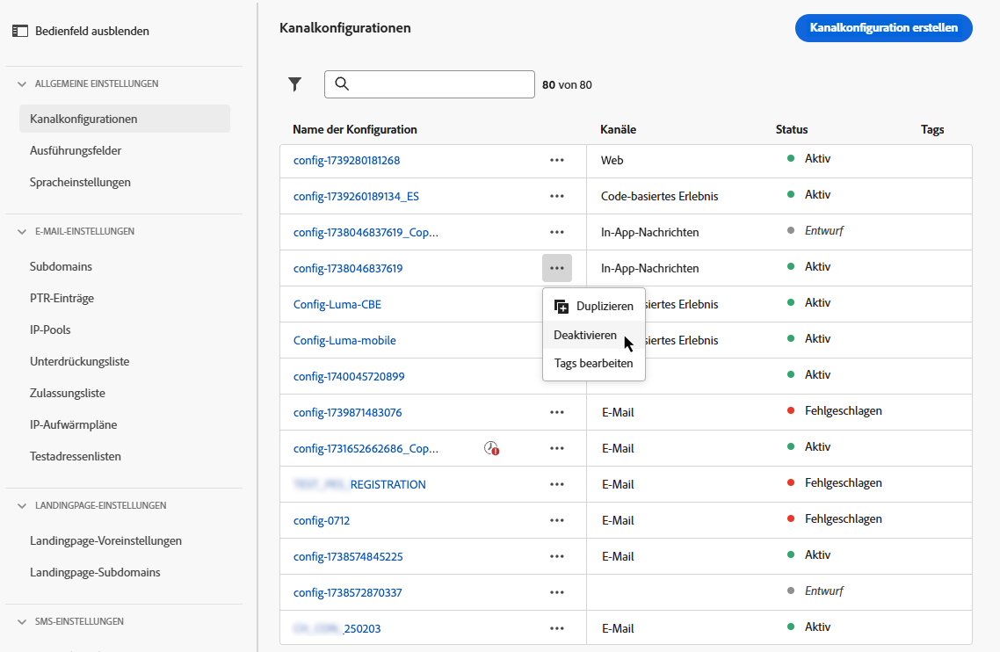

# Einrichten von Kanalkonfigurationen {#set-up-channel-surfaces}

>[!CONTEXTUALHELP]
>id="ajo_admin_channel_surfaces"
>title="Kanalkonfiguration"
>abstract="Eine Kanalkonfiguration ist eine von einer oder einem Systemadmin definierte Konfiguration. Sie enthält alle technischen Parameter zum Senden der Nachricht, wie z. B. Kopfzeilenparameter, Subdomain, Mobile Apps usw."

>[!CONTEXTUALHELP]
>id="ajo_admin_marketing_action"
>title="Marketing-Aktion"
>abstract="Wählen Sie eine Marketing-Aktion aus, um Einverständnisrichtlinien mit den Nachrichten zu verknüpfen, die dieses Setup verwenden. Es werden alle mit der Marketing-Aktion verknüpften Einverständnisrichtlinien genutzt, um die Voreinstellungen Ihrer Kundinnen und Kunden zu respektieren."

Mit [!DNL Journey Optimizer] können Sie Kanalkonfigurationen (z. B. Nachrichtenvoreinstellungen) einrichten, die alle für Ihre Nachrichten erforderlichen technischen Parameter definieren: E-Mail-Typ, Absender-E-Mail und -Name, Mobile Apps sowie SMS-Konfiguration.

>[!CAUTION]
>
> * Um Kanalkonfigurationen zu erstellen, zu bearbeiten und zu löschen, benötigen Sie die Berechtigung zur [Verwaltung von Nachrichtenvoreinstellungen](../administration/high-low-permissions.md#administration-permissions).
>
> * Bevor Sie Kanalkonfigurationen erstellen können, müssen Sie die Schritte zur [E-Mail-Konfiguration](../email/get-started-email-config.md), [Konfiguration von Push-Benachrichtigungen](../push/push-configuration.md), [SMS-Konfiguration](../sms/sms-configuration.md), [In-App-Konfiguration](../in-app/inapp-configuration.md), [Code-basierten Konfiguration](../code-based/code-based-configuration.md), [Web-Konfiguration](../web/web-configuration.md) und [Direkt-Mail-Konfiguration](../direct-mail/direct-mail-configuration.md) ausführen.

Sobald die Kanalkonfigurationen konfiguriert wurden, können Sie sie beim Erstellen von Nachrichten in einer Journey oder einer Kampagne auswählen.

Sie können auch die Anleitung zur Kanaleinrichtung verwenden, um die Kanaleinrichtung in einem einheitlichen Erlebnis zu automatisieren und validieren und so schneller mit Journey Optimizer zu beginnen. [Weitere Informationen](set-mobile-config.md)

<!--
➡️ [Learn how to create and use email configurations in this video](#video-presets)
-->

## Erstellen einer Kanalkonfiguration {#create-channel-surface}

>[!CONTEXTUALHELP]
>id="ajo_admin_message_presets_header"
>title="Einstellungen der Kanalkonfiguration"
>abstract="Beim Einrichten einer Kanalkonfiguration den entsdprechenden Kanal auswählen und alle technischen Parameter definieren, die für den Versand erforderlich sind, beispielsweise E-Mail-Typ, Absendername, Mobile Apps und SMS-Konfiguration."

>[!CONTEXTUALHELP]
>id="ajo_admin_message_presets"
>title="Einstellungen der Kanalkonfiguration"
>abstract="Damit Aktionen wie E-Mails aus einer Journey oder einer Kampagne erstellt werden können, muss zunächst eine Kanalkonfiguration erstellt werden, die alle für die Nachrichten erforderlichen technischen Parameter definiert. Für das Erstellen, Bearbeiten und Löschen von Kanalkonfigurationen wird die Berechtigung zum Verwalten von Nachrichtenvoreinstellungen benötigt."

>[!CONTEXTUALHELP]
>id="ajo_surface_marketing_action"
>title="Auswählen einer Marketing-Aktion"
>abstract="Wählen Sie eine Marketing-Aktion in der Konfiguration aus, um eine Einverständnisrichtlinie mit der Nachricht zu verknüpfen."

Gehen Sie wie folgt vor, um eine Kanalkonfiguration zu erstellen:

1. Rufen Sie das Menü **[!UICONTROL Kanäle]** > **[!UICONTROL Allgemeine Einstellungen]** > **[!UICONTROL Kanalkonfigurationen]** auf und klicken Sie dann auf **[!UICONTROL Kanalkonfiguration erstellen]**.

   

1. Geben Sie einen Namen und eine Beschreibung (optional) für die Konfiguration ein und wählen Sie dann den zu konfigurierenden Kanal aus.

   

   >[!NOTE]
   >
   > Namen müssen mit einem Buchstaben (A–Z) beginnen. Ein Name darf nur alphanumerische Zeichen enthalten. Sie können auch die Zeichen Unterstrich `_`, Punkt `.` und Bindestrich `-` verwenden.

1. Um der Konfiguration benutzerdefinierte oder grundlegende Datennutzungs-Labels zuzuweisen, können Sie **[!UICONTROL Zugriff verwalten]** auswählen. [Erfahren Sie mehr über die Zugriffssteuerung auf Objektebene (Object Level Access Control, OLAC)](../administration/object-based-access.md).

1. Wählen Sie Ihren Kanal aus.

1. Wählen Sie eine **[!UICONTROL Marketing-Aktion]** aus, um Einverständnisrichtlinien mit den Nachrichten zu verknüpfen, die diese Konfiguration verwenden. Es werden alle mit der Marketing-Aktion verknüpften Einverständnisrichtlinien genutzt, um die Präferenzen Ihrer Kundinnen und Kunden zu respektieren. [Weitere Informationen](../action/consent.md#surface-marketing-actions)

   >[!NOTE]
   >
   >Einverständnisrichtlinien sind derzeit nur für Organisationen verfügbar, die die Zusatzangebote Adobe **Healthcare Shield** und **Privacy and Security Shield** erworben haben.

   

1. Nachdem alle Parameter konfiguriert wurden, klicken Sie zur Bestätigung auf **[!UICONTROL Senden]**. Sie können die Kanalkonfiguration auch als Entwurf speichern und ihre Konfiguration später fortsetzen.

   

   >[!NOTE]
   >
   >Sie können nicht mit der Erstellung der E-Mail-Konfiguration fortfahren, während sich der ausgewählte IP-Pool in [Bearbeitung](ip-pools.md#edit-ip-pool) befindet (Status **[!UICONTROL Verarbeitung läuft]**) und noch nie mit der ausgewählten Subdomain verknüpft wurde. [Weitere Informationen](#subdomains-and-ip-pools)
   >
   >Speichern Sie die Konfiguration als Entwurf und warten Sie, bis der IP-Pool den Status **[!UICONTROL Erfolg]** erreicht hat, um mit der Erstellung der Konfiguration fortzufahren.

1. Nachdem die Kanalkonfiguration erstellt wurde, wird sie in der Liste mit dem Status **[!UICONTROL Verarbeitung läuft]** angezeigt.

   Während dieses Schrittes werden mehrere Prüfungen durchgeführt, um zu verifizieren, dass die Konfiguration korrekt ist. <!--The processing time is around **48h-72h**, and can take up to **7-10 business days**.-->

   >[!NOTE]
   > Beim Erstellen einer E-Mail-Konfiguration für eine Subdomain variiert die Verarbeitungszeit, wie im Folgenden beschrieben:
   >
   > * Bei **neuen Subdomains** kann der Prozess zur Erstellung der ersten Kanalkonfiguration **10 Minuten bis 10 Tage** dauern.
   > * Bei **Nicht-Produktions-Sandboxes**, oder wenn die ausgewählte Subdomain in einer anderen genehmigten Kanalkonfiguration **bereits verwendet** wird, nimmt der Prozess nur bis zu **3 Stunden** in Anspruch.

   Zu diesen Prüfungen gehören Konfigurations- und technische Tests, die vom Adobe-Team durchgeführt werden:

   * SPF-Validierung
   * DKIM-Validierung
   * MX-Eintragsvalidierung
   * Überprüfung der Blockierungsliste der IPs
   * Helo-Host-Prüfung
   * IP-Pool-Verifizierung
   * A/PTR-Eintrag, Subdomain-Verifizierung t/m/res
   * FBL-Registrierung (diese Prüfung wird nur bei der ersten Erstellung einer E-Mail-Konfiguration für eine bestimmte Subdomain durchgeführt)

   >[!NOTE]
   >
   >In [diesem Abschnitt](#monitor-channel-surfaces) erfahren Sie mehr über die möglichen Fehlerursachen, wenn die Prüfungen nicht erfolgreich sind.

1. Sobald die Prüfungen erfolgreich abgeschlossen sind, erhält die Kanalkonfiguration den Status **[!UICONTROL Aktiv]**. Sie kann nun zum Versand von Nachrichten verwendet werden.

   

## Überwachen von Kanalkonfigurationen {#monitor-channel-surfaces}

Alle Kanalkonfigurationen werden im Menü **[!UICONTROL Kanäle]** > **[!UICONTROL Kanalkonfigurationen]** angezeigt. Es stehen Filter zur Verfügung, mit denen Sie die Liste durchsuchen können (Kanaltyp, Benutzer, Status).

Nach ihrer Erstellung können Kanalkonfigurationen die folgenden Status aufweisen:

* **[!UICONTROL Entwurf]**: Die Kanalkonfiguration wurde als Entwurf gespeichert und noch nicht gesendet. Öffnen Sie sie, um die Konfiguration fortzusetzen.
* **[!UICONTROL Verarbeitung läuft]**: Die Kanalkonfiguration wurde übermittelt und durchläuft mehrere Überprüfungsschritte.
* **[!UICONTROL Aktiv]**: Die Kanalkonfiguration wurde verifiziert und kann zum Erstellen von Nachrichten ausgewählt werden.
* **[!UICONTROL Fehlgeschlagen]**: Eine oder mehrere Prüfungen sind bei der Verifizierung der Kanalkonfiguration fehlgeschlagen.
* **[!UICONTROL Deaktiviert]**: Die Kanalkonfiguration ist deaktiviert. Sie kann nicht zum Erstellen neuer Nachrichten verwendet werden.

### Gründe für Kanalkonfigurationsfehler {#channel-config-failure}

Im Folgenden finden Sie Details zu möglichen Fehlerursachen, falls die Erstellung einer Kanalkonfiguration fehlschlägt.

Wenn einer dieser Fehler auftritt, wenden Sie sich an die [Adobe-Kundenunterstützung](https://helpx.adobe.com/de/enterprise/admin-guide.html/enterprise/using/support-for-experience-cloud.ug.html){target="_blank"}, um Hilfe zu erhalten.

* **SPF-Validierung fehlgeschlagen**: SPF (Sender Policy Framework) ist ein E-Mail-Authentifizierungsprotokoll, mit dem autorisierte IPs angegeben werden können, die E-Mails von einer bestimmten Subdomain senden können. Ein SPF-Validierungsfehler bedeutet, dass die IP-Adressen im SPF-Eintrag nicht mit den IP-Adressen übereinstimmen, die zum Senden von E-Mails an die E-Mail-Anbieter verwendet werden.

* **DKIM-Validierung fehlgeschlagen**: Mit DKIM (DomainKeys Identified Mail) kann der Empfänger-Server überprüfen, ob die empfangene Nachricht vom echten Absender der zugehörigen Domain gesendet wurde, und sicherstellen, dass der Inhalt der ursprünglichen Nachricht nicht auf dem Weg verändert wurde. Ein DKIM-Validierungsfehler bedeutet, dass die Empfangs-Mail-Server die Authentizität des Nachrichteninhalts und dessen Zuordnung zur Versand-Domain nicht überprüfen können.:

* **MX-Eintragsvalidierung fehlgeschlagen**: Ein MX-Eintragsvalidierungsfehler (Mail eXchange) bedeutet, dass die E-Mail-Server, die für die Annahme eingehender E-Mails für eine bestimmte Subdomain verantwortlich sind, nicht korrekt konfiguriert sind.

* **Zustellbarkeitskonfigurationen fehlgeschlagen**: Zustellbarkeitskonfigurationsfehler können aus einem der folgenden Gründe auftreten:
   * Blockierungsauflistung der zugewiesenen IPs
   * Ungültiger `helo`-Name
   * E-Mails, die von anderen IPs als den im IP-Pool der entsprechenden Konfiguration angegebenen gesendet werden
   * E-Mails können nicht an die Postfächer von wichtigen ISPs zugestellt werden

## Bearbeiten einer Kanalkonfiguration {#edit-channel-surface}

Gehen Sie wie folgt vor, um eine Kanalkonfiguration zu bearbeiten.

>[!NOTE]
>
>Die **[!UICONTROL Einstellungen für Push-Benachrichtigungen]** können Sie nicht bearbeiten. Wenn eine Kanalkonfiguration nur für den Kanal „Push-Benachrichtigung“ konfiguriert ist, kann sie nicht bearbeitet werden.

1. Klicken Sie in der Liste auf den Namen einer Kanalkonfiguration, um sie zu öffnen.

   

1. Bearbeiten Sie die Eigenschaften nach Bedarf.

   >[!NOTE]
   >
   >Wenn eine Kanalkonfiguration den Status **[!UICONTROL Aktiv]** hat, sind die Felder **[!UICONTROL Name]**, **[!UICONTROL Kanal auswählen]** und **[!UICONTROL Subdomain]** grau dargestellt und können nicht bearbeitet werden.

1. Klicken Sie auf **[!UICONTROL Senden]**, um Ihre Änderungen zu bestätigen.

   >[!NOTE]
   >
   >Sie können die Kanalkonfiguration auch als Entwurf speichern und die Aktualisierung später fortsetzen.

Sobald die Änderungen übermittelt wurden, durchläuft die Kanalkonfiguration einen ähnlichen Validierungszyklus wie beim [Erstellen einer Kanalkonfiguration](#create-channel-surface). Die Verarbeitungszeit nach dem Bearbeiten kann bis zu **3 Stunden** dauern.

>[!NOTE]
>
>Wenn Sie nur die Felder **[!UICONTROL Beschreibung]**, **[!UICONTROL E-Mail-Typ]** und/oder **[!UICONTROL E-Mail-Wiederholungsparameter]** bearbeiten, wird die Aktualisierung sofort wirksam.

### Details zur Aktualisierung {#update-details}

Hat eine Kanalkonfiguration den Status **[!UICONTROL Aktiv]**, können Sie die Details der Aktualisierung überprüfen. Gehen Sie dazu wie folgt vor:

Klicken Sie auf das Symbol **[!UICONTROL Letzte Aktualisierung]**, das neben dem Namen der aktiven Konfiguration angezeigt wird.

<!--You can also access the update details from an active channel configuration while update is in progress.-->

Auf dem Bildschirm **[!UICONTROL Letzte Aktualisierung]** können Sie Informationen wie den Aktualisierungsstatus und die Liste der angeforderten Änderungen sehen.

<!---->

### Aktualisieren des Status {#update-statuses}

Eine Aktualisierung einer Kanalkonfiguration kann die folgenden Status aufweisen:

* **[!UICONTROL Verarbeitung läuft]**: Die Aktualisierung der Kanalkonfiguration wurde übermittelt und durchläuft mehrere Überprüfungsschritte.
* **[!UICONTROL Erfolg]**: Die aktualisierte Kanalkonfiguration wurde verifiziert und kann zum Erstellen von Nachrichten ausgewählt werden.
* **[!UICONTROL Fehlgeschlagen]**: Eine oder mehrere Prüfungen sind bei der Verifizierung der Aktualisierung der Kanalkonfiguration fehlgeschlagen.

Jeder Status wird nachfolgend beschrieben.

#### Verarbeitung läuft {#surface-processing}

Es werden verschiedene Zustellbarkeitsprüfungen durchgeführt, um sicherzustellen, dass die Kanalkonfiguration ordnungsgemäß aktualisiert wurde.

>[!NOTE]
>
>Wenn Sie nur die Felder **[!UICONTROL Beschreibung]**, **[!UICONTROL E-Mail-Typ]** und/oder **[!UICONTROL E-Mail-Wiederholungsparameter]** bearbeiten, wird die Aktualisierung sofort wirksam.

Die Verarbeitungszeit kann bis **3 Stunden** dauern. Weitere Informationen zu den während des Validierungszyklus durchgeführten Prüfungen finden Sie in [diesem Abschnitt](#create-channel-surface).

Wenn Sie eine bereits aktive Konfiguration bearbeiten:

* Ihr Status **[!UICONTROL Aktiv]** bleibt erhalten, während der Validierungsprozess ausgeführt wird.

* Das Symbol **[!UICONTROL Letzte Aktualisierung]** wird neben dem Namen der Konfiguration in der Liste der Kanalkonfigurationen angezeigt.

* Während des Validierungsprozesses verwenden die mit dieser Konfiguration konfigurierten Nachrichten weiterhin die ältere Version der Konfiguration.

>[!NOTE]
>
>Sie können eine Kanalkonfiguration während des Aktualisierungsprozesses nicht ändern. Sie können zwar weiterhin auf den Namen klicken, aber alle Felder sind ausgegraut. Die Änderungen werden erst dann übernommen, wenn die Aktualisierung erfolgreich war.

#### Erfolgreich {#success}

Nach erfolgreicher Überprüfung wird die neue Version der Konfiguration automatisch in allen Nachrichten verwendet, die diese Konfiguration verwenden. Sie müssen jedoch möglicherweise warten:

* einige Minuten, bevor sie von den unitären Nachrichten genutzt wird,
* bis zum nächsten Batch, damit die Konfiguration in Batch-Nachrichten wirksam wird.

#### Fehlgeschlagen {#failed}

Wenn der Validierungsprozess fehlschlägt, wird weiterhin die ältere Version der Konfiguration verwendet.

Weitere Informationen zu möglichen Fehlerursachen finden Sie in [diesem Abschnitt](#monitor-channel-surfaces).

Wenn die Aktualisierung fehlschlägt, kann die Konfiguration erneut bearbeitet werden. Sie können auf den Namen klicken und die Einstellungen aktualisieren, die korrigiert werden müssen.

## Deaktivieren einer Kanalkonfiguration {#deactivate-a-surface}

Wenn Sie möchten, dass eine **[!UICONTROL aktive]** Kanalkonfiguration nicht verfügbar ist, um neue Nachrichten zu erstellen, können Sie sie deaktivieren. <!--However, journeys' messages currently using this configuration will not be affected and will continue working.-->

Eine Kanalkonfiguration kann in den folgenden Fällen nicht deaktiviert werden:

* Wenn er von einer Live-Journey referenziert wird. Der Versuch, eine noch von einer Live-Journey verwendete Konfiguration zu deaktivieren, führt zu einem Fehler.

  Um eine Kanalkonfiguration zu deaktivieren, stellen Sie sicher, dass alle Live-Journey, die diese Konfiguration verwenden, geschlossen oder gestoppt sind. [Erfahren Sie, wie Sie eine Journey beenden](../building-journeys/end-journey.md)

* Während eine Aktualisierung der Kanalkonfiguration ausgeführt wird. Sie müssen warten, bis die Aktualisierung entweder erfolgreich war oder fehlgeschlagen ist. Erfahren Sie mehr über [Bearbeiten von Kanalkonfigurationen](#edit-channel-surface) und über die [Aktualisierungsstatus](#update-statuses).

Gehen Sie wie folgt vor, um eine Kanalkonfiguration zu deaktivieren.

1. Rufen Sie die Liste der Kanalkonfigurationen auf.

1. Klicken Sie für die aktive Konfiguration Ihrer Wahl auf die Schaltfläche **[!UICONTROL Weitere Aktionen]**.

1. Wählen Sie **[!UICONTROL Deaktivieren]** aus.

   

>[!NOTE]
>
>Deaktivierte Kanalkonfigurationen können nicht gelöscht werden, um Probleme in Journeys zu vermeiden, die diese Konfigurationen zum Senden von Nachrichten verwenden.

Eine deaktivierte Kanalkonfiguration kann nicht direkt bearbeitet werden. Sie können sie jedoch duplizieren und die Kopie bearbeiten, um eine neue Version zu entwerfen, mit der Sie neue Nachrichten erstellen können. Sie können sie auch erneut aktivieren und warten, bis die Aktualisierung erfolgreich abgeschlossen wird, bevor Sie sie bearbeiten.

## Hinzufügen von Tags zu einer Kanalkonfiguration {#channel-config-tags}

1. Rufen Sie die Liste der Kanalkonfigurationen auf.

1. Klicken Sie für die aktive Konfiguration Ihrer Wahl auf die Schaltfläche **[!UICONTROL Weitere Aktionen]**.

1. Klicken Sie auf **[!UICONTROL Tags bearbeiten]**.

1. Wählen Sie Adobe Experience Platform-Tags aus der Liste aus, um Ihre Kanalkonfiguration für eine verbesserte Suche zu kategorisieren. [Informationen zum Arbeiten mit einheitlichen Tags](../start/search-filter-categorize.md#tags)

   

1. Nachdem Sie Ihren Kanalkonfigurationen Tags zugewiesen haben, können Sie sie nach Tags [filtern](../start/search-filter-categorize.md#filter-on-tags).

## Anleitungsvideo{#video-presets}

Erfahren Sie, was Kanalkonfigurationen sind und wie sie in Adobe Journey Optimizer verwendet werden.

>[!VIDEO](https://video.tv.adobe.com/v/3433124/?learn=on)
