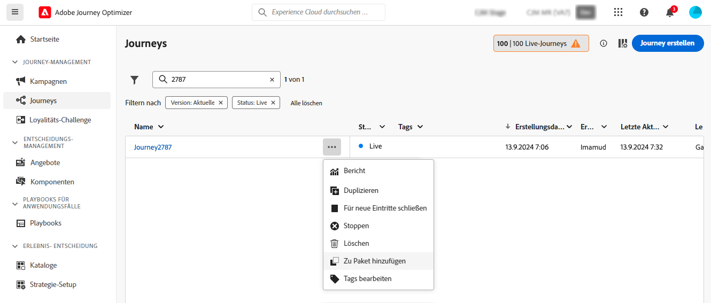

# Exportieren von Objekten in eine andere Sandbox {#copy-to-sandbox}

Sie können Objekte wie Journeys, benutzerdefinierte Aktionen, Inhaltsvorlagen oder Fragmente über mehrere Sandboxes hinweg kopieren, indem Sie die Export- und Importfunktionen für Pakete verwenden. Ein Paket kann aus einem oder mehreren Objekten bestehen. Alle Objekte, die in einem Paket enthalten sind, müssen aus derselben Sandbox stammen.

Auf dieser Seite wird der Anwendungsfall der Sandbox-Werkzeuge im Kontext von Journey Optimizer beschrieben. Weitere Informationen zur Funktion selbst finden Sie im Adobe Experience Platform-Handbuch zu [Sandbox-Tools](https://experienceleague.adobe.com/docs/experience-platform/sandbox/ui/sandbox-tooling.html?lang=de#abobe-journey-optimizer-objects){target="_blank"}.

>[!NOTE]
>
>Diese Funktion erfordert die folgenden Berechtigungen von der Funktion **Sandbox-Administration**: „Sandboxes verwalten“ (oder „Sandboxes anzeigen“) und „Pakete verwalten“. [Weitere Informationen](../administration/ootb-permissions.md)

Der Kopiervorgang erfolgt über den Export und Import eines Pakets zwischen der Quell- und der Ziel-Sandbox. Nachfolgend erfahren Sie, wie Sie eine Journey von einer Sandbox in eine andere kopieren:

1. [Hinzufügen des Objekts zum Export als Paket in der Quell-Sandbox](#export)
1. [Veröffentlichen des Pakets](#publish)
1. [Importieren des Pakets in die Ziel-Sandbox](#import)

>[!NOTE]
>
>Verwenden Sie für die Migration von Entscheidungs-Management-Objekten zu Decisioning die dedizierte [Decisioning Migration API](../experience-decisioning/decisioning-migration-api.md), die automatisierte Abhängigkeitsauflösungen und Rollback-Funktionen bietet, die speziell für die Migration von Entscheidungsentitäten entwickelt wurden.

## Exportierte Objekte und Best Practices {#objects}

Journey Optimizer ermöglicht den Export von Journeys, benutzerdefinierten Aktionen, Inhaltsvorlagen, Fragmenten und anderen Objekten in eine andere Sandbox. In den folgenden Abschnitten finden Sie Informationen und Best Practices für jede Art von Objekt.

### Allgemeine Best Practices {#global}

* Beim Kopieren eines Objekts werden alle Abhängigkeiten (z. B. verschachtelte Fragmente, Journey-Zielgruppen oder Aktionen) im übergeordneten Objekt korrekt aktualisiert, sodass eine korrekte Zuordnung in der Ziel-Sandbox gewährleistet ist.

* Wenn ein exportiertes Objekt eine Profilpersonalisierung enthält, stellen Sie sicher, dass das entsprechende Schema in der Ziel-Sandbox vorhanden ist, um Probleme mit der Personalisierung zu vermeiden.

* Landingpages werden derzeit nicht für die Migration zwischen Sandboxes unterstützt. Wenn Sie eine Journey in eine andere Sandbox kopieren, verweisen alle Verweise auf Landingpages in Ihrem Journey- oder E-Mail-Inhalt weiterhin auf die ursprünglichen (Quell-)Sandbox-Landingpage-IDs. Nach der Migration müssen Sie alle Verweise auf Landingpages in Ihrem Journey- und E-Mail-Inhalt manuell aktualisieren, um die richtigen Landingpage-IDs aus der Ziel-Sandbox zu verwenden. Siehe [Erstellen und Veröffentlichen von Landingpages](../landing-pages/create-lp.md).

+++ Journeys

* **Kopierte Abhängigkeiten**: Wenn Sie eine Journey exportieren, kopiert Journey Optimizer nicht nur die Journey selbst, sondern auch die meisten Objekte, von denen die Journey abhängt: Zielgruppen, benutzerdefinierte Aktionen, Schemata, Ereignisse und Aktionen. Weitere Informationen zu kopierten Objekten finden Sie im Adobe Experience Platform-Handbuch zu [Sandbox-Tools](https://experienceleague.adobe.com/docs/experience-platform/sandbox/ui/sandbox-tooling.html?lang=de#abobe-journey-optimizer-objects){target="_blank"}.

* **Manuelle Validierung empfohlen**: Wir können nicht garantieren, dass alle verknüpften Elemente in die Ziel-Sandbox kopiert werden. Wir empfehlen Ihnen dringend, eine gründliche Prüfung durchzuführen, zum Beispiel vor der Veröffentlichung einer Journey. Auf diese Weise können Sie jedes potenziell fehlende Objekt identifizieren.

* **Entwurfsmodus und Eindeutigkeit**: Die kopierten Objekte in der Ziel-Sandbox sind eindeutig, sodass kein Risiko besteht, vorhandene Elemente zu überschreiben. Sowohl die Journey als auch alle Nachrichten innerhalb der Journey werden im Entwurfsmodus übergeben. So können Sie vor der Veröffentlichung in der Ziel-Sandbox eine gründliche Validierung durchführen.

* **Metadaten**: Der Kopiervorgang kopiert nur die Metadaten über die Journey und die Objekte in dieser Journey. Im Rahmen dieses Prozesses werden keine Profil- oder Datensatzdaten kopiert.

* **Benutzerdefinierte Aktionen**

   * Beim Exportieren benutzerdefinierter Aktionen werden URL-Konfiguration und Payload-Parameter kopiert. Aus Sicherheitsgründen werden Authentifizierungsparameter jedoch nicht kopiert, sondern durch „INSERT SECRET HERE“ (Geheimnis hier einfügen) ersetzt. Konstante Parameterwerte für Anfrage-Header und Abfrage werden ebenfalls durch „INSERT SECRET HERE“ (Geheimnis hier einfügen) ersetzt.

     Dazu gehören die benutzerdefinierten Aktionen für spezielle Zwecke ([!DNL Adobe Campaign Standard], [!DNL Campaign Classic], [!DNL Marketo Engage]).

   * Wenn Sie beim Kopieren einer Journey in eine andere Sandbox für eine benutzerdefinierte Aktion während des Importvorgangs „Vorhandene verwenden“ auswählen, muss die ausgewählte benutzerdefinierte Aktion mit der benutzerdefinierten Quellaktion übereinstimmen (d. h. gleiche Konfiguration, Parameter usw.). Andernfalls weist die neue Journey-Kopie Fehler auf, die auf der Arbeitsfläche nicht korrigiert werden können.

* **Datenquellen, Feldergruppen und Ereignisse**: Beim Kopieren einer Journey, die Ereignisse, Datenquellen oder Feldergruppen verwendet, prüft der Importvorgang automatisch, ob in der Ziel-Sandbox bereits Komponenten mit demselben Namen und Typ vorhanden sind. Beispielsweise wird ein unitäres Ereignis durch ein unitäres Ereignis mit demselben Namen in der Ziel-Sandbox ersetzt. Dasselbe gilt für Geschäftsereignisse, benutzerdefinierte Datenquellen und sowohl API-basierte als auch schemabasierte Feldergruppen, die in Journeys verwendet werden. Wenn ein unitäres Ereignis aus der Quell-Sandbox denselben Namen wie eine Ziel-Sandbox eines Geschäftsereignisses hat, wird sie weder kopiert noch erstellt. Dies gilt auch für alle anderen Komponenten.

+++

+++ Kampagnen

Kampagnen werden zusammen mit allen Elementen im Zusammenhang mit dem Profil, der Zielgruppe, dem Schema, Inline-Nachrichten und abhängigen Objekten kopiert. Die folgenden Elemente werden jedoch **nicht** kopiert:

* mehrsprachige Varianten und Spracheinstellungen,
* Geschäftsregeln,
* Tags,
* Labels für Data Usage Labelling and Enforcement (DULE).

Stellen Sie beim Kopieren von Kampagnen sicher, dass die unten aufgeführten Objekte in der Ziel-Sandbox validiert sind, um Konfigurationsfehler zu vermeiden:

* **Kanalkonfigurationen**: Kanalkonfigurationen werden zusammen mit Kampagnen kopiert. Nachdem die Kampagnen kopiert wurden, müssen die Kanalkonfigurationen manuell in der Ziel-Sandbox ausgewählt werden.
* **Experimentelle Varianten und Einstellungen**: Experimentelle Varianten und Einstellungen sind im Kampagnenkopierprozess enthalten. Validieren Sie diese Einstellungen nach dem Import in der Ziel-Sandbox.
* **Einheitliche Entscheidungsfindung**: Entscheidungsrichtlinien und Entscheidungselemente werden für den Export und Import unterstützt. Stellen Sie sicher, dass entscheidungsbezogene Abhängigkeiten in der Ziel-Sandbox korrekt zugeordnet sind.

+++

+++ Entscheidungsfindung

* Die folgenden Objekte müssen in der Ziel-Sandbox vorhanden sein, bevor Entscheidungsfindungsobjekte kopiert werden können:

   * In allen Entscheidungsfindungsobjekten verwendete Profilattribute,
   * die Feldergruppe der benutzerdefinierten Angebotsattribute,
   * die Schemata von Datenströmen, die für Kontextattribute in Regeln, Rangfolgen oder Begrenzungen verwendet werden.

* Die Sandbox-Kopie für Rangfolgeformeln mit KI-Modellen wird derzeit nicht unterstützt.

* Beim Kopieren einer Kampagne werden Entscheidungselemente (Angebotselemente) nicht automatisch mitkopiert. Stellen Sie sicher, dass Sie sie einzeln mit der Option „Zu Paket hinzufügen“ kopieren.

* Wenn eine Entscheidungsrichtlinie über eine Auswahlstrategie verfügt, müssen Entscheidungselemente separat hinzugefügt werden. Wenn sie manuelle oder Fallback-Entscheidungselemente enthält, werden diese automatisch als direkte Abhängigkeiten hinzugefügt.

* Stellen Sie beim Kopieren von Entscheidungsentitäten sicher, dass Sie Entscheidungselemente **vor** jedem anderen Objekt kopieren. Wenn Sie beispielsweise zuerst eine Sammlung kopieren und in der neuen Sandbox keine Angebote vorhanden sind, bleibt diese neue Sammlung leer.

* Wenn Sie Entitäten mit Abhängigkeiten (z. B. Schema, Segmente) kopieren, klicken Sie für die Entität auf „Neu erstellen“, um deren Auswahl aufzuheben und die Option „Vorhandene verwenden“ für abhängige Artefakte anzuzeigen. Für zusätzliche Abhängigkeiten kann es erforderlich sein, diesen Schritt weiter unten in der Hierarchie zu wiederholen.

  Beispiel: Um beim Importieren einer Kampagne ein Datenstromschema in einer Regel wiederzuverwenden, klicken Sie auf „Neu erstellen“ für DECISIONING_STRATEGY und dann erneut auf DECISIONING_RULES, um die Option „Vorhandene verwenden“ für das Datenstromschema anzuzeigen.

* Stellen Sie bei Entitäten, die von einem Datenstrom-Kontextschema abhängig sind, sicher, dass der Datenstrom zuvor erstellt wurde, und wählen Sie ein vorhandenes Schema für diesen Datenstrom aus.

* Wenn Sie beim Importieren direkt auf „Beenden“ klicken, werden alle Abhängigkeiten neu erstellt.

+++

+++ Inhaltsvorlagen

* Wenn Sie eine Inhaltsvorlage exportieren, werden auch alle verschachtelten Fragmente mitkopiert.

* Der Export von Inhaltsvorlagen kann manchmal zu einer Duplizierung von Fragmenten führen. Wenn beispielsweise zwei Vorlagen das gleiche Fragment freigeben und in getrennten Paketen kopiert werden, müssen beide Vorlagen das gleiche Fragment in der Ziel-Sandbox wiederverwenden. Um Duplikate zu vermeiden, wählen Sie während des Importvorgangs die Option „Vorhandene verwenden“. [Erfahren Sie, wie man ein Paket importiert](#import)

* Um Duplikate weiter zu vermeiden, wird empfohlen, Inhaltsvorlagen in einem einzigen Paket zu exportieren. Dadurch wird sichergestellt, dass das System Deduplizierungen effizient verwaltet.

+++

+++ Fragmente

* Fragmente können über mehrere Status verfügen, z. B. „Live“, „Entwurf“ und „Live mit Entwurf in Bearbeitung“. Beim Exportieren eines Fragments wird sein letzter Entwurfsstatus in die Ziel-Sandbox kopiert.

* Beim Exportieren eines Fragments werden auch alle verschachtelten Fragmente mitkopiert.

+++

## Hinzufügen von Objekten als Paket {#export}

Um Objekte in eine andere Sandbox zu kopieren, müssen Sie sie zunächst als Paket in der Quell-Sandbox hinzufügen. Führen Sie folgende Schritte aus:

1. Navigieren Sie zum Sammlungsbestand, in dem das erste zu kopierende Objekt gespeichert ist, z. B. die Liste „Journeys“. Klicken Sie auf das Symbol **Weitere Aktionen** (die drei Punkte neben dem Objektnamen) und dann auf **Zum Paket hinzufügen**.

   

1. Wählen Sie im Fenster **Zu Paket hinzufügen** aus, ob Sie das Objekt einem vorhandenen Paket hinzufügen oder ein neues Paket erstellen möchten:

   

   * **Vorhandenes Paket**: Wählen Sie das Paket aus dem Dropdown-Menü aus.
   * **Neues Paket erstellen**: Geben Sie den Paketnamen ein. Sie können auch eine Beschreibung hinzufügen.

1. Wiederholen Sie diese Schritte, um alle Objekte hinzuzufügen, die Sie mit Ihrem Paket exportieren möchten.

## Veröffentlichen des Pakets zum Export {#publish}

Nachdem Ihr Paket für den Export bereit ist, führen Sie die folgenden Schritte aus, um es zu veröffentlichen:

1. Navigieren Sie zum Menü **[!UICONTROL Administration]** > **[!UICONTROL Sandboxes]** und wählen Sie die Registerkarte **Pakete** aus.

1. Öffnen Sie das zu exportierende Paket, wählen Sie die zu exportierenden Objekte aus und klicken Sie auf **Veröffentlichen**.

   In diesem Beispiel möchten wir eine Journey, eine Inhaltsvorlage und ein Fragment exportieren.

   

1. So verfolgen Sie den Status der Veröffentlichung des Pakets auf der Registerkarte **[!UICONTROL Aufträge]**. Weitere Details zu einem Auftrag erhalten Sie, indem Sie diesen in der Liste auswählen und auf die Schaltfläche **[!UICONTROL Importdetails anzeigen]** klicken.

   

## Importieren des Pakets in die Ziel-Sandbox {#import}

Sobald das Paket veröffentlicht wurde, müssen Sie es in die Ziel-Sandbox importieren. Führen Sie folgende Schritte aus:

1. Navigieren Sie zum Menü **[!UICONTROL Sandboxes]** und wählen Sie die Registerkarte **[!UICONTROL Durchsuchen]** aus.

1. Suchen Sie nach der Sandbox, in die Sie das Paket importieren möchten, und klicken Sie dann neben dem Namen auf das Symbol „+“.

   

   >[!NOTE]
   >
   >Es sind nur Sandboxes innerhalb Ihrer Organisation verfügbar.

1. Überprüfen Sie im Feld **Ziel-Sandbox**, ob die richtigen Ziel-Sandboxes ausgewählt sind, und wählen Sie das zu importierende Paket aus der Dropdown-Liste **[!UICONTROL Paketname]** aus. Klicken Sie auf **Weiter**.

   

1. Überprüfen Sie die Paketobjekte und Abhängigkeiten. Dies ist die Liste der Objekte, die dem Paket hinzugefügt wurden, zusammen mit anderen Objekten, von denen Journeys abhängen, wie Zielgruppen, Schemata, Ereignisse oder Aktionen.

   Für jedes Objekt können Sie entweder ein neues erstellen oder ein vorhandenes Objekt in der Ziel-Sandbox verwenden. Auf diese Weise können Sie beispielsweise Fragmentduplizierung vermeiden, die beim Import von Inhaltsvorlagen mit gemeinsamen Fragmenten auftreten kann.

   

1. Klicken Sie auf die Schaltfläche **Beenden** oben rechts, um mit dem Kopieren des Pakets in die Ziel-Sandbox zu beginnen. Der Kopiervorgang hängt von der Komplexität der Objekte ab und davon, wie viele Objekte kopiert werden müssen.

1. Klicken Sie auf den Importauftrag, um das Kopierergebnis zu überprüfen:

   * Klicken Sie auf die Schaltfläche **Importierte Objekte anzeigen**, um jedes einzelne kopierte Objekt anzuzeigen.
   * Klicken Sie auf die Schaltfläche **Importdetails anzeigen**, um die Importergebnisse für jedes Objekt zu überprüfen.

   

1. Greifen Sie auf Ihre Ziel-Sandbox zu und führen Sie eine gründliche Prüfung aller kopierten Objekte durch.
