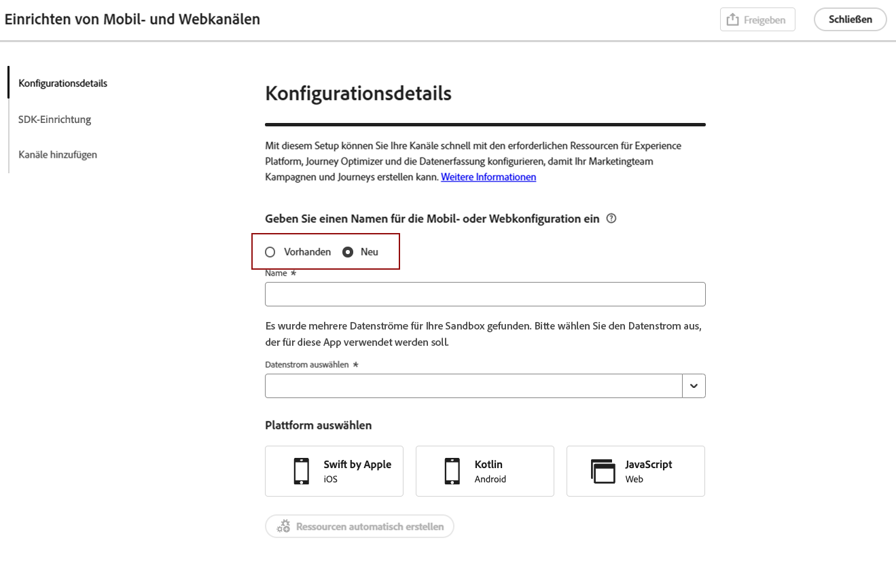
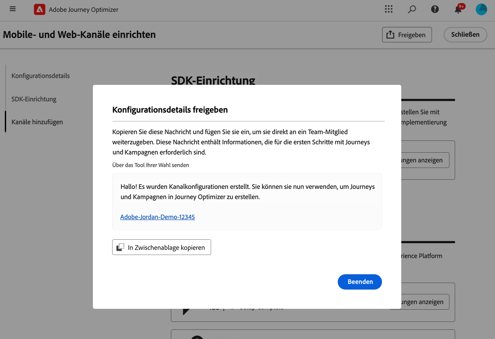
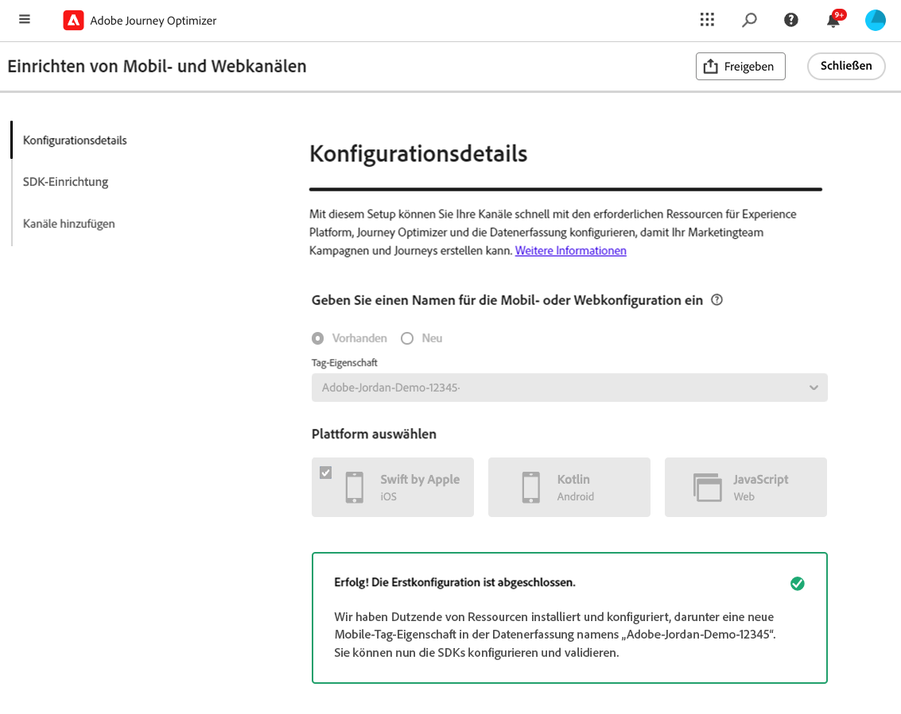
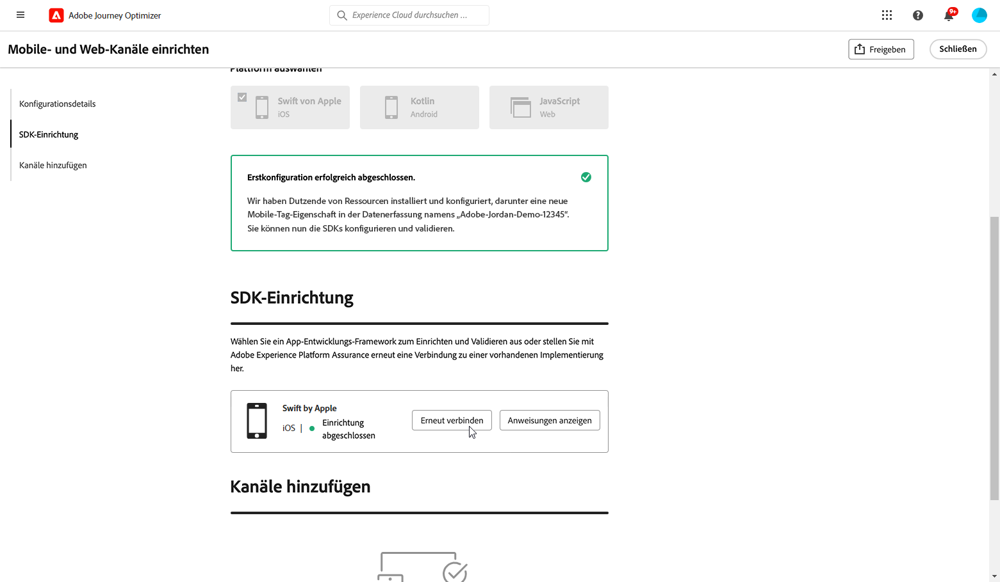
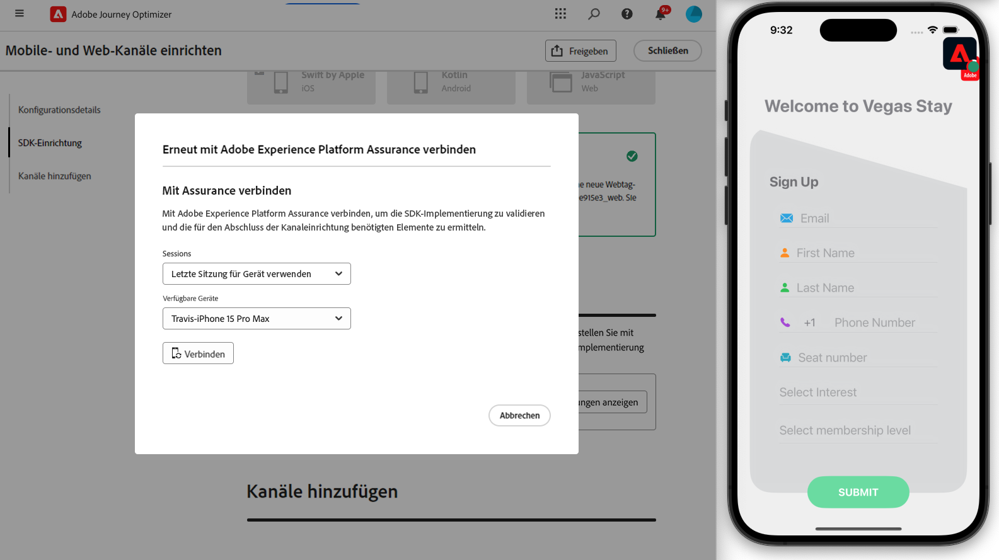

# Erstellen einer Kanaleinrichtung {#set-mobile-ios}

>[!CONTEXTUALHELP]
>id="ajo_mobile_web_setup_javascript_code"
>title="JavaScript-Code"
>abstract="Das Head-Tag enthält wichtige Metadaten und Ressourcen, die vor dem Hauptinhalt Ihrer Web-Seite geladen werden. Durch die Platzierung von Code in diesem Abschnitt wird sichergestellt, dass er ordnungsgemäß initialisiert und frühzeitig ausgeführt wird, sodass Ihre Web-Seite effizient geladen werden und funktionieren kann. Durch Hinzufügen von Code zum Head-Abschnitt können Sie die Struktur, die Leistung und das gesamte Anwendererlebnis Ihrer Website verbessern."

>[!CONTEXTUALHELP]
>id="ajo_mobile_web_setup_push_token"
>title="Abrufen des Geräte-Tokens"
>abstract="Um sicherzustellen, dass das Push-Token des Geräts ordnungsgemäß mit Ihrem Adobe Experience Platform-Profil synchronisiert wird, müssen Sie den folgenden Code in Ihre Anwendung integrieren. Diese Integration ist für die Aufrechterhaltung aktueller Kommunikationskapazitäten und die Sicherstellung eines nahtlosen Anwendererlebnisses unerlässlich."

>[!CONTEXTUALHELP]
>id="ajo_mobile_web_setup_push_xcode"
>title="Starten der Anwendung aus Xcode"
>abstract="Um Ihr Push-Token zu erhalten, starten Sie zunächst Ihre Anwendung mit Xcode. Nachdem die Anwendung gestartet wurde, starten Sie sie neu, um sicherzustellen, dass der Validierungsprozess abgeschlossen ist. Adobe stellt dann Ihr Push-Token als Teil der Validierungsergebnisse bereit. Dieses Token ist für die Aktivierung von Push-Benachrichtigungen unerlässlich und wird angezeigt, sobald das Setup erfolgreich validiert wurde."

>[!CONTEXTUALHELP]
>id="ajo_mobile_web_push_certificate_fcm"
>title="Bereitstellen eines Push-Zertifikats"
>abstract="Ziehen Sie die .json-Datei mit dem privaten Schlüssel per Drag-and-Drop. Diese Datei enthält Authentifizierungsinformationen, die für die sichere Integration und Kommunikation zwischen Ihrer Anwendung und dem Server erforderlich sind."

>[!CONTEXTUALHELP]
>id="ajo_mobile_web_setup_push_certificate"
>title="Bereitstellen eines Push-Zertifikats"
>abstract="Die .p8-Schlüsseldatei enthält einen privaten Schlüssel, mit dem Ihre App auf den Servern von Apple für sichere Push-Benachrichtigungen authentifiziert wird. Sie können diesen Schlüssel über die Seite „Zertifikate“, „Kennungen“ und „Profile“ in Ihrem Entwicklerkonto erwerben."

>[!CONTEXTUALHELP]
>id="ajo_mobile_web_setup_push_key_id"
>title="Schlüssel-ID"
>abstract="Die Schlüssel-ID, eine 10-stellige Zeichenfolge, die bei der Erstellung des p8-Authentifizierungsschlüssels zugewiesen wurde, befindet sich auf der Registerkarte **Schlüssel** auf der Seite „Zertifikate“, „Kennungen“ und „Profile“ in Ihrem Entwicklerkonto."

>[!CONTEXTUALHELP]
>id="ajo_mobile_web_setup_push_team_id"
>title="Team-ID"
>abstract="Die Team-ID, ein Zeichenfolgewert, der zur Identifizierung Ihres Teams verwendet wird, befindet sich auf der Registerkarte **Abonnement** in Ihrem Entwicklerkonto."

Dieses Setup vereinfacht die schnelle Konfiguration von Marketing-Kanälen, sodass alle wichtigen Ressourcen in den Apps Experience Platform, Journey Optimizer und Datenerfassung verfügbar sind. Dadurch kann Ihr Marketing-Team schnell mit der Erstellung von Kampagnen und Journeys beginnen.

1. Klicken Sie auf der Homepage von Journey Optimizer auf **[!UICONTROL Starten]** auf der Karte **[!UICONTROL Mobil- und Web-Kanäle einrichten]**.

   

1. Erstellen Sie eine **[!UICONTROL neue]** Konfiguration.

   Wenn Sie bereits über vorhandene Konfigurationen verfügen, können Sie eine auswählen oder eine neue Konfiguration erstellen.

   

1. Geben Sie einen **[!UICONTROL Namen]** für Ihre neue Konfiguration ein und wählen oder erstellen Sie Ihren **[!UICONTROL Datenstrom]**. Dieser **[!UICONTROL Name]** wird für jede automatisch erstellte Ressource verwendet.

1. Wenn Ihr Unternehmen über mehrere Datenströme verfügt, wählen Sie einen aus den vorhandenen Optionen aus. Wenn Sie über keinen Datenstrom verfügen, wird für Sie automatisch einer erstellt.

1. Wählen Sie die Plattform aus und klicken Sie auf **[!UICONTROL Ressourcen automatisch erstellen]**.

1. Zur Optimierung des Setup-Prozesses werden die erforderlichen Ressourcen automatisch erstellt, um Ihnen die ersten Schritte zu erleichtern. Dazu gehören die Erstellung einer neuen **[!UICONTROL Mobile Tag-Eigenschaft]** und die Installation von Erweiterungen.

[Weitere Informationen zu automatisch erstellten Ressourcen](set-mobile-config.md#auto-create-resources)

1. Nachdem die Erstellung von Ressourcen abgeschlossen ist, befolgen Sie die Anweisungen auf der Benutzeroberfläche, um Ihre SDKs und Kanäle einzurichten und zu validieren.

1. Geben Sie nach Abschluss der Konfiguration die automatisch generierte **[!UICONTROL Kanalkonfiguration]** für die Teammitglieder frei, die für die Erstellung von Journeys und Kampagnen verantwortlich sind.

   {zoomable="yes"}

1. Sie können jetzt in der Kampagnen- oder Journey-Benutzeroberfläche auf die **[!UICONTROL Kanalkonfiguration]** verweisen, sodass eine nahtlose Verbindung zwischen Ihrem Setup und der Ausführung von zielgerichteten Journeys und Kampagnen für Ihre Zielgruppe hergestellt werden kann.

## Ändern einer vorhandenen mobilen Konfiguration {#reconnect}

Nachdem Sie Ihre Konfiguration erstellt haben, können Sie sie jederzeit einfach erneut aufrufen, um zusätzliche Kanäle hinzuzufügen oder weitere Anpassungen an Ihre Anforderungen vorzunehmen.

1. Klicken Sie auf der Homepage von Journey Optimizer auf **[!UICONTROL Starten]** auf der Karte **[!UICONTROL Mobil- und Web-Kanäle einrichten]**.

   

1. Wählen Sie **[!UICONTROL Vorhandene]** und Ihre bestehende **[!UICONTROL Tag-Eigenschaft]** aus der Dropdown-Liste aus.

   

1. Beim Zugriff auf Ihre bestehende Konfiguration müssen Sie eine erneute Verbindung mit Adobe Assurance herstellen. Klicken Sie im SDK-Setup-Menü auf **[!UICONTROL Erneut verbinden]**.

   

1. Wählen Sie Ihr Gerät aus der Dropdownliste **[!UICONTROL Verfügbare Geräte]** aus und klicken Sie auf **[!UICONTROL Verbinden]**.

   {zoomable="yes"}

1. Sie können Ihre Konfiguration jetzt nach Bedarf aktualisieren.

