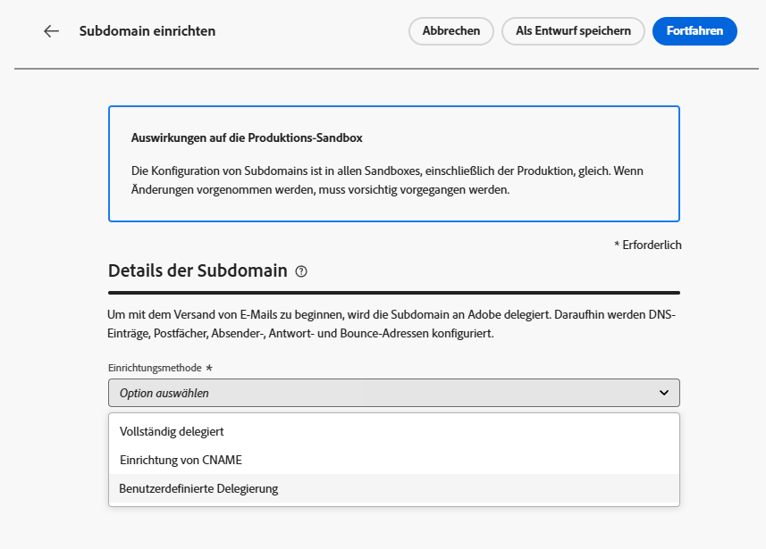
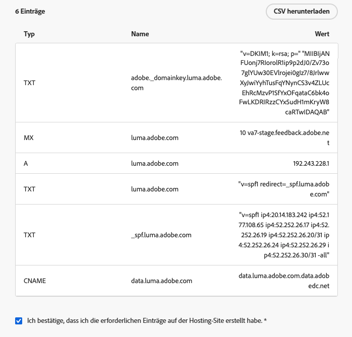
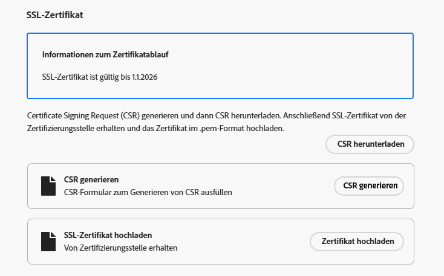
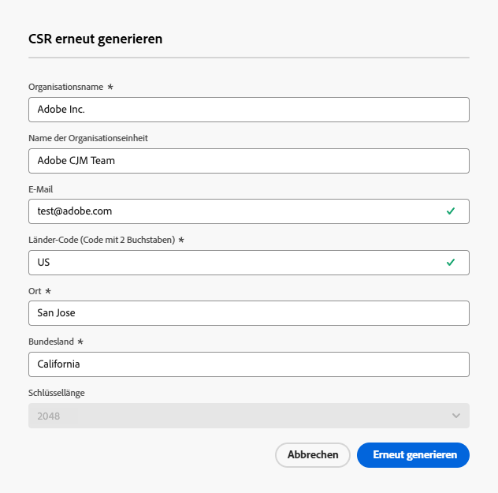
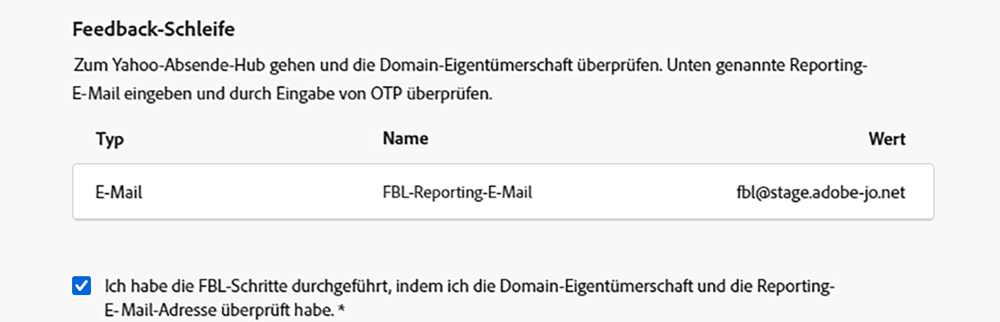

# Einrichten einer benutzerdefinierten Subdomain {#delegate-custom-subdomain}

>[!AVAILABILITY]
>
>Diese Funktion ist nur eingeschränkt verfügbar. Wenden Sie sich an den Adobe-Support, um Zugriff zu erhalten.

Als Alternative zu den Methoden [Vollständig delegiert](about-subdomain-delegation.md#full-subdomain-delegation) und [Einrichtung von CNAME](about-subdomain-delegation.md#subdomain-delegation-methods) können Sie mit der Methode **Benutzerdefinierte Delegierung** die Eigentümerschaft für Ihre Subdomains in Journey Optimizer übernehmen und die generierten Zertifikate vollständig kontrollieren.

Im Rahmen dieses Prozesses muss Adobe sicherstellen, dass Ihr DNS entsprechend für die Bereitstellung, das Rendering und das Tracking von Nachrichten konfiguriert ist. Aus diesem Grund müssen Sie das von der Zertifizierungsstelle erhaltene [SSL-Zertifikat hochladen](#upload-ssl-certificate) und die [Schritte der Feedback-Schleife](#feedback-loop-steps) abschließen, indem Sie Domain-Eigentümerschaft und Reporting-E-Mail-Adresse bestätigen.

Um eine benutzerdefinierte Subdomain einzurichten, führen Sie die folgenden Schritte aus:

1. Öffnen Sie das Menü **[!UICONTROL Administration]** > **[!UICONTROL Kanäle]** > **[!UICONTROL E-Mail-Einstellungen]** > **[!UICONTROL Subdomains]**.

1. Klicken Sie auf **[!UICONTROL Subdomain einrichten]**.

1. Wählen Sie im Abschnitt **[!UICONTROL Einrichtungsmethode]** die Option **[!UICONTROL Benutzerdefinierte Delegierung]** aus.

   {width=90%}

1. Geben Sie den Namen der zu delegierenden Subdomain an.

   >[!CAUTION]
   >
   >Es kann nicht dieselbe Versand-Domain zum Senden von Nachrichten von [!DNL Adobe Journey Optimizer] und von einem anderen Produkt, z. B. [!DNL Adobe Campaign] oder [!DNL Adobe Marketo Engage], verwendet werden.

## Erstellen der DNS-Einträge {#create-dns-records}

>[!CONTEXTUALHELP]
>id="ajo_admin_subdomain_custom_dns"
>title="Erstellen der passenden DNS-Einträge"
>abstract="Zum Delegieren einer benutzerdefinierten Subdomain an Adobe müssen die in der Journey Optimizer-Benutzeroberfläche angezeigten Nameserver-Informationen kopiert und in die Domain-Hosting-Lösung eingefügt werden, um die passenden DNS-Einträge zu generieren."

1. Die Liste der Einträge, die auf Ihren DNS-Servern gespeichert werden sollen, wird angezeigt. Kopieren Sie diese Einträge entweder einzeln oder durch Herunterladen einer CSV-Datei.

1. Navigieren Sie zu Ihrer Domain-Hosting-Lösung, um die entsprechenden DNS-Einträge zu generieren.

1. Stellen Sie sicher, dass alle DNS-Einträge aus den vorherigen Schritten in Ihrer Domain-Hosting-Lösung generiert wurden.

1. Wenn alles ordnungsgemäß konfiguriert ist, aktivieren Sie die Checkbox „Ich bestätige …“.

   {width="75%"}

## Hochladen des SSL-Zertifikats {#upload-ssl-certificate}

>[!CONTEXTUALHELP]
>id="ajo_admin_subdomain_custom-ssl"
>title="Generieren der Certificate Signing Request"
>abstract="Beim Einrichten einer neuen benutzerdefinierten Subdomain müssen Sie die Certificate Signing Request (CSR) generieren, ausfüllen und an die Zertifizierungsstelle senden, um das SSL-Zertifikat zu erhalten, das Sie in Journey Optimizer hochladen müssen."

>[!CONTEXTUALHELP]
>id="ajo_admin_subdomain_key_length"
>title="Auswählen der Schlüssellänge"
>abstract="Die Schlüssellänge kann nur 2.048 oder 4.096 Bit betragen. Sie kann nach dem Senden der Subdomain nicht mehr geändert werden."

1. Klicken Sie im Abschnitt **[!UICONTROL SSL-Zertifikat]** auf **[!UICONTROL CSR generieren]**.

   {width="85%"}

   >[!NOTE]
   >
   >Das Ablaufdatum Ihres SSL-Zertifikats wird angezeigt. Sobald das Datum erreicht ist, müssen Sie ein neues Zertifikat hochladen.

1. Füllen Sie das angezeigte Formular aus und generieren Sie die Certificate Signing Request (CSR).

   {width="70%"}

   >[!NOTE]
   >
   >Die Schlüssellänge kann nur 2.048 oder 4.096 Bit betragen. Sie kann nach dem Senden der Subdomain nicht mehr geändert werden.

1. Klicken Sie auf **[!UICONTROL CSR herunterladen]** und speichern Sie das Formular lokal auf Ihrem Computer. 

1. Senden Sie es an die Zertifizierungsstelle (CA), um Ihr SSL-Zertifikat zu erhalten. Bevor Sie diese CSR zur Signierung an Ihre Zertifizierungsstelle senden, sollten Sie einige wichtige Punkte beachten:

   * Die heruntergeladene CSR aus Schritt 3 gilt nur für data.subdomain.com.

   * Das Zertifikat sollte jedoch sowohl data.subdomain.com als auch cdn.subdomain.com als Subject Alternative Names (SAN)-Einträge in einem einzigen Zertifikat abdecken. Wenn Sie beispielsweise example.adobe.com delegieren, entspricht data.subdomain.com dem Eintrag data.example.adobe.com und cdn.subdomain.com entspricht cdn.example.adobe.com.

   * Die Subdomains „Data“ (data.example.adobe.com) und „CDN“ (cdn.example.adobe.com) müssen als Peer-Einträge im selben Zertifikat hinzugefügt werden.

   * Die meisten Zertifizierungsstellen ermöglichen es Ihnen, während des Signiervorgangs zusätzliche SANs hinzuzufügen (z. B. die Subdomain „CDN“).

      * Das ist über das CA-Portal (empfohlen, falls verfügbar) oder
      * durch manuelles Anfragen beim Support-Team möglich, sollte die Portaloption nicht verfügbar sein.

   * Nach der Signierung stellt die Zertifizierungsstelle ein einziges Zertifikat aus, das sowohl die Domain „Data“ als auch die Subdomain „CDN“ umfasst.

1. Klicken Sie nach dem Erhalt auf **[!UICONTROL SSL-Zertifikat hochladen]** und laden Sie das Zertifikat im .pem-Format mit der vollständigen Zertifikatkette in [!DNL Journey Optimizer] hoch. Im Folgenden finden Sie ein Beispiel für ein .pem-Dateiformat:

   ```
   -----BEGIN CERTIFICATE-----
   MIIDXTCCAkWgAwIBAgIJALc3... (base64 encoded data)
   -----END CERTIFICATE-----
   ```

<!--
>[!CAUTION]
>
>Both Data and CDN subdomains must be included in the same certificate.
-->

## Abschließen der Schritte der Feedback-Schleife {#feedback-loop-steps}

>[!CONTEXTUALHELP]
>id="ajo_admin_subdomain_feedback-loop"
>title="Abschließen der Schritte der Feedback-Schleife"
>abstract="Rufen Sie das Yahoo! Sender Hub auf und füllen Sie das Formular aus, um zu überprüfen, wem die Domain gehört. Geben Sie die unten aufgeführte E-Mail-Adresse für das FBL-Reporting ein und verwenden Sie das daraufhin erhaltene OTP für die Verifizierung der Besitzverhältnisse im Yahoo! Sender Hub ein."

1. Rufen Sie die Website [Yahoo! Sender Hub](https://senders.yahooinc.com/) auf und füllen Sie das Formular aus, um zu überprüfen, ob die Domain Ihnen gehört. 

1. Für die Prüfung der Domain-Eigentümerschaft erfordert Yahoo! Sender Hub die Eingabe einer E-Mail-Adresse. Geben Sie die FBL-Reporting-E-Mail-Adresse ein, die unter **[!UICONTROL Wert]** aufgeführt ist. Dies ist eine Adobe-eigene E-Mail-Adresse.

1. Wenn Yahoo! Sender Hub ein Einmalkennwort (OTP) generiert, wird es an diese Adobe-Adresse gesendet.

1. Wenden Sie sich an das Adobe Zustellbarkeits-Team, das Ihnen dieses OTP zur Verfügung stellt. <!--Specify how to reach out + any information that customer should share in the request to deliverability team to get access to the right OTP-->

   >[!CAUTION]
   >
   >Das OTP ist nur 24 Stunden lang gültig. Stellen Sie daher sicher, dass Sie Adobe kontaktieren, sobald das OTP generiert wurde. <!--TBC?-->
   >
   >OTP-Anfragen können nur an Wochentagen gestellt werden. An Wochenenden ist kein Support möglich. <!--Add times + timezone-->

1. Geben Sie das OTP auf Yahoo! Sender Hub ein.

1. Vergewissern Sie sich, dass Sie alle Schritte der Feedback-Schleife ausgeführt haben.

1. Wenn alles ordnungsgemäß konfiguriert ist, aktivieren Sie die Option „Ich bestätige …“.

   {width="85%"}

1. Klicken Sie auf **[!UICONTROL Weiter]** und warten Sie, bis Adobe bestätigt, dass diese Einträge in Ihrer Hosting-Lösung fehlerfrei generiert wurden. Dieser Vorgang kann bis zu 2 Minuten dauern.

   >[!NOTE]
   >
   >Stellen Sie vor dem Fortfahren sicher, dass alle Einträge ordnungsgemäß erstellt wurden.

1. Adobe generiert einen SSL-CDN-URL-Validierungseintrag. Kopieren Sie diesen Validierungseintrag in Ihre Hosting-Plattform. Wenn Sie diesen Eintrag ordnungsgemäß in Ihrer Hosting-Lösung erstellt haben, aktivieren Sie die Option „Ich bestätige …“.

1. Klicken Sie auf **[!UICONTROL Senden]**, damit Adobe die erforderlichen Prüfungen durchführt. [Weitere Informationen](delegate-subdomain.md#submit-subdomain)

## Fehlerbehebung – Checkliste {#check-list}

Wenn beim Senden Ihrer benutzerdefinierten Subdomain Fehler auftreten, führen Sie die unten aufgeführten Fehlerbehebungsaktionen durch.

* Vergewissern Sie sich, dass alle DNS-Einträge ordnungsgemäß mit den DNS-Lookup-Tools übertragen wurden.

* Vergewissern Sie sich vor dem Hochladen, dass Ihr Zertifikat alle technischen Anforderungen erfüllt.

* Stellen Sie sicher, dass Ihr Zertifikat im korrekten Format hochgeladen wird.
