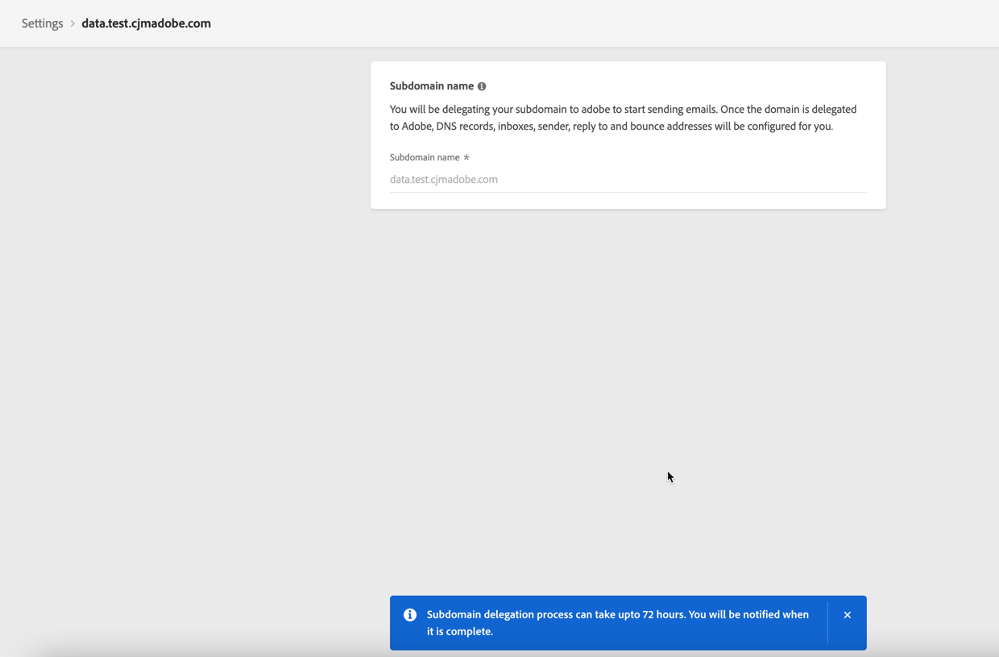

# Subdomäne delegieren

Mit Journey Optimizer können Sie Ihre Subdomänen vollständig an die Adobe delegieren. Auf diese Weise kann Adobe Nachrichten als verwalteten Dienst bereitstellen, indem sie alle DNS-Aspekte kontrolliert und pflegt, die für die Bereitstellung, Wiedergabe und Verfolgung von E-Mail-Kampagnen erforderlich sind.

>[!NOTE]
>
>Sie können bis zu 10 Subdomänen delegieren.
>
>Die Verwendung von CNAMEs für Subdomänendelegation wird von Journey Optimizer derzeit nicht unterstützt.

Gehen Sie wie folgt vor, um eine neue Subdomäne zu delegieren:

1. Rufen Sie das Menü **[!UICONTROL Message Configuration]** / **[!UICONTROL Subdomain delegation]** auf und klicken Sie dann auf **[!UICONTROL Subdomäne]** delegieren.

   

1. Geben Sie den Namen der Subdomäne an, die delegiert werden soll.

1. Die Liste der Einträge, die auf Ihren DNS-Servern gespeichert werden sollen, wird angezeigt. Kopieren Sie diese Einträge entweder einzeln oder durch Herunterladen einer CSV-Datei, und navigieren Sie dann zu Ihrer Domain-Hosting-Lösung, um die passenden DNS-Einträge zu generieren.

   Stellen Sie sicher, dass alle DNS-Datensätze in Ihrer Domänenhostinglösung generiert wurden. Wenn alles richtig konfiguriert ist, markieren Sie das Kästchen &quot;Ich versichere...&quot; und klicken Sie dann auf **[!UICONTROL Senden]**.

   

   >[!NOTE]
   >
   >Sie können die Datensätze erstellen und die Subdomänenkonfiguration später mit der Schaltfläche **[!UICONTROL Als Entwurf speichern]** übermitteln. Anschließend können Sie die Subdomänendelegation wieder aufnehmen, indem Sie sie aus der Subdomänen-Liste öffnen.

1. Sobald die Subdomänendelegation gesendet wurde, wird die Subdomäne in der Liste mit dem Status **[!UICONTROL Verarbeitung]** angezeigt. Weitere Informationen zu den Status von Subdomänen finden Sie in [diesem Abschnitt](access-subdomains.md).

   

   Die folgenden Konfigurationsüberprüfungen werden durchgeführt, bis die Subdomäne überprüft wird und zum Konfigurieren von Nachrichtenvorgaben zum Senden von Nachrichten verwendet werden kann:

   1. NS records,
   1. DNS-Erstellung,
   1. URLs-Konfiguration,
   1. Prüfung der Lieferbarkeit.

   Sie können den Überprüfungsvorgang für eine Subdomäne jederzeit verfolgen, indem Sie sie aus der Liste öffnen.

   

1. Sobald die Prüfungen erfolgreich sind, werden Sie benachrichtigt xxxxx (!!wobei die Benutzer benachrichtigt werden: Müssen Sie die Seite manuell überprüfen oder per E-Mail/Benachrichtigung im Puls?)

   Die Subdomäne erhält das **[!UICONTROL Success]** (!!oder Geprüft?) -Status und ist nun bereit, um Nachrichten zu senden. Weitere Informationen zu den Status von Subdomänen finden Sie in [diesem Abschnitt](access-subdomains.md).

   Sie können auf detaillierte Informationen zugreifen, indem Sie die Subdomäne aus der Liste öffnen:

   * Rufen Sie den während des Delegierungsprozesses konfigurierten Subdomänennamen (schreibgeschützt) sowie die generierten URLs (Ressourcen, Mirrorseite, Tracking-URLs) ab,
   * hinzufügen Sie einen TXT-Eintrag zur Überprüfung Ihrer Subdomäne durch Google-Site an, um sicherzustellen, dass er überprüft wird (siehe [Hinzufügen einen Google TXT-Datensatz zu einer Subdomäne](google-txt.md)).
   
