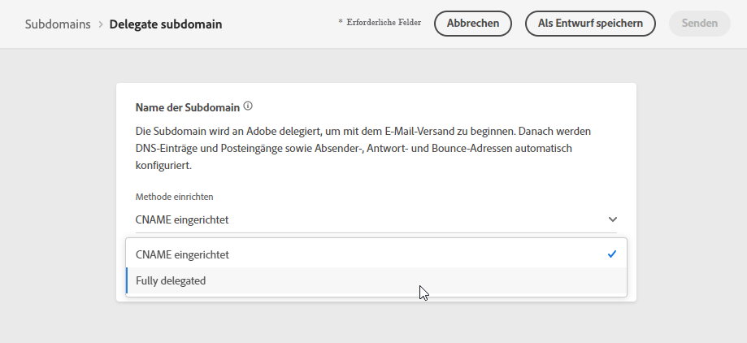
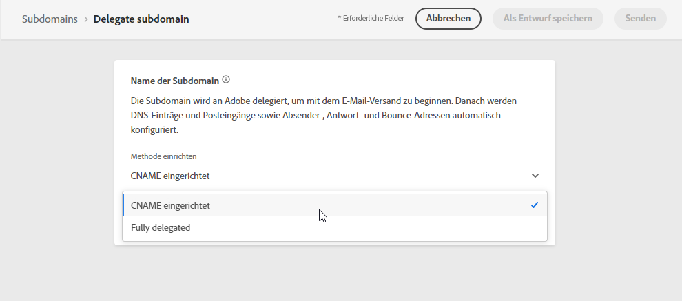
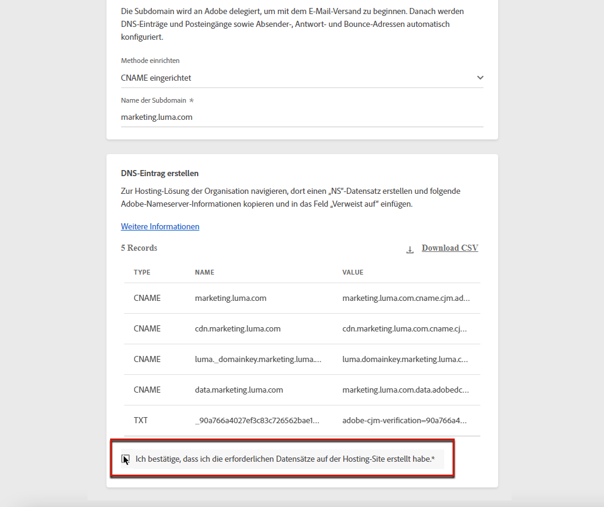

# Zuweisen einer Subdomain

Der Eigentümer eines Domain-Namens (technisch: einer DNS-Zone) kann einer anderen Entität eine Untergliederung des Domain-Namens (technisch: eine untergeordnete DNS-Zone) zuzuweisen. Grundsätzlich können Sie als Kunde die Unterzone „marketing.example.com“ an Adobe delegieren, wenn Sie die Zone „example.com“ bearbeiten.

Durch das Zuweisen einer Subdomain an [!DNL Journey Optimizer] kann Adobe sicherstellen, dass Kunden die DNS-Infrastruktur bereitgestellt wird, die zur Erfüllung der branchenüblichen Zustellbarkeits-Anforderungen an Domains zum E-Mail-Marketing-Versand erforderlich ist. Gleichzeitig verwaltet und kontrolliert Adobe auch das DNS für die unternehmensinternen E-Mail-Domains.

## Vollständige Subdomain-Zuweisung {#full-subdomain-delegation}

[!DNL Journey Optimizer] ermöglicht die vollständige Zuweisung Ihrer Subdomains an Adobe direkt über die Benutzeroberfläche des Produkts. Auf diese Weise kann Adobe Nachrichten als Managed Service bereitstellen, indem alle Aspekte des DNS, die für die Zustellung, das Rendering und das Tracking von E-Mail-Kampagnen erforderlich sind, kontrolliert und verwaltet werden.

>[!NOTE]
>
>Standardmäßig können Sie mit dem Lizenzvertrag für [!DNL Journey Optimizer] bis zu 10 Subdomains zuweisen. Wenden Sie sich an Ihren Ansprechpartner bei Adobe, wenn Sie diese Einschränkung erhöhen möchten.

Gehen Sie wie folgt vor, um eine neue Subdomain zuzuweisen:

1. Zugriff auf **[!UICONTROL Administration]** > **[!UICONTROL Kanäle]** > **[!UICONTROL Subdomains]** Menü und klicken Sie auf **[!UICONTROL Einrichten der Subdomain]**.

   

1. Auswählen **[!UICONTROL Vollständig delegiert]** von **[!UICONTROL Einrichten der Methode]** Abschnitt.

   

1. Geben Sie den Namen der zuzuweisenden Subdomain an.

   

   >[!CAUTION]
   >
   >Es ist nicht zulässig, Adobe eine ungültige Subdomain zuzuweisen. Vergewissern Sie sich, dass Sie eine gültige Subdomain eingeben, die Ihrem Unternehmen gehört, z. B. marketing.ihrunternehmen.com.
   >
   >Beachten Sie, dass Subdomains mit mehreren Ebenen, wie email.marketing.ihrunternehmen.com, derzeit nicht unterstützt werden.

1. Die Liste der Einträge, die auf Ihren DNS-Servern gespeichert werden sollen, wird angezeigt. Kopieren Sie diese Einträge entweder einzeln oder durch Herunterladen einer CSV-Datei, und navigieren Sie dann zu Ihrer Domain-Hosting-Lösung, um die passenden DNS-Einträge zu generieren.

1. Stellen Sie sicher, dass alle DNS-Einträge aus den vorherigen Schritten in Ihrer Domain-Hosting-Lösung generiert wurden. Wenn alles ordnungsgemäß konfiguriert ist, aktivieren Sie die Checkbox „Ich bestätige...“ und klicken Sie dann auf **[!UICONTROL Senden]**.

   

   >[!NOTE]
   >
   >Sie können die Einträge erstellen und die Subdomain-Konfiguration später über die Schaltfläche **[!UICONTROL Als Entwurf speichern]** übermitteln. Anschließend können Sie die Zuweisung der Subdomain fortsetzen, indem Sie sie über die Liste der Subdomains öffnen.

1. Sobald die vollständige Subdomain-Zuweisung gesendet wurde, wird die Subdomain in der Liste mit der **[!UICONTROL Verarbeitung]** Status. Weiterführende Informationen zum Status von Subdomains finden Sie in [diesem Abschnitt](access-subdomains.md).

   

   Bevor Sie diese Subdomain zum Senden von Nachrichten verwenden können, müssen Sie warten, bis Adobe die erforderlichen Prüfungen durchgeführt hat, die bis zu drei Stunden dauern können. Weiterführende Informationen finden Sie in diesem [Abschnitt](#subdomain-validation).

   >[!NOTE]
   >
   >Alle fehlenden Datensätze, d. h. die noch nicht in Ihrer Hosting-Lösung erstellten Datensätze, werden aufgelistet.

1. Sobald die Prüfungen erfolgreich abgeschlossen wurden, erhält die Subdomain den Status **[!UICONTROL Erfolgreich]**. Sie kann nun zum Versand von Nachrichten verwendet werden.

   >[!NOTE]
   >
   >Die Subdomain wird als **[!UICONTROL Fehlgeschlagen]** , wenn Sie den Validierungsdatensatz nicht in Ihrer Hosting-Lösung erstellen.

   <!-- later on, users will be notified in Pulse -->

Nachdem eine Subdomain an die Adobe in [!DNL Journey Optimizer], wird automatisch ein PTR-Eintrag erstellt und dieser Subdomain zugeordnet. [Weitere Informationen](ptr-records.md)

>[!CAUTION]
>
>Die parallele Ausführung von Subdomains wird derzeit nicht unterstützt in [!DNL Journey Optimizer]. Wenn Sie versuchen, eine Subdomain für die Zuweisung zu senden, wenn eine andere über die **[!UICONTROL Verarbeitung]** -Status, erhalten Sie eine Fehlermeldung.

## CNAME-Subdomain-Zuweisung {#cname-subdomain-delegation}

Wenn Sie Domain-spezifische Einschränkungsrichtlinien haben und möchten, dass die Adobe nur eine teilweise Kontrolle über das DNS hat, können Sie alle DNS-bezogenen Aktivitäten auf Ihrer Seite durchführen.

Mit der Subdomain-Zuweisung von CNAME können Sie eine Subdomain erstellen und CNAMEs verwenden, um auf Adobe-spezifische Datensätze zu verweisen. Mit dieser Konfiguration sind Sie und Adobe gemeinsam für die Pflege des DNS verantwortlich, um eine Umgebung für das Senden, Rendern und Tracking von E-Mails einzurichten.

>[!CAUTION]
>
>Diese Methode wird empfohlen, wenn die Richtlinien Ihres Unternehmens die Methode der vollständigen Subdomain-Zuweisung einschränken. Dieser Ansatz erfordert, dass Sie DNS-Einträge selbst verwalten und verwalten. Adobe kann das DNS für eine Subdomain, die über die CNAME-Methode konfiguriert wurde, nicht ändern, verwalten oder verwalten.

Gehen Sie wie folgt vor, um eine Subdomain mit CNAME zuzuweisen:

1. Zugriff auf **[!UICONTROL Administration]** > **[!UICONTROL Kanäle]** > **[!UICONTROL Subdomains]** Menü und klicken Sie auf **[!UICONTROL Einrichten der Subdomain]**.

1. Wählen Sie die **[!UICONTROL CNAME-Einrichtung]** -Methode.

   

   <!--The steps to specify the name of the subdomain to delegate and to generate the DNS records into your domain hosting solution are the same as for full subdomain delegation. See **steps 3 to 5** of the [Full subdomain delegation](#full-subdomain-delegation) section.)-->

1. Geben Sie den Namen der zuzuweisenden Subdomain an.

   >[!CAUTION]
   >
   >Es ist nicht zulässig, Adobe eine ungültige Subdomain zuzuweisen. Vergewissern Sie sich, dass Sie eine gültige Subdomain eingeben, die Ihrem Unternehmen gehört, z. B. marketing.ihrunternehmen.com.
   >
   >Beachten Sie, dass Subdomains mit mehreren Ebenen, wie email.marketing.ihrunternehmen.com, derzeit nicht unterstützt werden.

1. Die Liste der Einträge, die auf Ihren DNS-Servern gespeichert werden sollen, wird angezeigt. Kopieren Sie diese Einträge entweder einzeln oder durch Herunterladen einer CSV-Datei, und navigieren Sie dann zu Ihrer Domain-Hosting-Lösung, um die passenden DNS-Einträge zu generieren.

1. Stellen Sie sicher, dass alle DNS-Einträge aus den vorherigen Schritten in Ihrer Domain-Hosting-Lösung generiert wurden. Wenn alles ordnungsgemäß konfiguriert ist, aktivieren Sie das Kontrollkästchen &quot;Ich bestätigen..&quot;.

   

   >[!NOTE]
   >
   >Sie können die Datensätze später mithilfe der **[!UICONTROL Als Entwurf speichern]** Schaltfläche. Anschließend können Sie die Zuweisung der Subdomain zu diesem Zeitpunkt fortsetzen, indem Sie sie über die Liste der Subdomains öffnen.

1. Warten Sie, bis Adobe überprüft, ob diese Datensätze in Ihrer Hosting-Lösung fehlerfrei generiert wurden. Dieser Vorgang kann bis zu 2 Minuten dauern.

   >[!NOTE]
   >
   >Alle fehlenden Datensätze, d. h. die noch nicht in Ihrer Hosting-Lösung erstellten Datensätze, werden aufgelistet.

1. Adobe generiert einen SSL-CDN-URL-Validierungsdatensatz. Kopieren Sie diesen Validierungsdatensatz in Ihre Hosting-Plattform. Wenn Sie diesen Datensatz ordnungsgemäß in Ihrer Hosting-Lösung erstellt haben, aktivieren Sie das Kontrollkästchen &quot;Ich bestätigen..&quot; und klicken Sie dann auf . **[!UICONTROL Einsenden]**.

   

   >[!NOTE]
   >
   >Sie können auch den Validierungsdatensatz erstellen und die Subdomain-Konfiguration später mit der **[!UICONTROL Als Entwurf speichern]** Schaltfläche. Anschließend können Sie die Zuweisung der Subdomain fortsetzen, indem Sie sie über die Liste der Subdomains öffnen.

1. Sobald die Subdomain-Zuweisung mit CNAME gesendet wurde, wird die Subdomain in der Liste mit der **[!UICONTROL Verarbeitung]** Status. Weiterführende Informationen zum Status von Subdomains finden Sie in [diesem Abschnitt](access-subdomains.md).

   Bevor Sie diese Subdomain zum Senden von Nachrichten verwenden können, müssen Sie warten, bis die Adobe die erforderlichen Prüfungen durchführt. Diese dauert in der Regel 2 bis 3 Stunden. Weiterführende Informationen finden Sie in diesem [Abschnitt](#subdomain-validation).

1. Nach erfolgreicher Überprüfung<!--i.e Adobe validates the record you created and installs it-->, erhält die Subdomäne die **[!UICONTROL Erfolg]** Status. Sie kann nun zum Versand von Nachrichten verwendet werden.

   >[!NOTE]
   >
   >Die Subdomain wird als **[!UICONTROL Fehlgeschlagen]** , wenn Sie den Validierungsdatensatz nicht in Ihrer Hosting-Lösung erstellen.

Nach der Validierung des Datensatzes und der Installation des Zertifikats erstellt Adobe automatisch den PTR-Datensatz für die CNAME-Subdomain. [Weitere Informationen](ptr-records.md)

>[!CAUTION]
>
>Die parallele Ausführung von Subdomains wird derzeit nicht unterstützt in [!DNL Journey Optimizer]. Wenn Sie versuchen, eine Subdomain für die Zuweisung zu senden, wenn eine andere über die **[!UICONTROL Verarbeitung]** -Status, erhalten Sie eine Fehlermeldung.

## Subdomain-Validierung {#subdomain-validation}

Die folgenden Prüfungen und Aktionen werden durchgeführt, bis die Subdomain verifiziert ist und zum Senden von Nachrichten verwendet werden kann.

>[!NOTE]
>
>Diese Schritte werden von Adobe ausgeführt, was bis zu drei Stunden dauern kann.

1. **Vorab-Validierung**: Adobe überprüft, ob die Subdomain an das Adobe DNS delegiert wurde (NS-Eintrag, SOA-Eintrag, Zoneneinrichtung, Eigentümereintrag). Wenn der Vorab-Validierungsschritt fehlschlägt, wird ein Fehler zusammen mit dem entsprechenden Grund zurückgegeben. Andernfalls fährt Adobe mit dem nächsten Schritt fort.

1. **Konfigurieren des DNS für die Domain**:

   * **MX-Eintrag**: E-Mail-eXchange-Eintrag – Mail-Server-Eintrag, der eingehende E-Mails verarbeitet, die an die Subdomain gesendet werden.
   * **SPF-Eintrag**: Sender Policy Framework-Eintrag – Listet die IPs der E-Mail-Server auf, die E-Mails von der Subdomain senden können.
   * **DKIM-Datensatz**: DomainKeys Identified Mail-Standardeintrag – Verwendet eine Verschlüsselung mit öffentlichem und privatem Schlüssel zur Authentifizierung der Nachricht, um Spoofing zu verhindern.
   * **A**: Standard-IP-Zuordnung.
   * **CNAME**: Ein kanonischer Name oder CNAME-Eintrag ist ein DNS-Record-Typ, der einen Aliasnamen einem true- oder kanonischen Domänennamen zuordnet.

1. **Erstellen von Tracking- und Mirror-URLs**: Wenn die Domain email.example.com ist, lautet die Tracking-/Mirror-Domain data.email.example.com. Sie wird durch die Installation des SSL-Zertifikats gesichert.

1. **Bereitstellung von CDN CloudFront**: Wenn das CDN noch nicht eingerichtet ist, stellt es Adobe für die IMS-Org bereit.

1. **Erstellen einer CDN-Domain**: Wenn die Domain email.example.com ist, lautet die CDN-Domain cdn.email.example.com.

1. **Erstellen und Anfügen eines CDN-SSL-Zertifikats**: Adobe erstellt das CDN-Zertifikat für die CDN-Domain und hängt es dort an.

1. **Weiterleitungs-DNS erstellen**: Wenn dies die erste Subdomain ist, die Sie delegieren, erstellt Adobe das Weiterleitungs-DNS, das zum Erstellen von PTR-Einträgen erforderlich ist – einem für jede Ihrer IPs.

1. **PTR-Eintrag erstellen**: PTR-Einträge, auch als Reverse-DNS-Eintrag bezeichnet, werden von den ISPs benötigt, damit sie die E-Mails nicht als Spam kennzeichnen. Gmail empfiehlt auch, für jede IP-Adresse PTR-Einträge zu haben. Adobe erstellt PTR-Einträge nur, wenn Sie eine Subdomain zum ersten Mal zuweisen, eine für jede IP, alle IPs, die auf diese Subdomain verweisen. Wenn die IP beispielsweise *192.1.2.1* und die Subdomain *email.example.com* lautet, lautet der PTR-Eintrag: *192.1.2.1 PTR r1.email.example.com*. Sie können den PTR-Eintrag anschließend aktualisieren, um auf die neue zugewiesene Domain zu verweisen. [Weitere Informationen zu PTR-Datensätzen](ptr-records.md)
