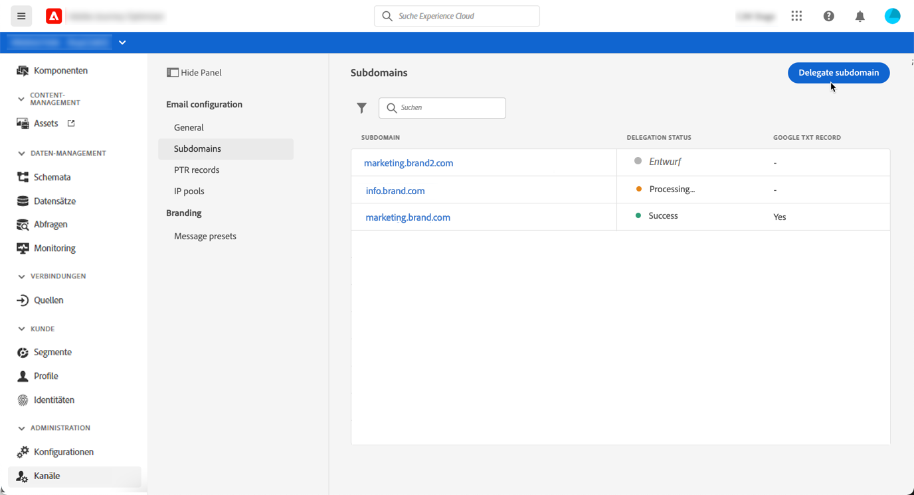
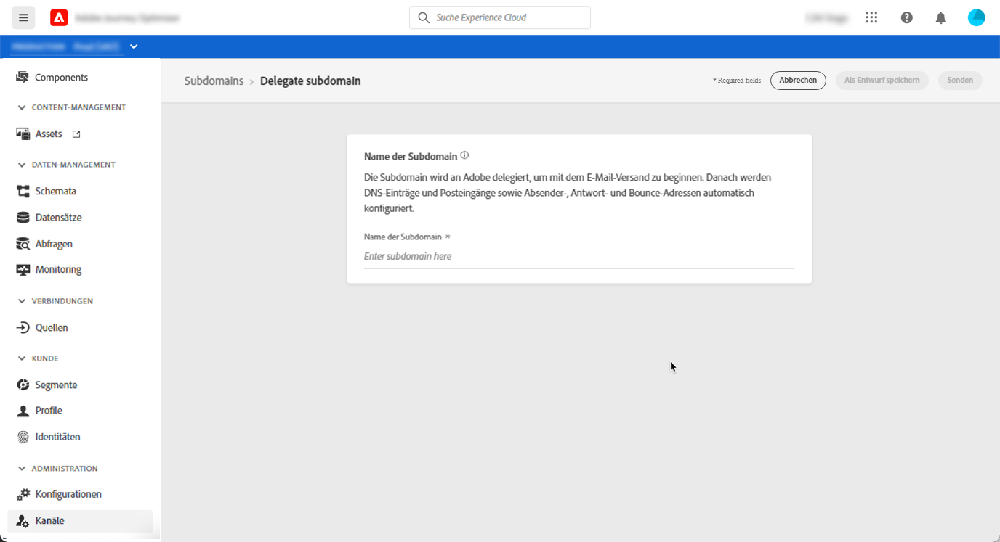
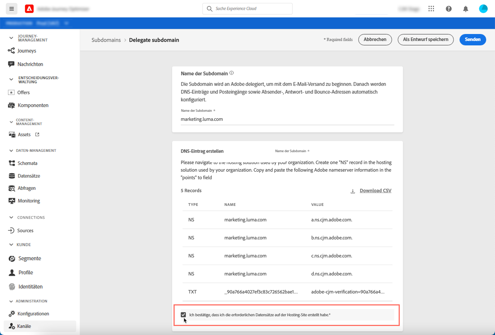
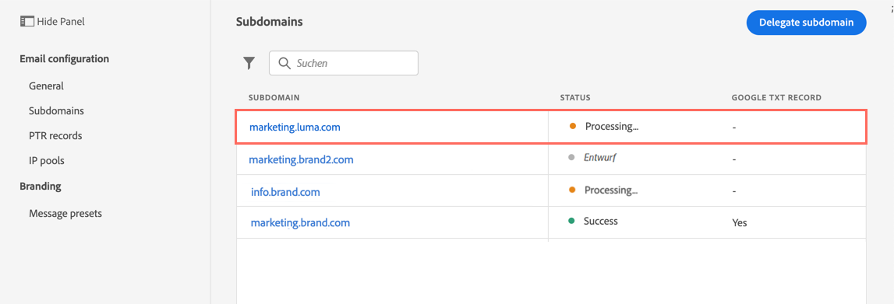
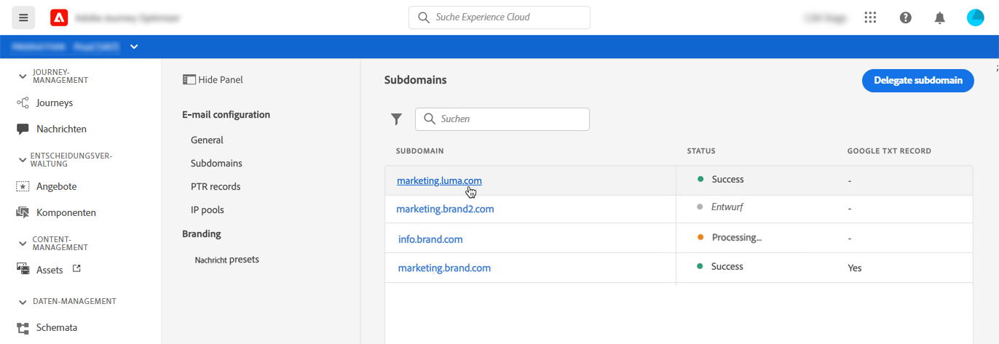

# Zuweisen einer Subdomain

Der Eigentümer eines Domain-Namens (technisch: einer DNS-Zone) kann einer anderen Entität eine Untergliederung des Domain-Namens (technisch: eine untergeordnete DNS-Zone) zuzuweisen. Wenn also ein Kunde die Zone „example.com“ verwaltet, kann er Adobe die untergeordnete Zone „marketing.example.com“ zuweisen.

Durch das Zuweisen einer Subdomain an [!DNL Journey Optimizer] kann Adobe sicherstellen, dass Kunden die DNS-Infrastruktur bereitgestellt wird, die zur Erfüllung der branchenüblichen Zustellbarkeits-Anforderungen an Domains zum E-Mail-Marketing-Versand erforderlich ist. Gleichzeitig verwaltet und kontrolliert Adobe auch das DNS für die unternehmensinternen E-Mail-Domains.

[!DNL Journey Optimizer] ermöglicht die vollständige Zuweisung Ihrer Subdomains an Adobe direkt über die Benutzeroberfläche des Produkts. Auf diese Weise kann Adobe Nachrichten als Managed Service bereitstellen, indem alle Aspekte des DNS, die für die Zustellung, das Rendering und das Tracking von E-Mail-Kampagnen erforderlich sind, kontrolliert und verwaltet werden.

>[!NOTE]
>
>Standardmäßig können Sie mit dem Lizenzvertrag für [!DNL Journey Optimizer] bis zu 10 Subdomains zuweisen. Wenden Sie sich an Ihren Ansprechpartner bei Adobe, wenn Sie diese Einschränkung erhöhen möchten.
>
>Die Verwendung von CNAMEs für die Zuweisung von Subdomains wird von Journey Optimizer derzeit nicht unterstützt.

Gehen Sie wie folgt vor, um eine neue Subdomain zuzuweisen:

1. Rufen Sie das Menü **[!UICONTROL Kanäle]**/**[!UICONTROL Subdomains]** auf und klicken Sie dann auf **[!UICONTROL Subdomain zuweisen]**.

   

1. Geben Sie den Namen der zuzuweisenden Subdomain an.

   

   >[!CAUTION]
   >
   >Es ist nicht zulässig, Adobe eine ungültige Subdomain zuzuweisen. Vergewissern Sie sich, dass Sie eine gültige Subdomain eingeben, die Ihrem Unternehmen gehört, z. B. marketing.yourcompany.com.
   >
   >Beachten Sie, dass mehrstufige Subdomains wie email.marketing.yourcompany.com derzeit nicht unterstützt werden.

1. Die Liste der Einträge, die auf Ihren DNS-Servern gespeichert werden sollen, wird angezeigt. Kopieren Sie diese Einträge entweder einzeln oder durch Herunterladen einer CSV-Datei, und navigieren Sie dann zu Ihrer Domain-Hosting-Lösung, um die passenden DNS-Einträge zu generieren.

   Stellen Sie sicher, dass alle DNS-Einträge aus den vorherigen Schritten in Ihrer Domain-Hosting-Lösung generiert wurden. Wenn alles ordnungsgemäß konfiguriert ist, aktivieren Sie die Checkbox „Ich bestätige...“ und klicken Sie dann auf **[!UICONTROL Senden]**.

   

   >[!NOTE]
   >
   >Sie können die Einträge erstellen und die Subdomain-Konfiguration später über die Schaltfläche **[!UICONTROL Als Entwurf speichern]** übermitteln. Anschließend können Sie die Zuweisung der Subdomain fortsetzen, indem Sie sie über die Liste der Subdomains öffnen.

1. Nachdem die Subdomain-Zuweisung übermittelt wurde, wird die Subdomain in der Liste mit dem Status **[!UICONTROL In Verarbeitung]** angezeigt. Weiterführende Informationen zum Status von Subdomains finden Sie in [diesem Abschnitt](access-subdomains.md).

   Die folgenden Prüfungen und Aktionen werden durchgeführt, bis die Subdomain verifiziert ist und zum Senden von Nachrichten verwendet werden kann.

   Dieser Schritt wird von Adobe ausgeführt und kann bis zu 3 Stunden dauern.

   1. Überprüfung, ob die Subdomain an das Adobe-DNS (NS-Eintrag, SOA-Eintrag, Zonen-Setup, Eigentümer-Eintrag) zugewiesen wurde.
   1. Konfigurieren des DNS für die Domain,
   1. Erstellen von Tracking- und Mirror-URLs,
   1. Bereitstellen der CDN-Cloud-Front,
   1. Erstellen, Validieren und Anhängen des CDN-SSL-Zertifikats,
   1. Erstellen des Weiterleitungs-DNS,
   1. Erstellen des PTR-Eintrags.

   

1. Sobald die Prüfungen erfolgreich abgeschlossen wurden, erhält die Subdomain den Status **[!UICONTROL Erfolgreich]**. Sie kann nun zum Versand von Nachrichten verwendet werden.

   <!-- later on, users will be notified in Pulse -->

   

