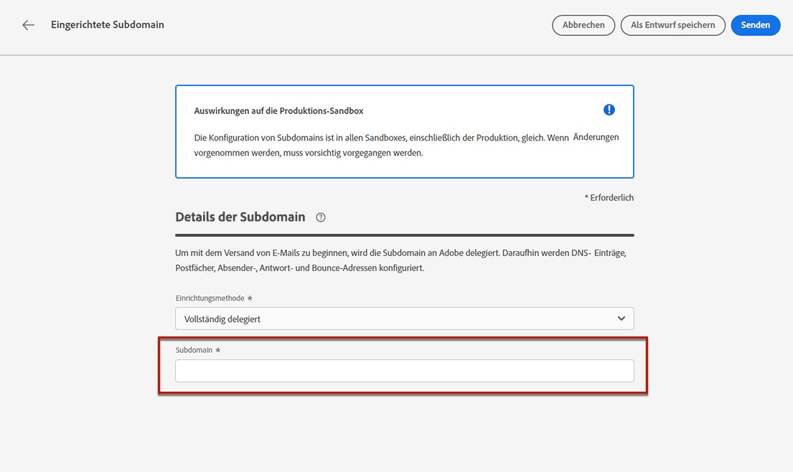
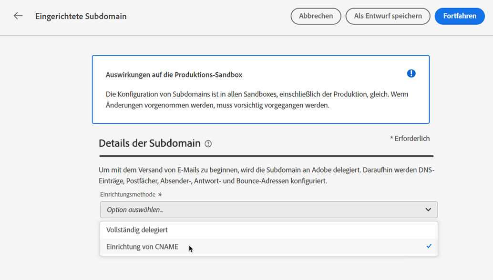
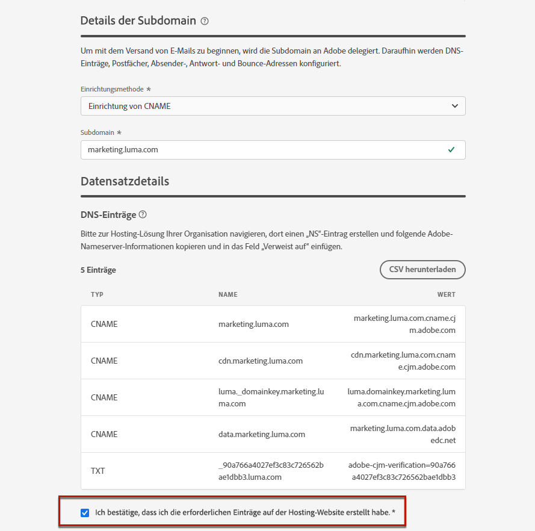

# Zuweisen einer Subdomain {#delegate-subdomain}

>[!CONTEXTUALHELP]
>id="ajo_admin_subdomainname"
>title="Subdomain-Zuweisung"
>abstract="Mit Journey Optimizer können Sie Ihre Subdomains Adobe zuweisen. Sie können eine Subdomain vollständig Adobe zuweisen, was die empfohlene Methode ist. Sie können auch eine Subdomain mit CNAME erstellen, um auf Adobe-spezifische Einträge zu verweisen. Für diesen Ansatz müssen Sie jedoch DNS-Einträge selbst verwalten und verwalten."
>additional-url="https://experienceleague.adobe.com/docs/journey-optimizer/using/configuration/configuration-message/email-configuration/delegate-subdomains/about-subdomain-delegation.html#subdomain-delegation-methods" text="Methoden der Subdomain-Konfiguration"

>[!CONTEXTUALHELP]
>id="ajo_admin_subdomainname_header"
>title="Subdomain-Zuweisung"
>abstract="Um mit dem Versand von E-Mails zu beginnen, delegieren Sie Ihre Subdomain an Adobe. Danach werden DNS-Einträge, Postfächer, Absender-, Antwort- und Bounce-Adressen für Sie konfiguriert."

Die Zuweisung von Domain-Namen ist eine Methode, mit der der Eigentümer eines Domain-Namens (technisch: eine DNS-Zone), um eine Unterteilung davon zu delegieren (technisch: eine DNS-Zone darunter, die als Unterzone bezeichnet werden kann) zu einer anderen Entität. Wenn Sie als Kunde die Zone &quot;example.com&quot;bearbeiten, können Sie Adobe die Unterzone &quot;marketing.example.com&quot;zuweisen. Weitere Informationen finden Sie unter [Subdomain-Zuweisung](about-subdomain-delegation.md)

>[!NOTE]
>
>Standardmäßig [!DNL Journey Optimizer] Mit dem Lizenzvertrag können Sie bis zu 10 Subdomains zuweisen. Wenden Sie sich an Ihren Adobe-Ansprechpartner, wenn Sie diese Einschränkung erhöhen möchten.

Sie können eine Subdomain vollständig zuweisen oder eine Subdomain mit CNAME erstellen, um auf Adobe-spezifische Datensätze zu verweisen.

>[!CAUTION]
>
>Die vollständige Subdomain-Zuweisung ist die empfohlene Methode. Erfahren Sie mehr über die Unterschiede zwischen beiden [Subdomain-Konfigurationsmethoden](about-subdomain-delegation.md#subdomain-delegation-methods).
>
>Die Konfiguration von Subdomains ist in allen Umgebungen üblich. Daher wirkt sich jede Änderung an einer Subdomain auch auf die Produktions-Sandboxes aus.

## Vollständige Subdomain-Zuweisung {#full-subdomain-delegation}

>[!CONTEXTUALHELP]
>id="ajo_admin_subdomain_dns"
>title="Generieren Sie die entsprechenden DNS-Einträge."
>abstract="Um eine neue Subdomain vollständig Adobe zuzuweisen, müssen Sie die in der Benutzeroberfläche von Journey Optimizer angezeigten Adobe-Nameserver-Informationen kopieren und in Ihre Domain-Hosting-Lösung einfügen, um die entsprechenden DNS-Einträge zu generieren. Um eine Subdomain mit CNAME zuzuweisen, müssen Sie auch den SSL-CDN-URL-Validierungsdatensatz kopieren und einfügen. Sobald die Prüfungen erfolgreich waren, kann die Subdomain für den Nachrichtenversand verwendet werden."
>additional-url="https://experienceleague.adobe.com/docs/journey-optimizer/using/configuration/configuration-message/email-configuration/delegate-subdomains/delegate-subdomain.html#cname-subdomain-delegation" text="CNAME-Subdomain-Zuweisung"

[!DNL Journey Optimizer] ermöglicht die vollständige Zuweisung Ihrer Subdomains an Adobe direkt über die Produktoberfläche. Dadurch kann Adobe Nachrichten als verwalteten Dienst bereitstellen, indem es alle DNS-Aspekte kontrolliert und verwaltet, die für die Bereitstellung, das Rendering und das Tracking von E-Mail-Kampagnen erforderlich sind.

Sie können sich darauf verlassen, dass Adobe die DNS-Infrastruktur pflegt, die erforderlich ist, um die branchenüblichen Zustellbarkeitsanforderungen für Ihre E-Mail-Marketing-Versanddomänen zu erfüllen und gleichzeitig das DNS für Ihre internen E-Mail-Domänen verwaltet und kontrolliert.

Gehen Sie wie folgt vor, um Adobe eine neue Subdomain vollständig zuzuweisen:

1. Zugriff auf **[!UICONTROL Administration]** > **[!UICONTROL Channels]** > **[!UICONTROL Subdomains]** Menü und klicken Sie auf **[!UICONTROL Set up subdomain]**.

   

1. Auswählen **[!UICONTROL Fully delegated]** von **[!UICONTROL Set up method]** Abschnitt.

   

1. Geben Sie den Namen der zu delegierenden Subdomain an.

   

   >[!CAUTION]
   >
   >Die Zuweisung einer ungültigen Subdomain zu Adobe ist nicht zulässig. Vergewissern Sie sich, dass Sie eine gültige Subdomain eingeben, die Ihrem Unternehmen gehört, z. B. marketing.yourcompany.com.
   >
   >Beachten Sie, dass mehrstufige Subdomänen wie email.marketing.yourcompany.com derzeit nicht unterstützt werden.

   <!--Capital letters are not allowed in subdomains. TBC by PM-->

1. Die Liste der Einträge, die auf Ihren DNS-Servern abgelegt werden sollen, wird angezeigt. Kopieren Sie diese Einträge entweder einzeln oder durch Herunterladen einer CSV-Datei und navigieren Sie dann zu Ihrer Domain-Hosting-Lösung, um die entsprechenden DNS-Einträge zu generieren.

1. Stellen Sie sicher, dass alle DNS-Einträge in Ihrer Domain-Hosting-Lösung generiert wurden. Wenn alles ordnungsgemäß konfiguriert ist, aktivieren Sie das Kontrollkästchen &quot;Ich bestätigen..&quot; und klicken Sie dann auf . **[!UICONTROL Submit]**.

   

   >[!NOTE]
   >
   >Sie können die Datensätze erstellen und die Subdomain-Konfiguration später mit der **[!UICONTROL Save as draft]** Schaltfläche. Anschließend können Sie die Zuweisung der Subdomain fortsetzen, indem Sie sie über die Liste der Subdomains öffnen.

1. Sobald die vollständige Subdomain-Zuweisung gesendet wurde, wird die Subdomain in der Liste mit der **[!UICONTROL Processing]** Status. Weitere Informationen zum Status von Subdomains finden Sie unter [diesem Abschnitt](about-subdomain-delegation.md#access-delegated-subdomains).

   

   Bevor Sie diese Subdomain zum Senden von Nachrichten verwenden können, müssen Sie warten, bis Adobe die erforderlichen Prüfungen durchführt, die bis zu 3 Stunden dauern können. Weitere Informationen finden Sie unter [diesem Abschnitt](#subdomain-validation).

   >[!NOTE]
   >
   >Alle fehlenden Datensätze, d. h. die noch nicht in Ihrer Hosting-Lösung erstellten Datensätze, werden aufgelistet.

1. Sobald die Prüfungen erfolgreich waren, erhält die Subdomain die **[!UICONTROL Success]** Status. Es kann zum Versand von Nachrichten verwendet werden.

   >[!NOTE]
   >
   >Die Subdomain wird als **[!UICONTROL Failed]** , wenn Sie den Validierungsdatensatz nicht in Ihrer Hosting-Lösung erstellen.

Nachdem eine Subdomain Adobe in zugewiesen wurde [!DNL Journey Optimizer], wird automatisch ein PTR-Eintrag erstellt und dieser Subdomain zugeordnet. [Weitere Infos](ptr-records.md)

>[!CAUTION]
>
>Die parallele Ausführung von Subdomains wird derzeit nicht unterstützt in [!DNL Journey Optimizer]. Wenn Sie versuchen, eine Subdomain für die Zuweisung zu senden, wenn eine andere über die **[!UICONTROL Processing]** -Status, erhalten Sie eine Fehlermeldung.

## CNAME-Subdomain-Zuweisung {#cname-subdomain-delegation}

>[!CONTEXTUALHELP]
>id="ajo_admin_subdomain_dns_cname"
>title="Erstellen Sie die entsprechenden DNS- und Validierungsdatensätze"
>abstract="Um eine Subdomain mit CNAME zuzuweisen, müssen Sie die Adobe-Nameserver-Informationen und den in der Benutzeroberfläche von Journey Optimizer angezeigten SSL-CDN-URL-Validierungsdatensatz kopieren und in Ihre Hosting-Plattform einfügen. Sobald die Prüfungen erfolgreich waren, kann die Subdomain für den Nachrichtenversand verwendet werden."

Wenn Sie domänenspezifische Einschränkungsrichtlinien haben und möchten, dass Adobe nur eine teilweise Kontrolle über das DNS hat, können Sie alle DNS-bezogenen Aktivitäten auf Ihrer Seite durchführen.

Mit der Subdomain-Zuweisung von CNAME können Sie eine Subdomain erstellen und CNAMEs verwenden, um auf Adobe-spezifische Datensätze zu verweisen. Mit dieser Konfiguration sind Sie und Adobe gemeinsam für die Pflege des DNS verantwortlich, um eine Umgebung zum Senden, Rendern und Tracking von E-Mails einzurichten.

>[!CAUTION]
>
>Die CNAME-Methode wird empfohlen, wenn die Richtlinien Ihres Unternehmens die Methode der vollständigen Subdomain-Zuweisung einschränken. Dieser Ansatz erfordert, dass Sie DNS-Einträge selbst verwalten und verwalten. Adobe kann das DNS für eine Subdomain, die über die CNAME-Methode konfiguriert wurde, nicht ändern, verwalten oder verwalten.

➡️ [In diesem Video erfahren Sie, wie Sie mit CNAME eine Subdomain erstellen, um auf Adobe-spezifische Datensätze zu verweisen.](#video)

Gehen Sie wie folgt vor, um eine Subdomain mit CNAME zuzuweisen:

1. Zugriff auf **[!UICONTROL Administration]** > **[!UICONTROL Channels]** > **[!UICONTROL Subdomains]** Menü und klicken Sie auf **[!UICONTROL Set up subdomain]**.

1. Wählen Sie die **[!UICONTROL CNAME set up]** -Methode.

   

1. Geben Sie den Namen der zu delegierenden Subdomain an.

   >[!CAUTION]
   >
   >Die Zuweisung einer ungültigen Subdomain zu Adobe ist nicht zulässig. Vergewissern Sie sich, dass Sie eine gültige Subdomain eingeben, die Ihrem Unternehmen gehört, z. B. marketing.yourcompany.com.
   >
   >Beachten Sie, dass mehrstufige Subdomänen wie email.marketing.yourcompany.com derzeit nicht unterstützt werden.

   <!--Capital letters are not allowed in subdomains. TBC by PM-->

1. Die Liste der Einträge, die auf Ihren DNS-Servern abgelegt werden sollen, wird angezeigt. Kopieren Sie diese Einträge entweder einzeln oder durch Herunterladen einer CSV-Datei und navigieren Sie dann zu Ihrer Domain-Hosting-Lösung, um die entsprechenden DNS-Einträge zu generieren.

1. Stellen Sie sicher, dass alle DNS-Einträge in Ihrer Domain-Hosting-Lösung generiert wurden. Wenn alles ordnungsgemäß konfiguriert ist, aktivieren Sie das Kontrollkästchen &quot;Ich bestätigen..&quot;.

   

   >[!NOTE]
   >
   >Sie können die Datensätze später mithilfe der **[!UICONTROL Save as draft]** Schaltfläche. Anschließend können Sie die Zuweisung der Subdomain zu diesem Zeitpunkt fortsetzen, indem Sie sie über die Liste der Subdomains öffnen.

1. Warten Sie, bis Adobe überprüft hat, ob diese Datensätze in Ihrer Hosting-Lösung fehlerfrei generiert wurden. Dieser Vorgang kann bis zu 2 Minuten dauern.

   >[!NOTE]
   >
   >Alle fehlenden Datensätze, d. h. die noch nicht in Ihrer Hosting-Lösung erstellten Datensätze, werden aufgelistet.

1. Adobe generiert einen SSL-CDN-URL-Validierungsdatensatz. Kopieren Sie diesen Validierungsdatensatz in Ihre Hosting-Plattform. Wenn Sie diesen Datensatz ordnungsgemäß in Ihrer Hosting-Lösung erstellt haben, aktivieren Sie das Kontrollkästchen &quot;Ich bestätigen..&quot; und klicken Sie dann auf . **[!UICONTROL Submit]**.

   

   >[!NOTE]
   >
   >Sie können auch den Validierungsdatensatz erstellen und die Subdomain-Konfiguration später mit der **[!UICONTROL Save as draft]** Schaltfläche. Anschließend können Sie die Zuweisung der Subdomain fortsetzen, indem Sie sie über die Liste der Subdomains öffnen.

1. Sobald die Subdomain-Zuweisung mit CNAME gesendet wurde, wird die Subdomain in der Liste mit der **[!UICONTROL Processing]** Status. Weitere Informationen zum Status von Subdomains finden Sie unter [diesem Abschnitt](about-subdomain-delegation.md#access-delegated-subdomains).

   Bevor Sie diese Subdomain zum Senden von Nachrichten verwenden können, müssen Sie warten, bis Adobe die erforderlichen Prüfungen durchführt, was normalerweise 2 bis 3 Stunden dauert. Weitere Informationen finden Sie unter [diesem Abschnitt](#subdomain-validation).

1. Nach erfolgreicher Überprüfung<!--i.e Adobe validates the record you created and installs it-->, erhält die Subdomäne die **[!UICONTROL Success]** Status. Es kann zum Versand von Nachrichten verwendet werden.

   >[!NOTE]
   >
   >Die Subdomain wird als **[!UICONTROL Failed]** , wenn Sie den Validierungsdatensatz nicht in Ihrer Hosting-Lösung erstellen.

Nach der Validierung des Datensatzes und der Installation des Zertifikats erstellt Adobe automatisch den PTR-Datensatz für die CNAME-Subdomain. [Weitere Infos](ptr-records.md)

>[!CAUTION]
>
>Die parallele Ausführung von Subdomains wird derzeit nicht unterstützt in [!DNL Journey Optimizer]. Wenn Sie versuchen, eine Subdomain für die Zuweisung zu senden, wenn eine andere über die **[!UICONTROL Processing]** -Status, erhalten Sie eine Fehlermeldung.

## Subdomain-Validierung {#subdomain-validation}

Die folgenden Prüfungen und Aktionen werden durchgeführt, bis die Subdomain verifiziert ist und zum Senden von Nachrichten verwendet werden kann.

>[!NOTE]
>
>Diese Schritte werden von Adobe durchgeführt und können bis zu 3 Stunden dauern.

1. **Vorab validieren**: Adobe prüft, ob die Subdomain dem Adobe-DNS zugewiesen wurde (NS-Eintrag, SOA-Datensatz, Zone-Setup, Eigentümerdatensatz). Wenn der Schritt vor der Überprüfung fehlschlägt, wird ein Fehler mit dem entsprechenden Grund zurückgegeben. Andernfalls fährt Adobe mit dem nächsten Schritt fort.

1. **DNS für die Domäne konfigurieren**:

   * **MX-Eintrag**: E-Mail-eXchange-Datensatz - Mail-Serverdatensatz, der eingehende E-Mails verarbeitet, die an die Subdomain gesendet werden.
   * **SPF-Datensatz**: Sender Policy Framework-Datensatz - Listet die IPs der E-Mail-Server auf, die E-Mails von der Subdomain senden können.
   * **DKIM-Datensatz**: DomainKeys Identified Mail-Standarddatensatz - Verwendet eine Verschlüsselung mit öffentlichem und privatem Schlüssel zur Authentifizierung der Nachricht, um das Spoofing zu vermeiden.
   * **A**: Standard-IP-Zuordnung.
   * **CNAME**: Ein kanonischer Name oder CNAME-Eintrag ist ein DNS-Record-Typ, der einen Aliasnamen einem true- oder kanonischen Domänennamen zuordnet.

1. **Erstellen von Tracking- und Mirror-URLs**: Wenn die Domäne email.example.com ist, lautet die Tracking/Mirror-Domäne data.email.example.com. Sie wird durch die Installation des SSL-Zertifikats gesichert.

1. **Bereitstellung von CDN CloudFront**: Wenn CDN noch nicht eingerichtet ist, stellt Adobe ihn für die ID Ihres Unternehmens bereit.

1. **CDN-Domäne erstellen**: Wenn die Domäne email.example.com ist, lautet die CDN-Domäne cdn.email.example.com.

1. **Erstellen und Anhängen eines CDN-SSL-Zertifikats**: Adobe erstellt das CDN-Zertifikat für die CDN-Domäne und hängt das Zertifikat an die CDN-Domäne an.

1. **Weiterleitungs-DNS erstellen**: Wenn dies die erste Subdomain ist, die Sie delegieren, erstellt Adobe das Weiterleitungs-DNS, das zum Erstellen von PTR-Datensätzen erforderlich ist - eine für jede Ihrer IPs.

1. **PTR-Datensatz erstellen**: PTR-Einträge, auch als Reverse-DNS-Eintrag bezeichnet, werden von den ISPs benötigt, damit sie die E-Mails nicht als Spam markieren. Gmail empfiehlt auch, für jede IP-Adresse PTR-Einträge zu haben. Adobe erstellt PTR-Einträge nur, wenn Sie eine Subdomain zum ersten Mal zuweisen, eine für jede IP, alle IPs, die auf diese Subdomain verweisen. Wenn die IP beispielsweise *192.1.2.1* und die Subdomäne lautet *email.example.com*, lautet der PTR-Datensatz: *192.1.2.1 PTR r1.email.example.com*. Sie können den PTR-Datensatz anschließend aktualisieren, um auf die neue zugewiesene Domäne zu verweisen. [Weitere Informationen zu PTR-Datensätzen](ptr-records.md)

## Anleitungsvideo{#video}

Erfahren Sie, wie Sie eine Subdomain mit CNAME erstellen, um auf Adobe-spezifische Datensätze zu verweisen.

>[!VIDEO](https://video.tv.adobe.com/v/339484?quality=12)
