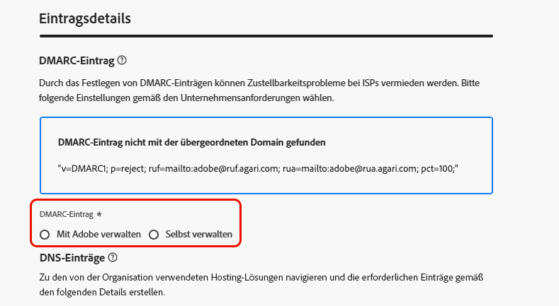

# Delegieren einer Subdomain {#delegate-subdomain}

>[!CONTEXTUALHELP]
>id="ajo_admin_subdomainname"
>title="Delegieren von Subdomains"
>abstract="Mit Journey Optimizer können Subdomains an Adobe delegiert werden. Eine Subdomain kann vollständig an Adobe delegiert werden. Eine Subdomain kann auch mit CNAME erstellt werden, um auf Adobe-spezifische Einträge zu verweisen. Für diesen Ansatz müssen DNS-Einträge jedoch selbst verwaltet und gepflegt werden."
>additional-url="https://experienceleague.adobe.com/de/docs/journey-optimizer/using/configuration/delegate-subdomains/about-subdomain-delegation#subdomain-delegation-methods" text="Methoden der Subdomain-Konfiguration"

>[!CONTEXTUALHELP]
>id="ajo_admin_subdomainname_header"
>title="Delegieren von Subdomains"
>abstract="Um mit dem Versand von E-Mails zu beginnen, wird die Subdomain an Adobe delegiert. Daraufhin werden DNS-Einträge, Postfächer, Absender-, Antwort- und Bounce-Adressen konfiguriert."

Das Delegieren eines Domain-Namens ist eine Methode, die es dem Eigentümer eines Domain-Namens (technisch gesehen: eine DNS-Zone) ermöglicht, eine Untereinheit des Domain-Namens (technisch gesehen: eine untergeordnete DNS-Zone, die Unterzone genannt werden kann) an eine anderen Entität zu delegieren. Wenn Sie also als Kunde die Zone „example.com“ verwalten, können Sie Adobe die Unterzone „marketing.example.com“ zuweisen. Weitere Informationen zur [Subdomain-Delegierung](about-subdomain-delegation.md)

>[!NOTE]
>
>Standardmäßig können Sie mit [!DNL Journey Optimizer] bis zu 10 Subdomains delegieren. Abhängig von Ihrem Lizenzvertrag können Sie jedoch bis zu 100 Subdomains delegieren. Wenden Sie sich an Ihre Adobe-Kontaktperson, um die Anzahl der Subdomains zu erfahren, für die Sie berechtigt sind.

Sie können eine Subdomain vollständig delegieren oder eine Subdomain mit CNAMEs erstellen, um auf Adobe-spezifische Einträge zu verweisen.

>[!CAUTION]
>
>Die vollständige Subdomain-Delegierung ist die empfohlene Methode. Erfahren Sie mehr über die Unterschiede zwischen beiden [Subdomain-Konfigurationsmethoden](about-subdomain-delegation.md#subdomain-delegation-methods).
>
>Die Konfiguration von Subdomains ist in allen Umgebungen gleich. Daher wirkt sich jede Änderung an einer Subdomain auch auf die Produktions-Sandboxes aus.

## Subdomain vollständig an Adobe delegieren {#full-subdomain-delegation}

>[!CONTEXTUALHELP]
>id="ajo_admin_subdomain_dns"
>title="Erstellen der passenden DNS-Einträge"
>abstract="Um eine neue Subdomain vollständig an Adobe zu delegieren, müssen die in der Journey Optimizer-Benutzeroberfläche angezeigten Adobe-Nameserver-Informationen kopiert und in die Domain-Hosting-Lösung eingefügt werden, um die passenden DNS-Einträge zu generieren. Um eine Subdomain mit CNAMEs zu delegieren, muss auch der SSL-CDN-URL-Validierungeintrag kopiert und eingefügt werden. Nachdem die Prüfungen erfolgreich waren, kann die Subdomain für den Nachrichtenversand verwendet werden."
>additional-url="https://experienceleague.adobe.com/de/docs/journey-optimizer/using/configuration/delegate-subdomains/delegate-subdomain#cname-subdomain-delegation" text="CNAME-Subdomain-Delegierung"

[!DNL Journey Optimizer] ermöglicht die vollständige Delegation Ihrer Subdomains an Adobe direkt über die Benutzeroberfläche des Produkts. Auf diese Weise kann Adobe Nachrichten als Managed Service bereitstellen, indem alle Aspekte des DNS, die für die Zustellung, das Rendering und das Tracking von E-Mail-Kampagnen erforderlich sind, kontrolliert und verwaltet werden.

Adobe stellt sicher, dass Kunden die DNS-Infrastruktur bereitgestellt wird, die zur Erfüllung der branchenüblichen Zustellbarkeitsanforderungen an Domains zum E-Mail-Marketing-Versand erforderlich ist. Gleichzeitig verwaltet und kontrolliert Adobe auch das DNS für Ihre unternehmensinternen E-Mail-Domains.

Gehen Sie wie folgt vor, um eine neue Subdomain vollständig an Adobe zu delegieren:

1. Rufen Sie das Menü **[!UICONTROL Administration]** > **[!UICONTROL Kanäle]** > **[!UICONTROL E-Mail-Einstellungen]** > **[!UICONTROL Subdomains]** auf und klicken Sie dann auf **[!UICONTROL Subdomain einrichten]**.

   

1. Wählen Sie im Abschnitt **[!UICONTROL Einrichtungsmethode]** die Option **[!UICONTROL Vollständig delegieren]** aus.

   

1. Geben Sie den Namen der zu delegierenden Subdomain an.

   

   >[!CAUTION]
   >
   >Es ist nicht zulässig, Adobe eine ungültige Subdomain zuzuweisen. Vergewissern Sie sich, dass Sie eine gültige Subdomain eingeben, die Ihrem Unternehmen gehört, z. B. marketing.ihrunternehmen.com.

   <!--Capital letters are not allowed in subdomains. TBC by PM-->

1. Die Liste der Einträge, die auf Ihren DNS-Servern gespeichert werden sollen, wird angezeigt. Kopieren Sie diese Einträge entweder einzeln oder durch Herunterladen einer CSV-Datei, und navigieren Sie dann zu Ihrer Domain-Hosting-Lösung, um die passenden DNS-Einträge zu generieren.

1. Stellen Sie sicher, dass alle DNS-Einträge aus den vorherigen Schritten in Ihrer Domain-Hosting-Lösung generiert wurden. Wenn alles ordnungsgemäß konfiguriert ist, aktivieren Sie die Checkbox „Ich bestätige…“.

   

1. Richten Sie einen DMARC-Eintrag ein. Wenn die Subdomain über einen bestehenden DMARC-Eintrag verfügt und dieser von [!DNL Journey Optimizer] abgerufen wird, können Sie dieselben Werte verwenden oder sie nach Bedarf ändern. Wenn Sie keine Werte hinzufügen, werden die Standardwerte verwendet. [Weitere Informationen](dmarc-record.md)

   

1. Klicken Sie auf **[!UICONTROL Absenden]**.

   >[!NOTE]
   >
   >Sie können die Einträge erstellen und die Subdomain-Konfiguration später über die Schaltfläche **[!UICONTROL Als Entwurf speichern]** übermitteln. Anschließend können Sie die Delegierung der Subdomain fortsetzen, indem Sie sie über die Liste der Subdomains öffnen.

1. Die Subdomain wird in der Liste mit dem Status **[!UICONTROL Bearbeitung]** angezeigt. Weiterführende Informationen zum Status von Subdomains finden Sie in [diesem Abschnitt](about-subdomain-delegation.md#access-delegated-subdomains).

   

   Bevor Sie diese Subdomain zum Senden von Nachrichten verwenden können, müssen Sie warten, bis Adobe die erforderlichen Prüfungen durchgeführt hat, was bis zu drei Stunden dauern kann. Weiterführende Informationen finden Sie in [diesem Abschnitt](#subdomain-validation).

   >[!NOTE]
   >
   >Alle fehlenden Einträge, also die noch nicht in Ihrer Hosting-Lösung erstellten Einträge, werden aufgelistet.

1. Sobald die Prüfungen erfolgreich abgeschlossen wurden, erhält die Subdomain den Status **[!UICONTROL Erfolgreich]**. Sie kann nun zum Versand von Nachrichten verwendet werden.

   >[!NOTE]
   >
   >Die Subdomain wird als **[!UICONTROL Fehlgeschlagen]** markiert, wenn Sie den Validierungseintrag nicht in Ihrer Hosting-Lösung erstellen.

Nachdem in [!DNL Journey Optimizer] eine Subdomain an Adobe delegiert wurde, wird automatisch ein PTR-Eintrag erstellt und mit dieser Subdomain verknüpft. [Weitere Informationen](ptr-records.md)

>[!CAUTION]
>
>Die parallele Ausführung von Subdomains wird in [!DNL Journey Optimizer] derzeit nicht unterstützt. Wenn Sie versuchen, eine Subdomain zur Zuweisung zu übermitteln, während eine andere den Status **[!UICONTROL Verarbeitung läuft]** hat, erhalten Sie eine Fehlermeldung.

## Einrichten einer Subdomain mit CNAME {#cname-subdomain-delegation}

>[!CONTEXTUALHELP]
>id="ajo_admin_subdomain_dns_cname"
>title="Erstellen der passenden DNS- und Validierungseinträge"
>abstract="Um eine Subdomain mit CNAMEs zu delegieren, müssen Sie die Adobe-Nameserver-Informationen und den in der Journey Optimizer-Benutzeroberfläche angezeigten SSL-CDN-URL-Validierungseintrag kopieren und in Ihre Hosting-Plattform einfügen. Nachdem die Prüfungen erfolgreich waren, kann die Subdomain für den Nachrichtenversand verwendet werden."

>[!CONTEXTUALHELP]
>id="ajo_admin_subdomain_cdn_cname"
>title="Kopieren des Validierungseintrags"
>abstract="Adobe generiert einen Validierungseintrag. Sie müssen den entsprechenden Eintrag auf Ihrer Hosting-Plattform für die CDN-URL-Validierung erstellen."

Wenn Sie Domain-spezifische Einschränkungsrichtlinien haben und möchten, dass Adobe nur eine teilweise Kontrolle über den DNS hat, können Sie alle DNS-bezogenen Aktivitäten auf Ihrer Seite durchführen.

Mit der Einrichtung einer CNAME-Subdomain können Sie eine Subdomain erstellen und CNAMEs verwenden, um auf Adobe-spezifische Einträge zu verweisen. Mit dieser Konfiguration sind Sie und Adobe gemeinsam für die Pflege des DNS verantwortlich, um eine Umgebung für das Senden, Rendern und Tracking von E-Mails einzurichten.

>[!CAUTION]
>
>Die Methode CNAME wird empfohlen, wenn die Richtlinien Ihrer Organisation die vollständige Subdomain-Delegierung nicht erlauben. Diese Methode erfordert, dass Sie DNS-Einträge selbst pflegen und verwalten. Adobe kann keine Unterstützung beim Ändern, Pflegen oder Verwalten des DNS für eine Subdomain anbieten, die über die CNAME-Methode konfiguriert wurde.

➡️ [In diesem Video erfahren Sie, wie Sie eine Subdomain mit CNAME erstellen, um auf Adobe-spezifische Einträge zu verweisen](#video)

Um eine Subdomain mit CNAMEs einzurichten, führen Sie die folgenden Schritte aus:

1. Rufen Sie das Menü **[!UICONTROL Administration]** > **[!UICONTROL Kanäle]** > **[!UICONTROL E-Mail-Einstellungen]** > **[!UICONTROL Subdomains]** auf und klicken Sie dann auf **[!UICONTROL Subdomain einrichten]**.

1. Wählen Sie die Methode **[!UICONTROL CNAME-Einrichtung]** aus.

   

1. Geben Sie den Namen der zu delegierenden Subdomain an.

   >[!CAUTION]
   >
   >Es ist nicht zulässig, Adobe eine ungültige Subdomain zuzuweisen. Vergewissern Sie sich, dass Sie eine gültige Subdomain eingeben, die Ihrem Unternehmen gehört, z. B. marketing.ihrunternehmen.com.

   <!--Capital letters are not allowed in subdomains. TBC by PM-->

1. Die Liste der Einträge, die auf Ihren DNS-Servern gespeichert werden sollen, wird angezeigt. Kopieren Sie diese Einträge entweder einzeln oder durch Herunterladen einer CSV-Datei, und navigieren Sie dann zu Ihrer Domain-Hosting-Lösung, um die passenden DNS-Einträge zu generieren.

1. Stellen Sie sicher, dass alle DNS-Einträge aus den vorherigen Schritten in Ihrer Domain-Hosting-Lösung generiert wurden. Wenn alles ordnungsgemäß konfiguriert ist, aktivieren Sie die Checkbox „Ich bestätige…“.

   

1. Richten Sie den DMARC-Eintrag ein. Wenn die Subdomain über einen bestehenden DMARC-Eintrag verfügt und dieser von [!DNL Journey Optimizer] abgerufen wird, können Sie dieselben Werte verwenden oder sie nach Bedarf ändern. Wenn Sie keine Werte hinzufügen, werden die Standardwerte verwendet. [Weitere Informationen](dmarc-record.md)

   

1. Klicken Sie auf **[!UICONTROL Weiter]**.

   >[!NOTE]
   >
   >Sie können die Schaltfläche **[!UICONTROL Als Entwurf speichern]** verwenden und die Einträge später erstellen. Anschließend können Sie die Delegierung der Subdomain fortsetzen, indem Sie sie über die Liste der Subdomains öffnen.

1. Warten Sie, bis Adobe prüft, ob diese Einträge in Ihrer Hosting-Lösung fehlerfrei generiert wurden. Dieser Vorgang kann bis zu 2 Minuten dauern.

   >[!NOTE]
   >
   >Alle fehlenden Einträge, also die noch nicht in Ihrer Hosting-Lösung erstellten Einträge, werden aufgelistet.

1. Adobe generiert einen SSL-CDN-URL-Validierungseintrag. Kopieren Sie diesen Validierungseintrag in Ihre Hosting-Plattform. Wenn Sie diesen Eintrag ordnungsgemäß in Ihrer Hosting-Lösung erstellt haben, aktivieren Sie das Kontrollkästchen „Ich bestätige…“ und klicken Sie dann auf **[!UICONTROL Senden]**.

   <!---->

1. Nachdem die CNAME-Subdomain-Delegierung übermittelt wurde, wird die Subdomain in der Liste mit dem Status **[!UICONTROL Verarbeitung läuft]** angezeigt. Weiterführende Informationen zum Status von Subdomains finden Sie in [diesem Abschnitt](about-subdomain-delegation.md#access-delegated-subdomains).

   

   Bevor Sie diese Subdomain zum Senden von Nachrichten verwenden können, müssen Sie warten, bis Adobe die erforderlichen Prüfungen durchgeführt hat, was in der Regel zwei bis drei Stunden dauert. Weiterführende Informationen finden Sie in [diesem Abschnitt](#subdomain-validation).

1. Sobald die Prüfungen erfolgreich abgeschlossen wurden<!--i.e Adobe validates the record you created and installs it-->, erhält die Subdomain den Status **[!UICONTROL Erfolgreich]**. Sie kann nun zum Versand von Nachrichten verwendet werden.

   >[!NOTE]
   >
   >Die Subdomain wird als **[!UICONTROL Fehlgeschlagen]** markiert, wenn Sie den Validierungseintrag nicht in Ihrer Hosting-Lösung erstellen.

Nach der Validierung des Datensatzes und der Installation des Zertifikats erstellt Adobe automatisch den PTR-Eintrag für die CNAME-Subdomain. [Weitere Informationen](ptr-records.md)

>[!CAUTION]
>
>Die parallele Ausführung von Subdomains wird in [!DNL Journey Optimizer] derzeit nicht unterstützt. Wenn Sie versuchen, eine Subdomain zur Zuweisung zu übermitteln, während eine andere den Status **[!UICONTROL Verarbeitung läuft]** hat, erhalten Sie eine Fehlermeldung.

## Subdomain-Validierung {#subdomain-validation}

Die folgenden Prüfungen und Aktionen werden durchgeführt, bis die Subdomain verifiziert ist und zum Senden von Nachrichten verwendet werden kann.

>[!NOTE]
>
>Diese Schritte werden von Adobe ausgeführt, was bis zu drei Stunden dauern kann.

1. **Vorab-Validierung**: Adobe überprüft, ob die Subdomain an das Adobe DNS delegiert wurde (NS-Eintrag, SOA-Eintrag, Zoneneinrichtung, Eigentümereintrag). Wenn der Vorab-Validierungsschritt fehlschlägt, wird ein Fehler zusammen mit dem entsprechenden Grund zurückgegeben. Andernfalls fährt Adobe mit dem nächsten Schritt fort.

1. **Konfigurieren des DNS für die Domain**:

   * **MX-Eintrag**: E-Mail-eXchange-Eintrag – Mail-Server-Eintrag, der eingehende E-Mails verarbeitet, die an die Subdomain gesendet werden.
   * **SPF-Eintrag**: Sender Policy Framework-Eintrag – Listet die IPs der E-Mail-Server auf, die E-Mails von der Subdomain senden können.
   * **DKIM-Datensatz**: DomainKeys Identified Mail-Standardeintrag – Verwendet eine Verschlüsselung mit öffentlichem und privatem Schlüssel zur Authentifizierung der Nachricht, um Spoofing zu verhindern.
   * **A**: Standard-IP-Zuordnung.
   * **CNAME**: Ein CNAME-Eintrag bzw. Eintrag mit einem kanonischen Namen ist ein DNS-Eintrag, der einem echten oder kanonischen Domain-Namen einen Aliasnamen zuordnet.

1. **Erstellen von Tracking- und Mirror-URLs**: Wenn die Domain email.example.com ist, lautet die Tracking-/Mirror-Domain data.email.example.com. Sie wird durch die Installation des SSL-Zertifikats gesichert.

1. **Bereitstellen von CDN CloudFront**: Wenn das CDN noch nicht eingerichtet ist, stellt Adobe es für Ihre-Organisations-ID bereit.

1. **Erstellen einer CDN-Domain**: Wenn die Domain email.example.com ist, lautet die CDN-Domain cdn.email.example.com.

1. **Erstellen und Anfügen eines CDN-SSL-Zertifikats**: Adobe erstellt das CDN-Zertifikat für die CDN-Domain und hängt es dort an.

1. **Weiterleitungs-DNS erstellen**: Wenn dies die erste Subdomain ist, die Sie delegieren, erstellt Adobe das Weiterleitungs-DNS, das zum Erstellen von PTR-Einträgen erforderlich ist – einem für jede Ihrer IPs.

1. **PTR-Eintrag erstellen**: PTR-Einträge, auch als Reverse-DNS-Eintrag bezeichnet, werden von den ISPs benötigt, damit sie die E-Mails nicht als Spam kennzeichnen. Gmail empfiehlt auch, für jede IP-Adresse PTR-Einträge zu haben. Adobe erstellt PTR-Einträge nur, wenn Sie eine Subdomain zum ersten Mal delegieren, und zwar einen für jede IP, wobei alle IPs auf diese Subdomain verweisen. Wenn die IP beispielsweise *192.1.2.1* und die Subdomain *email.example.com* lautet, lautet der PTR-Eintrag: *192.1.2.1PTR r1.email.example.com*. Sie können den PTR-Eintrag anschließend aktualisieren, sodass er auf die neue delegierte Domain verweist. [Weitere Informationen zu PTR-Einträgen](ptr-records.md)

## Delegierung einer Subdomain aufheben {#undelegate-subdomain}

Wenn Sie die Delegierung einer Subdomain aufheben möchten, wenden Sie sich an den Adobe-Support.

Sie müssen jedoch mehrere Schritte in der Benutzeroberfläche ausführen, bevor Sie sich an Adobe wenden.

>[!NOTE]
>
>Die Delegierung von Subdomains kann nur mit dem Status **[!UICONTROL Erfolg]** aufgehoben werden. Subdomains mit dem Status **[!UICONTROL Entwurf]** und **[!UICONTROL Fehlgeschlagen]** können einfach aus der Benutzeroberfläche gelöscht werden.

Führen Sie zunächst die folgenden Schritte in [!DNL Journey Optimizer] aus:

1. Deaktivieren Sie alle Kanalkonfigurationen, die mit der Subdomain verknüpft sind. [Weitere Informationen](../configuration/channel-surfaces.md#deactivate-a-surface)

1. Heben Sie die Delegierung von Landingpage-Subdomains, SMS-Subdomains und Web-Subdomains auf, die mit dieser Subdomain verknüpft sind.

   >[!NOTE]
   >
   >Sie müssen für jede (Landingpage, [SMS](../sms/sms-subdomains.md#undelegate-subdomain) oder [Web-Subdomain) eine dedizierte Anfrage ](../web/web-delegated-subdomains.md#undelegate-subdomain).

1. Beenden Sie die aktiven Kampagnen, die mit den Subdomains verknüpft sind. [Weitere Informationen](../campaigns/modify-stop-campaign.md#stop)

1. Beenden Sie die aktiven Journey, die mit den Subdomains verknüpft sind. [Weitere Informationen](../building-journeys/end-journey.md#stop-journey)

1. Zeigen Sie die [PTR-Einträge](ptr-records.md#edit-ptr-record) die mit der Subdomain verknüpft sind, auf eine andere Subdomain.

   >[!NOTE]
   >
   >Wenn dies die einzige delegierte Subdomain ist, können Sie diesen Schritt überspringen.

Wenden Sie sich anschließend mit der Subdomain, deren Delegierung Sie aufheben möchten, an den Adobe-Support.

Nachdem Ihre Anfrage von Adobe verarbeitet wurde, wird die nicht delegierte Domain nicht mehr auf der Subdomain-Inventarseite angezeigt.

>[!CAUTION]
>
>Nachdem die Delegierung einer Subdomain aufgehoben wurde:
>
>   * Die Kanalkonfigurationen, die diese Subdomain verwendet haben, können nicht reaktiviert werden.
>   * Die exakte Subdomain kann nicht erneut über die Benutzeroberfläche delegiert werden. Wenden Sie sich in diesem Fall an Ihren Adobe-Support-Mitarbeiter.

## Anleitungsvideo{#video}

Erfahren Sie, wie Sie eine Subdomain mit CNAME erstellen, um auf Adobe-spezifische Einträge zu verweisen.

>[!VIDEO](https://video.tv.adobe.com/v/339484?quality=12)
