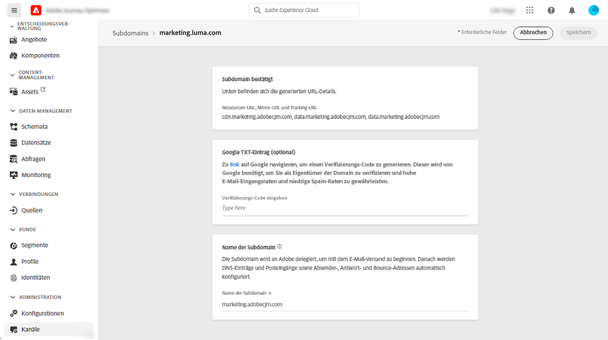
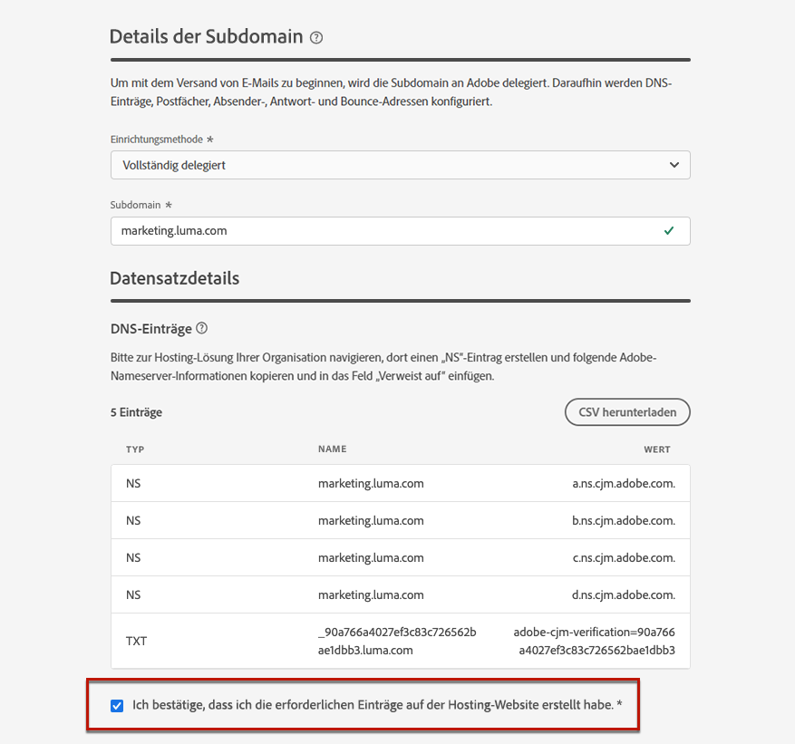

# Delegieren einer Subdomain {#delegate-subdomain}

>[!CONTEXTUALHELP]
>id="ajo_admin_subdomainname"
>title="Delegieren von Subdomains"
>abstract="Mit Journey Optimizer können Subdomains an Adobe delegiert werden. Eine Subdomain kann vollständig an Adobe delegiert werden.  Sie können auch eine Subdomain mit CNAMEs erstellen, um auf Adobe-spezifische Einträge zu verweisen. Für diesen Ansatz müssen DNS-Einträge jedoch selbst gepflegt und verwaltet werden."
>additional-url="https://experienceleague.adobe.com/de/docs/journey-optimizer/using/configuration/delegate-subdomains/about-subdomain-delegation#subdomain-delegation-methods" text="Methoden der Subdomain-Konfiguration"

>[!CONTEXTUALHELP]
>id="ajo_admin_subdomainname_header"
>title="Delegieren von Subdomains"
>abstract="Um mit dem Versand von E-Mails zu beginnen, wird die Subdomain an Adobe delegiert. Daraufhin werden DNS-Einträge, Postfächer, Absender-, Antwort- und Bounce-Adressen konfiguriert."

Das Delegieren eines Domain-Namens ist eine Methode, die es dem Eigentümer eines Domain-Namens (technisch gesehen: eine DNS-Zone) ermöglicht, eine Untereinheit des Domain-Namens (technisch gesehen: eine untergeordnete DNS-Zone, die Unterzone genannt werden kann) an eine anderen Entität zu delegieren. Wenn Sie also als Kunde die Zone „example.com“ verwalten, können Sie Adobe die Unterzone „marketing.example.com“ zuweisen. Erfahren Sie mehr über die [Subdomain-Delegierung](about-subdomain-delegation.md).

Standardmäßig können Sie mit [!DNL Journey Optimizer] **bis zu 10 Subdomains** delegieren. Abhängig von Ihrem Lizenzvertrag können Sie jedoch bis zu 100 Subdomains delegieren. Wenden Sie sich an Ihre Adobe-Kontaktperson, um die Anzahl der Subdomains zu erfahren, für die Sie berechtigt sind.

Sie haben folgende Möglichkeiten:

* Subdomain vollständig delegieren - [Weitere Informationen](#set-up-subdomain)
* Erstellen einer Subdomain mit CNAMEs, um auf Adobe-spezifische Einträge zu verweisen - [Weitere Informationen](#set-up-subdomain)
* Einrichten einer benutzerdefinierten Domain - [Weitere Informationen](#setup-custom-subdomain)

Die **vollständige Subdomain-Delegierung** ist die empfohlene Methode. Weitere Informationen zu den Unterschieden zwischen den verschiedenen Subdomain-Konfigurationsmethoden finden Sie [ (diesem Abschnitt](about-subdomain-delegation.md#subdomain-delegation-methods).

>[!CAUTION]
>
>Die parallele Ausführung von Subdomains wird in [!DNL Journey Optimizer] nicht unterstützt. Wenn Sie versuchen, eine Subdomain zur Delegierung zu übermitteln, während eine andere Subdomain den Status **[!UICONTROL Verarbeitung läuft]** aufweist, erhalten Sie eine Fehlermeldung.

➡️ [In diesem Video erfahren Sie, wie Sie eine Subdomain mit CNAME erstellen, um auf Adobe-spezifische Einträge zu verweisen.](#video)

## Zugreifen auf delegierte Subdomains {#access-delegated-subdomains}

Alle delegierten Subdomains werden im Menü **[!UICONTROL Administration]** > **[!UICONTROL Kanäle]** > **[!UICONTROL Subdomains]** angezeigt. Es stehen Filter zur Verfügung, mit denen Sie die Liste eingrenzen können (Datum der Zuweisung, Benutzer oder Status).

<!---->

Die Spalte **[!UICONTROL Status]** enthält Informationen zum Prozess der Zuweisung von Subdomains:

* **[!UICONTROL Entwurf]**: Die Subdomain-Zuweisung wurde als Entwurf gespeichert. Klicken Sie auf den Namen der Subdomain, um den Zuweisungsprozess fortzusetzen.
* **[!UICONTROL Verarbeitung läuft]**: Die Subdomain wird mehreren Konfigurationsprüfungen unterzogen, bevor sie verwendet werden kann.
* **[!UICONTROL Erfolgreich]**: Die Subdomain hat die Prüfungen erfolgreich durchlaufen und bestanden und kann zum Versand von Nachrichten verwendet werden.
* **[!UICONTROL Fehlgeschlagen]**: Eine oder mehrere Prüfungen sind fehlgeschlagen, nachdem die Subdomain-Zuweisung übermittelt wurde.

Um auf detaillierte Informationen zu einer Subdomain mit dem Status **[!UICONTROL Erfolgreich]** zuzugreifen, öffnen Sie sie in der Liste.

Sie haben folgende Möglichkeiten:

* Rufen Sie den während des Zuweisungsprozesses konfigurierten Subdomain-Namen (schreibgeschützt) sowie die generierten URLs (Ressourcen, Mirrorseite, Tracking-URLs) ab oder

* Fügen Sie Ihrer Subdomain einen TXT-Eintrag für die Website-Überprüfung von Google hinzu, um sicherzustellen, dass er verifiziert ist (siehe [Hinzufügen eines Google TXT-Eintrags zu einer Subdomain](google-txt.md)).

>[!CAUTION]
>
>Die Konfiguration von Subdomains ist in allen Umgebungen gleich. Daher wirkt sich jede Änderung an einer Subdomain auch auf die Produktions-Sandboxes aus.

## Einrichten einer Subdomain in Journey Optimizer {#set-up-subdomain}

>[!CONTEXTUALHELP]
>id="ajo_admin_subdomain_dns"
>title="Erstellen der passenden DNS-Einträge"
>abstract="Um eine neue Subdomain vollständig an Adobe zu delegieren, müssen die in der Journey Optimizer-Benutzeroberfläche angezeigten Adobe-Nameserver-Informationen kopiert und in die Domain-Hosting-Lösung eingefügt werden, um die passenden DNS-Einträge zu generieren. Um eine Subdomain mit CNAMEs zu delegieren, muss auch der SSL-CDN-URL-Validierungeintrag kopiert und eingefügt werden. Nachdem die Prüfungen erfolgreich waren, kann die Subdomain für den Nachrichtenversand verwendet werden."

Gehen Sie wie folgt vor, um eine neue Subdomain in [!DNL Journey Optimizer] einzurichten.

>[!NOTE]
>
>In diesem Abschnitt wird beschrieben, wie Sie eine Subdomain mit den Methoden der vollständigen Delegierung oder CNAME einrichten. Die Methode der benutzerdefinierten Delegierung wird in ([ Abschnitt) ](#setup-custom-subdomain).

1. Rufen Sie das Menü **[!UICONTROL Administration]** > **[!UICONTROL Kanäle]** > **[!UICONTROL E-Mail-Einstellungen]** > **[!UICONTROL Subdomains]** auf und klicken Sie dann auf **[!UICONTROL Subdomain einrichten]**.

   <!---->

   >[!CAUTION]
   >
   >Die Konfiguration von Subdomains ist **in allen Umgebungen gleich**. Daher wirkt sich jede Änderung an einer Subdomain auch auf die Produktions-Sandboxes aus.

1. Wählen Sie im **[!UICONTROL Einrichtungsmethode]** entweder:

   * Vollständig delegiert - [Weitere Informationen](about-subdomain-delegation.md#full-subdomain-delegation)
   * Einrichten von CNAME - [Weitere Informationen](about-subdomain-delegation.md#cname-subdomain-setup)

     In diesem [ Abschnitt erfahren Sie, wie Sie Subdomains mit CNAME einrichten](#cname-subdomain-setup)

   * Benutzerdefinierte Delegierung - [Weitere Informationen](about-subdomain-delegation.md#custom-subdomain-delegation)

     Näheres dazu, wie Sie eine benutzerdefinierte Delegierung einrichten, finden [ in diesem Abschnitt](delegate-custom-subdomain.md).

   <!---->

1. Geben Sie den Namen der zu delegierenden Subdomain an.

   

   >[!CAUTION]
   >
   >Es ist nicht zulässig, Adobe eine ungültige Subdomain zuzuweisen. Vergewissern Sie sich, dass Sie eine gültige Subdomain eingeben, die Ihrem Unternehmen gehört, z. B. marketing.ihrunternehmen.com.
   >
   >Es kann nicht dieselbe Versand-Domain zum Senden von Nachrichten von [!DNL Adobe Journey Optimizer] und von einem anderen Produkt, z. B. [!DNL Adobe Campaign] oder [!DNL Adobe Marketo Engage], verwendet werden.

   <!--Capital letters are not allowed in subdomains. TBC by PM-->

1. Richten Sie **[!UICONTROL den DMARC]** Eintrag im entsprechenden Abschnitt ein. Wenn die Subdomain über einen [DMARC-Eintrag](dmarc-record.md) verfügt und von [!DNL Journey Optimizer] abgerufen wird, können dieselben Werte verwendet oder nach Bedarf geändert werden. Wenn Sie keine Werte hinzufügen, werden die Standardwerte verwendet. [Erfahren Sie, wie Sie DMARC-Einträge verwalten](dmarc-record.md#set-up-dmarc)

   

1. Im Abschnitt **[!UICONTROL DNS-Eintrag]** wird die Liste der Einträge angezeigt, die auf Ihren DNS-Servern platziert werden sollen. Kopieren Sie diese Einträge entweder einzeln oder durch Herunterladen einer CSV-Datei, und navigieren Sie dann zu Ihrer Domain-Hosting-Lösung, um die passenden DNS-Einträge zu generieren.

1. Stellen Sie sicher, dass alle DNS-Einträge aus den vorherigen Schritten in Ihrer Domain-Hosting-Lösung generiert wurden. Wenn alles ordnungsgemäß konfiguriert ist, aktivieren Sie die Checkbox „Ich bestätige…“.

   

1. Wenn Sie eine Subdomain mit **CNAMEs** einrichten, lesen Sie [diesen Abschnitt](#cname-subdomain-setup).

1. Klicken Sie **[!UICONTROL Senden]**, damit Adobe die erforderlichen Prüfungen durchführt. [Weitere Informationen](#submit-subdomain)

## Einrichten einer Subdomain mit CNAMEs {#cname-subdomain-setup}

>[!CONTEXTUALHELP]
>id="ajo_admin_subdomain_dns_cname"
>title="Erstellen der passenden DNS- und Validierungseinträge"
>abstract="Um eine Subdomain mit CNAMEs zu delegieren, müssen Sie die Adobe-Nameserver-Informationen und den in der Journey Optimizer-Benutzeroberfläche angezeigten SSL-CDN-URL-Validierungseintrag kopieren und in Ihre Hosting-Plattform einfügen. Nachdem die Prüfungen erfolgreich waren, kann die Subdomain für den Nachrichtenversand verwendet werden."

>[!CONTEXTUALHELP]
>id="ajo_admin_subdomain_cdn_cname"
>title="Kopieren des Validierungseintrags"
>abstract="Adobe generiert einen Validierungseintrag. Sie müssen den entsprechenden Eintrag auf Ihrer Hosting-Plattform für die CDN-URL-Validierung erstellen."

Beim Einrichten einer Subdomain können Sie mit CNAMEs auf Adobe-spezifische Einträge verweisen. Mit dieser Einrichtung sind Sie und Adobe gemeinsam für die Pflege des DNS verantwortlich.

>[!CAUTION]
>
>Die Methode CNAME wird empfohlen, wenn die Richtlinien Ihrer Organisation die vollständige Subdomain-Delegierung nicht erlauben. Dieser Ansatz erfordert, dass Sie DNS-Einträge selbst pflegen und verwalten.
>
>Adobe kann keine Unterstützung beim Ändern, Pflegen oder Verwalten des DNS für eine Subdomain anbieten, die über die CNAME-Methode konfiguriert wurde.

Gehen Sie wie folgt vor, um eine Subdomain mit CNAMEs einzurichten.

1. Führen Sie alle in [ Abschnitt beschriebenen Schritte ](#set-up-subdomain).

1. Bevor Sie Ihre Subdomain-Einrichtung übermitteln, müssen Sie einen weiteren Schritt ausführen: Klicken Sie auf **[!UICONTROL Weiter]**. Warten Sie, bis Adobe prüft, ob diese Einträge in Ihrer Hosting-Lösung fehlerfrei generiert wurden. Dieser Vorgang kann bis zu 2 Minuten dauern.

   >[!NOTE]
   >
   >Stellen Sie sicher, dass alle Datensätze ordnungsgemäß erstellt wurden, bevor Sie fortfahren.

1. Adobe generiert einen SSL-CDN-URL-Validierungseintrag. Kopieren Sie diesen Validierungseintrag in Ihre Hosting-Plattform. Wenn Sie diesen Eintrag ordnungsgemäß in Ihrer Hosting-Lösung erstellt haben, aktivieren Sie das Kontrollkästchen „Ich bestätige…“.

1. Klicken Sie **[!UICONTROL Senden]**, damit Adobe die erforderlichen Prüfungen durchführt. [Weitere Informationen](#submit-subdomain)

➡️ [In diesem Video erfahren Sie, wie Sie eine Subdomain mit CNAME erstellen, um auf Adobe-spezifische Einträge zu verweisen.](#video)

## Einrichten einer benutzerdefinierten Subdomain {#setup-custom-subdomain}

Als Alternative zu den Methoden [Vollständig delegiert](#set-up-subdomain) und [CNAME eingerichtet](#cname-subdomain-setup) können Sie mit der **Benutzerdefinierte Delegierung** die Verantwortung für Ihre Subdomains in Journey Optimizer übernehmen und die generierten Zertifikate vollständig kontrollieren.

<!--As part of this process, Adobe needs to make sure that your DNS is accordingly configured for delivering, rendering and tracking messages. This is why you will be required to [upload the SSL certificate](#upload-ssl-certificate) obtained from the Certificate Authority and complete the [Feedback Loop steps](#feedback-loop-steps) by verifying domain ownership and reporting email address.-->

* Weitere Informationen zur benutzerdefinierten Delegierung finden Sie auf [dieser Seite](about-subdomain-delegation.md#custom-subdomain-delegation).
* Um eine benutzerdefinierte Subdomain einzurichten, führen Sie die auf [ Seite ](delegate-custom-subdomain.md) Schritte aus.
<!--
1. Access the **[!UICONTROL Administration]** > **[!UICONTROL Channels]** > **[!UICONTROL Email settings]** > **[!UICONTROL Subdomains]** menu.

1. Click **[!UICONTROL Set up subdomain]**.

1. From the **[!UICONTROL Set up method]** section, select **[!UICONTROL Custom delegation]**.

    {width=90%}

1. Specify the name of the subdomain to delegate.

    >[!CAUTION]
    >
    >You cannot use the same sending domain to send out messages from [!DNL Adobe Journey Optimizer] and from another product, such as [!DNL Adobe Campaign] or [!DNL Adobe Marketo Engage].

### Create the DNS records {#create-dns-records}

>[!CONTEXTUALHELP]
>id="ajo_admin_subdomain_custom_dns"
>title="Generate the matching DNS records"
>abstract="To delegate a custom subdomain to Adobe, you need to copy-paste the nameserver information displayed in the Journey Optimizer interface into your domain-hosting solution to generate the matching DNS records."

1. The list of records to be placed in your DNS servers displays. Copy these records, either one by one, or by downloading a CSV file.

1. Navigate to your domain hosting solution to generate the matching DNS records.

1. Make sure that all the DNS records have been generated into your domain hosting solution.

1. If everything is configured properly, check the box "I confirm...".

    {width="75%"}

### Upload the SSL Certificate {#upload-ssl-certificate}

>[!CONTEXTUALHELP]
>id="ajo_admin_subdomain_custom-ssl"
>title="Generate the Certificate Signing Request"
>abstract="When setting up a new custom subdomain, you need to generate the Certificate Signing Request (CSR), fill it and send it to the Certificate Authority to get the SSL certificate that you need to upload to Journey Optimizer."

>[!CONTEXTUALHELP]
>id="ajo_admin_subdomain_key_length"
>title="xxx"
>abstract=""

1. In the **[!UICONTROL SSL Certificate]** section, click **[!UICONTROL Generate CSR]**.

    {width="85%"}

    >[!NOTE]
    >
    >Your SSL certificate expiration date is displayed. Once the date is reached, you need to upload a new certificate.
    
1. Fill the form that displays and generate the Certificate Signing Request (CSR).

    {width="70%"}

    >[!NOTE]
    >
    >The key length can be 2048 or 4096-bit only. It cannot be changed after the subdomain is submitted.

1. Click **[!UICONTROL Download CSR]** and save the form to your local computer. Send it to the Certificate Authority to get your SSL certificate.

1. Once retrieved, click **[!UICONTROL Upload SSL certificate]** and upload the certificate to [!DNL Journey Optimizer] in .pem format.

### Complete the Feedback Loop steps {#feedback-loop-steps}

>[!CONTEXTUALHELP]
>id="ajo_admin_subdomain_feedback-loop"
>title="Complete the Feedback Loop steps"
>abstract="Go to the Yahoo! Sender Hub and fill in the form to verify domain ownership. Enter the FBL reporting email address listed below, and use the OTP that will be received to verify ownership on the Yahoo! Sender Hub."

1. Go to the [Yahoo! Sender Hub](https://senders.yahooinc.com/) website and fill in the required form to verify your domain ownership.

1. To verify the domain ownership, Yahoo! Sender Hub will require that you provide an email address. Enter the FBL reporting email address listed under **[!UICONTROL Value]**. This is an Adobe-owned email address.

1. When Yahoo! Sender Hub generates a One-Time Password (OTP), it will be sent to this Adobe address.

1. Reach out to the Adobe Deliverability team who will provide you with this OTP. ///Specify how to reach out + any information that customer should share in the request to deliverability team to get access to the right OTP///

    >[!CAUTION]
    >
    >The OTP is valid only for 24 hours, so make sure you reach out to Adobe as soon as the OTP is generated. ///TBC?
    >
    >OTP request can only be made on weekdays. There is no support on weekends. ///Add times + timzone

1. Enter the OTP on Yahoo! Sender Hub.

1. Make sure you have completed all the Feedback Loop steps.

1. If everything is configured properly, check the box "I have completed...".

    {width="85%"}

1. Click **[!UICONTROL Continue]** and wait until Adobe verifies that the records are generated without errors on your hosting solution. This process can take up to 2 minutes.

    >[!NOTE]
    >
    >Any missing records, meaning the records not yet created on your hosting solution, will be listed out.

    Adobe generates an SSL CDN URL validation record. Copy this validation record into your hosting platform. If you have properly created this record on your hosting solution, check the box "I confirm...".

1. Click **[!UICONTROL Submit]** to have Adobe perform the required checks. [Learn more](#submit-subdomain)-->

## Subdomain-Einrichtung übermitteln {#submit-subdomain}

Gehen Sie wie folgt vor, um die Zuweisung von Subdomains abzuschließen.

1. Klicken Sie auf **[!UICONTROL Absenden]**.

   >[!NOTE]
   >
   >Wenn beim Versuch, eine benutzerdefinierte Subdomain zu senden, ein Fehler auftritt, lesen Sie [diesen Abschnitt](#check-list).

1. Sie können die Einträge erstellen und die Subdomain-Konfiguration später über die Schaltfläche **[!UICONTROL Als Entwurf speichern]** übermitteln.

   >[!NOTE]
   >
   >Anschließend können Sie die Delegierung der Subdomain fortsetzen, indem Sie sie über die Liste der Subdomains öffnen.

1. Die Subdomain wird in der Liste mit dem Status **[!UICONTROL Bearbeitung]** angezeigt. Weiterführende Informationen zum Status von Subdomains finden Sie in [diesem Abschnitt](#access-delegated-subdomains).

   <!---->

1. Bevor Sie diese Subdomain zum Senden von Nachrichten verwenden können, müssen Sie warten, bis Adobe die erforderlichen Prüfungen durchgeführt hat, was bis zu drei Stunden dauern kann. [Weitere Informationen](#subdomain-validation).

   >[!NOTE]
   >
   >Stellen Sie sicher, dass alle Datensätze ordnungsgemäß erstellt wurden, bevor Sie fortfahren.

### Subdomain-Validierung {#subdomain-validation}

Die folgenden Prüfungen und Aktionen werden ausgeführt, bis die Subdomain verifiziert ist und zum Senden von Nachrichten verwendet werden kann.

Diese Schritte werden von Adobe ausgeführt, was **bis zu drei Stunden** dauern kann.

1. **Vorab-Validierung**: Adobe überprüft, ob die Subdomain an das Adobe DNS delegiert wurde (NS-Eintrag, SOA-Eintrag, Zoneneinrichtung, Eigentümereintrag). Wenn der Vorab-Validierungsschritt fehlschlägt, wird ein Fehler zusammen mit dem entsprechenden Grund zurückgegeben. Andernfalls fährt Adobe mit dem nächsten Schritt fort.

1. **Konfigurieren des DNS für die Domain**:

   * **MX-Eintrag**: E-Mail-eXchange-Eintrag – Mail-Server-Eintrag, der eingehende E-Mails verarbeitet, die an die Subdomain gesendet werden.
   * **SPF-Eintrag**: Sender Policy Framework-Eintrag – Listet die IPs der E-Mail-Server auf, die E-Mails von der Subdomain senden können.
   * **DKIM-Datensatz**: DomainKeys Identified Mail-Standardeintrag – Verwendet eine Verschlüsselung mit öffentlichem und privatem Schlüssel zur Authentifizierung der Nachricht, um Spoofing zu verhindern.
   * **A**: Standard-IP-Zuordnung.
   * **CNAME**: Ein CNAME-Eintrag bzw. Eintrag mit einem kanonischen Namen ist ein DNS-Eintrag, der einem echten oder kanonischen Domain-Namen einen Aliasnamen zuordnet.

1. **Erstellen von Tracking- und Mirror-URLs**: Wenn die Domain email.example.com ist, lautet die Tracking-/Mirror-Domain data.email.example.com. Sie wird durch die Installation des SSL-Zertifikats gesichert.

1. **Bereitstellen von CDN CloudFront**: Wenn das CDN noch nicht eingerichtet ist, stellt Adobe es für Ihre-Organisations-ID bereit.

1. **Erstellen einer CDN-Domain**: Wenn die Domain email.example.com ist, lautet die CDN-Domain cdn.email.example.com.

1. **Erstellen und Anfügen eines CDN-SSL-Zertifikats**: Adobe erstellt das CDN-Zertifikat für die CDN-Domain und hängt es dort an.

1. **Weiterleitungs-DNS erstellen**: Wenn dies die erste Subdomain ist, die Sie delegieren, erstellt Adobe das Weiterleitungs-DNS, das zum Erstellen von PTR-Einträgen erforderlich ist – einem für jede Ihrer IPs.

1. **PTR-Eintrag erstellen**: PTR-Einträge, auch als Reverse-DNS-Eintrag bezeichnet, werden von den ISPs benötigt, damit sie die E-Mails nicht als Spam kennzeichnen. Gmail empfiehlt auch, für jede IP-Adresse PTR-Einträge zu haben. Adobe erstellt PTR-Einträge nur, wenn Sie eine Subdomain zum ersten Mal delegieren, und zwar einen für jede IP, wobei alle IPs auf diese Subdomain verweisen. Wenn die IP beispielsweise *192.1.2.1* lautet und die Subdomain *email.example.com*, ist der PTR-Eintrag: *192.1.2.1PTR r1.email.example.com*. Sie können den PTR-Eintrag anschließend aktualisieren, sodass er auf die neue delegierte Domain verweist. [Weitere Informationen zu PTR-Einträgen](ptr-records.md)

Sobald die Prüfungen erfolgreich abgeschlossen wurden, erhält die Subdomain den Status **[!UICONTROL Erfolgreich]**. Sie kann nun zum Versand von Nachrichten verwendet werden.

Die Subdomain wird als **[!UICONTROL Fehlgeschlagen]** markiert, wenn Sie den Validierungseintrag nicht in Ihrer Hosting-Lösung erstellen.

Nach der Validierung des Datensatzes erstellt Adobe automatisch den PTR-Eintrag für die Subdomain. [Weitere Informationen](ptr-records.md)

## Aufheben der Delegierung einer Subdomain {#undelegate-subdomain}

Wenn Sie die Delegierung einer Subdomain aufheben möchten, wenden Sie sich an den Adobe-Support.

Bevor Sie Adobe kontaktieren, müssen Sie jedoch verschiedene Schritte in der Benutzeroberfläche ausführen.

>[!NOTE]
>
>Eine Delegierung kann nur für Subdomains mit dem Status **[!UICONTROL Erfolg]** aufgehoben werden. Subdomains mit dem Status **[!UICONTROL Entwurf]** und **[!UICONTROL Fehlgeschlagen]** können einfach aus der Benutzeroberfläche gelöscht werden.

Führen Sie zunächst die folgenden Schritte in [!DNL Journey Optimizer] aus:

1. Deaktivieren Sie alle Kanalkonfigurationen, die mit der Subdomain verknüpft sind. [Weitere Informationen](../configuration/channel-surfaces.md#deactivate-a-surface)

1. Heben Sie die Delegierung von Landingpage-, SMS- und Web-Subdomains auf, die mit dieser Subdomain verknüpft sind.

   Sie müssen für jede [Landingpage](../landing-pages/lp-subdomains.md#undelegate-subdomain), [SMS](../sms/sms-subdomains.md#undelegate-subdomain)- oder [Web](../web/web-delegated-subdomains.md#undelegate-subdomain)-Subdomain eine dedizierte Anfrage stellen.

1. Stoppen Sie die aktiven Kampagnen, die mit den Subdomains verknüpft sind. [Weitere Informationen](../campaigns/modify-stop-campaign.md#stop)

1. Stoppen Sie die aktiven Journey, die mit den Subdomains verknüpft sind. [Weitere Informationen](../building-journeys/end-journey.md#stop-journey)

1. Lassen Sie die mit der Subdomain verknüpften [PTR-Einträge](ptr-records.md#edit-ptr-record) auf eine andere Subdomain verweisen.

   Wenn dies die einzige delegierte Subdomain ist, können Sie diesen Schritt überspringen.

Wenden Sie sich anschließend an den Adobe-Support mit der Subdomain, für die die Delegierung aufgehoben werden soll.

Nachdem Ihre Anfrage von Adobe bearbeitet wurde, wird die Domain mit der aufgehobenen Delegierung nicht mehr auf der Subdomain-Übersichtsseite angezeigt.

>[!CAUTION]
>
>Nachdem die Delegierung einer Subdomain aufgehoben wurde, gilt Folgendes:
>
>* Sie können die Kanalkonfigurationen, die diese Subdomain verwendet haben, nicht wieder aktivieren.
>* Sie können dieselbe Subdomain nicht erneut über die Benutzeroberfläche delegieren. Ist dies gewünscht, wenden Sie sich bitte an den Adobe-Support.

## Anleitungsvideo{#video}

Erfahren Sie, wie Sie eine Subdomain mit CNAME erstellen, um auf Adobe-spezifische Einträge zu verweisen.

>[!VIDEO](https://video.tv.adobe.com/v/339484?quality=12)
