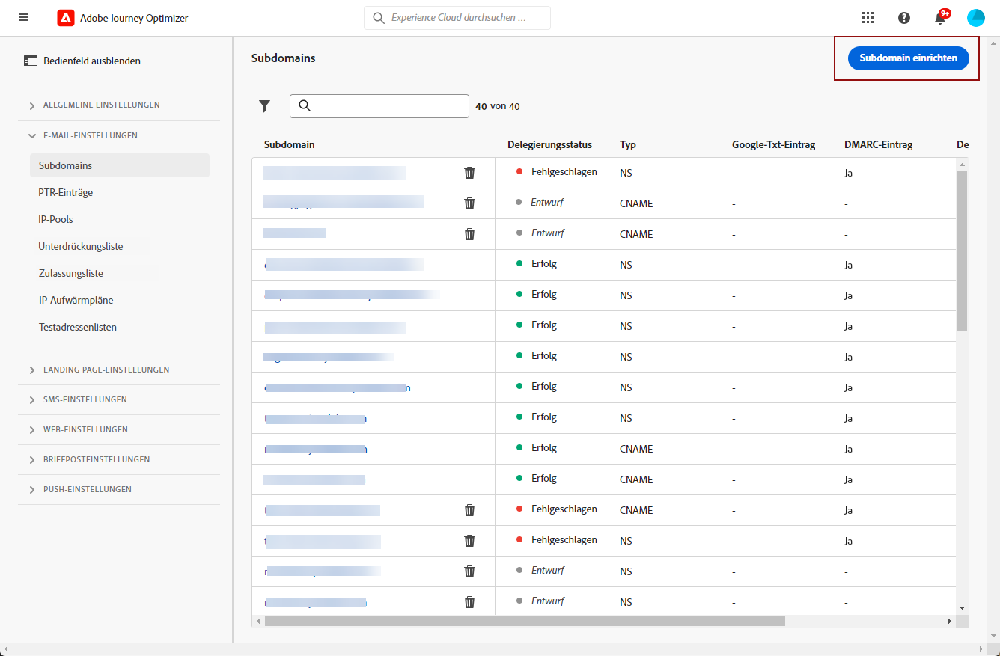
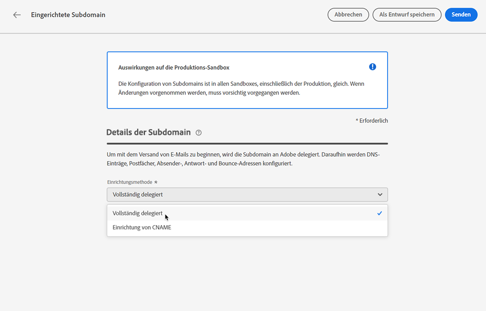

# Zuweisen einer Subdomain {#delegate-subdomain}

>[!CONTEXTUALHELP]
>id="ajo_admin_subdomainname"
>title="Subdomain-Zuweisung"
>abstract="Mit Journey Optimizer können Sie Ihre Subdomains der Adobe zuweisen. Sie können eine Subdomain vollständig an Adobe delegieren oder eine Subdomain mit CNAME erstellen, um auf Adobe-spezifische Datensätze zu verweisen."
>additional-url="https://experienceleague.adobe.com/docs/journey-optimizer/using/configuration/configuration-message/email-configuration/delegate-subdomains/about-subdomain-delegation.html#subdomain-delegation-methods" text="Methoden der Subdomain-Konfiguration"

Das Zuweisen eines Domain-Namens ist eine Methode, die es dem Eigentümer eines Domain-Namens (technisch gesehen: eine DNS-Zone) ermöglicht, einer anderen Entität eine Untereinheit des Domain-Namens (technisch gesehen: eine untergeordnete DNS-Zone, die Unterzone genannt werden kann) zuzuweisen. Grundsätzlich können Sie als Kunde die Unterzone „marketing.example.com“ an Adobe delegieren, wenn Sie die Zone „example.com“ bearbeiten. Weitere Informationen finden Sie unter [Subdomain-Zuweisung](about-subdomain-delegation.md)

>[!NOTE]
>
>Standardmäßig können Sie mit dem Lizenzvertrag für [!DNL Journey Optimizer] bis zu 10 Subdomains zuweisen. Wenden Sie sich an Ihren Ansprechpartner bei Adobe, wenn Sie diese Einschränkung erhöhen möchten.

Sie können eine Subdomain vollständig zuweisen oder eine Subdomain mit CNAME erstellen, um auf Adobe-spezifische Datensätze zu verweisen. Erfahren Sie mehr über die Unterschiede zwischen beiden [Subdomain-Konfigurationsmethoden](about-subdomain-delegation.md#subdomain-delegation-methods).

## Vollständige Subdomain-Delegierung {#full-subdomain-delegation}

>[!CONTEXTUALHELP]
>id="ajo_admin_subdomain_dns"
>title="Generieren Sie die entsprechenden DNS-Einträge."
>abstract="Um eine neue Subdomain vollständig der Adobe zuzuweisen, müssen Sie die auf der Journey Optimizer-Benutzeroberfläche angezeigten Informationen zu Adobe-Servern kopieren und in Ihre Domain-Hosting-Lösung einfügen, um die entsprechenden DNS-Einträge zu generieren. Sobald die Prüfungen erfolgreich waren, kann die Subdomain für den Nachrichtenversand verwendet werden."

[!DNL Journey Optimizer] ermöglicht die vollständige Zuweisung Ihrer Subdomains an Adobe direkt über die Benutzeroberfläche des Produkts. Auf diese Weise kann Adobe Nachrichten als Managed Service bereitstellen, indem alle Aspekte des DNS, die für die Zustellung, das Rendering und das Tracking von E-Mail-Kampagnen erforderlich sind, kontrolliert und verwaltet werden.

Sie können sich auf die Adobe verlassen, um die DNS-Infrastruktur zu verwalten, die erforderlich ist, um die branchenüblichen Zustellbarkeitsanforderungen für Ihre E-Mail-Marketing-Versanddomänen zu erfüllen, und gleichzeitig das DNS für Ihre internen E-Mail-Domänen zu verwalten und zu steuern.

Gehen Sie wie folgt vor, um Adobe eine neue Subdomain vollständig zuzuweisen:

1. Gehen Sie zum Menü **[!UICONTROL Administration]** > **[!UICONTROL Kanäle]** > **[!UICONTROL Subdomains]** und klicken Sie auf **[!UICONTROL Subdomain einrichten]**.

   

1. Wählen Sie im Abschnitt **[!UICONTROL Einrichtungsmethode]** die Option **[!UICONTROL Vollständig zugewiesen]** aus.

   

1. Geben Sie den Namen der zu delegierenden Subdomain an.

   

   >[!CAUTION]
   >
   >Es ist nicht zulässig, Adobe eine ungültige Subdomain zuzuweisen. Vergewissern Sie sich, dass Sie eine gültige Subdomain eingeben, die Ihrem Unternehmen gehört, z. B. marketing.ihrunternehmen.com.
   >
   >Beachten Sie, dass Subdomains mit mehreren Ebenen, wie email.marketing.ihrunternehmen.com, derzeit nicht unterstützt werden.

1. Die Liste der Einträge, die auf Ihren DNS-Servern gespeichert werden sollen, wird angezeigt. Kopieren Sie diese Einträge entweder einzeln oder durch Herunterladen einer CSV-Datei, und navigieren Sie dann zu Ihrer Domain-Hosting-Lösung, um die passenden DNS-Einträge zu generieren.

1. Stellen Sie sicher, dass alle DNS-Einträge aus den vorherigen Schritten in Ihrer Domain-Hosting-Lösung generiert wurden. Wenn alles ordnungsgemäß konfiguriert ist, aktivieren Sie die Checkbox „Ich bestätige...“ und klicken Sie dann auf **[!UICONTROL Senden]**.

   

   >[!NOTE]
   >
   >Sie können die Einträge erstellen und die Subdomain-Konfiguration später über die Schaltfläche **[!UICONTROL Als Entwurf speichern]** übermitteln. Anschließend können Sie die Zuweisung der Subdomain fortsetzen, indem Sie sie über die Liste der Subdomains öffnen.

1. Nachdem die Subdomain-Delegierung übermittelt wurde, wird die Subdomain in der Liste mit dem Status **[!UICONTROL In Verarbeitung]** angezeigt. Weiterführende Informationen zum Status von Subdomains finden Sie in [diesem Abschnitt](access-subdomains.md).

   

   Bevor Sie diese Subdomain zum Senden von Nachrichten verwenden können, müssen Sie warten, bis Adobe die erforderlichen Prüfungen durchgeführt hat, was bis zu drei Stunden dauern kann. Weiterführende Informationen finden Sie in [diesem Abschnitt](#subdomain-validation).

   >[!NOTE]
   >
   >Alle fehlenden Datensätze, also die noch nicht in Ihrer Hosting-Lösung erstellten Datensätze, werden aufgelistet.

1. Sobald die Prüfungen erfolgreich abgeschlossen wurden, erhält die Subdomain den Status **[!UICONTROL Erfolgreich]**. Sie kann nun zum Versand von Nachrichten verwendet werden.

   >[!NOTE]
   >
   >Die Subdomain wird als **[!UICONTROL Fehlgeschlagen]** markiert, wenn Sie den Validierungsdatensatz nicht in Ihrer Hosting-Lösung erstellen.

   <!-- later on, users will be notified in Pulse -->

Nachdem Adobe in [!DNL Journey Optimizer] eine Subdomain zugewiesen wurde, wird automatisch ein PTR-Eintrag erstellt und mit dieser Subdomain verknüpft. [Weitere Informationen](ptr-records.md)

>[!CAUTION]
>
>Die parallele Ausführung von Subdomains wird in [!DNL Journey Optimizer] derzeit nicht unterstützt. Wenn Sie versuchen, eine Subdomain zur Zuweisung zu übermitteln, während eine andere den Status **[!UICONTROL In Bearbeitung]** hat, erhalten Sie eine Fehlermeldung.

## CNAME-Subdomain-Delegierung {#cname-subdomain-delegation}

>[!CONTEXTUALHELP]
>id="ajo_admin_subdomain_dns_cname"
>title="Erstellen Sie die entsprechenden DNS- und Validierungsdatensätze"
>abstract="Um eine Subdomain mit CNAME zuzuweisen, müssen Sie die Informationen zum Adobe-Nameserver und den in der Journey Optimizer-Benutzeroberfläche angezeigten SSL-CDN-URL-Validierungsdatensatz kopieren und in Ihre Hosting-Plattform einfügen. Sobald die Prüfungen erfolgreich waren, kann die Subdomain für den Nachrichtenversand verwendet werden."

Wenn Sie Domain-spezifische Einschränkungsrichtlinien haben und möchten, dass Adobe nur eine teilweise Kontrolle über den DNS hat, können Sie alle DNS-bezogenen Aktivitäten auf Ihrer Seite durchführen.

Mit der CNAME-Subdomain-Delegierung können Sie eine Subdomain erstellen und CNAMEs verwenden, um auf Adobe-spezifische Datensätze zu verweisen. Mit dieser Konfiguration sind Sie und Adobe gemeinsam für die Pflege des DNS verantwortlich, um eine Umgebung für das Senden, Rendern und Tracking von E-Mails einzurichten.

>[!CAUTION]
>
>Diese Methode wird empfohlen, wenn Ihre Unternehmensrichtlinien die vollständige Subdomain-Delegierung nicht erlauben. Diese Methode erfordert, dass Sie DNS-Einträge selbst pflegen und verwalten. Adobe kann keine Unterstützung beim Ändern, Pflegen oder Verwalten des DNS für eine Subdomain anbieten, die über die CNAME-Methode konfiguriert wurde.

➡️ [In diesem Video erfahren Sie, wie Sie mit CNAME eine Subdomain erstellen, um auf Adobe-spezifische Datensätze zu verweisen.](#video)

Gehen Sie wie folgt vor, um eine Subdomain mit CNAME zu delegieren:

1. Gehen Sie zum Menü **[!UICONTROL Administration]** > **[!UICONTROL Kanäle]** > **[!UICONTROL Subdomains]** und klicken Sie auf **[!UICONTROL Subdomain einrichten]**.

1. Wählen Sie die Methode **[!UICONTROL CNAME-Einrichtung]** aus.

   

1. Geben Sie den Namen der zu delegierenden Subdomain an.

   >[!CAUTION]
   >
   >Es ist nicht zulässig, Adobe eine ungültige Subdomain zuzuweisen. Vergewissern Sie sich, dass Sie eine gültige Subdomain eingeben, die Ihrem Unternehmen gehört, z. B. marketing.ihrunternehmen.com.
   >
   >Beachten Sie, dass Subdomains mit mehreren Ebenen, wie email.marketing.ihrunternehmen.com, derzeit nicht unterstützt werden.

1. Die Liste der Einträge, die auf Ihren DNS-Servern gespeichert werden sollen, wird angezeigt. Kopieren Sie diese Einträge entweder einzeln oder durch Herunterladen einer CSV-Datei, und navigieren Sie dann zu Ihrer Domain-Hosting-Lösung, um die passenden DNS-Einträge zu generieren.

1. Stellen Sie sicher, dass alle DNS-Einträge aus den vorherigen Schritten in Ihrer Domain-Hosting-Lösung generiert wurden. Wenn alles ordnungsgemäß konfiguriert ist, aktivieren Sie die Checkbox „Ich bestätige…“.

   

   >[!NOTE]
   >
   >Sie können die Schaltfläche **[!UICONTROL Als Entwurf speichern]** verwenden und die Datensätze später erstellen. Anschließend können Sie die Delegierung der Subdomain fortsetzen, indem Sie sie über die Liste der Subdomains öffnen.

1. Warten Sie, bis Adobe prüft, ob diese Datensätze in Ihrer Hosting-Lösung fehlerfrei generiert wurden. Dieser Vorgang kann bis zu 2 Minuten dauern.

   >[!NOTE]
   >
   >Alle fehlenden Datensätze, also die noch nicht in Ihrer Hosting-Lösung erstellten Datensätze, werden aufgelistet.

1. Adobe generiert einen SSL-CDN-URL-Validierungsdatensatz. Kopieren Sie diesen Validierungsdatensatz in Ihre Hosting-Plattform. Wenn Sie diesen Datensatz ordnungsgemäß in Ihrer Hosting-Lösung erstellt haben, aktivieren Sie das Kontrollkästchen „Ich bestätige…“ und klicken Sie dann auf **[!UICONTROL Senden]**.

   

   >[!NOTE]
   >
   >Sie können die Schaltfläche **[!UICONTROL Als Entwurf speichern]** verwenden, um den Validierungsdatensatz zu erstellen und die Subdomain-Konfiguration später zu übermitteln. Anschließend können Sie die Delegierung der Subdomain fortsetzen, indem Sie sie über die Liste der Subdomains öffnen.

1. Nachdem die CNAME-Subdomain-Delegierung übermittelt wurde, wird die Subdomain in der Liste mit dem Status **[!UICONTROL In Verarbeitung]** angezeigt. Weiterführende Informationen zum Status von Subdomains finden Sie in [diesem Abschnitt](access-subdomains.md).

   Bevor Sie diese Subdomain zum Senden von Nachrichten verwenden können, müssen Sie warten, bis Adobe die erforderlichen Prüfungen durchgeführt hat, was in der Regel zwei bis drei Stunden dauert. Weiterführende Informationen finden Sie in [diesem Abschnitt](#subdomain-validation).

1. Sobald die Prüfungen erfolgreich abgeschlossen wurden<!--i.e Adobe validates the record you created and installs it-->, erhält die Subdomain den Status **[!UICONTROL Erfolgreich]**. Sie kann nun zum Versand von Nachrichten verwendet werden.

   >[!NOTE]
   >
   >Die Subdomain wird als **[!UICONTROL Fehlgeschlagen]** gekennzeichnet, wenn die Erstellung des Validierungsdatensatzes in Ihrer Hosting-Lösung fehlschlägt.

Nach der Validierung des Datensatzes und der Installation des Zertifikats erstellt Adobe automatisch den PTR-Eintrag für die CNAME-Subdomain. [Weitere Informationen](ptr-records.md)

>[!CAUTION]
>
>Die parallele Ausführung von Subdomains wird in [!DNL Journey Optimizer] derzeit nicht unterstützt. Wenn Sie versuchen, eine Subdomain zur Zuweisung zu übermitteln, während eine andere den Status **[!UICONTROL In Bearbeitung]** hat, erhalten Sie eine Fehlermeldung.

## Subdomain-Validierung {#subdomain-validation}

Die folgenden Prüfungen und Aktionen werden durchgeführt, bis die Subdomain verifiziert ist und zum Senden von Nachrichten verwendet werden kann.

>[!NOTE]
>
>Diese Schritte werden von Adobe ausgeführt, was bis zu drei Stunden dauern kann.

1. **Vorab-Validierung**: Adobe überprüft, ob die Subdomain an das Adobe DNS delegiert wurde (NS-Eintrag, SOA-Eintrag, Zoneneinrichtung, Eigentümereintrag). Wenn der Vorab-Validierungsschritt fehlschlägt, wird ein Fehler zusammen mit dem entsprechenden Grund zurückgegeben. Andernfalls fährt Adobe mit dem nächsten Schritt fort.

1. **Konfigurieren des DNS für die Domain**:

   * **MX-Eintrag**: E-Mail-eXchange-Eintrag – Mail-Server-Eintrag, der eingehende E-Mails verarbeitet, die an die Subdomain gesendet werden.
   * **SPF-Eintrag**: Sender Policy Framework-Eintrag – Listet die IPs der E-Mail-Server auf, die E-Mails von der Subdomain senden können.
   * **DKIM-Datensatz**: DomainKeys Identified Mail-Standardeintrag – Verwendet eine Verschlüsselung mit öffentlichem und privatem Schlüssel zur Authentifizierung der Nachricht, um Spoofing zu verhindern.
   * **A**: Standard-IP-Zuordnung.
   * **CNAME**: Ein CNAME-Datensatz bzw. Datensatz mit einem kanonischen Namen ist ein DNS-Datensatz, der einem echten oder kanonischen Domain-Namen einen Aliasnamen zuordnet.

1. **Erstellen von Tracking- und Mirror-URLs**: Wenn die Domain email.example.com ist, lautet die Tracking-/Mirror-Domain data.email.example.com. Sie wird durch die Installation des SSL-Zertifikats gesichert.

1. **Bereitstellung von CDN CloudFront**: Wenn das CDN noch nicht eingerichtet ist, stellt es Adobe für die IMS-Org bereit.

1. **Erstellen einer CDN-Domain**: Wenn die Domain email.example.com ist, lautet die CDN-Domain cdn.email.example.com.

1. **Erstellen und Anfügen eines CDN-SSL-Zertifikats**: Adobe erstellt das CDN-Zertifikat für die CDN-Domain und hängt es dort an.

1. **Weiterleitungs-DNS erstellen**: Wenn dies die erste Subdomain ist, die Sie delegieren, erstellt Adobe das Weiterleitungs-DNS, das zum Erstellen von PTR-Einträgen erforderlich ist – einem für jede Ihrer IPs.

1. **PTR-Eintrag erstellen**: PTR-Einträge, auch als Reverse-DNS-Eintrag bezeichnet, werden von den ISPs benötigt, damit sie die E-Mails nicht als Spam kennzeichnen. Gmail empfiehlt auch, für jede IP-Adresse PTR-Einträge zu haben. Adobe erstellt PTR-Einträge nur, wenn Sie eine Subdomain zum ersten Mal delegieren, und zwar einen für jede IP, wobei alle IPs auf diese Subdomain verweisen. Wenn die IP beispielsweise *192.1.2.1* lautet und die Subdomain *email.example.com*, ist der PTR-Eintrag: *192.1.2.1 PTR r1.email.example.com*. Sie können den PTR-Eintrag anschließend aktualisieren, sodass er auf die neue delegierte Domain verweist. [Weitere Informationen zu PTR-Einträgen](ptr-records.md)

## Anleitungsvideo{#video}

Erfahren Sie, wie Sie eine Subdomain mit CNAME erstellen, um auf Adobe-spezifische Datensätze zu verweisen.

>[!VIDEO](https://video.tv.adobe.com/v/339484?quality=12)
