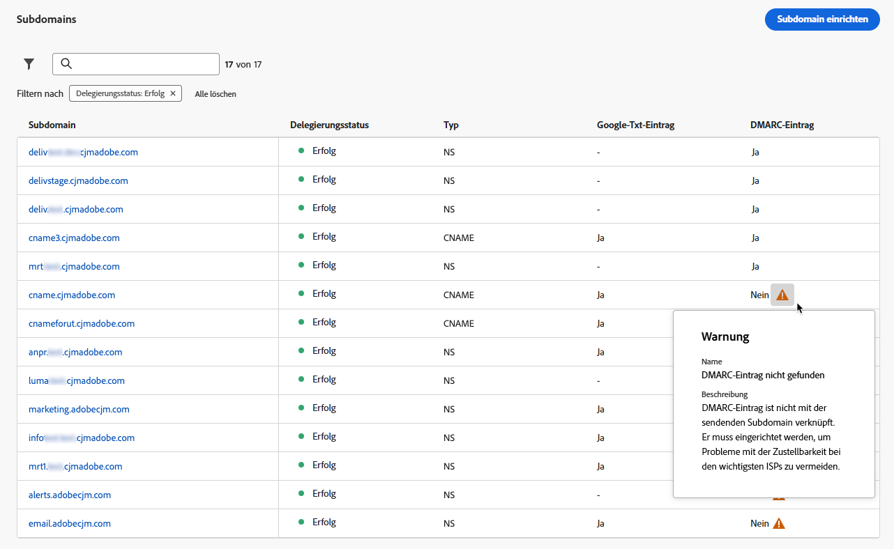
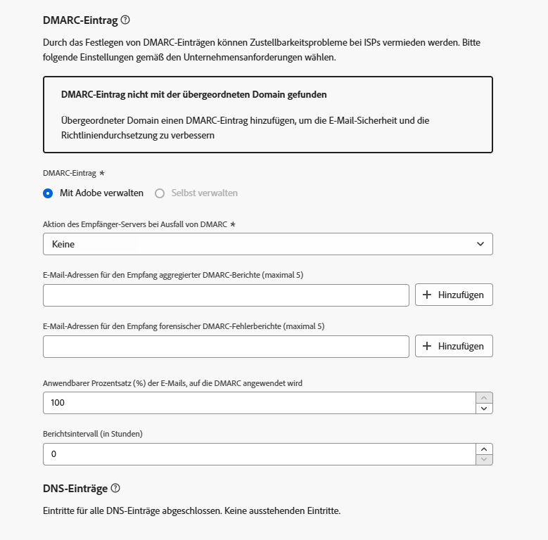
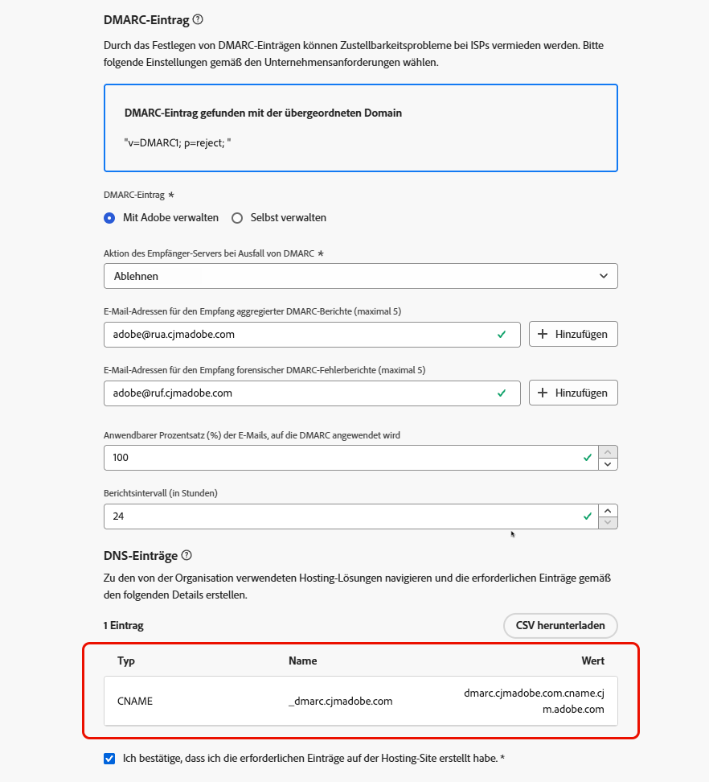
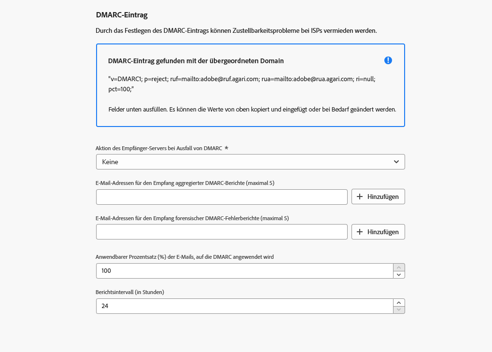
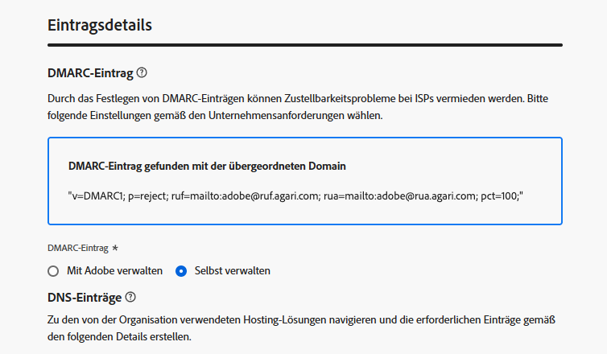
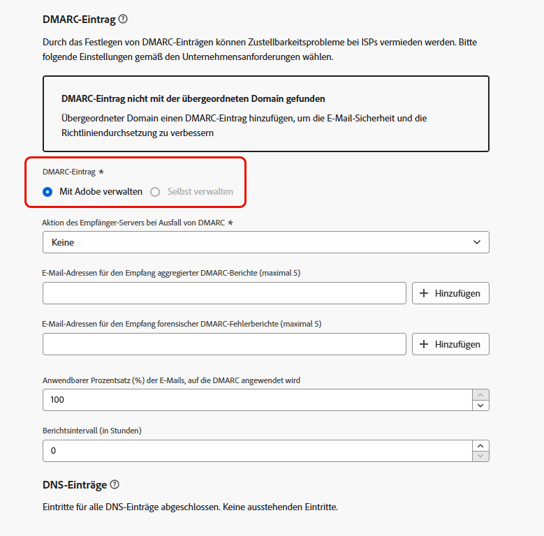
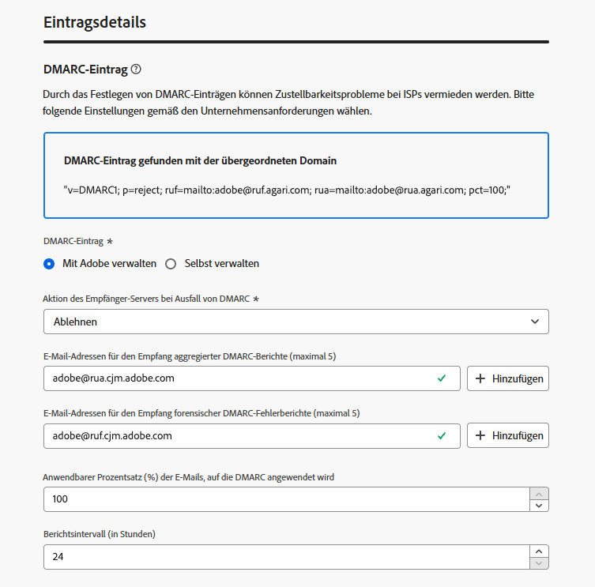

# DMARC-Eintrag {#dmarc-record}

>[!CONTEXTUALHELP]
>id="ajo_admin_dmarc_record"
>title="DMARC-Eintrag festlegen"
>abstract="DMARC ist eine E-Mail-Authentifizierungsmethode, mit der Domain-Besitzer ihre Domain vor unbefugter Verwendung schützen und Zustellbarkeitsprobleme bei Postfachanbietern vermeiden können. Im Rahmen der Durchsetzung der branchenüblichen Best Practices werden Google und Yahoo! Sie benötigen beide einen DMARC-Eintrag für jede Domain, die Sie zum Senden von E-Mails an sie verwenden."

## Was ist DMARC? {#what-is-dmarc}

Domain-based Message Authentication, Reporting, and Conformance (DMARC) ist eine E-Mail-Authentifizierungsmethode, mit der Domain-Inhaber ihre Domain vor unbefugter Verwendung schützen können. E-Mail-Anbietern und Internet-Service-Anbietern (ISPs) eine klare Richtlinie bietet, verhindert sie, dass böswillige Akteure E-Mails versenden, die behaupten, von Ihrer Domain zu stammen. Die Implementierung von DMARC verringert das Risiko, dass rechtmäßige E-Mails als Spam gekennzeichnet oder abgelehnt werden, und verbessert die Zustellbarkeit Ihrer E-Mails.

DMARC bietet außerdem Berichte zu Nachrichten, bei denen die Authentifizierung fehlschlägt, sowie Kontrolle über die Verarbeitung von E-Mails, die die DMARC-Validierung nicht bestehen. Je nach implementierter [DMARC-Richtlinie](#dmarc-policies) können diese E-Mails überwacht, unter Quarantäne gestellt oder abgelehnt werden. Mit diesen Funktionen können Sie Maßnahmen ergreifen, um potenzielle Fehler zu beheben und zu beheben.

Um Zustellbarkeitsprobleme zu vermeiden und gleichzeitig die Kontrolle über E-Mails zu erhalten, bei denen die Authentifizierung fehlschlägt, unterstützt [!DNL Journey Optimizer] jetzt die DMARC-Technologie direkt in der Administrationsoberfläche. [Weitere Informationen](#implement-dmarc)

### Wie funktioniert DMARC? {#how-dmarc-works}

SPF und DKIM werden beide verwendet, um eine E-Mail mit einer Domain zu verknüpfen und bei der E-Mail-Authentifizierung zusammenzuarbeiten. DMARC geht einen Schritt weiter und verhindert Spoofing, indem die von DKIM und SPF überprüfte Domain abgeglichen wird.

>[!NOTE]
>
>In Journey Optimizer sind SPF und DKIM für Sie konfiguriert.

Um DMARC zu übergeben, muss eine Nachricht SPF oder DKIM übergeben:

* SPF (Sender Policy Framework) hilft bei der Überprüfung, ob die E-Mail-Nachricht von einer autorisierten Quelle stammt, indem die IP-Adresse des Versand-Servers mit einer Liste der autorisierten IP-Adressen für die Domain abgeglichen wird.
* DKIM (DomainKeys Identified Mail) fügt E-Mail-Nachrichten eine digitale Signatur hinzu, sodass der Empfänger die Integrität und Authentizität der Nachricht überprüfen kann.

Wenn die Authentifizierung bei beiden oder einer dieser Methoden fehlschlägt, schlägt DMARC fehl und die E-Mail wird gemäß der von Ihnen ausgewählten DMARC-Richtlinie zugestellt.

<!--DMARC requires alignment between the 'From" and 'Return-Path' address.-->

### DMARC-Richtlinien {#dmarc-policies}

Wenn die DMARC-Authentifizierung einer E-Mail fehlschlägt, können Sie entscheiden, welche Aktion auf diese Nachricht angewendet werden soll. DMARC hat drei Richtlinienoptionen:

* Überwachen (p=none): Weist den Postfachanbieter/ISP an, alles zu tun, was er normalerweise mit der Nachricht tun würde.
* Quarantäne (p=quarantine): Weist den Postfachanbieter/ISP an, E-Mails zu versenden, die DMARC nicht an den Spam- oder Junk-Ordner des Empfängers weiterleiten.
* Ablehnen (p=Ablehnen): Weist den Postfachanbieter/ISP an, E-Mails zu blockieren, die DMARC nicht weiterleiten, was zu einem Bounce führt.

>[!NOTE]
>
>In diesem Abschnitt erfahren Sie, wie Sie die DMARC[Richtlinie mit [!DNL Journey Optimizer] ](#set-up-dmarc).

## DMARC-Anforderungsaktualisierung {#dmarc-update}

Im Rahmen der Durchsetzung der branchenüblichen Best Practices werden Google und Yahoo! Sie benötigen beide einen **DMARC-Eintrag** für jede Domain, die Sie zum Senden von E-Mails an sie verwenden. Diese neue Anforderung gilt ab **1. Februar 2024**.

>[!CAUTION]
>
>Nichtbeachtung dieser neuen Anforderung von Gmail und Yahoo! wird erwartet, dass E-Mails in den Spam-Ordner gelangen oder blockiert werden.

Daher empfiehlt Adobe dringend, die folgenden Maßnahmen zu ergreifen:

* Stellen Sie sicher, dass **DMARC-Eintrag** für **alle Subdomains, die Sie bereits delegiert haben)** Adobe in [!DNL Journey Optimizer] eingerichtet ist. [Weitere Informationen](#check-subdomains-for-dmarc)

* Beim **Delegieren einer neuen Subdomain** an Adobe können Sie **DMARC** direkt in der [!DNL Journey Optimizer]-Verwaltungsoberfläche einrichten. [Weitere Informationen](#set-up-dmarc)

## Implementieren von DMARC in [!DNL Journey Optimizer] {#implement-dmarc}

Über die [!DNL Journey Optimizer] Verwaltungsoberfläche können Sie einen DMARC-Eintrag für alle Subdomains einrichten, die Sie bereits an Adobe delegiert haben oder gerade delegieren. Die detaillierten Schritte werden unten beschrieben.

### Überprüfen bestehender Subdomains für DMARC {#check-subdomains-for-dmarc}

Gehen Sie wie folgt vor, um sicherzustellen, dass für alle Subdomains, die Sie in [!DNL Journey Optimizer] delegiert haben, ein DMARC-Eintrag eingerichtet ist.

1. Rufen Sie das Menü **[!UICONTROL Administration]** > **[!UICONTROL Kanäle]** > **[!UICONTROL E-Mail-Einstellungen]** > **[!UICONTROL Subdomains]** auf und klicken Sie dann auf **[!UICONTROL Subdomain einrichten]**.

1. Überprüfen Sie für jede delegierte Subdomain die Spalte **[!UICONTROL DMARC-Eintrag]** . Wenn für eine bestimmte Subdomain kein Eintrag gefunden wurde, wird ein Warnhinweis angezeigt.

   

   >[!CAUTION]
   >
   >Um die neuen Anforderungen von Gmail und Yahoo! zu erfüllen und Zustellbarkeitsprobleme bei Top-ISPs zu vermeiden, wird empfohlen, einen DMARC-Eintrag für alle delegierten Subdomains einzurichten. [Weitere Informationen](dmarc-record-update.md)

1. Wählen Sie eine Subdomain ohne verknüpften DMARC-Eintrag aus und füllen Sie den Abschnitt **[!UICONTROL DMARC]** Eintrag} gemäß den Anforderungen Ihres Unternehmens aus. Die Schritte zum Ausfüllen der DMARC-Datensatzfelder werden in [diesem Abschnitt) ](#set-up-dmarc).

   <!---->

   >[!NOTE]
   >
   >Je nachdem, ob ein DMARC-Eintrag mit der übergeordneten Domain gefunden wird oder nicht, können Sie die Werte aus der übergeordneten Domain verwenden oder Adobe den DMARC-Eintrag verwalten lassen. [Weitere Informationen](#manage-dmarc-with-adobe)

1. Wenn Sie eine Subdomain bearbeiten, die:

   * [Vollständig delegiert](delegate-subdomain.md#set-up-subdomain) an Adobe ist keine weitere Aktion erforderlich.

   * Bei der Einrichtung mit [CNAME](delegate-subdomain.md#cname-subdomain-setup) müssen Sie den DNS-Eintrag für DMARC in Ihre Hosting-Lösung kopieren, um die entsprechenden DNS-Einträge zu generieren.

     

     Stellen Sie sicher, dass der DNS-Eintrag in Ihrer Domain-Hosting-Lösung generiert wurde, und aktivieren Sie das Kontrollkästchen „Ich bestätige…“.

1. Speichern Sie Ihre Änderungen.

### Einrichten von DMARC für neue Subdomains {#set-up-dmarc}

Beim Delegieren neuer Subdomains an Adobe in [!DNL Journey Optimizer] wird für Ihre Domain ein DMARC-Eintrag im DNS erstellt. Gehen Sie wie folgt vor, um DMARC zu implementieren.

>[!CAUTION]
>
>Um die neuen Anforderungen von Gmail und Yahoo! zu erfüllen und Zustellbarkeitsprobleme bei Top-ISPs zu vermeiden, wird empfohlen, einen DMARC-Eintrag für alle delegierten Subdomains einzurichten. [Weitere Informationen](dmarc-record-update.md)

<!--If you fail to comply with the new requirement from Gmail and Yahoo! to have DMARC record for all sending domains, your emails are expected to land into the spam folder or to get blocked.-->

1. Richten Sie eine neue Subdomain ein. [Weitere Informationen](delegate-subdomain.md)

1. Wechseln Sie zum Abschnitt **[!UICONTROL DMARC-]**.

1. Wenn in der Ihrer Subdomain zugeordneten übergeordneten Domain ein DMARC-Eintrag verfügbar ist, werden zwei Optionen angezeigt:

   

   * **[!UICONTROL Mit Adobe verwalten]**: Sie können Adobe den DMARC-Eintrag für Ihre Subdomain verwalten lassen. Befolgen Sie die in [diesem Abschnitt](#manage-dmarc-with-adobe) beschriebenen Schritte.

   * **[!UICONTROL Eigenständig verwalten]**: <!--This option is selected by default.-->Mit dieser Option können Sie den DMARC-Eintrag außerhalb von [!DNL Journey Optimizer] verwalten, indem Sie die Werte aus Ihrer übergeordneten Domain verwenden. Diese Werte werden in der Benutzeroberfläche angezeigt, können jedoch nicht bearbeitet werden.

     {width="80%"}

1. Wenn in der übergeordneten Domain kein DMARC-Eintrag gefunden wird, ist nur die Option **[!UICONTROL Mit Adobe verwalten]** verfügbar. Gehen Sie wie [ vor](#manage-dmarc-with-adobe) um einen DMARC-Eintrag für Ihre Subdomain einzurichten.

   {width="80%"}

### Verwalten von DMARC-Einträgen mit Adobe {#manage-dmarc-with-adobe}

Damit Adobe den DMARC-Datensatz für Sie verwalten kann, wählen Sie die Option **[!UICONTROL Mit Adobe verwalten]** und führen Sie die folgenden Schritte aus.

>[!NOTE]
>
>* Wenn sie von [!DNL Journey Optimizer] abgerufen werden, können Sie dieselben Werte wie in der Benutzeroberfläche hervorgehoben verwenden oder sie nach Bedarf ändern.
>* Wenn Sie keine Werte hinzufügen, werden die vorausgefüllten Standardwerte verwendet.

{width="80%"}

1. Definieren Sie die Aktion, die der Empfängerserver ausführen soll, wenn DMARC fehlschlägt. Wählen Sie je nach der ](#dmarc-policies) [DMARC-Richtlinie, die Sie anwenden möchten, eine der drei Optionen aus:

   * **[!UICONTROL Keine]** (Standardwert): Weist den Empfänger an, keine Aktionen für Nachrichten durchzuführen, bei denen die DMARC-Authentifizierung fehlschlägt, aber dennoch E-Mail-Berichte an den Absender zu senden.
   * **[!UICONTROL Quarantäne]**: Weist den empfangenden E-Mail-Server an, E-Mails unter Quarantäne zu stellen, bei denen die DMARC-Authentifizierung fehlschlägt. Dies bedeutet im Allgemeinen, dass diese Nachrichten im Spam- oder Junk-Ordner der Empfängerin bzw. des Empfängers abgelegt werden.
   * **[!UICONTROL Ablehnen]**: Weist den Empfänger an, alle E-Mails für die Domain, deren Authentifizierung fehlschlägt, vollständig abzulehnen (Bounce). Wenn diese Richtlinie aktiviert ist, haben nur E-Mails, die zu 100 % von Ihrer Domain authentifiziert wurden, überhaupt eine Chance auf die Platzierung im Posteingang.

   >[!NOTE]
   >
   >Als Best Practice wird empfohlen, die DMARC-Implementierung langsam einzuführen, indem Sie Ihre DMARC-Richtlinie von **Keine** über **Quarantäne** bis **Ablehnen** eskalieren, sobald Sie die potenziellen Auswirkungen von DMARC verstehen.

1. Optional können Sie eine oder mehrere E-Mail-Adressen Ihrer Wahl hinzufügen, um anzugeben, wohin **DMARC-** bei E-Mails [fehlgeschlagene Authentifizierung](#how-dmarc-works) innerhalb Ihrer Organisation gehen sollen. Pro Bericht können bis zu fünf Adressen hinzugefügt werden.

   >[!NOTE]
   >
   >* Stellen Sie sicher, dass Sie einen echten Posteingang (nicht Adobe) in Ihrem Steuerelement haben, in dem Sie diese Berichte erhalten können.
   >* Diese hochtechnischen Berichte bieten einen Überblick über E-Mails, die Spoofing-Versuch sind und am besten über ein Tool eines Drittanbieters verdaut werden.

   Es gibt zwei verschiedene von ISPs generierte Berichte, die Absender über die RUA/RUF-Tags in ihren DMARC-Richtlinien erhalten können:

   * **Aggregierte Berichte** (RUA): Sie enthalten keine personenbezogenen Daten (PII), die unter die DSGVO fallen könnten.
   * **Forensische Fehlerberichte** (RUF): Sie enthalten DSGVO-sensible E-Mail-Adressen. Bevor Sie verwenden, überprüfen Sie intern, wie Sie mit Informationen umgehen, die DSGVO-konform sein müssen.

1. Wählen Sie den **entsprechenden Prozentsatz** der E-Mails für DMARC aus.

   Dieser Prozentsatz hängt von Ihrem Vertrauen in Ihre E-Mail-Infrastruktur und der Toleranz für falsch-positive E-Mails (legitime E-Mails werden als betrügerisch markiert) ab. Es ist üblich, dass Unternehmen mit der Einstellung „Keine“ für die DMARC **Richtlinie beginnen** den DMARC-Richtlinienprozentsatz schrittweise erhöhen und die Auswirkungen auf den rechtmäßigen E-Mail-Versand genau überwachen.

   >[!NOTE]
   >
   >Arbeiten Sie mit Ihren E-Mail-Administratoren und Ihrem IT-Team zusammen, um den Prozentsatz schrittweise zu erhöhen, wenn Sie Vertrauen in Ihre E-Mail-Authentifizierungspraktiken gewinnen.

   Als Best Practice empfiehlt sich eine hohe DMARC-Compliance-Rate, idealerweise nahe 100 %, um die Sicherheitsvorteile zu maximieren und gleichzeitig das Risiko falsch positiver Ergebnisse zu minimieren.

1. Wählen Sie ein **Reporting-Intervall** zwischen 24 und 168 Stunden aus. Domain-Besitzer erhalten dadurch regelmäßige Aktualisierungen der E-Mail-Authentifizierungsergebnisse und können die erforderlichen Maßnahmen zur Verbesserung der E-Mail-Sicherheit ergreifen.

### Fehlerbehebung {#troubleshooting}

Beim Einrichten eines DMARC-Eintrags wird den DNS-Einstellungen Ihrer Domain ein DNS-TXT-Eintrag hinzugefügt, der Ihre DMARC-Richtlinie angibt.

**Zeitpunkt der DNS-Übertragung**

DNS-Änderungen werden erst nach einiger Zeit über das Internet propagiert, in der Regel zwischen einigen Minuten und 48 Stunden. Wenn Sie gerade eine DMARC-Konfigurationsänderung vorgenommen haben und versuchen, das Update sofort zu überprüfen, werden möglicherweise Fehler angezeigt oder die Änderungen werden noch nicht erkannt.

Warten Sie ausreichend lange, bis die DNS-Einträge übertragen wurden, bevor Sie versuchen, Ihr DMARC-Setup zu überprüfen. Wenn nach 48 Stunden weiterhin Probleme auftreten, stellen Sie sicher, dass die DNS-Einträge korrekt zu Ihrer Hosting-Lösung hinzugefügt wurden.

<!--
The DMARC reporting interval is specified in the DMARC policy published in the DNS (Domain Name System) records for a domain. The reporting interval can be set to daily, weekly, or another specified frequency, depending on the domain owner's preferences.

The default value (24 hours) is generally the email providers' expectation.
-->

<!--
## What are the benefits of DMARC? {#dmarc-benefits}

The key benefits or DMARC are as folllows:

* Setting up a DMARC record involves adding a DNS TXT record to your domain's DNS settings. This record specifies your DMARC policy, such as whether to quarantine or reject messages that fail authentication. Implementing DMARC is a proactive step towards enhancing email security and protecting both your organization and your recipients from email-based threats.

* DMARC helps prevent malicious actors from sending emails that appear to come from your domain. By setting up DMARC, you can specify how email providers should handle messages that fail authentication checks, reducing the likelihood that phishing emails will reach recipients.

* DMARC helps improve email deliverability by providing a clear policy for email providers to follow when encountering messages claiming to be from your domain. This can reduce the chances of legitimate emails being marked as spam or rejected.

* DMARC helps protect against email spoofing, phishing, and other fraudulent activities.

* It allows you to decide how a mailbox provider should handle emails that fail SPF and DKIM checks, providing a way to authenticate the sender's domain and prevent unauthorized use of the domain for malicious purposes.

* DMARC allows email receivers to easily identify the authentication of emails, which could potentially improve delivery.

* It offers reporting on which messages fail SPF and/or DKIM, enabling senders to gain visibility.

* This increased visibility allows for steps to be taken to mitigate further errors. It gives senders a degree of control over what happens with mail that does not pass either of these authentication methods.
-->
