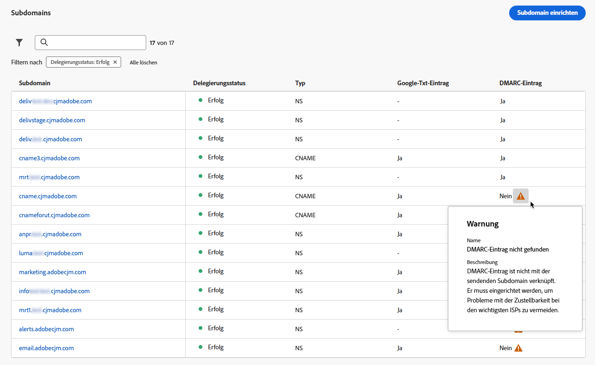

# DMARC-Eintrag {#dmarc-record}

>[!CONTEXTUALHELP]
>id="ajo_admin_dmarc_record"
>title="Festlegen des DMARC-Datensatzes"
>abstract="DMARC ist eine E-Mail-Authentifizierungsmethode, mit der Domain-Inhaber ihre Domain vor unbefugter Verwendung schützen und Zustellbarkeitsprobleme mit Postfachanbietern vermeiden können. Im Rahmen ihrer branchenüblichen Best Practices erzwingen Google und Yahoo! Sie benötigen beide einen DMARC-Datensatz für jede Domäne, mit der Sie E-Mails an sie senden."

## Was ist DMARC? {#what-is-dmarc}

Domain-based Message Authentication, Reporting and Conformance (DMARC) ist eine E-Mail-Authentifizierungsmethode, mit der Domain-Inhaber ihre Domain vor nicht autorisierter Verwendung schützen können. Durch eine klare Richtlinie für E-Mail-Anbieter/ISPs verhindert sie, dass böswillige Akteure E-Mails versenden, die behaupten, von Ihrer Domäne zu sein. Die Implementierung von DMARC verringert das Risiko, dass E-Mails als Spam gekennzeichnet oder abgelehnt werden, und verbessert die Zustellbarkeit Ihrer E-Mail.

DMARC bietet außerdem Berichte zu Nachrichten, die bei der Authentifizierung fehlschlagen, sowie Kontrolle über die Verarbeitung von E-Mails, die die DMARC-Validierung nicht bestehen. Abhängig von der Implementierung [DMARC-Richtlinie](#dmarc-policies)können diese E-Mails überwacht, unter Quarantäne gestellt oder abgelehnt werden. Mit diesen Funktionen können Sie Maßnahmen ergreifen, um potenzielle Fehler zu vermeiden und zu beheben.

<!--To help you prevent deliverability issues by allowing ISPs to authenticate your sending domains - while gaining visibility and control over mail that fail this authentication, [!DNL Journey Optimizer] will soon be supporting the DMARC technology directly in its administration interface.-->

Um Probleme bei der Zustellbarkeit zu vermeiden und gleichzeitig die Kontrolle über E-Mails zu erhalten, die nicht authentifiziert werden können, [!DNL Journey Optimizer] unterstützt jetzt die DMARC-Technologie direkt in der Administrationsoberfläche. [Weitere Informationen](#implement-dmarc)

### Wie funktioniert DMARC? {#how-dmarc-works}

SPF und DKIM werden verwendet, um eine E-Mail mit einer Domain zu verknüpfen und gemeinsam E-Mails zu authentifizieren. DMARC geht noch einen Schritt weiter und hilft, das Spoofing zu verhindern, indem die von DKIM und SPF überprüfte Domain abgeglichen wird.

>[!NOTE]
>
>In Journey Optimizer sind SPF und DKIM für Sie konfiguriert.

Um DMARC zu übergeben, muss eine Nachricht SPF oder DKIM übergeben:

* Mit SPF (Sender Policy Framework) können Sie überprüfen, ob die E-Mail-Nachricht von einer autorisierten Quelle stammt, indem Sie die IP-Adresse des sendenden Servers mit einer Liste autorisierter IP-Adressen für die Domain vergleichen.
* DKIM (DomainKeys Identified Mail) fügt E-Mail-Nachrichten eine digitale Signatur hinzu, sodass der Empfänger die Integrität und Authentizität der Nachricht überprüfen kann.

Wenn beide oder eine dieser Authentifizierungsfehler auftritt, schlägt DMARC fehl und die E-Mail wird gemäß Ihrer ausgewählten DMARC-Richtlinie zugestellt.

<!--DMARC requires alignment between the 'From" and 'Return-Path' address.-->

### DMARC-Richtlinien {#dmarc-policies}

Wenn die DMARC-Authentifizierung einer E-Mail fehlschlägt, können Sie entscheiden, welche Aktion auf diese Nachricht angewendet wird. DMARC verfügt über drei Richtlinienoptionen:

* Überwachen (p=none): Weist den Postfachanbieter/ISP an, mit der Nachricht zu verfahren, wie er es normalerweise tun würde.
* Quarantäne (p=quarantine): Weist den Postfachanbieter/ISP an, E-Mails zu senden, die DMARC nicht an den Spam- oder Junk-Ordner des Empfangenden weitergeben.
* Ablehnen (p=reject): Weist den Postfachanbieter/ISP an, E-Mails zu blockieren, die DMARC nicht weiterleiten und zu einem Bounce führen.

>[!NOTE]
>
>Erfahren Sie, wie Sie die DMARC-Richtlinie mit [!DNL Journey Optimizer] in [diesem Abschnitt](#set-up-dmarc).

## Aktualisierung der DMARC-Anforderungen {#dmarc-update}

Im Rahmen ihrer branchenüblichen Best Practices erzwingen Google und Yahoo! Sie benötigen beide eine **DMARC-Eintrag** für jede Domain, die Sie zum Senden von E-Mails verwenden. Diese neue Anforderung gilt ab **1. Februar 2024**.

Erfahren Sie mehr über Google und Yahoo!&#39;Anforderung an [diesem Abschnitt](https://experienceleague.adobe.com/docs/deliverability-learn/deliverability-best-practice-guide/additional-resources/guidance-around-changes-to-google-and-yahoo.html#dmarc){target="_blank"}.

>[!CAUTION]
>
>Diese neue Anforderung von Gmail und Yahoo wird nicht erfüllt! wird erwartet, dass E-Mails in den Spam-Ordner gelangen oder blockiert werden. [Weitere Informationen](https://experienceleague.adobe.com/docs/deliverability-learn/deliverability-best-practice-guide/additional-resources/guidance-around-changes-to-google-and-yahoo.html#how-will-this-impact-me-as-a-marketer%3F){target="_blank"}

Daher empfiehlt Adobe dringend, die folgenden Maßnahmen zu ergreifen:

* Stellen Sie sicher, dass **DMARC-Eintrag** für **alle Subdomains, die Sie bereits zugewiesen haben** Adobe in [!DNL Journey Optimizer]. [Weitere Informationen](#check-subdomains-for-dmarc)

* Wann **Zuweisen einer neuen Subdomain** zum Adobe, können Sie **Einrichten von DMARC** directly **im [!DNL Journey Optimizer] Administrationsoberfläche**. [Weitere Informationen](#implement-dmarc)

## Implementieren von DMARC in [!DNL Journey Optimizer] {#implement-dmarc}

Die [!DNL Journey Optimizer] Administration-Oberfläche ermöglicht Ihnen, DMARC-Datensatz für alle Subdomains einzurichten, die Sie bereits delegiert haben oder an Adobe delegieren. Die detaillierten Schritte werden nachfolgend beschrieben.

### Überprüfen Sie Ihre vorhandenen Subdomains auf DMARC {#check-subdomains-for-dmarc}

Um sicherzustellen, dass Sie DMARC-Datensatz für alle Subdomains eingerichtet haben, die Sie in zugewiesen haben [!DNL Journey Optimizer]führen Sie die folgenden Schritte aus.

1. Gehen Sie zum Menü **[!UICONTROL Administration]** > **[!UICONTROL Kanäle]** > **[!UICONTROL Subdomains]** und klicken Sie auf **[!UICONTROL Subdomain einrichten]**.

1. Überprüfen Sie für jede zugewiesene Subdomain die Option **[!UICONTROL DMARC-Datensatz]** Spalte. Wenn für eine bestimmte Subdomain kein Datensatz gefunden wurde, wird ein Warnhinweis angezeigt.

   

   >[!CAUTION]
   >
   >Um die neue Anforderung von Gmail und Yahoo! zu erfüllen und Zustellbarkeitsprobleme mit Top-ISPs zu vermeiden, wird empfohlen, den DMARC-Datensatz für alle zugewiesenen Subdomains einzurichten. [Weitere Informationen](dmarc-record-update.md)

1. Wählen Sie eine Subdomain ohne zugehörigen DMARC-Datensatz aus und füllen Sie das Feld **[!UICONTROL DMARC-Eintrag]** entsprechend den Anforderungen Ihres Unternehmens. Die Schritte zum Ausfüllen der DMARC-Datensatzfelder werden im Abschnitt [diesem Abschnitt](#implement-dmarc).

1. Beachten Sie die beiden folgenden Optionen:

   * Wenn Sie eine Subdomain bearbeiten, die mit [CNAME](delegate-subdomain.md#cname-subdomain-delegation)müssen Sie den DNS-Eintrag für DMARC in Ihre Hosting-Lösung kopieren, um die entsprechenden DNS-Einträge zu generieren.

     

     Stellen Sie sicher, dass der DNS-Eintrag in Ihrer Domain-Hosting-Lösung generiert wurde, und aktivieren Sie das Kontrollkästchen &quot;Ich versichere..&quot;.

   * Wenn Sie eine Subdomain bearbeiten [vollständig delegiert](delegate-subdomain.md#full-subdomain-delegation) zum Adobe, füllen Sie einfach die **[!UICONTROL DMARC-Eintrag]** Felder, die im Abschnitt [diesem Abschnitt](#implement-dmarc). Es sind keine weiteren Maßnahmen erforderlich.

     

1. Speichern Sie Ihre Änderungen.

### Einrichten von DMARC für neue Subdomains {#set-up-dmarc}

Beim Zuweisen neuer Subdomains zum Adobe in [!DNL Journey Optimizer], wird ein DMARC-Eintrag im DNS für Ihre Domäne erstellt. Gehen Sie wie folgt vor, um DMARC zu implementieren.

>[!CAUTION]
>
>Um die neue Anforderung von Gmail und Yahoo! zu erfüllen und Zustellbarkeitsprobleme mit Top-ISPs zu vermeiden, wird empfohlen, den DMARC-Datensatz für alle zugewiesenen Subdomains einzurichten. [Weitere Informationen](dmarc-record-update.md)

<!--If you fail to comply with the new requirement from Gmail and Yahoo! to have DMARC record for all sending domains, your emails are expected to land into the spam folder or to get blocked.-->

1. Richten Sie eine neue Subdomain ein. [Weitere Informationen](delegate-subdomain.md)

1. Navigieren Sie zu **[!UICONTROL DMARC-Eintrag]** Abschnitt.

   Wenn die Subdomain über einen vorhandenen DMARC-Datensatz verfügt und von abgerufen wird [!DNL Journey Optimizer]können Sie dieselben Werte wie in der Benutzeroberfläche hervorgehoben verwenden oder sie nach Bedarf ändern.

   

   >[!NOTE]
   >
   >Wenn Sie keine Werte hinzufügen, werden die vorausgefüllten Standardwerte verwendet.

1. Definieren Sie die Aktion, die der Empfängerserver ausführen wird, wenn DMARC fehlschlägt. Je nach [DMARC-Richtlinie](#dmarc-policies) Wählen Sie eine der drei Optionen aus, die angewendet werden sollen:

   * **[!UICONTROL Keines]** (Standardwert): Weist den Empfänger an, keine Aktionen für Nachrichten durchzuführen, die die DMARC-Authentifizierung nicht befolgen, aber trotzdem E-Mail-Berichte an den Absender senden.
   * **[!UICONTROL Quarantäne]**: Weist den E-Mail-Empfangs-Server an, E-Mails unter Quarantäne zu stellen, die bei der DMARC-Authentifizierung fehlschlagen. Dies bedeutet im Allgemeinen, diese Nachrichten im Ordner &quot;Spam&quot;oder &quot;Junk&quot;des Empfängers zu platzieren.
   * **[!UICONTROL Ablehnen]**: Weist den Empfänger an, jede E-Mail für die Domain, bei der die Authentifizierung fehlschlägt, vollständig zu verweigern (Bounce). Wenn diese Richtlinie aktiviert ist, haben nur E-Mails, die zu 100 % von Ihrer Domäne authentifiziert wurden, sogar die Möglichkeit, die Posteingangsplatzierung durchzuführen.

   >[!NOTE]
   >
   >Als Best Practice wird empfohlen, die DMARC-Implementierung langsam einzuführen, indem Sie Ihre DMARC-Richtlinie von **Keines**, um **Quarantäne**, um **Ablehnen** wenn Sie die potenziellen Auswirkungen von DMARC verstehen.

1. Fügen Sie optional eine oder mehrere E-Mail-Adressen Ihrer Wahl hinzu, um anzugeben, wo **DMARC-Berichte** zu E-Mails, die [Fail-Authentifizierung](#how-dmarc-works) sollte sich in Ihrer Organisation befinden. Sie können für jeden Bericht bis zu fünf Adressen hinzufügen.

   >[!NOTE]
   >
   >Vergewissern Sie sich, dass Sie über einen echten Posteingang (keine Adobe) verfügen, in dem Sie diese Berichte empfangen können.

   Es gibt zwei verschiedene Berichte, die von ISPs generiert werden und die Absender über die RUA/RUF-Tags in ihrer DMARC-Richtlinie empfangen können:

   * **Aggregierte Berichte** (RUA): Sie enthalten keine personenbezogenen Daten (PII), die DSGVO-abhängig sein könnten.
   * **Berichte zu forensischen Fehlern** (RUF): Sie enthalten E-Mail-Adressen, die DSGVO-konform sind. Prüfen Sie vor der Verwendung intern, wie mit Informationen umgegangen werden soll, die DSGVO-konform sein müssen.

   >[!NOTE]
   >
   >Diese hochtechnischen Berichte bieten einen Überblick über E-Mails, die mit dem Spoofing versucht werden. Sie werden am besten mit einem Tool eines Drittanbieters verdaut.

1. Wählen Sie die **anwendbarer Prozentsatz** von E-Mails für DMARC.

   Dieser Prozentsatz hängt von Ihrem Vertrauen in Ihre E-Mail-Infrastruktur und der Toleranz gegenüber falsch-positiven E-Mails ab (legitime E-Mails werden als betrügerisch gekennzeichnet). Es ist üblich, dass Unternehmen mit der DMARC-Richtlinie beginnen, die auf **Keines** erhöhen Sie schrittweise den Prozentsatz der DMARC-Richtlinien und überwachen Sie die Auswirkungen auf den legitimen E-Mail-Versand.

   >[!NOTE]
   >
   >Arbeiten Sie mit Ihren E-Mail-Administratoren und Ihrem IT-Team zusammen, um den Prozentsatz schrittweise zu erhöhen, sobald Sie Vertrauen in Ihre E-Mail-Authentifizierungspraktiken gewinnen.

   Als Best Practice sollten Sie eine hohe DMARC-Compliance-Rate anstreben, die idealerweise nahe bei 100 % liegt, um die Sicherheitsvorteile zu maximieren und gleichzeitig das Risiko falsch-positiver Werte zu minimieren.

1. Wählen Sie eine **Berichtsintervall** zwischen 24 und 168 Stunden. Domain-Inhaber können damit regelmäßige Updates zu E-Mail-Authentifizierungsergebnissen erhalten und die erforderlichen Maßnahmen zur Verbesserung der E-Mail-Sicherheit ergreifen.

   <!--The DMARC reporting interval is specified in the DMARC policy published in the DNS (Domain Name System) records for a domain. The reporting interval can be set to daily, weekly, or another specified frequency, depending on the domain owner's preferences.

    The default value (24 hours) is generally the email providers' expectation.-->

<!--

Setting up a DMARC record involves adding a DNS TXT record to your domain's DNS settings. This record specifies your DMARC policy, such as whether to quarantine or reject messages that fail authentication. Implementing DMARC is a proactive step towards enhancing email security and protecting both your organization and your recipients from email-based threats.

DMARC helps prevent malicious actors from sending emails that appear to come from your domain. By setting up DMARC, you can specify how email providers should handle messages that fail authentication checks, reducing the likelihood that phishing emails will reach recipients.

DMARC helps improve email deliverability by providing a clear policy for email providers to follow when encountering messages claiming to be from your domain. This can reduce the chances of legitimate emails being marked as spam or rejected.

DMARC helps protect against email spoofing, phishing, and other fraudulent activities.

It allows you to decide how a mailbox provider should handle emails that fail SPF and DKIM checks, providing a way to authenticate the sender's domain and prevent unauthorized use of the domain for malicious purposes.

## What are the benefits of DMARC? {#dmarc-benefits}

The key benefits or DMARC are as folllows:

* DMARC allows email receivers to easily identify the authentication of emails, which could potentially improve delivery.

* It offers reporting on which messages fail SPF and/or DKIM, enabling senders to gain visibility.

* This increased visibility allows for steps to be taken to mitigate further errors. It gives senders a degree of control over what happens with mail that does not pass either of these authentication methods.

-->

