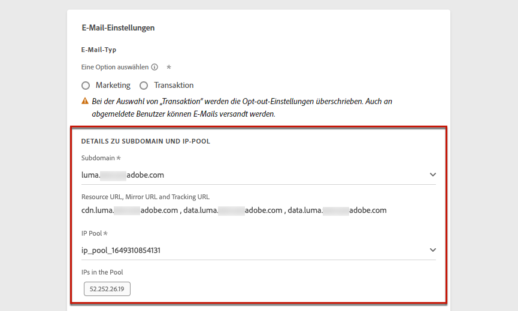
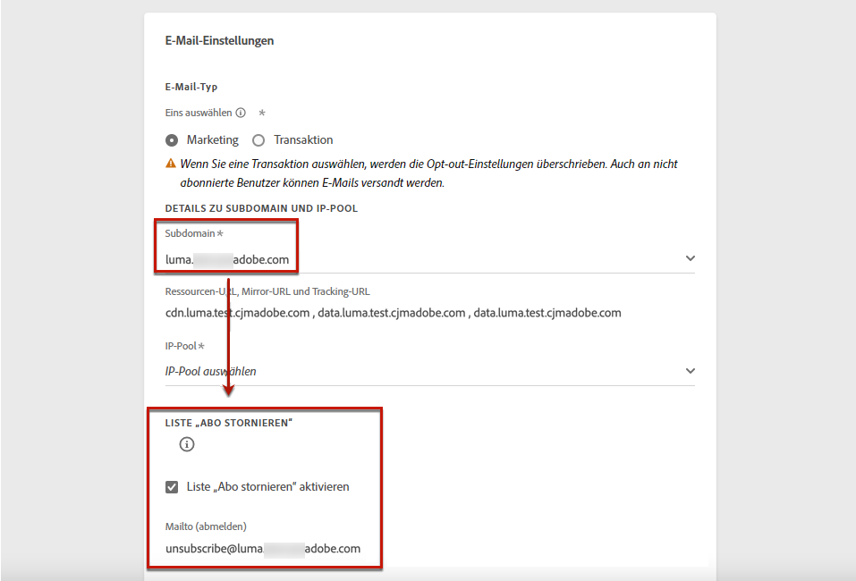
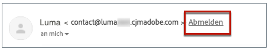
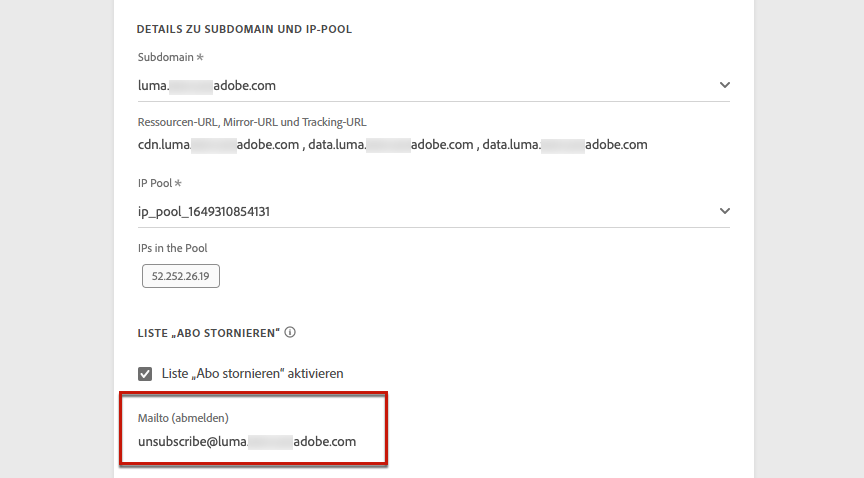
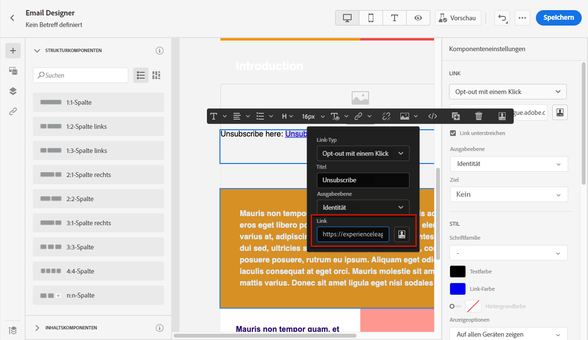
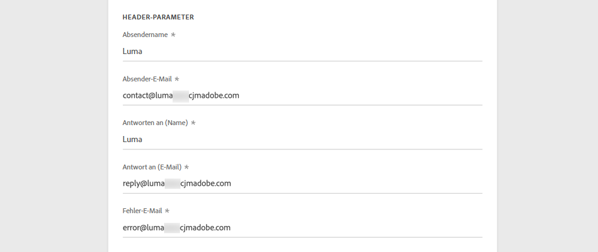
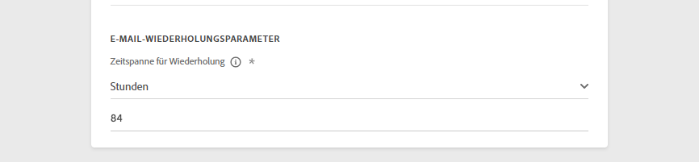
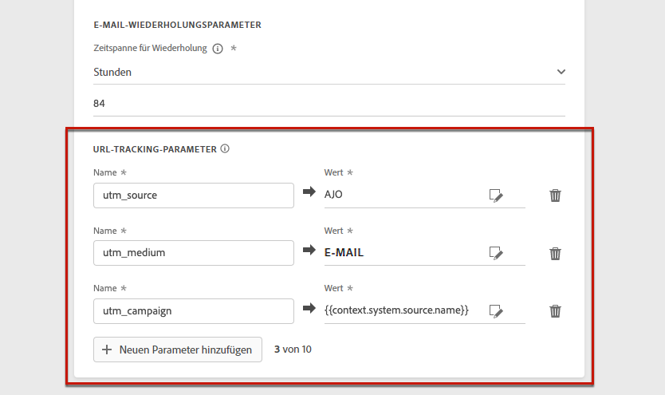
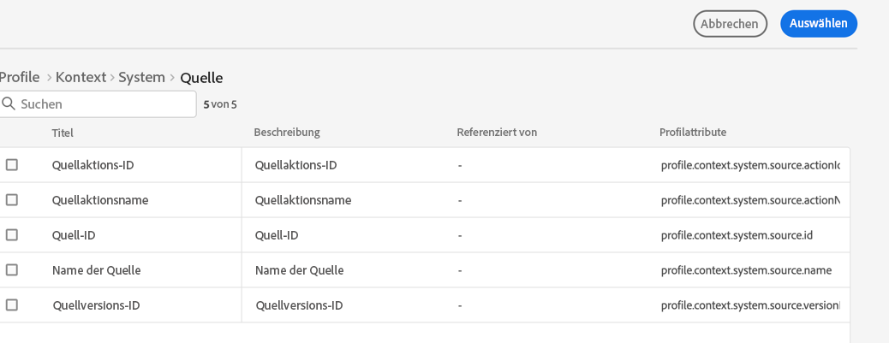
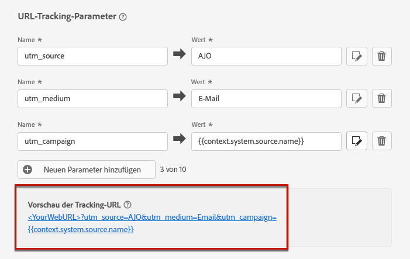

# Konfigurieren von E-Mail-Einstellungen {#email-settings}

Definieren Sie die E-Mail-Einstellungen im entsprechenden Abschnitt der Konfiguration der Nachrichtenvoreinstellungen. In [diesem Abschnitt](message-presets.md) erfahren Sie, wie Sie Nachrichtenvoreinstellungen erstellen.

## E-Mail-Typ {#email-type}

>[!CONTEXTUALHELP]
>id="ajo_admin_presets_emailtype"
>title="Definieren der E-Mail-Kategorie"
>abstract="Wählen Sie den Nachrichtentyp aus, der bei Verwendung dieser Voreinstellung gesendet werden soll: „Marketing“ für Werbenachrichten, für die das Einverständnis des Benutzers erforderlich ist, oder „Transaktion“ für nicht kommerzielle Nachrichten, die in bestimmten Situationen auch an abgemeldete Profile gesendet werden können."

Wählen Sie im Abschnitt **E-MAIL-TYP** die Art der Nachricht, die mit der Voreinstellung gesendet werden soll: **Marketing** oder **Transaktion**.

* Wählen Sie **Marketing** für Werbenachrichten. Diese Nachrichten erfordern das Einverständnis des Benutzers.

* Wählen Sie **Transaktion** für nicht-kommerzielle Nachrichten, wie z. B. Bestellbestätigungen, Benachrichtigungen beim Zurücksetzen des Kennworts oder Versandinformationen.

>[!CAUTION]
>
>**Transaktions**-Nachrichten können auch an Profile gesendet werden, die sich von Marketing-Nachrichten abgemeldet haben. Diese Nachrichten können nur in bestimmten Kontexten gesendet werden.

Wenn Sie [eine Nachricht erstellen](../messages/get-started-content.md#create-new-message), müssen Sie eine gültige Nachrichtenvoreinstellung auswählen, die der für Ihre Nachricht ausgewählten Kategorie entspricht.

## Subdomain und IP-Pool {#subdomains-and-ip-pools}

Im Abschnitt **DETAILS ZU SUBDOMAIN UND IP-POOL** müssen Sie folgendermaßen vorgehen:

1. Wählen Sie die Subdomain aus, die zum Senden der E-Mails verwendet werden soll. [Weitere Informationen](about-subdomain-delegation.md)

1. Wählen Sie den IP-Pool aus, der mit der Voreinstellung verknüpft werden soll. [Weitere Informationen](ip-pools.md)

Sie können nicht mit der Voreinstellungserstellung fortfahren, während sich der ausgewählte IP-Pool [in Bearbeitung](ip-pools.md#edit-ip-pool) befindet (Status **[!UICONTROL Verarbeitung läuft]**) und noch nie mit der ausgewählten Subdomain verknüpft wurde. Andernfalls wird weiterhin die älteste Version der IP-Pool-/Subdomain-Zuordnung verwendet. Wenn dies der Fall ist, speichern Sie die Voreinstellung als Entwurf und versuchen Sie es erneut, sobald der IP-Pool den Status **[!UICONTROL Erfolgreich abgeschlossen]** erreicht hat.

>[!NOTE]
>
>Für Nicht-Produktionsumgebungen erstellt Adobe keine nativen Test-Subdomains und gewährt auch keinen Zugriff auf einen freigegebenen Versand-IP-Pool. Sie müssen [Ihre eigenen Subdomains zuweisen](delegate-subdomain.md) und die IPs des Ihrem Unternehmen zugewiesenen Pools verwenden.

## List-Unsubscribe {#list-unsubscribe}

Bei [der Auswahl einer Subdomain](#subdomains-and-ip-pools) aus der Liste wird die Option zur **[!UICONTROL Aktivierung der Abmeldung von der Liste]** angezeigt.

Standardmäßig ist diese Option aktiviert.

Wenn Sie diese Option aktiviert lassen, wird automatisch ein Abmelde-Link in die E-Mail-Kopfzeile eingefügt, z. B.:

Wenn Sie diese Option deaktivieren, wird in der E-Mail-Kopfzeile kein Abmelde-Link angezeigt.

Der Abmelde-Link besteht aus zwei Elementen:

* Einer **Abmelde-E-Mail-Adresse**, an die alle Abmeldeanfragen gesendet werden.

   Bei [!DNL Journey Optimizer] ist die Abmelde-E-Mail-Adresse die standardmäßig in der Nachrichtenvoreinstellung angezeigte Adresse **[!UICONTROL Mailto (unsubscribe)]** und basiert auf der [ausgewählten Subdomain](#subdomains-and-ip-pools).

   

* Die **Abmelde-URL** ist die URL der Landingpage, auf die der Benutzer gelangt, wenn er sich abgemeldet hat.

   Wenn Sie einen [Ein-Klick-Opt-out-Link](../messages/consent.md#one-click-opt-out) zu einer Nachricht hinzufügen, die mit dieser Voreinstellung erstellt wurde, ist die Abmelde-URL die für den Ein-Klick-Opt-out-Link definierte URL.

   

   >[!NOTE]
   >
   >Wenn Sie in Ihrem Nachrichteninhalt keinen Ein-Klick-Opt-out-Link hinzufügen, wird dem Benutzer keine Landingpage angezeigt.

Weitere Informationen zum Hinzufügen eines Kopfzeilen-Abmelde-Links zu Ihren Nachrichten finden Sie in [diesem Abschnitt](../messages/consent.md#unsubscribe-header).

<!--Select the **[!UICONTROL Custom List-Unsubscribe]** option to enter your own Unsubscribe URL and/or your own Unsubscribe email address.(to add later)-->

## Kopfzeilenparameter{#email-header}

Geben Sie im Abschnitt **[!UICONTROL KOPFZEILENPARAMETER]** die Absendernamen und E-Mail-Adressen ein, die mit dem mit dieser Voreinstellung gesendeten Nachrichtentyp verknüpft sind.

>[!CAUTION]
>
>Die E-Mail-Adressen müssen die aktuell ausgewählte [delegierte Subdomain](about-subdomain-delegation.md) verwenden.

* **[!UICONTROL Absendername]**: Der Name des Absenders, wie z. B. der Name Ihrer Marke.

* **[!UICONTROL Absender-E-Mail]**: Die E-Mail-Adresse, die Sie für Ihre Kommunikation verwenden möchten. Wenn die zugewiesene Subdomain beispielsweise *marketing.luma.com* lautet, können Sie *contact@marketing.luma.com* verwenden.

* **[!UICONTROL Antwort an (Name)]**: Der Name, der verwendet wird, wenn der Empfänger in seiner E-Mail-Client-Software auf den Button **Antworten** klickt.

* **[!UICONTROL Antwort an (E-Mail)]**: Die E-Mail-Adresse, die verwendet wird, wenn der Empfänger in seiner E-Mail-Client-Software auf den Button **Antworten** klickt. Sie müssen eine Adresse verwenden, die in der zugewiesenen Subdomain definiert ist (z. B. *reply@marketing.luma.com*), da ansonsten die E-Mails gelöscht werden.

* **[!UICONTROL E-Mail-Fehler]**: An dieser Adresse werden alle Fehlermeldungen empfangen, die von ISPs nach mehreren Tagen der E-Mail-Zustellung erzeugt wurden (asynchrone Bounces).

>[!NOTE]
>
>Adressen müssen mit einem Buchstaben (A-Z) beginnen und dürfen nur alphanumerische Zeichen enthalten. Sie können auch die Zeichen Unterstrich `_`, Punkt `.` und Bindestrich `-` verwenden.

### Weiterleiten von E-Mails {#forward-email}

Wenn Sie alle von [!DNL Journey Optimizer] für die delegierte Subdomain empfangenen E-Mails an eine bestimmte E-Mail-Adresse weiterleiten möchten, wenden Sie sich an die Kundenunterstützung von Adobe. Sie müssen Folgendes angeben:

* Die E-Mail-Weiterleitungsadresse Ihrer Wahl. Beachten Sie, dass die E-Mail-Adress-Domain für Weiterleitungen nicht mit einer an Adobe delegierten Subdomain übereinstimmen darf.
* Ihren Sandbox-Namen.
* Der Name der Voreinstellung, für die die Weiterleitungs-E-Mail-Adresse verwendet wird.
* Die aktuelle **[!UICONTROL Antwort an (E-Mail)]**-Adresse, die auf der Ebene der Voreinstellung eingestellt ist.

>[!NOTE]
>
>Pro Subdomain kann nur eine Weiterleitungs-E-Mail-Adresse verwendet werden. Wenn mehrere Voreinstellungen dieselbe Subdomain verwenden, muss daher für alle dieselbe Weiterleitungs-E-Mail-Adresse verwendet werden.

Die Weiterleitungs-E-Mail-Adresse wird von Adobe eingerichtet. Dies kann 3 bis 4 Tage dauern.

## BCC-E-Mail-Adresse {#bcc-email}

Sie können eine identische Kopie (oder Blindkopie) von E-Mails senden, die von [!DNL Journey Optimizer] an einen BCC-Posteingang gesendet wurden, in dem sie für Compliance- oder Archivierungszwecke gespeichert werden.

Aktivieren Sie dazu auf der Voreinstellungsebene die optionale Funktion **[!UICONTROL BCC-E-Mail-Adresse]**. [Weitere Informationen](bcc-email.md)

## E-Mail-Wiederholungsparameter {#email-retry}

>[!CONTEXTUALHELP]
>id="ajo_admin_presets_retryperiod"
>title="Anpassen des Wiederholungszeitraumes"
>abstract="Wiederholungen werden 3,5 Tage lang (84 Stunden) durchgeführt, wenn eine E-Mail-Nachricht aufgrund eines temporären Softbounce-Fehlers fehlschlägt. Sie können diesen standardmäßigen Wiederholungszeitraum an Ihre Anforderungen anpassen."
>additional-url="https://experienceleague.adobe.com/docs/journey-optimizer/using/configuration/configuration-message/email-configuration/monitor-reputation/retries.html?lang=de" text="Über weitere Zustellversuche"

Sie können die **E-Mail-Wiederholungsparameter** konfigurieren.

Standardmäßig ist der [Zeitraum für weitere Zustellversuche](retries.md#retry-duration) auf 84 Stunden festgelegt. Sie können diese Einstellung jedoch an Ihre Anforderungen anpassen.

Sie müssen einen ganzzahligen Wert (in Stunden oder Minuten) innerhalb des folgenden Bereichs eingeben:

* Für E-Mails vom Typ Marketing beträgt der Mindestzeitraum für weitere Zustellversuche 6 Stunden.
* Für E-Mails vom Typ Transaktion beträgt der Mindestzeitraum für weitere Zustellversuche 10 Minuten.
* Für beide E-Mail-Typen beträgt der maximale Zeitraum für weitere Zustellversuche 84 Stunden (d. h. 5.040 Minuten).

Weitere Informationen zu weiteren Zustellversuchen finden Sie in [diesem Abschnitt](retries.md).

## URL-Tracking {#url-tracking}

>[!CONTEXTUALHELP]
>id="ajo_admin_preset_utm"
>title="Definieren von URL-Tracking-Parametern"
>abstract="Verwenden Sie diesen Abschnitt, um Tracking-Parameter automatisch an die URLs anzuhängen, die in Ihrem E-Mail-Inhalt vorhanden sind. Diese Funktion ist optional."

>[!CONTEXTUALHELP]
>id="ajo_admin_preset_url_preview"
>title="Vorschau von URL-Tracking-Parametern"
>abstract="Überprüfen Sie, wie Tracking-Parameter an die in Ihrem E-Mail-Inhalt vorhandenen URLs angehängt werden."

Sie können **[!UICONTROL URL-Tracking-Parameter]** , um die Effektivität Ihrer Marketing-Maßnahmen kanalübergreifend zu messen. Diese Funktion ist optional.

Die in diesem Abschnitt definierten Parameter werden an das Ende der URLs angehängt, die im Inhalt Ihrer E-Mail-Nachricht enthalten sind. Anschließend können Sie diese Parameter in Web-Analyse-Tools wie Adobe Analytics oder Google Analytics erfassen und verschiedene Leistungsberichte erstellen.

Beim Erstellen einer Nachrichtenvoreinstellung werden drei URL-Tracking-Parameter automatisch ausgefüllt. Sie können diese bearbeiten und mithilfe der Schaltfläche **[!UICONTROL Neuen Parameter hinzufügen]** bis zu 10 Tracking-Parameter hinzufügen.

Um einen URL-Tracking-Parameter zu konfigurieren, können Sie die gewünschten Werte direkt in die **[!UICONTROL Name]** und **[!UICONTROL Wert]** -Felder.

Sie können auch aus einer Liste vordefinierter Werte wählen, indem Sie zu den folgenden Objekten navigieren:
* Journey-Attribute: **Quellen-ID**, **Quellenname**, **Quellenversions-ID**
* Aktionsattribute: **Aktions-ID**, **Aktionsname**
* Offer-Decisioning-Attribute: **Angebots-ID**, **Angebotsname**

>[!CAUTION]
>
>Wählen Sie keinen Ordner aus: Gehen Sie zum gewünschten Ordner und wählen Sie ein Profilattribut aus, das als Tracking-Parameter-Wert verwendet werden soll.

<!--or edit it using the Expression Editor. Learn more on [personalization](../../personalization/personalize.md#use-expression-editor). Select the contextual attribute of your choice.

You can drag and drop the parameters to reorder them.-->

Im Folgenden finden Sie Beispiele für URLs, die mit Adobe Analytics und Google Analytics kompatibel sind.

* Mit Adobe Analytics kompatible URL: `www.YourLandingURL.com?cid=email_AJO_{{context.system.source.id}}_image_{{context.system.source.name}}`

* Mit Google Analytics kompatible URL: `www.YourLandingURL.com?utm_medium=email&utm_source=AJO&utm_campaign={{context.system.source.id}}&utm_content=image`

>[!NOTE]
>
>Sie können die Eingabe von Textwerten und die Auswahl vordefinierter Werte kombinieren. Jedes **[!UICONTROL Werte]**-Feld kann bis zu 255 Zeichen lang sein.

Sie können die resultierende Tracking-URL dynamisch in der Vorschau anzeigen. Jedes Mal, wenn Sie einen Parameter hinzufügen, bearbeiten oder entfernen, wird die Vorschau automatisch aktualisiert.

