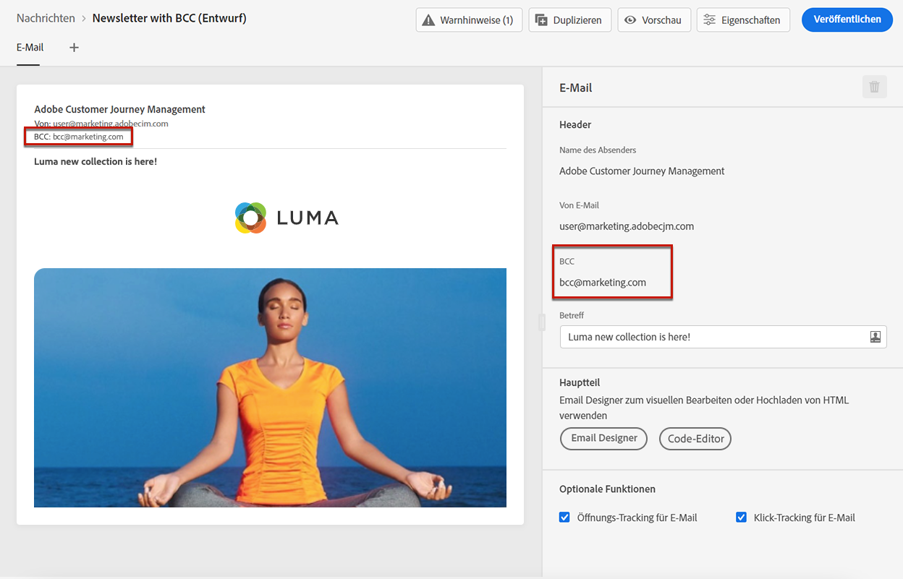
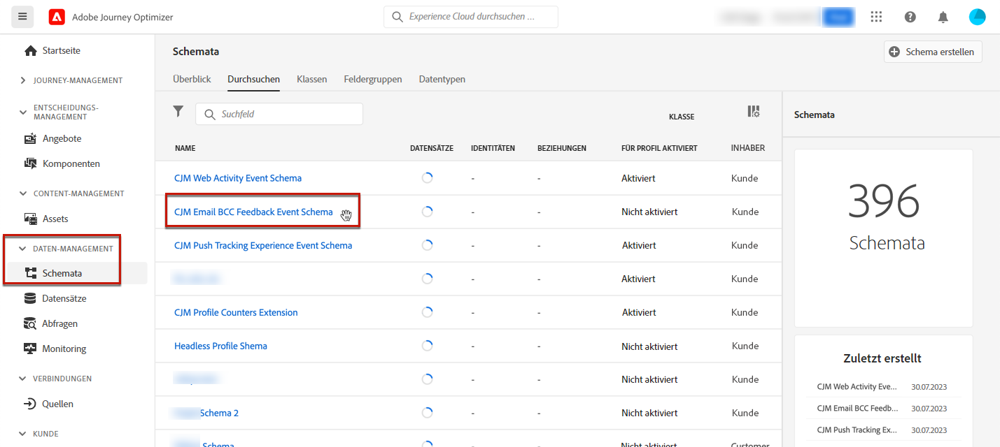
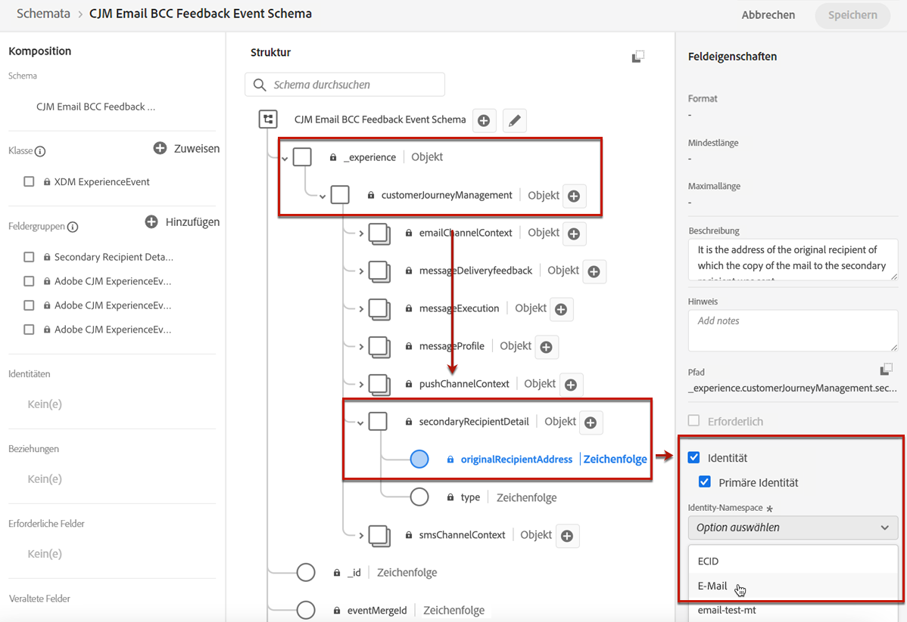
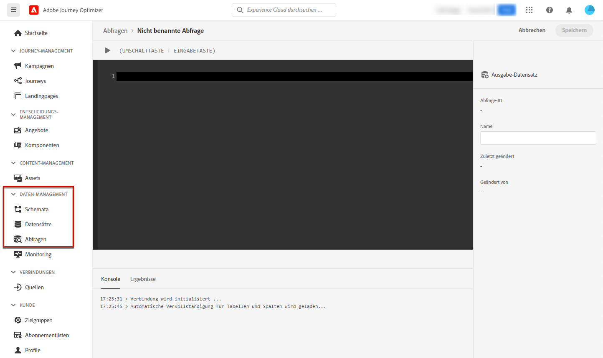

# Konfigurieren von E-Mail-Einstellungen {#email-settings}

Definieren Sie die E-Mail-Einstellungen im entsprechenden Abschnitt der Konfiguration der Nachrichtenvoreinstellungen. In [diesem Abschnitt](message-presets.md) erfahren Sie, wie Sie Nachrichtenvoreinstellungen erstellen.


## E-Mail-Typ {#email-type}

>[!CONTEXTUALHELP]
>id="ajo_admin_presets_emailtype"
>title="Definieren der E-Mail-Kategorie"
>abstract="Wählen Sie den Nachrichtentyp aus, der bei Verwendung dieser Voreinstellung gesendet werden soll: „Marketing“ für Werbenachrichten, für die das Einverständnis des Benutzers erforderlich ist, oder „Transaktion“ für nicht kommerzielle Nachrichten, die in bestimmten Situationen auch an abgemeldete Profile gesendet werden können."

Wählen Sie im Abschnitt **E-MAIL-TYP** die Art der Nachricht, die mit der Voreinstellung gesendet werden soll: **Marketing** oder **Transaktion**.

* Wählen Sie **Marketing** für Werbenachrichten. Diese Nachrichten erfordern das Einverständnis des Benutzers.

* Wählen Sie **Transaktion** für nicht-kommerzielle Nachrichten, wie z. B. Bestellbestätigungen, Benachrichtigungen beim Zurücksetzen des Kennworts oder Versandinformationen.

>[!CAUTION]
>
>**Transaktions**-Nachrichten können auch an Profile gesendet werden, die sich von Marketing-Nachrichten abgemeldet haben. Diese Nachrichten können nur in bestimmten Kontexten gesendet werden.

Wenn Sie [eine Nachricht erstellen](../messages/get-started-content.md#create-new-message), müssen Sie eine gültige Nachrichtenvoreinstellung auswählen, die der für Ihre Nachricht ausgewählten Kategorie entspricht.

## Subdomain und IP-Pool {#subdomains-and-ip-pools}

Im Abschnitt **DETAILS ZU SUBDOMAIN UND IP-POOL** müssen Sie folgendermaßen vorgehen:

1. Wählen Sie die Subdomain aus, die zum Senden der E-Mails verwendet werden soll. [Weitere Informationen](about-subdomain-delegation.md)

1. Wählen Sie den IP-Pool aus, der mit der Voreinstellung verknüpft werden soll. [Weitere Informationen](ip-pools.md)


Sie können nicht mit der Voreinstellungserstellung fortfahren, während sich der ausgewählte IP-Pool [in Bearbeitung](ip-pools.md#edit-ip-pool) befindet (Status **[!UICONTROL Verarbeitung läuft]**) und noch nie mit der ausgewählten Subdomain verknüpft wurde. Andernfalls wird weiterhin die älteste Version der IP-Pool-/Subdomain-Zuordnung verwendet. Wenn dies der Fall ist, speichern Sie die Voreinstellung als Entwurf und versuchen Sie es erneut, sobald der IP-Pool den Status **[!UICONTROL Erfolgreich abgeschlossen]** erreicht hat.

>[!NOTE]
>
>Für Nicht-Produktionsumgebungen erstellt Adobe keine nativen Test-Subdomains und gewährt auch keinen Zugriff auf einen freigegebenen Versand-IP-Pool. Sie müssen [Ihre eigenen Subdomains zuweisen](delegate-subdomain.md) und die IPs des Ihrem Unternehmen zugewiesenen Pools verwenden.

## List-Unsubscribe {#list-unsubscribe}

Bei [der Auswahl einer Subdomain](#subdomains-and-ip-pools) aus der Liste wird die Option zur **[!UICONTROL Aktivierung der Abmeldung von der Liste]** angezeigt.


Standardmäßig ist diese Option aktiviert.

Wenn Sie diese Option aktiviert lassen, wird automatisch ein Abmelde-Link in die E-Mail-Kopfzeile eingefügt, z. B.:


Wenn Sie diese Option deaktivieren, wird in der E-Mail-Kopfzeile kein Abmelde-Link angezeigt.

Der Abmelde-Link besteht aus zwei Elementen:

* Einer **Abmelde-E-Mail-Adresse**, an die alle Abmeldeanfragen gesendet werden.

   Bei [!DNL Journey Optimizer] ist die Abmelde-E-Mail-Adresse die standardmäßig in der Nachrichtenvoreinstellung angezeigte Adresse **[!UICONTROL Mailto (unsubscribe)]** und basiert auf der [ausgewählten Subdomain](#subdomains-and-ip-pools).

   

* Die **Abmelde-URL** ist die URL der Landingpage, auf die der Benutzer gelangt, wenn er sich abgemeldet hat.

   Wenn Sie einen [Ein-Klick-Opt-out-Link](../messages/consent.md#one-click-opt-out) zu einer Nachricht hinzufügen, die mit dieser Voreinstellung erstellt wurde, ist die Abmelde-URL die für den Ein-Klick-Opt-out-Link definierte URL.

   

   >[!NOTE]
   >
   >Wenn Sie in Ihrem Nachrichteninhalt keinen Ein-Klick-Opt-out-Link hinzufügen, wird dem Benutzer keine Landingpage angezeigt.

Weitere Informationen zum Hinzufügen eines Kopfzeilen-Abmelde-Links zu Ihren Nachrichten finden Sie in [diesem Abschnitt](../messages/consent.md#unsubscribe-header).

<!--Select the **[!UICONTROL Custom List-Unsubscribe]** option to enter your own Unsubscribe URL and/or your own Unsubscribe email address.(to add later)-->

## Kopfzeilenparameter{#email-header}

Geben Sie im Abschnitt **[!UICONTROL KOPFZEILENPARAMETER]** die Absendernamen und E-Mail-Adressen ein, die mit dem mit dieser Voreinstellung gesendeten Nachrichtentyp verknüpft sind.

>[!CAUTION]
>
>Die E-Mail-Adressen müssen die aktuell ausgewählte [delegierte Subdomain](about-subdomain-delegation.md) verwenden.

* **[!UICONTROL Absendername]**: Der Name des Absenders, wie z. B. der Name Ihrer Marke.

* **[!UICONTROL Absender-E-Mail]**: Die E-Mail-Adresse, die Sie für Ihre Kommunikation verwenden möchten. Wenn die zugewiesene Subdomain beispielsweise *marketing.luma.com* lautet, können Sie *contact@marketing.luma.com* verwenden.

* **[!UICONTROL Antwort an (Name)]**: Der Name, der verwendet wird, wenn der Empfänger in seiner E-Mail-Client-Software auf den Button **Antworten** klickt.

* **[!UICONTROL Antwort an (E-Mail)]**: Die E-Mail-Adresse, die verwendet wird, wenn der Empfänger in seiner E-Mail-Client-Software auf den Button **Antworten** klickt. Sie müssen eine Adresse verwenden, die in der zugewiesenen Subdomain definiert ist (z. B. *reply@marketing.luma.com*), da ansonsten die E-Mails gelöscht werden.

* **[!UICONTROL E-Mail-Fehler]**: An dieser Adresse werden alle Fehlermeldungen empfangen, die von ISPs nach mehreren Tagen der E-Mail-Zustellung erzeugt wurden (asynchrone Bounces).


>[!NOTE]
>
>Adressen müssen mit einem Buchstaben (A-Z) beginnen und dürfen nur alphanumerische Zeichen enthalten. Sie können auch die Zeichen Unterstrich `_`, Punkt `.` und Bindestrich `-` verwenden.

### Weiterleiten von E-Mails {#forward-email}

Wenn Sie alle von [!DNL Journey Optimizer] für die delegierte Subdomain empfangenen E-Mails an eine bestimmte E-Mail-Adresse weiterleiten möchten, wenden Sie sich an die Kundenunterstützung von Adobe. Sie müssen Folgendes angeben:

* Die E-Mail-Weiterleitungsadresse Ihrer Wahl. Beachten Sie, dass die E-Mail-Adress-Domain für Weiterleitungen nicht mit einer an Adobe delegierten Subdomain übereinstimmen darf.
* Ihren Sandbox-Namen.
* Der Vorgabename, für den die Weiterleitungs-E-Mail-Adresse verwendet wird.
* Die aktuelle **[!UICONTROL Antwort an (E-Mail)]**-Adresse, die auf der Ebene der Voreinstellung eingestellt ist.

>[!NOTE]
>
>Pro Subdomain kann nur eine Weiterleitungs-E-Mail-Adresse verwendet werden. Wenn mehrere Voreinstellungen dieselbe Subdomain verwenden, muss daher für alle dieselbe Weiterleitungs-E-Mail-Adresse verwendet werden.

Die Weiterleitungs-E-Mail-Adresse wird von Adobe eingerichtet. Dies kann 3 bis 4 Tage dauern.

<!--
## BCC email {#bcc-email}

>[!CONTEXTUALHELP]
>id="ajo_admin_preset_bcc"
>title="Define a BCC email address"
>abstract="You can keep a copy of sent emails by sending them to a BCC inbox. Enter the email address of your choice so that every email sent is blind-copied to this BCC address. This feature is optional."

You can send an identical copy (or blind carbon copy) of an email sent by [!DNL Journey Optimizer] to a BCC inbox. This optional feature allows you to retain copies of email communications you send to your users for compliance and/or archival purposes. This will be invisible to the delivery recipients.

>[!CAUTION]
>
>This capability will be available starting **May, 31**.

### Enable BCC email {#enable-bcc}

To enable the **[!UICONTROL BCC email]** option, enter the email address of your choice in the dedicated field. You can specify any external address in correct format, except an email address defined on the delegated subdomain. For example, if the delegated subdomain is *marketing.luma.com*, any address like *abc@marketing.luma.com* is prohibited.

>[!NOTE]
>
>You can only define one BCC email address. Make sure the BCC address has enough reception capacity to store all the emails that are sent using the current preset.
>
>More recommendations are listed in [this section](#bcc-recommendations-limitations).


All email messages using this preset will be blind-copied to the BCC email address you entered. From there, they can be processed and archived using an external system.

>[!CAUTION]
>
>Your BCC feature usage will be counted against the number of messages you are licensed for. Hence, only enable it in the presets used for critical communications that you wish to archive. Check your contract for licensed volumes.

The BCC email address setting is immediately saved and processed at the preset level. When you [create a new message](../messages/get-started-content.md#create-new-message) using this preset, the BCC email address is automatically displayed.



However, the BCC address gets picked up for sending communications following the logic below:

* For batch and burst journeys, it does not apply to batch or burst execution that had already started before the BCC setting is made. The change will be picked up at the next recurrence or new execution.

* For transactional messages, the change is picked up immediately for the next communication (up to one minute delay).

>[!NOTE]
>
>You do not need to republish a message or journey for the BCC setting to be picked up.

### Recommendations and limitations {#bcc-recommendations-limitations}

* To ensure your privacy compliance, BCC emails must be processed by an archiving system capable of storing securely personally identifiable information (PII).

* As messages can contain sensitive or private data, such as personally identifiable information (PII), make sure the BCC address is correct, and secure the access to messages.

* Your inbox used for BCC should be properly managed for space and delivery. If the inbox returns bounces, some emails may not be received and therefore will fail to get archived.

* Messages may be delivered to the BCC email address before the target recipients. BCC messages can also been sent even though the original messages may have [bounced](../reports/suppression-list.md#delivery-failures).

    //////OR: Only successfully sent emails are taken in account. [Bounces](../reports/suppression-list.md#delivery-failures) are not. TO CHECK /////////

* Do not open or click through the emails sent to the BCC address as it is taken into account in the total opens and clicks from the send analysis, which could cause some miscalculations in [reports](../reports/message-monitoring.md). 

* Do not mark messages as spam in the BCC inbox, as it will impact all the other emails sent to this address.


>[!CAUTION]
>
>Do not click the unsubscribe link in the emails sent to the BCC address as you will immediately unsubscribe the corresponding recipients.

### GDPR compliance {#gdpr-compliance}

Regulations such as GDPR state that Data Subjects should be able to modify their consent at any time. Because the BCC emails you are sending with Journey Optimizer include securely personally identifiable information (PII), you must edit the **[!UICONTROL CJM Email BCC Feedback Event Schema]** to be able to manage these PII in compliance with GDPR and similar regulations.

To do this, follow the steps below.

1. Go to **[!UICONTROL Data management]** > **[!UICONTROL Schemas]** > **[!UICONTROL Browse]** and select **[!UICONTROL CJM Email BCC Feedback Event Schema]**.

    

1. Click to expand **[!UICONTROL _experience]**, **[!UICONTROL customerJourneyManagment]** then **[!UICONTROL secondaryRecipientDetail]**.

1. Select **[!UICONTROL originalRecipientAddress]**.

1. In the **[!UICONTROL Field properties]** on the right, scroll down to the **[!UICONTROL Identity]** checkbox.

1. Select it and also select **[!UICONTROL Primary identity]**.

1. Select a namespace from the drop-down list.

    

1. Click **[!UICONTROL Apply]**.

>[!NOTE]
>
>Learn more on managing Privacy and the applicable regulations in the [Experience Platform documentation](https://experienceleague.adobe.com/docs/experience-platform/privacy/home.html){target="_blank"}.

### BCC reporting data {#bcc-reporting}

Reporting as such on BCC is not available in the journey and message reports. However, information is stored on a system dataset called **[!UICONTROL AJO BCC Feedback Event Dataset]**. You can run queries against this dataset to find useful information for debugging purpose for example.

You can access this dataset through the user interface. Select **[!UICONTROL Data management]** > **[!UICONTROL Datasets]** > **[!UICONTROL Browse]** and enable the **[!UICONTROL Show system datasets]** toggle from the filter to display the system-generated datasets. Learn more on how to access datasets in [this section](../start/get-started-datasets.md#access-datasets).


To run queries against this dataset, you can use the Query Editor provided by the [Adobe Experience Platform Query Service](https://experienceleague.adobe.com/docs/experience-platform/query/api/getting-started.html){target="_blank"}. To access it, select **[!UICONTROL Data management]** > **[!UICONTROL Queries]** and click **[!UICONTROL Create query]**. [Learn more](../start/get-started-queries.md)



Depending on what information you are looking for, you can run the following queries.

1. For all the other queries below, you will need the journey action ID. Run this query to fetch all action IDs associated with a particular journey version ID within the last 2 days:

        ```
        SELECT
        DISTINCT
        CAST(TIMESTAMP AS DATE) AS EventTime,
        _experience.journeyOrchestration.stepEvents.journeyVersionID,
        _experience.journeyOrchestration.stepEvents.actionName, 
        _experience.journeyOrchestration.stepEvents.actionID 
        FROM journey_step_events 
        WHERE 
        _experience.journeyOrchestration.stepEvents.journeyVersionID = '<journey version id>' AND 
        _experience.journeyOrchestration.stepEvents.actionID is not NULL AND 
        TIMESTAMP > NOW() - INTERVAL '2' DAY 
        ORDER BY EventTime DESC;
        ```

    >[!NOTE]
    >
    >To get the `<journey version id>`parameter, select the corresponding [journey version](../building-journeys/journey-versions.md) from the **[!UICONTROL Journey management]** > **[!UICONTROL Journeys]** menu. The journey version ID is displayed at the end of the URL displayed in your web browser.
    >
    >

1. Run this query to fetch all message feedback events (especially feedback status) generated for a particular message targeted to a specific user within the last 2 days:

        ```
        SELECT  
        _experience.customerJourneyManagement.messageExecution.journeyVersionID AS JourneyVersionID, 
        _experience.customerJourneyManagement.messageExecution.journeyActionID AS JourneyActionID, 
        timestamp AS EventTime, 
        _experience.customerJourneyManagement.emailChannelContext.address AS RecipientAddress, 
        _experience.customerjourneymanagement.messagedeliveryfeedback.feedbackStatus AS FeedbackStatus,
        CASE _experience.customerjourneymanagement.messagedeliveryfeedback.feedbackStatus
            WHEN 'sent' THEN 'Sent'
            WHEN 'delay' THEN 'Retry'
            WHEN 'out_of_band' THEN 'Bounce' 
            WHEN 'bounce' THEN 'Bounce'
        END AS FeedbackStatusCategory
        FROM cjm_message_feedback_event_dataset 
        WHERE  
            timestamp > now() - INTERVAL '2' day  AND
            _experience.customerJourneyManagement.messageExecution.journeyVersionID = '<journey version id>' AND 
            _experience.customerJourneyManagement.messageExecution.journeyActionID = '<journey action id>' AND  
            _experience.customerJourneyManagement.emailChannelContext.address = '<recipient email address>'
            ORDER BY EventTime DESC;
        ```

    >[!NOTE]
    >
    >To get the `<journey action id>` parameter, run the first query described above using the journey version id. The `<recipient email address>` parameter is the targeted or actual recipient's email address.

1. Run this query to fetch all BCC message feedback events generated for a particular message targeted to a specific user within the last 2 days:

    ```
    SELECT   
    _experience.customerJourneyManagement.messageExecution.journeyVersionID AS JourneyVersionID, 
    _experience.customerJourneyManagement.messageExecution.journeyActionID AS JourneyActionID, 
    _experience.customerJourneyManagement.emailChannelContext.address AS BccEmailAddress,
    timestamp AS EventTime, 
    _experience.customerJourneyManagement.secondaryRecipientDetail.originalRecipientAddress AS RecipientAddress, 
    _experience.customerjourneymanagement.messagedeliveryfeedback.feedbackStatus AS FeedbackStatus,
    CASE _experience.customerjourneymanagement.messagedeliveryfeedback.feedbackStatus
                WHEN 'sent' THEN 'Sent'
                WHEN 'delay' THEN 'Retry'
                WHEN 'out_of_band' THEN 'Bounce' 
                WHEN 'bounce' THEN 'Bounce'
            END AS FeedbackStatusCategory 
    FROM ajo_bcc_feedback_event_dataset  
    WHERE  
    timestamp > now() - INTERVAL '2' day  AND
    _experience.customerJourneyManagement.messageExecution.journeyVersionID = '<journey version id>' AND 
    _experience.customerJourneyManagement.messageExecution.journeyActionID = '<journeyaction id>' AND 
    _experience.customerJourneyManagement.secondaryRecipientDetail.originalRecipientAddress = '<recipient email address>'
    ORDER BY EventTime DESC;
    ```

1. Run this query to fetch all recipient addresses who have not received the message whereas its BCC entry exists within the last 30 days:

    ```
    SELECT
        DISTINCT 
    bcc._experience.customerJourneyManagement.secondaryRecipientDetail.originalRecipientAddress AS RecipientAddressesNotRecievedMessage
    FROM ajo_bcc_feedback_event_dataset bcc
    LEFT JOIN cjm_message_feedback_event_dataset mfe
    ON 
   bcc._experience.customerJourneyManagement.messageExecution.journeyVersionID =
            mfe._experience.customerJourneyManagement.messageExecution.journeyVersionID AND    bcc._experience.customerJourneyManagement.messageExecution.journeyActionID = mfe._experience.customerJourneyManagement.messageExecution.journeyActionID AND 
   bcc._experience.customerJourneyManagement.secondaryRecipientDetail.originalRecipientAddress = mfe._experience.customerJourneyManagement.emailChannelContext.address AND
   mfe._experience.customerJourneyManagement.messageExecution.journeyVersionID = '<journey version id>' AND 
   mfe._experience.customerJourneyManagement.messageExecution.journeyActionID = '<journey action id>' AND
   mfe.timestamp > now() - INTERVAL '30' DAY AND
   mfe._experience.customerjourneymanagement.messagedeliveryfeedback.feedbackstatus IN ('bounce', 'out_of_band') 
    WHERE bcc.timestamp > now() - INTERVAL '30' DAY;
    ```
-->

## E-Mail-Wiederholungsparameter {#email-retry}

>[!CONTEXTUALHELP]
>id="ajo_admin_presets_retryperiod"
>title="Anpassen des Wiederholungszeitraumes"
>abstract="Wiederholungen werden 3,5 Tage lang (84 Stunden) durchgeführt, wenn eine E-Mail-Nachricht aufgrund eines temporären Softbounce-Fehlers fehlschlägt. Sie können diesen standardmäßigen Wiederholungszeitraum an Ihre Anforderungen anpassen."
>additional-url="https://experienceleague.adobe.com/docs/journey-optimizer/using/configuration/configuration-message/email-configuration/monitor-reputation/retries.html?lang=de" text="Über weitere Zustellversuche"

Sie können die **E-Mail-Wiederholungsparameter** konfigurieren.


Standardmäßig ist der [Zeitraum für weitere Zustellversuche](retries.md#retry-duration) auf 84 Stunden festgelegt. Sie können diese Einstellung jedoch an Ihre Anforderungen anpassen.

Sie müssen einen ganzzahligen Wert (in Stunden oder Minuten) innerhalb des folgenden Bereichs eingeben:

* Für E-Mails vom Typ Marketing beträgt der Mindestzeitraum für weitere Zustellversuche 6 Stunden.
* Für E-Mails vom Typ Transaktion beträgt der Mindestzeitraum für weitere Zustellversuche 10 Minuten.
* Für beide E-Mail-Typen beträgt der maximale Zeitraum für weitere Zustellversuche 84 Stunden (d. h. 5.040 Minuten).

Weitere Informationen zu weiteren Zustellversuchen finden Sie in [diesem Abschnitt](retries.md).

## URL-Tracking {#url-tracking}

>[!CONTEXTUALHELP]
>id="ajo_admin_preset_utm"
>title="URL-Tracking-Parameter"
>abstract="Verwenden Sie diesen Abschnitt, um Tracking-Parameter automatisch an die im E-Mail-Inhalt vorhandenen Kampagnen-URLs anzuhängen."

Sie können **[!UICONTROL URL-Tracking-Parameter]** verwenden, um die Effektivität Ihrer Marketing-Maßnahmen kanalübergreifend zu messen. Diese Funktion ist optional.

Die in diesem Abschnitt definierten Parameter werden an das Ende der URLs angehängt, die im Inhalt Ihrer E-Mail-Nachricht enthalten sind. Anschließend können Sie diese Parameter in Web-Analyse-Tools wie Adobe Analytics oder Google Analytics erfassen und verschiedene Leistungsberichte erstellen.


Beim Erstellen einer Nachrichtenvoreinstellung werden drei URL-Tracking-Parameter automatisch ausgefüllt. Sie können diese bearbeiten und mithilfe der Schaltfläche **[!UICONTROL Neuen Parameter hinzufügen]** bis zu 10 Tracking-Parameter hinzufügen.

Um einen URL-Tracking-Parameter zu konfigurieren, können Sie die gewünschten Werte direkt in die Felder **[!UICONTROL Name]** und **[!UICONTROL Wert]** eingeben oder aus einer Liste mit vordefinierten Werten auswählen, indem Sie zu den folgenden Objekten navigieren:

* Journey-Attribute: **Quellen-ID**, **Quellenname**, **Quellenversions-ID**
* Aktionsattribute: **Aktions-ID**, **Aktionsname**
* Offer-Decisioning-Attribute: **Angebots-ID**, **Angebotsname**


>[!CAUTION]
>
>Wählen Sie keinen Ordner aus: Gehen Sie zum gewünschten Ordner und wählen Sie ein Profilattribut aus, das als Tracking-Parameter-Wert verwendet werden soll.

Im Folgenden finden Sie Beispiele für URLs, die mit Adobe Analytics und Google Analytics kompatibel sind.

* Mit Adobe Analytics kompatible URL: `www.YourLandingURL.com?cid=email_AJO_{{context.system.source.id}}_image_{{context.system.source.name}}`

* Mit Google Analytics kompatible URL: `www.YourLandingURL.com?utm_medium=email&utm_source=AJO&utm_campaign={{context.system.source.id}}&utm_content=image`

>[!NOTE]
>
>Sie können die Eingabe von Textwerten und die Auswahl vordefinierter Werte kombinieren. Jedes **[!UICONTROL Werte]**-Feld kann bis zu 255 Zeichen lang sein.
