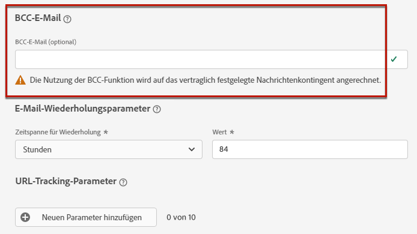

# Konfigurieren von E-Mail-Einstellungen {#email-settings}

Definieren Sie die E-Mail-Einstellungen im entsprechenden Abschnitt der Nachrichtenvorgabenkonfiguration. Erfahren Sie, wie Sie Nachrichtenvorgaben erstellen in [diesem Abschnitt](message-presets.md).


## E-Mail-Typ {#email-type}

>[!CONTEXTUALHELP]
>id="ajo_admin_presets_emailtype"
>title="Definieren der E-Mail-Kategorie"
>abstract="Wählen Sie den Nachrichtentyp aus, der bei Verwendung dieser Voreinstellung gesendet werden soll: „Marketing“ für Werbenachrichten, für die das Einverständnis des Benutzers erforderlich ist, oder „Transaktion“ für nicht kommerzielle Nachrichten, die in bestimmten Situationen auch an abgemeldete Profile gesendet werden können."

Wählen Sie im Abschnitt **E-MAIL-TYP** die Art der Nachricht, die mit der Voreinstellung gesendet werden soll: **Marketing** oder **Transaktion**.

* Wählen Sie **Marketing** für Werbenachrichten. Diese Nachrichten erfordern das Einverständnis des Benutzers.

* Wählen Sie **Transaktion** für nicht-kommerzielle Nachrichten, wie z. B. Bestellbestätigungen, Benachrichtigungen beim Zurücksetzen des Kennworts oder Versandinformationen.

>[!CAUTION]
>
>**Transaktions**-Nachrichten können auch an Profile gesendet werden, die sich von Marketing-Nachrichten abgemeldet haben. Diese Nachrichten können nur in bestimmten Kontexten gesendet werden.

Wenn Sie [eine Nachricht erstellen](../messages/get-started-content.md#create-new-message), müssen Sie eine gültige Nachrichtenvoreinstellung auswählen, die der für Ihre Nachricht ausgewählten Kategorie entspricht.

## Subdomain und IP-Pool {#subdomains-and-ip-pools}

Im Abschnitt **DETAILS ZU SUBDOMAIN UND IP-POOL** müssen Sie folgendermaßen vorgehen:

1. Wählen Sie die Subdomain aus, die zum Senden der E-Mails verwendet werden soll. [Weitere Informationen](about-subdomain-delegation.md)

1. Wählen Sie den IP-Pool aus, der mit der Voreinstellung verknüpft werden soll. [Weitere Informationen](ip-pools.md)


Sie können nicht mit der Voreinstellungserstellung fortfahren, während sich der ausgewählte IP-Pool [in Bearbeitung](ip-pools.md#edit-ip-pool) befindet (Status **[!UICONTROL Verarbeitung läuft]**) und noch nie mit der ausgewählten Subdomain verknüpft wurde. Andernfalls wird weiterhin die älteste Version der IP-Pool-/Subdomain-Zuordnung verwendet. Wenn dies der Fall ist, speichern Sie die Voreinstellung als Entwurf und versuchen Sie es erneut, sobald der IP-Pool den Status **[!UICONTROL Erfolgreich abgeschlossen]** erreicht hat.

>[!NOTE]
>
>Für Nicht-Produktionsumgebungen erstellt Adobe keine nativen Test-Subdomains und gewährt auch keinen Zugriff auf einen freigegebenen Versand-IP-Pool. Sie müssen [Ihre eigenen Subdomains zuweisen](delegate-subdomain.md) und die IPs des Ihrem Unternehmen zugewiesenen Pools verwenden.

## List-Unsubscribe {#list-unsubscribe}

Bei [der Auswahl einer Subdomain](#subdomains-and-ip-pools) aus der Liste wird die Option zur **[!UICONTROL Aktivierung der Abmeldung von der Liste]** angezeigt.


Standardmäßig ist diese Option aktiviert.

Wenn Sie diese Option aktiviert lassen, wird automatisch ein Abmelde-Link in die E-Mail-Kopfzeile eingefügt, z. B.:


Wenn Sie diese Option deaktivieren, wird in der E-Mail-Kopfzeile kein Abmelde-Link angezeigt.

Der Abmelde-Link besteht aus zwei Elementen:

* Einer **Abmelde-E-Mail-Adresse**, an die alle Abmeldeanfragen gesendet werden.

   Bei [!DNL Journey Optimizer] ist die Abmelde-E-Mail-Adresse die standardmäßig in der Nachrichtenvoreinstellung angezeigte Adresse **[!UICONTROL Mailto (unsubscribe)]** und basiert auf der [ausgewählten Subdomain](#subdomains-and-ip-pools).

   

* Die **Abmelde-URL** ist die URL der Landingpage, auf die der Benutzer gelangt, wenn er sich abgemeldet hat.

   Wenn Sie einen [Ein-Klick-Opt-out-Link](../messages/consent.md#one-click-opt-out) zu einer Nachricht hinzufügen, die mit dieser Voreinstellung erstellt wurde, ist die Abmelde-URL die für den Ein-Klick-Opt-out-Link definierte URL.

   

   >[!NOTE]
   >
   >Wenn Sie in Ihrem Nachrichteninhalt keinen Ein-Klick-Opt-out-Link hinzufügen, wird dem Benutzer keine Landingpage angezeigt.

Weitere Informationen zum Hinzufügen eines Kopfzeilen-Abmelde-Links zu Ihren Nachrichten finden Sie in [diesem Abschnitt](../messages/consent.md#unsubscribe-header).

<!--Select the **[!UICONTROL Custom List-Unsubscribe]** option to enter your own Unsubscribe URL and/or your own Unsubscribe email address.(to add later)-->

## Kopfzeilenparameter{#email-header}

Geben Sie im Abschnitt **[!UICONTROL KOPFZEILENPARAMETER]** die Absendernamen und E-Mail-Adressen ein, die mit dem mit dieser Voreinstellung gesendeten Nachrichtentyp verknüpft sind.

>[!CAUTION]
>
>Die E-Mail-Adressen müssen die aktuell ausgewählte [delegierte Subdomain](about-subdomain-delegation.md) verwenden.

* **[!UICONTROL Absendername]**: Der Name des Absenders, wie z. B. der Name Ihrer Marke.

* **[!UICONTROL Absender-E-Mail]**: Die E-Mail-Adresse, die Sie für Ihre Kommunikation verwenden möchten. Wenn die zugewiesene Subdomain beispielsweise *marketing.luma.com* lautet, können Sie *contact@marketing.luma.com* verwenden.

* **[!UICONTROL Antwort an (Name)]**: Der Name, der verwendet wird, wenn der Empfänger in seiner E-Mail-Client-Software auf den Button **Antworten** klickt.

* **[!UICONTROL Antwort an (E-Mail)]**: Die E-Mail-Adresse, die verwendet wird, wenn der Empfänger in seiner E-Mail-Client-Software auf den Button **Antworten** klickt. Sie müssen eine Adresse verwenden, die in der zugewiesenen Subdomain definiert ist (z. B. *reply@marketing.luma.com*), da ansonsten die E-Mails gelöscht werden.

* **[!UICONTROL E-Mail-Fehler]**: An dieser Adresse werden alle Fehlermeldungen empfangen, die von ISPs nach mehreren Tagen der E-Mail-Zustellung erzeugt wurden (asynchrone Bounces).


>[!NOTE]
>
>Adressen müssen mit einem Buchstaben (A-Z) beginnen und dürfen nur alphanumerische Zeichen enthalten. Sie können auch die Zeichen Unterstrich `_`, Punkt `.` und Bindestrich `-` verwenden.

### Weiterleitungs-E-Mail {#forward-email}

Wenn Sie alle E-Mails, die von [!DNL Journey Optimizer] Wenden Sie sich für die zugewiesene Subdomain an die Kundenunterstützung von Adobe. Sie müssen Folgendes bereitstellen:

* Die E-Mail-Weiterleitungsadresse Ihrer Wahl. Beachten Sie, dass die E-Mail-Adressdomäne für Weiterleitungen nicht mit einer an Adobe delegierten Subdomain übereinstimmen kann.
* Ihr Sandbox-Name.
* Der Vorgabename, für den die Weiterleitungs-E-Mail-Adresse (oder &quot;Antwort auf&quot;) verwendet wird.
* Die aktuelle **[!UICONTROL Antwort an (E-Mail)]** -Adresse, die auf der voreingestellten Ebene eingestellt ist.

>[!NOTE]
>
>Pro Subdomain kann nur eine Weiterleitungs-E-Mail-Adresse verwendet werden. Wenn mehrere Vorgaben dieselbe Subdomain verwenden, muss daher für alle dieselbe Weiterleitungs-E-Mail-Adresse verwendet werden.

Die Weiterleitungs-E-Mail-Adresse wird nach Adobe eingerichtet. Dies kann 3 bis 4 Tage dauern.

## BCC-E-Mail {#bcc-email}

>[!CONTEXTUALHELP]
>id="ajo_admin_preset_bcc"
>title="BCC-E-Mail-Adresse definieren"
>abstract="Sie können eine Kopie der gesendeten E-Mails aufbewahren, indem Sie sie an einen BCC-Posteingang senden. Geben Sie die E-Mail-Adresse Ihrer Wahl ein, damit jede gesendete E-Mail blind in diese BCC-Adresse kopiert wird. Diese Funktion ist optional für "

Sie können eine identische Kopie (oder blinde Kopie) einer E-Mail senden, die von [!DNL Journey Optimizer] in einen BCC-Posteingang. Mit dieser optionalen Funktion können Sie Kopien der E-Mail-Nachrichten speichern, die Sie Ihren Benutzern zur Einhaltung der Vorschriften und/oder zur Archivierung senden. Dies ist für die Versandempfänger unsichtbar.

>[!CAUTION]
>
>Diese Funktion ist ab sofort verfügbar **31. Mai**.

### BCC-E-Mail aktivieren {#enable-bcc}

So aktivieren Sie die **[!UICONTROL BCC-E-Mail]** Geben Sie die gewünschte E-Mail-Adresse in das entsprechende Feld ein. Sie können jede externe Adresse im richtigen Format angeben, mit Ausnahme einer E-Mail-Adresse, die in der zugewiesenen Subdomain definiert ist. Wenn die zugewiesene Subdomain beispielsweise *marketing.luma.com* lautet, ist jede Adresse wie *abc@marketing.luma.com* verboten.

>[!NOTE]
>
>Sie können nur eine BCC-E-Mail-Adresse definieren. Stellen Sie sicher, dass die BCC-Adresse über genügend Aufnahmekapazität verfügt, um alle E-Mails zu speichern, die mit der aktuellen Voreinstellung gesendet werden.
>
>Weitere Empfehlungen finden Sie unter [diesem Abschnitt](#bcc-recommendations-limitations).



Alle E-Mail-Nachrichten, die diese Vorgabe verwenden, werden blind in die von Ihnen eingegebene BCC-E-Mail-Adresse kopiert. Von dort aus können sie mithilfe eines externen Systems verarbeitet und archiviert werden.

>[!CAUTION]
>
>Die Verwendung Ihrer BCC-Funktion wird mit der Anzahl der Nachrichten abgeglichen, für die Sie lizenziert sind. Aktivieren Sie sie daher nur in den Vorgaben, die für kritische Kommunikationen verwendet werden, die Sie archivieren möchten. Prüfen Sie Ihren Vertrag auf lizenzierte Mengen.

Die Einstellung der BCC-E-Mail-Adresse wird sofort auf der voreingestellten Ebene gespeichert und verarbeitet. Wenn Sie [eine neue Nachricht erstellen](../messages/get-started-content.md#create-new-message) Wenn Sie diese Vorgabe verwenden, wird die BCC-E-Mail-Adresse automatisch angezeigt.


Die BCC-Adresse wird jedoch gemäß der folgenden Logik für den Versand von Nachrichten erfasst:

* Bei Batch- und Burst-Journey gilt dies nicht für die Batch- oder Burst-Ausführung, die bereits begonnen hatte, bevor die BCC-Einstellung vorgenommen wurde. Die Änderung wird bei der nächsten Wiederholung oder erneuten Ausführung übernommen.

* Bei Transaktionsnachrichten wird die Änderung sofort für die nächste Mitteilung übernommen (bis zu einer Minute Verzögerung).

>[!NOTE]
>
>Sie müssen keine Nachricht oder Journey erneut veröffentlichen, damit die BCC-Einstellung abgerufen wird.

### Empfehlungen und Einschränkungen            {#bcc-recommendations-limitations}

* Um die Einhaltung der Datenschutzbestimmungen zu gewährleisten, müssen BCC-E-Mails von einem Archivierungssystem verarbeitet werden, in dem personenbezogene Daten (PII) sicher gespeichert werden können.

* Da Nachrichten vertrauliche oder private Daten enthalten können, z. B. personenbezogene Daten (PII), müssen Sie sicherstellen, dass die BCC-Adresse korrekt ist, und den Zugriff auf Nachrichten sicherstellen.

* Ihr Posteingang, der für BCC verwendet wird, sollte für Speicherplatz und Bereitstellung ordnungsgemäß verwaltet werden. Wenn der Posteingang Bounces zurückgibt, werden manche E-Mails möglicherweise nicht empfangen und daher nicht archiviert.

* Nachrichten können vor den Zielempfängern an die BCC-E-Mail-Adresse gesendet werden. BCC-Nachrichten können auch dann gesendet werden, wenn die ursprünglichen Nachrichten [bounced](../reports/suppression-list.md#delivery-failures).

   <!--OR: Only successfully sent emails are taken in account. [Bounces](../reports/suppression-list.md#delivery-failures) are not. TO CHECK -->

* Öffnen oder klicken Sie nicht durch die an die BCC-Adresse gesendeten E-Mails, da sie in der Gesamtzahl der Öffnungen und Klicks aus der Versandanalyse berücksichtigt werden. Dies könnte zu falschen Berechnungen in [Berichte](../reports/message-monitoring.md).

* Markieren Sie keine Nachrichten im BCC-Posteingang als Spam, da sich dies auf alle anderen an diese Adresse gesendeten E-Mails auswirkt.


>[!CAUTION]
>
>Klicken Sie nicht auf den Abmelde-Link in den an die BCC-Adresse gesendeten E-Mails, da Sie die entsprechenden Empfänger sofort abmelden werden.

### DSGVO-Konformität {#gdpr-compliance}

Vorschriften wie die DSGVO besagen, dass die betroffenen Personen ihre Einwilligung jederzeit ändern können. Da die mit Journey Optimizer gesendeten BCC-E-Mails sicher personenbezogene Daten (PII) enthalten, müssen Sie die **[!UICONTROL CJM Email BCC Feedback-Ereignisschema]** um diese personenbezogenen Daten unter Einhaltung der DSGVO und ähnlicher Vorschriften verwalten zu können.

Gehen Sie dazu wie folgt vor.

1. Navigieren Sie zu **[!UICONTROL Data Management]** > **[!UICONTROL Schemas]** > **[!UICONTROL Durchsuchen]** und wählen Sie **[!UICONTROL CJM Email BCC Feedback-Ereignisschema]**.

   

1. Zum Erweitern klicken **[!UICONTROL _experience]**, **[!UICONTROL customerJourneyManagement]** then **[!UICONTROL secondaryRecipientDetail]**.

1. Auswählen **[!UICONTROL originalRecipientAddress]**.

1. Im **[!UICONTROL Feldeigenschaften]** rechts scrollen Sie nach unten zum **[!UICONTROL Identität]** aktivieren.

1. Wählen Sie es aus und wählen Sie es auch aus **[!UICONTROL Primäre Identität]**.

1. Wählen Sie einen Namespace aus der Dropdown-Liste aus.

   

1. Klicken Sie auf **[!UICONTROL Übernehmen]**.

>[!NOTE]
>
>Weitere Informationen zur Verwaltung der Datenschutzeinstellungen und den geltenden Vorschriften finden Sie in der [Dokumentation zu Experience Platform](https://experienceleague.adobe.com/docs/experience-platform/privacy/home.html?lang=de){target=&quot;_blank&quot;}.

### BCC-Berichtsdaten {#bcc-reporting}

Die Berichterstattung als solche über BCC ist in den Journey- und Nachrichtenberichten nicht verfügbar. Informationen werden jedoch in einem Systemdatensatz mit dem Namen **[!UICONTROL Datensatz mit AJO BCC-Feedback-Ereignissen]**. Sie können Abfragen für diesen Datensatz ausführen, um nützliche Informationen zum Debugging-Zweck zu finden.

Sie können über die Benutzeroberfläche auf diesen Datensatz zugreifen. Auswählen **[!UICONTROL Data Management]** > **[!UICONTROL Datensätze]** > **[!UICONTROL Durchsuchen]** und aktivieren Sie die **[!UICONTROL Anzeigen von Systemdatensätzen]** Aus dem Filter wechseln, um die systemgenerierten Datensätze anzuzeigen. Erfahren Sie mehr über den Zugriff auf Datensätze in [diesem Abschnitt](../start/get-started-datasets.md#access-datasets).


Um Abfragen für diesen Datensatz auszuführen, können Sie den Abfrage-Editor verwenden, der von der [Adobe Experience Platform Query Service](https://experienceleague.adobe.com/docs/experience-platform/query/api/getting-started.html?lang=de){target=&quot;_blank&quot;}. Um darauf zuzugreifen, wählen Sie **[!UICONTROL Data Management]** > **[!UICONTROL Abfragen]** und klicken Sie auf **[!UICONTROL Abfrage erstellen]**. [Weitere Informationen](../start/get-started-queries.md)


Je nach gesuchten Informationen können Sie die folgenden Abfragen ausführen.

1. Für alle anderen Abfragen unten benötigen Sie die Journey-Aktions-ID. Führen Sie diese Abfrage aus, um innerhalb der letzten 2 Tage alle mit einer bestimmten Journey-Versions-ID verknüpften Aktions-IDs abzurufen:

       &quot;
       SELECT
       DISTINCT
       CAST(TIMESTAMP AS DATE) AS EventTime,
       _experience.journeyOrchestration.stepEvents.journeyVersionID,
       _experience.journeyOrchestration.stepEvents.actionName,
       _experience.journeyOrchestration.stepEvents.actionID
       FROM Journey_step_events
       WO
       _experience.journeyOrchestration.stepEvents.journeyVersionID = &#39;&lt;journey version=&quot;&quot; id=&quot;&quot;>&quot; UND
       _experience.journeyOrchestration.stepEvents.actionID is not NULL AND
       ZEITSTEMPEL > NOW() - INTERVALL &quot;2&quot;TAG
       ORDER BY EventTime DESC;
       &quot;
   
   >[!NOTE]
   >
   >So rufen Sie die `<journey version id>`-Parameter, wählen Sie die entsprechende [Journey-Version](../building-journeys/journey-versions.md) von **[!UICONTROL Journey-Management]** > **[!UICONTROL Journey]** Menü. Die Journey-Versions-ID wird am Ende der URL angezeigt, die in Ihrem Webbrowser angezeigt wird.
   >
   >

1. Führen Sie diese Abfrage aus, um alle Nachrichten-Feedback-Ereignisse (insbesondere den Feedback-Status) abzurufen, die in den letzten 2 Tagen für eine bestimmte Nachricht generiert wurden, die an einen bestimmten Benutzer gesendet wurde:

       &quot;
       SELECT
       _experience.customerJourneyManagement.messageExecution.journeyVersionID AS JourneyVersionID,
       _experience.customerJourneyManagement.messageExecution.journeyActionID AS JourneyActionID,
       timestamp AS EventTime,
       _experience.customerJourneyManagement.emailChannelContext.address AS RecipientAddress,
       _experience.customerjourneymanagement.messageDeliveryFeedback.feedbackStatus AS FeedbackStatus,
       CASE _experience.customerjourneymanagement.messagedeliveryfeedback.feedbackStatus
       WENN &quot;gesendet&quot;DANN &quot;gesendet&quot;
       WENN &quot;delay&quot;, DANN &quot;Retry&quot;
       WENN &#39;out_of_band&#39; DANN &#39;Bounce&#39;
       WENN &quot;bounce&quot;DANN &quot;Bounce&quot;
       ENDE AS FeedbackStatusCategory
       VON cjm_message_feedback_event_dataset
       WO
       timestamp > now() - INTERVAL &#39;2&#39; day AND
       _experience.customerJourneyManagement.messageExecution.journeyVersionID = &#39;&lt;journey version=&quot;&quot; id=&quot;&quot;>&quot; UND
       _experience.customerJourneyManagement.messageExecution.journeyActionID = &#39;&lt;journey action=&quot;&quot; id=&quot;&quot;>&quot; UND
       _experience.customerJourneyManagement.emailChannelContext.address = &#39;&lt;recipient email=&quot;&quot; address=&quot;&quot;>&#39;
       ORDER BY EventTime DESC;
       &quot;
   
   >[!NOTE]
   >
   >So rufen Sie die `<journey action id>` -Parameter verwenden, führen Sie die oben beschriebene erste Abfrage mit der Journey-Versions-ID aus. Die `<recipient email address>` -Parameter ist die E-Mail-Adresse des Zielkontakts oder des tatsächlichen Empfängers.

1. Führen Sie diese Abfrage aus, um alle BCC-Nachrichten-Feedback-Ereignisse abzurufen, die für eine bestimmte Nachricht generiert wurden, die innerhalb der letzten 2 Tage an einen bestimmten Benutzer gesendet wurde:

   ```
   SELECT   
   _experience.customerJourneyManagement.messageExecution.journeyVersionID AS JourneyVersionID, 
   _experience.customerJourneyManagement.messageExecution.journeyActionID AS JourneyActionID, 
   _experience.customerJourneyManagement.emailChannelContext.address AS BccEmailAddress,
   timestamp AS EventTime, 
   _experience.customerJourneyManagement.secondaryRecipientDetail.originalRecipientAddress AS RecipientAddress, 
   _experience.customerjourneymanagement.messagedeliveryfeedback.feedbackStatus AS FeedbackStatus,
   CASE _experience.customerjourneymanagement.messagedeliveryfeedback.feedbackStatus
               WHEN 'sent' THEN 'Sent'
               WHEN 'delay' THEN 'Retry'
               WHEN 'out_of_band' THEN 'Bounce' 
               WHEN 'bounce' THEN 'Bounce'
           END AS FeedbackStatusCategory 
   FROM ajo_bcc_feedback_event_dataset  
   WHERE  
   timestamp > now() - INTERVAL '2' day  AND
   _experience.customerJourneyManagement.messageExecution.journeyVersionID = '<journey version id>' AND 
   _experience.customerJourneyManagement.messageExecution.journeyActionID = '<journeyaction id>' AND 
   _experience.customerJourneyManagement.secondaryRecipientDetail.originalRecipientAddress = '<recipient email address>'
   ORDER BY EventTime DESC;
   ```

1. Führen Sie diese Abfrage aus, um alle Empfängeradressen abzurufen, die die Nachricht nicht erhalten haben, während der BCC-Eintrag innerhalb der letzten 30 Tage vorhanden ist:

   ```
   SELECT
       DISTINCT 
   bcc._experience.customerJourneyManagement.secondaryRecipientDetail.originalRecipientAddress AS RecipientAddressesNotRecievedMessage
   FROM ajo_bcc_feedback_event_dataset bcc
   LEFT JOIN cjm_message_feedback_event_dataset mfe
   ON 
   bcc._experience.customerJourneyManagement.messageExecution.journeyVersionID =
           mfe._experience.customerJourneyManagement.messageExecution.journeyVersionID AND    bcc._experience.customerJourneyManagement.messageExecution.journeyActionID = mfe._experience.customerJourneyManagement.messageExecution.journeyActionID AND 
   bcc._experience.customerJourneyManagement.secondaryRecipientDetail.originalRecipientAddress = mfe._experience.customerJourneyManagement.emailChannelContext.address AND
   mfe._experience.customerJourneyManagement.messageExecution.journeyVersionID = '<journey version id>' AND 
   mfe._experience.customerJourneyManagement.messageExecution.journeyActionID = '<journey action id>' AND
   mfe.timestamp > now() - INTERVAL '30' DAY AND
   mfe._experience.customerjourneymanagement.messagedeliveryfeedback.feedbackstatus IN ('bounce', 'out_of_band') 
   WHERE bcc.timestamp > now() - INTERVAL '30' DAY;
   ```

## E-Mail-Wiederholungsparameter {#email-retry}

>[!CONTEXTUALHELP]
>id="ajo_admin_presets_retryperiod"
>title="Anpassen des Wiederholungszeitraumes"
>abstract="Wiederholungen werden 3,5 Tage lang (84 Stunden) durchgeführt, wenn eine E-Mail-Nachricht aufgrund eines temporären Softbounce-Fehlers fehlschlägt. Sie können diesen standardmäßigen Wiederholungszeitraum an Ihre Anforderungen anpassen."
>additional-url="https://experienceleague.adobe.com/docs/journey-optimizer/using/configuration/configuration-message/email-configuration/monitor-reputation/retries.html?lang=de" text="Über weitere Zustellversuche"

Sie können die **E-Mail-Wiederholungsparameter** konfigurieren.


Standardmäßig ist der [Zeitraum für weitere Zustellversuche](retries.md#retry-duration) auf 84 Stunden festgelegt. Sie können diese Einstellung jedoch an Ihre Anforderungen anpassen.

Sie müssen einen ganzzahligen Wert (in Stunden oder Minuten) innerhalb des folgenden Bereichs eingeben:

* Für E-Mails vom Typ Marketing beträgt der Mindestzeitraum für weitere Zustellversuche 6 Stunden.
* Für E-Mails vom Typ Transaktion beträgt der Mindestzeitraum für weitere Zustellversuche 10 Minuten.
* Für beide E-Mail-Typen beträgt der maximale Zeitraum für weitere Zustellversuche 84 Stunden (d. h. 5.040 Minuten).

Weitere Informationen zu weiteren Zustellversuchen finden Sie in [diesem Abschnitt](retries.md).

## URL-Tracking {#url-tracking}

>[!CONTEXTUALHELP]
>id="ajo_admin_preset_utm"
>title="URL-Tracking-Parameter"
>abstract="Verwenden Sie diesen Abschnitt, um Tracking-Parameter automatisch an die Kampagnen-URLs anzuhängen, die in Ihrem E-Mail-Inhalt vorhanden sind."

Sie können **[!UICONTROL URL-Tracking-Parameter]** , um die Effektivität Ihrer Marketing-Maßnahmen kanalübergreifend zu messen. Diese Funktion ist optional für 

Die in diesem Abschnitt definierten Parameter werden an das Ende der URLs angehängt, die in Ihrem E-Mail-Nachrichteninhalt enthalten sind. Anschließend können Sie diese Parameter in Webanalysewerkzeugen wie Adobe Analytics oder Google Analytics erfassen und verschiedene Leistungsberichte erstellen.


Beim Erstellen einer Nachrichtenvorgabe werden drei URL-Tracking-Parameter automatisch ausgefüllt. Sie können diese bearbeiten und bis zu 10 Tracking-Parameter mithilfe der **[!UICONTROL Neuen Parameter hinzufügen]** Schaltfläche.

Um einen URL-Tracking-Parameter zu konfigurieren, können Sie die gewünschten Werte direkt in die **[!UICONTROL Name]** und **[!UICONTROL Wert]** oder wählen Sie aus einer Liste vordefinierter Werte aus, indem Sie zu den folgenden Objekten navigieren:

* Journey-Attribute: **Quellen-ID**, **Quellenname**, **Quellenversions-ID**
* Aktionsattribute: **Aktionskennung**, **Aktionsname**
* Offer-Decisioning-Attribute: **Angebots-ID**, **Angebotsname**


>[!CAUTION]
>
>Wählen Sie keinen Ordner aus: Navigieren Sie zum gewünschten Ordner und wählen Sie ein Profilattribut aus, das als Tracking-Parameterwert verwendet werden soll.

Im Folgenden finden Sie Beispiele für URLs, die mit Adobe Analytics und Google Analytics kompatibel sind.

* Adobe Analytics-kompatible URL: `www.YourLandingURL.com?cid=email_AJO_{{context.system.source.id}}_image_{{context.system.source.name}}`

* Google Analytics-kompatible URL: `www.YourLandingURL.com?utm_medium=email&utm_source=AJO&utm_campaign={{context.system.source.id}}&utm_content=image`

>[!NOTE]
>
>Sie können die Eingabe von Textwerten und die Auswahl vordefinierter Werte kombinieren. Jedes **[!UICONTROL Werte]**-Feld kann bis zu 255 Zeichen lang sein.
