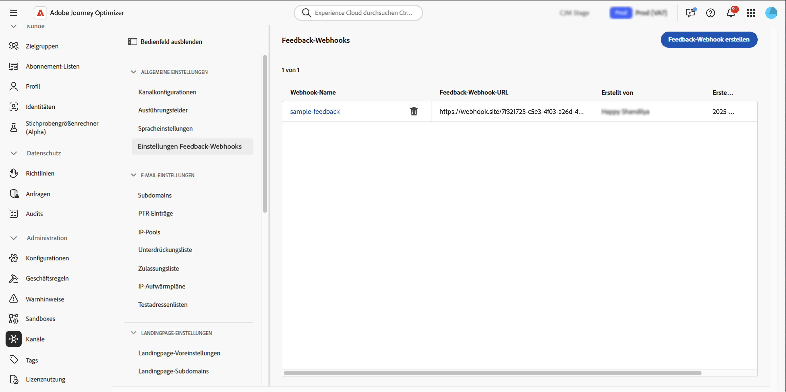

# Erstellen von Feedback-Webhooks für API-ausgelöste Kampagnen {#webhooks}

Feedback-Webhooks ermöglichen es Ihnen, Statusaktualisierungen in Echtzeit für Nachrichten zu erhalten, die über API-ausgelöste Transaktions-Kampagnen gesendet werden. Durch die Konfiguration eines Webhooks können Sie automatisch Versandergebnisse direkt an Ihre Systeme empfangen, was die Überwachung, Protokollierung und automatisierte Verarbeitung ermöglicht.

Sie können Webhook-Konfigurationen über das Menü **[!UICONTROL Administration]** / **[!UICONTROL Kanäle]** / **[!UICONTROL Feedback-Webhook-Einstellungen]** verwalten.



>[!NOTE]
>Pro Kombination **Organisation + Sandbox** ist nur eine Webhook-Konfiguration zulässig.

## Feedback-Webhook erstellen

Gehen Sie wie folgt vor, um einen Webhook zu erstellen:

1. Navigieren Sie zu **[!UICONTROL Administration]** / **[!UICONTROL Kanäle]** / **[!UICONTROL Feedback Webhook-Einstellungen]**.

1. Klicken Sie **Feedback-Webhook erstellen**.

1. Geben Sie **[!UICONTROL Abschnitt]** Standardkonfiguration“ die folgenden Details an:

   

   * **Webhook-Name**: Geben Sie einen beschreibenden Namen ein, um den Webhook zu identifizieren.
   * **Kanäle** - Wählen Sie die Kanäle aus, für die dieser Webhook Feedback erhalten soll (E-Mail und/oder SMS).
   * **Webhook-URL** - Stellen Sie den HTTPS-Endpunkt bereit, an den Feedback-Ereignisse gesendet werden müssen.

1. Wählen **[!UICONTROL im Abschnitt]** die Authentifizierungsmethode aus:

   

   * **Keine Authentifizierung** - Es werden keine Authentifizierungskopfzeilen hinzugefügt.
   * **JWT-**: Geben Sie die erforderlichen Details an, wenn Ihr Endpunkt eine JWT-Authentifizierung erfordert.

1. Konfigurieren Sie **[!UICONTROL Abschnitt]** Kopfzeilenparameter“ zusätzliche benutzerdefinierte Kopfzeilen, die mit jeder Webhook-Anfrage gesendet werden sollen.

   

1. Klicken Sie **[!UICONTROL Senden]**, um die Konfiguration zu speichern.

>[!NOTE]
>
>Sie können einen Webhook jederzeit bearbeiten. Öffnen Sie dazu das Inventar und klicken Sie auf die Schaltfläche **[!UICONTROL Bearbeiten]**.

## Webhook-Payload-Struktur

Nach der Ausführung einer Nachricht sendet **[!DNL Journey Optimizer]** die folgende Payload an den konfigurierten Endpunkt.

```
{
  "requestId": "8NoByJneShCdCGRnrGS1t1m3CdA73dhR",
  "imsOrg": "myImsOrg",
  "sandbox": {
    "id": "068abf40-575e-11ea-8512-9b1bfdb82603",
    "name": "prod"
  },
  "channel": "email",
  "eventType": "message.feedback",
  "messageExecution": {
    "messageExecutionID": "HUMA-26362805",
    "messageType": "transactional",
    "campaignID": "16f24a15-7e21-477c-848a-d5695ca7f137",
    "campaignVersionID": "2ca10c10-56dd-4505-87cd-fa5da84e7a5d"
  },
  "messageDeliveryFeedback": {
    "feedbackStatus": {
      "value": "bounce"
    },
    "offers": null,
    "messageExclusion": null,
    "messageFailure": {
      "category": "sync",
      "type": "Ignored",
      "code": "25",
      "reason": "Admin Failure"
    },
    "retryCount": 0
  },
  "identityMap": {
    "email": [
      {
        "id": "john.doe@luma.com",
        "primary": true
      }
    ]
  }
}
```

Der Webhook kann die folgenden Ereignisse erfassen:

* Gesendet
* Zugestellt
* Bounce (siehe obiges Beispiel)
* Fehler

Jede eingehende Anfrage enthält auch eine eindeutige requestId, die an den Webhook zurückgesendet wird.

## Nächste Schritte {#next}

Nachdem ein Feedback-Webhook erstellt wurde, können Sie ihn bei der Konfiguration einer Zielgruppe **Transaktionsnachricht-API-ausgelöste Kampagne** aktivieren. Weitere Informationen finden Sie in diesem Abschnitt: [Webhooks aktivieren](../campaigns/api-triggered-campaign-audience.md#webhook)
