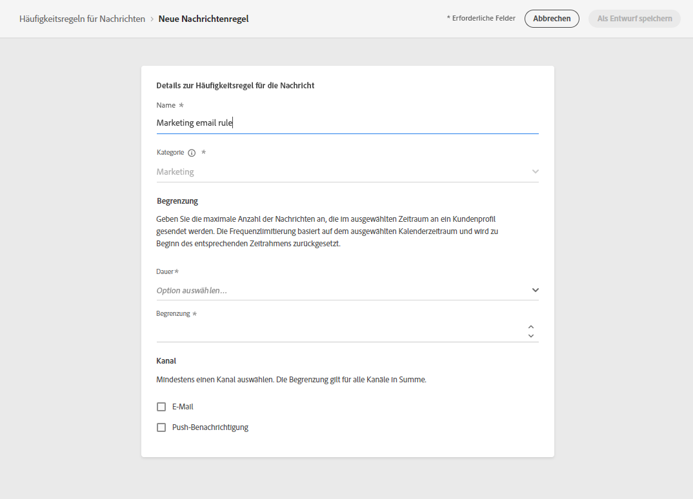

# Häufigkeitsregeln für Nachrichten {#frequency-rules}

Mit [!DNL Journey Optimizer] können Sie steuern, wie oft Benutzer eine Nachricht erhalten oder in eine Journey eintreten, indem Sie kanalübergreifende Regeln festlegen, mit denen zu oft angesprochene Profile automatisch von Nachrichten und Aktionen ausgeschlossen werden.

Nehmen wir an, Sie möchten verhindern, dass Ihre Marke monatlich mehr als drei Marketing-Nachrichten an Ihre Kunden sendet.

Hierfür können Sie eine Häufigkeitsregel verwenden, die die Anzahl der gesendeten Nachrichten über einen oder mehrere Kanäle während eines monatlichen Kalenderzeitraums begrenzt.

>[!NOTE]
>
>Die Regeln zur Nachrichtenhäufigkeit unterscheiden sich von der Opt-out-Verwaltung, die es Benutzern ermöglicht, sich vom Erhalt von Nachrichten einer Marke abzumelden. [Weitere Informationen](../privacy/opt-out.md#opt-out-management)

➡️ [Entdecken Sie diese Funktion im Video](#video).

## Zugriff auf Regeln {#access-rules}

Sie können auf Regeln über das Menü **[!UICONTROL Administration]** > **[!UICONTROL Regeln]** zugreifen. Alle Regeln werden sortiert nach Änderungsdatum aufgelistet.

Verwenden Sie das Filtersymbol, um die Regeln nach Kategorie, Status und/oder Kanal zu filtern. Sie können auch nach dem Nachrichtentitel suchen.

### Berechtigungen{#permissions-frequency-rules}

Zum Zugreifen auf, Erstellen, Bearbeiten oder Löschen von Häufigkeitsregeln für Nachrichten benötigen Sie die Berechtigung **[!UICONTROL Häufigkeitsregeln verwalten]**.

Benutzer*innen mit der Berechtigung **[!UICONTROL Anzeigen von Häufigkeitsregeln]** können Regeln anzeigen, sie jedoch nicht ändern oder löschen.

Weiterführende Informationen zu Berechtigungen finden Sie in [diesem Abschnitt](../administration/high-low-permissions.md).

## Erstellen einer Regel {#create-new-rule}

Gehen Sie wie folgt vor, um eine neue Regel zu erstellen.

1. Öffnen Sie die Liste **[!UICONTROL Häufigkeitsregeln für Nachrichten]** und klicken Sie auf **[!UICONTROL Regel erstellen]**.

   

1. Definieren Sie den Namen der Regel.

   

1. Wählen Sie die Kategorie der Nachrichtenregel aus.

   >[!NOTE]
   >
   >Derzeit ist nur die Kategorie **[!UICONTROL Marketing]** verfügbar.

1. Legen Sie die Begrenzung für Ihre Regel fest, d. h. die maximale Anzahl von Nachrichten, die monatlich an ein einzelnes Benutzerprofil gesendet werden kann.

   

   >[!NOTE]
   >
   >Die Häufigkeitsbegrenzung basiert auf einem monatlichen Kalenderzeitraum. Sie wird zu Beginn jedes Monats zurückgesetzt.

1. Wählen Sie den Kanal aus, den Sie für diese Regel verwenden möchten: **[!UICONTROL E-Mail]** oder **[!UICONTROL Push-Benachrichtigung]**.

   

   >[!NOTE]
   >
   >Sie müssen mindestens einen Kanal auswählen, um die Regel erstellen zu können.

1. Wählen Sie mehrere Kanäle aus, wenn Sie für alle ausgewählten Kanäle gemeinsam eine Begrenzung festlegen möchten.

   Legen Sie beispielsweise die Begrenzung auf 15 fest und wählen Sie dann den E-Mail- und Push-Kanal aus. Wenn ein Profil bereits 10 Marketing-E-Mails und 5 Marketing-Push-Benachrichtigungen erhalten hat, wird dieses Profil vom nächsten Versand einer Marketing-E-Mail oder Push-Benachrichtigung ausgeschlossen.

1. Klicken Sie auf **[!UICONTROL Als Entwurf speichern]**, um die Regelerstellung zu bestätigen. Ihre Nachricht wird der Regelliste mit dem Status **[!UICONTROL Entwurf]** hinzugefügt.

   

## Aktivieren einer Regel {#activate-rule}

Bei der Erstellung einer Häufigkeitsregel für Nachrichten hat die Regel den Status **[!UICONTROL Entwurf]** und wirkt sich noch auf keine Nachricht aus. Um die Regel zu aktivieren, klicken Sie auf die Auslassungszeichen neben der Regel und wählen Sie **[!UICONTROL Aktivieren]** aus.

Das Aktivieren einer Regel wirkt sich auf alle Nachrichten, für die sie gilt, bei ihrer nächsten Ausführung aus. Erfahren Sie, wie Sie [eine Häufigkeitsregel auf eine Nachricht anwenden](#apply-frequency-rule).

>[!NOTE]
>
>Es kann bis zu 10 Minuten dauern, bis eine Regel vollständig aktiviert ist. Sie müssen keine Nachrichten ändern oder Journeys erneut veröffentlichen, damit eine Regel wirksam wird.

Um eine Häufigkeitsregel für Nachrichten zu deaktivieren, klicken Sie auf das Auslassungszeichen neben der Regel und wählen Sie **[!UICONTROL Deaktivieren]**.

Der Status der Regel ändert sich in **[!UICONTROL Inaktiv]** und die Regel wird nicht mehr auf zukünftige Nachrichtenausführungen angewendet. Alle aktuell ausgeführten Nachrichten sind davon nicht betroffen.

>[!NOTE]
>
>Das Deaktivieren einer Regel wirkt sich weder auf die Zählung für einzelne Profile aus, noch wird die Zählung zurückgesetzt.

## Anwenden einer Häufigkeitsregel auf eine Nachricht {#apply-frequency-rule}

Gehen Sie wie folgt vor, um eine Häufigkeitsregel auf eine Nachricht anzuwenden.

1. Erstellen Sie eine Nachricht, indem Sie einen der Kanäle auswählen, den Sie für Ihre Regel definiert haben.

1. Wählen Sie die Kategorie aus, die Sie für die [von Ihnen erstellte Regel](#create-new-rule) definiert haben.

   

   >[!NOTE]
   >
   >Derzeit ist nur die Kategorie **[!UICONTROL Marketing]** für Häufigkeitsregeln für Nachrichten verfügbar.

   <!--
   1. You can click the **[!UICONTROL Frequency rule]** link to view the frequency rules that will apply for the selected category and channel(s). A new tab will open to display the matching message frequency rules.-->

1. Alle Häufigkeitsregeln, die mit der ausgewählten Kategorie und den ausgewählten Kanälen übereinstimmen, werden automatisch auf diese Nachricht angewendet.

   >[!NOTE]
   >
   >Nachrichten <!--that do not have any selected category or messages -->, bei denen die ausgewählte Kategorie **[!UICONTROL Transaktion]** ist, werden nicht mit den Häufigkeitsregeln bewertet.

   <!--Clicking the link out button next to the category selector will jump you over to the rules inventory screen to see which rules will be applied to the message.-->

1. Die Anzahl der vom Versand ausgeschlossenen Profile können Sie im [globalen Bericht](../reports/global-report.md) und im [Live-Bericht](../reports/live-report.md) ansehen, wo die Häufigkeitsregeln als möglicher Grund für den Ausschluss von Benutzenden vom Versand angegeben sind.

>[!NOTE]
>
>Für denselben Kanal können mehrere Regeln angewendet werden, aber sobald die untere Begrenzung erreicht ist, wird das Profil von den nächsten Sendungen ausgeschlossen.

## Beispiel: Kombinieren mehrerer Regeln {#frequency-rule-example}

Sie können mehrere Häufigkeitsregeln für Nachrichten kombinieren, wie im folgenden Beispiel beschrieben.

1. Erstellen Sie eine Regel mit der Bezeichnung *Marketing-Gesamtbegrenzung*:

   * Wählen Sie die Kanäle „E-Mail“ und „Push“ aus.
   * Legen Sie die Begrenzung auf 12 fest.

   

1. Erstellen Sie eine zweite Regel namens *Begrenzung von Push-Marketing*, um die Anzahl der an einen Benutzer gesendeten Marketing-Push-Benachrichtigungen weiter einzuschränken:

   * Wählen Sie den Push-Kanal aus.
   * Legen Sie die Begrenzung auf 4 fest.

   

1. Speichern und [aktivieren](#activate-rule) Sie die Regel.

1. Erstellen Sie eine E-Mail und wählen Sie die Kategorie **[!UICONTROL Marketing]** für diese Nachricht aus. [Weitere Informationen](../email/create-email.md)

1. Erstellen Sie eine Push-Benachrichtigung und wählen Sie die Kategorie **[!UICONTROL Marketing]** für diese Nachricht aus. [Weitere Informationen](../push/create-push.md)

In diesem Szenario kann ein einzelnes Profil:
* monatlich bis zu 12 Marketing-Nachrichten erhalten;
* es wird jedoch von Marketing-Push-Benachrichtigungen ausgeschlossen, nachdem es 4 Push-Benachrichtigungen erhalten hat.

>[!NOTE]
>
>Beim Testen von Häufigkeitsregeln kann es hilfreich sein, mit einem neu erstellten [Testprofil](../segment/creating-test-profiles.md) zu beginnen, da es nach Erreichen des Häufigkeitslimits eines Profils bis zum nächsten Monat nicht mehr möglich ist, den Zähler zurückzusetzen. Wenn Sie eine Regel deaktivieren, können Profile, für die die Begrenzung gilt, zwar Nachrichten empfangen, es werden aber keine Zählerschritte entfernt oder gelöscht.

## Anleitungsvideo {#video}

Erfahren Sie, wie Sie Häufigkeitsregeln erstellen, aktivieren, testen und Berichte dazu erstellen.

>[!VIDEO](https://video.tv.adobe.com/v/344451?quality=12)
