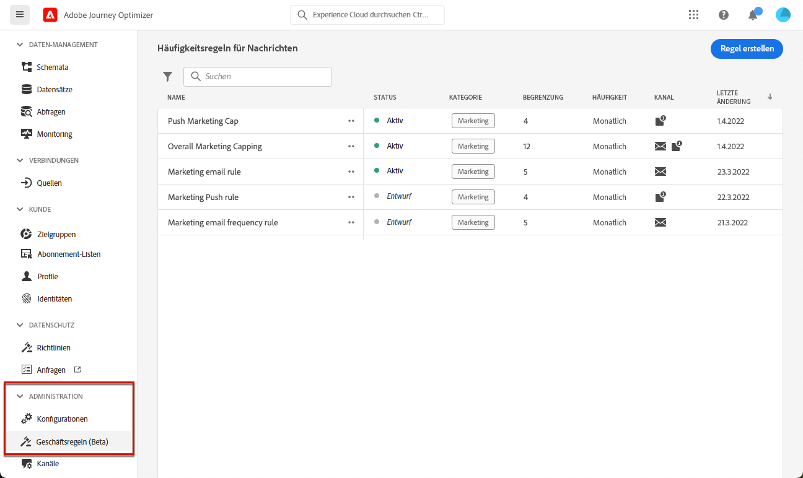
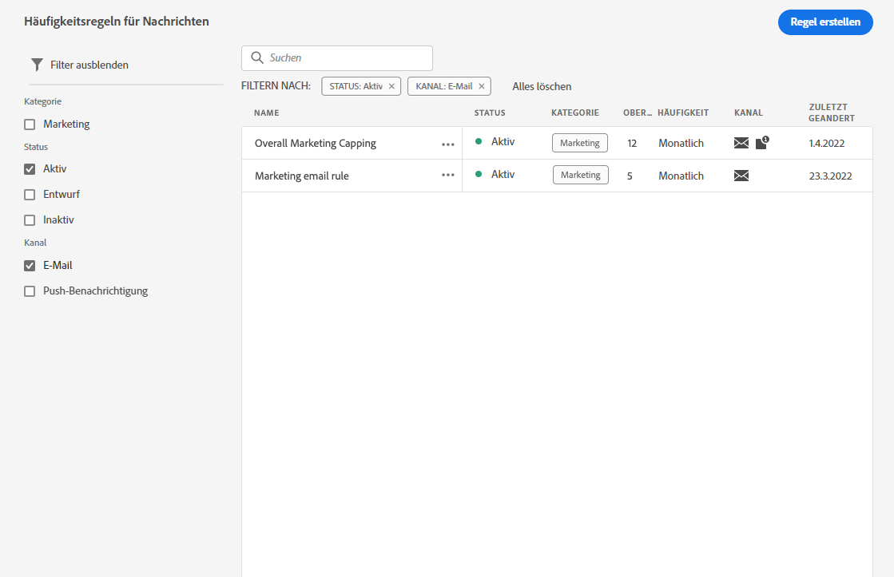
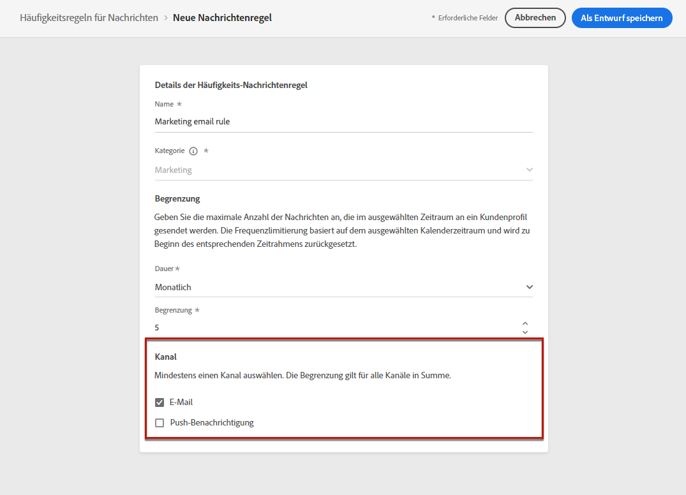

# Häufigkeitsregeln {#frequency-rules}

[!DNL Journey Optimizer] Sie können steuern, wie oft Benutzer eine Nachricht erhalten oder eine Journey eingeben, indem Sie kanalübergreifende Regeln festlegen, mit denen Profile, die zu oft angesprochen wurden, automatisch von Nachrichten und Aktionen ausgeschlossen werden.

Sie möchten beispielsweise nicht, dass Ihre Marke monatlich mehr als drei Marketing-Nachrichten an ihre Kunden sendet.

Hierfür können Sie eine Häufigkeitsregel verwenden, die die Anzahl der gesendeten Nachrichten auf der Basis eines oder mehrerer Kanäle während eines monatlichen Kalenderzeitraums begrenzt.

>[!NOTE]
>
>Die Regeln zur Nachrichtenhäufigkeit unterscheiden sich von der Opt-out-Verwaltung, die es Benutzern ermöglicht, sich vom Erhalt von Nachrichten einer Marke abzumelden. [Weitere Informationen](../messages/consent.md#opt-out-management)

## Zugriffsregeln {#access-rules}

Regeln sind im Abschnitt **[!UICONTROL Administration]** > **[!UICONTROL Regeln]** Menü. Alle Regeln werden aufgelistet, sortiert nach Änderungsdatum.

<!--To access, create, edit or delete message frequency rules, you must have the message configuration permission. [Learn more](../administration/high-low-permissions.md#administration-permissions)-->

Verwenden Sie das Filtersymbol, um nach Kategorie, Status und/oder Kanal zu filtern. Sie können auch nach dem Titel der Nachricht suchen.

## Erstellen einer Regel {#create-new-rule}

Gehen Sie wie folgt vor, um eine neue Regel zu erstellen.

1. Zugriff auf **[!UICONTROL Häufigkeitsregeln]** Liste und klicken Sie auf **[!UICONTROL Regel erstellen]**.

   

1. Definieren Sie den Regelnamen.

   

1. Wählen Sie die Kategorie der Nachrichtenregel aus.

   >[!NOTE]
   >
   >Derzeit ist nur der **[!UICONTROL Marketing]** -Kategorie verfügbar ist.

1. Legen Sie die Begrenzung für Ihre Regel fest, d. h. die maximale Anzahl von Nachrichten, die monatlich an ein einzelnes Benutzerprofil gesendet werden können.

   

   >[!NOTE]
   >
   >Die Begrenzung der Häufigkeit basiert auf einem monatlichen Kalenderzeitraum. Er wird zu Beginn jedes Monats zurückgesetzt.

1. Wählen Sie den Kanal aus, den Sie für diese Regel verwenden möchten: **[!UICONTROL Email]** oder **[!UICONTROL Push-Benachrichtigung]**.

   

   >[!NOTE]
   >
   >Sie müssen mindestens einen Kanal auswählen, um die Regel erstellen zu können.

1. Wählen Sie mehrere Kanäle aus, wenn Sie eine Begrenzung für alle ausgewählten Kanäle als Gesamtanzahl anwenden möchten.

   Legen Sie beispielsweise die Begrenzung auf 15 fest und wählen Sie sowohl den E-Mail- als auch den Push-Kanal aus. Wenn ein Profil bereits 10 Marketing-E-Mails und 5 Marketing-Push-Benachrichtigungen erhalten hat, wird dieses Profil vom nächsten Versand einer Marketing-E-Mail oder Push-Benachrichtigung ausgeschlossen.

1. Klicken **[!UICONTROL Als Entwurf speichern]** , um die Regelerstellung zu bestätigen. Ihre Nachricht wird in der Regelliste mit dem **[!UICONTROL Entwurf]** Status.

   

## Aktivieren einer Regel {#activate-rule}

Um eine Meldungsregel zu aktivieren, klicken Sie auf das Auslassungszeichen neben der Regel und wählen Sie **[!UICONTROL Aktivieren]**.

Das Aktivieren einer Regel wirkt sich auf alle Nachrichten aus, für die sie gilt, auf die nächste Ausführung aus. Erfahren Sie, wie Sie [Frequenzregel auf eine Nachricht anwenden](#apply-frequency-rule).

>[!NOTE]
>
>Sie müssen keine Nachrichten oder Journey ändern oder erneut veröffentlichen, damit eine Regel wirksam wird.

Um eine Meldungsregel zu deaktivieren, klicken Sie auf das Auslassungszeichen neben der Regel und wählen Sie **[!UICONTROL Deaktivieren]**.

Der Status der Regel ändert sich in **[!UICONTROL Inaktiv]** und die Regel gilt nicht für zukünftige Nachrichtenausführungen. Die aktuell ausgeführten Nachrichten sind nicht betroffen.

>[!NOTE]
>
>Das Deaktivieren einer Regel wirkt sich nicht auf die Zählung einzelner Profile aus oder setzt sie zurück.

## Häufigkeitsregel auf eine Nachricht anwenden {#apply-frequency-rule}

Um eine Häufigkeitsregel auf eine Nachricht anzuwenden, müssen Sie einfach die Kategorie auswählen, die Sie für diese Regel beim [Nachricht erstellen](../messages/get-started-content.md#create-new-message).

Durch Auswahl der **[!UICONTROL Marketing]** -Kategorie, werden alle passenden Regeln zur Nachrichtenhäufigkeit automatisch auf diese Nachricht angewendet.

<!--Clicking the link out button next to the category selector will jump you over to the rules inventory screen to see which rules will be applied to the message.-->

Die Anzahl der vom Versand ausgeschlossenen Profile können Sie im Abschnitt [Live- und globale Ansichten](../reports/message-monitoring.md)und im [E-Mail-Live-Bericht](../reports/email-live-report.md), wobei Häufigkeitsregeln als möglicher Grund für Benutzer aufgeführt werden, die vom Versand ausgeschlossen sind.

## Beispiel

Sie können mehrere Regeln zur Nachrichtenhäufigkeit kombinieren, wie im folgenden Beispiel beschrieben.

1. Erstellen Sie eine Regel mit dem Namen *Marketing-Gesamtbegrenzung*:

   * Wählen Sie alle Kanäle aus (E-Mail, Push).
   * Legen Sie die Begrenzung auf 12 fest.

1. Erstellen Sie eine zweite Regel namens *Marketing-Push begrenzen*:

   * Wählen Sie Push-Kanal aus.
   * Legen Sie die Begrenzung auf 4 fest.

In diesem Szenario kann ein einzelnes Profil bis zu 12 Marketingnachrichten pro Monat erhalten, wird jedoch von Marketing-Push-Benachrichtigungen ausgeschlossen, nachdem es 4 Push-Benachrichtigungen erhalten hat.
