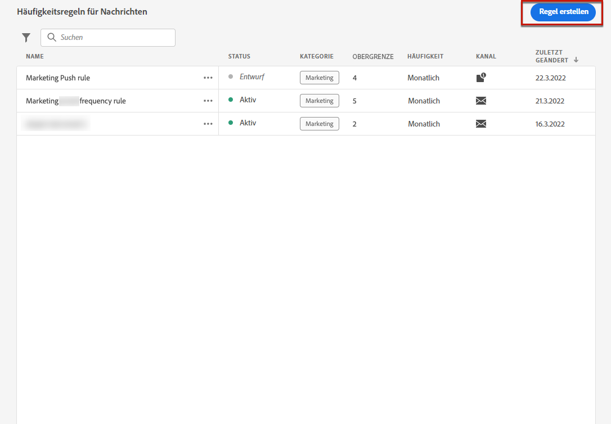

# Häufigkeitsregeln für Nachrichten {#frequency-rules}

Mit [!DNL Journey Optimizer] können Sie steuern, wie oft Benutzer eine Nachricht erhalten oder in eine Journey eintreten, indem Sie kanalübergreifende Regeln festlegen, mit denen zu oft angesprochene Profile automatisch von Nachrichten und Aktionen ausgeschlossen werden.

Für eine Marke könnte eine Regel beispielsweise lauten, ihren Kundinnen und Kunden pro Monat maximal vier Marketing-Nachrichten zu senden. Hierfür können Sie eine Häufigkeitsregel verwenden, die die Anzahl der gesendeten Nachrichten über einen oder mehrere Kanäle während eines monatlichen Kalenderzeitraums begrenzt.

>[!NOTE]
>
>Die Regeln zur Nachrichtenhäufigkeit unterscheiden sich von der Opt-out-Verwaltung, die es Benutzern ermöglicht, sich vom Erhalt von Nachrichten einer Marke abzumelden. [Weitere Informationen](../privacy/opt-out.md#opt-out-management)

➡️ [Entdecken Sie diese Funktion im Video](#video).

## Zugriff auf Regeln {#access-rules}

Sie können auf Regeln über das Menü **[!UICONTROL Administration]** > **[!UICONTROL Regeln]** zugreifen. Alle Regeln werden sortiert nach Änderungsdatum aufgelistet.

Verwenden Sie das Filtersymbol, um die Regeln nach Kategorie, Status und/oder Kanal zu filtern. Sie können auch nach dem Nachrichtentitel suchen.

### Berechtigungen{#permissions-frequency-rules}

Zum Zugreifen auf, Erstellen, Bearbeiten oder Löschen von Häufigkeitsregeln für Nachrichten benötigen Sie die Berechtigung **[!UICONTROL Häufigkeitsregeln verwalten]**.

Benutzer*innen mit der Berechtigung **[!UICONTROL Anzeigen von Häufigkeitsregeln]** können Regeln anzeigen, sie jedoch nicht ändern oder löschen.

Weiterführende Informationen zu Berechtigungen finden Sie in [diesem Abschnitt](../administration/high-low-permissions.md).

## Erstellen einer Regel {#create-new-rule}

>[!CONTEXTUALHELP]
>id="ajo_rules_category"
>title="Wählen Sie die Kategorie der Nachrichtenregel aus"
>abstract="Bei Aktivierung und Anwendung auf eine Nachricht werden alle Häufigkeitsregeln, die der ausgewählten Kategorie entsprechen, automatisch auf diese Nachricht angewendet. Derzeit ist nur die Kategorie Marketing verfügbar."

>[!CONTEXTUALHELP]
>id="ajo_rules_capping"
>title="Festlegen der Begrenzung für Ihre Regel"
>abstract="Geben Sie an, wie viele Nachrichten innerhalb des ausgewählten Zeitrahmens maximal an ein Kundenprofil gesendet werden sollen. Die Frequenzbegrenzung basiert auf dem ausgewählten Kalenderzeitraum und wird am Anfang des entsprechenden Zeitrahmens zurückgesetzt. "

>[!CONTEXTUALHELP]
>id="ajo_rules_channel"
>title="Definieren der Kanäle, für die die Regel gilt"
>abstract="Wählen Sie mindestens einen Kanal aus. Die Begrenzung gilt als Gesamtanzahl für alle Kanäle."

Gehen Sie wie folgt vor, um eine neue Regel zu erstellen.

1. Öffnen Sie die Liste **[!UICONTROL Häufigkeitsregeln für Nachrichten]** und klicken Sie auf **[!UICONTROL Regel erstellen]**.

   

1. Definieren Sie den Regelnamen und wählen Sie die Kategorie der Nachrichtenregel aus.

   >[!NOTE]
   >
   >Es ist nur die Kategorie **[!UICONTROL Marketing]** verfügbar.

   

1. Wählen Sie aus der Dropdown-Liste **[!UICONTROL Dauer]** einen Zeitrahmen aus, auf den die Begrenzung angewendet werden soll. [Weitere Informationen](#frequency-cap)

1. Legen Sie die Begrenzung für Ihre Regel fest, d. h. die maximale Anzahl der Nachrichten, die pro Monat oder Woche <!--or day--> an ein einzelnes Benutzerprofil gesendet werden können – je nach Ihrer Auswahl oben.

   <!---->

1. Wählen Sie den Kanal aus, den Sie für diese Regel verwenden möchten: **[!UICONTROL E-Mail]**, **[!UICONTROL Push-Benachrichtigung]**, **[!UICONTROL SMS]** oder **[!UICONTROL Briefpost]**.

   

   >[!NOTE]
   >
   >Sie müssen mindestens einen Kanal auswählen, um die Regel erstellen zu können.

1. Wählen Sie mehrere Kanäle aus, wenn Sie für alle ausgewählten Kanäle gemeinsam eine Begrenzung festlegen möchten.

   Legen Sie beispielsweise die Begrenzung auf 15 fest und wählen Sie dann den E-Mail- und Push-Kanal aus. Wenn ein Profil im ausgewählten Zeitraum bereits 10 Marketing-E-Mails und 5 Marketing-Push-Benachrichtigungen erhalten hat, wird dieses Profil vom nächsten Versand einer Marketing-E-Mail oder Push-Benachrichtigung ausgeschlossen.

1. Klicken Sie auf **[!UICONTROL Als Entwurf speichern]**, um die Regelerstellung zu bestätigen. Ihre Nachricht wird der Regelliste mit dem Status **[!UICONTROL Entwurf]** hinzugefügt.

   

### Frequenzbegrenzung {#frequency-cap}

Legen Sie über die Dropdown-Liste **[!UICONTROL Dauer]** fest, ob die Begrenzung monatlich oder wöchentlich angewendet werden soll.

>[!NOTE]
>
>Auf Anfrage ist auch eine tägliche Frequenzbegrenzung möglich. [Weitere Informationen](#daily-frequency-cap)

Die Häufigkeitsbegrenzung basiert auf dem ausgewählten Kalenderzeitraum. Sie wird am Anfang des entsprechenden Zeitrahmens zurückgesetzt.

Der Zähler läuft für jeden Zeitraum wie folgt ab:

* **[!UICONTROL Monatlich]**: Die Häufigkeitsbegrenzung ist bis zum letzten Tag des Monats um 23:59:59 UTC gültig. Beispielsweise beträgt die monatliche Gültigkeit für den 31.01. 23:59:59 UTC.

* **[!UICONTROL Wöchentlich]**: Die Häufigkeitsbegrenzung gilt bis Samstag 23:59:59 UTC der betreffenden Woche, da die Kalenderwoche am Sonntag beginnt. Das Ablaufdatum ist unabhängig von der Regelerstellung. Wenn die Regel beispielsweise am Donnerstag erstellt wird, gilt diese Regel bis Samstag um 23 Uhr:59:59.

### Tägliche Frequenzbegrenzung {#daily-frequency-cap}

Neben der monatlichen und wöchentlichen Frequenzbegrenzung ist auf Anfrage auch eine tägliche Frequenzbegrenzung verfügbar. Weiterführende Informationen dazu erhalten Sie beim Adobe-Support.

Die tägliche Frequenzbegrenzung ist für den Tag bis 23:59:59 Uhr (UTC) gültig und wird zu Beginn des nächsten Tages auf 0 zurückgesetzt.

>[!NOTE]
>
>Beim Umgang mit der [Batch-Segmentierung](https://experienceleague.adobe.com/docs/experience-platform/segmentation/home.html?lang=de#batch){target="_blank"}, the daily counters may not accurately reflect the current values as the daily counter snapshot is taken at midnight UTC the night before. Consequently, relying on daily counters in this scenario becomes impractical, as the snapshot does not reflect the most up-to-date counter values on the profile. To ensure accuracy for daily frequency capping rules, the use of [streaming segmentation](https://experienceleague.adobe.com/docs/experience-platform/segmentation/ui/streaming-segmentation.html?lang=de){target="_blank"} wird empfohlen. Weitere Informationen über Methoden zur Zielgruppenauswertung finden Sie in [diesem Abschnitt](../audience/about-audiences.md#evaluation-method-in-journey-optimizer).

## Aktivieren einer Regel {#activate-rule}

Bei der Erstellung einer Häufigkeitsregel für Nachrichten hat die Regel den Status **[!UICONTROL Entwurf]** und wirkt sich noch auf keine Nachricht aus. Um die Regel zu aktivieren, klicken Sie auf die Auslassungszeichen neben der Regel und wählen Sie **[!UICONTROL Aktivieren]** aus.

Das Aktivieren einer Regel wirkt sich auf alle Nachrichten, für die sie gilt, bei ihrer nächsten Ausführung aus. Erfahren Sie, wie Sie [eine Häufigkeitsregel auf eine Nachricht anwenden](#apply-frequency-rule).

>[!NOTE]
>
>Es kann bis zu 10 Minuten dauern, bis eine Regel vollständig aktiviert ist. Sie müssen keine Nachrichten ändern oder Journeys erneut veröffentlichen, damit eine Regel wirksam wird.

Um eine Häufigkeitsregel für Nachrichten zu deaktivieren, klicken Sie auf das Auslassungszeichen neben der Regel und wählen Sie **[!UICONTROL Deaktivieren]**.

Der Status der Regel ändert sich in **[!UICONTROL Inaktiv]** und die Regel wird nicht mehr auf zukünftige Nachrichtenausführungen angewendet. Alle aktuell ausgeführten Nachrichten sind davon nicht betroffen.

>[!NOTE]
>
>Das Deaktivieren einer Regel wirkt sich weder auf die Zählung für einzelne Profile aus, noch wird die Zählung zurückgesetzt.

## Anwenden einer Häufigkeitsregel auf eine Nachricht {#apply-frequency-rule}

Gehen Sie wie folgt vor, um eine Häufigkeitsregel auf eine Nachricht anzuwenden.

1. Fügen Sie beim Erstellen einer [Journey](../building-journeys/journey-gs.md) eine Nachricht hinzu, indem Sie einen der Kanäle auswählen, die Sie für Ihre Regel definiert haben.

1. Wählen Sie die Kategorie aus, die Sie für die [von Ihnen erstellte Regel](#create-new-rule) definiert haben.

   

   >[!NOTE]
   >
   >Derzeit ist nur die Kategorie **[!UICONTROL Marketing]** für Häufigkeitsregeln für Nachrichten verfügbar.

1. Sie können auf den Link für die **[!UICONTROL Frequenzregel]** klicken, um den Bildschirm mit den Häufigkeitsregeln in einer neuen Registerkarte anzuzeigen. [Weitere Informationen](#access-rules)

   Alle Häufigkeitsregeln, die mit der ausgewählten Kategorie und den ausgewählten Kanälen übereinstimmen, werden automatisch auf diese Nachricht angewendet.

   >[!NOTE]
   >
   >Nachrichten, bei denen die ausgewählte Kategorie **[!UICONTROL Transaktion]** ist, werden nicht mit den Häufigkeitsregeln ausgewertet.

1. Die Anzahl der vom Versand ausgeschlossenen Profile können Sie im [globalen Bericht](../reports/global-report.md) und im [Live-Bericht](../reports/live-report.md) ansehen, wo die Häufigkeitsregeln als möglicher Grund für den Ausschluss von Benutzenden vom Versand angegeben sind.

>[!NOTE]
>
>Für denselben Kanal können mehrere Regeln angewendet werden, aber sobald die untere Begrenzung erreicht ist, wird das Profil von den nächsten Sendungen ausgeschlossen.

## Beispiel: Kombinieren mehrerer Regeln {#frequency-rule-example}

Sie können mehrere Häufigkeitsregeln für Nachrichten kombinieren, wie im folgenden Beispiel beschrieben.

1. Erstellen Sie eine Regel mit der Bezeichnung *Marketing-Gesamtbegrenzung*:

   * Wählen Sie alle Kanäle aus.
   * Legen Sie die Begrenzung auf 12 x monatlich fest.

   

1. Erstellen Sie eine zweite Regel namens *Begrenzung von Push-Marketing*, um die Anzahl der an einen Benutzer gesendeten Marketing-Push-Benachrichtigungen weiter einzuschränken:

   * Wählen Sie den Push-Kanal aus.
   * Legen Sie die Begrenzung auf 4 x monatlich fest.

   

1. Speichern und [aktivieren](#activate-rule) Sie die Regel.

1. [Erstellen Sie eine Nachricht](../building-journeys/journeys-message.md) für jeden Kanal, über den Sie kommunizieren möchten, und wählen Sie für jede Nachricht die Kategorie **[!UICONTROL Marketing]** aus. [Erfahren Sie, wie Sie eine Häufigkeitsregel anwenden.](#apply-frequency-rule)

   

<!--
Learn how to create a message for the different channels in the following sections:
* [Create an email](../email/create-email.md)
* [Create a push notification](../push/create-push.md)
* [Create an SMS](../sms/create-sms.md)
* [Create a direct mail](../direct-mail/create-direct-mail.md)

Create an email and select the **[!UICONTROL Marketing]** category for that message. [Learn more](../email/create-email.md)

Create a push notification and select the **[!UICONTROL Marketing]** category for that message. [Learn more](../push/create-push.md)

Create an SMS and select the **[!UICONTROL Marketing]** category for that message. [Learn more](../sms/create-sms.md)

Create a direct mail and select the **[!UICONTROL Marketing]** category for that message. [Learn more](../direct-mail/create-direct-mail.md)
-->

In diesem Szenario kann ein einzelnes Profil:
* monatlich bis zu 12 Marketing-Nachrichten erhalten;
* es wird jedoch von Marketing-Push-Benachrichtigungen ausgeschlossen, nachdem es 4 Push-Benachrichtigungen erhalten hat.

>[!NOTE]
>
>Beim Testen von Häufigkeitsregeln kann es hilfreich sein, mit einem neu erstellten [Testprofil](../audience/creating-test-profiles.md) zu beginnen, da es nach Erreichen des Häufigkeitslimits eines Profils bis zum nächsten Monat nicht mehr möglich ist, den Zähler zurückzusetzen. Wenn Sie eine Regel deaktivieren, können Profile, für die die Begrenzung gilt, zwar Nachrichten empfangen, es werden aber keine Zählerschritte entfernt oder gelöscht.

## Anleitungsvideo {#video}

Erfahren Sie, wie Sie Häufigkeitsregeln erstellen, aktivieren, testen und Berichte dazu erstellen.

>[!VIDEO](https://video.tv.adobe.com/v/344451?quality=12)
