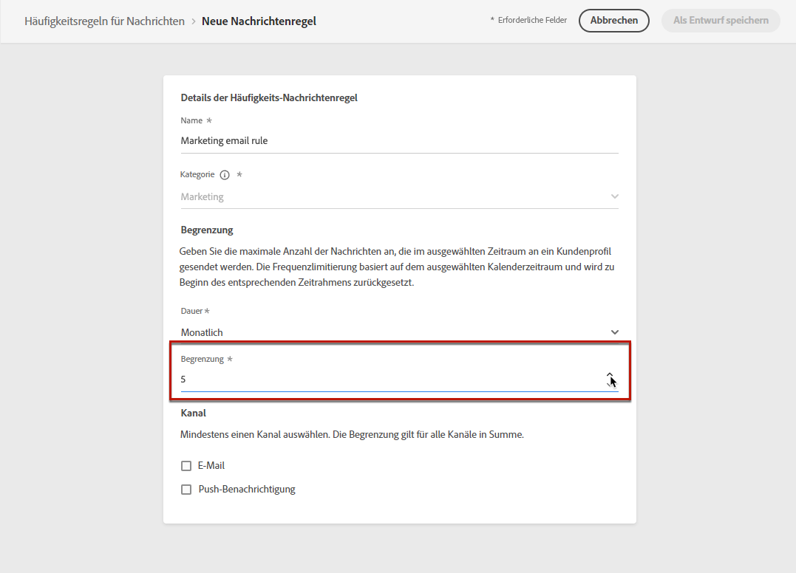

# Häufigkeitsregeln {#frequency-rules}

[!DNL Journey Optimizer] Sie können steuern, wie oft Benutzer eine Nachricht erhalten oder in eine Journey eintreten, indem Sie kanalübergreifende Regeln festlegen, mit denen Profile, die zu oft angesprochen wurden, automatisch aus Nachrichten und Aktionen ausgeschlossen werden.

Sie möchten beispielsweise nicht, dass Ihre Marke monatlich mehr als drei Marketing-Nachrichten an ihre Kunden sendet.

Hierfür können Sie eine Häufigkeitsregel verwenden, die die Anzahl der gesendeten Nachrichten auf der Basis eines oder mehrerer Kanäle während eines monatlichen Kalenderzeitraums begrenzt.

>[!NOTE]
>
>Die Regeln zur Nachrichtenhäufigkeit unterscheiden sich von der Opt-out-Verwaltung, die es Benutzern ermöglicht, sich vom Erhalt von Nachrichten einer Marke abzumelden. [Weitere Infos](../privacy/opt-out.md#opt-out-management)

➡️ [Funktion im Video kennenlernen](#video)

## Zugriffsregeln {#access-rules}

Regeln sind im Abschnitt **[!UICONTROL Administration]** > **[!UICONTROL Rules]** Menü. Alle Regeln werden aufgelistet, sortiert nach Änderungsdatum.

Verwenden Sie das Filtersymbol, um nach Kategorie, Status und/oder Kanal zu filtern. Sie können auch nach dem Titel der Nachricht suchen.

### Berechtigungen{#permissions-frequency-rules}

Zum Zugreifen auf, Erstellen, Bearbeiten oder Löschen von Regeln für die Häufigkeit von Nachrichten benötigen Sie die **[!UICONTROL Manage frequency rules]** Berechtigung.

Benutzer mit **[!UICONTROL View frequency rules]** -Berechtigungen können Regeln anzeigen, sie jedoch nicht ändern oder löschen.

Weitere Informationen zu Berechtigungen finden Sie unter [diesem Abschnitt](../administration/high-low-permissions.md).

## Regel erstellen {#create-new-rule}

Gehen Sie wie folgt vor, um eine neue Regel zu erstellen.

1. Zugriff auf **[!UICONTROL Message frequency rules]** Liste und klicken Sie auf **[!UICONTROL Create rule]**.

   

1. Definieren Sie den Regelnamen.

   

1. Wählen Sie die Kategorie der Nachrichtenregel aus.

   >[!NOTE]
   >
   >Derzeit ist nur der **[!UICONTROL Marketing]** -Kategorie verfügbar ist.

1. Legen Sie die Begrenzung für Ihre Regel fest, d. h. die maximale Anzahl von Nachrichten, die monatlich an ein einzelnes Benutzerprofil gesendet werden können.

   

   >[!NOTE]
   >
   >Die Begrenzung der Häufigkeit basiert auf einem monatlichen Kalenderzeitraum. Er wird zu Beginn jedes Monats zurückgesetzt.

1. Wählen Sie den Kanal aus, den Sie für diese Regel verwenden möchten: **[!UICONTROL Email]** oder **[!UICONTROL Push notification]**.

   

   >[!NOTE]
   >
   >Sie müssen mindestens einen Kanal auswählen, um die Regel erstellen zu können.

1. Wählen Sie mehrere Kanäle aus, wenn Sie eine Begrenzung für alle ausgewählten Kanäle als Gesamtanzahl anwenden möchten.

   Legen Sie beispielsweise die Begrenzung auf 15 fest und wählen Sie sowohl den E-Mail- als auch den Push-Kanal aus. Wenn ein Profil bereits 10 Marketing-E-Mails und 5 Marketing-Push-Benachrichtigungen erhalten hat, wird dieses Profil vom nächsten Versand einer Marketing-E-Mail oder Push-Benachrichtigung ausgeschlossen.

1. Klicken **[!UICONTROL Save as draft]** , um die Regelerstellung zu bestätigen. Ihre Nachricht wird zur Regelliste hinzugefügt, wobei die **[!UICONTROL Draft]** Status.

   

## Aktivieren einer Regel {#activate-rule}

Bei der Erstellung einer Meldungsregel enthält die Regel **[!UICONTROL Draft]** -Status und hat noch keine Auswirkungen auf eine Nachricht. Um sie zu aktivieren, klicken Sie auf das Auslassungszeichen neben der Regel und wählen Sie **[!UICONTROL Activate]**.

Das Aktivieren einer Regel wirkt sich auf alle Nachrichten aus, für die sie gilt, auf die nächste Ausführung aus. Erfahren Sie, wie Sie [Frequenzregel auf eine Nachricht anwenden](#apply-frequency-rule).

>[!NOTE]
>
>Es kann bis zu 10 Minuten dauern, bis eine Regel vollständig aktiviert ist. Sie müssen keine Nachrichten ändern oder Journeys erneut veröffentlichen, damit eine Regel wirksam wird.

Um eine Meldungsregel zu deaktivieren, klicken Sie auf das Auslassungszeichen neben der Regel und wählen Sie **[!UICONTROL Deactivate]**.

Der Status der Regel ändert sich in **[!UICONTROL Inactive]** und die Regel gilt nicht für zukünftige Nachrichtenausführungen. Die aktuell ausgeführten Nachrichten sind nicht betroffen.

>[!NOTE]
>
>Das Deaktivieren einer Regel wirkt sich nicht auf die Zählung einzelner Profile aus oder setzt sie zurück.

## Häufigkeitsregel auf eine Nachricht anwenden {#apply-frequency-rule}

Gehen Sie wie folgt vor, um eine Häufigkeitsregel auf eine Nachricht anzuwenden.

1. Erstellen Sie eine Nachricht, indem Sie einen der Kanäle auswählen, die Sie für Ihre Regel definiert haben.

1. Wählen Sie die Kategorie aus, die Sie für die [von Ihnen erstellte Regel](#create-new-rule).

   

   >[!NOTE]
   >
   >Derzeit ist nur der **[!UICONTROL Marketing]** -Kategorie für Regeln zur Nachrichtenhäufigkeit verfügbar.

   <!--
   1. You can click the **[!UICONTROL Frequency rule]** link to view the frequency rules that will apply for the selected category and channel(s). A new tab will open to display the matching message frequency rules.-->

1. Alle Häufigkeitsregeln, die mit der ausgewählten Kategorie und den ausgewählten Kanälen übereinstimmen, werden automatisch auf diese Nachricht angewendet.

   >[!NOTE]
   >
   >Nachrichten <!--that do not have any selected category or messages -->wobei die ausgewählte Kategorie **[!UICONTROL Transactional]** wird nicht mit den Frequenzregeln bewertet.

   <!--Clicking the link out button next to the category selector will jump you over to the rules inventory screen to see which rules will be applied to the message.-->

1. Die Anzahl der vom Versand ausgeschlossenen Profile können Sie im Abschnitt [Gesamtbericht](../reports/global-report.md)und im [Live-Bericht](../reports/live-report.md), wobei Häufigkeitsregeln als möglicher Grund für Benutzer aufgeführt werden, die vom Versand ausgeschlossen sind.

>[!NOTE]
>
>Für denselben Kanal können mehrere Regeln gelten, aber sobald die untere Begrenzung erreicht ist, wird das Profil von den nächsten Sendungen ausgeschlossen.

## Beispiel: mehrere Regeln kombinieren {#frequency-rule-example}

Sie können mehrere Regeln zur Nachrichtenhäufigkeit kombinieren, wie im folgenden Beispiel beschrieben.

1. [Regel erstellen](#create-new-rule) aufgerufen *Marketing-Gesamtbegrenzung*:

   * Wählen Sie die Kanäle E-Mail und Push aus.
   * Legen Sie die Begrenzung auf 12 fest.

   

1. Erstellen Sie eine zweite Regel namens *Push Marketing Cap*:

   * Wählen Sie Push-Kanal aus.
   * Legen Sie die Begrenzung auf 4 fest.

   

1. Speichern und [Aktivieren](#activate-rule) die Regel.

1. Erstellen Sie eine E-Mail und wählen Sie die **[!UICONTROL Marketing]** Kategorie für diese Nachricht. [Weitere Infos](../email/create-email.md)

1. Erstellen Sie eine Push-Benachrichtigung und wählen Sie die **[!UICONTROL Marketing]** Kategorie für diese Nachricht. [Weitere Infos](../push/create-push.md)

In diesem Szenario ein einzelnes Profil:
* kann monatlich bis zu 12 Marketingnachrichten erhalten;
* jedoch von Marketing-Push-Benachrichtigungen ausgeschlossen, nachdem sie 4 Push-Benachrichtigungen erhalten haben.

>[!NOTE]
>
>Beim Testen von Frequenzregeln wird empfohlen, eine neu erstellte [Testprofil](../segment/creating-test-profiles.md), da es nach Erreichen der Frequenzgrenze eines Profils nicht mehr möglich ist, den Zähler auf den nächsten Monat zurückzusetzen. Durch die Deaktivierung einer Regel können Profile mit einer begrenzten Anzahl an Nachrichten empfangen, jedoch werden keine Zählerinkremente entfernt oder gelöscht.

## Anleitungsvideo {#video}

Erfahren Sie, wie Sie Häufigkeitsregeln erstellen, aktivieren, testen und Berichte dazu erstellen.

>[!VIDEO](https://video.tv.adobe.com/v/344451?quality=12)
